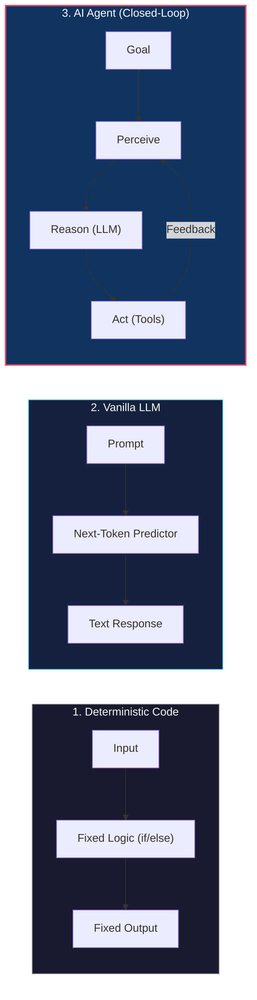
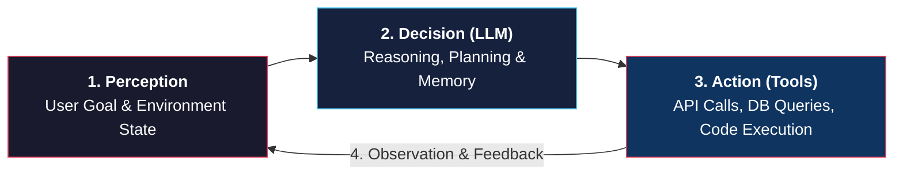

# Introduction to AI Agents and Autonomous Systems

<!-- toc -->

<br/>
<br/>

An **AI Agent** is an autonomous software system that uses a reasoning engine (such as a Large Language Model) to perceive its environment, make decisions, execute actions through external tools, and learn from feedback to achieve a specific goal.

To understand agents, we must first understand how they differ from traditional deterministic software and standard single-turn AI models, explore their fundamental feedback loop, and examine the core taxonomy of agent architectures.

<br/>
<br/>

---

## 1. What is an AI Agent? (The Three Paradigms)

Modern software can be classified into three distinct evolutionary paradigms:

<br/>



<br/>

### 1.1 Deterministic Software (Traditional Code)
- Executes pre-written, hardcoded rules (`if/else`, loops, SQL queries).
- **Analogy:** A calculator. Given $2 + 2$, it will always return $4$. It cannot resolve ambiguity or adapt to unprogrammed scenarios.

<br/>

### 1.2 Vanilla LLM (Single-Turn Completion)
- A statistical next-token predictor (e.g. single ChatGPT prompt).
- **Analogy:** A knowledgeable consultant who answers questions based on training data, but has no hands, cannot inspect live databases, and forgets everything once the conversation ends.
- **Limitation:** Stateless, cannot take actions in the real world, prone to unverified hallucinations.

<br/>

### 1.3 AI Agent (Autonomous Closed-Loop System)
- An LLM equipped with **memory**, **tools**, and a continuous **feedback loop**.
- **Analogy:** A software engineer who receives a bug report, searches the codebase, edits files, runs tests, fixes errors when tests fail, and opens a Pull Request when done.
- **Superpower:** **Self-Correction**. When an action fails, the agent treats the error as an observation and tries an alternative path.

<br/>

### 1.4 Comprehensive Comparison

| Feature | Deterministic Code | Vanilla LLM | AI Agent |
| :--- | :--- | :--- | :--- |
| **Execution Model** | Hardcoded rules & branches | Single-turn statistical generation | Autonomous multi-step goal pursuit |
| **Environment Interaction** | Fixed API calls | None (plain text only) | Dynamic tool selection & execution |
| **State & Memory** | Variables / DB tables | In-context tokens only | Working memory & long-term persistence |
| **Error Recovery** | Hard crash or try/catch | Hallucination | Self-reflection & retry loop |

<br/>
<br/>

---

## 2. The Perception-Decision-Action Feedback Loop

Every AI agent operates on an iterative cycle: **Perception $\rightarrow$ Decision $\rightarrow$ Action $\rightarrow$ Observation**.

<br/>



<br/>

### 2.1 Practical Scenario: Automated Bug Resolution Agent

To see this loop in action, consider an agent tasked with resolving a failing CI test:

1. **Perception (Observe):** The agent reads the CI pipeline log: `Test failed: IndexError in auth_service.py: line 42`.
2. **Decision (Think):** The LLM analyzes the stack trace and determines: *"I need to inspect `auth_service.py` around line 42 to understand why the index was out of bounds."*
3. **Action (Act):** The agent calls the tool `read_file(path="auth_service.py", start_line=35, end_line=50)`.
4. **Observation (Feedback):** The tool returns the source code. The LLM identifies a missing length check on an empty array.
5. **Iteration:** The agent updates its plan, applies a patch via `edit_file`, and runs `run_tests()` to verify the fix.

> **Key Insight:** An agent is not defined by model size, but by its **feedback loop**. The ability to observe the outcome of an action and adapt is what creates autonomous intelligence.

<br/>
<br/>

---

## 3. The 5 Classical Agent Architectures (Russell & Norvig)

In classical artificial intelligence (Russell & Norvig), agents are classified into 5 core architectures based on how they process information and make decisions:

<br/>

### 3.1 Simple Reflex Agent
Acts solely on the current perception using fixed condition-action (`IF-THEN`) rules. It has no memory of past states.
- **Formula:** $a_t = f(o_t)$
- **Real-World Example:** A smart thermostat turning on the heater if $\text{temperature} < 20^\circ\text{C}$.

<br/>

### 3.2 Model-Based Agent
Maintains an internal state (a world model) to track aspects of the environment that cannot be seen right now, remembering what happened previously.
- **Formula:** $s_t = \mathcal{U}(s_{t-1}, a_{t-1}, o_t)$
- **Real-World Example:** A robotic vacuum (Roomba) maintaining a floor map so it knows which rooms have already been cleaned.

<br/>

### 3.3 Goal-Based Agent
Combines state information with a target destination or desired end-state, evaluating multiple action paths to find one that achieves the goal.
- **Formula:** $a_t = \arg\max_{a} \mathcal{P}(\text{Reach Goal} \mid s_t, a)$
- **Real-World Example:** A GPS navigation system calculating routes to reach a specific destination address.

<br/>

### 3.4 Utility-Based Agent
When multiple paths reach the goal, it evaluates trade-offs (cost, speed, reliability) using a utility function ($U$) to find the highest-quality outcome.
- **Formula:** $U(a) = \mathbb{E} \left[ \alpha \cdot \text{Quality}(a) - \beta \cdot \text{Cost}(a) - \gamma \cdot \text{Latency}(a) \right]$
- **Real-World Example:** A flight booking agent selecting a ticket that balances lowest price, minimum layover time, and high airline rating.

<br/>

### 3.5 Learning Agent
Monitors its own performance over time, collects feedback, and updates its future decision-making strategies to continuously improve.
- **Real-World Example:** An AI coding assistant that adapts to developer code reviews and avoids repeating previously flagged patterns.

<br/>
<br/>

---

## 4. Code Architecture: Deterministic Script vs. Autonomous Agent

Below is a minimal Python comparison demonstrating how an autonomous closed-loop agent differs from a traditional script when handling failures:

<br/>

```python
# ==========================================
# 1. Deterministic Script (Fragile)
# ==========================================
def deterministic_fetch(url: str):
    response = make_http_request(url)
    if response.status_code != 200:
        raise Exception("Request failed")  # Hard crash on unexpected failure
    return response.json()


# ==========================================
# 2. Autonomous Agent Loop (Self-Correcting)
# ==========================================
class SimpleAutonomousAgent:
    def __init__(self, llm_client, tools: dict, max_retries: int = 3):
        self.llm = llm_client
        self.tools = tools
        self.max_retries = max_retries
        self.history = []

    def solve_task(self, goal: str) -> str:
        self.history.append({"role": "user", "content": goal})

        for attempt in range(self.max_retries):
            # 1. THINK: Decide next action
            decision = self.llm.decide_action(self.history)
            if decision.is_final_answer:
                return decision.text_answer

            # 2. ACT: Execute tool
            tool_name = decision.tool_name
            tool_args = decision.tool_args
            try:
                result = self.tools[tool_name](**tool_args)
            except Exception as error:
                result = f"Action failed with error: {str(error)}"

            # 3. OBSERVE: Feed error or result back into context for self-correction
            self.history.append({
                "role": "observation",
                "action": tool_name,
                "result": result
            })

        return "Failed: Maximum retries exceeded."
```

<br/>
<br/>

---

## 5. Production Guardrails & Safety

When deploying autonomous agents in production, non-deterministic behaviors must be constrained by defensive engineering principles:

<br/>

```
┌────────────────────────────────────────────────────────────────────────┐
│                        AGENT SAFETY GUARDRAILS                         │
├────────────────────────┬───────────────────────┬───────────────────────┤
│    Least Privilege     │  Sandboxed Execution  │  Human-in-the-Loop    │
│  Scoped API keys with  │  Run shell/code in    │  Require approval for │
│  read-only defaults    │  isolated containers  │  DELETE or payments   │
└────────────────────────┴───────────────────────┴───────────────────────┘
```

<br/>

1. **Principle of Least Privilege (PoLP):** Grant agents the minimum permissions needed. Never expose master `.env` or root database credentials.
2. **Blast Radius Isolation:** Segregate tools into **Safe** (`read_file`, `search_web`) and **Mutating** (`delete_table`, `deploy_prod`). Run mutating commands in isolated container sandboxes.
3. **Human-in-the-Loop (HITL):** Require human confirmation before executing irreversible actions (spending money, sending emails, deleting data).
4. **Circuit Breakers:** Enforce strict iteration limits ($\text{max\\_steps} = 10$) and timeouts to prevent runaway token costs and infinite loops.

<br/>
<br/>

---

## 6. Summary & Key Takeaways

1. **Deterministic vs LLM vs Agent:** Deterministic code follows fixed rules; LLMs generate text; Agents combine LLMs with memory and tools to pursue goals in a closed loop.
2. **Core Loop:** $\text{Perception} \rightarrow \text{Decision} \rightarrow \text{Action} \rightarrow \text{Observation}$.
3. **Self-Correction:** Errors are treated as feedback observations that guide subsequent reasoning steps.
4. **Safety First:** Enforce iteration limits, least privilege, and human approvals on dangerous operations.
