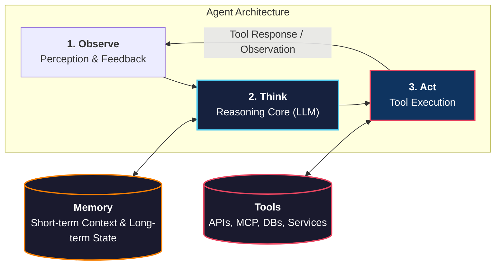
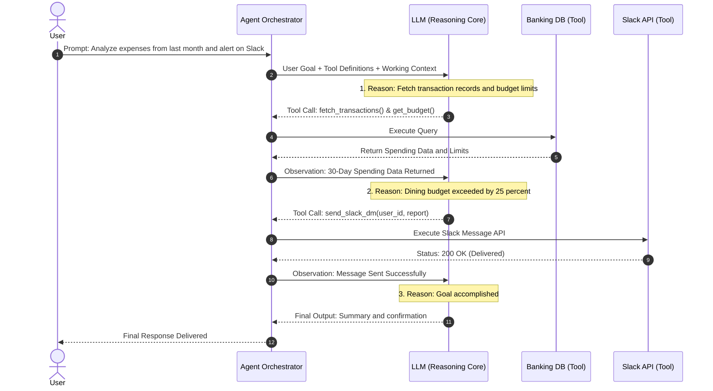

# The Agentic Mindset: LLMs, Tools, and Memory

<!-- toc -->

<br/>
<br/>

An AI Agent is more than just a Large Language Model producing text. It is an active system combining a **Reasoning Core (LLM)**, **Action Capabilities (Tools)**, and **State Persistence (Memory)** inside a continuous **Observe $\rightarrow$ Think $\rightarrow$ Act** loop.

In this session, we break down how these three components interact, walk through a concrete production scenario, implement the core agent loop in Python, and address critical security risks.

<br/>
<br/>

---

## 1. The Core Triad of an AI Agent

An agentic architecture consists of three fundamental pillars:

<br/>



<br/>

### 1.1 The Role of the Large Language Model (The Brain)
- The LLM serves as the **Reasoning Engine** and orchestrator.
- It interprets the user's intent, breaks complex goals into actionable sub-steps (task decomposition), selects appropriate tools, and synthesizes incoming observations into coherent answers.

<br/>

### 1.2 Tools & External Capabilities (The Arms & Legs)
- LLMs are bound to text and limited by their training cutoff. **Tools** give them hands to interact with the real world.
- Tools connect agents to external services via APIs, databases, MCP (Model Context Protocol) servers, or code execution environments.
- The LLM emits structured function calls (e.g. JSON payloads), and the runtime executes them.

<br/>

### 1.3 Memory & State Management (The Context)
- **Short-Term Memory (Working Context):** The active conversation history, current step scratchpad, and immediate tool call outputs residing within the LLM's context window.
- **Long-Term Memory (Persistent Storage):** Historical user preferences, recurring constraints, or external knowledge indexed in vector databases or key-value stores.

<br/>
<br/>

---

## 2. Practical Case Study: Personal Finance & Slack Agent

To see the Observe-Think-Act loop in action, consider the following real-world task:

> **User Prompt:** *"Analyze my expenses from the last month. If any category exceeds my budget, send me a notification on Slack with a summary and savings plan."*

<br/>

### 2.1 Step-by-Step Execution Sequence



<br/>

### 2.2 Key Distinction: Tool vs. Memory

| Dimension | Tool (`fetch_transactions`, `send_slack_dm`) | Memory (Short-Term / Long-Term) |
| :--- | :--- | :--- |
| **Purpose** | Interacting with live external systems & taking actions | Retaining state, preferences, and context across steps |
| **Example in Scenario** | Querying real-time bank transactions; dispatching Slack DM | Remembering the user's spending tolerance and communication preferences |
| **Persistence** | Stateless execution per call | Maintained across loop iterations (Short-Term) or sessions (Long-Term) |

<br/>
<br/>

---

## 3. The Core Agent Loop: Python Implementation

At its architectural core, an agent platform runs a continuous execution loop with defined iteration limits, error handling, and message history management:

<br/>

```python
import json
from typing import Any, Callable, Dict, List

class ProductionAgent:
    """A production-ready minimal Agent Orchestrator demonstrating the Observe-Think-Act loop."""
    
    def __init__(self, llm_client, tools: Dict[str, Callable], max_iterations: int = 5):
        self.llm = llm_client
        self.tools = tools
        self.max_iterations = max_iterations
        self.messages: List[Dict[str, Any]] = []  # Short-Term Memory (Context)

    def run(self, user_goal: str) -> str:
        # 1. OBSERVE: Add user goal to short-term working context
        self.messages.append({"role": "user", "content": user_goal})
        
        for iteration in range(self.max_iterations):
            # 2. THINK: Ask LLM to reason and decide the next action
            response = self.llm.generate_step(
                messages=self.messages, 
                tools=self.get_tool_schemas()
            )
            
            # If the model produces no tool calls, it has reached its final answer
            if not response.tool_calls:
                return response.content

            # 3. ACT: Execute the requested tools within safety boundaries
            for tool_call in response.tool_calls:
                tool_name = tool_call.name
                tool_args = tool_call.arguments
                
                # Check tool authorization and existence
                if tool_name not in self.tools:
                    tool_result = f"Error: Tool '{tool_name}' is not permitted or found."
                else:
                    try:
                        # Sandboxed tool execution
                        tool_result = self.tools[tool_name](**tool_args)
                    except Exception as e:
                        tool_result = f"Tool Execution Failure: {str(e)}"

                # 4. OBSERVE: Append tool observation back into working memory
                self.messages.append({
                    "role": "tool",
                    "tool_call_id": tool_call.id,
                    "content": json.dumps(tool_result) if not isinstance(tool_result, str) else tool_result
                })

        return "Error: Maximum iteration limit reached without resolution (Circuit Breaker triggered)."
```

<br/>
<br/>

---

## 4. Production Security Risks & Defense Strategies

Granting an autonomous agent access to tools and sensitive data introduces distinct security and reliability challenges:

<br/>

### 4.1 Data Leakage & Authorization Boundaries (PII Risk)
- **The Risk:** Financial records, health data, or credentials could be inadvertently leaked if an agent sends a message to an incorrect Slack channel (e.g. posting to `#general` instead of a direct message) or to an unauthorized recipient.
- **Defense:** Enforce **Recipient Whitelisting** and strict Role-Based Access Control (RBAC) at the tool execution boundary. The tool itself must reject invalid target channels regardless of LLM instructions.

<br/>

### 4.2 State Inflation & Context Window Bloat
- **The Risk:** Ingesting large raw API outputs (e.g. 5,000 raw transaction rows) directly into the short-term context rapidly exhausts token budgets and leads to model disorientation ("lost in the middle").
- **Defense:** Implement data reduction, aggregation, or pre-summarization pipelines before appending tool responses to the conversation context.

<br/>

### 4.3 Non-Deterministic Actions & Human-in-the-Loop (HITL)
- **The Risk:** Irreversible, side-effect-heavy actions (e.g. initiating bank transfers, deleting records, emailing clients) cannot be undone if the agent makes an erroneous decision.
- **Defense:** Insert a mandatory **Human-in-the-Loop confirmation gate** for destructive or high-impact tools before execution proceeds.

<br/>
<br/>

---

## 5. Summary & Key Takeaways

1. **LLM as the Reasoning Engine:** The LLM is not merely generating text; it orchestrates planning, tool dispatching, and error recovery.
2. **Tools vs. Memory:** Tools fetch real-time live data and perform external actions; Memory preserves user preferences, history, and state across steps.
3. **The Agent Loop:** Agents iteratively cycle through **Observe $\rightarrow$ Think $\rightarrow$ Act $\rightarrow$ Observe** until the objective is completed or a circuit breaker trips.
4. **Defensive Boundaries:** Enforce tool whitelisting, output sanitization, iteration caps, and human approvals for secure production deployment.
