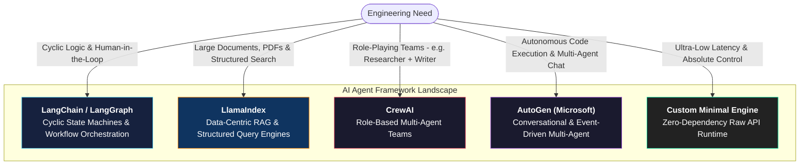
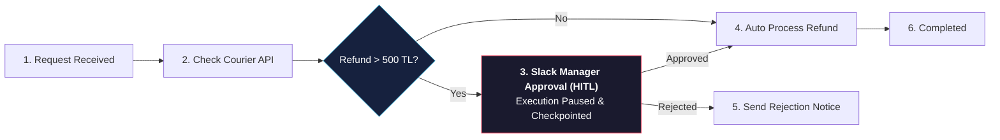

# Popular AI Agent Frameworks

<!-- toc -->

<br/>
<br/>

While the fundamental Observe $\rightarrow$ Think $\rightarrow$ Act loop can be implemented from scratch, modern development relies on specialized frameworks to accelerate prototyping and manage complex workflows. However, every framework is built around distinct architectural philosophies and trade-offs.

In this session, we dissect the core agent frameworks (**LangChain / LangGraph, LlamaIndex, CrewAI, AutoGen**), evaluate concrete case studies, explore code patterns, and establish a decision framework for enterprise architectures.

<br/>
<br/>

---

## 1. The Framework Landscape

Agent frameworks exist to standardize repetitive primitives: prompt templating, tool schema generation, memory persistence, and multi-agent coordination.

<br/>



<br/>
<br/>

---

## 2. Framework Comparison Matrix

| Framework | Core Superpower | Key Limitation | Ideal Use Case |
| :--- | :--- | :--- | :--- |
| **LangGraph / LangChain** | Cyclic state graphs, time-travel debugging, built-in Human-in-the-Loop | High abstraction bloat, steep learning curve | Enterprise state machines, complex workflows, and decision trees |
| **LlamaIndex** | Hierarchical document parsing, hybrid search (BM25 + Dense), citation attribution | Less suited for non-data workflow orchestration | Document search, legal contract analysis, and enterprise knowledge RAG |
| **CrewAI** | Intuitive role-based task delegation (Manager $\rightarrow$ Worker hierarchy) | Heavily reliant on LangChain; harder to enforce deterministic constraints | Collaborative research, content generation, and team simulations |
| **AutoGen** | Dynamic agent-to-agent conversation, code generation, and sandboxed execution | Difficult state observability and production debugging | Autonomous software engineering, automated data science pipelines |
| **Custom Minimal Engine** | Zero dependencies, full transparency, minimal latency, instant debugging | Manual implementation of memory, retries, and tool schemas | High-throughput backend services and mission-critical APIs |

<br/>
<br/>

---

## 3. Deep Dive: Two Core Architectural Paradigms

<br/>

### 3.1 Data-Centric Agents: LlamaIndex (Case Study: Legal Contract Analysis)

> **Scenario:** A law firm needs an AI assistant to analyze a repository of 100,000 pages of legal contracts, identify contradictory clauses, and return exact page-level citations with zero hallucination.

**Why LlamaIndex is the right choice:**
1. **Hierarchical Indexing:** Deconstructs massive PDF corpora into structured nodes with rich metadata (contract date, jurisdiction, clause type).
2. **Hybrid Search & Reranking:** Combines vector similarity with keyword BM25 search and cross-encoder reranking to ensure precise legal term matching.
3. **Citations:** Natively references source nodes and page numbers for strict auditability.

```python
from llama_index.core import VectorStoreIndex, SimpleDirectoryReader
from llama_index.core.tools import QueryEngineTool

# 1. Ingest and hierarchically index the document repository
documents = SimpleDirectoryReader("contracts/").load_data()
index = VectorStoreIndex.from_documents(documents)
query_engine = index.as_query_engine(similarity_top_k=5)

# 2. Package the Query Engine as an Agent Tool
legal_search_tool = QueryEngineTool.from_defaults(
    query_engine=query_engine,
    name="legal_contract_search",
    description="Searches through 100,000 pages of legal contracts and returns verified clauses with citations."
)
```

<br/>

### 3.2 Stateful & Cyclic Workflow Agents: LangGraph (Case Study: E-Commerce Refund Workflow)

> **Scenario:** An e-commerce platform requires an agent to process refund requests, check courier delivery APIs, evaluate refund amounts, and require human manager approval via Slack for refunds over 500 TL.

**Why LangGraph is the right choice:**
1. **State Machine Graph:** Explicit nodes (`CheckCourier`, `EvaluateAmount`, `ProcessRefund`) and conditional edges.
2. **Human-in-the-Loop (HITL) Checkpointing:** Pauses execution and persists state when manager approval is required, resuming smoothly upon webhook callback.

<br/>



<br/>
<br/>

---

## 4. Architectural Decision Tree

When architecting a new AI agent system, follow this decision tree to select the appropriate stack:

<br/>

```
                                [New Agent Project]
                                         │
            ┌────────────────────────────┴────────────────────────────┐
    [Data / Document Heavy?]                                  [Workflow / Process Heavy?]
            │                                                         │
    ┌───────┴───────┐                                         ┌───────┴───────┐
[Simple Search] [Complex RAG/PDFs]                       [Cyclic & HITL]  [Multi-Role Teams]
    │               │                                         │                   │
(LangChain)   (LlamaIndex)                               (LangGraph)       (CrewAI / AutoGen)
```

<br/>
<br/>

---

## 5. Production Hardening & Staff Engineer Insights

1. **The Abstraction Trap:** Convenience wrappers (e.g. `agent.run()`) obscure token consumption, retries, and raw prompt structures. In production, prefer explicit graph nodes or raw tool dispatchers over magic one-liners.
2. **Hybrid Composition:** Enterprise systems rarely use one framework in isolation. A standard pattern is pairing **LlamaIndex** as the data ingestion/retrieval engine with **LangGraph** as the state machine orchestrator.
3. **When to Write Vanilla Code:** If an agent only requires 2–3 deterministic API tools and basic memory, writing a lightweight, zero-dependency Python class (as built in the core agent loop architecture) avoids framework deprecation cycles and dependency vulnerabilities.

<br/>
<br/>

---

## 6. Summary & Key Takeaways

1. **Philosophy Matters:** LlamaIndex centers on **Data & Retrieval**; LangGraph centers on **State & Cyclic Workflows**; CrewAI/AutoGen center on **Multi-Agent Collaboration**.
2. **Data-Centric vs. State-Centric:** Match document-heavy problems with RAG engines and decision-heavy problems with state graphs.
3. **No Silver Bullet:** Use hybrid architectures where appropriate, and default to minimal custom code when ultra-low latency and total transparency are required.
