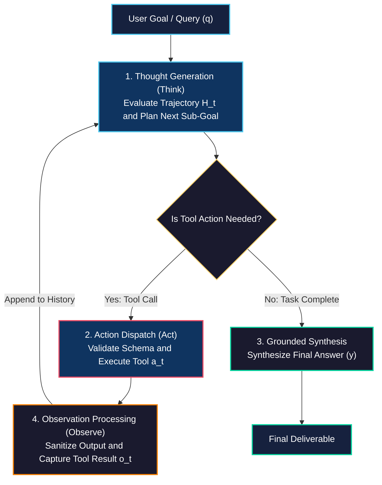
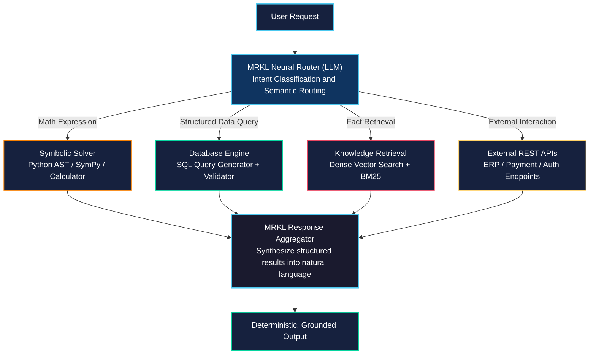
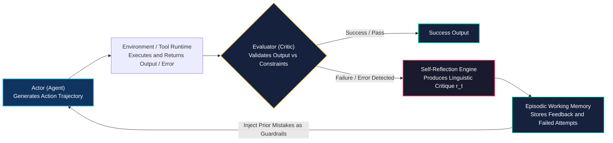

# Agent Architecture: ReAct, MRKL, and Self-Correction

<!-- toc -->

<br/>
<br/>

In the progression from static language model inference to autonomous systems, the agent's **architecture** dictates how effectively it decomposes problems, selects actions, interprets environmental feedback, and recovers from errors. Naive prompting chains quickly degrade when confronted with non-deterministic API responses, schema mismatches, or multi-step logic paths.

This chapter analyzes the three foundational design patterns that power production-grade agentic systems: **ReAct** (*Reason + Act*), **MRKL** (*Modular Reasoning, Knowledge, and Language*), and **Self-Correction / Reflexion** feedback loops. We explore their formal mathematical formulations, execution flowcharts, failure recovery strategies, and provide a concise, representative Python implementation featuring dynamic schema self-healing.

<br/>
<br/>

---

## 1. The Evolution of Agentic Reasoning

Before structured architectures emerged, LLM orchestration relied on two divergent extremes: purely cognitive reasoning (*Chain-of-Thought*) or direct functional execution (*Action-only*). Both paradigms suffer from fundamental structural vulnerabilities in dynamic environments.

<br/>


<br/>

### 1.1 Chain-of-Thought (CoT) vs. Action-Only Vulnerabilities

1. **Chain-of-Thought (Reason Only):** Generates internal reasoning traces without external grounding. While effective for closed-domain symbolic problems, it cannot query live state, verify external constraints, or adapt to environmental changes, resulting in **factual hallucination**.
2. **Action-Only (Direct Tool Invocation):** Dispatches API calls directly based on prompt tokens without maintaining an explicit reasoning scratchpad. It lacks state decomposition and sub-goal tracking, making it fragile when tool outputs are ambiguous, truncated, or malformed.
3. **ReAct Paradigm:** Interleaves linguistic reasoning steps (*"What do I need to know next?"*) with concrete environment interactions (*"Call Search(q)"*), using the resulting observation to update its cognitive state for the subsequent step.

<br/>
<br/>

---

## 2. ReAct (Reason + Act) Architecture

Introduced by *Yao et al. (2022)*, **ReAct** couples language reasoning with action execution in an iterative feedback loop. The reasoning traces allow the model to induce, track, and update action plans, while actions allow it to interface with external knowledge bases and software environments.

<br/>

### 2.1 Formal Mathematical Formulation

Let the agent's task be defined over discrete time steps $t \in \lbrace 1, 2, \dots, T \rbrace$. At each step $t$, the agent receives the current trajectory history:

$$
H_t = \left( q, t_1, a_1, o_1, t_2, a_2, o_2, \dots, t_{t-1}, a_{t-1}, o_{t-1} \right)
$$

where:
* $q$: Initial user query / task objective.
* $t_i \in \mathcal{T}$: Linguistic thought (reasoning trace, sub-goal plan, or reflection) generated from the thought space $\mathcal{T}$.
* $a_i \in \mathcal{A}$: Concrete action dispatched from the tool action space $\mathcal{A} = \mathcal{A}_{\text{tools}} \cup \lbrace \text{finish} \rbrace$.
* $o_i \in \mathcal{O}$: Observation returned by the environment after executing action $a_i$.

<br/>

The agent's policy $\pi_\theta$ alternates between reasoning and action selection conditioned on the execution history $H_t$:

$$
t_t \sim \pi_\theta(\cdot \mid H_t)
$$

$$
a_t \sim \pi_\theta(\cdot \mid H_t, t_t)
$$

$$
o_t = \mathcal{E}(a_t)
$$

$$
H_{t+1} = H_t \circ (t_t, a_t, o_t)
$$

The loop terminates when $a_t = \text{finish}(y)$, where $y$ is the synthesized final response grounded in the trajectory $\mathcal{O}_{1:t}$.

<br/>

### 2.2 ReAct Execution Loop Flowchart

<br/>



<br/>

> **Key Insight:** Thought tokens $t_t$ do not alter external environment state; they act as a working memory scratchpad that guides the search space pruning of subsequent action tokens $a_t$.

<br/>
<br/>

---

## 3. MRKL (Modular Reasoning, Knowledge, and Language)

Coined by *Karpas et al. (AI21 Labs)*, the **MRKL** (*"miracle"*) architecture is a neuro-symbolic framework. It posits that neural language models should not perform arithmetic, database queries, or deterministic logic internally; instead, the LLM functions as a **central cognitive router** dispatching tasks to dedicated symbolic expert modules.

<br/>



<br/>

### 3.1 MRKL vs. ReAct: Architectural Distinctions

| Metric / Dimension | ReAct Architecture | MRKL Architecture |
| :--- | :--- | :--- |
| **Primary Philosophy** | Dynamic, open-ended reasoning and iterative exploration | Neuro-symbolic delegation to specialized expert modules |
| **Routing Pattern** | Autonomous loop: Model decides next tool dynamically at step $t$ | Hierarchical dispatcher: Router selects exact deterministic module |
| **Failure Mode Handling** | Dynamic re-prompting via observation feedback | Fallback routing rules and explicit schema validation per module |
| **Best Suited For** | Deep research, exploratory debugging, multi-hop web queries | Enterprise ERP/CRM, SQL analytics, rigorous financial calculation |

<br/>
<br/>

---

## 4. Self-Correction & Reflexion Mechanics

Autonomous agents operating in production environments encounter runtime exceptions, schema validation errors, and invalid API payloads. **Self-Correction** is the capability of an agent to parse its own execution failures, reflect on the underlying cause, and reformulate its trajectory without crashing the runtime.

<br/>

### 4.1 Taxonomy of Agent Runtime Failures

```
                    ┌──────────────────────────────────────────────┐
                    │            Agent Failure Taxonomy            │
                    └──────────────────────┬───────────────────────┘
                                           │
         ┌─────────────────────────────────┼─────────────────────────────────┐
         ▼                                 ▼                                 ▼
┌───────────────────┐             ┌───────────────────┐             ┌───────────────────┐
│   Syntax & Schema │             │ Environmental &   │             │ Semantic & Logic  │
│   Validation      │             │ System Failures   │             │ Deadlocks         │
├───────────────────┤             ├───────────────────┤             ├───────────────────┤
│ • Invalid JSON    │             │ • Rate limit (429)│             │ • Infinite loop   │
│ • Missing params  │             │ • 500 Server Error│             │ • Hallucinated tool│
│ • Wrong type cast │             │ • Network Timeout │             │ • Contradiction   │
└───────────────────┘             └───────────────────┘             └───────────────────┘
```

<br/>

### 4.2 The Reflexion Closed-Loop Architecture

Introduced by *Shinn et al. (2023)*, **Reflexion** equips agents with dynamic memory and self-reflection capabilities. Instead of updating model weights $\theta$, the agent generates a linguistic critique $r_t \in \mathcal{R}$ of its failed trajectory and persists it into short-term or episodic memory.

<br/>



<br/>

### 4.3 Algorithmic Formulation of Error Recovery

When a tool invocation $a_t = (m, p)$ fails (where $m$ is tool name and $p$ is parameter payload):

1. **Catch & Intercept:** The execution runtime intercepts the exception $e_t$ rather than raising an uncaught crash.
2. **Error Serialization:** The raw stack trace is sanitized and structured into an observation:
   $$
   o_t = \text{ErrorFormat}(\text{type}(e_t), \text{message}(e_t), \text{schema}(m))
   $$
3. **Reflexive Prompt Injection:** The trajectory $H_{t+1}$ is updated with the error observation, prompting the agent to emit a diagnostic thought:
   $$
   t_{t+1} \sim \pi_\theta(\cdot \mid H_t, a_t, o_t, \text{ReflexionPrompt})
   $$

<br/>
<br/>

---

## 5. Representative Implementation: Self-Healing ReAct Engine

Below is a clean, representative Python implementation demonstrating the core **ReAct loop** with **Pydantic schema validation** and **self-healing exception feedback**.

<br/>

```python
from typing import Callable, Dict, Any
from pydantic import BaseModel, Field, ValidationError

class Tool(BaseModel):
    name: str
    description: str
    schema_model: type[BaseModel]
    handler: Callable[..., str]

    def execute(self, payload: Dict[str, Any]) -> str:
        # Step 1: Strict input schema validation
        validated = self.schema_model(**payload)
        return self.handler(**validated.model_dump())


class ReActRuntime:
    """Core execution engine featuring circuit breaker and self-correction."""
    def __init__(self, tools: Dict[str, Tool], max_iterations: int = 5):
        self.tools = tools
        self.max_iterations = max_iterations

    def run_loop(self, goal: str, llm_step_fn: Callable[[str], str]) -> str:
        scratchpad = f"Goal: {goal}\n"

        for step in range(1, self.max_iterations + 1):
            # 1. Generate Thought & Action from LLM
            step_output = llm_step_fn(scratchpad)
            
            if "Final Answer:" in step_output:
                return step_output.split("Final Answer:")[-1].strip()

            # 2. Parse tool name and parameters (e.g. Action: query_db | Input: {...})
            tool_name, params = self._parse_action(step_output)

            # 3. Defensive Dispatch with Self-Correction Feedback
            if tool_name not in self.tools:
                obs = f"Observation: Error: Tool '{tool_name}' not found. Available: {list(self.tools.keys())}"
            else:
                try:
                    res = self.tools[tool_name].execute(params)
                    obs = f"Observation: {res}"
                except ValidationError as ve:
                    obs = f"Observation: SchemaValidationError: {ve.errors()}"
                except Exception as e:
                    obs = f"Observation: ExecutionError: {type(e).__name__}: {str(e)}"

            # 4. Closed-loop state feedback for next iteration
            scratchpad += f"{step_output}\n{obs}\n"

        raise RuntimeError("CircuitBreaker: Agent exceeded maximum iteration limit without convergence.")

    def _parse_action(self, text: str) -> tuple[str, Dict[str, Any]]:
        # Representative parser extracting tool name and JSON arguments
        ...
```

<br/>
<br/>

---

## 6. Architecture Comparison & Production Trade-Offs

Choosing an agent architecture requires balancing **reasoning fidelity**, **token latency**, **API costs**, and **error recovery resilience**.

<br/>

| Architecture | Strengths | Vulnerabilities / Limitations | Best Production Use Case |
| :--- | :--- | :--- | :--- |
| **ReAct** | High adaptability; clear explainability trace; continuous grounding against real-world observations. | High token consumption; risk of infinite loops without circuit breakers; serial latency bottlenecks. | Interactive troubleshooting, research assistants, exploratory web tasks. |
| **MRKL** | Deterministic reliability; strict schema compliance; offloads compute from LLM to dedicated symbolic engines. | Less flexible for novel, unmapped tasks; requires explicit expert tool engineering. | Enterprise data analytics, financial math solvers, SQL reporting dashboards. |
| **Plan-and-Solve** | Decomposes total goal upfront into a static sub-task DAG; enables parallel tool execution. | Fragile to intermediate step failures unless paired with dynamic replanning. | ETL pipelines, bulk report generation, static code generation workflows. |
| **Reflexion** | Learns from failure within episodic memory; self-heals syntax, schema, and logical errors without human intervention. | Multiplies inference cost and latency; requires robust evaluation / critic signals. | Code generation, automated test fixing, self-healing data scrapers. |

<br/>
<br/>

---

## 7. Key Architectural Takeaways

1. **ReAct unifies cognitive planning and environment state:** The interleaving of $t_t$ (thoughts) and $a_t$ (actions) prevents both the blind hallucinations of CoT and the brittle execution errors of Action-only agents.
2. **Deterministic tasks belong in symbolic modules:** Following MRKL, models should never calculate arithmetic or simulate SQL joins internally; they should act as intelligent dispatch routers.
3. **Self-Correction requires explicit error feedback:** Catching exceptions and feeding structured error traces back into the agent's observation scratchpad converts runtime crashes into self-healing recovery loops.
