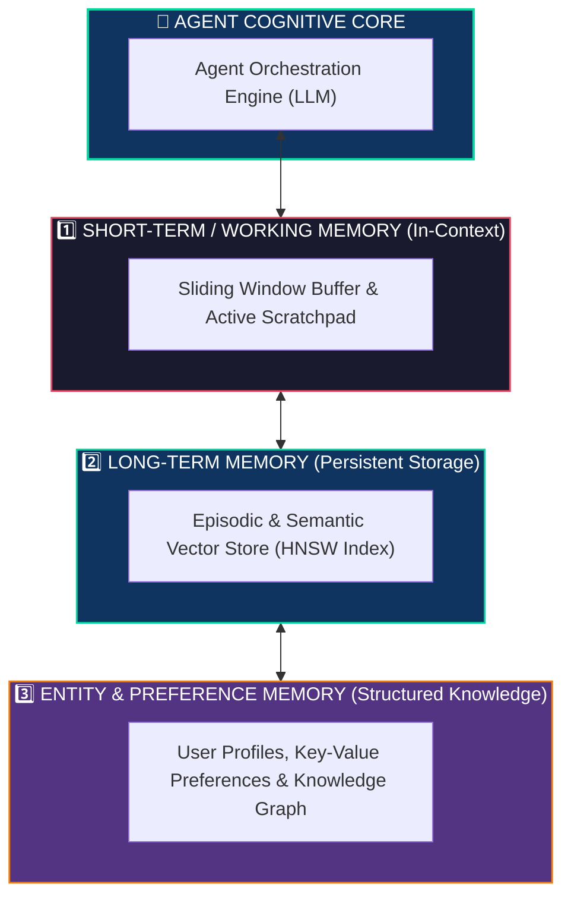
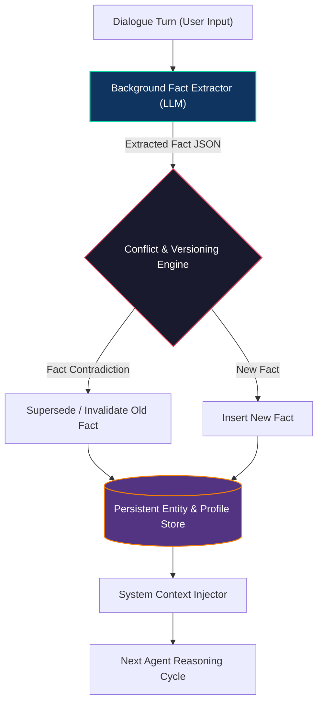

# Memory and State Management in Autonomous Agents

<!-- toc -->

<br/>
<br/>

Large language models operate as stateless mathematical functions: each forward inference pass transforms an input token sequence into an output probability distribution without persisting internal state across invocations. In autonomous multi-turn systems, treating an agent as a purely stateless predictor causes catastrophic amnesia—the agent forgets prior constraints, re-executes redundant API calls, and fails to maintain long-term user alignment.

To transition from transient prompt execution to enduring autonomous intelligence, an agent requires a structured **Memory and State Management Architecture**. This chapter formalizes cognitive memory taxonomy, analyzes short-term context compression mechanics, explores multi-factor vector retrieval mathematics, and provides resilient state persistence patterns for production environments.

<br/>
<br/>

---

## 1. The Cognitive Memory Taxonomy

Modern autonomous systems implement a hierarchical, multi-tiered memory architecture analogous to human cognitive processing.

<br/>



<br/>

### 1.1 Memory Tier Characteristics

| Memory Tier | Storage Medium | Retention Horizon | Latency | Primary Architectural Purpose |
|---|---|---|---|---|
| **Short-Term (Working)** | LLM Context Window / RAM | Single session / Immediate trajectory | Sub-millisecond | Immediate reasoning scratchpad, dialogue turn tracking |
| **Episodic (Long-Term)** | Append-only Document Store / Vector DB | Days to Months | $10\text{ms} - 50\text{ms}$ | Recalling past task executions, error recovery history |
| **Semantic (Long-Term)** | Dense Vector Store (HNSW / IVF) | Permanent | $5\text{ms} - 30\text{ms}$ | Domain knowledge retrieval, factual knowledge grounding |
| **Entity / Preference** | Relational DB / Redis / Graph Store | Permanent | $1\text{ms} - 10\text{ms}$ | User persona, environment settings, explicit constraints |

<br/>
<br/>

---

## 2. Short-Term Working Memory & Context Optimization

The fundamental constraint of short-term memory is the model's finite context budget ($N$ tokens). Accumulating unbounded raw dialogue history leads to quadratic self-attention compute costs, context exhaustion, and cognitive distraction.

<br/>

### 2.1 Compression Strategies: Sliding Window vs. Summary Buffer

1. **Fixed Sliding Window ($k$-turn FIFO):** Retains only the most recent $k$ interaction turns. While computationally bounded, it suffers from total historical amnesia regarding initial system instructions or early user constraints.
2. **Token-Budgeted Summary Buffer:** Partitions the context budget into a volatile recent window and a compacted historical summary:

$$
\mathcal{C}(t) = \text{SystemPrompt} \cup \text{Summary}(m_{1:t-k}) \cup \{ m_{t-k+1:t} \}
$$

When cumulative tokens exceed the designated threshold, an asynchronous background task summarizes the overflow messages and updates the running summary state.

<br/>

### 2.2 State Checkpointing in Multi-Turn Graphs

For fault-tolerant distributed execution, agent state must be explicitly serialized at every discrete step transition:

$$
S(t) = \langle \text{SessionID}, \text{StepIndex}, \text{Messages}, \text{ToolCalls}, \text{Artifacts}, \text{NextNode} \rangle
$$

Checkpointing into persistent storage (e.g., PostgreSQL or Redis) enables crash recovery, time-travel debugging, and multi-day asynchronous workflows.

<br/>
<br/>

---

## 3. Long-Term Vector Memory & Semantic Retrieval

Long-term semantic memory stores dense vector representations of past experiences, documents, and tool executions.

<br/>

### 3.1 Vector Similarity & Approximate Nearest Neighbors (ANN)

Text items $m$ are transformed via an embedding model $E(m) \in \mathbb{R}^d$ into a $d$-dimensional vector space. Semantic relevance between a query $q$ and a stored memory vector $v_m$ is evaluated via cosine similarity:

$$
\text{Sim}(q, m) = \frac{E(q) \cdot E(m)}{\|E(q)\| \cdot \|E(m)\|}
$$

High-throughput retrieval over millions of records leverages **Hierarchical Navigable Small World (HNSW)** graph indexing to achieve sub-linear $O(\log N)$ search latency.

<br/>

### 3.2 Multi-Factor Memory Retrieval Scoring

Semantic similarity alone is insufficient for realistic human-agent collaboration. Production memory engines (*Generative Agents paradigm*) compute a composite retrieval score combining **Relevance**, **Recency Decay**, and **Importance**:

$$
\text{Score}(m) = \alpha \cdot \text{Relevance}(q, m) + \beta \cdot \text{Recency}(m) + \gamma \cdot \text{Importance}(m)
$$

where:
* **Recency Decay:** Exponential decay function modeling memory degradation over elapsed time:
  $$
  \text{Recency}(m) = \exp(-\lambda \cdot \Delta t)
  $$
* **Importance Weight:** Scalar rating $\text{Importance}(m) \in [0, 1]$ generated by an LLM evaluator upon memory ingestion.
* $\alpha, \beta, \gamma \in [0, 1]$ are hyperparameter weights normalized such that $\alpha + \beta + \gamma = 1$.


<br/>
<br/>

---

## 4. Entity Memory, Fact Extraction & Conflict Resolution

Long-term user alignment requires tracking structured entity attributes (e.g., preferred tech stack, timezone, architectural constraints) across sessions.

<br/>



<br/>

### 4.1 Invalidation and Superseding Strategies

When a user updates a previously stated preference (e.g., *"I migrated our backend from Flask to FastAPI"*), naive RAG will retrieve both conflicting statements. To resolve contradictions:
1. **Categorical Keying:** Group facts under structured slots (`domain: backend_framework`).
2. **Temporal Superseding:** When a new fact targeting an existing slot is extracted, mark the prior entry as `status = "superseded"` with a pointer to the replacement entity ID.

<br/>
<br/>

---

## 5. End-to-End Implementation: Resilient Hybrid Memory Engine

Below is a concise, representative Python implementation demonstrating a token-budgeted sliding window memory engine coupled with composite scored retrieval.

<br/>

```python
import math, time
from typing import List, Dict, Optional

class HybridMemoryEngine:
    """Manages short-term sliding window and scored long-term memory retrieval."""
    def __init__(self, window_size: int = 4, decay_lambda: float = 0.01):
        self.window_size = window_size
        self.decay_lambda = decay_lambda
        self.recent_buffer: List[Dict[str, str]] = []
        self.long_term_store: List[Dict] = []  # [{text, embedding_sim, importance, timestamp}]

    def add_turn(self, role: str, content: str, importance: float = 0.5) -> None:
        self.recent_buffer.append({"role": role, "content": content})
        self.long_term_store.append({
            "text": f"{role}: {content}",
            "importance": importance,
            "timestamp": time.time()
        })

    def retrieve_relevant_memories(self, query_sims: List[float], top_k: int = 2) -> List[str]:
        now = time.time()
        scored_memories = []
        for item, sim in zip(self.long_term_store, query_sims):
            delta_t = (now - item["timestamp"]) / 3600.0  # Hours elapsed
            recency = math.exp(-self.decay_lambda * delta_t)
            score = (0.5 * sim) + (0.3 * recency) + (0.2 * item["importance"])
            scored_memories.append((score, item["text"]))
        
        scored_memories.sort(key=lambda x: x[0], reverse=True)
        return [text for _, text in scored_memories[:top_k]]

    def get_working_context(self) -> List[Dict[str, str]]:
        return self.recent_buffer[-self.window_size:]
```

<br/>
<br/>

---

## 6. Official Challenges & Architectural Solutions

Below are the official engineering challenges and in-depth architectural solutions for Memory & State Management.

<br/>

<details>
  <summary><strong>Challenge 1: Conceptual — Vector Stores for Long-Term Agent Memory</strong></summary>
  <br/>

  ### Problem Statement
  *Explain the concept of a vector store and why it is useful for long-term memory in AI agents compared to traditional relational/NoSQL databases.*

  ### Architectural Solution & Analysis
  Traditional relational (SQL) and document (NoSQL) databases operate on exact matches or lexical keyword filtering (e.g., BM25). They fail when a query shares semantic intent but lacks lexical overlap (e.g., *"How did we fix the database bottleneck?"* vs. *"Applied connection pooling and query indexing"*).

  A **Vector Store** indexes high-dimensional dense embeddings ($E(m) \in \mathbb{R}^d$) generated by deep neural networks. By mapping text into continuous latent space, it enables:
  1. **Semantic Association:** Retrieves concepts based on conceptual proximity ($\cos(\theta)$), overcoming terminology variations.
  2. **Sub-linear Retrieval:** Uses Approximate Nearest Neighbor (ANN) graph algorithms (HNSW, IVF-PQ) to query millions of past memory nodes in under $15\text{ms}$.
  3. **Multi-Modal Memory:** Bridges text, code diffs, execution logs, and image descriptions within a unified vector embedding space.
</details>

<br/>

<details>
  <summary><strong>Challenge 2: Practical — Token-Budgeted Conversation Memory Architecture</strong></summary>
  <br/>

  ### Problem Statement
  *Write the Python code to add resilient conversation history and state management to an agent, balancing raw recent messages with periodic background summarization.*

  ### Architectural Solution & Code
  The implementation maintains a fixed window of raw recent turns for conversational nuance while compressing overflow messages into a structured running summary.

  ```python
  from typing import List, Dict

  class ConversationBufferSummaryMemory:
      """Sliding window memory with dynamic summarization threshold."""
      def __init__(self, max_raw_turns: int = 4):
          self.max_raw_turns = max_raw_turns
          self.history: List[Dict[str, str]] = []
          self.summary: str = ""

      def append(self, role: str, content: str) -> None:
          self.history.append({"role": role, "content": content})
          if len(self.history) > self.max_raw_turns * 2:
              self._evict_and_summarize()

      def _evict_and_summarize(self) -> None:
          to_condense = self.history[:-self.max_raw_turns]
          self.history = self.history[-self.max_raw_turns:]
          condensed_text = " | ".join(f"{m['role']}: {m['content']}" for m in to_condense)
          # Representative compression (in production, invoke background LLM chain)
          self.summary += f" [Prior Summary: {condensed_text[:80]}...]"

      def compile_context(self) -> List[Dict[str, str]]:
          messages = []
          if self.summary:
              messages.append({"role": "system", "content": f"Executive Summary of Previous Dialogue: {self.summary}"})
          messages.extend(self.history)
          return messages
  ```
</details>

<br/>

<details>
  <summary><strong>Challenge 3: Design — Long-Term User Preference Memory System</strong></summary>
  <br/>

  ### Problem Statement
  *Design a scalable memory system for an agent that needs to remember user preferences over months, handle evolving habits, and resolve contradicting facts.*

  ### Architectural Solution & System Design
  A production-grade user preference engine requires a structured multi-stage pipeline:

  ```mermaid
  flowchart TD
      UserMessage["User Dialogue Input"] --> FactExtractor["Asynchronous LLM Fact Extractor"]
      FactExtractor -->|Extracted Slot JSON| Deduplicator{"Entity Graph & Conflict Resolver"}
      
      Deduplicator -->|Contradiction Found| Archive["Mark Old Fact: Superseded"]
      Deduplicator -->|New Attribute| Insert["Store Fact in Profile DB (PostgreSQL / Redis)"]
      
      Archive --> VectorSync[("Dense Vector Store (HNSW Index)")]
      Insert --> VectorSync
      
      VectorSync --> CompositeSearch["Composite Retrieval Engine (Score = Sim + Decay + Imp)"]
      CompositeSearch --> AgentPrompt["Injected System Context / Persona"]

      style FactExtractor fill:#0f3460,stroke:#06d6a0,stroke-width:1.5px,color:#fff
      style Deduplicator fill:#1a1a2e,stroke:#e94560,stroke-width:1.5px,color:#fff
      style CompositeSearch fill:#533483,stroke:#f77f00,stroke-width:1.5px,color:#fff
  ```

  #### Architectural Pillars:
  1. **Asynchronous Fact Extraction:** Runs out-of-band via background worker to extract structured slots (e.g., `{"slot": "editor_preference", "val": "Neovim", "confidence": 0.95}`).
  2. **Deterministic Conflict Resolution:** If slot `editor_preference` already exists with value `VSCode`, update status of prior entry to `superseded` with timestamp auditing.
  3. **Multi-Factor Scored Retrieval:** Injects only the top-$k$ relevant user preferences at session initialization using the composite scoring formula $\text{Score} = \alpha \cdot \text{Relevance} + \beta \cdot \text{Recency} + \gamma \cdot \text{Importance}$.
</details>
