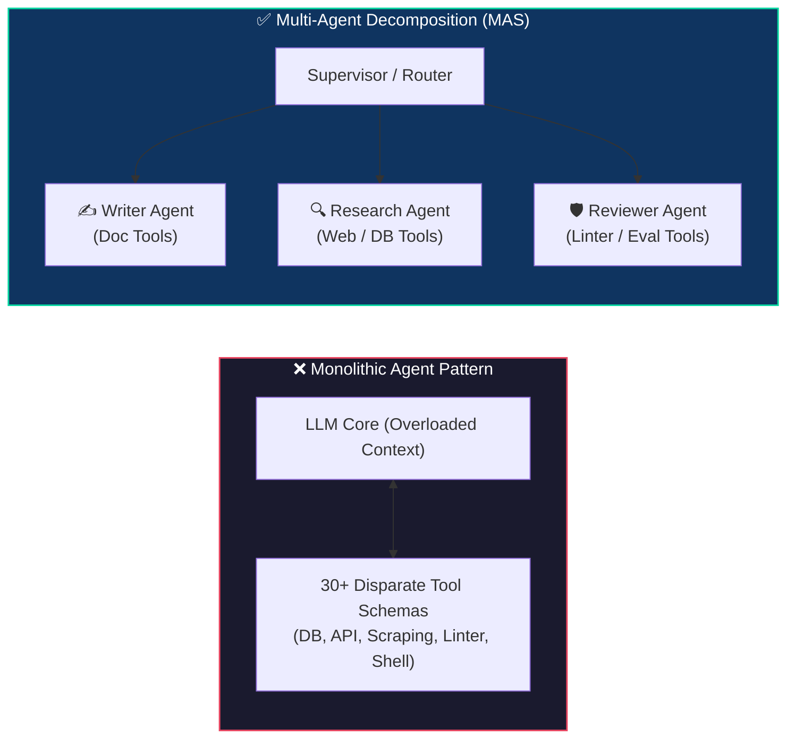
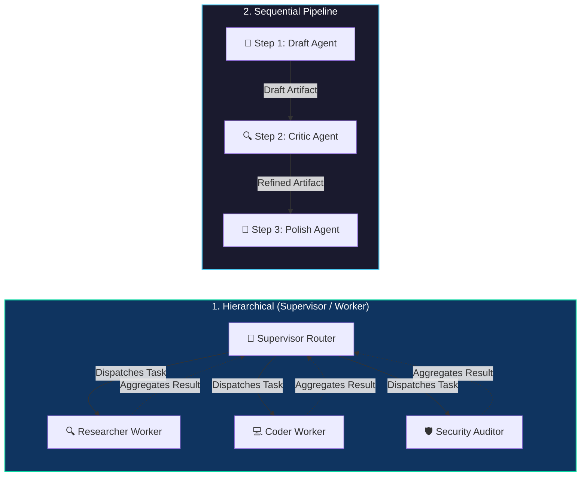
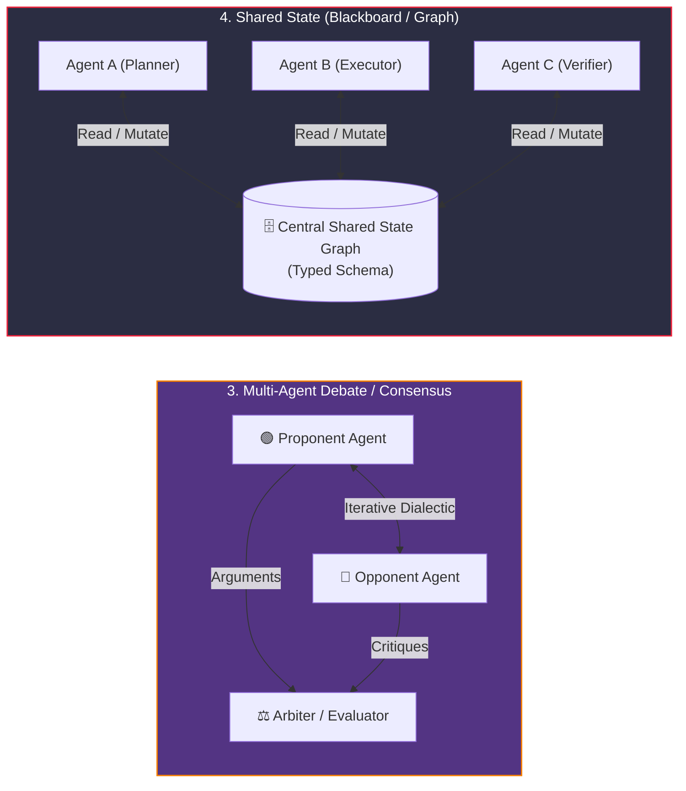

# Building Multi-Agent Systems: Collaborative & Hierarchical Architectures

<!-- toc -->

<br/>
<br/>

Monolithic agent architectures—where a single large language model attempts to manage planning, tool selection across dozens of disparate APIs, dialogue history, and error recovery within a single context window—inevitably encounter cognitive degradation. As the cardinality of available tools and instructions grows, prompt attention distributes across irrelevant tokens, leading to tool selection errors, instruction drift, and exponential token expenditure.

To engineer robust, production-grade autonomous intelligence for complex workflows, modern system architecture transitions from monolithic agents to **Multi-Agent Systems (MAS)**. In a multi-agent topology, complex business processes are decomposed across specialized, role-conditioned autonomous units that collaborate through structured communication protocols, isolated memory contexts, and deterministic state transitions. This chapter formalizes multi-agent coordination topologies, establishes message-passing mathematics, evaluates production frameworks, and provides resilient state synchronization patterns.

<br/>
<br/>

---

## 1. Decomposing Monolithic Agents into Multi-Agent Networks

A monolithic agent functions as a centralized optimizer attempting to solve an entire multi-objective problem:

<br/>

$$
\max_{a \in \mathcal{A}} \mathbb{E} \left[ R(s, a) \right]
$$

<br/>

where $|\mathcal{A}|$ represents the total set of all available tools across the system. When $|\mathcal{A}| \gg 10$, the probability of suboptimal action selection increases due to attention dilution over large prompt schemas.

In contrast, a Multi-Agent System applies the principle of **Separation of Concerns (SoC)** by partitioning the global action space and task domain into $K$ specialized sub-agents:

<br/>

$$
\mathcal{A} = \bigcup_{k=1}^K \mathcal{A}_k, \quad \text{where } \mathcal{A}_i \cap \mathcal{A}_j \approx \emptyset
$$

<br/>

Each agent $A_k$ operates within a dedicated context window $\mathcal{C}_k$, conditioned on a specialized persona prompt $\mathcal{P}_k$, a minimal tool schema $\mathcal{T}_k$, and an isolated local working memory $\mathcal{M}_k$.

<br/>



<br/>

### 1.1 Architectural Benefits of Multi-Agent Specialization

1. **Context Window Isolation:** Intermediate scratchpads and verbose raw tool outputs (e.g., 50KB HTTP responses) remain contained inside the worker agent's context and are synthesized before returning to the parent graph.
2. **Specialized Model Routing:** Distinct agents can execute on distinct underlying LLM engines (e.g., lightweight fast models for data parsing, frontier reasoning models for strategic orchestration).
3. **Deterministic Unit Testing:** Individual agent nodes can be isolated, mocked, and benchmarked independently against domain-specific evaluation datasets.
4. **Fine-Grained Security & Least Privilege:** API credentials and dangerous tool access (e.g., database write access, bash execution) are restricted exclusively to authorized worker agents.

<br/>
<br/>

---

## 2. Multi-Agent Coordination Topologies

The structural routing of information and decision authority defines the system's execution topology. Production multi-agent architectures implement four distinct communication patterns.

<br/>

### 2.1 Centralized & Directed Topologies

<br/>



<br/>
<br/>

### 2.2 Collaborative & Shared State Topologies

<br/>



<br/>
<br/>

### 2.3 Topology Comparison & Operational Trade-offs

| Coordination Topology | Control Mechanism | Context Isolation | Token Complexity | Optimal Production Use Case |
|---|---|---|---|---|
| **Hierarchical (Supervisor)** | Central router agent dynamically assigns tasks and aggregates output | High (Workers share no internal scratchpad with peers) | $\mathcal{O}(K \cdot T)$ (Linear in worker count) | Heterogeneous workflows, dynamic sub-task decomposition, broad research |
| **Sequential Pipeline** | Deterministic directed acyclic graph ($A \to B \to C$) | Moderate (Each stage consumes preceding output) | $\mathcal{O}(K)$ (Proportional to pipeline depth) | Content publishing, CI/CD code generation, multi-stage data ETL |
| **Debate / Consensus** | Dialectical multi-turn dialogue with final adjudication | Low (Shared transcript between debaters) | $\mathcal{O}(N_{\text{turns}} \cdot K^2)$ (Quadratic in agent interaction) | Fact-checking, high-stakes financial analysis, medical diagnostic review |
| **Blackboard (Shared State)** | Event-driven pub/sub reads and writes to a central typed state | High (Explicit schema contracts govern shared keys) | $\mathcal{O}(K \cdot \Delta S)$ (Proportional to state updates) | LangGraph production state machines, game simulations, complex robotics |

<br/>
<br/>

---

## 3. Formal Mathematical Framework & Message Passing

A Multi-Agent System can be formally defined as a directed coordination graph:

<br/>

$$
\mathcal{G} = (\mathcal{V}, \mathcal{E}, \mathcal{S})
$$

<br/>

Where:
* $\mathcal{V} = \{A_1, A_2, \dots, A_n\}$ denotes the set of autonomous agents. Each agent $A_i$ is characterized by a tuple $A_i = \langle \mathcal{P}_i, \mathcal{T}_i, \mathcal{M}_i, f_i \rangle$, where $\mathcal{P}_i$ is the persona prompt, $\mathcal{T}_i$ is the localized toolset, $\mathcal{M}_i$ is private memory, and $f_i$ is the policy model.
* $\mathcal{E} \subseteq \mathcal{V} \times \mathcal{V}$ represents permitted directed communication channels between agent nodes.
* $\mathcal{S}(t)$ is the shared state vector at discrete time step $t$.

<br/>

### 3.1 State Transitions & Message Propagation

When agent $A_i$ executes at step $t$, it generates an outbound message $m_{i \to j}(t)$ targeted to recipient agent $A_j$:

<br/>

$$
m_{i \to j}(t) = f_i(\Pi_i(\mathcal{S}(t)), \mathcal{M}_i(t), \mathcal{P}_i)
$$

<br/>

where $\Pi_i(\mathcal{S}(t))$ represents the projection function filtering the global state to only the fields authorized for $A_i$.

The global state evolves deterministically according to a transition reducer function $\Gamma$:

<br/>

$$
\mathcal{S}(t+1) = \Gamma\left(\mathcal{S}(t), \bigcup_{(i,j) \in \mathcal{E}} m_{i \to j}(t)\right)
$$

<br/>

### 3.2 Dynamic Termination & Deadlock Prevention

In autonomous cyclic graphs, preventing non-terminating ping-pong loops requires an explicit termination boundary function $\tau$:

<br/>

$$
\tau(\mathcal{S}(t)) = 
\begin{cases} 
\text{TERMINATE} & \text{if } \text{QualityScore}(\mathcal{S}(t)) \ge \theta \\\\
\text{ESCALATE} & \text{if } t \ge T_{\max} \quad (\text{Circuit Breaker}) \\\\
\text{CONTINUE} & \text{otherwise}
\end{cases}
$$

<br/>

> **Key Architectural Insight:** Never rely on autonomous agent consensus alone for cycle termination. Always enforce a hard mathematical circuit breaker ($t \ge T_{\max}$) to prevent runaway token costs and infinite feedback deadlocks.

<br/>
<br/>

---

## 4. Resilient Implementation: Supervisor & Worker StateGraph

Below is a production-grade, representative implementation of a Hierarchical Multi-Agent System using typed shared state and structured routing decisions.

<br/>

```python
from typing import TypedDict, List, Dict, Optional, Literal
from pydantic import BaseModel, Field

class GlobalAgentState(TypedDict):
    objective: str
    task_breakdown: List[str]
    worker_artifacts: Dict[str, str]
    supervisor_feedback: str
    iteration_count: int
    max_iterations: int
    is_complete: bool

class SupervisorRoutingDecision(BaseModel):
    next_node: Literal["researcher", "coder", "auditor", "FINISH"] = Field(
        description="Target specialized agent node or FINISH if objective is met."
    )
    directive: str = Field(description="Precise, unambiguous instructions for the selected worker.")
    quality_score: float = Field(ge=0.0, le=10.0, description="Evaluated artifact quality score.")

def supervisor_router(state: GlobalAgentState, llm) -> Dict[str, any]:
    """Evaluates aggregate state and routes execution dynamically."""
    if state["iteration_count"] >= state["max_iterations"]:
        return {"is_complete": True, "next_node": "FINISH"}

    structured_evaluator = llm.with_structured_output(SupervisorRoutingDecision)
    decision: SupervisorRoutingDecision = structured_evaluator.invoke(
        f"Objective: {state['objective']}\nArtifacts: {state['worker_artifacts']}\n"
        f"Prior Feedback: {state['supervisor_feedback']}"
    )

    if decision.quality_score >= 8.5 or decision.next_node == "FINISH":
        return {"is_complete": True, "next_node": "FINISH"}

    return {
        "supervisor_feedback": decision.directive,
        "next_node": decision.next_node,
        "iteration_count": state["iteration_count"] + 1,
    }
```

<br/>
<br/>

---

## 5. Multi-Agent Framework Landscape & Evaluation Matrix

Modern enterprise development utilizes dedicated orchestration frameworks to govern agent swarms.

<br/>

| Framework | Core Paradigm | State Architecture | Flow Control | Primary Strength |
|---|---|---|---|---|
| **LangGraph** | Cyclic Directed Graphs | Centralized TypedDict / Pydantic State | Graph edges, conditional routers, checkpointers | Complete deterministic control, human-in-the-loop, time-travel debugging |
| **CrewAI** | Role-Playing Autonomous Crews | Task-centric memory and context passing | Sequential or Hierarchical manager processes | Rapid prototyping, intuitive persona modeling, built-in task delegation |
| **AutoGen / AG2** | Conversational Multi-Agent Networks | Multi-turn dialogue event bus | Asynchronous conversation loops | Flexible peer-to-peer debate, code execution sandboxes |
| **OpenAI Swarm** | Lightweight Routine Handoffs | Stateless execution with function context | Explicit client-side agent transfers | Ultra-low overhead, minimal abstractions, direct developer visibility |

<br/>
<br/>

---

## 6. Official Challenges & Architectural Solutions

<br/>

<details>
  <summary><strong>Challenge 1: Design — Multi-Agent Scriptwriting Studio (Screenwriter, Director, Producer)</strong></summary>
  <br/>

  ### Problem Statement
  *Design a collaborative multi-agent architecture for writing high-quality movie scripts, coordinating three distinct roles: Screenwriter (narrative/dialogue), Director (visual pacing/tone), and Producer (budgetary constraints and commercial feasibility).*

  ### Architectural Solution & System Design
  To prevent creative-budgetary deadlocks, the system implements a **Hierarchical Feedback Loop** where the Producer acts as the executive supervisor and gatekeeper.

  <br/>

  ```mermaid
  flowchart TD
      Start["Project Brief & Logline"] --> ProdInit["Producer Agent: Set Budget Constraints & Milestones"]
      ProdInit --> Screenwriter["Screenwriter Agent: Draft Scene & Dialogue"]
      
      Screenwriter --> DirReview["Director Agent: Visual Tone & Dramatic Arc"]
      Screenwriter --> ProdReview["Producer Agent: Budget & Production Feasibility"]
      
      DirReview --> Consolidator["Producer Gatekeeper & Scoring"]
      ProdReview --> Consolidator
      
      Consolidator -->|Revision Needed| Screenwriter
      Consolidator -->|Approved or Max Turns Reached| Packager["Final Script Bundle Published"]

      style ProdInit fill:#0f3460,stroke:#06d6a0,stroke-width:1.5px,color:#fff
      style Screenwriter fill:#1a1a2e,stroke:#4cc9f0,stroke-width:1.5px,color:#fff
      style Consolidator fill:#533483,stroke:#f77f00,stroke-width:1.5px,color:#fff
      style Packager fill:#06d6a0,stroke:#0f3460,stroke-width:1.5px,color:#000
  ```

  <br/>

  #### Shared State Specification:
  ```python
  class ScriptProductionState(TypedDict):
      logline: str
      budget_ceiling_usd: int
      script_draft: str
      director_critique: str
      producer_audit: str
      feasibility_score: float
      artistic_score: float
      is_approved: bool
      revision_count: int
      max_revisions: int
  ```

  #### Key Trade-offs:
  * **Deadlock Mitigation:** If the Director requests a \$50M VFX sequence while the Producer requires low-budget realism, the Producer Gatekeeper enforces the hard constraint before passing feedback back to the Screenwriter.
  * **Circuit Breaker:** If `revision_count >= 3`, the loop terminates and delivers the highest-scoring draft to a human showrunner.
</details>

<br/>

<details>
  <summary><strong>Challenge 2: Implementation — Framework Selection Trade-Offs (LangGraph vs. CrewAI vs. AutoGen)</strong></summary>
  <br/>

  ### Problem Statement
  *Analyze and compare the implementation architectures of leading multi-agent frameworks. When should a staff engineer select LangGraph over CrewAI or AutoGen for mission-critical production systems?*

  ### Architectural Analysis & Decision Framework

  <br/>

  ```mermaid
  flowchart LR
      Req{"Project Requirements"}
      Req -->|Deterministic SLA, Exact Graph Routing, Strict State Control| LG["Use LangGraph"]
      Req -->|Rapid Persona Prototyping, Autonomous Task Delegation| CA["Use CrewAI"]
      Req -->|Open-Ended Conversational Debate, Group Chat Simulation| AG["Use AutoGen"]

      style LG fill:#0f3460,stroke:#06d6a0,stroke-width:1.5px,color:#fff
      style CA fill:#1a1a2e,stroke:#4cc9f0,stroke-width:1.5px,color:#fff
      style AG fill:#533483,stroke:#f77f00,stroke-width:1.5px,color:#fff
  ```

  <br/>

  #### Detailed Framework Matrix:
  1. **LangGraph (Recommended for Enterprise Backends):**
     * **Graph-as-Code:** Models multi-agent interactions as explicit state graphs with typed reducers.
     * **Production Resilience:** Built-in persistence checkpoints support long-running asynchronous human approvals and fault recovery.
  2. **CrewAI (Recommended for Content & Business Automation):**
     * **High-Level Abstraction:** Defines high-level agents with `role`, `backstory`, and `goal`. Excellent for fast setup but offers less granular control over step-level state mutations.
  3. **AutoGen / AG2 (Recommended for Simulation & Research):**
     * **Conversational Swarms:** Agents communicate via free-form multi-party chat. High flexibility, but susceptible to non-deterministic loops if conversational boundaries are not strictly constrained.
</details>

<br/>

<details>
  <summary><strong>Challenge 3: Operations & Reliability — Mitigating Runaway Token Explosion and Infinite Loops</strong></summary>
  <br/>

  ### Problem Statement
  *Identify the primary failure modes in autonomous multi-agent systems and establish engineering guardrails to prevent infinite critique loops, cascading hallucinations, and runaway API billing.*

  ### Architectural Mitigation Blueprint

  #### 1. Preventing Ping-Pong Deadlocks:
  * **Asymmetric Critique Authority:** Establish a clear hierarchy where worker agents cannot debate endlessly; a designated supervisor makes unilateral termination calls.
  * **Delta Convergence Monitoring:** If consecutive revisions yield artifact edit distances below an epsilon threshold ($\Delta S < \epsilon$), force termination as diminishing returns have been reached.

  #### 2. Cascading Hallucination Containment:
  * **Inter-Agent Schema Validation:** Never pass unstructured natural language outputs between downstream workers. Use strict Pydantic schemas with runtime validation to verify assertions, links, and tool outputs before state merging.

  #### 3. Token runaway Protection:
  * **Context Synthesis on Edge Crossing:** When an agent transitions control back to the supervisor, its raw tool execution history is compressed into an executive summary, keeping global state token complexity bounded at $\mathcal{O}(K)$ rather than $\mathcal{O}(K \cdot T^2)$.
</details>
