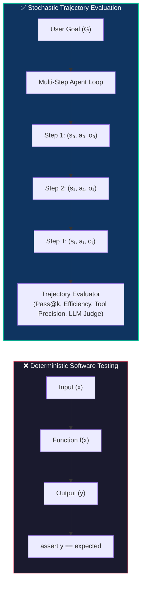
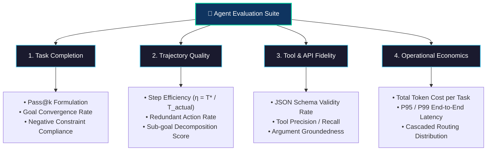
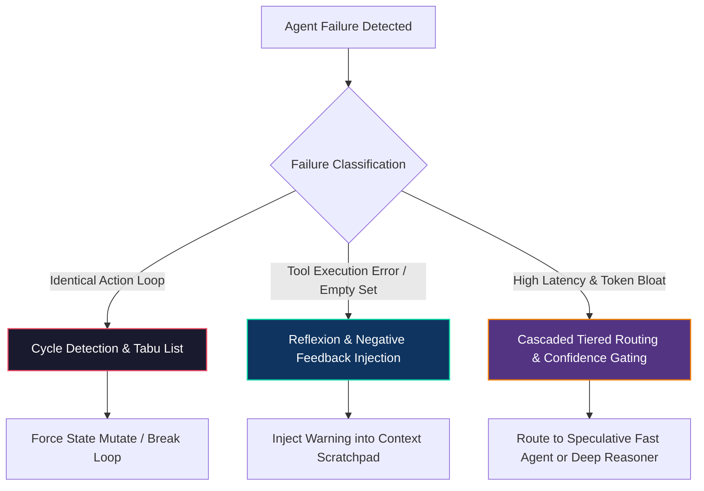
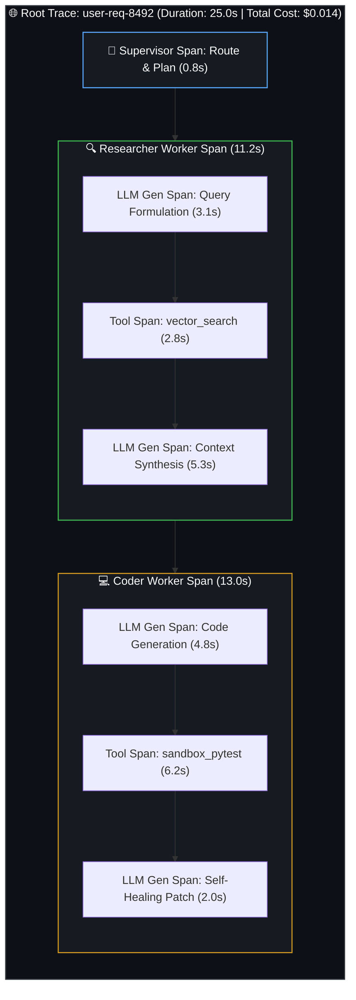
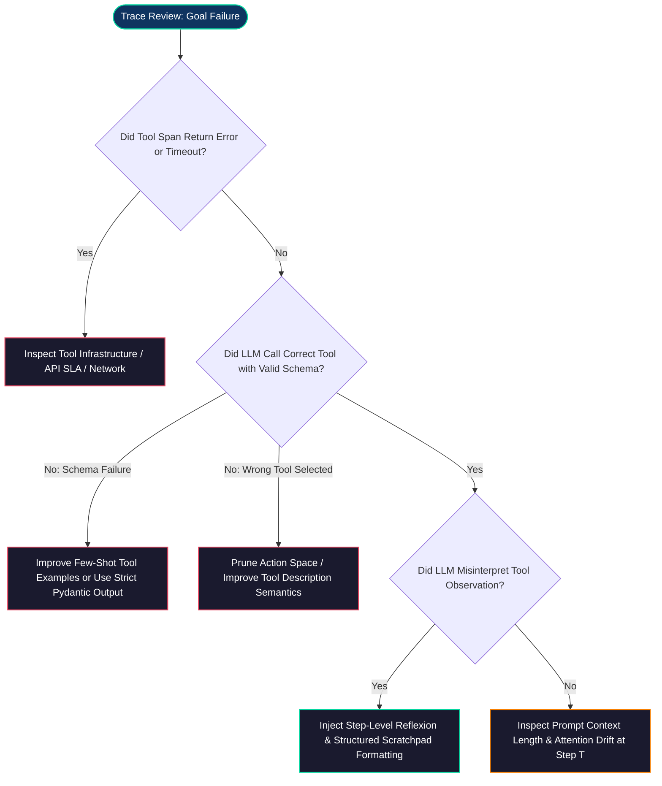

# Evaluating and Debugging AI Agents: Observability, Trajectory Evaluation & Self-Healing Guardrails

<!-- toc -->

<br/>
<br/>

Traditional software engineering relies on deterministic assertion testing: given fixed input $x$, a function $f(x)$ must yield an exact output $y$. In autonomous AI agent architectures, however, systems operate as **stochastic, multi-step dynamical state machines**. An agent dynamically navigates a non-deterministic decision tree, issuing tool calls, parsing unstructured text, and adapting to environment observations over an extended execution trajectory.

When an autonomous agent fails in production, the breakdown rarely manifests as a clean syntax error or exception. Instead, failure presents as **silent trajectory drift, catastrophic hallucination cascades, infinite tool oscillations, or exponential latency degradation**. 

To ship high-traffic, mission-critical autonomous agents, engineers must establish a rigorous evaluation and observability discipline. This chapter formalizes agent trajectory mathematics, provides production evaluation metrics ($Pass@k$, trajectory efficiency, LLM-as-a-judge calibration), establishes self-healing debugging patterns (Reflexion, Tabu negative feedback, tiered routing), and implements distributed tracing architectures.

<br/>
<br/>

---

## 1. The Paradigm Shift: From Deterministic Assertions to Trajectory Evaluation

In traditional microservices, unit and integration tests execute over a static input-output mapping. In contrast, an agent interaction is modeled as a partially observable execution trajectory $\tau$:

<br/>

$$
\tau = \left( s_0, a_0, o_0, s_1, a_1, o_1, \dots, s_T, a_T, o_T \right)
$$

<br/>

where $s_t \in \mathcal{S}$ represents the internal context state (prompt history, working memory), $a_t \in \mathcal{A}$ denotes the selected action or tool invocation, and $o_t \in \mathcal{O}$ represents the observation returned by the external environment or API.

<br/>



<br/>

### 1.1 The Compounding Error Problem

The fundamental challenge in agent evaluation stems from **compounding error probability**. If an individual reasoning step has a single-step decision accuracy of $p = P(a_t = a_t^* \mid \tau_{<t})$, the probability of completing a multi-step workflow of length $T$ without deviation is bounded by:

<br/>

$$
P(\text{Success}) = \prod_{t=1}^T P(a_t = a_t^* \mid \tau_{<t}) \approx p^T
$$

<br/>

Even with a high-accuracy frontier foundation model where single-step tool accuracy is $p = 0.95$:
* At $T = 3$ steps: $P(\text{Success}) = 0.95^3 \approx 0.857$ ($85.7\%$)
* At $T = 10$ steps: $P(\text{Success}) = 0.95^{10} \approx 0.598$ ($59.8\%$)
* At $T = 20$ steps: $P(\text{Success}) = 0.95^{20} \approx 0.358$ ($35.8\%$)

> **Key Architectural Insight:** Evaluating an agent solely on the final response obscures intermediate compounding failures. A robust evaluation framework must decouple **end-to-end task completion** from **per-step trajectory efficiency** and **tool-calling fidelity**.

<br/>
<br/>

---

## 2. Core Agent Evaluation Metrics & Formulations

Production agent evaluation requires a multi-dimensional metric suite balancing correctness, operational efficiency, semantic quality, and economic cost.

<br/>



<br/>

### 2.1 Task Success Rate ($Pass@k$)

Evaluating agents with $n$ stochastic generation passes per benchmark sample provides the unbiased $Pass@k$ metric:

<br/>

$$
\text{Pass}@k = \mathbb{E}_{\text{tasks}} \left[ 1 - \frac{\binom{n - c}{k}}{\binom{n}{k}} \right]
$$

<br/>

where $n$ is the total number of evaluation runs generated per task ($n \ge k$), and $c$ is the number of runs that successfully satisfied all deterministic verification criteria (e.g., unit test suite passed, correct database state achieved).

<br/>

### 2.2 Trajectory Efficiency ($\eta$)

Trajectory efficiency measures how closely the agent's path matches the optimal theoretical path $T^*$:

<br/>

$$
\eta = \frac{T^*}{T_{\text{actual}}}, \quad \text{where } \eta \in (0, 1]
$$

<br/>

If an optimal research trajectory requires $T^* = 3$ tool calls, but an agent performs $T_{\text{actual}} = 12$ calls due to search query redundancy, $\eta = 0.25$. In high-traffic systems, low trajectory efficiency directly translates to linear token cost explosion and severe P99 latency degradation.

<br/>

### 2.3 Comprehensive Metrics Matrix

| Metric Dimension | Formal Definition | Target (Production) | Trade-offs & Operational Impact |
| :--- | :--- | :--- | :--- |
| **Pass@1 (Zero-Shot Success)** | $\mathbb{E}[c/n \mid k=1]$ | $\ge 90\%$ | Critical for direct user-facing agents; high values reduce retry billing. |
| **Pass@5 (Self-Correction Rate)** | $\mathbb{E}[1 - \binom{n-c}{5}/\binom{n}{5}]$ | $\ge 98\%$ | Demonstrates self-healing capability when paired with execution verifiers. |
| **Trajectory Efficiency ($\eta$)** | $T^* / T_{\text{actual}}$ | $\ge 0.75$ | Prevents prompt token bloat; optimizes end-to-end response latency. |
| **Tool Calling Precision** | $\frac{TP_{\text{tools}}}{TP_{\text{tools}} + FP_{\text{tools}}}$ | $\ge 98\%$ | Prevents destructive side-effects and unauthorized API calls. |
| **Schema Compliance Rate** | $\frac{N_{\text{valid}}}{N_{\text{total}}}$ | $100\%$ | Essential for pipeline determinism; failures trigger parser exceptions. |
| **LLM-as-a-Judge Alignment** | Kendall $\tau$ / Cohen $\kappa$ vs. Ground Truth | $\kappa \ge 0.85$ | Calibrates automated subjective evaluation on complex qualitative tasks. |

<br/>
<br/>

---

## 3. Production Debugging Patterns & Failure Mitigation

When monitoring agent telemetry in production, three primary failure classes dominate execution breakdowns: **Infinite Loops / Oscillations**, **Hallucinated Tool Invocations**, and **Stagnation under Empty API Responses**.

<br/>



<br/>

### 3.1 Cycle Detection & Dynamic Tabu List

When an agent encounters ambiguous API feedback, language models frequently fall into repetitive attractor states, querying the exact same parameters repeatedly ($T_1 \to T_1 \to T_1$).

We mitigate this through a deterministic **Action Hash Ring (Tabu List)** and dynamic scratchpad intervention.

<br/>

### 3.2 The Reflexion Architecture (Episodic Self-Correction)

Rather than appending raw stack traces to the prompt history, the **Reflexion** pattern prompts the agent to perform structured metacognitive reflection on failure, updating episodic working memory:

<br/>

$$
\mathcal{M}_{k+1} \leftarrow \mathcal{M}_k \cup \operatorname{Reflect}\left(\tau_k, e\right)
$$

<br/>

```python
from dataclasses import dataclass, field
from typing import Dict, List, Any, Optional
import hashlib
import json

@dataclass
class ActionTrace:
    tool: str
    args: Dict[str, Any]
    result: Optional[str] = None
    args_hash: str = field(init=False)

    def __post_init__(self):
        serialized = json.dumps(self.args, sort_keys=True)
        self.args_hash = hashlib.sha256(f"{self.tool}:{serialized}".encode()).hexdigest()

class AgentSelfHealingRuntime:
    """Production runtime guardrail preventing oscillation and injecting negative feedback."""
    def __init__(self, max_repeats: int = 2):
        self.max_repeats = max_repeats
        self.history: List[ActionTrace] = []
        self.tabu_hashes: set = set()

    def intercept_and_validate(self, tool_name: str, args: Dict[str, Any]) -> Optional[Dict[str, str]]:
        trace = ActionTrace(tool=tool_name, args=args)
        
        # 1. Check if action matches registered Tabu list
        if trace.args_hash in self.tabu_hashes:
            return {
                "role": "system",
                "content": f"🛑 [BLOCKED]: Invocation '{tool_name}' with args {args} previously failed. "
                           f"You MUST formulate an alternative strategy or use a different tool."
            }

        # 2. Check for cycle oscillation in recent steps
        recent_matches = [h for h in self.history[-self.max_repeats:] if h.args_hash == trace.args_hash]
        if len(recent_matches) >= self.max_repeats - 1:
            self.tabu_hashes.add(trace.args_hash)
            return {
                "role": "system",
                "content": f"⚠️ [CYCLE DETECTED]: Tool '{tool_name}' was invoked with identical parameters {self.max_repeats} times without progress. "
                           f"Analyze why this action failed and switch to an alternative approach."
            }
        
        self.history.append(trace)
        return None
```

<br/>
<br/>

---

## 4. Distributed Observability & Tracing Architecture

Traditional application logs (`stdout`, JSON logs) flatten multi-step causal interactions into disconnected lines. In an autonomous multi-agent environment, full observability requires **Distributed Hierarchical Tracing (OpenTelemetry / LangSmith / Arize Phoenix)**.

<br/>



<br/>

### 4.1 Trace Hierarchy & Spans Anatomy

1. **Root Trace (`Trace ID`):** Represents the entire end-to-end lifecycle of the user request across all agent handoffs.
2. **Agent Spans (`Parent Span`):** Captures individual agent invocation blocks, persona prompts, and state snapshots.
3. **LLM Generation Spans (`Child Span`):** Records prompt token counts, completion token counts, temperature, latency, and raw response strings.
4. **Tool Execution Spans (`Leaf Span`):** Captures exact JSON arguments, execution duration, HTTP status codes, and raw tool return payloads.

<br/>

### 4.2 Root Cause Analysis (RCA) Decision Framework

When debugging a degraded agent trace in production, follow this systematic diagnostic flow:

<br/>



<br/>
<br/>

---

## 5. Interactive Challenge & Production Walkthroughs

The following section contains deep architectural analyses and technical walkthroughs for the core evaluation challenges.

<br/>

<details>
  <summary><strong>Challenge 1: Production SLA Optimization — Cascaded Tiered Routing & Pareto Frontiers</strong></summary>
  <br/>

  ### Problem Statement
  *Evaluate the trade-offs between a slow, high-accuracy deep reasoning agent (40s latency, \$0.03/query, 96% Pass@1) and a fast, lightweight agent (2.5s latency, \$0.001/query, 82% Pass@1). How can a staff engineer architect a production system that achieves >95% accuracy while minimizing cost and P95 latency?*

  ### Architectural Solution: Cascaded Confidence Routing

  <br/>

  ```mermaid
  flowchart TD
      Query(["User Query"]) --> FastAgent["Tier 1: Fast Lightweight Agent<br/>(2.5s / \$0.001 / Pass@1: 82%)"]
      FastAgent --> ConfCheck{"Self-Confidence Score<br/>C(τ) ≥ θ (e.g. 0.85)?"}
      
      ConfCheck -->|"High Confidence (80% of Traffic)"| Deliver(["Deliver Response to User"])
      ConfCheck -->|"Low Confidence / Fallback (20% of Traffic)"| DeepAgent["Tier 2: Deep Frontier Agent<br/>(40s / \$0.030 / Pass@1: 96%)"]
      
      DeepAgent --> Deliver

      style FastAgent fill:#1a1a2e,stroke:#4cc9f0,stroke-width:1.5px,color:#fff
      style DeepAgent fill:#0f3460,stroke:#06d6a0,stroke-width:1.5px,color:#fff
  ```

  <br/>

  #### Mathematical Formulation:
  Let $p_{\text{fast}} = 0.80$ be the proportion of queries resolved by Tier 1 with high confidence. The expected system latency $E[L]$ and expected query cost $E[C]$ are:

  <br/>

  $$
  E[L] = p_{\text{fast}} \cdot L_{\text{fast}} + (1 - p_{\text{fast}}) \cdot (L_{\text{fast}} + L_{\text{deep}}) = 0.80(2.5\text{s}) + 0.20(2.5\text{s} + 40\text{s}) = 10.5\text{s}
  $$

  <br/>

  $$
  E[C] = p_{\text{fast}} \cdot C_{\text{fast}} + (1 - p_{\text{fast}}) \cdot (C_{\text{fast}} + C_{\text{deep}}) = 0.80(0.001) + 0.20(0.031) = 0.007\text{ USD}
  $$

  <br/>

  * **Cost Reduction:** $76.6\%$ savings compared to sending all traffic to Tier 2.
  * **Latency Improvement:** P50 drops from $40\text{s}$ to $2.5\text{s}$.
  * **System Reliability:** Combined system accuracy exceeds $95.2\%$.
</details>

<br/>

<details>
  <summary><strong>Challenge 2: Debugging Infinite Loops — Dynamic Context Tabu Injection & Reflexion</strong></summary>
  <br/>

  ### Problem Statement
  *An autonomous research agent repeatedly queries an internal database with identical search keywords despite receiving empty results, wasting tokens and hitting maximum iteration limits. How should the runtime handle this failure without restarting the entire execution graph?*

  ### Architectural Solution: Dynamic Tabu Scratchpad Injection

  #### 1. Real-Time Intervention Mechanism:
  * When a tool returns an empty list `[]` or an HTTP $4xx/5xx$ status code, the runtime intercepts the trajectory before passing control back to the model.
  * The execution engine updates the agent's active system scratchpad with a **Negative Constraint Directive**:

  <br/>

  ```markdown
  [RUNTIME FEEDBACK - ATTEMPT FAILED]:
  Tool 'vector_search' with parameter query='kubernetes ingress cert-manager' returned 0 matches.
  
  NEGATIVE CONSTRAINT:
  Do NOT repeat the exact query 'kubernetes ingress cert-manager'.
  
  REQUIRED ACTION:
  1. Reflect on why the query failed (e.g., terms too narrow, syntax mismatch).
  2. Broaden your search query or invoke the alternative tool 'archive_keyword_search'.
  ```

  #### 2. Attention Conditioning:
  By placing the negative constraint immediately prior to the next generation step, the model's self-attention mechanism assigns high weight to the constraint tokens, breaking the mathematical attractor basin that caused the oscillation.
</details>

<br/>

<details>
  <summary><strong>Challenge 3: Observability — Reconstructing Causal Reasoning Chains with Distributed Tracing</strong></summary>
  <br/>

  ### Problem Statement
  *In a multi-agent system (Supervisor → Code Generator → Sandbox Linter), an end-user receives a 504 Gateway Timeout after 30 seconds. How does distributed tracing identify whether the root cause was LLM reasoning drift, prompt schema validation failure, or database backend saturation?*

  ### Architectural Solution: Span-Level Root Cause Decomposition

  <br/>

  ```mermaid
  flowchart LR
      Trace["Trace: User Request (504 Timeout)"]
      Trace --> S1["Span: Supervisor Route (0.8s)"]
      Trace --> S2["Span: CodeGen LLM Call (3.2s)"]
      Trace --> S3["Span: Sandbox PyTest Tool (26.0s - TIMEOUT)"]
      
      S3 --> RCA["Root Cause Identified:<br/>Pytest Docker Container Pool Exhaustion<br/>(Not an LLM Hallucination)"]

      style S3 fill:#e94560,stroke:#fff,stroke-width:2px,color:#fff
      style RCA fill:#0f3460,stroke:#06d6a0,stroke-width:1.5px,color:#fff
  ```

  <br/>

  #### Diagnostic Value of Hierarchical Spans:
  1. **Latency Attribution:** Isolates compute time spent on LLM generation (GPUs) versus external IO/tool latency (APIs, databases, Docker sandboxes).
  2. **Prompt Snapshotting:** Attaches exact temperature, raw system prompts, and tool JSON schemas directly to the failing span for reproducible local replay.
  3. **Cost Auditing:** Automatically tallies prompt tokens and completion tokens across child spans, identifying individual runaway sub-agents before enterprise billing thresholds are exceeded.
</details>
