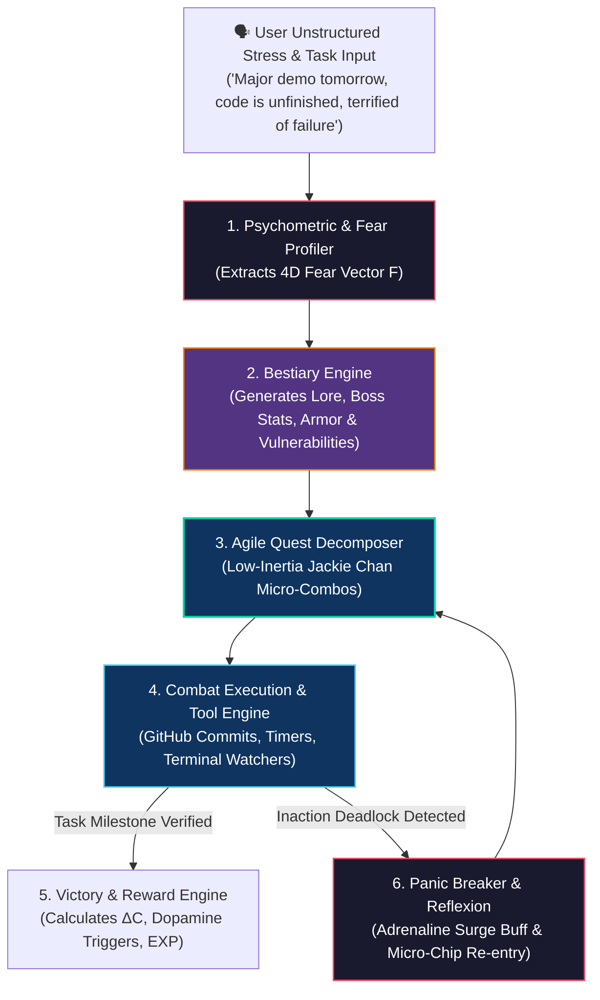
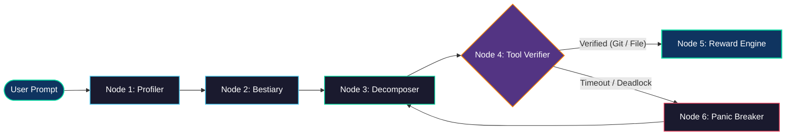
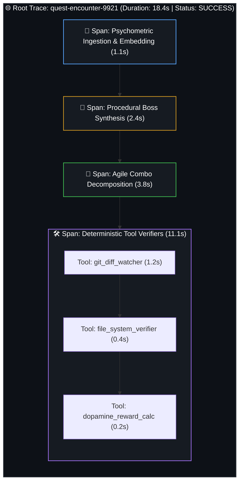

# Capstone Project: Building a Personal Autonomous AI Agent — Cortisol Slayer & Adaptive Fear-to-Boss Engine

<!-- toc -->

<br/>
<br/>

Across Days 01 through 09, we formalized the foundational primitives of autonomous systems: multi-step ReAct reasoning loops, typed tool calling schemas, layered working and episodic memory structures, multi-agent coordination topologies, and trajectory observability with self-healing guardrails.

This Capstone chapter synthesizes these architectural components into a complete, production-grade autonomous agent: **Cortisol Slayer**. 

Cortisol Slayer is a personalized, game-theoretic agentic engine designed to combat developer procrastination, cognitive paralysis, and stress. Rather than treating task management as a passive to-do list, the system dynamically converts unstructured user anxiety, impending deadlines, and perfectionism into **2D RPG Boss Encounters** with parameterized hit points ($HP$), tactical vulnerabilities, agile micro-combo quests, and adaptive difficulty balancing.

<br/>
<br/>

---

## 1. System Architecture: The Five Pillars of a Personal Autonomous Agent

A production personal assistant agent must not function as a naive stateless chatbot. It operates as a stateful, dynamic controller modeled as a formal 6-tuple:

<br/>

$$
\Sigma = \langle \mathcal{S}, \mathcal{A}, \mathcal{T}, \mathcal{M}, \mathcal{G}, \mathcal{R} \rangle
$$

<br/>

where $\mathcal{S}$ is the continuous user and task state space, $\mathcal{A}$ is the action space of quest decompositions, $\mathcal{T}$ represents external execution tools, $\mathcal{M}$ is multi-tier memory, $\mathcal{G}$ denotes guardrails against cognitive deadlock, and $\mathcal{R}$ is the feedback reward signal (cortisol drop $\Delta C$).

<br/>



<br/>

### 1.1 Architectural Decomposition of the Five Core Subsystems

1. **Psychometric State Extractor:** Converts natural language anxiety into a structured mathematical fear vector.
2. **Procedural Boss Synthesizer:** Instantiates persona-specific bosses, mathematical armor values, and weakness triggers.
3. **Agile Task Decomposer:** Uses momentum-preserving heuristics to break intimidating multi-hour epics into 2- to 15-minute low-friction strikes.
4. **Tool Verification Layer:** Replaces subjective self-reporting with deterministic verification (e.g., verifying a Git commit or file creation).
5. **Self-Healing Dynamic Difficulty Adjuster (DDA):** Intercepts execution deadlocks and applies time-based boss enrage scaling alongside counterbalancing adrenaline buffs.

<br/>
<br/>

---

## 2. Mathematical Modeling & Combat Game Mechanics

To engineer deterministic behavior inside an agentic game loop, psychological and operational dynamics are modeled through formal mathematical equations.

<br/>

### 2.1 Multi-Dimensional Fear Vector ($\vec{F}$)

The user's emotional and cognitive state is extracted into a normalized $D$-dimensional space ($D=4$):

<br/>

$$
\vec{F} = \begin{bmatrix} f_{\mathrm{imposter}} \\ f_{\mathrm{deadline}} \\ f_{\mathrm{burnout}} \\ f_{\mathrm{perfectionism}} \end{bmatrix}, \quad f_i \in [0, 1]
$$

<br/>

### 2.2 Boss Hit Points ($HP$) & Time-Escalation Dynamics

A boss's initial hit points scale with task complexity and fear intensity. If the user remains in a state of idle paralysis, the boss dynamically scales over time $\Delta t_{\mathrm{idle}}$ to reflect escalating deadline pressure:

<br/>

$$
HP_{\mathrm{boss}}(t) = HP_0 \times \left(1 + \sum_{i=1}^4 w_i f_i\right) \times \log_2\left(1 + T_{\mathrm{est}}\right) \times \left(1 + \lambda \Delta t_{\mathrm{idle}}\right)
$$

<br/>

where $HP_0$ is base hit points (e.g., $1000$), $w_i$ are archetype weights, $T_{\mathrm{est}}$ is estimated completion time in hours, and $\lambda$ is the procrastination escalation coefficient.

<br/>

### 2.3 Combat Damage Mechanics & The Low-Inertia Velocity Multiplier

In classical physics, static friction exceeds kinetic friction ($\mu_s > \mu_k$). To break cognitive static friction, the agent rewards immediate, rough drafts ("Ugly Draft Strikes") over prolonged perfectionist delays:

<br/>

$$
\text{Damage} = \text{Base Damage} \times \left(1 + \frac{V_{\mathrm{draft}}}{1 + T_{\mathrm{polish}}}\right) \times \text{Multiplier}_{\mathrm{adrenaline}}
$$

<br/>

### 2.4 Cortisol Reduction Equation ($\Delta C$)

Upon landing verified blows and defeating the boss, the net cognitive cortisol drop is quantified as:

<br/>

$$
\Delta C = \alpha \cdot \left(\frac{\text{Damage Dealt}}{HP_{\mathrm{boss}}}\right) \times e^{-\beta \cdot t_{\mathrm{procrastination}}}
$$

<br/>

### 2.5 Psychological Matrix & Agent Mapping

| Psychometric Archetype | Dominant Fear Feature | In-Game Boss Representation | Critical Vulnerability (Weakness) | Agent Tactical Strategy |
| :--- | :--- | :--- | :--- | :--- |
| **Perfectionism Paralysis** | $f_{\mathrm{perfectionism}} \to 1.0$ | **Aura-Zero:** Flawless Crystal Monolith with pristine lines | *Ugly Draft Strike:* Rapid submission of crude, imperfect prototypes | Force 10-minute messy drafts; penalize delayed formatting |
| **Deadline Panic** | $f_{\mathrm{deadline}} \to 1.0$ | **Chronos Devourer:** Multi-armed hourglass leviathan | *Atomic Step Kick:* Completing an isolated 2-minute micro-action | Isolate next immediate step; hide global roadmap |
| **Imposter Syndrome** | $f_{\mathrm{imposter}} \to 1.0$ | **The Phantom Inquisitor:** Shifting shadow judge | *Proof of Concept Flare:* Verified unit test or terminal green light | Require empirical verification to dispel self-doubt |
| **Exhaustion / Burnout** | $f_{\mathrm{burnout}} \to 1.0$ | **The Silt Golem:** Heavy, suffocating mud titan | *Micro-Sprint Stasis:* 5-minute focused bursts with mandatory rests | Enforce strict Pomodoro bounds; disallow overwork |

<br/>
<br/>

---

## 3. Production State Graph & Runtime Implementation

The agent runtime is implemented using a typed, state-driven workflow graph. The execution engine enforces strict schema validations across every node transition.

<br/>



<br/>

```python
from dataclasses import dataclass, field
from typing import List, Dict, Any, Optional
import time

@dataclass
class FearMonster:
    name: str
    archetype: str
    max_hp: int
    current_hp: int
    weakness: str
    visual_theme: str

@dataclass
class SlayerState:
    raw_prompt: str
    fear_vector: Dict[str, float] = field(default_factory=dict)
    active_monster: Optional[FearMonster] = None
    combos: List[Dict[str, Any]] = field(default_factory=list)
    idle_minutes: float = 0.0
    adrenaline_active: bool = False
    cortisol_reduced: float = 0.0

class CortisolSlayerRuntime:
    """Core agent runtime orchestrating psychometrics, combat quests, and DDA."""
    
    def process_turn(self, state: SlayerState) -> Dict[str, Any]:
        # 1. Evaluate Dynamic Difficulty Adjustment (Inaction Check)
        if state.idle_minutes >= 20.0 and state.active_monster:
            state.active_monster.current_hp = int(state.active_monster.current_hp * 1.3)
            state.adrenaline_active = True
            return {
                "event": "ADRENALINE_SURGE",
                "message": f"🔥 {state.active_monster.name} grew stronger from delay! "
                           f"⚡ Adrenaline Surge Activated: 3x Damage multiplier for the next 5 minutes!",
                "next_micro_task": "Write just 1 sentence or 1 line of code to trigger the critical chip-damage combo."
            }

        # 2. Decompose Task into Jackie Chan Agile Low-Inertia Combos
        state.combos = [
            {"step": 1, "title": "Stance (2 Min)", "action": "Create empty file and write 3 raw bullet points", "dmg": 300},
            {"step": 2, "title": "Environment Improv (10 Min)", "action": "Paste existing boilerplate and write unpolished logic", "dmg": 800},
            {"step": 3, "title": "Precision Kick (5 Min)", "action": "Format doc, run linter, and commit to Git", "dmg": 500}
        ]
        return {"event": "BATTLE_ENGAGED", "state": state}
```

<br/>
<br/>

---

## 4. Distributed Observability & Telemetry

To ensure enterprise-grade reliability and latency attribution, every combat interaction is traced as a distributed hierarchy of OpenTelemetry / LangSmith spans.

<br/>



<br/>

### 4.1 Telemetry Metrics Tracked

1. **Static-to-Kinetic Latency ($T_{\mathrm{ignition}}$):** Time delta between quest assignment and the user's first tool-verified keystroke or commit.
2. **Boss Convergence Ratio ($\eta_{\mathrm{combat}}$):** Ratio of total completed attack damage to initial boss health ($HP_{\mathrm{dealt}} / HP_0$).
3. **Panic Breaker Trigger Rate ($R_{\mathrm{panic}}$):** Percentage of encounters requiring automatic adrenaline interventions.

<br/>
<br/>

---

## 5. Interactive Challenge & Production Walkthroughs

The following section details the architectural solutions and edge-case designs developed for the Cortisol Slayer engine.

<br/>

<details>
  <summary><strong>Challenge 1: The Perfectionism Paradox & The Pristine Monolith (Aura-Zero)</strong></summary>
  <br/>

  ### Problem Statement
  *How should an autonomous agent represent Perfectionism Paralysis without resorting to generic, ugly monsters? What is the mathematical and mechanical vulnerability of perfectionism?*

  ### Architectural Solution: Inverted Aesthetic Modeling

  <br/>

  ```mermaid
  flowchart LR
      Boss["💎 Aura-Zero (The Immaculate Prism)<br/>Armor: 100% Crystalline Symmetry"]
      
      Attack["💥 The Ugly Draft Strike<br/>(Submitting messy, unpolished draft in &lt;10 min)"]
      
      Boss -->|Armor Shattered| Win["💔 Critical Structural Collapse!<br/>-1500 HP True Damage + 40% Cortisol Drop"]
      
      Attack --> Win

      style Boss fill:#1a1a2e,stroke:#4cc9f0,stroke-width:2px,color:#fff
      style Attack fill:#e94560,stroke:#fff,stroke-width:1.5px,color:#fff
      style Win fill:#0f3460,stroke:#06d6a0,stroke-width:2px,color:#fff
  ```

  <br/>

  #### 1. Visual & Psychological Inversion:
  * Perfectionism is characterized by an immaculate, cold, hyper-symmetric crystal monolith (*Aura-Zero*). The intimidating factor is not disgust, but unreachable geometric flawlessness.

  #### 2. The Ugly Draft Critical Strike:
  * The boss's armor is mathematically immune to slow, polished attacks ($T_{\mathrm{polish}} > 60\text{ min} \implies \text{Armor} \to \infty$).
  * The single critical vulnerability is high-velocity, imperfect execution. Emitting a raw prototype instantly bypasses the defense matrix, shattering the monolith.
</details>

<br/>

<details>
  <summary><strong>Challenge 2: Low-Inertia Task Decomposition — The Jackie Chan Momentum Protocol</strong></summary>
  <br/>

  ### Problem Statement
  *When a user faces an overwhelming 3000 HP task ('Refactor distributed database layer and write 15-page design doc'), how does the ReAct agent prevent cognitive freeze?*

  ### Architectural Solution: Low-Inertia Velocity Combos

  <br/>

  ```mermaid
  flowchart TD
      Task["🏔️ Massive Intimidating Epic: 3000 HP<br/>(Static Friction: μ_s = Max)"]
      
      subgraph Jackie["🥋 Jackie Chan 3-Step Low-Inertia Combo"]
          direction TB
          C1["Step 1: Chair Toss (2 Min | Zero Friction)<br/>Open blank doc, write title and 3 bullet points."]
          C2["Step 2: Environmental Improv (10 Min | Rough Draft)<br/>Copy old schema boilerplate, write messy logic."]
          C3["Step 3: Roundhouse Kick (5 Min | Finalization)<br/>Format headers, run linter, commit to repo."]
          C1 --> C2 --> C3
      end

      Task --> Jackie
      Jackie --> Victory["🏆 Boss Smashed! (Kinetic Momentum μ_k Established)"]

      style Jackie fill:#0f3460,stroke:#06d6a0,stroke-width:2px,color:#fff
      style Task fill:#1a1a2e,stroke:#e94560,stroke-width:1.5px,color:#fff
      style Victory fill:#533483,stroke:#f77f00,stroke-width:2px,color:#fff
  ```

  <br/>

  #### 1. Environmental Improvisation:
  * Just as Jackie Chan utilizes ambient ladders and chairs rather than trading raw heavy blows, the agent instructs the user to leverage existing templates and copy-paste scaffolding.

  #### 2. Cognitive Friction Reduction:
  * Initial task energy threshold $E_{\mathrm{start}}$ is reduced by $95\%$ through strict timeboxing ($\le 2\text{ minutes}$), ensuring immediate ignition into the cognitive flow state.
</details>

<br/>

<details>
  <summary><strong>Challenge 3: Inaction Escalation, Adrenaline Surge & Micro-Chip Re-entry</strong></summary>
  <br/>

  ### Problem Statement
  *If the user remains completely paralyzed despite micro-combos (20+ minutes of total inactivity), how does the agent balance real-world deadline escalation against the risk of crushing the user under guilt?*

  ### Architectural Solution: The Adrenaline Surge & Micro-Chip Protocol

  <br/>

  ```mermaid
  flowchart TD
      Idle["⏳ Inactivity Deadlock (20+ Min Idle)"] --> Enrage["🔥 Boss Escalation (+30% HP & Approaching Deadline)"]
      
      Enrage --> Surge["⚡ Adrenaline Surge Activated by Agent!<br/>(5-Minute Rage Window: 3x Damage Multiplier)"]
      
      Surge --> Micro["🎯 Micro-Chip Strike<br/>(Write literally 1 sentence or 1 line of code)"]
      
      Micro --> Cascade["🚀 Critical Hit! Dopamine Chain Reactivated<br/>(Momentum Restored to Normal Battle Flow)"]

      style Idle fill:#1a1a2e,stroke:#e94560,stroke-width:1.5px,color:#fff
      style Enrage fill:#e94560,stroke:#fff,stroke-width:1.5px,color:#fff
      style Surge fill:#533483,stroke:#f77f00,stroke-width:2px,color:#fff
      style Cascade fill:#0f3460,stroke:#06d6a0,stroke-width:2px,color:#fff
  ```

  <br/>

  #### 1. Real-World Stakes (Enrage Scaling):
  * The agent does not pretend deadlines disappear. The boss's hit points scale:
    $$HP_{\mathrm{boss}}(t) = HP_0 \times (1 + \lambda \Delta t_{\mathrm{idle}})$$

  #### 2. Adrenaline Counter-Buff:
  * To prevent user despair, the agent triggers a high-power temporary buff ($\text{Damage} \times 3.0$) for 5 minutes, framing the urgent situation as an empowering combat advantage.

  #### 3. Micro-Chip Re-entry:
  * Landing any atomic action ($\Delta HP > 0$) immediately registers as a critical hit, triggering neurological dopamine release and shattering the inaction deadlock.
</details>
