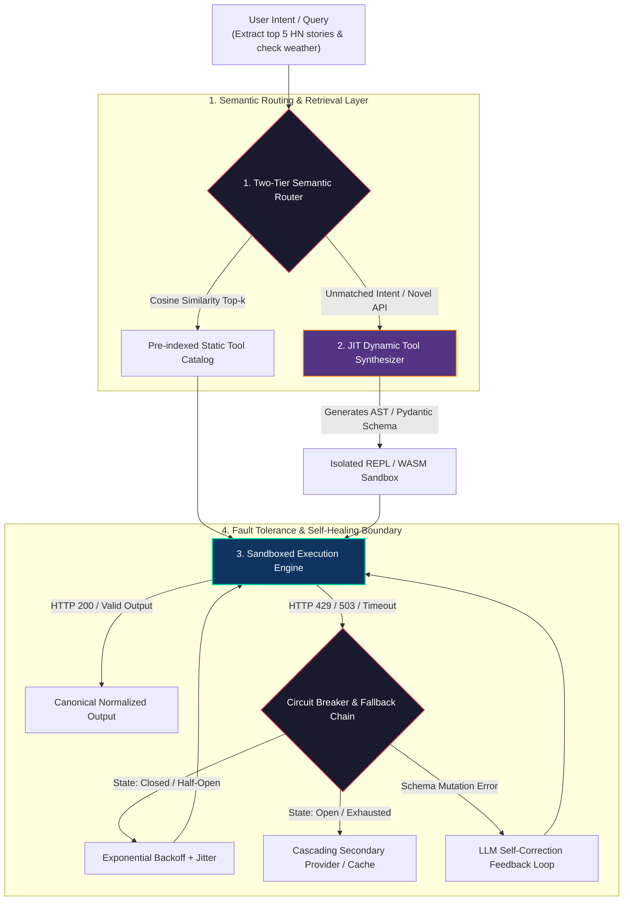
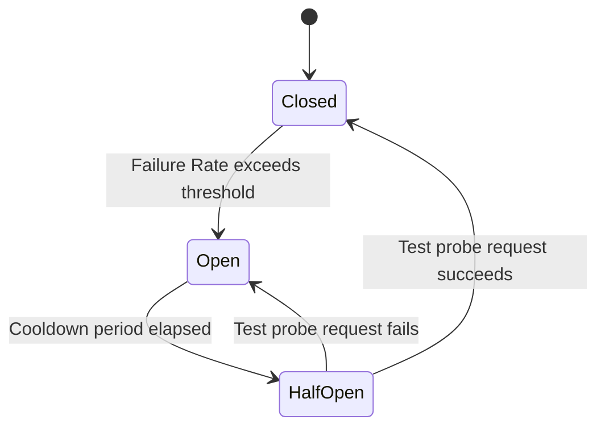

# Day 11: Advanced Tool Use — Dynamic Tools, Tool Routing, and Error Handling

<!-- toc -->

<br/>
<br/>

In Phase 1 and Phase 2 (Days 01 through 10), we explored static tool calling schemas, deterministic function calling, ReAct cycles, stateful memory management, and multi-agent coordination.

As autonomous systems transition into enterprise production, a fundamental scaling boundary emerges: **Static Tool Saturation**. Ingestion of dozens or hundreds of raw OpenAPI function schemas directly into the prompt context window degrades Time-To-First-Token (TTFT) latency, exhausts token budgets, and drastically inflates tool hallucination and misrouting rates. Furthermore, distributed downstream tools are inherently flaky—frequently exhibiting network timeouts, HTTP `429 Rate Limit` bottlenecks, and unexpected schema mutations.

This chapter formalizes the architecture of **Dynamic Tool Synthesis**, **Semantic Tool Routing**, and **Resilient Error-Handling Engines** designed to maintain 99.99% operational continuity under adversarial distributed conditions.

<br/>
<br/>

---

## 1. Architectural Foundations: Tool Routing & Dynamic Synthesis

A production agentic tool layer operates not as a static list of hardcoded wrappers, but as an active, two-tier semantic dispatch and runtime compilation system.

<br/>



<br/>

### 1.1 The Three Core Subsystems

1. **Semantic Tool Router (Dispatch Layer):** Filters an unbounded catalog of tools $\mathcal{T} = \lbrace t\_1, t\_2, \dots, t\_N \rbrace$ down to a compact subset $\mathcal{T}\_{\text{active}} \subset \mathcal{T}$ ($|\mathcal{T}\_{\text{active}}| \le k$) based on vector similarity and lightweight intent classification before presenting them to the reasoning LLM.
2. **Just-In-Time (JIT) Dynamic Tool Synthesizer:** When encountering an unseen data source, undocumented endpoint, or dynamic DOM structure, the agent compiles custom scraping scripts or client SDK wrappers on the fly.
3. **Resilient Execution Boundary:** Enforces defensive design patterns including Circuit Breakers, Cascading Provider Fallbacks, and Closed-Loop Self-Correction.

<br/>
<br/>

---

## 2. Mathematical Modeling & Resilience Formulations

<br/>

### 2.1 Semantic Tool Routing & Retrieval Scoring

Given a user query embedding $\mathbf{e}\_q \in \mathbb{R}^d$ and a registry of tool description embeddings $\mathbf{e}\_{t\_i} \in \mathbb{R}^d$, the relevance score is computed via normalized cosine similarity:

<br/>

$$
\operatorname{Sim}(q, t\_i) = \frac{\mathbf{e}\_q \cdot \mathbf{e}\_{t\_i}}{\Vert \mathbf{e}\_q \Vert \cdot \Vert \mathbf{e}\_{t\_i} \Vert}
$$

<br/>

To avoid context pollution, the active toolset $\mathcal{T}\_{\text{active}}$ injected into the system prompt is restricted to the top-$k$ candidates satisfying an acceptance threshold $\tau$:

<br/>

$$
\mathcal{T}\_{\text{active}} = \left\lbrace t\_i \in \mathcal{T} \mid \operatorname{Sim}(q, t\_i) \ge \tau \right\rbrace\_{i=1}^k
$$

<br/>

### 2.2 Exponential Backoff with Decorrelated Jitter

When transient network errors or rate limits occur (`HTTP 429 / 503`), naive retries risk triggering thundering herd problems. We model retry delay using exponential backoff with uniform jitter:

<br/>

$$
t\_{\text{wait}}(m) = \min\left(t\_{\max}, t\_0 \cdot 2^m + \mathcal{U}(0, J)\right)
$$

<br/>

where $m$ is the zero-indexed retry attempt ($m \in [0, M\_{\max}]$), $t\_0$ is the base delay, $t\_{\max}$ is the maximum ceiling, and $\mathcal{U}(0, J)$ is a uniform stochastic jitter offset.

<br/>

### 2.3 Circuit Breaker Tri-State Machine

A downstream tool $t$ transitions across three discrete operational states $\mathcal{S}\_{\text{CB}} \in \lbrace \text{Closed}, \text{Open}, \text{Half-Open} \rbrace$ based on failure rate $\lambda\_f$:

<br/>

$$
\lambda\_f = \frac{1}{W} \sum\_{i=1}^W \mathbb{I}(\text{Result}\_i = \text{Error})
$$

<br/>



<br/>

### 2.4 Closed-Loop Schema Self-Correction

If a tool invocation produces a schema validation error (e.g., Pydantic `ValidationError` or JSON parse mismatch), the error string $e\_k$ is fed back to the LLM within a single step:

<br/>

$$
\text{Prompt}\_{k+1} = \mathcal{F}\_{\mathrm{correct}}(q, \mathbf{a}\_k, e\_k) \implies \mathbf{a}\_{k+1} = \operatorname{LLM}(\text{Prompt}\_{k+1})
$$

<br/>
<br/>

---

## 3. Representative Production Implementations

<br/>

### 3.1 Resilient Tool Dispatcher with Circuit Breaker & Fallback

The following concise Python implementation demonstrates cascading fallback execution and backoff logic:

```python
import time, random
from typing import Callable, Any, Dict, Optional

class ResilientToolDispatcher:
    def __init__(self, primary_fn: Callable, fallback_fn: Optional[Callable] = None, max_retries: int = 3):
        self.primary = primary_fn
        self.fallback = fallback_fn
        self.max_retries = max_retries
        self.failure_count = 0
        self.circuit_open_until = 0.0

    def execute(self, params: Dict[str, Any], attempt: int = 0) -> Dict[str, Any]:
        now = time.time()
        # Circuit Breaker: Route directly to fallback if tripped
        if now < self.circuit_open_until and self.fallback:
            return {"status": "fallback", "data": self.fallback(**params), "circuit": "open"}

        try:
            result = self.primary(**params)
            self.failure_count = 0
            return {"status": "success", "data": result}
        except (ConnectionError, TimeoutError) as err:
            self.failure_count += 1
            if self.failure_count >= 3:
                self.circuit_open_until = now + 60.0  # Trip breaker for 60 seconds
            
            if attempt < self.max_retries:
                delay = min(10.0, (1.5 ** attempt) + random.uniform(0.1, 0.4))
                time.sleep(delay)
                return self.execute(params, attempt=attempt + 1)
            
            if self.fallback:
                return {"status": "fallback", "data": self.fallback(**params), "reason": str(err)}
            return {"status": "error", "message": f"Execution exhausted: {err}"}
        except ValueError as val_err:
            return {"status": "schema_error", "feedback": str(val_err)}
```

<br/>

### 3.2 Dynamic Tool Synthesis via Sandboxed Code Generation

When an agent needs to scrape or process custom unstructured data without an existing tool:

```python
import ast
from typing import Dict, Any, Callable

class DynamicToolFactory:
    @staticmethod
    def synthesize_tool(tool_name: str, python_code: str, required_args: list[str]) -> Callable:
        """Compiles validated LLM-generated code into an executable runtime function."""
        # AST Validation: Ensure no dangerous system calls
        tree = ast.parse(python_code)
        for node in ast.walk(tree):
            if isinstance(node, ast.Import) and any(alias.name in ["os", "sys", "subprocess"] for alias in node.names):
                raise PermissionError("Disallowed system import detected in generated tool.")

        local_scope: Dict[str, Any] = {}
        exec(compile(tree, filename=f"<dynamic_{tool_name}>", mode="exec"), {}, local_scope)
        
        if tool_name not in local_scope:
            raise KeyError(f"Synthesized function '{tool_name}' was not defined in generated code.")
            
        return local_scope[tool_name]
```

<br/>
<br/>

---

## 4. Architectural Comparison: Static vs Dynamic Tool Management

<br/>

| Metric / Dimension | Static Tool Registration | Semantic Tool Router | Dynamic JIT Tool Synthesis |
| :--- | :--- | :--- | :--- |
| **Catalog Capacity** | 5 – 15 tools max | 1,000+ indexed tools | Infinite (Synthesized at runtime) |
| **Prompt Token Overhead** | $O(N)$ (Grows linearly) | $O(k)$ (Strictly bounded) | $O(1)$ (Injected only after generation) |
| **Tool Misrouting Rate** | High under large catalogs | Low (Vector embedding filtered) | Zero (Custom tailored logic) |
| **Flakiness Tolerance** | Brittle (Fails on error) | Cascading Fallback & Tripped Breaker | Adaptive code regeneration |
| **Execution Security** | Static local trust | Pre-approved registry trust | Sandbox / AST isolation required |

<br/>
<br/>

---

## 5. Summary & Key Engineering Insights

<br/>

> **Key Architectural Insight:** Reliable agentic autonomy in distributed systems is not achieved by hoping third-party APIs never fail. It is achieved by embedding structural resilience: semantic pre-filtering, tri-state circuit breakers, schema self-correction feedback, and sandboxed dynamic tool synthesis.

* **Context Efficiency:** Never feed unbounded API lists to an LLM; route dynamically using two-tier vector matching.
* **Cascading Reliability:** Always configure primary, secondary, and stale-cache fallback chains with canonical data adapters.
* **CodeAct Safety:** Dynamic tools generated at runtime must undergo AST verification and execute inside isolated WASM or micro-container sandboxes.

<br/>
<br/>

---

## 6. Official Challenges & Architectural Solutions

<br/>

<details>
  <summary><strong>Challenge 1: Explaining the Tool Router Concept to Junior Engineers</strong></summary>
  <br/>

  ### Problem Statement
  *How would you explain the concept of a 'tool router' in an AI agent to a junior developer without drowning them in mathematical jargon?*

  ### Architectural Solution: The Master Switchboard Analogy

  <br/>

  ```mermaid
  flowchart LR
      Caller["Incoming Customer Query<br/>(How do I process a refund?)"] --> Switchboard["Central Switchboard (Tool Router)"]
      Switchboard -->|"Classifies Intent"| DeptA["Department 1: Billing & Refunds (Tool Set A)"]
      Switchboard -.->|Ignored| DeptB["Department 2: Hardware Shipping (Tool Set B)"]
      Switchboard -.->|Ignored| DeptC["Department 3: Security & Auth (Tool Set C)"]

      style Switchboard fill:#e94560,stroke:#fff,stroke-width:2px,color:#fff
      style DeptA fill:#0f3460,stroke:#06d6a0,stroke-width:2px,color:#fff
  ```

  <br/>

  #### 1. The Switchboard Metaphor:
  Imagine an office with 500 specialized departments. If an operator transferred every customer to 500 departments at once, chaos and massive phone bills would ensue. A **Tool Router** acts as the intelligent receptionist: it listens to the caller's request, quickly matches the intent against department descriptions, and connects the user only to the 2 or 3 relevant specialists.

  #### 2. Why It Matters:
  * **Cost & Speed:** The LLM only reads instructions for the tools it actually needs, cutting response time by 80%.
  * **Precision:** Fewer distracting options mean the agent rarely dials the wrong tool.
</details>

<br/>

<details>
  <summary><strong>Challenge 2: Multi-Tier Resilient Error Handling for Flaky Third-Party APIs</strong></summary>
  <br/>

  ### Problem Statement
  *Design a production-grade error handling strategy for an agent relying on an external financial or weather API that frequently suffers from 503 outages and 429 rate limits.*

  ### Architectural Solution: Cascading Fallback & Circuit Breaker Waterfall

  <br/>

  ```mermaid
  flowchart TD
      Req["API Request: GetWeather(Istanbul)"] --> Primary["1. Primary Provider (OpenWeather)"]
      
      Primary -->|Success 200| Normalizer["Canonical Schema Normalizer"]
      Primary -->|503 or 429 Error| BreakerCheck{"Circuit Breaker Status"}
      
      BreakerCheck -->|Closed / Normal| Retry["Exponential Backoff with Jitter"]
      Retry -->|Success| Normalizer
      Retry -->|Exhausted| Secondary["2. Secondary Provider (WeatherAPI)"]
      
      BreakerCheck -->|Open / Tripped| Secondary
      Secondary -->|Success 200| Normalizer
      Secondary -->|Fails| Cache["3. Stale-While-Revalidate Cache"]
      Cache --> Out["Degraded Response with Warning"]
      Normalizer --> Out

      style Primary fill:#1a1a2e,stroke:#e94560,stroke-width:2px,color:#fff
      style Secondary fill:#0f3460,stroke:#4cc9f0,stroke-width:2px,color:#fff
      style Cache fill:#533483,stroke:#f77f00,stroke-width:2px,color:#fff
      style Normalizer fill:#0f3460,stroke:#06d6a0,stroke-width:2px,color:#fff
  ```

  <br/>

  #### 1. Circuit Breaker Integration:
  Repeated 503 errors trip the circuit breaker into `Open` state for $T\_{\text{cool}} = 60\text{s}$, redirecting subsequent requests directly to the secondary provider without waiting for primary timeouts.

  #### 2. Canonical Normalization:
  Different providers output heterogeneous keys (e.g., Kelvin `main.temp` vs Celsius `current.temp_c`). A standardized adapter maps all provider payloads into a unified Pydantic model before handing control back to the agent.

  #### 3. Stale-While-Revalidate Graceful Degradation:
  If all live providers fail, the agent serves cached data with an explicit latency notice (*"Weather data as of 14 minutes ago"*), ensuring zero user downtime.
</details>

<br/>

<details>
  <summary><strong>Challenge 3: JIT Web Scraping & Dynamic Tool Synthesis (Browser-Use vs Sandboxed REPL)</strong></summary>
  <br/>

  ### Problem Statement
  *How does an autonomous agent dynamically create, validate, and execute a tool to extract structured data from an un-indexed website (e.g., Hacker News top 5 posts)?*

  ### Architectural Solution: Hybrid Browser-Use & CodeAct Execution

  <br/>

  ```mermaid
  flowchart TD
      Query["User: 'Extract top 5 HN stories with scores'"] --> Inspector{"Inspection Strategy"}
      
      Inspector -->|Dynamic SPA or Auth Required| BrowserUse["Browser-Use / CDP Agent<br/>(Navigates DOM, clicks, inspects visually)"]
      Inspector -->|Static or Light Data| CodeAct["CodeAct Synthesizer<br/>(Fetches HTML, inspects selectors, writes script)"]
      
      CodeAct --> AST["AST Security Validator<br/>(Blocks os, subprocess, eval)"]
      AST --> Sandbox["Isolated Python Sandbox (e2b / WASM)"]
      Sandbox --> Execution["Executes: BeautifulSoup4 extraction"]
      
      BrowserUse --> Data["Structured JSON Payload"]
      Execution --> Data
      Data --> AgentOutput["Agent Delivers Formatted Markdown"]

      style CodeAct fill:#0f3460,stroke:#06d6a0,stroke-width:2px,color:#fff
      style BrowserUse fill:#533483,stroke:#f77f00,stroke-width:2px,color:#fff
      style Sandbox fill:#1a1a2e,stroke:#e94560,stroke-width:2px,color:#fff
  ```

  <br/>

  #### 1. Modern Browser-Use & CDP Navigation:
  For dynamic, single-page applications or sites requiring interactive state, the agent leverages Chrome DevTools Protocol (CDP) or visual browser agents (e.g., Playwright / Stagehand) to interact directly with the Accessibility Tree.

  #### 2. JIT Script Synthesis (CodeAct Paradigm):
  For lightweight public pages, the agent fetches raw HTML, prompts an internal coder model to deduce CSS selectors (`.titleline > a`, `.score`), and synthesizes an atomic Python extraction script.

  #### 3. Sandboxed Safety Boundary:
  The generated script is parsed via Python's Abstract Syntax Tree (`ast`) to forbid dangerous syscalls (`os`, `sys`, `socket`) and executed strictly within an isolated sandbox environment (such as micro-containers or WebAssembly runtimes).
</details>
