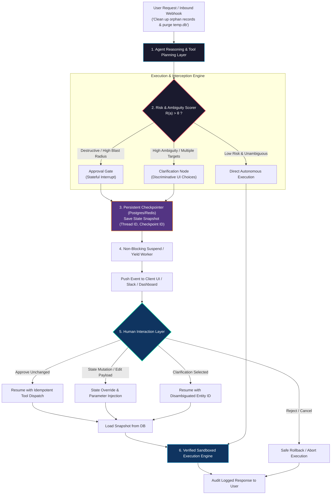
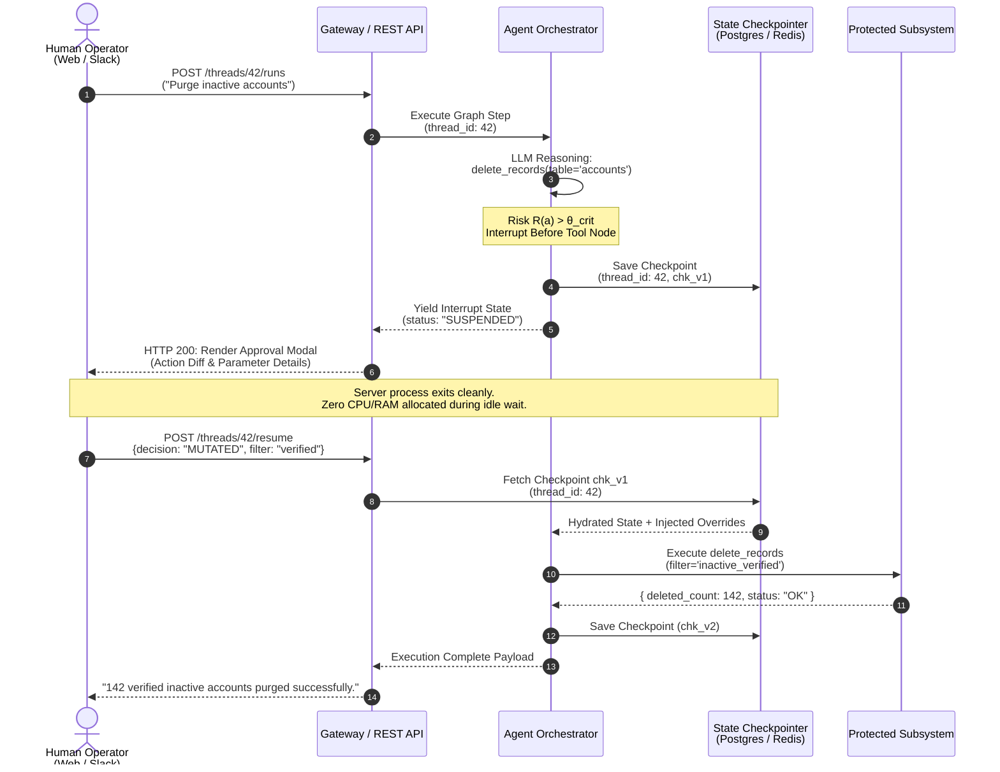
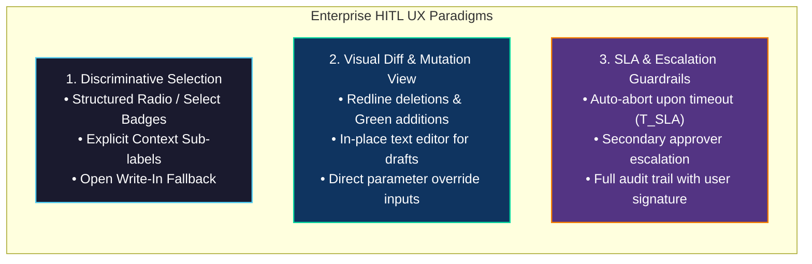

# Human-in-the-Loop (HITL) for Agent Collaboration

<!-- toc -->

<br/>
<br/>

In the preceding foundational chapters, we explored core agent reasoning patterns, multi-agent coordination, and resilient dynamic tool calling. As autonomous systems enter enterprise production, an absolute reliability boundary is reached: **Unconstrained Autonomy Under High Blast Radius**.

Delegating destructive actions (such as database deletions, high-value financial transfers, mass customer communications, or infrastructure modifications) entirely to probabilistic LLMs introduces unacceptable operational and compliance risk. 

This chapter formalizes the architecture of **Human-in-the-Loop (HITL)** agent collaboration—examining **Stateful Interrupts**, **Deterministic Checkpointing**, **Discriminative Clarification Loops**, and **State Override Engines** designed to ensure fail-safe human-agent synergy.

<br/>
<br/>

---

## 1. Architectural Foundations: The Spectrum of Autonomy & HITL

Human-in-the-loop is not a stopgap for weak models; it is a fundamental architectural design pattern that governs state transitions across the boundary between probabilistic reasoning and deterministic execution.

<br/>



<br/>

### 1.1 The Five Tiers of Autonomous System Operation

| Tier | Level of Autonomy | Human Role | Typical Application Domains |
|---|---|---|---|
| **L1** | Direct Scripting / Tool Wrappers | Full Execution Trigger | Deterministic CLI tools, standard scripts. |
| **L2** | AI Co-Pilot / Suggestive | Reviews every single suggestion | Code completion, inline document synthesis. |
| **L3** | **Human Approval Gate (Target HITL)** | **Approves/Edits high-impact steps** | **Database mutation, email dispatch, cloud deployments.** |
| **L4** | Autonomous with Exception | Intervenes only on anomaly/failure | Data extraction pipelines, automated unit testing. |
| **L5** | Full Autonomy | Purely post-hoc audit review | Low-risk indexing, self-contained game simulations. |

<br/>

### 1.2 Core HITL Patterns

1. **Pre-Execution Approval Gates:** The agent pauses immediately before triggering an irreversible tool call, generating a preview diff or payload summary for human sign-off.
2. **Clarification Loops (Disambiguation):** When natural language contains lexical or referential ambiguity (e.g., duplicate usernames, ambiguous dates), the agent pauses and solicits structured discriminative selection.
3. **State Override & Plan Mutation:** Humans can edit the agent's proposed tool arguments or modify memory variables in-flight before execution proceeds.
4. **Post-Execution Verification & Feedback (Active Learning):** Humans flag suboptimal tool outputs, injecting correction embeddings directly into long-term episodic memory.

<br/>
<br/>

---

## 2. Mathematical Modeling: Risk Thresholds & Entity Disambiguation

<br/>

### 2.1 Composite Action Risk Formulation

The agent computes a composite risk score $R(a)$ for every proposed action $a$ within context $\mathcal{C}$:

<br/>

$$
R(a) = \Big(1 - \mathbb{P}\big(\text{Confidence}(a) \mid \mathcal{C}\big)\Big) \cdot \operatorname{Impact}(a) + \lambda \cdot \operatorname{Irreversibility}(a)
$$

<br/>

Where:
- $\mathbb{P}\big(\text{Confidence}(a) \mid \mathcal{C}\big) \in [0, 1]$ represents the calibrated confidence of the agent.
- $\operatorname{Impact}(a) \in [0, 1]$ denotes the blast radius (e.g., financial cost, affected records).
- $\operatorname{Irreversibility}(a) \in [0, 1]$ measures the impossibility or cost of a rollback operation.
- $\lambda \in [0, 1]$ is the system-wide risk aversion coefficient.

<br/>

### 2.2 Dynamic Decision Boundary

<br/>

$$
\pi_{\text{exec}}(a) = 
\begin{cases} 
\text{Autonomous Execution} & \text{if } R(a) \le \theta_{\text{auto}} \\\\
\text{Clarification Loop (Disambiguate)} & \text{if } \theta_{\text{auto}} < R(a) \le \theta_{\text{crit}} \land \mathcal{H}(E \mid q) > \epsilon \\\\
\text{Approval Gate (Stateful Interrupt)} & \text{if } R(a) > \theta_{\text{crit}} 
\end{cases}
$$

<br/>

### 2.3 Ambiguity Metric: Entropy of Entity Resolution

When a user query $q$ refers to a candidate entity set $E = \lbrace e\_1, e\_2, \dots, e\_M \rbrace$, ambiguity is quantified using Shannon entropy:

<br/>

$$
\mathcal{H}(E \mid q) = -\sum\_{i=1}^M p(e\_i \mid q) \log\_2 p(e\_i \mid q)
$$

<br/>

- If $\mathcal{H}(E \mid q) = 0$ ($M=1$), a unique deterministic match exists; the agent proceeds without interruption.
- If $\mathcal{H}(E \mid q) > \epsilon$, high entropy dictates that guessing is forbidden; the agent generates structured selection options.

<br/>
<br/>

---

## 3. System Architecture: Checkpointing & Non-Blocking State Machines

A critical anti-pattern in naive HITL implementations is holding long-running server threads in memory via `sleep()` or pending HTTP connections. If a human takes 4 hours to review an email draft, memory leaks, connection timeouts, and container restarts will permanently corrupt the agent's execution state.

<br/>



<br/>

### 3.1 Architectural Principles for Production HITL

1. **Stateless Compute Workers:** Worker processes yield control immediately after checkpoint persistence, allowing server instances to autoscale to zero during human review periods.
2. **Deterministic State Hydration:** Checkpoint schemas encode conversation transcript, pending tool calls, arguments, and lineage version ($v\_1 \to v\_2$).
3. **Atomic State Override (Plan Mutation):** The resume endpoint accepts parameter overrides, performing structural schema validation before tool invocation.

<br/>
<br/>

---

## 4. Production Architecture: The Pause-and-Resume State Engine

The core technical implementation of HITL centers on **pre-node interception** and **stateful checkpoint resumption**. Rather than writing arbitrary glue code, production systems compile state graphs with explicit interrupt boundaries:

<br/>

```python
from typing import TypedDict, Optional, Any
from langgraph.graph import StateGraph, END
from langgraph.checkpoint.memory import MemorySaver

class AgentWorkflowState(TypedDict):
    action: str
    target_resource: str
    is_destructive: bool
    human_approved: Optional[bool]
    human_override_args: Optional[dict[str, Any]]
    result: Optional[str]

def plan_action(state: AgentWorkflowState) -> AgentWorkflowState:
    return {"action": "DROP_TABLE", "target_resource": "users_v1", "is_destructive": True}

def destructive_gate(state: AgentWorkflowState) -> AgentWorkflowState:
    if state["is_destructive"] and not state.get("human_approved"):
        raise PermissionError("Security policy violated: Destructive execution halted without human approval.")
    
    target = state.get("human_override_args", {}).get("target_resource", state["target_resource"])
    return {"result": f"Safely executed {state['action']} on {target}"}

# Graph compilation with pre-execution interrupt
workflow = StateGraph(AgentWorkflowState)
workflow.add_node("plan", plan_action)
workflow.add_node("execute", destructive_gate)
workflow.set_entry_point("plan")
workflow.add_edge("plan", "execute")
workflow.add_edge("execute", END)

# Intercept execution strictly before entering the destructive tool node
app = workflow.compile(checkpointer=MemorySaver(), interrupt_before=["execute"])
```

<br/>
<br/>

---

## 5. Enterprise UX / UI Design Patterns for HITL Systems

<br/>



<br/>

### 5.1 Discriminative Selection vs Open-Ended Inputs

- **The Problem:** Asking open-ended questions (*"Which Ahmet did you mean?"*) causes another cycle of fuzzy LLM parsing, semantic drift, and potential secondary errors.
- **The Solution:** Present distinct, selectable pills/buttons with contextual disambiguators (department, email, account ID). If none match, provide a single write-in text box as a safety valve.

### 5.2 Visual Diff & In-Flight Parameter Modification

For generated artifacts (e.g., email drafts, SQL scripts, PR descriptions), the UI presents a side-by-side or inline Git-style diff. Users edit text directly; clicking **"Approve with Modifications"** replaces the agent's proposed payload without restarting the reasoning cycle.

### 5.3 SLA Timeouts and Escalation Matrix

Unattended approval requests must not leave system resources in undefined states:
- **T_Timeout ($T\_{\text{SLA}}$):** If no response is received within the predefined SLA (e.g., 60 minutes), the agent aborts the action with a `TIMEOUT_ABORT` status.
- **Escalation Path:** For critical alerts, unacknowledged interrupts route notifications to secondary escalation channels (e.g., PagerDuty / On-call rotation).

<br/>
<br/>

---

## 6. Interactive Challenge Solutions

<br/>

<details>
  <summary><strong>Challenge 1: Trade-Off Analysis — Full Autonomy vs Human-in-the-Loop</strong></summary>
  <br/>

  ### Problem Statement
  *Analyze the fundamental engineering and business trade-offs between a Fully Autonomous Agent (L5) and a Human-in-the-Loop Architecture (L3/L4) across latency, operational cost, liability, and user trust.*

  ### Architectural Trade-Off Matrix

  | Dimension | Fully Autonomous Agent (L5) | Human-in-the-Loop System (L3/L4) |
  |---|---|---|
  | **End-to-End Latency** | **Near Real-Time ($< 5\text{s}$)**; bottlenecked only by LLM inference and tool API response times. | **Asynchronous ($T\_{\text{human}} \in [10\text{s}, 24\text{h}]$)**; requires non-blocking checkpoint state storage. |
  | **Operational Cost** | Lower per-task labor cost; high risk of catastrophic financial loss on edge-case hallucinations. | Minor human labor overhead; near-zero catastrophic error cost due to approval gates. |
  | **Error Blast Radius** | **Unbounded**; a single hallucinated SQL parameter can delete production databases. | **Bounded to Approved Scope**; destructive actions cannot execute without user sign-off. |
  | **User Trust & Alignment** | Low initial trust; opaque decision-making creates reluctance in enterprise deployment. | **High Trust**; users maintain supervisory control and observe alignment in real-time. |
  | **Infrastructure Complexity** | Simple stateless synchronous execution pipelines. | Complex event-driven state machines, persistent checkpointers, and webhook notification backbones. |

  #### Staff Engineer Recommendation:
  Deploy L5 autonomy exclusively for read-only analytical workloads, caching, and sandboxed simulation. Enforce L3/L4 HITL approval gates for any tool call with non-zero write or mutation privileges.
</details>

<br/>

<details>
  <summary><strong>Challenge 2: Automated Email Dispatch with Approval & In-Flight State Mutation</strong></summary>
  <br/>

  ### Problem Statement
  *Design an end-to-end agent workflow that drafts client emails based on CRM data, pauses for human approval, supports real-time text edits by the human reviewer, and safely dispatches the finalized email.*

  ### Architectural Workflow

  <br/>

  ```mermaid
  flowchart TD
      Inbound["CRM Event: Contract Renewal Pending"] --> Drafter["1. Agent Drafts Email Payload<br/>To: client@corp.com<br/>Subject: Renewal Terms<br/>Body: Proposed pricing & dates"]
      
      Drafter --> CheckpointSave["2. Save Checkpoint (thread_id: 88, status: PENDING_REVIEW)"]
      CheckpointSave --> RenderUI["3. Render Review UI with Inline Rich Editor"]
      
      RenderUI --> HumanChoice{"Human Review Action"}
      
      HumanChoice -->|Direct Approval| DispatchOriginal["Dispatch Original Draft via SendGrid"]
      HumanChoice -->|Edit Subject/Body| MutatePayload["Inject Mutated State: Updated Body & Pricing"]
      HumanChoice -->|Reject / Cancel| CancelState["Update State: CANCELLED"]
      
      MutatePayload --> DispatchMutated["Dispatch Mutated Draft via SendGrid"]
      
      DispatchOriginal --> Complete["4. Update CRM & Log Audit Record"]
      DispatchMutated --> Complete
      CancelState --> LogCancel["Log Rejection Reason to Memory"]

      style Drafter fill:#1a1a2e,stroke:#4cc9f0,stroke-width:1.5px,color:#fff
      style RenderUI fill:#0f3460,stroke:#06d6a0,stroke-width:2px,color:#fff
      style MutatePayload fill:#533483,stroke:#f77f00,stroke-width:2px,color:#fff
      style Complete fill:#0f3460,stroke:#4cc9f0,stroke-width:1.5px,color:#fff
  ```

  <br/>

  #### Core Implementation Protocol:
  1. **Draft Generation & Parameter Freezing:** The agent generates an email payload validated against a strict schema (`recipient`, `subject`, `html_body`, `cc_list`).
  2. **Non-Blocking Interrupt:** The orchestrator checkpoints the state and emits a webhook event to the management frontend.
  3. **State Mutation Dispatch:** If the reviewer modifies the body text in the UI editor, the API submits a mutation payload. The checkpointer overwrites the `html_body` key while preserving the original agent reasoning trace, then triggers the dispatch node.
</details>

<br/>

<details>
  <summary><strong>Challenge 3: Disambiguation with Structured UI Choices & Destructive Action Gate</strong></summary>
  <br/>

  ### Problem Statement
  *A user instructs an agent: 'Delete the log archive for Ahmet'. The database contains three users named Ahmet (DevOps, Frontend, QA). Implement the disambiguation strategy and approval gate.*

  ### Architectural Solution: Two-Stage Disambiguation & Approval Gate

  <br/>

  ```mermaid
  flowchart TD
      Query["User: 'Delete the log archive for Ahmet'"] --> Search["1. Query User Directory API: 'Ahmet'"]
      Search --> MatchCount{"Match Count (M)"}
      
      MatchCount -->|M == 1| SingleMatch["Direct Target Resolution"]
      MatchCount -->|M > 1| AmbiguityDetected["2. Ambiguity Detected (M=3)<br/>Entropy H(E|q) > ε"]
      
      AmbiguityDetected --> GenChoices["Generate Structured Clarification Payload<br/>• Ahmet Yilmaz (DevOps, ID: 101)<br/>• Ahmet Kaya (Frontend, ID: 102)<br/>• Ahmet Demir (QA, ID: 103)<br/>• Custom Write-in Fallback"]
      
      GenChoices --> Interrupt1["Suspend Graph: Await Disambiguation"]
      Interrupt1 --> UserPicks["User Selects: Ahmet Yilmaz (ID: 101)"]
      
      UserPicks --> ResumeDisambig["3. Resume Graph with target_id: 101"]
      SingleMatch --> ResumeDisambig
      
      ResumeDisambig --> DestructiveGate{"4. Destructive Action Check<br/>Action: DELETE_ARCHIVE"}
      DestructiveGate --> Interrupt2["Suspend Graph: Approval Gate<br/>'Are you sure you want to delete archives for Ahmet Yilmaz (101)?'"]
      
      Interrupt2 --> HumanConfirm{"Human Confirmation"}
      HumanConfirm -->|Confirmed| ExecDelete["Execute Delete Tool on S3/Storage"]
      HumanConfirm -->|Cancelled| Abort["Cancel Operation"]

      style AmbiguityDetected fill:#1a1a2e,stroke:#e94560,stroke-width:2px,color:#fff
      style GenChoices fill:#533483,stroke:#f77f00,stroke-width:1.5px,color:#fff
      style DestructiveGate fill:#1a1a2e,stroke:#e94560,stroke-width:2px,color:#fff
      style ExecDelete fill:#0f3460,stroke:#06d6a0,stroke-width:2px,color:#fff
  ```

  <br/>

  #### Engineering Nuances:
  1. **Discriminative Selection Delivery:** The agent avoids open-ended prompting by presenting clear selectable options with distinguishing organizational metadata (Department, Employee ID, Email).
  2. **Double-Gate Protection:** Disambiguation (Stage 1) resolves *identity ambiguity*; the Approval Gate (Stage 2) enforces *authorization and blast-radius confirmation*.
  3. **Audit Immutability:** The final execution log records both the human approver's identity and the disambiguation choice token for compliance traceability.
</details>
