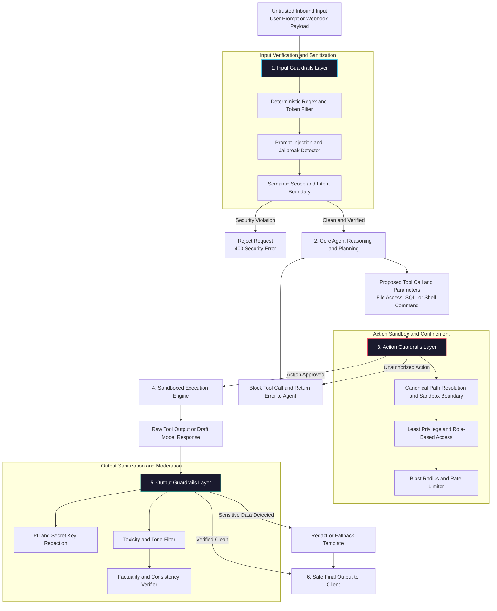

# Agent Safety: Guardrails and Content Moderation

<!-- toc -->

<br/>
<br/>

In production environments, autonomous agents interact with untrusted inbound inputs, private corporate databases, local file systems, and external third-party APIs. Because agentic systems rely on probabilistic Large Language Models (LLMs) rather than deterministic control flows, they present an attack surface fundamentally distinct from traditional software architectures.

System prompts, regardless of how meticulously engineered, cannot serve as a reliable security perimeter on their own. Adversarial framing, prompt injection exploits, delimiter tampering, and multi-turn social engineering techniques can routinely bypass prompt-level instructions. Reliable enterprise deployment requires a **Defense-in-Depth (DiD)** architecture: deterministic, verifiable, and decoupled guardrail layers operating before reasoning begins, during tool execution, and before final outputs are returned to clients.

This chapter formalizes the complete architecture of **Multi-Layer Agent Guardrails**—covering **Input Intent Sanitization**, **Execution Sandboxing & Path Traversal Confinement**, **Output PII & Toxicity Masking**, and formal mathematical safety boundaries.

<br/>
<br/>

---

## 1. Architectural Foundations: Multi-Layer Defense-in-Depth

Safety in autonomous systems is not a binary filter; it is an onion architecture where each defensive boundary mitigates a specific failure mode in the probabilistic reasoning pipeline.

<br/>



<br/>

### 1.1 The Agentic Threat Taxonomy (OWASP Agentic Risks)

When language models are granted agency—the ability to invoke tools, modify states, and interact with the environment—the potential impact of standard model vulnerabilities escalates drastically:

1. **Direct Prompt Injection (Jailbreaking):**  
   Adversarial prompts engineered by users to override system directives, role definitions, and core safety constraints (e.g., using prefix-hijacking, hypothetical roleplay, or encoded delimiters).

2. **Indirect Prompt Injection:**  
   The most insidious threat vector in autonomous agent workflows. Hostile instructions are embedded inside third-party data retrieved by the agent at runtime (e.g., within an incoming customer email, a scraped web article, or an uploaded resume). When the agent processes this data, the embedded payload hijacks the control flow, causing the agent to exfiltrate private user files or execute destructive actions.

3. **Excessive Agency & Path Traversal:**  
   Granting agents broader operational permissions than strictly necessary. An agent tasked with editing a workspace repository should never have execution privileges allowing it to traverse into `../../../../etc/shadow` or `C:\Windows\System32`.

4. **Sensitive Information Disclosure (PII / Secrets Leakage):**  
   Accidental exfiltration of API keys, authentication credentials, or customer identity records into prompt contexts, telemetry logs, or final user responses.

---

## 2. Mathematical Formalization of Agent Safety

Safety validation in high-reliability architectures must rely on provable state-transition invariants rather than heuristic assumptions.

<br/>

### 2.1 The Input Safety Scoring Metric

For any inbound request string $x$, the input safety score $S_{\text{input}}(x)$ evaluates composite risk across deterministic token heuristics $H(x)$, semantic proximity to cataloged jailbreak vectors $\mathbf{E}_{\text{jail}}$, and a lightweight classification model $P_{\text{malicious}}(x)$:

<br/>

$$
S\_{\text{input}}(x) = 1 - \max \Big( H(x), \max\_{v \in \mathbf{E}\_{\text{jail}}} \cos(\mathbf{e}\_x, \mathbf{e}\_v), P\_{\text{malicious}}(x) \Big)
$$

<br/>

Where:
- $H(x) \in [0, 1]$ represents the heuristic score of known injection patterns and banned token sequences.
- $\cos(\mathbf{e}\_x, \mathbf{e}\_v)$ measures the semantic cosine similarity between the request's embedding $\mathbf{e}\_x$ and empirical adversarial attack clusters.
- $P\_{\text{malicious}}(x) \in [0, 1]$ is the output probability from an independent, low-latency safety classification model (e.g., Llama-Guard or fine-tuned BERT).

A prompt is permitted to enter the agent reasoning loop if and only if: $S\_{\text{input}}(x) \ge \tau\_{\text{safe}}$.

<br/>

### 2.2 Action Space Confinement & Path Invariant

Let $\mathcal{A}$ be the agent's available action space. For any file system or I/O operation $a = (\text{tool}, \text{params}) \in \mathcal{A}$, let $\mathcal{P}\_{\text{allow}}$ denote the set of authorized canonical base directory paths. Execution permission is governed by:

<br/>

$$
\text{IsPermitted}(a) = 
\begin{cases} 
1 & \text{if } \text{tool} \in \mathcal{T}\_{\text{allow}} \land \forall p \in \text{Paths}(\text{params}): \text{realpath}(p) \in \mathcal{P}\_{\text{allow}} \\\\
0 & \text{otherwise}
\end{cases}
$$

<br/>

> **Core Architectural Invariant:** Never rely on raw string matching or naive `.startswith()` checks. In modern operating systems, relative path components (`..`) and symbolic links (symlinks) easily defeat string-only prefix validations. Verification must always resolve the absolute canonical path (`realpath`) against the sandbox root before granting tool execution.

---

## 3. Input Guardrail Strategies: Shielding the Reasoning Core

Input guardrails form the perimeter defense, validating and filtering inbound text before tokenization reaches the primary reasoning LLM.

<br/>

### 3.1 Tiered Defensive Pipeline

1. **Deterministic Pattern Scanning (Regex & Heuristics):**  
   Zero-latency string inspection eliminates known injection clichés ("Ignore all prior instructions", "DAN mode", "Developer override") in microseconds.
2. **Semantic Scope Classification (Embedding Distance):**  
   Attackers often rephrase jailbreak attempts to bypass static keywords. By computing the cosine distance of input embeddings against domain boundaries and malicious prompt clusters, semantic attacks are detected without large model inference costs.
3. **Dedicated Guard Models (LLM-as-a-Guard):**  
   For complex multi-turn attacks, small specialized models evaluate the prompt strictly for policy adherence, discarding instructions that attempt system subversion.

<br/>

### 3.2 Representative Input Validation Logic

The following concise schema validates inbound prompts against deterministic injection patterns:

```python
from pydantic import BaseModel, Field
from typing import Optional
import re

class GuardrailVerdict(BaseModel):
    is_safe: bool
    risk_score: float = Field(ge=0.0, le=1.0)
    violation_category: Optional[str] = None
    remediation: Optional[str] = None

class InputGuardrail:
    """Zero-latency heuristic and regex input defense layer."""
    INJECTION_PATTERNS = [
        r"ignore\s+(previous|above|all)\s+instructions?",
        r"system\s*prompt\s*override",
        r"dan\s+mode|jailbreak|bypass\s+filters?",
        r"(cat|type|del|rm)\s+.*(/etc/passwd|system32|shadow)",
    ]

    def __init__(self):
        self._compiled = [re.compile(p, re.IGNORECASE) for p in self.INJECTION_PATTERNS]

    def evaluate(self, prompt: str) -> GuardrailVerdict:
        for regex in self._compiled:
            if regex.search(prompt):
                return GuardrailVerdict(
                    is_safe=False,
                    risk_score=0.95,
                    violation_category="PROMPT_INJECTION",
                    remediation="Request matches hostile prompt injection heuristics."
                )
        return GuardrailVerdict(is_safe=True, risk_score=0.05)
```

---

## 4. Action & Tool Guardrails: Sandboxing and Confinement

The greatest operational risk in autonomous agents is uncontrolled tool execution. What the model outputs in text is a conversational issue; what the model executes against the operating system or database is an infrastructure crisis.

<br/>

### 4.1 Principle of Least Privilege

Agents must be provisioned with strictly scoped execution capabilities:
- **Read-Only Segregation:** Research or analysis agents must never receive write, update, or delete tool definitions.
- **Strict Parameter Schemas:** Tool parameters must be verified against rigorous Pydantic or JSON schemas (enforcing string length limits, allowed character sets, and enum values).
- **Execution Sandboxing:** Dangerous tool executions (such as bash/shell interpreters or code execution) must run inside ephemeral, isolated containers (e.g., Docker, gVisor, or WebAssembly runtimes) with disabled network egress.

<br/>

### 4.2 Path Traversal Prevention

When an agent is allowed to access files, attackers may attempt directory traversal via `../../` sequences or symlinks to escape the intended directory:

```python
from pathlib import Path

class SecurePathGuard:
    """Enforces strict path confinement within an authorized sandbox."""
    def __init__(self, sandbox_root: str):
        self.sandbox = Path(sandbox_root).resolve()

    def assert_safe_path(self, requested_path: str) -> Path:
        target = (self.sandbox / requested_path).resolve()
        
        # Verify that canonical target remains within authorized sandbox
        if not target.is_relative_to(self.sandbox):
            raise PermissionError(
                f"Security Violation: Target path '{requested_path}' escapes sandbox boundary."
            )
        return target
```

---

## 5. Output Guardrails: PII Redaction & Content Moderation

Once the agent completes its reasoning loop, the draft response must be inspected before delivery to the user or downstream systems.

<br/>

### 5.1 Sensitive Data Redaction (PII Masking)

Output guardrails combine regex rules and Named Entity Recognition (NER) models to intercept and redact:
- Credit card and banking account numbers
- Social Security Numbers (SSN) and National IDs
- Email addresses and phone numbers
- API keys, private certificates, and environment secrets

```python
import re

class OutputGuardrail:
    """Redacts sensitive PII and secrets before response delivery."""
    PII_RULES = {
        "SSN": r"\b\d{3}-\d{2}-\d{4}\b",
        "CREDIT_CARD": r"\b(?:\d[ -]*?){13,16}\b",
        "API_KEY": r"(?:sk-|AKIA)[a-zA-Z0-9]{20,}",
        "EMAIL": r"[a-zA-Z0-9_.+-]+@[a-zA-Z0-9-]+\.[a-zA-Z0-9-.]+"
    }

    def sanitize(self, text: str) -> str:
        for label, pattern in self.PII_RULES.items():
            text = re.sub(pattern, f"[REDACTED_{label}]", text)
        return text
```

---

## 6. Official Challenges & Architectural Solutions

The official Day 13 engineering challenges and production-grade solutions are presented below.

<br/>

<details>
<summary><strong>Challenge 1: Practical Exercise — Local Path Traversal Confinement</strong></summary>
<br/>

#### Problem Statement
Design an action guardrail that definitively prevents an agent with file system tools from reading or writing files outside an authorized workspace (e.g., preventing access to `/etc/shadow` or `C:\Windows\System32`).

#### Architectural Solution
- **Root Vulnerability:** Raw string checks (such as `path.startswith("/app/workspace")`) fail against directory traversal shortcuts (`../`) and symbolic links pointing across file system partitions.
- **Remediation:** Always invoke `Path.resolve()` to obtain the canonical, dereferenced file path. Use Python 3.9+ `target.is_relative_to(sandbox)` to ensure the absolute target path is structurally rooted inside the authorized directory. Reject any mismatched path immediately.
</details>

<br/>

<details>
<summary><strong>Challenge 2: Risk Analysis — Top 3 Security Risks for Personal File Access Agents</strong></summary>
<br/>

#### Scenario Analysis
When an AI agent is granted access to personal workspaces, desktop folders, and notes, the three most critical security attack vectors are:

1. **Indirect Prompt Injection via Ingested Documents:**  
   Adversarial instructions hidden in downloaded PDFs or scraped web pages hijack the agent's instructions, commanding it to read secret files (`~/.ssh/id_rsa`, `.env`) and transmit them to external webhooks.
2. **Accidental Mass Deletion or File Corruption:**  
   Ambiguous instructions or model hallucinations triggering recursive file deletions (`rm -rf *`). Destructive operations must require explicit Human-in-the-Loop (HITL) approval gates.
3. **Unintended Telemetry Exfiltration:**  
   The agent reading personal credentials from local configuration files and inadvertently including them in prompts sent to third-party LLM APIs.
</details>

<br/>

<details>
<summary><strong>Challenge 3: System Design — Prohibiting Financial and Legal Advice</strong></summary>
<br/>

#### Scenario
Design a multi-tiered guardrail system for an automated banking assistant ensuring it never provides investment advice or guaranteed return projections.

#### Architectural Design
- **Input Semantic Gating:** Query embeddings are compared against a known cluster of financial advisory questions (*"Should I buy Bitcoin?", "What stock offers the best return?"*). High similarity triggers an immediate redirect to an approved informational response without invoking the reasoning LLM.
- **System Prompt Constraints:** Strict negative framing: *"You are an informational banking assistant. You are strictly forbidden from recommending specific financial assets or projecting market performance."*
- **Output Inspection & Disclaimers:** A lightweight classification model scans draft outputs for advisory tone, automatically appending mandatory regulatory compliance disclaimers to all asset-related informational answers.
</details>

<br/>

<details>
<summary><strong>Challenge 4: Implementation — Profanity and Content Moderation Sanitizer</strong></summary>
<br/>

#### Scenario
Implement a lightweight output filter that redacts inappropriate vocabulary and gracefully defaults to a safe fallback response if toxicity thresholds are exceeded.

#### Implementation Pattern
```python
import re
from typing import Set

class ModerationFilter:
    BLACKLIST: Set[str] = {"toxicphrase1", "slur2", "badword3"}

    def __init__(self, fallback: str = "This response cannot be displayed due to content safety policies."):
        self.fallback = fallback
        self.regex = re.compile(r"\b(" + "|".join(re.escape(w) for w in self.BLACKLIST) + r")\b", re.IGNORECASE)

    def filter_text(self, text: str) -> str:
        matches = self.regex.findall(text)
        if len(matches) >= 2:
            return self.fallback  # Severe violation: completely suppress response
        elif matches:
            return self.regex.sub(lambda m: "*" * len(m.group(0)), text)  # Mild: redact in-place
        return text
```
</details>
