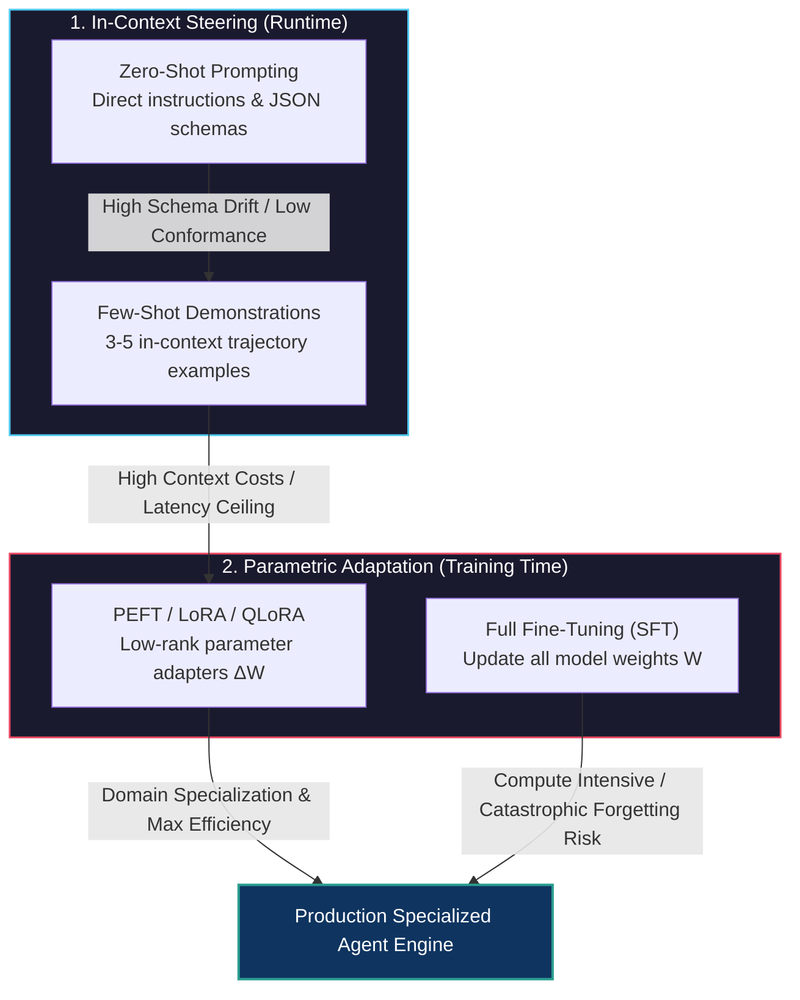
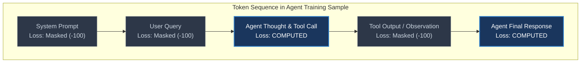
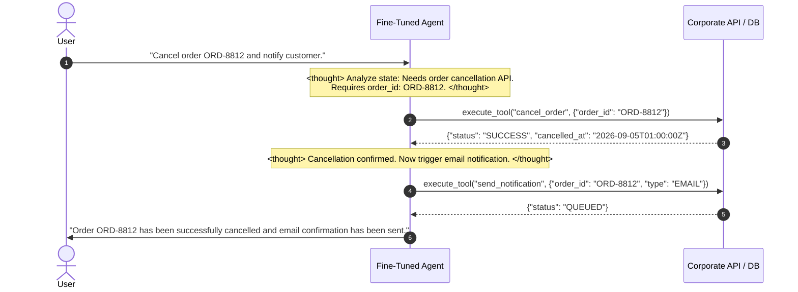
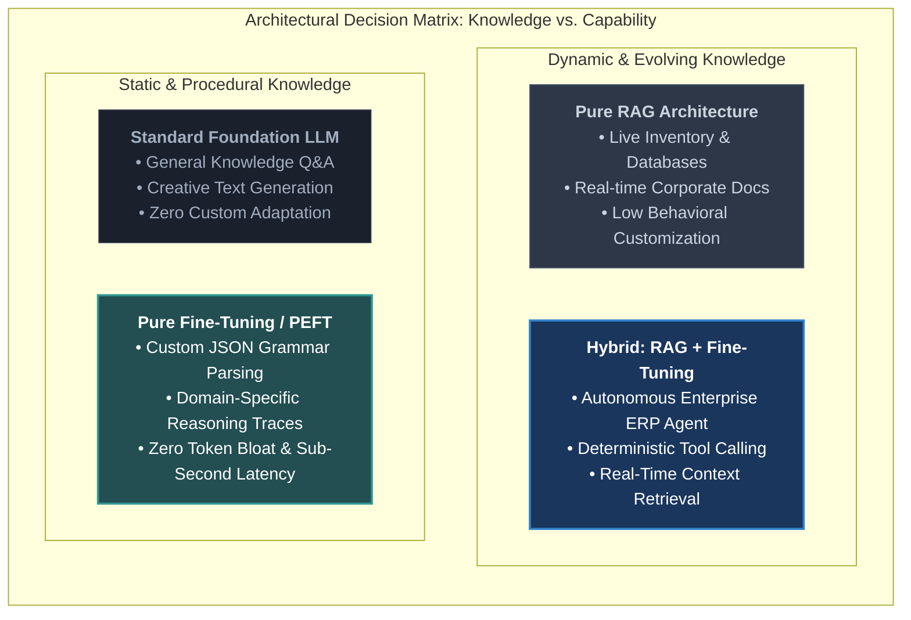

# Introduction to Fine-Tuning for Agentic Behavior

<!-- toc -->

<br/>
<br/>

In production environments, engineering robust autonomous agents initially begins with in-context prompting: zero-shot directives, multi-shot demonstrations, and structured output formatting schemas embedded directly into the system prompt. However, as agent workflows grow in complexity—requiring multi-step tool invocations, resilient error recovery, strict JSON schema conformance, and sub-second decision latency—prompt engineering hits fundamental operational, financial, and architectural bottlenecks.

Prompt-only agents consume significant context window capacity on repetitive tool schemas and few-shot trajectory examples. Furthermore, under complex decision trees, general-purpose foundation models frequently suffer from schema drift, hallucinated parameters, and brittle tool invocation parsing. 

**Fine-tuning for agentic behavior** transforms the operational paradigm: instead of instructing the model on *how* to reason and invoke tools via runtime context prompts, the agent's reasoning patterns, tool-calling syntax, and trajectory execution protocols are mathematically baked directly into the model's weights.

This chapter formalizes the complete architecture of **Agentic Fine-Tuning**—covering **Prompting vs. Fine-Tuning Trade-offs**, **Trajectory Dataset Engineering**, **Parameter-Efficient Adaptation (LoRA/QLoRA)**, **Loss Masking Mechanics**, and the **Fine-Tuning vs. RAG Strategic Decision Matrix**.

<br/>
<br/>

---

## 1. Architectural Foundations: The Adaptation Spectrum

Adapting Large Language Models for agentic workflows spans a continuum from runtime in-context steering to structural parametric modification.

<br/>



<br/>

### In-Context Learning vs. Weight Adaptation

| Dimension | Zero-Shot / Few-Shot Prompting | Agentic Fine-Tuning (LoRA / SFT) |
| :--- | :--- | :--- |
| **Adaptation Mechanism** | Modifies activation states in working KV-cache. | Modifies weight tensors ($W = W_0 + \Delta W$). |
| **Context Overhead** | **High:** 2,000–8,000 tokens per request for schemas & examples. | **Zero:** Tool schemas and formats are internal priors. |
| **Inference Latency (TTFT)** | High Time-to-First-Token due to long input sequence processing. | Ultra-low TTFT; inputs contain only dynamic state and query. |
| **Format & Schema Conformance** | 80%–92% reliability on small models (7B/8B). | **99.5%+ deterministic JSON/Tool call validity.** |
| **Compute & Serving Profile** | Shared commodity endpoints (OpenAI, Anthropic). | Dedicated inference engine or dynamic LoRA adapter routing. |
| **Knowledge Mutability** | High: dynamic external data injected per request. | Static: knowledge frozen at checkpoint cutoff. |

<br/>
<br/>

---

## 2. Why Fine-Tune for Agents? Core Drivers

While general-purpose flagship models (e.g., GPT-4o, Claude 3.5 Sonnet) exhibit outstanding zero-shot reasoning, deploying them across high-throughput enterprise agent fleets presents critical challenges:

### 1. Deterministic Tool Calling & Schema Adherence
Small open-weights models (7B–8B parameters such as Llama 3, Mistral, or Qwen) frequently stumble when parsing nested JSON parameters, multi-argument functions, or strict enum fields under zero-shot conditions. Fine-tuning grounds the model's generation probabilities strictly within the valid grammar of target APIs, eliminating syntactical parsing failures.

### 2. Radical Token Economics & Latency Optimization
In multi-agent and multi-turn loops, injecting 4,000 tokens of API definitions and few-shot exemplars across 15 turns burns 60,000 input tokens per user session. By distilling these behavioral protocols into model weights:
- System prompt size drops from **4,500 tokens to under 150 tokens**.
- Time-to-First-Token (TTFT) decreases by **60%–80%**.
- Token billing decreases by up to **90%**.

### 3. Trajectory-Level Reasoning (Chain-of-Thought Alignment)
Fine-tuning enables teams to train agents to follow custom reasoning protocols (e.g., specific `<thought>` reflection blocks, domain-specific security checks before action execution, or disciplined step-by-step hypothesis validation) without writing paragraphs of meta-instructions in every prompt.

### 4. Small-Model Distillation (Edge & VPC Deployment)
An enterprise can distill the multi-turn agentic capabilities of a 400B+ teacher model into a specialized 8B parameter student model. The 8B student can then be self-hosted inside a secure Virtual Private Cloud (VPC) with strict data sovereignty, low cost, and dedicated sub-second latency.

<br/>
<br/>

---

## 3. Mathematical Formulations: Loss Masking & LoRA

### 1. Masked Target Cross-Entropy Loss

In standard causal language modeling, cross-entropy is computed over the entire token sequence. However, in agent fine-tuning, the prompt sequence $x$ (system prompt, user query, tool execution results) is given as external context. The model must **only be penalized for errors in its own generations** (the thought tokens and tool-call actions $y$).

Given input context $x = (x_1, \dots, x_N)$ and target generation sequence $y = (y_1, \dots, y_T)$:

$$
\mathcal{L}\_{\text{Agent}}(\Theta) = - \frac{1}{T} \sum\_{t=1}^T \log P\_\Theta(y\_t \mid x\_1, \dots, x\_N, y\_1, \dots, y\_{t-1})
$$

Tokens corresponding to system instructions, user inputs, and external tool outputs have their loss labels set to $-100$ (PyTorch `ignore_index`), ensuring zero gradient propagation from external text.

<br/>



<br/>

### 2. Parameter-Efficient Fine-Tuning: LoRA Mechanics

Rather than modifying the entire dense weight matrix $W_0 \in \mathbb{R}^{d \times k}$ during backpropagation, Low-Rank Adaptation (LoRA) freezes $W_0$ and decomposes the accumulated update $\Delta W$ into two low-rank matrices $A$ and $B$:

$$\Delta W = \frac{\alpha}{r} (B \cdot A)$$

where $A \in \mathbb{R}^{r \times k}$ is initialized from a Gaussian distribution $\mathcal{N}(0, \sigma^2)$, $B \in \mathbb{R}^{d \times r}$ is initialized to zero, $r \ll \min(d, k)$ denotes the adapter rank (commonly $r \in \{8, 16, 32, 64\}$), and $\alpha$ is a constant scaling hyperparameter.

The effective forward pass computation becomes:

$$h = W_0 x + \Delta W x = W_0 x + \frac{\alpha}{r} B(A x)$$

During inference, $B \cdot A$ can be permanently merged into $W_0$ without introducing any architectural latency penalty:

$$
W\_{\text{merged}} = W_0 + \frac{\alpha}{r}(B \cdot A)
$$

<br/>
<br/>

---

## 4. Dataset Engineering: Trajectory Curation

A fine-tuning dataset for autonomous agents is fundamentally distinct from standard question-answering pairs. It consists of **multi-turn execution trajectories**.

<br/>



<br/>

### Essential Ingredients of an Agent Dataset

1. **Diverse Syntactic Variations:** Hundreds of distinct phrasings mapping to identical tool invocation goals to prevent semantic overfitting.
2. **Negative and Refusal Trajectories:**
   - **Missing Information:** When a required parameter is absent, the agent must ask clarifying questions rather than hallucinating dummy inputs.
   - **Out-of-Scope Requests:** Prompt injection attempts and out-of-domain requests must trigger safe fallback refusals.
3. **Fault-Tolerant Trajectories (Error Recovery):**
   - In 15%–20% of training trajectories, mock the API returning `404 Not Found`, `429 Rate Limit`, or `500 Internal Error`.
   - Train the agent to analyze the error in a `<thought>` step and gracefully retry, switch to an alternative tool, or clearly explain the issue to the human operator.
4. **Structured Markup Formats:** Consistent use of special delimiters (such as `<thought>...</thought>` and `<tool_call>...</tool_call>`) across all samples.

<br/>
<br/>

---

## 5. Strategic Decision Matrix: Fine-Tuning vs. RAG

A frequent architectural failure in enterprise AI is misapplying fine-tuning as a knowledge storage mechanism.

<br/>



<br/>

### Architectural Decision Framework

```
                          Do you need the agent to have...
                                      │
                 ┌────────────────────┴────────────────────┐
                 ▼                                         ▼
      Dynamic, Evolving Knowledge               Structured Behavior / Format
         (Prices, Docs, DBs)                     (APIs, Syntax, Reasoning)
                 │                                         │
                 ▼                                         ▼
       Use RAG & Vector DBs                     Use Parameter Fine-Tuning
                 │                                         │
                 └────────────────────┬────────────────────┘
                                      ▼
                        Need both at enterprise scale?
                                      │
                                      ▼
                Hybrid: Fine-Tuned Agent using RAG Tools
```

- **Use RAG When:** Data changes frequently (hourly/daily), factuality must be guaranteed via citations, and documents exceed model parameter limits.
- **Use Fine-Tuning When:** You need deterministic tool schemas, sub-second latency, lower token consumption, specialized reasoning syntax, or small model distillation.
- **Combine Both When:** The agent needs specialized tool-execution instincts (Fine-Tuning) to retrieve and synthesize real-time corporate data (RAG).

<br/>
<br/>

---

## 6. Implementation Pattern: Trajectory Schema & Target Loss Masking

Below is a production-grade dataset validation schema and PyTorch causal target loss masking routine (strictly under 35 lines each), enforcing loss computation exclusively on agent generations.

<br/>

### Trajectory Validation Schema (Pydantic)

```python
from typing import List, Optional, Literal
from pydantic import BaseModel, Field

class ToolCall(BaseModel):
    id: str
    type: Literal["function"] = "function"
    name: str
    arguments: str  # Serialized JSON string

class TrajectoryMessage(BaseModel):
    role: Literal["system", "user", "assistant", "tool"]
    content: Optional[str] = None
    thought: Optional[str] = Field(None, description="CoT reasoning trace")
    tool_calls: Optional[List[ToolCall]] = None
    tool_call_id: Optional[str] = None

class AgentTrajectorySample(BaseModel):
    messages: List[TrajectoryMessage]
```

<br/>

### PyTorch Target Loss Masking Implementation

```python
import torch

def compute_masked_agent_loss(
    logits: torch.Tensor,       # Shape: [batch_size, seq_len, vocab_size]
    labels: torch.Tensor,       # Shape: [batch_size, seq_len]
    agent_token_mask: torch.Tensor, # Shape: [batch_size, seq_len] (1 for assistant, 0 for context)
    ignore_index: int = -100
) -> torch.Tensor:
    """Masks loss on user/system/tool inputs, computing gradients only on assistant tokens."""
    # Set all context tokens to ignore_index
    target_labels = labels.clone()
    target_labels[agent_token_mask == 0] = ignore_index

    # Shift logits and labels for standard causal auto-regressive prediction
    shift_logits = logits[..., :-1, :].contiguous()
    shift_labels = target_labels[..., 1:].contiguous()

    loss_fn = torch.nn.CrossEntropyLoss(ignore_index=ignore_index)
    return loss_fn(shift_logits.view(-1, shift_logits.size(-1)), shift_labels.view(-1))
```

<br/>
<br/>

---

## 7. Interactive Challenge & Deep Architectural Solutions

<details>
<summary><strong>Challenge 1: Conceptual Foundations — Zero-Shot vs. Few-Shot vs. Fine-Tuning</strong></summary>
<br/>

#### Scenario
An engineering team is evaluating whether to implement Few-Shot Prompting or LoRA Fine-Tuning for a customer support agent interacting with 15 internal REST APIs.

#### Comparative Breakdown
1. **Zero-Shot Prompting:** Provides only tool OpenAPI specs and general instructions. Prone to hallucinating parameter names and failing on complex multi-step dependency calls.
2. **Few-Shot Prompting:** Adds 3–5 complete multi-turn trajectory examples to the system prompt.
   - *Pros:* Zero training overhead, fast prototyping, immediate iteration.
   - *Cons:* Consumes 3,000–6,000 tokens of context on every single invocation. Drastically inflates inference costs and Time-to-First-Token latency.
3. **LoRA Fine-Tuning:** Embeds the API calling patterns and reasoning traces directly into low-rank adapter weights.
   - *Pros:* Near-100% deterministic schema conformance, zero token bloat in runtime prompts, fast inference, and unlocks the use of lightweight 8B models.
   - *Cons:* Requires curated trajectory datasets, hyperparameter tuning, and adapter lifecycle management.
</details>

<br/>

<details>
<summary><strong>Challenge 2: Dataset Engineering — Curation Strategy for Internal Microservice APIs</strong></summary>
<br/>

#### Scenario
You are tasked with building a fine-tuning dataset for an autonomous DevOps agent managing internal Kubernetes clusters and cloud deployments. What types of trajectories must be included?

#### Architectural Solution
A robust dataset must never consist solely of happy-path executions. It requires a 4-part distribution:
1. **Nominal Executions (60%):** Valid user intents with clean parameter extraction, accurate `<thought>` planning, and correct tool invocations.
2. **Clarification Trajectories (15%):** Ambiguous or underspecified user queries (*"Deploy service to prod"*) where the agent asks for the missing cluster name and image tag instead of guessing.
3. **Error Recovery & Fallback (15%):** Mocked API failures (e.g., `404 Pod Not Found`, `403 Forbidden`, `504 Gateway Timeout`). The agent evaluates the error code in a thought block and executes diagnostic or rollback commands.
4. **Adversarial & Refusal Trajectories (10%):** Prompt injection attempts, unauthorized privilege escalations, and out-of-scope queries where the agent safely declines execution.
</details>

<br/>

<details>
<summary><strong>Challenge 3: Strategic Architectural Decision — Fine-Tuning vs. RAG for Knowledge Ingestion</strong></summary>
<br/>

#### Scenario
A financial firm wants an AI agent that knows the latest variable loan rates, underwriting criteria, and company risk guidelines. A developer proposes fine-tuning an 8B model weekly on the company's internal PDFs.

#### Architectural Critique
- **The Core Flaw:** Fine-tuning modifies generation style and behavioral mechanics; it is an inefficient and unreliable mechanism for factual knowledge storage. Parametric knowledge suffers from catastrophic forgetting, hallucinations, and lacks verifiable source citations.
- **The Solution:** Implement a **RAG-first architecture**. Store loan rates and underwriting guidelines in a vector database and relational store. Fine-tune the agent **only on how to formulate search queries and invoke the retrieval tools**, not on the dynamic financial data itself.
</details>

<br/>

<details>
<summary><strong>Challenge 4: Technical Deep Dive — Loss Masking on Assistant Actions</strong></summary>
<br/>

#### Scenario
Why does calculating cross-entropy loss over user prompt tokens degrade an agent's reasoning performance during Supervised Fine-Tuning (SFT)?

#### Mathematical Analysis
If loss is computed across all tokens:
$$
\mathcal{L} = \mathcal{L}\_{\text{prompt}} + \mathcal{L}\_{\text{completion}}
$$
The model expends gradient updates learning to predict the user's phrasing, syntax, and arbitrary typos. This leads to **capacity waste**, catastrophic forgetting of pre-trained linguistic knowledge, and model degradation. Setting prompt labels to `-100` ensures that backpropagation updates only the parameters responsible for autonomous thought generation and tool invocation.
</details>
