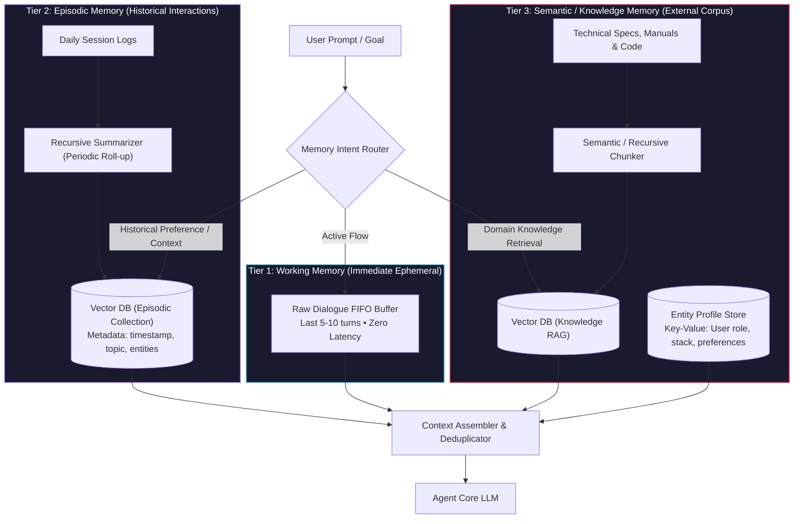
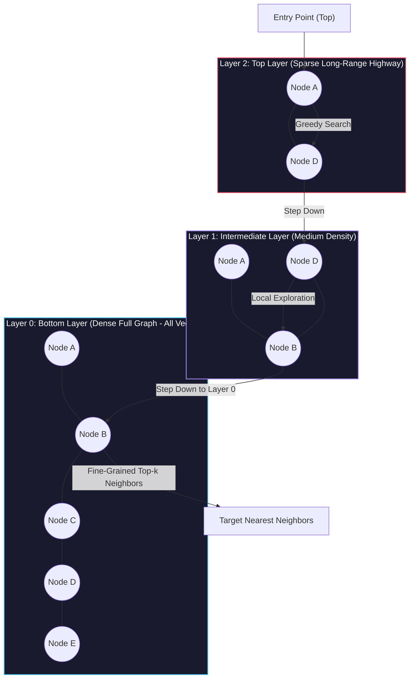
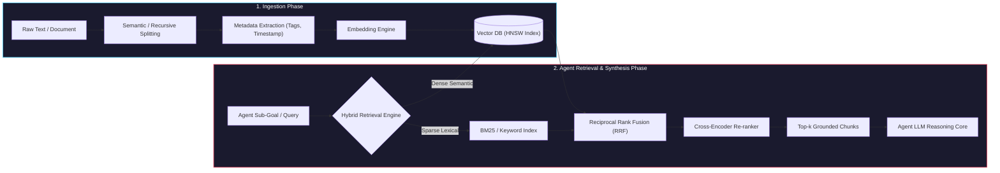

# Advanced Memory: Vector Databases and RAG

<!-- toc -->

<br/>
<br/>

In autonomous agent architectures, foundational reasoning models are fundamentally constrained by the ephemeral nature of their context windows. While prompt engineering and in-context sliding buffers allow agents to maintain fleeting conversational state across a handful of turns, production-grade agents operating over weeks, months, or vast corporate knowledge domains quickly encounter severe architectural bottlenecks: **context window exhaustion**, quadratic inference cost scaling, **"lost in the middle" attention degradation**, and **parametric staleness**.

To transcend these limitations, production systems decouple **reasoning** (the parametric weights of the neural model) from **memory** (an external, non-parametric, high-dimensional semantic storage engine). By integrating **Vector Databases** and **Retrieval-Augmented Generation (RAG)**, autonomous agents acquire long-term, indexed, and queryable memory.

This chapter formalizes the complete architecture of **Agentic Long-Term Memory**—covering **Multi-Tier Memory Hierarchies**, **Vector Embeddings & Geometric Semantics**, **Approximate Nearest Neighbor (ANN) Indexing Internals**, **The Agentic RAG Pipeline (Chunking, Hybrid Search, and Re-Ranking)**, and **Production Implementations**.

<br/>
<br/>

---

## 1. Architectural Foundations: Limitations of Basic Memory & The Multi-Tier Paradigm

A common architectural antipattern in early agent prototypes is relying exclusively on raw conversational buffers (`messages = [...]`).

<br/>

### 1.1 The Trilemma of Sliding Window Memory

1. **Context Window Exhaustion ($O(N)$ Token Costs):** As dialogue turns accumulate, injecting full conversational histories inflates latency and token consumption on every model invocation.
2. **Attention Degradation ("Lost in the Middle"):** Transformer self-attention mechanisms exhibit a well-documented U-shaped retrieval curve: information positioned in the middle of long prompts experiences significantly lower attention weights compared to tokens at the beginning or end.
3. **Semantic Noise & Context Pollution:** Ingesting hundreds of historical messages indiscriminately introduces conflicting instructions, outdated facts, and conversational tangents that derail agent planning.

<br/>

### 1.2 The 3-Tier Hierarchical Memory Architecture

To resolve this trilemma, robust autonomous agents structure memory into distinct functional tiers based on access latency, temporal locality, and semantic abstraction.

<br/>



<br/>

| Memory Tier | Storage Mechanism | Retention Horizon | Primary Function |
|---|---|---|---|
| **Tier 1: Working Memory** | In-Memory RAM / Redis Buffer | Minutes (Current Session) | Multi-turn immediate coherence and active tool feedback. |
| **Tier 2: Episodic Memory** | Vector Store + Summarized Chunks | Weeks / Months | Past decisions, interaction logs, and longitudinal user rapport. |
| **Tier 3: Semantic Memory** | Vector DB + Relational / Document Store | Indefinite (Permanent) | Static domain knowledge, technical documentation, and user profile entities. |

<br/>
<br/>

---

## 2. Mathematical Foundations: Vector Embeddings & Metric Spaces

An **embedding model** is a non-linear mapping function $f_\theta: \mathcal{T} \to \mathbb{R}^d$ that maps raw text sequences into a continuous, dense $d$-dimensional vector space (typically $d \in \{768, 1024, 1536, 3072\}$).

The training objective ensures that semantically similar passages are positioned in close spatial proximity, satisfying the manifold hypothesis:

$$
\text{SemanticSimilarity}(T_1, T_2) \propto \text{GeometricProximity}(f_\theta(T_1), f_\theta(T_2))
$$

<br/>

### 2.1 Distance and Similarity Metrics

Given two dense vectors $u, v \in \mathbb{R}^d$:

#### 1. Cosine Similarity (Scale-Invariant)
Measures the cosine of the angle between two vectors, prioritizing direction over vector magnitude:

$$
S\_{\cos}(u, v) = \frac{u \cdot v}{\Vert u \Vert\_2 \Vert v \Vert\_2} = \frac{\sum\_{i=1}^d u\_i v\_i}{\sqrt{\sum\_{i=1}^d u\_i^2} \sqrt{\sum\_{i=1}^d v\_i^2}}
$$

Cosine distance is bounded: $D\_{\cos}(u, v) = 1 - S\_{\cos}(u, v) \in [0, 2]$. When vectors are $L\_2$-normalized ($\Vert u \Vert\_2 = 1, \Vert v \Vert\_2 = 1$), cosine similarity simplifies directly to the inner product:

$$
S\_{\cos}(u, v) = u \cdot v = \sum\_{i=1}^d u\_i v\_i
$$

#### 2. Euclidean Distance ($L\_2$ Norm)
Measures the straight-line geometric distance between two coordinate points:

$$
D\_{L2}(u, v) = \Vert u - v \Vert\_2 = \sqrt{\sum\_{i=1}^d (u\_i - v\_i)^2}
$$

#### 3. Inner Product (Dot Product)
Reflects both angular alignment and magnitude. Essential for models trained specifically for asymmetric retrieval where passage length or frequency weighting influences relevance.

> **Key Insight:** For unit-normalized vectors ($\Vert u \Vert = \Vert v \Vert = 1$), the metrics are monotonically related:
> $$
> D\_{L2}^2(u, v) = \Vert u \Vert^2 + \Vert v \Vert^2 - 2(u \cdot v) = 2 - 2 S\_{\cos}(u, v)
> $$
> Consequently, indexing normalized vectors with Dot Product yields identical ranking to Cosine Similarity at substantially higher computational throughput.

<br/>
<br/>

---

## 3. Vector Database Architecture & Indexing Mechanics

A traditional relational or document database executes exact-match filtering ($B$-Tree indexing, $O(\log N)$). However, identifying the closest vectors in high-dimensional space ($\mathbb{R}^{1536}$) across millions of records using exhaustive brute-force search requires $O(N \cdot d)$ floating-point operations per query—an unacceptable latency penalty for real-time agent loops.

Vector databases (e.g., ChromaDB, Qdrant, Milvus, Pinecone, pgvector) solve this via **Approximate Nearest Neighbor (ANN)** indexing algorithms.

<br/>

### 3.1 Hierarchical Navigable Small World (HNSW) Graphs

HNSW is the industry standard graph-based ANN index. It structures high-dimensional vectors into a multi-layer graph hierarchy analogous to a Skip List:



* **Search Complexity:** $O(\log N)$ query traversal time.
* **Mechanism:** Greedy routing begins at the sparsest top layer, making large spatial jumps across the vector space. Once a local minimum is reached, the search drops down to denser layers for fine-grained localized neighborhood exploration.
* **Trade-off:** High search recall ($>98\%$) and low latency at the cost of higher RAM usage for maintaining multi-layer graph edges.

<br/>

### 3.2 Inverted File Index with Product Quantization (IVF-PQ)

Used in memory-constrained or ultra-large-scale environments (e.g., FAISS):
1. **IVF (Clustering):** Divides the vector space into $k$ Voronoi cells via $k$-means clustering. At query time, only the centroids nearest to the query vector are inspected.
2. **PQ (Compression):** Decomposes $d$-dimensional vectors into $m$ sub-vectors and quantizes each sub-vector into a small codebook index byte, compressing memory footprints by $80\text{--}95\%$.

<br/>
<br/>

---

## 4. The Production Agentic RAG Pipeline

Retrieval-Augmented Generation in autonomous agents is not a static one-pass lookup. It is an active, multi-stage ingestion and retrieval pipeline designed to prevent hallucination and maintain grounding.

<br/>



<br/>

### 4.1 Chunking Strategies

The quality of retrieval depends heavily on chunk granularity:
* **Fixed-Size Chunking (e.g., 500 characters, 50-token overlap):** Naive; frequently splits sentences, code functions, or logical propositions in half, destroying semantic integrity.
* **Recursive Character Splitting:** Splits hierarchically along natural syntactic boundaries (paragraphs `\n\n`, sentences `\n`, periods, spaces).
* **Parent-Document Retrieval (Hierarchical Chunking):** Splits text into small sub-chunks (100 tokens) for embedding and vector matching, but retrieves the larger parent document chunk (1,000 tokens) to provide complete context to the LLM.

<br/>

### 4.2 The Necessity of Hybrid Search (Dense + Sparse)

Dense vector search evaluates conceptual meaning, but struggles with **exact keyword matching**, SKU identifiers, hash values, and specific error codes (e.g., `"ERR_502_BAD_GATEWAY"` or `"v2.18.4"`).

Production agent architectures deploy **Hybrid Search**:
1. **Dense Retrieval (Bi-Encoder Vectors):** Captures high-level intent, synonyms, and paraphrased meanings.
2. **Sparse Retrieval (BM25 / SPLADE):** Captures exact token matches, acronyms, and alphanumeric codes.
3. **Reciprocal Rank Fusion (RRF):** Merges rank positions from both retrievers without requiring score calibration:

$$
RRF(d \in D) = \sum_{m \in M} \frac{1}{k + r_m(d)}
$$

Where $M$ is the set of retrieval systems, $r_m(d)$ is the rank of document $d$ in system $m$, and $k \approx 60$ is a smoothing constant.

<br/>

### 4.3 Cross-Encoder Re-Ranking

Bi-encoders generate embeddings for the query and document independently, sacrificing cross-attention interactions for indexing speed. 

A **Cross-Encoder Re-ranker** (e.g., Cohere Rerank, BGE-Reranker) takes the top 20–50 candidates from Hybrid Search and computes full multi-head cross-attention across the combined pair $[Query, Document]$:

$$
Score = \text{Softmax}(W \cdot \text{Transformer}([Q; D]))
$$

This filters out superficially similar false positives before context is injected into the agent's prompt.

<br/>
<br/>

---

## 5. Implementation: ChromaDB Vector Memory Engine

The following implementation demonstrates a production-grade, concise ChromaDB vector memory client with metadata filtering and semantic querying.

<br/>

```python
import chromadb
from chromadb.utils import embedding_functions

# 1. Initialize persistent client and embedding pipeline
client = chromadb.PersistentClient(path="./agent_memory_db")
embed_fn = embedding_functions.DefaultEmbeddingFunction()

collection = client.get_or_create_collection(
    name="agent_longterm_memory",
    embedding_function=embed_fn,
    metadata={"hnsw:space": "cosine"}
)

# 2. Ingest structured episodic events with temporal and category metadata
collection.add(
    documents=[
        "Architecture Decision: Use PostgreSQL 16 with pgvector for unified storage.",
        "Incident Log: Outage triggered by connection pool exhaustion at 03:00 UTC.",
        "User Profile: Emre prefers strict TypeScript types and concise architecture notes."
    ],
    metadatas=[
        {"category": "architecture", "timestamp": 1725580800, "source": "adrs"},
        {"category": "incident", "timestamp": 1725584400, "source": "pagerduty"},
        {"category": "profile", "timestamp": 1725588000, "source": "dialogue"}
    ],
    ids=["mem_001", "mem_002", "mem_003"]
)

# 3. Query with semantic search and strict metadata boundary filtering
query_results = collection.query(
    query_texts=["What database solution was chosen for vector storage?"],
    n_results=1,
    where={"category": "architecture"}
)

retrieved_doc = query_results["documents"][0][0]
retrieved_meta = query_results["metadatas"][0][0]
print(f"[{retrieved_meta['source'].upper()}] Retrieved Memory: {retrieved_doc}")
```

<br/>
<br/>

---

## 6. Official Challenges & Architectural Solutions

<br/>

<details>
<summary><strong>Challenge 1: Conceptual Analogy — Explain RAG as if You Were a Head Librarian</strong></summary>
<br/>

#### Scenario
Explain the mechanics and rationale of Retrieval-Augmented Generation (RAG) using a comprehensive library metaphor.

#### Architectural Solution
A standard Large Language Model (without RAG) is like a brilliant librarian who answers all patron questions purely from **personal memory (parametric training weights)**:
- No matter how encyclopedic their memory is, they cannot know books published after their graduation date (parametric staleness).
- When asked about obscure or intricate citations, their brain may blend disparate books together into a convincing falsehood (hallucination).

**RAG transforms this librarian into a research-desk specialist equipped with catalog records and physical stacks:**
1. **Cataloging (Vector Embeddings & Indexing):** When new books arrive, the librarian doesn't memorize every word. Instead, they file descriptive index cards arranged by subject coordinates (Dewey Decimal / high-dimensional semantic space).
2. **The Reference Request (Dense Query):** A patron asks, *"What was the root cause of the Apollo 13 oxygen tank failure?"* The librarian does not guess.
3. **Retrieval (Approximate Nearest Neighbor Search):** The librarian consults the catalog cards, navigates the stacks, and pulls down the exact 3 specific engineering logbooks containing the investigation findings.
4. **Augmented Synthesis (Generation with Citations):** The librarian lays the open logbooks on the reading desk, reads the relevant paragraphs, and synthesizes a concise, grounded explanation for the patron—citing the exact book title and page number.
</details>

<br/>

<details>
<summary><strong>Challenge 2: System Architecture — Multi-Month Conversational Memory Engine</strong></summary>
<br/>

#### Scenario
Design the memory architecture for an autonomous agent that must remember months of multi-turn user conversations, project decisions, and shifting personal preferences without succumbing to context window limits or semantic confusion.

#### Architectural Solution
Deploying a single flat vector database that indexes every historical chat turn results in catastrophic semantic drift and context pollution. A robust design requires a **Hierarchical 3-Tier Memory Engine**:

1. **Active Working Memory (FIFO Buffer):**
   - Retains the raw conversational turns of the current session (last 10 messages) in an in-memory cache (e.g., Redis).
2. **Periodic Episodic Roll-Up (Hierarchical Summarization):**
   - At the conclusion of each session (or on a weekly cron schedule), an offline background worker passes the raw transcript through a summarization model.
   - The worker extracts: (a) Key Architectural Decisions, (b) Completed Action Items, and (c) Unresolved Bugs.
   - Summaries are converted to dense vectors and stored in an **Episodic Collection** with structured metadata: `{"session_id": "...", "timestamp": 1725580800, "topics": ["kubernetes", "auth"]}`.
3. **Entity Profile Memory (Structured Key-Value / Knowledge Graph):**
   - User preferences, role identities, and static project tech stacks are extracted and maintained in an entity store (e.g., JSON schema in PostgreSQL).
4. **Query-Time Memory Routing:**
   - When a user query arrives, an intent classifier decides whether to query the Episodic Vector Store (with temporal filters) or the Entity Store, combining retrieved facts with the immediate working buffer.
</details>

<br/>

<details>
<summary><strong>Challenge 3: Implementation — ChromaDB Document Ingestion & Query Pipeline</strong></summary>
<br/>

#### Scenario
Write the complete Python workflow to ingest a technical document into ChromaDB, generate embeddings, attach structured metadata, and perform a filtered semantic similarity search.

#### Architectural Solution
```python
import chromadb
from chromadb.utils import embedding_functions

# Initialize in-memory / local ChromaDB instance
chroma_client = chromadb.Client()
embedding_model = embedding_functions.DefaultEmbeddingFunction()

# Create dedicated domain collection with cosine distance metric
collection = chroma_client.create_collection(
    name="technical_specs",
    embedding_function=embedding_model,
    metadata={"hnsw:space": "cosine"}
)

# Ingestion: Documents split into semantic chunks with provenance metadata
docs = [
    "Redis is used as the primary cache layer with a 500ms connection timeout.",
    "Kubernetes ingress is managed via Envoy Gateway with strict TLS termination.",
    "Database migrations run automatically during CI/CD via Alembic scripts."
]
metas = [{"component": "cache"}, {"component": "networking"}, {"component": "database"}]
ids = ["chunk_01", "chunk_02", "chunk_03"]

collection.add(documents=docs, metadatas=metas, ids=ids)

# Semantic retrieval with metadata constraint
results = collection.query(
    query_texts=["How is traffic routed and secured at the perimeter?"],
    n_results=1,
    where={"component": "networking"}
)

print("Matched Chunk:", results["documents"][0][0])
print("Cosine Distance:", results["distances"][0][0])
```
</details>

<br/>

<details>
<summary><strong>Challenge 4: Production Failure Modes — Why Dense-Only Retrieval Fails in Enterprise Agents</strong></summary>
<br/>

#### Scenario
An enterprise code-review agent relies exclusively on dense vector similarity search (Cosine distance on OpenAI embeddings). Software engineers report that when querying specific compiler flags (`-O3 -ffast-math`) or exception hashes (`0x80004005`), the agent routinely pulls irrelevant documentation. Why does this happen, and what is the production remediation?

#### Architectural Solution
- **Root Cause (Dense Vector Blindness):** Bi-encoder dense embedding models map sequences into generalized semantic clusters. When encountering out-of-vocabulary (OOV) tokens, specific compiler flags, variable names, or alphanumeric hash codes, the embedding vectors collapse toward generic topic centroids (e.g., "C++ compilation" or "Windows error"). The exact alphanumeric token match is lost in high-dimensional smoothing.
- **Production Remediation (Hybrid Search + Cross-Encoder):**
  1. **Deploy Sparse Lexical Search (BM25):** Index the codebase and documentation using inverted token indices that guarantee exact keyword and hash hits.
  2. **Merge via Reciprocal Rank Fusion (RRF):** Combine dense vector candidates (semantic) and BM25 candidates (exact keyword) into a unified rank list.
  3. **Cross-Encoder Re-Ranking:** Pass the top 25 merged candidates through a cross-encoder (e.g., Cohere Rerank) that jointly evaluates token-level interactions between the query and candidate passages, achieving high precision without lexical blindness.
</details>
