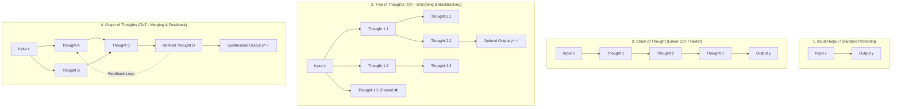
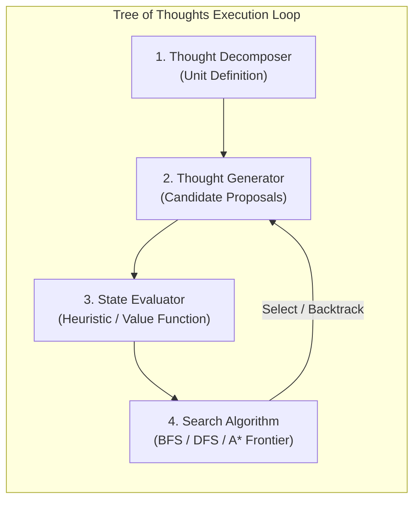
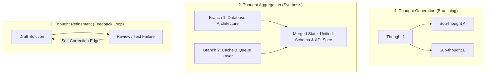

# Advanced Planning: Task Decomposition with Tree of Thoughts

<!-- toc -->

<br/>
<br/>

In autonomous agent systems, basic execution paradigms like **ReAct (Reason + Act)** or linear **Chain-of-Thought (CoT)** operate on a greedy, left-to-right autoregressive trajectory. While effective for simple question answering and reactive tool invocation, linear execution breaks down catastrophically when applied to non-trivial engineering challenges—such as multi-step system refactoring, combinatorial algorithmic puzzles, architectural design, and strategic scheduling. 

In complex environments, agents encounter **compounding error propagation**, the inability to **look ahead**, and the impossibility of **backtracking** once an unpromising path has been taken. When an agent commits greedily to a suboptimal early action, each subsequent decision compounds the initial error, steering the system into dead ends or hallucinatory loops.

To overcome these structural limitations, modern reasoning architectures recast planning as **heuristic tree and graph search**. By decomposing complex problems into coherent "thoughts" and exploring multiple reasoning paths concurrently, architectures like **Tree of Thoughts (ToT)** and **Graph of Thoughts (GoT)** equip autonomous agents with deliberation, strategic lookahead, self-evaluation, and systematic backtracking.

This chapter provides a comprehensive technical exploration of **Advanced Planning and Task Decomposition**—covering the **limitations of linear planners**, the **formal mechanics of Tree of Thoughts (ToT)**, the **graph-theoretic leap to Graph of Thoughts (GoT)**, **mathematical search formulations**, **production trade-offs**, and a **clean, production-grade planner implementation**.

<br/>
<br/>

---

## 1. Architectural Limitations of Linear Planners (ReAct & CoT)

Before exploring tree and graph search paradigms, it is critical to dissect why first-generation agent patterns fail when tasks require foresight and trial-and-error.

<br/>

### 1.1 The Greedy Autoregressive Dilemma

Linear architectures (such as standard ReAct loops: `Thought -> Action -> Observation -> Thought`) construct reasoning trajectories sequentially:

$$
\tau = (t_1, a_1, o_1, t_2, a_2, o_2, \dots, t_N, a_N, o_N)
$$

At step $i$, the agent conditions its next thought $t_i$ solely on historical tokens. This introduces three fundamental failure modes:

1. **Myopic Horizon Blindness (Greedy Exploitation):** The agent selects the highest-probability next token or immediate tool call without simulating future constraints. In chess or system architecture, the globally optimal path often requires taking an action that appears counterintuitive in the short term.
2. **Error Amplification & Irreversible Commitment:** If thought $t_2$ contains a flawed assumption or hallucination, $a_2$ will execute an erroneous action. The resulting observation $o_2$ feeds into $t_3$, locking the agent into an escalating failure loop. Standard autoregressive generation lacks an innate mechanism to say: *"Step 2 was wrong; let me revert the workspace state to Step 1 and try an alternate branch."*
3. **Absence of Global Value Scoring:** Linear generation evaluates tokens locally via softmax probabilities over the vocabulary. It lacks an external heuristic or global objective function to determine whether state $S_{current}$ is closer to the target goal than alternative hypothetical states.

<br/>

### 1.2 Comparison of Reasoning Paradigms

The transition from standard input-output prompting to graph-based reasoning represents an evolution in computational topology:

<br/>



<br/>

---

## 2. Tree of Thoughts (ToT): Formal Architecture

Introduced by Yao et al. (Princeton / Google DeepMind, 2023), the **Tree of Thoughts (ToT)** framework formalizes language model reasoning as heuristic search over a tree of discrete semantic units called "thoughts."

<br/>

### 2.1 The Four Core Components of ToT

A Tree of Thoughts engine decouples task execution into four distinct, modular operators:



<br/>

#### 1. Thought Decomposition (Unit of Thought)
Rather than generating continuous paragraphs, the problem is divided into discrete intermediate steps. The granularity of a "thought" is problem-dependent:
- In mathematical puzzles (e.g., Game of 24): A single algebraic operation (e.g., `8 - 4 = 4`).
- In writing & essay planning: A section outline or structural thesis.
- In software refactoring: A single module boundary contract or class interface design.

#### 2. Thought Generator: $G(p_\theta, s, k)$
Given the current tree state $s = [x, z_1, \dots, z_i]$, the generator produces $k$ alternative candidate thoughts for the next step. Two strategies exist:
- **Sampling (CoT):** Independently sampling $k$ completions with a temperature $T > 0$. Works best when the thought space is rich and diverse.
- **Proposing (Proposal Prompt):** Generating all $k$ candidates in a single prompt using structured JSON (`["Candidate A", "Candidate B", "Candidate C"]`). Highly efficient for constrained action spaces.

#### 3. State Evaluator: $V(p_\theta, S)$
The state evaluator inspects intermediate states $s$ and assigns an estimated value or heuristic score indicating how likely $s$ is to lead to a successful solution. Two primary methods:
- **Value Scoring:** Directly scoring the state $V(s) \in [0, 1]$ or on a discrete scale ($1$ to $10$).
- **Classification / Voting:** Classifying states as `sure`, `likely`, or `impossible`, or having the LLM compare candidates pairwise across multiple rollouts.

#### 4. Search Algorithm (Frontier Management)
The search engine maintains the exploration frontier and determines which branches to expand or prune:
- **Breadth-First Search (BFS):** Explores all branches at depth $d$ concurrently. Retains the top-$b$ most promising candidates at each level (Beam Search). Ideal when tree depth is shallow ($d \le 4$).
- **Depth-First Search (DFS):** Explores a single path down to maximum depth or terminal state. If an evaluation returns `impossible` or falls below a threshold $\delta$, the engine **backtracks** to the parent node and explores the next sibling branch. Ideal when the state space is deep or when memory is constrained.

<br/>

### 2.2 Mathematical Search Formulation

Let $x$ denote the problem input, and let $z_i$ represent the $i$-th intermediate thought. A complete trajectory of length $T$ is $y = (z_1, z_2, \dots, z_T)$.

The search tree is defined by the state space $\mathcal{S}$, where each state $s \in \mathcal{S}$ is a sequence of thoughts $s = (x, z_1, \dots, z_i)$.

The search algorithm seeks the optimal leaf state $s^*$:

$$
s^* = \arg\max_{s \in \mathcal{S}_{terminal}} V(s)
$$

For a tree of depth $D$ with branching factor $b$, the unpruned search space is $O(b^D)$. By applying an evaluation threshold $\tau_{prune}$, unviable branches are eliminated early:

$$
\text{Prune Branch if } V(s) < \tau_{prune}
$$

This reduces the effective branching factor to $b_{eff} \ll b$, rendering previously intractable search spaces computationally viable within LLM context constraints.

<br/>

---

## 3. Graph of Thoughts (GoT): Beyond Hierarchical Trees

While ToT introduces branching and backtracking, trees remain strictly hierarchical: paths cannot merge, and thoughts generated in one branch cannot directly inform or combine with thoughts from a parallel branch.

Introduced by Besta et al. (ETH Zürich, 2023), **Graph of Thoughts (GoT)** models agent reasoning as an arbitrary **Directed Acyclic Graph (DAG)** (and in iterative settings, cyclic graphs with feedback loops).

<br/>

### 3.1 Core Graph Transformations

GoT introduces first-class graph operations that mirror human collaborative problem-solving:



<br/>

### 3.2 Formal Operations in GoT

Let $G = (V, E)$ be a reasoning graph where vertices $v \in V$ represent thoughts and directed edges $(u, v) \in E$ represent dependency relationships. GoT supports three primary graph transformations:

1. **Generation:** Extending vertex $v$ to create new child thoughts $\{v'_1, v'_2, \dots, v'_k\}$.
2. **Aggregation ($\mathcal{T}_{agg}$):** Combining multiple independent thought vertices $\{v_1, v_2, \dots, v_m\}$ into a synthesized vertex $v_{syn}$:
   $$
   v_{syn} = \mathcal{T}_{agg}(v_1, v_2, \dots, v_m)
   $$
   *Example:* Merging three independently generated microservice designs into an enterprise system blueprint.
3. **Refinement ($\mathcal{T}_{ref}$):** Updating vertex $v$ based on validation feedback to produce an improved node $v'$ without branching:
   $$
   v' = \mathcal{T}_{ref}(v, \text{feedback})
   $$

<br/>

---

## 4. Algorithmic Trade-Off Matrix

Autonomous agent architects must select the appropriate planning topology based on latency budgets, cost limits, and problem complexity:

| Dimension | ReAct / CoT | Tree of Thoughts (ToT) | Graph of Thoughts (GoT) |
| :--- | :--- | :--- | :--- |
| **Topology** | Linear Sequence ($1 \to 1$) | Hierarchical Tree ($1 \to N$) | Directed Graph / DAG ($N \to M$) |
| **Lookahead Capability** | None (Greedy $O(1)$) | Lookahead via Tree Frontier | Multi-path simulation & lookahead |
| **Backtracking** | Impossible | Supported (DFS / Pruning) | Supported (Graph-wide re-routing) |
| **Branch Merging** | Not Supported | Not Supported | Native First-Class Aggregation |
| **Inference Token Cost** | Low ($1\times$) | Moderate-High ($5\times - 20\times$) | High ($15\times - 50\times$) |
| **Latency** | Low (Single-digit seconds) | Moderate (Dozens of seconds) | Higher (Iterative graph rollouts) |
| **Ideal Use Cases** | Tool lookups, sequential API calls | Puzzles, code debugging, math | System design, document synthesis |

<br/>

> **Key Insight:** ToT and GoT are not replacements for ReAct; they are high-level meta-controllers. In a production system, a ToT/GoT planner conducts strategic high-level task decomposition, while leaf-level execution is delegated to fast ReAct subagents.

<br/>

---

## 5. Production Implementation: Tree of Thoughts Planner

Below is a clean, representative Python implementation of a **Tree of Thoughts Planner** with DFS, state evaluation, pruning, and automated backtracking.

```python
from typing import List, Optional, Callable
from pydantic import BaseModel, Field

class ThoughtNode(BaseModel):
    state: str
    depth: int = 0
    score: float = 0.0
    parent: Optional["ThoughtNode"] = None
    children: List["ThoughtNode"] = Field(default_factory=list)

class TreeOfThoughtsPlanner:
    def __init__(
        self,
        generator: Callable[[str], List[str]],
        evaluator: Callable[[str], float],
        max_depth: int = 3,
        prune_threshold: float = 0.4
    ):
        self.generator = generator
        self.evaluator = evaluator
        self.max_depth = max_depth
        self.prune_threshold = prune_threshold

    def solve_dfs(self, root_state: str) -> Optional[ThoughtNode]:
        """Explores the thought tree using DFS with pruning and backtracking."""
        root = ThoughtNode(state=root_state, depth=0, score=1.0)
        stack: List[ThoughtNode] = [root]
        best_leaf: Optional[ThoughtNode] = None

        while stack:
            current = stack.pop()

            # Terminal goal check or max depth reached
            if current.depth == self.max_depth:
                if best_leaf is None or current.score > best_leaf.score:
                    best_leaf = current
                continue

            # Generate candidate branches for next reasoning step
            candidates = self.generator(current.state)
            for cand in candidates:
                cand_score = self.evaluator(cand)
                
                # Prune branches below acceptable heuristic quality
                if cand_score < self.prune_threshold:
                    continue  # Pruned: backtracks automatically

                child = ThoughtNode(
                    state=cand,
                    depth=current.depth + 1,
                    score=cand_score,
                    parent=current
                )
                current.children.append(child)
                stack.append(child)

        return best_leaf

    def extract_trajectory(self, node: Optional[ThoughtNode]) -> List[str]:
        """Backtracks from the optimal leaf to root to reconstruct solution path."""
        path = []
        curr = node
        while curr:
            path.append(f"[Depth {curr.depth} | Score {curr.score:.2f}] {curr.state}")
            curr = curr.parent
        return list(reversed(path))
```

<br/>

---

## 6. Official Challenges & Architectural Solutions

<br/>

<details>
<summary><strong>Challenge 1: The Combinatorial Explosion Problem in Production ToT</strong></summary>
<br/>

#### Scenario
An autonomous software architecture agent uses Tree of Thoughts (BFS) to design a microservices ecosystem. At each step, the model generates $b = 5$ architectural choices. By depth $d = 4$, the tree requires evaluating $5^4 = 625$ LLM calls, causing API timeouts and ballooning inference costs. How do you re-architect the planner to preserve search quality while capping latency?

#### Architectural Solution
- **Root Cause:** Uniform Breadth-First Search without adaptive beam pruning leads to exponential state space explosion ($O(b^d)$).
- **Production Remediation (Adaptive Beam Search with Early Termination):**
  1. **Dynamic Beam Width ($k$):** Instead of expanding all candidate branches, sort children by heuristic value $V(s)$ and retain only the top-$k$ candidates (e.g., $k=2$ or $k=3$).
  2. **Tiered Evaluation (Small Model Pre-Filter):** Use a fast, lightweight SLM (e.g., Gemini Flash or 8B parameter model) to score initial candidates and eliminate obviously flawed ideas, invoking the frontier reasoning model only on the top 20% of branches.
  3. **Embedding-Based Diversity Clustering:** Many LLM-generated thoughts are semantic duplicates with slightly different wording. Cluster candidates using embedding similarity and keep only the centroid of each distinct cluster, preventing the search from wasting budget on redundant branches.
</details>

<br/>

<details>
<summary><strong>Challenge 2: Implementing Safe Backtracking in Mutable Environments</strong></summary>
<br/>

#### Scenario
An agent tasked with cloud infrastructure deployment uses DFS with backtracking. At Depth 2, it executes `terraform apply` to provision a PostgreSQL database. At Depth 3, a downstream configuration fails the evaluator score. The agent backtracks to try an alternative database configuration, but the previously provisioned database is still running in AWS, causing resource collisions and billing leakage. How must the agent's environment interface be designed?

#### Architectural Solution
- **Root Cause:** In mutable physical environments, external side effects cannot be rolled back by simply unwinding an in-memory stack pointer.
- **Architectural Solution (Two-Phase Commit & Sandboxed Forking):**
  1. **Separation of Planning vs. Execution:** The ToT planner must operate strictly in **Simulation Mode** (generating declarative state diffs, such as dry-run execution graphs or Terraform plans) without executing live side effects.
  2. **Ephemeral Branch Sandboxing:** If live execution is required for evaluation (e.g., running integration tests), each branch must execute inside an ephemeral, isolated container or virtual environment (e.g., temporary Kubernetes namespaces or Docker containers).
  3. **Compensating Transactions (Saga Pattern):** Every action registered in a thought node must define a corresponding `rollback()` hook. When the DFS engine pops an unviable node, it triggers the reverse compensation transaction before exploring sibling branches.
</details>

<br/>

<details>
<summary><strong>Challenge 3: When to Transition from Tree of Thoughts (ToT) to Graph of Thoughts (GoT)</strong></summary>
<br/>

#### Scenario
A research synthesis agent is tasked with summarizing 10 independent academic papers and writing an overarching survey. When implemented using ToT, the agent generates trees for each paper but struggles to synthesize cross-cutting themes, producing disjointed summaries. Why does ToT struggle here, and how does GoT solve it?

#### Architectural Solution
- **The Architectural Limitation:** Trees are strictly divergent ($1 \to N$). A thought generated under Branch A (e.g., "Paper 1 Methodology") cannot be merged with Branch B ("Paper 2 Methodology") within standard tree topologies. To compare them, the agent must pass both entire subtrees back to the root, exceeding context limits and destroying modularity.
- **The GoT Transformation:**
  1. **Parallel Extraction Nodes:** Deploy $N$ independent vertices to analyze each paper concurrently.
  2. **Cross-Branch Aggregation ($\mathcal{T}_{agg}$):** Create an aggregation vertex that takes the outputs of multiple paper nodes as explicit inbound directed edges.
  3. **Iterative Refinement Loop:** Add a critique node with a feedback edge pointing back to the draft synthesis node, allowing the agent to iteratively refine the unified document until consistency thresholds are met.
</details>

<br/>

<details>
<summary><strong>Challenge 4: Designing an Unbiased Evaluator Prompt</strong></summary>
<br/>

#### Scenario
In a Tree of Thoughts pipeline, the state evaluator prompt asks the LLM: *"Is this candidate thought good? Answer Yes or No."* The agent exhibits high false-positive rates, almost always answering "Yes" and failing to prune flawed paths. What causes this, and how do you design a robust, calibrated evaluation function?

#### Architectural Solution
- **Failure Analysis (LLM Sycophancy & Generative Bias):** LLMs exhibit natural affirmative bias when asked binary "good/bad" questions without explicit criteria. Furthermore, scalar scoring without anchors suffers from severe distribution drift across temperatures.
- **Calibrated Evaluation Architecture:**
  1. **Rubric-Based Few-Shot Evaluation:** Provide an explicit rubric with negative examples showing why specific intermediate thoughts are dead ends.
  2. **Pairwise Comparison (Tournament Ranking):** Rather than evaluating candidates in isolation, present all candidate thoughts simultaneously to the evaluator and prompt it to rank them: *"Compare Candidate A, B, and C. Identify the single candidate with the lowest probability of failure and justify the ranking."*
  3. **Self-Consistency Rollouts:** Have the evaluator predict 2 steps into the future (lightweight lookahead): *"If we choose Thought A, what are the next immediate failure modes?"* If the model can easily identify an irrecoverable roadblock, the branch is scored as 0.0 and immediately pruned.
</details>
