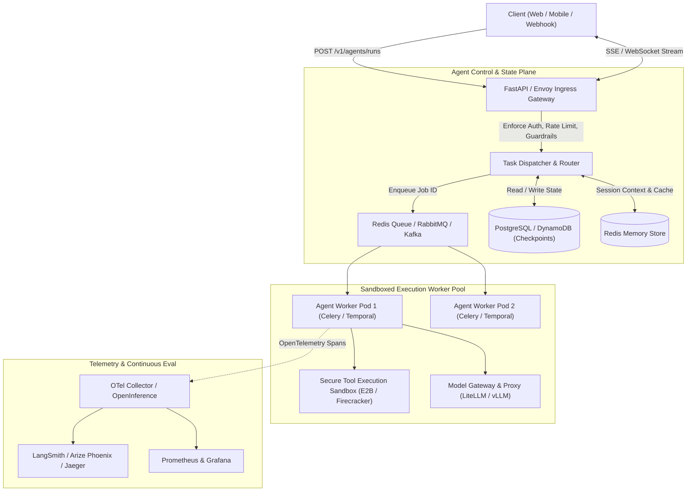
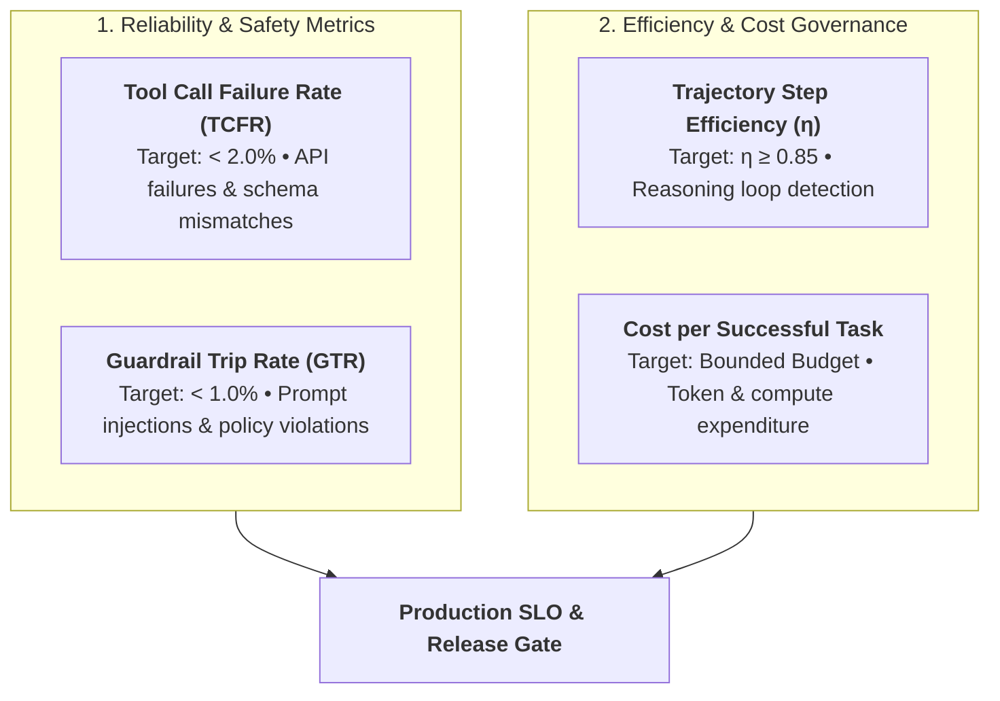
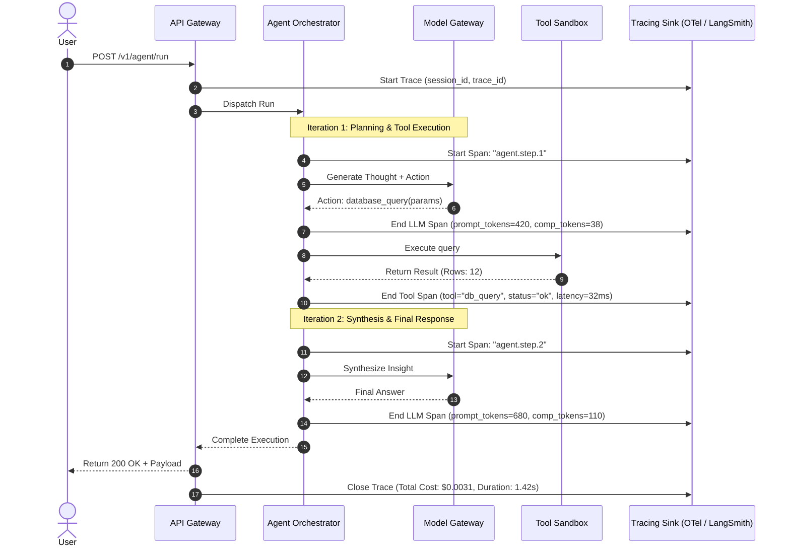
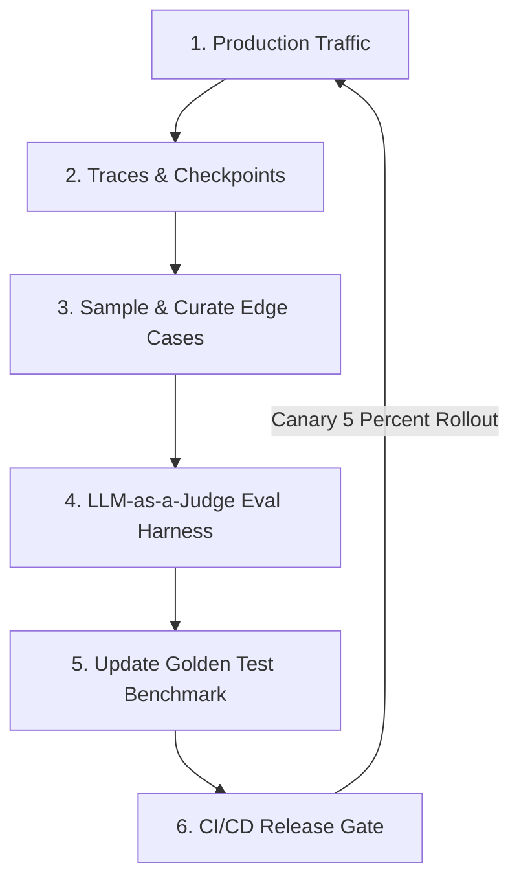
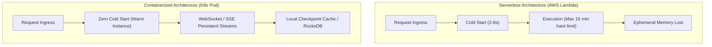
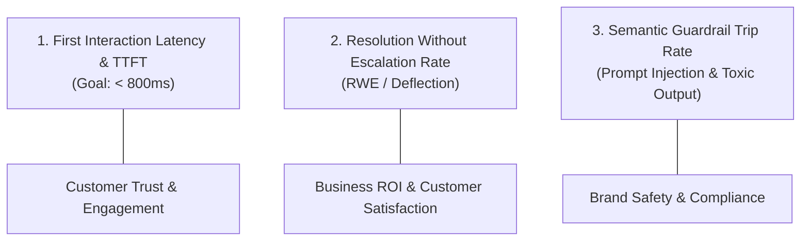
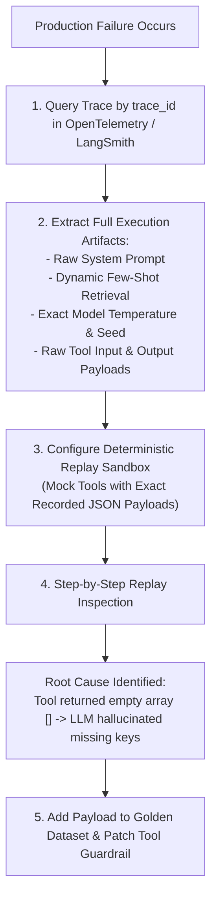

# Deploying and Monitoring AI Agents

<!-- toc -->

<br/>
<br/>

Transitioning an autonomous AI agent from an experimental prototype running in a local Jupyter notebook to a mission-critical, production-grade enterprise system represents one of the steepest challenges in modern AI engineering. In a local environment, an agent that takes 45 seconds to generate an answer, occasionally triggers an infinite retry loop, or consumes unmetered OpenAI tokens is an acceptable inconvenience. In production, however, unbounded execution times violate HTTP gateway timeouts, non-deterministic outputs degrade user trust, unchecked API loops cause severe billing spikes, and silent tool failures crash downstream services.

Deploying and operating autonomous agents requires treating them not as simple web endpoints, but as **stateful, non-deterministic distributed distributed systems**. Unlike traditional microservices that follow deterministic, single-pass request-response cycles, agentic workflows exhibit variable execution paths, multi-step LLM reasoning iterations, dynamic tool interactions, and unpredictable latency distributions.

This chapter presents a comprehensive engineering blueprint for containerizing, serving, streaming, tracing, and monitoring autonomous agents in production environments. We analyze decoupled architectural topologies, implement real-time Server-Sent Events (SSE) streaming, establish mathematical formulations for agent-specific Service Level Objectives (SLOs), configure distributed tracing with OpenInference and OpenTelemetry, and design closed-loop continuous evaluation pipelines.

<br/>
<br/>

---

## 1. From Prototype to Production: Architectural Shift

The architectural gulf between an exploratory agent and a production service stems from statefulness, concurrency, and failure modes. A prototype typically combines prompt assembly, model execution, tool orchestration, and memory persistence in a single synchronous thread. In production, this tight coupling creates severe single-point bottlenecks.

<br/>

### 1.1 The Prototype Trap

When teams deploy naive agent scripts into production, they routinely encounter four fatal failure modes:

1. **HTTP Gateway Timeouts:** Multi-step agent workflows involving reasoning, web search, database querying, and synthesis routinely exceed standard 30-to-60-second gateway timeouts (e.g., Cloudflare, AWS ALB, NGINX).
2. **State Serialization Bottlenecks:** Storing complex agent working memory (scratchpads, tool execution traces, object graphs) in local process memory crashes when instances scale horizontally behind load balancers.
3. **Unbounded Cost Anomalies:** An agent caught in a semantic reasoning loop or parsing error can execute dozens of LLM calls in minutes, depleting API rate limits and generating thousands of dollars in unexpected inference costs.
4. **Silent Tool Poisoning & Cascading Failures:** When external APIs return undocumented error codes or mutated schemas, naive agents hallucinate corrective actions, corrupting persistent state stores.

<br/>

### 1.2 The Decoupled Production Architecture

To resolve these issues, production agent systems decouple client ingress, orchestration scheduling, execution workers, and state persistence into dedicated infrastructure tiers.



<br/>

This decoupled architecture provides four critical operational guarantees:
- **Asynchronous Execution:** Long-running reasoning workflows execute in decoupled worker processes, freeing the API gateway to return immediate job IDs (`202 Accepted`) and stream intermediate events over real-time protocols.
- **Durable Checkpointing:** Every ReAct cycle (Thought $\to$ Action $\to$ Observation) commits an atomic snapshot to persistent storage, enabling automatic recovery if a worker pod crashes mid-execution.
- **Sandboxed Isolation:** Tool execution occurs inside ephemeral, network-isolated environments (e.g., Firecracker microVMs or Docker containers) to prevent malicious code execution or unintended side effects.
- **Centralized Inference Proxy:** All LLM calls pass through an internal gateway managing rate limiting, fallback routing (e.g., GPT-4 $\to$ Claude 3.5 Sonnet $\to$ local vLLM), and prompt-completion caching.

<br/>
<br/>

---

## 2. Deployment Topologies & Real-Time Streaming

Selecting the appropriate deployment pattern determines system latency, cost efficiency, and developer velocity. Autonomous agents generally fall into three deployment topologies depending on task complexity and execution duration.

<br/>

### 2.1 Topology Classification

| Topology | Typical Duration | Infrastructure Stack | Best Suited For | Failure Recovery |
| :--- | :--- | :--- | :--- | :--- |
| **Synchronous Streaming** | 1s – 30s | FastAPI, Uvicorn, SSE / WebSockets | Conversational copilots, quick search & Q&A | Client reconnects; restart step |
| **Asynchronous Job Worker** | 30s – 15m | FastAPI + Celery / ARQ + Redis | Deep research, multi-file code refactoring | Queue retry with saved checkpoint |
| **Durable Orchestration (DAG)**| 15m – Hours | Temporal.io / AWS Step Functions | Multi-agent swarms, pipeline ETL, release workflows | Deterministic step-level replay |

<br/>

### 2.2 Server-Sent Events (SSE) Streaming Protocol

Because autonomous agents spend significant time "thinking" and executing tools, holding an HTTP connection open without feedback degrades user experience. **Server-Sent Events (SSE)** provide a lightweight, unidirectional streaming channel over HTTP/2, allowing the server to push structured telemetry packets as the agent progresses through its decision graph.

```
event: thought
data: {"step": 1, "thought": "The user is asking for revenue figures. I need to query the PostgreSQL database."}

event: tool_start
data: {"step": 1, "tool": "sql_query_executor", "input": {"query": "SELECT SUM(amount) FROM orders WHERE year=2026"}}

event: tool_result
data: {"step": 1, "status": "success", "duration_ms": 142, "rows": 1}

event: final_answer
data: {"text": "Total revenue for 2026 was $14.2M."}
```

<br/>

### 2.3 Production FastAPI Streaming Endpoint

The following implementation demonstrates a production-grade FastAPI streaming endpoint leveraging asynchronous generators, typed event envelopes, and strict cancellation handling:

```python
from fastapi import FastAPI, HTTPException
from fastapi.responses import StreamingResponse
from pydantic import BaseModel
import asyncio
import json

app = FastAPI(title="Agent Service Gateway", version="1.0.0")

class AgentRequest(BaseModel):
    user_id: str
    session_id: str
    prompt: str

async def agent_event_generator(req: AgentRequest):
    """Streams structured SSE events representing internal agent thought steps."""
    try:
        yield f"event: status\ndata: {json.dumps({'status': 'initializing'})}\n\n"
        await asyncio.sleep(0.05) # Simulated setup
        
        # Step 1: Agent Reasoning
        thought = {"step": 1, "message": "Analyzing intent and selecting tools"}
        yield f"event: thought\ndata: {json.dumps(thought)}\n\n"
        
        # Step 2: Tool Execution Event
        tool_call = {"step": 1, "tool": "database_lookup", "args": {"query": req.prompt}}
        yield f"event: tool_call\ndata: {json.dumps(tool_call)}\n\n"
        await asyncio.sleep(0.2) # Simulated async I/O
        
        # Step 3: Final Synthesized Response
        final = {"status": "completed", "output": f"Processed query: {req.prompt}"}
        yield f"event: final_answer\ndata: {json.dumps(final)}\n\n"
    except asyncio.CancelledError:
        # Crucial: Clean up resources if the client closes the connection early
        yield f"event: error\ndata: {json.dumps({'error': 'Client disconnected'})}\n\n"

@app.post("/v1/agent/stream")
async def stream_agent(request: AgentRequest):
    return StreamingResponse(
        agent_event_generator(request),
        media_type="text/event-stream",
        headers={"Cache-Control": "no-cache", "Connection": "keep-alive", "X-Accel-Buffering": "no"}
    )
```

<br/>

> **Key Insight:** Always set `X-Accel-Buffering: no` on streaming responses behind NGINX or reverse proxies. Otherwise, the proxy will buffer chunks until the buffer fills up, destroying real-time responsiveness.

<br/>
<br/>

---

## 3. Agent-Specific Telemetry & Core Metrics (SLOs/SLAs)

Monitoring traditional microservices relies on the standard **RED Method** (Rate, Errors, Duration). While necessary, RED is fundamentally insufficient for autonomous agents because an agent request can return HTTP 200 OK while completely failing to achieve its goal, hallucinating tools, or consuming $15.00 in wasted inference.

Production agent observability requires a dedicated telemetry framework tracking latency breakdown, financial cost, execution efficiency, and task success.

<br/>

### 3.1 Mathematical Formulations of Agent Latency & Cost

The total end-to-end latency $T\_{\text{agent}}$ of an agent execution composed of $K$ sequential reasoning iterations is modeled as:

$$
T\_{\text{agent}} = T\_{\text{TTFT}} + \sum\_{k=1}^{K} \left( T\_{\text{infer}}^{(k)} + \sum\_{m=1}^{M\_k} T\_{\text{tool}}^{(k, m)} \right) + T\_{\text{overhead}}
$$

Where:
- $T\_{\text{TTFT}}$ is the Time-To-First-Token from the initial gateway request.
- $T\_{\text{infer}}^{(k)}$ is the generation time of the $k$-th LLM call.
- $M\_k$ is the number of external tools invoked in iteration $k$.
- $T\_{\text{tool}}^{(k, m)}$ represents the round-trip latency of the $m$-th tool execution in step $k$.
- $T\_{\text{overhead}}$ accounts for serialization, guardrail validation, and state persistence overhead.

<br/>

Similarly, the cumulative financial cost $\mathcal{C}\_{\text{agent}}$ for an execution path is governed by prompt tokens, completion tokens, and third-party API tool costs:

$$
\mathcal{C}\_{\text{agent}} = \sum\_{k=1}^{K} \left( N\_{\text{prompt}}^{(k)} \cdot c\_{\text{in}} + N\_{\text{completion}}^{(k)} \cdot c\_{\text{out}} \right) + \sum\_{j=1}^{J} c\_{\text{tool}}^{(j)}
$$

Where $c\_{\text{in}}$ and $c\_{\text{out}}$ represent input and output token unit prices, while $c\_{\text{tool}}^{(j)}$ represents external costs (e.g., search API credits, code execution sandbox minutes).

<br/>

### 3.2 Four Essential Agent SLO Metrics



<br/>

1. **Tool Call Failure Rate ($\text{TCFR}$):**
   $$
   \text{TCFR} = \frac{\sum \text{Tool Executions with Status} \in \\{\text{Error, Timeout, SchemaMismatch}\\}}{\text{Total Tool Invocations}}
   $$
   *Target SLO:* $< 2.0\%$. Spikes indicate upstream API changes or prompt hallucination.

2. **Trajectory Step Efficiency ($\eta$):**
   $$
   \eta = \frac{K\_{\text{optimal}}}{K\_{\text{actual}}} \quad (0 < \eta \le 1)
   $$
   Measures whether an agent solves problems directly or gets bogged down in repetitive, exploratory loops. If average iterations rise from 3.2 to 7.8, prompts or tool descriptions have likely drifted.

3. **Task Completion Rate ($\text{TCR}$):**
   The percentage of user sessions where the agent satisfies the objective without triggering a timeout, fatal exception, or user cancellation.
   *Target SLO:* $> 94.0\%$.

4. **Guardrail Trip Rate ($\text{GTR}$):**
   The frequency with which input/output moderation filters (e.g., prompt injection detection, PII redactors, SQL AST sanitizers) block agent actions. Spikes indicate adversarial attacks or miscalibrated safety thresholds.

<br/>
<br/>

---

## 4. Distributed Logging, Tracing & Observability

In standard web applications, a request generates a linear trace across a few microservice calls. In autonomous agents, a single user request expands into a **hierarchical tree of non-deterministic spans**: model calls, prompt templates, scratchpad tokens, tool parameters, raw responses, and self-correction iterations.

<br/>

### 4.1 The Agent Tracing Hierarchy



<br/>

### 4.2 Standardizing Telemetry with OpenTelemetry and OpenInference

Proprietary vendor lock-in (e.g., locking into LangSmith or proprietary dashboards) can be avoided by adopting **OpenInference**, an open telemetry semantic convention built on top of **OpenTelemetry (OTel)**. OpenInference standardizes attributes such as `llm.token_count.prompt`, `tool.name`, `agent.step`, and `llm.model_name`.

```python
from opentelemetry import trace
from opentelemetry.trace import Status, StatusCode

tracer = trace.get_tracer("production.agent.tracer")

def execute_agent_tool(tool_name: str, tool_args: dict, step_idx: int):
    """Executes a tool within a standardized OpenTelemetry span."""
    with tracer.start_as_current_span("agent.tool_execution") as span:
        span.set_attribute("agent.step", step_idx)
        span.set_attribute("tool.name", tool_name)
        span.set_attribute("tool.args", str(tool_args))
        
        try:
            # Simulated tool dispatch
            if tool_name == "calculator":
                result = eval(tool_args["expr"]) # Sandboxed in real systems
            else:
                result = {"status": "success", "data": "Query executed"}
                
            span.set_attribute("tool.result", str(result))
            span.set_status(Status(StatusCode.OK))
            return result
        except Exception as exc:
            span.record_exception(exc)
            span.set_status(Status(StatusCode.ERROR, str(exc)))
            raise
```

<br/>
<br/>

---

## 5. Continuous Evaluation & Closed-Loop Improvement

Deploying an agent is not a one-time event; it initiates a continuous operational feedback loop. Because production environments encounter domain distributions never seen in training or offline evaluation sets, systems must capture telemetry, evaluate performance, and continuously update prompts and guardrails.

<br/>

### 5.1 The Continuous Evaluation Flywheel



<br/>

### 5.2 LLM-as-a-Judge Production Scoring

While unit tests assert deterministic outputs, agent validation requires semantic evaluation. Production systems employ high-capability judge models (e.g., GPT-4o, Claude 3.5 Sonnet) evaluating sampled production traces across three foundational criteria:

1. **Faithfulness / Groundedness:** Did the agent's final answer derive strictly from the retrieved tool outputs, or did it hallucinate facts?
   $$
   \text{Score}\_{\text{faithfulness}} = \frac{|\text{Statements Entailed by Tool Observations}|}{|\text{Total Statements in Final Answer}|}
   $$

2. **Tool Selection Accuracy:** Did the agent select the minimal, optimal tool for the given step, or did it make superfluous exploratory calls?

3. **Trajectory Efficiency:** Did the agent reach the solution in the minimal necessary steps without looping?

<br/>

### 5.3 Automated Regression Testing in CI/CD

Before any code modification, prompt change, or system update is merged to production:
- The entire **Golden Dataset** (a collection of 200+ curated real-world edge cases) is executed against the candidate agent branch.
- Automated gates enforce that **Task Completion Rate** cannot drop by $> 1\%$, and **Median Cost per Task** cannot increase by $> 5\%$.
- Canary deployments route $5\%$ of real user traffic to the candidate container, comparing live latency and error rates against the baseline before full rollout.

<br/>
<br/>

---

## 6. Official Challenges & Architectural Solutions

The official curriculum presents three foundational system design challenges encountered when deploying autonomous agents into production environments.

<br/>

<details>
<summary><strong>Scenario 1: Serverless Functions vs. Long-Running Containers for Multi-Step Autonomous Agents</strong></summary>
<br/>

### Problem Statement
What are the architectural trade-offs, advantages, and disadvantages of deploying an autonomous agent as a serverless function (e.g., AWS Lambda, Google Cloud Functions) versus a long-running containerized service (e.g., ECS, Kubernetes Pods, Fly.io)?

### Architectural Trade-Off Analysis



#### Comparison Matrix
| Dimension | Serverless Functions (AWS Lambda / Cloud Run) | Long-Running Containers (Kubernetes / ECS) |
| :--- | :--- | :--- |
| **Execution Duration** | Hard timeout (typically 5 to 15 minutes max). Unsuitable for deep agent workflows. | Indefinite execution duration. Compatible with asynchronous workers. |
| **Connection Protocols** | HTTP Request/Response only. Weak or fragile support for persistent WebSockets/SSE. | Native support for HTTP/2, WebSockets, and long-lived SSE connections. |
| **Cold Starts** | Severe penalty (2–8 seconds) when importing large ML/LLM libraries (LangChain, PyTorch, OTel). | Zero cold start during steady-state; traffic handled by pre-warmed replica pods. |
| **Local State & Caching** | Completely stateless; memory cleared after execution; remote DB hit required for every token. | Local memory caches (e.g., Redis, SQLite, RocksDB) can persist across requests. |
| **Cost Scaling** | True scale-to-zero when idle. Highly cost-effective for bursty, sporadic workloads. | Baseline infrastructure cost for running cluster nodes even during idle periods. |

#### Staff Engineer Recommendation
- **Avoid serverless functions for multi-step reasoning agents.** The cold-start penalties, connection drops on SSE streaming, and hard timeout thresholds make serverless unsuitable for complex agent topologies.
- **Deploy via decoupled Kubernetes pods:** Use lightweight API gateways (FastAPI / Envoy) for connection termination and routing, alongside scalable worker pods (Celery / Temporal.io) operating with shared Redis checkpoints.
</details>

<br/>

<details>
<summary><strong>Scenario 2: Top 3 Telemetry Metrics for Customer-Facing Support Agents</strong></summary>
<br/>

### Problem Statement
When deploying an autonomous AI agent to handle customer support inquiries in production, what are the top 3 most critical telemetry metrics to monitor, and why do traditional web metrics fail to capture them?

### Deep Solution & Metric Breakdown

Traditional web metrics (CPU usage, HTTP 200 OK rates) are blind to agent quality: an agent can return a fast HTTP 200 containing a completely hallucinated or unhelpful answer while charging $2.00 in LLM fees. In a customer support context, the top 3 critical metrics are:



#### 1. Resolution Without Escalation (RWE / Deflection Rate)
- **Definition:** The percentage of customer sessions resolved by the agent without the customer asking to speak to a human agent, abandoning the conversation within 60 seconds, or filing a subsequent ticket within 24 hours.
- **Why It Matters:** Customer support agents exist to reduce human workload. If an agent answers 10,000 queries but customers immediately request a representative on 6,000 of them, the agent is providing negative value.

#### 2. Time-To-First-Token (TTFT) and Perceived Latency
- **Definition:** The elapsed time from the user pressing "Send" until the first character of the agent's response streams into the UI ($T_{\text{TTFT}} < 800\,\text{ms}$).
- **Why It Matters:** High perceived latency causes users to close windows, re-submit messages (triggering duplicate runs), or lose faith in the service. Intermediate thinking states ("*Searching return policy...*") must be streamed immediately to mask tool execution latency.

#### 3. Hallucination & Faithfulness Score (via Real-Time LLM-as-a-Judge)
- **Definition:** Sampled real-time evaluation assessing whether the agent's answers strictly adhere to official company knowledge base articles.
- **Why It Matters:** In customer support, a confident hallucination (e.g., *"Yes, we offer full refunds within 90 days for opened items"* when policy allows only 14 days) causes direct legal liability and financial loss.
</details>

<br/>

<details>
<summary><strong>Scenario 3: Debugging Non-Reproducible Production Agent Failures via Distributed Tracing</strong></summary>
<br/>

### Problem Statement
An autonomous agent in production fails on a specific enterprise user request by returning an erroneous answer and terminating prematurely. However, when developers attempt to reproduce the issue locally using identical input prompts, the agent succeeds without errors. How do you identify, isolate, and debug the root cause using distributed tracing and deterministic replay?

### Diagnostic Walkthrough & Architectural Solution

Non-deterministic failures in autonomous agents occur due to **dynamic environmental variance**:
1. External tool API responses mutated or timed out during the live run.
2. Temperature-driven stochastic sampling in the LLM chose an uncommon reasoning branch.
3. System prompt or dynamic few-shot context contained ephemeral variables (e.g., `current_timestamp = 2026-09-11T13:00:00Z`).
4. Session memory history contained hidden tokens or state not passed in local tests.



#### Step-by-Step Resolution Protocol:
1. **Trace Lookup via Unique Identifier:** Retrieve the full execution trace from the telemetry backend (LangSmith / Phoenix) using the customer's `trace_id`.
2. **Isolate the Divergent Span:** Examine the hierarchical span tree to locate the exact step where status changed to `ERROR` or where the agent deviated from expected behavior.
3. **Inspect the Raw Observation:** In 80% of "non-reproducible" agent failures, the external tool returned an unexpected edge-case payload (e.g., HTTP 429 rate limit, empty JSON `[]`, or truncated response) that the prompt had not instructed the model how to handle.
4. **Deterministic Local Replay:** Feed the exact recorded tool output into the agent harness using a mock adapter, bypassing live network calls. Set the LLM `seed` and `temperature=0` to verify whether the prompt adequately handles that specific observation.
5. **Mitigation:** Update the agent's system prompt or tool response wrapper to explicitly catch the failure pattern, and add the entire trace payload into the repository's CI/CD **Golden Eval Suite** to prevent regression.
</details>
