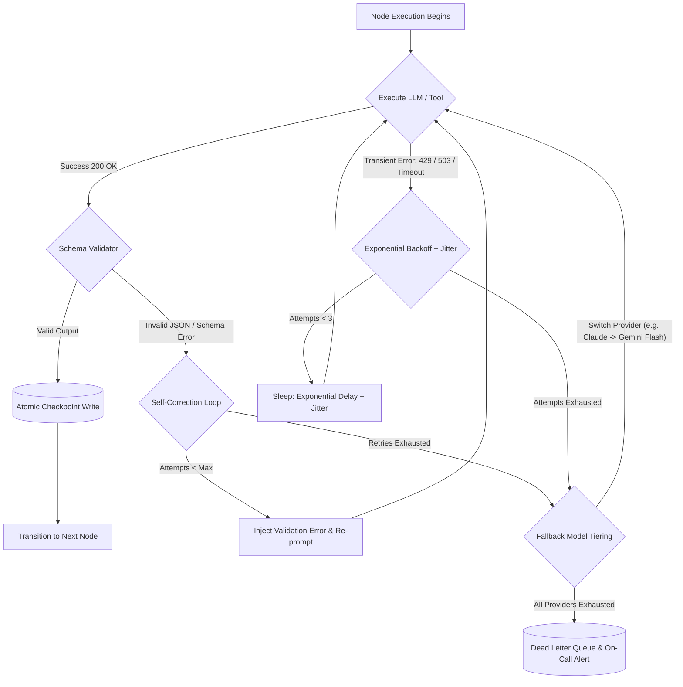
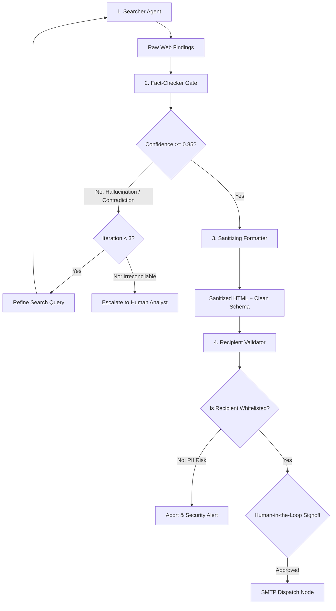

# Agent Orchestration and Workflow Management

<!-- toc -->

<br/>
<br/>

In production environments, deploying single-turn autonomous agents or naive ReAct loops for complex multi-stage tasks rapidly deteriorates into non-deterministic chaos. Single-agent prompts suffer from unbounded context window accumulation, severe drift from core goals, silent hallucination propagation, and catastrophic failure modes where a network glitch on step ten invalidates the entire trajectory.

To build enterprise-grade autonomous systems, engineers must transition from unconstrained single-agent reasoning to **Agent Orchestration and Deterministic Workflow Management**. 

Orchestration is the rigorous discipline of modeling, executing, monitoring, and recovering multi-agent operations across structured computation graphs. By treating agent interactions as state machines, directed graphs, and distributed pipelines, orchestration enforces **strict state boundaries**, **predictable error boundaries**, **Human-in-the-Loop (HITL) guardrails**, and **fault-tolerant persistence**.

<br/>
<br/>

---

## 1. Architectural Paradigms: From Naive Loops to Directed Computation Graphs

When structuring agent execution across multiple subtasks, systems generally fall into three architectural categories:

| Architectural Paradigm | State Topology | Determinisim | Failure Recovery | Best Use Case |
| :--- | :--- | :--- | :--- | :--- |
| **Monolithic ReAct Loop** | Unstructured Conversation History | Low (Stochastic trajectory) | None (Total restart required) | Open-ended single-turn question answering |
| **Directed Acyclic Graph (DAG)** | Strictly Ordered Dependency Tree | High (Deterministic transitions) | Step-level checkpoint resumption | Structured data pipelines, ETL, report generation |
| **Cyclic State Graph (StateGraph)** | Looping State Machine with Halting Gates | High-to-Medium (Controlled feedback) | Node-level checkpointing & replay | Code refactoring, test-evaluator loops, multi-agent debates |

```mermaid
flowchart TD
    subgraph Topologies ["The Four Core Orchestration Topologies"]
        direction TB
        
        subgraph Top1 ["1. Sequential Pipeline"]
            direction LR
            S1[Ingest] --> S2[Filter] --> S3[Transform] --> S4[Persist]
        end

        subgraph Top2 ["2. Parallel Fan-Out / Fan-In (Map-Reduce)"]
            direction LR
            Dispatch[Dispatcher Node] --> W1[Web Searcher] & W2[Internal DB] & W3[Vector RAG]
            W1 & W2 & W3 --> Agg[Synthesis Aggregator]
        end

        subgraph Top3 ["3. Dynamic Intent Router"]
            direction LR
            Inp[User Query] --> Router{Intent Classifier}
            Router -->|Code Defect| AgentCode[AST Fixer Agent]
            Router -->|Data Query| AgentSQL[Text-to-SQL Agent]
            Router -->|Ambiguous| AgentClarify[HITL Escalator]
        end

        subgraph Top4 ["4. Evaluator-Optimizer (Cyclic State Machine)"]
            direction LR
            Generator[Generator Agent] --> Evaluator{Quality / Security Gate}
            Evaluator -->|Fails Threshold| Refiner[Self-Correction Prompt]
            Refiner --> Generator
            Evaluator -->|Passes Invariants| TerminalNode((Approved Output))
        end
    end
```

<br/>



<br/>

### 1.1 Sequential Pipelines
In a sequential pipeline, the state transitions deterministically along a one-dimensional path:

$$\mathcal{S}_{t+1} = \mathcal{T}_t(\mathcal{S}_t)$$

Each node $\mathcal{T}_t$ executes a specialized sub-task, transforming the state monotonically. Sequential graphs are straightforward to debug but suffer from accumulated latency if independent steps are unnecessarily chained.

### 1.2 Fan-Out / Fan-In (Scatter-Gather)
When sub-tasks exhibit no inter-dependencies, an orchestrator parallelizes execution across asynchronous coroutines. A synchronization barrier (join node) blocks until all branch futures resolve or a specified timeout expires:

$$\mathcal{S}\_{\mathrm{agg}} = \operatorname{Reduce}\left( \left\lbrace \mathcal{S}\_i \mid i \in [1, K] \right\rbrace \right)$$

This topology reduces total latency from $\sum_{i=1}^K \tau_i$ to $\max_{i}(\tau_i) + \tau_{\text{reduce}}$.

### 1.3 Dynamic Routing & Conditional Branching
A router node inspects the current state payload and evaluates a routing function $R(\mathcal{S}) \to \text{NodeID}$. This prevents bloat by routing simple queries to lightweight models while delegating critical tasks to heavyweight reasoning agents.

### 1.4 Evaluator-Optimizer (Cyclic Self-Correction)
Complex tasks (such as code generation or medical report drafting) require convergence guarantees. The generator produces a candidate $\hat{y}$, and an evaluator evaluates an objective metric $\mathcal{M}(\hat{y})$. If $\mathcal{M}(\hat{y}) < \theta$, the state loops back with explicit feedback $\delta$ until convergence or maximum iteration count $K_{\max}$ is reached.

<br/>
<br/>

---

## 2. Mathematical Modeling of Workflows, Resilience, and Latency

To design enterprise systems, orchestrators must be grounded in formal mathematics governing state transitions, cumulative failure probability, and latency optimization.

<br/>

### 2.1 State Monoid & Delta Reducers

A robust workflow state $\mathcal{S}$ is modeled as an immutable payload updated via deterministic reducers. Given the current state $\mathcal{S} \in \mathfrak{S}$ and a node output $\Delta \mathcal{S} \in \mathfrak{D}$, the transition is an associative binary operation:

$$\mathcal{S}_{t+1} = \mathcal{S}_t \oplus \Delta \mathcal{S}$$

Where $\oplus$ satisfies the monoid axioms:
1. **Associativity:** $(A \oplus B) \oplus C = A \oplus (B \oplus C)$
2. **Identity Element:** There exists $\emptyset$ such that $\mathcal{S} \oplus \emptyset = \mathcal{S}$.

By enforcing associative delta reducers, an orchestrator can cleanly merge parallel branches in fan-in nodes without race conditions or overwriting global keys.

<br/>

### 2.2 Cumulative Failure Probability and Checkpointing Theory

Consider a sequential workflow of $N$ steps. Let $p_i \in [0, 1]$ denote the independent failure probability of step $i$ (due to network timeout, rate limit, or model schema violation).

The overall system failure probability $P_{\mathrm{fail}}$ without retry mechanisms is:

$$P_{\mathrm{fail}} = 1 - \prod_{i=1}^N (1 - p_i)$$

For a 10-step pipeline where each step has a seemingly benign $5\%$ failure rate ($p_i = 0.05$):

$$P_{\mathrm{fail}} = 1 - (0.95)^{10} = 1 - 0.5987 = 40.13\%$$

Without fault tolerance, **more than 4 out of 10 runs will fail**.

If each step is wrapped with a bounded exponential retry mechanism allowing up to $k$ retries, the effective step failure probability becomes:

$$\tilde{p}_i = p_i^{k+1}$$

For $k = 3$ retries at $p_i = 0.05$:

$$\tilde{p}_i = (0.05)^4 = 6.25 \times 10^{-6}$$

$$P_{\mathrm{fail},\,\text{retry}} = 1 - (1 - 6.25 \times 10^{-6})^{10} \approx 0.00625\%$$

```mermaid
flowchart LR
    subgraph CostComparison ["Compute Waste Comparison: Restart vs Checkpoint Replay"]
        direction TB
        subgraph Naive ["Naive Pipeline (No Checkpoint)"]
            N1["Step 1 (Low Cost)"] --> N2["Step 2 (Medium Cost)"] --> N3["Step 3 (High Cost)"] --> Fail1["Step 4 CRASH"]
            Fail1 -.->|"Total Loss: Full Restart"| R1["Restart Step 1"]
        end
        subgraph Checkpointed ["Resilient Pipeline (With Checkpoints)"]
            C1["Step 1 (Low Cost)"] --> C2["Step 2 (Medium Cost)"] --> C3["Step 3 (High Cost)"]
            C3 --> CP[("Checkpoint 3 Saved")]
            CP --> Fail2["Step 4 CRASH"]
            Fail2 -.->|"Replay from CP3"| C4["Step 4 Retry"]
        end
    end
```

<br/>



<br/>

### 2.3 Latency Optimization & Amdahl's Law in Agent Workflows

Let $T_{\mathrm{seq}}$ be the total execution time of a purely sequential workflow:

$$T_{\mathrm{seq}} = \sum_{i=1}^N \tau_i$$

If a fraction $f \in [0, 1]$ of the workflow can be parallelized across $P$ worker agents, the accelerated runtime $T_{\mathrm{par}}$ and speedup factor $\kappa$ are bounded by Amdahl's Law:

$$T_{\mathrm{par}} = (1 - f) T_{\mathrm{seq}} + \frac{f \cdot T_{\mathrm{seq}}}{P} + \tau_{\mathrm{sync}}$$

$$\kappa = \frac{T_{\mathrm{seq}}}{T_{\mathrm{par}}} = \frac{1}{(1 - f) + \frac{f}{P} + \frac{\tau_{\mathrm{sync}}}{T_{\mathrm{seq}}}}$$

Where $\tau_{\mathrm{sync}}$ is the network barrier and serialization overhead. To maximize speedup, orchestrators must aggressively analyze dependencies to maximize $f$ while minimizing serialization overhead $\tau_{\mathrm{sync}}$.

<br/>
<br/>

---

## 3. Engineering State Management, Schema Contracts & Sanitization

Modern orchestrators reject untyped global state dictionaries. A production agent state machine requires typed schemas, atomic mutations, and deterministic output validation.

<br/>

### 3.1 Immutable Pydantic State Schema

```python
from typing import List, Optional, Dict, Any
from pydantic import BaseModel, Field
from datetime import datetime

class OrchestratorState(BaseModel):
    workflow_id: str
    correlation_id: str
    query: str
    current_step: str = "INITIALIZED"
    iteration_count: int = 0
    raw_findings: List[str] = Field(default_factory=list)
    fact_check_score: float = 0.0
    sanitized_html: Optional[str] = None
    recipient_email: Optional[str] = None
    is_approved: bool = False
    metadata: Dict[str, Any] = Field(default_factory=dict)
    updated_at: datetime = Field(default_factory=datetime.utcnow)

    def evolve(self, **updates) -> "OrchestratorState":
        """Returns a new state instance, preserving functional immutability."""
        copy_data = self.model_dump()
        copy_data.update(updates)
        copy_data["updated_at"] = datetime.utcnow()
        return OrchestratorState(**copy_data)
```

<br/>

### 3.2 Security, Sanitization & Irreversible Side-Effect Gating

When an agent workflow produces external side effects (e.g., dispatching emails, writing to production databases, issuing HTTP POSTs to payment gateways), two non-negotiable architectural controls must be enforced:

1. **Deterministic HTML/Markdown Sanitization:** LLMs web-scraping external sources can inadvertently ingest malicious scripts (`<script>`, `<iframe src="...">`, or phishing links). Output generators must route through deterministic sanitizers (e.g., `bleach`) before rendering.
2. **Human-in-the-Loop (HITL) Side-Effect Barrier:** Once an email is sent or a database row is deleted, the action cannot be unrolled. Any node with an irreversible side effect must freeze execution, persist state, and await an explicit cryptographic or user token confirmation.

```python
import bleach
from pydantic import field_validator

class EmailDeliveryPayload(BaseModel):
    recipient: str
    subject: str
    raw_body: str
    sanitized_body: str = ""

    @field_validator("recipient")
    def validate_recipient(cls, v: str) -> str:
        if not ("@" in v and "." in v.split("@")[-1]):
            raise ValueError(f"Invalid email recipient: {v}")
        return v.strip().lower()

    def sanitize(self) -> None:
        """Strips malicious tags and restricts styling to safe typography."""
        allowed_tags = ["p", "b", "i", "ul", "ol", "li", "h1", "h2", "table", "tr", "td", "a"]
        allowed_attrs = {"a": ["href", "title"]}
        self.sanitized_body = bleach.clean(self.raw_body, tags=allowed_tags, attributes=allowed_attrs, strip=True)
```

<br/>
<br/>

---

## 4. Fault Tolerance, Checkpointing & Distributed Resilience

To survive transient cloud network failures, model rate limits, and service degradations, an orchestrator must deploy an end-to-end resilience mesh.

<br/>



<br/>

### 4.1 Exponential Backoff with Jitter
When encountering API throttling (HTTP 429) or transient gateway drops, retrying instantaneously exacerbates server congestion. Modern orchestrators implement truncated exponential backoff with full jitter:

$$t_{\mathrm{wait}} = \min\left(t_{\max},\, t_{\mathrm{base}} \cdot 2^{\mathrm{attempt}}\right) + \mathcal{U}(0, \sigma_{\mathrm{jitter}})$$

### 4.2 Model Tiering (Graceful Degradation)
If a primary flagship model (e.g., Claude 3.5 Sonnet / GPT-4o) experiences regional downtime or context-length exhaustion, the orchestrator gracefully degrades to a fast secondary provider (e.g., Gemini 1.5 Flash or an internal vLLM cluster) with reduced temperature.

### 4.3 Checkpoint Serialization and Replay
Each successful state transition produces a WAL (Write-Ahead Log) entry in persistent storage:

```python
import json
from abc import ABC, abstractmethod

class CheckpointStore(ABC):
    @abstractmethod
    async def save(self, workflow_id: str, step_id: str, state: OrchestratorState) -> None:
        pass

    @abstractmethod
    async def load_latest(self, workflow_id: str) -> Optional[OrchestratorState]:
        pass

class InMemoryCheckpointStore(CheckpointStore):
    def __init__(self):
        self._storage: Dict[str, Dict[str, str]] = {}

    async def save(self, workflow_id: str, step_id: str, state: OrchestratorState) -> None:
        if workflow_id not in self._storage:
            self._storage[workflow_id] = {}
        self._storage[workflow_id][step_id] = state.model_dump_json()

    async def load_latest(self, workflow_id: str) -> Optional[OrchestratorState]:
        steps = self._storage.get(workflow_id, {})
        if not steps:
            return None
        latest_step = list(steps.keys())[-1]
        return OrchestratorState.model_validate_json(steps[latest_step])
```

<br/>
<br/>

---

## 5. End-to-End Orchestrator Implementation: The Research-Analysis-Reporting Engine

The following implementation showcases an asynchronous multi-step orchestrator featuring state immutability, validation gates, and checkpoint persistence.

```python
import asyncio
from typing import Dict, Callable, Awaitable

class WorkflowEngine:
    def __init__(self, checkpoint_store: CheckpointStore):
        self.nodes: Dict[str, Callable[[OrchestratorState], Awaitable[OrchestratorState]]] = {}
        self.checkpoints = checkpoint_store

    def add_node(self, name: str, func: Callable[[OrchestratorState], Awaitable[OrchestratorState]]):
        self.nodes[name] = func

    async def run(self, initial_state: OrchestratorState, execution_plan: List[str]) -> OrchestratorState:
        state = initial_state
        for step in execution_plan:
            node_fn = self.nodes.get(step)
            if not node_fn:
                raise ValueError(f"Unknown step in execution plan: {step}")
            
            # Execute step with retry logic
            success = False
            for attempt in range(3):
                try:
                    state = await node_fn(state)
                    state = state.evolve(current_step=step)
                    await self.checkpoints.save(state.workflow_id, step, state)
                    success = True
                    break
                except Exception as ex:
                    await asyncio.sleep(2 ** attempt)
            
            if not success:
                state = state.evolve(current_step=f"FAILED_AT_{step}")
                await self.checkpoints.save(state.workflow_id, f"{step}_FAILED", state)
                raise RuntimeError(f"Workflow halted at step: {step}")
                
        return state
```

<br/>
<br/>

---

## 6. Summary: Production Orchestrator Design Matrix

| Requirement | Failure Mode Without Orchestration | Orchestration Pattern Solution |
| :--- | :--- | :--- |
| **High Latency across 10+ Steps** | Linear accumulation of serial model calls | DAG dependency analysis & Speculative Execution |
| **Silent Hallucination Spread** | Garbage data from Step 1 flows directly to Step 10 | Evaluator-Optimizer validation loops with strict thresholds |
| **Crash midway through execution** | Re-running from step 1 incurs $10 \times$ token cost | State checkpointing with atomic WAL replay |
| **Accidental Data Leak / Spam** | Unmonitored automated email or DB mutations | HITL barrier, recipient whitelisting & HTML sanitization |
| **Provider Downtime (HTTP 503)** | Complete application outage | Exponential backoff + Model tiering (multi-cloud fallback) |

<br/>
<br/>

---

## 7. Interactive Challenges & System Design Walkthroughs

<br/>

<details>
<summary><b>Challenge 1 (System Architecture): Designing a 4-Stage Autonomous Pipeline (Search ➔ Fact-Check ➔ Format ➔ Email)</b></summary>
<br/>

#### Problem Statement
Design an end-to-end workflow for an agent tasked with:
1. Searching for technical information across public APIs and the web.
2. Validating the extracted claims (fact-checking).
3. Formatting the validated evidence into an executive markdown/HTML summary.
4. Sending the summary to targeted stakeholders via email.

What are the critical decision points, failure boundaries, and security controls required?

#### Architectural Solution
The pipeline must not be implemented as a blind sequential chain. It contains two high-risk blast radius boundaries:



1. **Fact-Checking Gate (Truth Boundary):** If the search results contain conflicting data or model confidence is below $0.85$, the workflow branches into an Evaluator-Optimizer loop to execute targeted secondary search queries. If unresolved after 3 attempts, it flags the ticket for manual human review rather than forwarding hallucinated information.
2. **Formatting & Sanitization Boundary:** Free-form LLM output is parsed through strict Pydantic schemas. The generated HTML passes through `bleach.clean()` to eliminate cross-site scripting (XSS), rogue links, or CSS exploits.
3. **Email Dispatch Gate (Side-Effect Boundary):** Sending an email is an irreversible real-world side effect. Sending confidential internal data to the wrong address violates GDPR/HIPAA. The recipient string is verified against strict regex and internal domain whitelists. The system pauses in an `AWAITING_HUMAN_APPROVAL` state, requiring an explicit operator signoff before executing the SMTP dispatch.

</details>

<br/>

<details>
<summary><b>Challenge 2 (Resilience Engineering): Recovering from Step 3 Failures in a 5-Step Pipeline</b></summary>
<br/>

#### Problem Statement
An agent workflow executing a 5-stage pipeline (*1: Ingest ➔ 2: Filter ➔ 3: LLM Analysis ➔ 4: Reporting ➔ 5: Notification*) crashes at **Step 3**. The failure is caused by an upstream LLM API timeout or a schema validation error. What strategies ensure recovery without restarting from Step 1?

#### Architectural Solution
Restarting from Step 1 incurs unnecessary latency and wastes expensive compute tokens already spent on Steps 1 and 2. A Staff Engineer deploys a 5-layer resilience hierarchy:

1. **Atomic Checkpoint Replay:** Because Step 2 persisted its output state into an atomic store (Redis / PostgreSQL WAL), the orchestrator resets the execution pointer to the Step 2 checkpoint. Steps 1 and 2 are never re-executed.
2. **Exponential Backoff with Jitter:** For transient network dropouts or HTTP 429 Rate Limits, the orchestrator retries Step 3 using randomized backoff:
   $$t_{\mathrm{wait}} = 2^{\mathrm{attempt}} \times 1.5\text{s} + \mathcal{U}(0, 0.5\text{s})$$
3. **Self-Correction (Repair Prompting):** If the failure was a Pydantic schema validation error (e.g., missing JSON field), the orchestrator triggers a lightweight self-healing loop. The raw malformed output and the exact validation error traceback are fed back to the model with a strict correction prompt: *"Fix this exact JSON schema violation without altering semantics."*
4. **Model Tiering (Multi-Provider Fallback):** If the primary model continues to time out after two attempts, the orchestrator switches to a secondary tier (e.g., from an external SaaS API to a localized high-throughput vLLM instance or a secondary cloud provider).
5. **Dead Letter Queue (DLQ) Isolation:** If all five retry and fallback layers fail, the workflow execution state is serialized into a Dead Letter Queue (DLQ), and an alert is dispatched to on-call engineering. The overall system remains healthy and unblocked for other concurrent workflows.

</details>

<br/>

<details>
<summary><b>Challenge 3 (Latency Optimization): Optimizing 10 Sequential Steps with Inter-Dependencies</b></summary>
<br/>

#### Problem Statement
How would you optimize an agent workflow consisting of 10 sequential steps where each step superficially appears to depend on the output of the preceding step, resulting in unacceptable end-to-end latency?

#### Architectural Solution
In production codebases, workflows labeled as "purely sequential" often suffer from artificial coupling. Latency is reduced through four systematic optimizations:

1. **DAG Dependency Flattening:** Perform a rigorous data-flow audit. Often, Steps 4, 5, and 6 only depend on properties computed in Step 2, not Step 3. By refactoring the linear chain into a Directed Acyclic Graph (DAG), independent branches are executed concurrently via `asyncio.gather()` (Fan-Out / Fan-In), slashing critical path length.
2. **Step Consolidation (Batch Compounding):** Ten distinct LLM invocations introduce ten individual network round-trip handshakes ($\sim 10 \times 300\text{ms} = 3\text{s}$ in network latency alone, excluding inference). By consolidating closely coupled tasks (e.g., combining "Entity Extraction" and "Sentiment Scoring" into a single multi-field Pydantic schema call), the step count is reduced from 10 to 4.
3. **Streaming & Speculative Execution:** Rather than waiting for Step $k$ to finish generating its complete 2,000-word response, Step $k$ streams its output tokens. Once the initial structural section is emitted, a speculative pre-parser extracts the required entities and triggers Step $k+1$ ahead of time.
4. **Semantic Vector Caching:** Many multi-step agent pipelines process redundant queries across different tenants. By hashing the input prompts and checking a high-speed Redis semantic cache (Cosine similarity $\ge 0.98$ on query embeddings), intermediate steps return cached results in $<15\text{ms}$, completely bypassing model inference.

</details>
