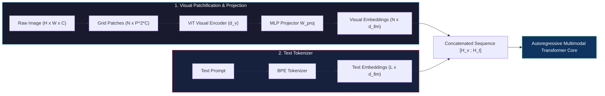
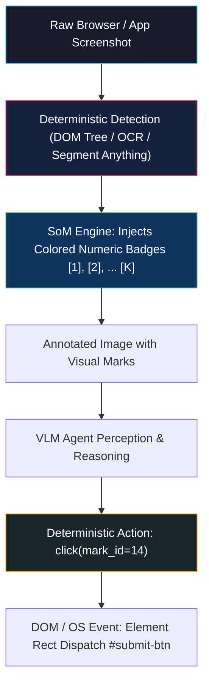
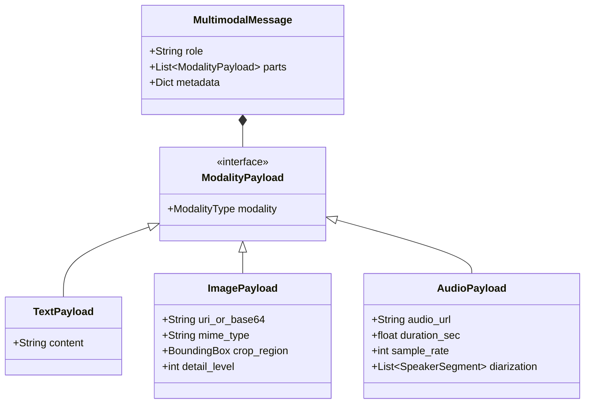
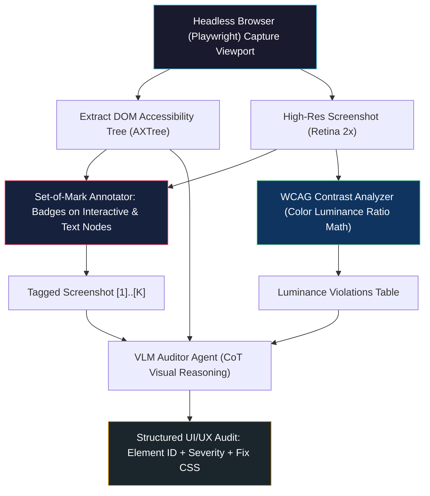
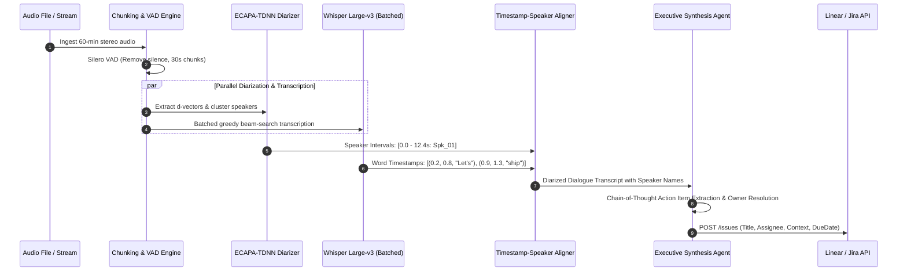

# Multi-Modal Agents: Vision and Audio

<!-- toc -->

<br/>
<br/>

Traditional autonomous agent architectures operate almost exclusively over discrete alphanumeric token streams. While text-only ReAct loops and graph-based orchestrators excel at code synthesis, symbolic reasoning, and structured API dispatch, they remain fundamentally blind and deaf to the physical and digital environments they are deployed to navigate. Real-world human workflows do not unfold in clean text prompts; they inhabit dynamic graphic user interfaces (GUIs), dense visual mockups, architectural schematics, audio meeting recordings, and streaming spoken conversations.

To operate in unconstrained enterprise environments, autonomous systems must undergo a paradigm shift from pure language modeling to **Multi-Modal Agent Architectures**.

A multi-modal agent seamlessly ingests, reasons over, and emits heterogeneous signals across vision, acoustic waveforms, and structured text. By synthesizing **Vision-Language Models (VLMs)**, **spatial grounding mechanisms (such as Set-of-Mark prompting)**, and **streaming audio processing pipelines (ASR, speaker diarization, and acoustic turn-taking)**, these agents bridge the gap between high-level reasoning and physical/GUI interaction.

<br/>
<br/>

---

## 1. The Multi-Modal Paradigm Shift: Modality Encoders, Tokenization & Alignment

Autonomous multi-modality is not achieved by chaining disparate black-box APIs with brittle JSON glue. Modern multi-modal systems unify sensory inputs into a shared computational latent space where vision patches and audio spectrogram frames are projected directly into the language model's transformer layers.

<br/>

### 1.1 Visual Patchification & Token Projection

Given an arbitrary 2D image $\mathbf{I} \in \mathbb{R}^{H \times W \times C}$, a standard Vision Transformer (ViT) cannot process continuous spatial grids directly. The image is decomposed into a sequence of $N$ non-overlapping patches $\mathbf{x}\_p \in \mathbb{R}^{N \times (P^2 \cdot C)}$, where $(P, P)$ is the patch resolution (typically $14 \times 14$ or $16 \times 16$), and the number of patches is:

$$N = \frac{H \cdot W}{P^2}$$

Each flattened patch is projected into a $d\_v$-dimensional visual embedding space via a learnable linear projection matrix $\mathbf{W}\_v \in \mathbb{R}^{(P^2 \cdot C) \times d\_v}$:

$$\mathbf{z}\_0 = \left[ \mathbf{x}\_p^1 \mathbf{W}\_v; \mathbf{x}\_p^2 \mathbf{W}\_v; \dots; \mathbf{x}\_p^N \mathbf{W}\_v \right] + \mathbf{E}\_{\text{pos}}$$

Where $\mathbf{E}\_{\text{pos}} \in \mathbb{R}^{N \times d\_v}$ denotes learnable or sinusoidal 2D spatial position embeddings.

To inject these visual tokens into a Large Language Model with embedding dimension $d\_{\text{llm}}$, an adapter/projector module $f\_{\phi}$ (such as a 2-layer MLP or Perceiver Resampler) aligns feature dimensions:

$$\mathbf{H}\_v = f\_{\phi}(\mathbf{z}\_L) = \operatorname{GELU}(\mathbf{z}\_L \mathbf{W}\_1 + \mathbf{b}\_1) \mathbf{W}\_2 + \mathbf{b}\_2 \quad \in \mathbb{R}^{N \times d\_{\text{llm}}}$$



<br/>

### 1.2 Mathematical Formulation of Multimodal Alignment

Cross-modal representation learning relies on optimizing the alignment between text and visual representations before instruction tuning. In contrastive pre-training (CLIP / SigLIP), normalized visual feature vectors $\mathbf{v}\_i = \frac{f\_v(\mathbf{I}\_i)}{\|f\_v(\mathbf{I}\_i)\|}$ and textual feature vectors $\mathbf{t}\_i = \frac{f\_t(\mathbf{T}\_i)}{\|f\_t(\mathbf{T}\_i)\|}$ in a batch of size $B$ are trained via symmetric InfoNCE loss:

$$\mathcal{L}\_{\text{contrastive}} = - \frac{1}{2B} \sum\_{i=1}^B \left( \log \frac{\exp(\langle \mathbf{v}\_i, \mathbf{t}\_i \rangle / \tau)}{\sum\_{j=1}^B \exp(\langle \mathbf{v}\_i, \mathbf{t}\_j \rangle / \tau)} + \log \frac{\exp(\langle \mathbf{t}\_i, \mathbf{v}\_i \rangle / \tau)}{\sum\_{j=1}^B \exp(\langle \mathbf{t}\_i, \mathbf{v}\_j \rangle / \tau)} \right)$$

Where $\tau$ is a learnable temperature parameter and $\langle \cdot, \cdot \rangle$ denotes cosine similarity. For generative agent execution, the language modeling loss is computed conditioned on both visual and textual prefixes:

$$\mathcal{L}\_{\text{LM}}(\theta, \phi) = - \sum\_{k=1}^{L} \log P\_{\theta, \phi}(y\_k \mid \mathbf{H}\_v, y\_{\lt k})$$

<br/>
<br/>

---

## 2. Vision-Language Models & Spatial Grounding in Autonomous Agents

While a standard VLM can easily describe an image in natural language ("This is a login page with a blue submit button"), an autonomous agent must perform **spatial visual grounding**: translating semantic user goals into precise, actionable coordinates on a display screen.

<br/>

### 2.1 The Coordinate Hallucination Dilemma

Early GUI agents relied on direct coordinate generation: prompting the model to output raw pixel coordinates $(x, y)$ or bounding box tuples $[y\_{\min}, x\_{\min}, y\_{\max}, x\_{\max}]$ normalized to $[0, 1000]$.

This naive approach fails catastrophically in production due to three core factors:
1. **Resolution Distortion & Aspect Downsampling:** VLMs resize arbitrary aspect ratios to fixed squares (e.g., $448 \times 448$ or $336 \times 336$), causing non-linear spatial warping.
2. **Positional Attention Blur:** Self-attention over spatial patches lacks sub-patch pixel resolution; predicting whether a clickable element lies at $x = 512$ vs. $x = 528$ is inherently stochastic.
3. **High Action Cost:** A single misclicked pixel $(x \pm 15\text{px})$ can click outside a dropdown, close an uncommitted modal, or submit invalid forms.

<br/>

### 2.2 Deterministic Grounding: Set-of-Mark (SoM) Prompting

To overcome coordinate hallucination, production vision agents employ **Set-of-Mark (SoM) Prompting**. Instead of forcing the model to guess raw pixel numbers, an auxiliary deterministic computer vision pipeline (or DOM bounding-box extractor) preprocesses the image before passing it to the VLM:

1. Interactive UI elements (buttons, inputs, links, dropdowns) are detected via semantic segmentation, OCR, or browser DOM trees.
2. Each detected element is highlighted with an overlay containing an unmistakable, alphanumeric numeric tag inside a high-contrast colored box (e.g., `[1]`, `[2]`, `[14]`).
3. The VLM is instructed to reference the alphanumeric ID: `"Click mark [14] to submit the checkout form"`.



> **Key Architectural Insight:** Set-of-Mark converts an ill-posed continuous regression problem (predicting continuous 2D coordinates) into a discrete classification and reasoning task (selecting tag $k \in \{1, \dots, K\}$), boosting execution accuracy from $\lt 60\%$ to $>94\%$ on GUI benchmarks.

<br/>
<br/>

---

## 3. Audio Processing, Speaker Diarization & Voice Agent Loops

Autonomous agents operating in telephony, meetings, or voice command loops require robust acoustic perception. Acoustic signals are continuous temporal pressure waves with rapid fluctuations, demanding specialized transformation pipelines.

<br/>

### 3.1 The Acoustic Perception Pipeline

Raw continuous audio $x(t)$ sampled at sampling rate $f\_s$ (e.g., 16 kHz) undergoes discrete transformation into the time-frequency domain:

1. **Windowing & STFT:** Short-Time Fourier Transform applies overlapping Hamming windows ($w[n]$, typically $25\text{ms}$ duration with $10\text{ms}$ hop size) to compute local frequency spectra:
   $$X(m, \omega) = \sum\_{n=-\infty}^{\infty} x[n] w[n - m] e^{-j \omega n}$$
2. **Mel-Scale Filterbank Projection:** The human auditory system exhibits non-linear pitch sensitivity. Frequencies $f$ (Hz) are mapped to the Mel scale $m = 2595 \log\_{10}(1 + f / 700)$. Triangular filterbanks aggregate spectral energy into $F$ bins (typically 80 or 128 Mel channels).
3. **Log Dynamic Range Compression:** $\mathbf{S}\_{\text{mel}} = \log(1 + \text{MelFilterBank}(|X|^2))$.


<br/>

### 3.2 Speaker Diarization ("Who Spoke When?")

For meeting intelligence and multi-speaker environments, standard speech-to-text (ASR) is insufficient. An agent must attribute every utterance to a distinct entity. Speaker Diarization consists of four sequential stages:

$$\text{Audio Stream} \xrightarrow{\text{VAD}} \text{Speech Segments} \xrightarrow{\text{Embedding}} \text{Speaker } d\text{-vectors} \xrightarrow{\text{Clustering}} \text{Speaker Labels}$$

1. **Voice Activity Detection (VAD):** Filters non-speech frames and ambient silence based on acoustic energy and neural classification (e.g., Silero VAD).
2. **Speaker Representation Extraction:** Continuous speech segments are segmented into sub-windows ($1.5\text{s}$ with $0.75\text{s}$ overlap). A pre-trained neural network (e.g., ECAPA-TDNN) maps each segment to a compact $d$-dimensional speaker embedding $\mathbf{e}\_s \in \mathbb{R}^{192}$.
3. **Clustering & Segmentation:** Agglomerative Hierarchical Clustering (AHC) or Spectral Clustering groups embeddings using cosine distance threshold $\theta\_{\text{diar}}$:
   $$D(\mathbf{e}\_a, \mathbf{e}\_b) = 1 - \frac{\mathbf{e}\_a \cdot \mathbf{e}\_b}{\|\mathbf{e}\_a\|\_2 \|\mathbf{e}\_b\|\_2}$$
4. **Alignment & Merging:** ASR word timestamps are aligned with clustered temporal intervals, yielding structured dialogue tuples: `(Timestamp_Start, Timestamp_End, Speaker_ID, Utterance)`.

<br/>

### 3.3 The Conversational Voice-to-Voice Latency Budget

Human conversations operate on an inter-turn latency threshold of approximately **250–350 ms**. Exceeding 500 ms creates jarring conversational pauses. In a cascaded voice agent (ASR $\to$ LLM $\to$ TTS), latency is strictly allocated:

| Pipeline Stage | Technology | Latency Target | Optimization Strategy |
| :--- | :--- | :--- | :--- |
| **1. Audio Ingest & VAD** | Silero VAD / WebRTC VAD | $20 - 40\text{ ms}$ | Frame chunking ($20\text{ms}$ buffers), ring-buffer streaming |
| **2. ASR (Speech-to-Text)** | Streaming Whisper / Deepgram Nova | $80 - 140\text{ ms}$ | Chunked CTC / Speculative beam search |
| **3. LLM First Token (TTFT)** | Fast Speculative Quantized Model | $100 - 150\text{ ms}$ | KV-cache prefixing, speculative decoding, prompt caching |
| **4. TTS (Text-to-Speech)** | Streaming FastSpeech2 / ElevenLabs | $60 - 90\text{ ms}$ | Sentence/clause chunked synthesis over WebSocket |
| **Total Round-Trip** | **Cascaded End-to-End** | **$260 - 420\text{ ms}$** | **Pipelined streaming (TTS starts on first LLM clause)** |

<br/>
<br/>

---

## 4. Multi-Modal Tool Integration & Unified Runtime

A truly multi-modal agent does not restrict modalities to the initial user prompt; it dynamically summons multi-modal tools throughout its execution trajectory.

<br/>

### 4.1 Modality Polymorphism in State Management

An enterprise agent framework must represent multimodal messages without bloating state. The message payload is modeled as a polymorphic discriminated union supporting text tokens, visual crops, base64 buffers, and raw audio references:



<br/>

### 4.2 The Multi-Modal Token Explosion Bottleneck

Processing visual and acoustic data inside autoregressive LLMs incurs steep compute and token costs:
- **Image Tiling Costs:** High-resolution screenshots ($1920 \times 1080$) cannot fit in a single $336 \times 336$ patch grid without extreme text blur. Modern VLMs split images into a thumbnail plus multiple $336 \times 336$ crops (e.g., $6$ tiles $\times 256\text{ tokens} = 1536\text{ tokens}$ per screenshot).
- **Multi-Turn Context Exhaustion:** In a 10-turn browser automation task, sending full-resolution screenshots at every turn consumes $15{,}000+$ prompt tokens solely on images, quickly triggering context saturation and latency spikes.
- **Architectural Remedy:** Dynamic Visual Eviction. The agent retains full visual resolution only for the current step ($t$), while converting historical steps ($t-1, t-2, \dots$) into distilled textual action-observation logs:
  $$\mathcal{H}\_t = \left[ (\mathbf{a}\_1, \mathbf{o}\_1^{\text{text}}), \dots, (\mathbf{a}\_{t-1}, \mathbf{o}\_{t-1}^{\text{text}}), (\mathbf{I}\_t, \mathbf{a}\_t) \right]$$

<br/>
<br/>

---

## 5. Clean Representative Code Implementation

The following production-grade snippets illustrate the core abstractions required for multimodal perception, Set-of-Mark visual grounding, and speaker-diarized audio pipeline execution.

<br/>

### 5.1 Polymorphic Multimodal Schema (Pydantic v2)

```python
from typing import List, Literal, Optional, Union
from pydantic import BaseModel, Field

class BoundingBox(BaseModel):
    ymin: int = Field(..., ge=0, le=1000)
    xmin: int = Field(..., ge=0, le=1000)
    ymax: int = Field(..., ge=0, le=1000)
    xmax: int = Field(..., ge=0, le=1000)

class ImagePart(BaseModel):
    type: Literal["image"] = "image"
    data_uri: str
    mark_id: Optional[int] = None
    bbox: Optional[BoundingBox] = None

class AudioPart(BaseModel):
    type: Literal["audio"] = "audio"
    audio_path: str
    sample_rate: int = 16000
    duration_s: float

class TextPart(BaseModel):
    type: Literal["text"] = "text"
    text: str

class MultimodalMessage(BaseModel):
    role: Literal["system", "user", "assistant", "tool"]
    parts: List[Union[TextPart, ImagePart, AudioPart]]
```

<br/>

### 5.2 Set-of-Mark (SoM) Grounding Engine Interface

```python
import cv2
import numpy as np

class SetOfMarkAnnotator:
    """Renders high-contrast deterministic alphanumeric tags on UI bounding boxes."""
    def __init__(self, font_scale: float = 0.5, thickness: int = 2):
        self.font_scale = font_scale
        self.thickness = thickness

    def annotate(self, image: np.ndarray, detections: List[BoundingBox]) -> np.ndarray:
        h, w, _ = image.shape
        marked_img = image.copy()
        for idx, bbox in enumerate(detections, start=1):
            y1, x1 = int(bbox.ymin * h / 1000), int(bbox.xmin * w / 1000)
            y2, x2 = int(bbox.ymax * h / 1000), int(bbox.xmax * w / 1000)
            # Draw boundary and prominent label badge
            cv2.rectangle(marked_img, (x1, y1), (x2, y2), (0, 255, 0), 2)
            label = f"[{idx}]"
            cv2.rectangle(marked_img, (x1, y1 - 20), (x1 + 35, y1), (0, 0, 0), -1)
            cv2.putText(marked_img, label, (x1 + 2, y1 - 5), 
                        cv2.FONT_HERSHEY_SIMPLEX, self.font_scale, (0, 255, 255), self.thickness)
        return marked_img
```

<br/>

### 5.3 Acoustic Meeting Intelligence Pipeline (VAD + Diarization + ASR)

```python
from dataclasses import dataclass
from typing import List

@dataclass
class SpeakerUtterance:
    speaker: str
    start_time: float
    end_time: float
    text: str

class AudioIntelligencePipeline:
    """Coordinates VAD, Speaker Embeddings, and ASR for meeting transcripts."""
    def __init__(self, vad_model, diarizer_model, asr_model):
        self.vad = vad_model
        self.diarizer = diarizer_model
        self.asr = asr_model

    async def process_stream(self, audio_chunk: bytes) -> List[SpeakerUtterance]:
        if not self.vad.is_speech(audio_chunk):
            return []
        
        # Extract speaker cluster and aligned transcript concurrently
        speaker_id = self.diarizer.identify_speaker(audio_chunk)
        raw_text = await self.asr.transcribe_chunk(audio_chunk)
        
        return [SpeakerUtterance(speaker=speaker_id, start_time=0.0, 
                                 end_time=1.5, text=raw_text)]
```

<br/>

### 5.4 Multi-Modal Action Dispatcher with Dynamic Visual Eviction

```python
class MultimodalAgentController:
    """Executes multimodal perception loops while pruning image context."""
    def __init__(self, vlm_client, annotator: SetOfMarkAnnotator):
        self.vlm = vlm_client
        self.annotator = annotator
        self.history: List[MultimodalMessage] = []

    async def step(self, current_screenshot: np.ndarray, user_goal: str) -> str:
        # Detect interactive candidates and overlay SoM marks
        boxes = await self._detect_dom_elements()
        annotated = self.annotator.annotate(current_screenshot, boxes)
        
        # Evict heavy image frames from prior turns to conserve token budget
        for msg in self.history:
            msg.parts = [p for p in msg.parts if p.type != "image"]
            
        # Append current visual state and prompt
        self.history.append(MultimodalMessage(
            role="user",
            parts=[ImagePart(data_uri=self._to_b64(annotated)), TextPart(text=user_goal)]
        ))
        return await self.vlm.generate_decision(self.history)
```

<br/>
<br/>

---

## 6. Official Challenges & Architectural Solutions

The following production scenarios represent the official MasterFabric Academy Day 22 curriculum challenges.

<br/>

<details>
<summary><strong>Scenario 1 (Vision): Automated Web UI/UX Auditor with Spatial Grounding</strong></summary>
<br/>

### Problem Statement
Design an autonomous agent that inspects screenshots of a web application and produces comprehensive, actionable UI/UX and accessibility (WCAG 2.1) audit reports. What specific tools, prompt architectures, and spatial grounding strategies must be combined to prevent hallucinated feedback?

### Architectural Solution



#### 1. Modality Coupling & Grounding
- Relying exclusively on raw VLM vision yields imprecise spatial estimations (e.g., guessing whether padding is 8px vs 16px).
- The agent couples **Playwright headless capture** with the browser **Accessibility Tree (AXTree)**. Every visible element receives a deterministic Set-of-Mark badge `[k]` mapped to its exact DOM XPath and computed CSS bounding client rectangle.

#### 2. Specialized Tool Suite
- **Deterministic WCAG Luminance Calculator:** Evaluates text-to-background contrast ratio using the relative luminance formula:
  $$L = 0.2126 R + 0.7152 G + 0.0722 B$$
  $$\text{Contrast Ratio} = \frac{L\_1 + 0.05}{L\_2 + 0.05}$$
  Fails if regular text has a ratio $< 4.5:1$ (WCAG AA).
- **Responsive Viewport Fuzzer:** Captures simultaneous viewports ($375\text{px}$ mobile, $768\text{px}$ tablet, $1440\text{px}$ desktop) to detect horizontal overflow bugs and touch target violations ($< 44 \times 44\text{px}$).

#### 3. Output Schema Invariant
The agent emits structured Pydantic objects containing:
`{ "mark_id": 12, "element_selector": "button.checkout-btn", "violation_type": "WCAG_TOUCH_TARGET", "measured_value": "32x28px", "required_threshold": "44x44px", "remediation_css": "min-height: 44px; padding: 12px;" }`.

</details>

<br/>

<details>
<summary><strong>Scenario 2 (Audio): Executive Meeting Intelligence & Action Item Extraction</strong></summary>
<br/>

### Problem Statement
How do you build an autonomous agent that ingests raw, multi-hour meeting audio recordings, identifies distinct speakers, generates an executive summary, and dispatches verified action items with assigned owners to project tracking systems (Jira / Linear)?

### Architectural Solution



#### 1. The Transcription-Diarization Alignment Math
Given word $w\_i$ with temporal start and end timestamps $[t\_{s}(w\_i), t\_{e}(w\_i)]$ and speaker interval $S\_k = [T\_{s}(S\_k), T\_{e}(S\_k)]$, the word is assigned to speaker $k$ maximizing temporal intersection:

$$k^* = \arg\max\_k \operatorname{Overlap}(w\_i, S\_k) = \arg\max\_k \max\left(0, \min(t\_{e}(w\_i), T\_{e}(S\_k)) - \max(t\_{s}(w\_i), T\_{s}(S\_k))\right)$$

#### 2. Speaker Name Resolution Sub-Agent
Raw diarization labels speakers anonymously (`Speaker_00`, `Speaker_01`). A specialized sub-agent inspects the dialogue for self-introductions ("Hi, this is Alice from platform engineering") and cross-mentions ("Bob, what is your take on the database migration?"). It builds a name-resolution dictionary to remap anonymous clusters to validated enterprise identities.

#### 3. Action Item Extraction Invariant
To prevent hallucinating commitments from informal brainstorming, the agent applies strict modal verb and accountability filters:
- Utterances must contain explicit commitment verbs (*"I will deliver"*, *"We agreed that Bob takes ownerhip"*).
- Passive suggestions (*"We could perhaps check this later"*) are categorized as *Discussion Notes*, never *Action Items*.

</details>

<br/>

<details>
<summary><strong>Scenario 3 (Integration & Systems): The Multi-Modal Trilemma (Latency, Accuracy & Context Cost)</strong></summary>
<br/>

### Problem Statement
What are the fundamental architectural bottlenecks when engineering an agent that simultaneously processes text, vision, and audio? Analyze the trade-offs across context window consumption, latency budgets, and multi-modal alignment drift.

### Architectural Solution

#### 1. Context Window Explosion & Cost Dynamics
- **Vision Token Overhead:** A single $1080\text{p}$ image consumes between $1000$ and $2000$ tokens depending on tile decomposition. In a 20-step autonomous loop, images consume $>30{,}000$ tokens per trajectory.
- **Audio Token Overhead:** At $12.5\text{ tokens/sec}$ (Whisper encoder representation), a 10-minute audio conversation yields $7{,}500$ audio tokens.
- **Optimization Strategy:**
  1. **Dual-Tier Resolution:** Downsample exploratory screenshots to low-res ($336\times 336$ single tile, $256$ tokens). Trigger high-res crop ($1536$ tokens) only when the agent specifically focuses on dense text or small icon clusters.
  2. **Transient Observation Pruning:** After an action is executed, discard the raw image from the working memory array. Store only a 20-word textual perception summary.

#### 2. Multi-Modal Alignment Drift & Hallucination Guardrails
- **The "Blind Faith" Hallucination:** When an image contains confusing visual noise, the language prior of the LLM frequently overrides visual reality (e.g., claiming a checkbox is checked because the surrounding text says "Agreed").
- **Verification Guardrail:** Self-Consistency via Cross-Modal Verification. The agent cross-verifies visual claims against the underlying DOM/OS accessibility tree:
  $$\text{IsChecked}\_{\text{verified}} = \text{VLM}(\text{Screenshot}) \land \text{DOM}(\text{aria-checked == 'true'})$$
  If modalities disagree, the agent triggers an active re-inspection tool (zoom crop or explicit DOM query) rather than committing an action.

#### 3. Latency Architecture for Voice Agents
- Standard cascading pipelines (VAD $\to$ ASR $\to$ LLM $\to$ TTS) exhibit a sequential latency of $\approx 800 - 1200\text{ms}$.
- To achieve human-like interactive fluidity ($\lt 350\text{ms}$), systems must implement **pipelined speculative streaming**:
  - **Early Sentence Streaming:** The LLM streams tokens immediately to a clause boundary detector (`.` or `,`).
  - **Speculative TTS Synthesis:** As soon as a 4-word clause is synthesized, TTS generation begins while the LLM continues generating the remainder of the thought.
  - **Interruption Gate:** Continuous VAD monitors the user's audio input. If user speech is detected while the agent's TTS is playing, an immediate cancel interrupt cancels TTS buffer playback and flushes the streaming socket.

</details>
