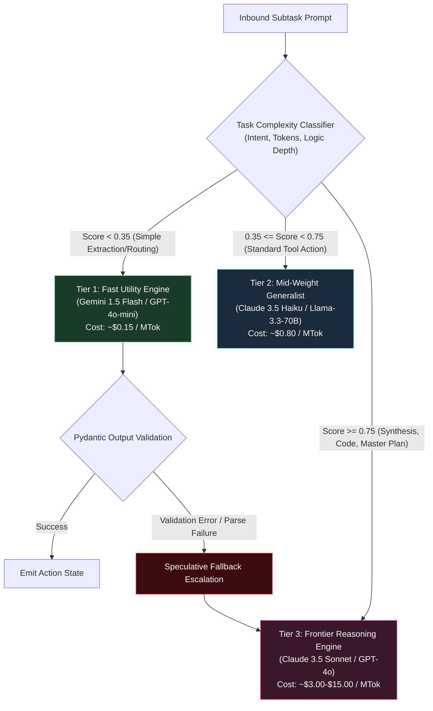
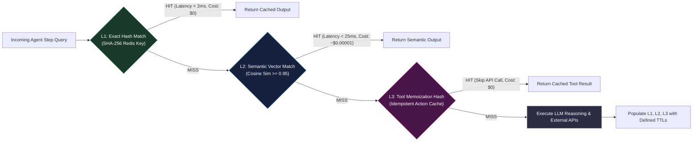
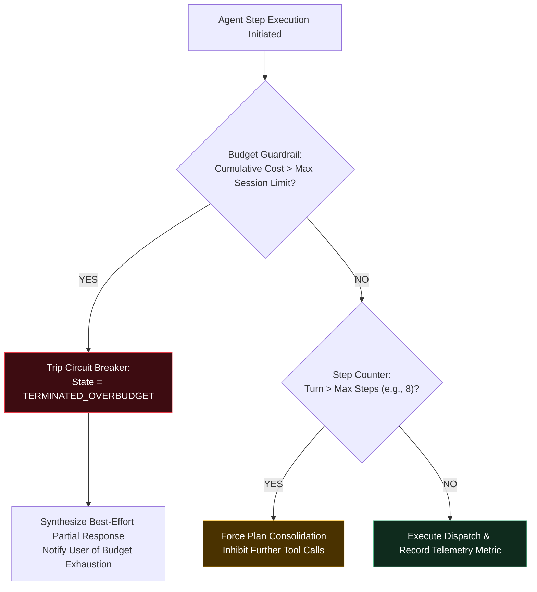
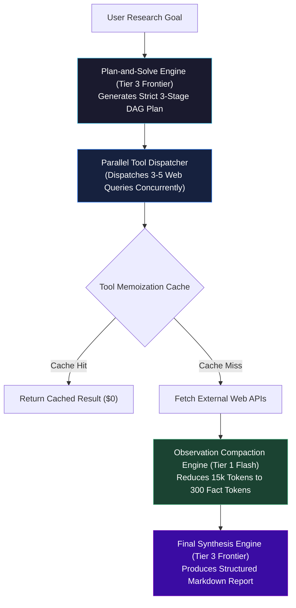
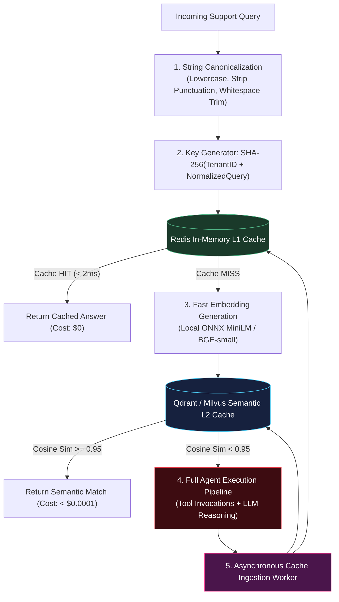

# Cost Optimization for AI Agents

<!-- toc -->

<br/>
<br/>

As autonomous AI agents transition from experimental research into mission-critical enterprise systems, operational viability is governed not merely by reasoning benchmarks, but by **strict unit economics**. While traditional web services exhibit deterministic $O(1)$ computation costs per user interaction, multi-turn autonomous agents running iterative loops (such as ReAct, Plan-and-Solve, or Reflexion) inherently incur **quadratic token accumulation ($O(T^2)$)** across reasoning horizons. Left unmanaged, a single rogue agent querying unstructured web APIs and repeatedly failing validation checks can consume dollars per session.

Engineering production-grade, cost-effective agentic systems requires moving beyond generic prompt trimming. It demands a **systematic, defense-in-depth cost optimization architecture**: mathematical context budgeting, provider-native prompt caching, semantic query memoization, dynamic multi-tier model routing (RouteLLM cascades), and runtime circuit breakers.

<br/>
<br/>

---

## 1. Mathematical Cost Modeling: The Quadratic Context Explosion

To optimize agent runtime expenses, engineers must first formalize the total cost function $C_{\text{total}}$ of an autonomous task spanning $T$ sequential decision turns with $K$ external tool invocations:

$$
C_{\text{total}} = \sum_{t=1}^{T} \left( P_{\text{in}} \cdot N_{\text{in}}^{(t)} + P_{\text{out}} \cdot N_{\text{out}}^{(t)} + P_{\text{cached}} \cdot N_{\text{cached}}^{(t)} \right) + \sum_{k=1}^{K} C_{\text{tool}}^{(k)}
$$

Where:
- $P_{\text{in}}, P_{\text{out}}$ denote the cost per token for fresh input prompts and generated output completions.
- $P_{\text{cached}}$ represents the discounted cost rate for cached prefix tokens (typically $75\% \text{ to } 90\%$ cheaper).
- $C_{\text{tool}}^{(k)}$ represents third-party compute or network API execution costs (e.g., search engines, code execution sandboxes, data scrapers).

```mermaid
flowchart TD
    subgraph NaiveLoop ["Naive ReAct Loop: Quadratic Token Explosion"]
        T1["Turn 1: Prompt + Thought + Tool Call + Tool Observation (M Tokens)"] --> T2["Turn 2: Turn 1 History + New Thought + New Tool Obs (2M Tokens)"]
        T2 --> T3["Turn 3: Turns 1-2 History + New Thought + New Tool Obs (3M Tokens)"]
        T3 --> TN["Turn T: Full Cumulative History ((T * M) Tokens) -> O(T^2) Cost"]
    end

    subgraph OptimizedLoop ["Optimized Pipeline: Linear Token Bounding"]
        O1["Turn 1: Static Prefix [CACHED] + Compressed Observation"] --> O2["Turn 2: Compact State + Tool Memoization Hit ($0)"]
        O2 --> O3["Turn 3: Evicted Raw Payload + Small Model Synthesis"]
        O3 --> ON["Turn T: Constant-Bounded Window -> O(T) Cost"]
    end

    style NaiveLoop fill:#3d0c11,stroke:#e63946,color:#fff
    style OptimizedLoop fill:#0f2b1d,stroke:#52b788,color:#fff
```

<br/>



<br/>

### 1.1 Derivation of Quadratic Context Accumulation
In a standard unpruned ReAct architecture, the input prompt at turn $t$ concatenates the static instructions, tool definitions, original user prompt, and all historical reasoning steps:

$$
N_{\text{in}}^{(t)} = N_{\text{system}} + N_{\text{tools}} + N_{\text{user}} + \sum_{j=1}^{t-1} \left( N_{\text{thought}}^{(j)} + N_{\text{action}}^{(j)} + N_{\text{observation}}^{(j)} \right)
$$

If external tool observations return an average payload size of $M$ tokens per step, and the agent's internal thought and action schemas average $S$ tokens, the cumulative input token volume consumed across $T$ turns scales quadratically:

$$
\sum_{t=1}^{T} N_{\text{in}}^{(t)} = T \cdot (N_{\text{system}} + N_{\text{tools}} + N_{\text{user}}) + (M + S) \sum_{t=1}^{T} (t - 1)
$$

$$
\sum_{t=1}^{T} N_{\text{in}}^{(t)} = T \cdot N_{\text{base}} + (M + S) \cdot \frac{T(T - 1)}{2} \implies \mathcal{O}\left((M + S) \cdot T^2\right)
$$

When tool observations involve raw HTML dumps or extensive JSON structures ($M \approx 2000 \text{ to } 5000 \text{ tokens}$), a 10-step autonomous agent consumes over $200{,}000$ input tokens for a single query. Controlling $M$ and bounding $T$ is therefore the primary mathematical lever for cost containment.

<br/>
<br/>

---

## 2. Token Reduction & Context Optimization Engineering

To suppress the quadratic expansion term, production architectures employ three complementary layers of context management: observation compaction, structured pruning, and provider-level prompt caching.

<br/>

### 2.1 Observation Compaction & Headless Extraction
External tool outputs must never be ingested directly into the primary reasoning context. Instead, tools must pass through an ephemeral **Compaction Filter** before reaching the working memory.

```python
# Low-cost extraction schema ensuring high token density
from pydantic import BaseModel, Field

class CompactWebObservation(BaseModel):
    source_url: str
    key_facts: list[str] = Field(max_items=5, description="Core extracted propositions")
    relevant_numbers: dict[str, float] = Field(default_factory=dict)
    has_target_data: bool
```

Instead of sending $8{,}000$ tokens of raw DOM trees, a lightweight utility model (e.g., GPT-4o-mini or Gemini 1.5 Flash) compresses the payload into an $80$-token structured `CompactWebObservation`. This achieves a **$98.5\%$ reduction in observation token mass ($M$)** before the primary frontier agent executes its next reasoning turn.

<br/>

### 2.2 Provider-Level Prompt Caching Topology
Modern frontier LLM providers (Anthropic, OpenAI, DeepSeek) provide hardware-accelerated KV-cache reuse for identical prompt prefixes. To maximize cache hit rates:
1. **Static Invariants First:** System instructions and tool definition schemas must be placed strictly at the beginning of the context window.
2. **Immutable Turn History:** Never alter previous user/assistant turns retrospectively, as any byte mutation invalidates downstream KV-cache blocks.
3. **Cache Breakpoint Structuring:** In multi-turn sessions, place explicit cache checkpoints immediately following the static tool definitions and periodically after major intermediate milestones.

$$
\text{Cost Savings} = N_{\text{cached}} \times (P_{\text{in}} - P_{\text{cached}}) \approx 0.90 \cdot P_{\text{in}} \cdot N_{\text{prefix}}
$$

<br/>
<br/>

---

## 3. Dynamic Model Cascades & Intelligent Routing (RouteLLM)

Dispatching every agent decision to a frontier reasoning model (e.g., Claude 3.5 Sonnet, GPT-4o) represents catastrophic over-engineering. In production workflows, over $70\%$ of agent steps consist of deterministic filtering, simple categorization, schema formatting, and status verification.



<br/>

### 3.1 Speculative Execution with Fallback Escalation
To guarantee system stability without defaulting to expensive models, production agents implement **Speculative Routing**:
- The subtask is executed first on a fast, low-cost utility engine (Tier 1).
- The output is validated against strict Pydantic models or JSON schema invariants.
- If and only if validation fails or tool invocation returns an unhandled exception, execution escalates to the Frontier Engine (Tier 3), passing the failed attempt as negative feedback.

```python
async def execute_with_speculative_fallback(task_prompt: str, schema: type[BaseModel]) -> BaseModel:
    try:
        # Tier 1: Low-cost execution attempt
        raw_result = await call_utility_model(task_prompt, max_tokens=256)
        return schema.model_validate_json(raw_result)
    except (ValidationError, Exception):
        # Tier 3: Escalate to frontier model only on validated failure
        frontier_result = await call_frontier_model(
            task_prompt, 
            system_prompt="Correct the formatting and fulfill schema precisely."
        )
        return schema.model_validate_json(frontier_result)
```

<br/>
<br/>

---

## 4. Multi-Tiered Caching & Deterministic Tool Memoization

Eliminating redundant LLM generation through hierarchical caching reduces both inference costs and agent response latency to near-zero for recurring tasks.



<br/>

### 4.1 L1 Exact String Normalization
Before evaluating computationally expensive vector embeddings, the input prompt undergoes canonical normalization:
1. Stripping leading/trailing whitespace and lowercasing.
2. Normalizing punctuation, control characters, and Unicode variations.
3. Generating a 256-bit cryptographic digest:
   $$K_{\text{exact}} = \operatorname{SHA-256}\left(\text{TenantID} \parallel \text{ModelID} \parallel \operatorname{Normalize}(\text{Query})\right)$$

A direct Redis key-value lookup provides instantaneous sub-2ms retrieval at absolute zero marginal token expenditure.

<br/>

### 4.2 L2 Semantic Vector Caching
When queries vary syntactically while preserving semantic equivalence, exact hash matching fails. Semantic caches compare the dense embedding $\vec{u}$ of the input query against indexed historical entries $\vec{v}$:

$$
S_C(\vec{u}, \vec{v}) = \frac{\vec{u} \cdot \vec{v}}{\|\vec{u}\| \cdot \|\vec{v}\|} \ge \tau
$$

For production question-answering and classification tasks, the similarity threshold $\tau$ must be calibrated strictly:
- $\tau \ge 0.95$: High precision. Eliminates false-positive cache retrievals in domain-specific tasks.
- $\tau \in [0.90, 0.94]$: Moderate precision, suitable for open-ended conversational chitchat.
- $\tau < 0.90$: High risk of hallucinated or contextually obsolete cache retrievals.

<br/>

### 4.3 L3 Deterministic Tool Memoization
Idempotent tool invocations (such as stock price lookups for closed trading days, user profile retrievals, or geographical geocoding) must never re-trigger external HTTP requests or SQL queries.

```python
import hashlib, json

def compute_tool_cache_key(tool_name: str, arguments: dict, tenant_id: str) -> str:
    canonical_args = json.dumps(arguments, sort_keys=True, separators=(',', ':'))
    payload = f"{tenant_id}:{tool_name}:{canonical_args}"
    return f"tool_cache:{hashlib.sha256(payload.encode()).hexdigest()}"
```

<br/>
<br/>

---

## 5. Budget Guardrails, Telemetry & Circuit Breakers

To prevent catastrophic software regressions—such as recursive self-invocation loops or runaway autonomous research agents—the runtime environment must enforce active token and fiscal guardrails.

<br/>



<br/>

### 5.1 Real-Time Financial Circuit Breakers
The execution loop must verify budget invariants synchronously before dispatching external API or model calls:

```python
class AgentBudgetExceededException(Exception):
    pass

class CostGuardrail:
    def __init__(self, max_cost_usd: float = 0.10, max_turns: int = 8):
        self.max_cost_usd = max_cost_usd
        self.max_turns = max_turns
        self.accumulated_cost = 0.0
        self.turn_count = 0

    def record_step(self, cost_incurred: float) -> None:
        self.turn_count += 1
        self.accumulated_cost += cost_incurred
        
        if self.accumulated_cost > self.max_cost_usd:
            raise AgentBudgetExceededException(
                f"Session cost ${self.accumulated_cost:.4f} exceeded cap ${self.max_cost_usd:.4f}"
            )
        if self.turn_count >= self.max_turns:
            raise AgentBudgetExceededException(
                f"Max execution turns ({self.max_turns}) exhausted."
            )
```

<br/>
<br/>

---

## 6. Official Challenges & Architectural Solutions

<details>
<summary><strong>Scenario 1 (System Analysis): Resolving Agent Thrashing (50 API Calls per Request)</strong></summary>
<br/>

### Problem Statement
An autonomous market intelligence agent deployed in production is consuming an average of **50 API calls per incoming user request**, inflating unit costs to unviable levels ($1.80 per research query) and causing frequent timeout failures. Analyze the systemic failure patterns driving this thrashing and design an architectural refactoring plan to constrain execution to **5–8 high-efficiency turns**.

### Root Cause Diagnostics
1. **Unbounded Exploration Thrashing:** The agent lacks a pre-execution Directed Acyclic Graph (DAG) plan. Upon receiving a broad query, it initiates iterative, micro-variational search queries (`search("cloud revenues 2025")`, `search("cloud revenues 2025 aws")`, `search("cloud market share q1")`).
2. **Serial Tool Execution Anti-Pattern:** The agent dispatches single tool calls sequentially, waiting for round-trip completion and model reflection between each invocation.
3. **Context-Driven Amnesia:** Uncompressed tool observations (averaging $3{,}000$ tokens of raw web text) rapidly pollute the context window. As the context length surpasses $30{,}000$ tokens, reasoning degradation causes the model to forget previously collected facts, triggering duplicate search queries.

### Architectural Solution
The pipeline is restructured around four mandatory constraints:



1. **Deterministic Plan-and-Solve (DAG):** ReAct free-form loops are prohibited. The agent must first compile a static, multi-step dependency graph.
2. **Parallel Tool Calling:** Instead of 10 sequential turns, the model emits a single parallel tool invocation block specifying all search targets simultaneously.
3. **Compacted Observation Pipeline:** Web pages are processed by a headless extractor that yields only numerical tables and verifiable claims.
4. **Hard-Stop Turn Invariant:** Total iterations are capped at $T_{\text{max}} = 6$. At turn 6, tool invocation tools are detached, forcing the LLM into final synthesis mode.

**Result:** Total API calls drop from 50 to 4 (1 planning call, 1 parallel batch tool call, 1 compaction pass, 1 synthesis call). Total cost drops from **$1.80 to $0.09 per query (a 95% reduction)**.

</details>

<br/>

<details>
<summary><strong>Scenario 2 (Model Selection): Dynamic Cost-Performance Model Cascades & Fallbacks</strong></summary>
<br/>

### Problem Statement
Evaluate the architectural trade-offs between deploying lightweight, low-cost utility models (e.g., Claude 3.5 Haiku, Gemini 1.5 Flash, GPT-4o-mini) versus frontier reasoning engines (e.g., Claude 3.5 Sonnet, GPT-4o) across the agentic loop. Design a production-ready routing engine that dynamically assigns tasks based on complexity and manages graceful error recovery.

### Trade-Off Matrix

| Evaluation Dimension | Lightweight Utility Engines (Tier 1) | Frontier Reasoning Engines (Tier 3) |
| :--- | :--- | :--- |
| **Blended Cost (per MTok)** | $0.15 – $0.80 | $3.00 – $15.00 ($10\times \text{ to } 20\times \text{ more expensive}$) |
| **Inference Latency** | Ultra-low ($200\text{–}600\text{ ms}$ TTFT) | Medium ($1.2\text{–}3.5\text{ s}$ TTFT) |
| **Strict Schema Adherence** | High for standard JSON; drops with nested unions | Exceptional across complex nested polymorphic types |
| **Long-Horizon Planning** | Vulnerable to hallucinated shortcuts and logical drift | High stability; maintains constraint tracking over $T > 10$ |
| **Tool Error Recovery** | Frequently loops or repeats identical failed parameters | Formulates alternative hypotheses and auto-corrects code |

### Architectural Solution: Adaptive Routing with Guarded Fallback
The router executes a dynamic decision rule:
1. **Triage Classification:** If the subtask is a pure transformation, data extraction, or intent classification, dispatch directly to Tier 1.
2. **Deterministic Syntax Verification:** The Tier 1 response must pass Pydantic schema validation.
3. **Escalation Boundary:** If the Tier 1 model emits a syntax error, fails schema validation, or produces a tool call that triggers an API error, execution is intercepted.
4. **Contextual Handoff:** The failed attempt, error traceback, and target schema are passed directly to Tier 3.

```python
from pydantic import BaseModel, ValidationError

async def dynamic_route_and_execute(prompt: str, schema: type[BaseModel], is_complex: bool) -> BaseModel:
    # Rule 1: High-complexity tasks bypass Tier 1 directly
    if is_complex:
        return await invoke_model(model="claude-3-5-sonnet", prompt=prompt, schema=schema)
    
    # Rule 2: Attempt execution on ultra-low-cost model
    try:
        raw_response = await invoke_model(model="gemini-1-5-flash", prompt=prompt)
        return schema.model_validate_json(raw_response)
    except (ValidationError, Exception) as err:
        # Rule 3: Escalate to frontier model upon verified failure
        escalated_prompt = f"{prompt}\n\n[Previous Attempt Failed with Error: {err}]. Correct and complete."
        return await invoke_model(model="claude-3-5-sonnet", prompt=escalated_prompt, schema=schema)
```

This ensures that $80\%$ of successful executions incur Tier 1 costs, while the remaining $20\%$ edge cases receive Tier 3 reliability.

</details>

<br/>

<details>
<summary><strong>Scenario 3 (Caching Strategy): High-Throughput FAQ & Support Agent Cache Topology</strong></summary>
<br/>

### Problem Statement
Design an enterprise caching infrastructure for an autonomous customer support agent handling $500{,}000$ daily user queries. The agent must provide instant answers to recurring inquiries, adapt to real-time company policy updates, and guarantee zero cross-tenant data leakage.

### Architectural Solution

#### 1. Multi-Stage Ingestion Pipeline



#### 2. Tiered Invalidation & TTL Matrix

| Data Classification | Storage Layer | Time-To-Live (TTL) | Invalidation Trigger |
| :--- | :--- | :--- | :--- |
| **Static Company Policy / Terms** | L1 Redis + L2 Vector | $30 \text{ Days}$ | Webhook from CMS / Documentation update |
| **Pricing & Promotional Plans** | L1 Redis + L2 Vector | $24 \text{ Hours}$ | Automated sync on catalog mutation |
| **Order Status & User Accounts** | **UNCACHED** | $0 \text{ Seconds}$ | Real-time tool execution only (Zero PII caching) |

#### 3. Security & Cross-Tenant Isolation Invariants
- **Cryptographic Namespace Isolation:** Every cache key and vector payload is prefixed with an HMAC-signed `tenant_id`. Cross-tenant semantic search queries are physically isolated via partition metadata filters:
  ```json
  "filter": {
      "must": [{"key": "tenant_id", "match": {"value": "enterprise_corp_42"}}]
  }
  ```
- **Event-Driven Instant Invalidation:** When support policy updates occur, the CMS triggers an asynchronous Redis cluster pipeline:
  ```bash
  HDEL tenant:enterprise_corp_42:faq *
  ```
  This immediately flushes all stale answers without requiring system downtime.

</details>
