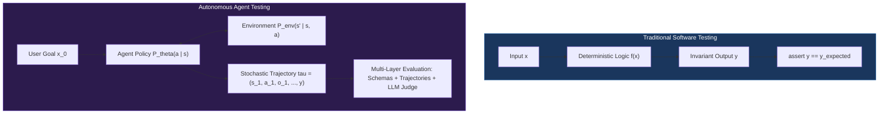
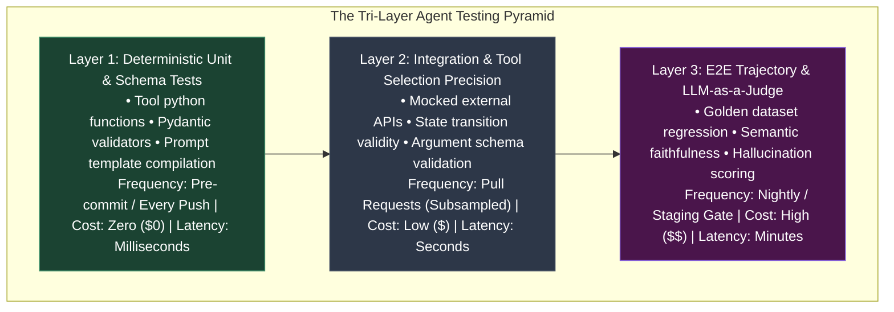
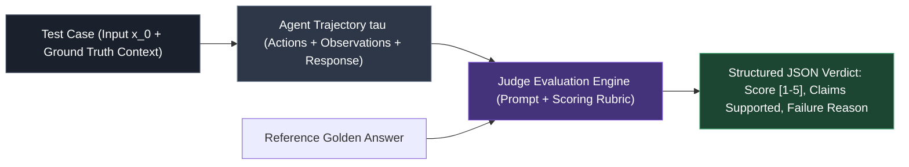
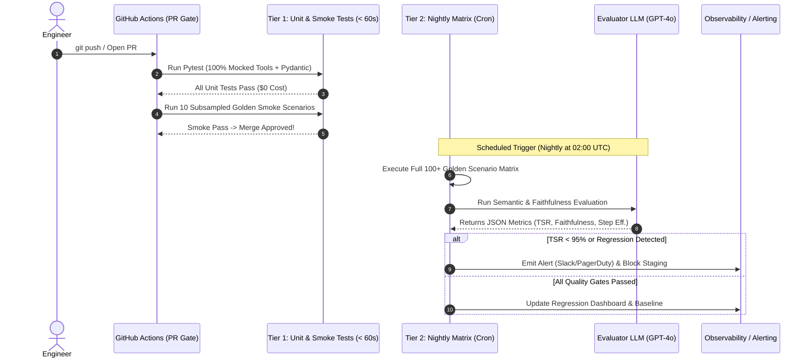

# Agent Testing and Quality Assurance

<!-- toc -->

<br/>
<br/>

The deployment of autonomous AI agents into mission-critical production environments presents an existential software engineering challenge: **how to verify, validate, and assert the correctness of fundamentally non-deterministic, stochastic systems**. In traditional deterministic software, test execution is binary—given an identical input $x$ and system state $S$, the function produces an invariant output $y = f(x; S)$. Test suites assert strict equivalence (`assert result == expected`) in milliseconds at zero marginal API cost.

Autonomous agents shatter this paradigm. Even under greedy decoding ($T = 0$), floating-point non-determinism across distributed GPU clusters, provider-level model routing, dynamic tool observations, and multi-turn reasoning loops yield variable response formulations. A brittle equality check will fail, while testing blindly against live upstream LLMs incurs prohibitive latency, astronomical token expenditure, and rampant test flakiness.

Transitioning agents from fragile research prototypes to enterprise-grade infrastructure demands a **rigorous testing pyramid**: deterministic mocking for execution tools, trajectory verification for reasoning graphs, reference-guided LLM-as-a-Judge evaluation, and multi-tier CI/CD automation pipelines.

<br/>
<br/>

---

## 1. The Stochastic Testing Paradigm: Determinism vs. Non-Determinism

To construct a mathematically sound verification strategy, we formalize the execution of an agent as a parameterized conditional probability distribution over trajectory sequences $\tau$:

$$
P(\tau \mid x_0) = \prod_{t=1}^{T} P_\theta(a_t \mid s_t) \cdot P_{\text{env}}(s_{t+1} \mid s_t, a_t)
$$

Where:
- $x_0$ is the initial user query or goal.
- $s_t = (x_0, a_1, o_1, \dots, a_{t-1}, o_{t-1})$ represents the dialogue history and context at step $t$.
- $a_t \sim P_\theta(\cdot \mid s_t)$ is the agent's action (internal reasoning, tool invocation, or final response) generated by an LLM parameterized by $\theta$.
- $o_t \sim P_{\text{env}}(\cdot \mid s_t, a_t)$ is the external environment observation (database records, API responses, terminal output).

<br/>



<br/>

### 1.1 The Trilemma of Agent Evaluation
Testing autonomous agents requires balancing three competing engineering constraints:

1. **Determinism & Reproducibility:** The ability to replay identical failure traces during debugging without stochastic divergence.
2. **Semantic Fidelity:** Ensuring that assertions test deep semantic intent, factual consistency, and tool precision rather than superficial string syntax.
3. **Execution Latency & Cost:** Keeping verification cycles fast enough to gate continuous integration (PR merges) without burning engineering velocity or token budgets.

<br/>
<br/>

---

## 2. The Agent Testing Pyramid

Mirroring classical software quality assurance, agent testing is structured as an inverted hierarchical pyramid. Higher layers provide greater semantic fidelity at higher cost and latency, while lower layers provide instantaneous, zero-cost deterministic guarantees.

<br/>



<br/>

### 2.1 Layer 1: Deterministic Unit & Schema Tests (0 Tokens, 0 Network)
Layer 1 isolates all underlying code that does not require generative reasoning:
- **Tool Implementation:** Ensuring Python/Go tool functions execute correctly under expected arguments and throw predictable domain exceptions when inputs are invalid.
- **Pydantic / Structured Output Schemas:** Verifying that JSON schemas, field constraints, type coercions, and regex patterns parse correctly.
- **Prompt Compilers & Context Assembly:** Verifying that prompt templates correctly format dynamic placeholders without memory leaks or missing keys.
- **Mocking Boundaries:** All third-party endpoints (databases, payment gateways, search APIs) are mocked via `unittest.mock` or fixture engines. Zero LLM calls are invoked.

### 2.2 Layer 2: Integration & Tool-Calling Precision
Layer 2 evaluates whether the agent policy $P_\theta$ accurately navigates state transitions and selects the correct tools without executing real production mutations:
- **Tool Selection Accuracy:** When presented with a canonical user intent, does the model emit the exact expected tool signature?
- **Argument Correctness:** Are arguments populated with correct types, valid IDs, and required parameters extracted from dialogue history?
- **State Machine Transitions:** In graph-based architectures (e.g., LangGraph), do conditional edges route to the correct successor node given specific tool observations?
- **Deterministic Replay (Cached Trajectories):** Inbound LLM responses and outbound API payloads are replayed from recorded VCR.py / cassette fixtures, isolating the orchestration logic from model drift.

### 2.3 Layer 3: End-to-End Behavioral & LLM-as-a-Judge Evaluation
Layer 3 validates overall multi-turn problem resolution on open-ended queries using golden datasets and automated LLM evaluators:
- **Trajectory Correctness:** Did the agent reach the terminal state within the maximum allowed step threshold $T_{\max}$ without getting trapped in circular reasoning loops?
- **Semantic Faithfulness:** Does the final textual response strictly derive from the retrieved tool observations without fabricating hallucinated claims?
- **Safety & Guardrail Compliance:** Does the agent resist adversarial jailbreaks and adhere to system safety guidelines?

<br/>
<br/>

---

## 3. Mathematical Evaluation Metrics

Rigorous agent testing requires quantitative, objective metrics over qualitative impressions. Below are the primary mathematical formulations powering modern agent evaluation suites.

<br/>

| Metric | Mathematical Formulation | Evaluation Method | Optimization Target |
| :--- | :--- | :--- | :--- |
| **Task Success Rate (TSR)** | $\text{TSR} = \frac{1}{N} \sum_{i=1}^N \mathbb{I}(\text{task}\_i = \text{Success})$ | Deterministic Flag / LLM Judge | $\ge 0.95$ (95%) |
| **Tool Selection Precision** | $P\_{\text{tool}} = \frac{\lvert \mathcal{T}\_{\text{called}} \cap \mathcal{T}\_{\text{expected}} \rvert}{\lvert \mathcal{T}\_{\text{called}} \rvert}$ | Exact Schema Match | $\ge 0.98$ (98%) |
| **Tool Selection Recall** | $R\_{\text{tool}} = \frac{\lvert \mathcal{T}\_{\text{called}} \cap \mathcal{T}\_{\text{expected}} \rvert}{\lvert \mathcal{T}\_{\text{expected}} \rvert}$ | Exact Schema Match | $\ge 0.95$ (95%) |
| **Faithfulness Score ($S\_{\text{faith}}$)** | $S\_{\text{faith}} = \frac{\lvert \mathcal{C}\_{\text{supported}} \rvert}{\lvert \mathcal{C}\_{\text{total}} \rvert} \in [0, 1]$ | LLM-as-a-Judge (NLI) | $\ge 0.98$ |
| **Step Efficiency ($\eta\_{\text{steps}}$)** | $\eta\_{\text{steps}} = \frac{T\_{\text{optimal}}}{T\_{\text{actual}}} \le 1.0$ | Trajectory Log Analysis | $\ge 0.85$ |
| **Unit Resolution Cost** | $C\_{\text{task}} = \sum_{t=1}^T \left( P\_{\text{in}} N\_{\text{in}}^{(t)} + P\_{\text{out}} N\_{\text{out}}^{(t)} \right)$ | Token Accounting Interceptor | Minimize |

<br/>

### 3.1 Formalizing Semantic Faithfulness (Hallucination Index)
To prevent agents from presenting fabricated observations to users, we formulate the Faithfulness Metric using Natural Language Inference (NLI) decomposition:

Let $R = \{c_1, c_2, \dots, c_m\}$ be the atomic propositional claims extracted from the agent's final response $R$. Let $O = \{o_1, o_2, \dots, o_k\}$ denote the set of raw observations returned by authorized tools during the trajectory.

$$
S_{\text{faith}}(R, O) = \frac{1}{m} \sum_{j=1}^{m} \mathbb{I} \left( O \vdash c_j \right)
$$

Where $O \vdash c_j$ indicates that observation context $O$ logically entails claim $c_j$. An agent scoring $S_{\text{faith}} < 1.0$ has introduced unverified or hallucinated information into the resolution.

<br/>
<br/>

---

## 4. LLM-as-a-Judge: Design, Calibration, and Bias Mitigation

When evaluating subjective outputs (e.g., tone, explanation quality, contextual coherence), programmatic string comparison fails. We deploy high-capacity frontier models (e.g., GPT-4o, Claude 3.5 Sonnet) as **automated evaluators (LLM-as-a-Judge)** operating under structured scoring rubrics.

<br/>



<br/>

### 4.1 Systemic Judge Biases and Mitigation Protocols
LLM judges are subject to cognitive and positional distortions that must be engineered out:

1. **Position Bias:** Models favor the first candidate in pairwise comparisons.
   - *Mitigation:* Perform **bidirectional evaluation (swap order)**: evaluate $(A, B)$ and $(B, A)$. Reject verdicts if scores diverge.
2. **Verbosity Bias:** Judges disproportionately award higher scores to wordy, verbose responses regardless of factual precision.
   - *Mitigation:* Normalize rubrics to penalize length and explicitly instruct the judge: *"Penalize extraneous exposition; award maximum scores only to minimal, direct, complete answers."*
3. **Self-Enhancement Bias:** LLMs systematically assign higher ratings to outputs generated by their own model family.
   - *Mitigation:* Decouple the evaluator model family from the agent policy (e.g., evaluate an Anthropic Claude agent using an OpenAI GPT judge, or an open-weight Llama evaluator).

<br/>
<br/>

---

## 5. Automated CI/CD Testing Architecture

A production-grade agent repository implements a **Two-Tier Pipeline Architecture** within continuous integration workflows (e.g., GitHub Actions):

<br/>



<br/>

### 5.1 Representative Pytest Implementation: Tool Calling & Assertion
The following minimal test suite demonstrates how to test an agent deterministically using fixtures and mocks without incurring live API costs:

```python
import pytest
from unittest.mock import MagicMock
from pydantic import BaseModel, Field

class OrderQuery(BaseModel):
    order_id: int = Field(..., gt=0)

def test_agent_order_resolution_deterministic(monkeypatch):
    # 1. Arrange: Mock external database client to isolate network dependencies
    mock_db = MagicMock()
    mock_db.fetch_order.return_value = {"id": 1042, "status": "shipped", "carrier": "DHL"}
    
    # 2. Assert Tool Parameter Validation
    query = OrderQuery(order_id=1042)
    assert query.order_id == 1042
    
    # 3. Act: Simulate agent tool invocation step
    tool_output = mock_db.fetch_order(order_id=query.order_id)
    
    # 4. Assert: Exact tool argument invocation and state verification
    mock_db.fetch_order.assert_called_once_with(order_id=1042)
    assert tool_output["status"] == "shipped"
    assert tool_output["carrier"] == "DHL"
```

<br/>
<br/>

---

## 6. Official Challenges & Architectural Solutions

<br/>

<details>
<summary><strong>Challenge 1: Comprehensive Testing Strategy for 100 Query Types & 15 Tools</strong></summary>
<br/>

### Scenario
An enterprise banking agent handles 100 distinct query categories (e.g., wire transfers, credit card disputes, mortgage calculations) orchestrated across 15 external microservice tools. When updating the underlying LLM backbone (e.g., from GPT-4o to Claude 3.5 Sonnet or Llama-3.3), how do you guarantee zero regression?

### Architectural Solution
1. **Curate an Immutable Golden Dataset ($\mathcal{D}_{\text{gold}}$):**
   - Assemble a verified dataset containing exactly 2 to 3 canonical examples per query type ($N = 250$ test instances).
   - Each entry contains: `(input_prompt, expected_tool_sequence, expected_schema_arguments, ground_truth_facts)`.
2. **Tool Routing Separation:**
   - Execute the model against the prompt with tool definitions enabled, but **intercept execution before tools run**.
   - Assert $\text{Tool Selection Accuracy} \ge 0.99$ (99%) and $\text{Argument Exact Match} \ge 0.95$ (95%) on golden test inputs.
3. **Synthesized Mock Server:**
   - Route all 15 tool interfaces to an in-memory mock repository that returns deterministic state payloads matching the recorded golden schema.
4. **Differential Regression Matrix:**
   - Run candidate model $M\_{\text{new}}$ and baseline model $M\_{\text{old}}$ across $\mathcal{D}\_{\text{gold}}$. Compute the delta in Task Success Rate:
     $$\Delta \text{TSR} = \text{TSR}(M\_{\text{new}}) - \text{TSR}(M\_{\text{old}})$$
   - Gating Policy: If $\Delta \text{TSR} < 0$ on critical financial tools, deployment is hard-blocked.
</details>

<br/>

<details>
<summary><strong>Challenge 2: Enterprise Metrics Suite for a Customer Support Agent</strong></summary>
<br/>

### Scenario
Define a comprehensive, quantifiable evaluation suite for a production customer support agent operating in high-volume e-commerce. How do you measure success and prevent silent failure modes?

### Architectural Solution
We establish a four-dimensional KPI framework balancing correctness, safety, efficiency, and operational health:

1. **Resolution Effectiveness:**
   - **First-Contact Resolution (FCR):** Proportion of user goals resolved without requiring human escalation or follow-up sessions.
   - **Task Success Rate (TSR):** Verified by user feedback token (`problem_solved: true`) or autonomous audit by an evaluator LLM verifying goal achievement against chat logs.
2. **Factual Integrity & Trust:**
   - **Faithfulness / Hallucination Index ($S_{\text{faith}}$):** Every factual claim made to the customer must be provably entailed by tool outputs. Target: $\ge 0.99$.
   - **Tool Call Precision ($P_{\text{tool}}$):** Ensuring the agent does not attempt to trigger unauthorized or incorrect backend APIs (e.g., attempting a refund instead of checking status). Target: $\ge 0.98$ (98%).
3. **User Experience & Latency:**
   - **Time to First Token (TTFT):** $\le 800\text{ ms}$ via token streaming to maintain conversational responsiveness.
   - **Turn Completion Time ($T_{\text{turn}}$):** Total multi-tool reasoning latency bounded to $P_{95} \le 3.5\text{ s}$.
4. **Operational Economics:**
   - **Cost per Resolution ($C_{\text{res}}$):** $\le \$0.04$ per completed ticket, monitored via context budgeting and semantic caching.
   - **Human Escalation Rate ($\text{HER}$):** Percentage of queries routed to human agents. Target: $0.08 \le \text{HER} \le 0.12$ (8% – 12%; a rate of 0% signals unsafe overconfidence, while > 20% signals capability degradation).
</details>

<br/>

<details>
<summary><strong>Challenge 3: High-Concurrency CI/CD Agent Pipeline Design</strong></summary>
<br/>

### Scenario
Design an automated GitHub Actions CI/CD pipeline triggered on every pull request that guarantees agent behavioral integrity without stalling development or inflating API bills.

### Architectural Solution
The pipeline employs a staged gate architecture structured across three isolated jobs:

1. **Job 1: Fast Deterministic Gate (`pre-merge-fast` - Runner: Ubuntu 22.04, Time: < 45s, Cost: $0.00)**
   - Linting, formatting, and type checks (`ruff`, `mypy`).
   - Execution of unit test suite with 100% mocked external network dependencies (`pytest -m "unit"`).
   - Validates all Pydantic tool schemas, prompt serialization, and state graph transitions.
2. **Job 2: Subsampled Smoke Evaluation (`pre-merge-smoke` - Time: < 90s, Cost: < $0.05)**
   - Executes 10 high-priority canonical golden test cases using a fast, low-cost model (e.g., Claude 3.5 Haiku or GPT-4o-mini).
   - Evaluates basic trajectory validity and tool parameter extraction.
   - Merge to `main` requires Jobs 1 and 2 to report green.
3. **Job 3: Full Nightly Regression Matrix (`nightly-deep-eval` - Scheduled Cron: 03:00 UTC)**
   - Executes full 100+ scenario golden dataset against the production model tier.
   - Evaluates outputs using an independent Judge LLM for faithfulness, toxicity, and resolution depth.
   - Runs automated adversarial fuzzing (50 synthetic prompt-injection payloads).
   - Generates automated markdown reports deposited into repository artifacts and publishes summary metrics to an engineering Datadog / Grafana dashboard.
</details>

<br/>
<br/>

---

## 7. Key Architectural Insights & Takeaways

> **Key Insight:** Testing an autonomous agent is not an exercise in asserting deterministic equality; it is the discipline of **bounding stochastic entropy**. By isolating deterministic tool execution at the base of the pyramid and reserving LLM-as-a-Judge evaluation for high-value semantic trajectories, engineering teams achieve rigorous quality assurance without exploding CI latency or token budgets.
