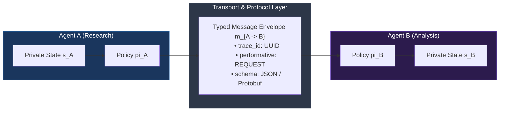
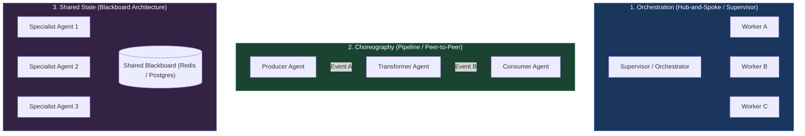
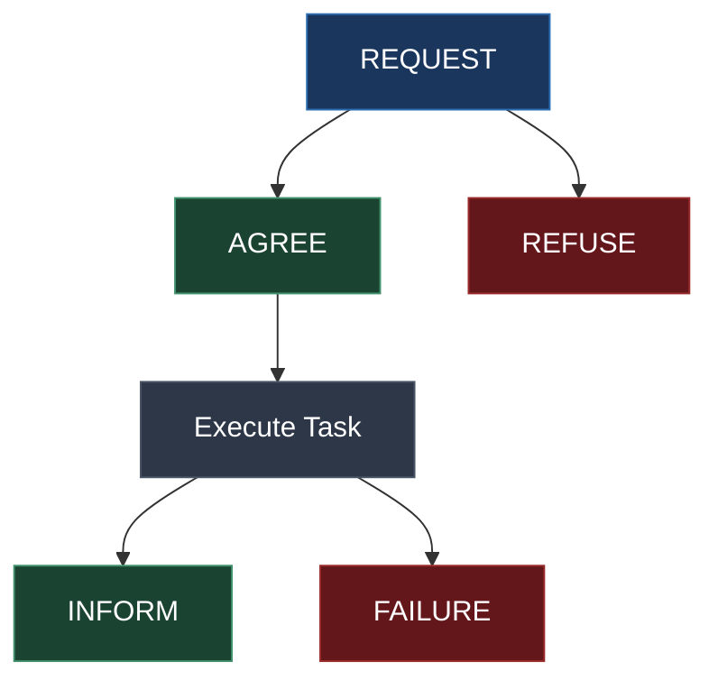
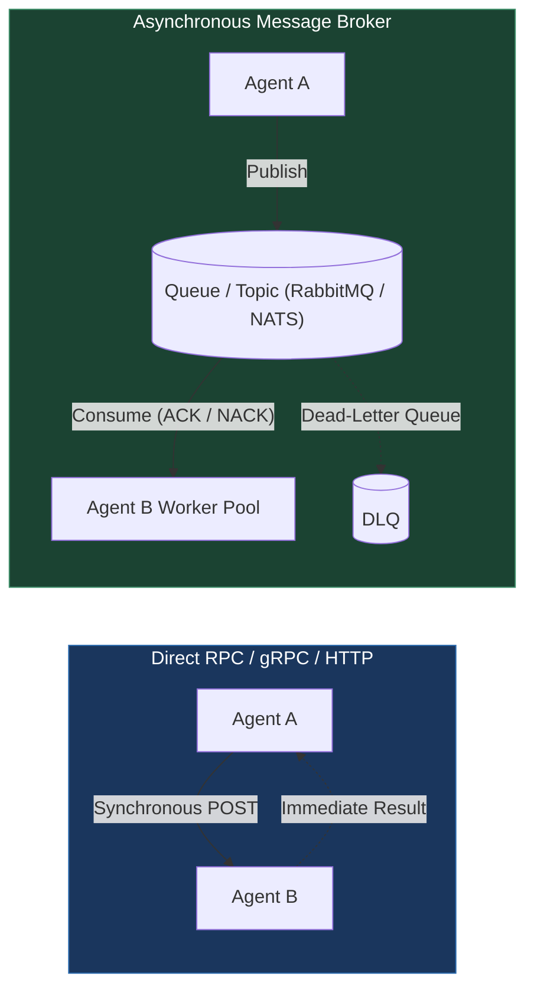
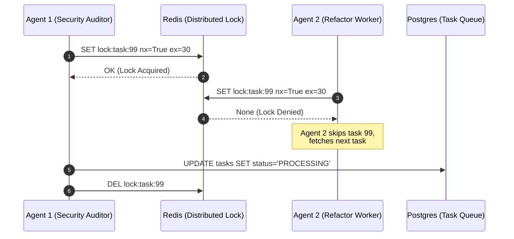
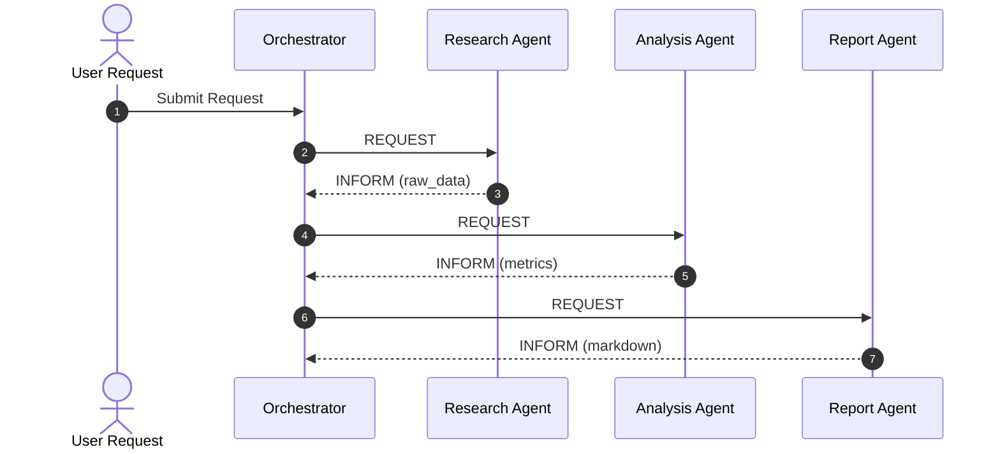

# Agent Communication Protocols

<!-- toc -->

<br/>
<br/>

The evolution of autonomous AI systems inevitably transitions from solitary, monolithic agents to **distributed multi-agent networks (MAS)**. In single-agent architectures, an LLM operates within an enclosed loop—formulating thoughts, invoking local tools, and appending observation feedback into a single growing context window. However, this centralized approach hits fundamental architectural ceilings: context window exhaustion, quadratic attention complexity ($O(N^2)$), catastrophic forgetting, and operational single-points-of-failure.

Decomposing a complex system into specialized, domain-isolated agents solves context scaling, but introduces a distributed systems challenge: **Inter-Agent Communication**. How do autonomous agents exchange information, coordinate collaborative workflows, negotiate task ownership, and handle partial failures without descending into deadlocks, race conditions, or unstructured semantic chaos?

Production-grade multi-agent architectures demand rigorous **communication protocols**: deterministic envelope schemas, explicit state machines, formal performatives (speech acts), and resilient transport topologies.

<br/>
<br/>

---

## 1. The Multi-Agent Communication Space

Mathematically, a multi-agent communication network is modeled as a directed interaction graph $\mathcal{G} = (\mathcal{A}, \mathcal{E})$, where:
- $\mathcal{A} = \{A_1, A_2, \dots, A_n\}$ represents the set of autonomous agents (nodes).
- $\mathcal{E} \subseteq \mathcal{A} \times \mathcal{A}$ represents valid communication channels between agents.
- Each agent $A_i$ possesses an internal private state $s_i \in \mathcal{S}_i$ and policy $\pi_i$.

A communication event at timestep $t$ is an envelope $m_{i \to j}^{(t)} \in \mathcal{M}$ transmitted from agent $A_i$ to $A_j$. The state transition of the recipient agent $A_j$ is governed by:

$$
s_j^{(t+1)} = \delta_j\left(s_j^{(t)}, m_{i \to j}^{(t)}\right)
$$

Where $\delta_j$ is the state transition function parameterized by agent $A_j$'s reasoning runtime.

<br/>



<br/>

### 1.1 Unstructured Text vs. Structured Envelopes
In early multi-agent prototypes, agents communicate by piping raw natural language strings directly into each other's system prompts. In enterprise production, **unstructured text exchange is a severe anti-pattern**:
1. **Semantic Ambiguity:** Raw text lacks explicit metadata defining intent, versioning, urgency, or idempotency keys.
2. **Context Window Pollution:** Passing entire conversational transcripts downstream inflates token consumption exponentially across multi-hop agent chains.
3. **Parse Failures:** Downstream agents must burn reasoning tokens merely attempting to extract parameters and return statuses from unstructured conversational prose.

Production multi-agent systems decouple the **transport envelope (metadata & protocol)** from the **payload (structured semantic content)**.

<br/>
<br/>

---

## 2. Communication Topologies & Coordination Patterns

The design of multi-agent interaction is fundamentally shaped by its architectural topology. Three primary patterns govern agent coordination:

<br/>



<br/>

### 2.1 Topology Comparison Matrix

| Architectural Dimension | Orchestration (Hub-and-Spoke) | Choreography (Pipeline / Event-Driven) | Blackboard (Shared Memory) |
| :--- | :--- | :--- | :--- |
| **Coupling** | Centralized, strict hierarchy | Loose, event-oriented | Decoupled via shared storage |
| **Latency** | Medium (Double-hop via Supervisor) | Low ($O(1)$ direct hop) | Low to Medium (DB read/write) |
| **Traceability** | **Highest:** Central audit log of all turns | Medium: Requires distributed tracing | High: State changes logged in DB |
| **Failure Blast Radius** | **High:** Supervisor crash halts system | **Low:** Single agent failure can be retried | **Low:** Agents poll independent tasks |
| **Error Recovery** | Dynamic replanning by Supervisor | Dead-letter queues & circuit breakers | Task re-leasing on timeout |
| **Token Cost** | Higher (Supervisor processes intermediate states) | Minimal (Only downstream payload passed) | Highly efficient (Pointers/IDs passed) |

<br/>
<br/>

---

## 3. Protocol Standards & The Speech Act Model

Modern agent communication inherits theoretical foundations from speech act theory and the **FIPA-ACL (Foundation for Intelligent Physical Agents - Agent Communication Language)** specification. Every interaction defines an intentional state called a **Performative**.

### 3.1 Core Agent Performatives



- **`REQUEST`**: The sender requests the recipient to perform an action.
- **`AGREE`**: The recipient agrees to perform the requested action.
- **`REFUSE`**: The recipient rejects the request (due to permission, capability, or rate limits).
- **`INFORM`**: The sender informs the recipient that a statement or result is true (payload contains completed data).
- **`FAILURE`**: The recipient encountered an unrecoverable exception during execution.

<br/>

### 3.2 Production Envelope Schema (Pydantic Implementation)

Every inter-agent message in a distributed cluster must adhere to a strict, verifiable contract:

```python
from enum import Enum
from typing import Any, Dict, Optional
from pydantic import BaseModel, Field
import uuid, time

class Performative(str, Enum):
    REQUEST = "REQUEST"
    AGREE = "AGREE"
    REFUSE = "REFUSE"
    INFORM = "INFORM"
    FAILURE = "FAILURE"

class AgentMessageEnvelope(BaseModel):
    message_id: str = Field(default_factory=lambda: str(uuid.uuid4()))
    trace_id: str = Field(..., description="OpenTelemetry trace propagation ID")
    conversation_id: str = Field(..., description="Logical multi-turn workflow ID")
    sender: str = Field(..., description="Source agent identity, e.g. 'agent.research.v1'")
    recipient: str = Field(..., description="Target agent identity or '*' for broadcast")
    performative: Performative
    protocol: str = Field(default="mf-agent-protocol/1.0")
    timestamp: float = Field(default_factory=time.time)
    reply_to: Optional[str] = Field(None, description="Correlated message_id being answered")
    payload: Dict[str, Any] = Field(default_factory=dict, description="Typed payload data")
```

<br/>
<br/>

---

## 4. Transport Layer: Direct RPC vs. Message Queues

Choosing the physical or virtual transport mechanism dictates the resilience, throughput, and scalability of an agent network.

<br/>



<br/>

### 4.1 Trade-off Analysis: API vs. Broker

1. **Direct RPC (HTTP / gRPC / WebSocket):**
   - **Pros:** Sub-millisecond connection overhead, trivial debugging, synchronous confirmation.
   - **Cons:** Tight coupling, no inherent buffering (bursts trigger HTTP 429/503), recipient unavailability results in hard failure.
2. **Message Broker (RabbitMQ, Redis Streams, Apache Kafka, NATS):**
   - **Pros:** Full temporal decoupling, automatic backpressure regulation, guaranteed at-least-once delivery, dynamic worker pooling.
   - **Cons:** Infrastructure overhead, message serialization cost, asynchronous state tracking complexity.

> **Staff Engineer Rule:** Use **Direct gRPC / REST** for latency-critical user-facing loops ($T_{\text{latency}} < 500\text{ ms}$). Use **Message Queues (Redis Streams / RabbitMQ)** for background, multi-turn, long-running agent workflows ($T_{\text{execution}} > 3\text{ s}$).

<br/>
<br/>

---

## 5. Concurrency, Distributed Locking & Conflict Resolution

When multiple autonomous agents operate concurrently over a shared domain (e.g., executing code refactors, updating customer records, allocating compute resources), **Race Conditions** inevitably emerge.

<br/>



<br/>

### 5.1 Concurrency Defense Strategies

#### Strategy 1: Distributed Mutex (Redis Redlock Pattern)
Guarantees mutually exclusive execution over an isolated resource key. The lock must include an automatic expiration time (Time-To-Live / TTL) to prevent permanent deadlocks if an agent process dies:

```python
import redis

r = redis.Redis(host="localhost", port=6379, db=0)

def acquire_agent_lease(task_id: str, agent_id: str, ttl_seconds: int = 45) -> bool:
    lock_key = f"agent:lock:{task_id}"
    # Atomic SET if Not eXists (NX) with Expiration (EX)
    return bool(r.set(lock_key, agent_id, nx=True, ex=ttl_seconds))
```

#### Strategy 2: Optimistic Concurrency Control (OCC)
In relational or document datastores, each task record maintains a monotonically increasing `version` column:

```sql
UPDATE tasks SET status = 'IN_PROGRESS', version = version + 1 WHERE id = 'task-42' AND version = 3;
```

If another agent modified the record concurrently, the condition `version = 3` fails, returning zero updated rows. The losing agent safely aborts or rereads the updated state.

#### Strategy 3: Competing Consumers with Explicit ACK
In AMQP (RabbitMQ) or AWS SQS, task messages are leased exclusively to a single worker instance. The message remains invisible to the pool until either an explicit `ACK` is returned or the visibility timeout expires, ensuring zero double-processing.

<br/>
<br/>

---

## 6. Real-World Architecture: The 3-Agent Collaborative Pipeline

To illustrate production communication protocols, we implement an enterprise Research-Analysis-Reporting pipeline orchestrated through typed message envelopes and status validation.

```python
from typing import Dict, Any

class AgentRouter:
    """Central Orchestration Router managing inter-agent protocol state transitions."""
    def __init__(self):
        self.mailboxes: Dict[str, list] = {"research": [], "analysis": [], "report": []}

    def dispatch(self, envelope: AgentMessageEnvelope):
        if envelope.recipient not in self.mailboxes and envelope.recipient != "*":
            raise ValueError(f"Unknown destination agent: {envelope.recipient}")
        
        # Enforce protocol validation
        if envelope.performative == Performative.REQUEST:
            print(f"[TRACE: {envelope.trace_id[:8]}] {envelope.sender} -> {envelope.recipient} : REQUEST")
        elif envelope.performative == Performative.INFORM:
            print(f"[TRACE: {envelope.trace_id[:8]}] {envelope.sender} -> {envelope.recipient} : INFORM (Data Delivered)")
            
        self.mailboxes[envelope.recipient].append(envelope)

    def receive(self, agent_name: str) -> Optional[AgentMessageEnvelope]:
        return self.mailboxes[agent_name].pop(0) if self.mailboxes[agent_name] else None
```



<br/>
<br/>

---

## 7. Interactive Challenges & Engineering Walkthrough

<details>
<summary><strong>Challenge 1: Communication Protocol Design for Research-Analysis-Report Triad</strong></summary>
<br/>

### Scenario
Design a communication protocol for three distinct agents: a Research Agent, an Analysis Agent, and a Report-Writing Agent. Should the topology follow a centralized Orchestrator (Hub-and-Spoke) or an autonomous Choreography (Pipeline)? How are intermediate state degradations mitigated?

### Architectural Solution
1. **Topology Selection: Hub-and-Spoke (Supervisor) Architecture:**
   - For mission-critical reporting where factual accuracy and data completeness are paramount, an **Orchestration Hub** is vastly superior to a peer-to-peer pipeline.
   - **Quality Gate Isolation:** If the Research Agent retrieves only 1 unverified source instead of the mandatory 3 primary sources, a direct P2P pipeline passes this degraded payload directly to the Analysis Agent, causing cascading hallucinations ("Garbage In, Garbage Out").
   - The Orchestrator acts as an enforcement gateway: validating payload schemas, evaluating retrieved source density, and issuing a retry `REQUEST` before the Analysis Agent is ever invoked.
2. **Protocol State Machine:**
   - **Turn 1:** `Supervisor -> ResearchAgent (REQUEST: search_topics)`
   - **Turn 2:** `ResearchAgent -> Supervisor (INFORM: structured_citations)`
   - **Turn 3:** *Quality Gate Pass* $\to$ `Supervisor -> AnalysisAgent (REQUEST: compute_trends)`
   - **Turn 4:** `AnalysisAgent -> Supervisor (INFORM: statistical_aggregates)`
   - **Turn 5:** `Supervisor -> ReportAgent (REQUEST: format_markdown)`
   - **Turn 6:** `ReportAgent -> Supervisor (INFORM: final_artifact)`
3. **Traceability:**
   - All envelopes carry a shared `trace_id`. If the report fails compliance checks, the exact offending step (raw source retrieval vs. metric synthesis) is isolated instantly in telemetry.
</details>

<br/>

<details>
<summary><strong>Challenge 2: Message Queue vs. Direct API Calls (Staff Engineer Trade-off Analysis)</strong></summary>
<br/>

### Scenario
What are the architectural trade-offs of utilizing a distributed message broker (RabbitMQ/Kafka/NATS) versus direct API invocations (REST/gRPC) for inter-agent communication? When is each approach mandated?

### Architectural Solution
1. **Gating Criteria Matrix:**
   - **Latency Budget:** Direct gRPC connections operate at sub-10 millisecond latency. Message queues introduce broker roundtrip hops (15–50 ms). For synchronous dialogue loops with waiting end-users, direct calls or WebSockets are mandatory.
   - **Backpressure & Burst Handling:** When 500 tasks arrive simultaneously, direct API invocations cause recipient agent pods to suffer memory exhaustion (OOM) or cascade HTTP 429 Rate Limits against underlying LLM APIs. Message queues natively absorb spikes, letting agent workers pull jobs at their calibrated maximum concurrency (e.g., 5 parallel threads per node).
   - **Durability & Fault Tolerance:** In direct REST calls, if an agent crashes midway through a 45-second inference call, the calling client receives a broken TCP pipe (HTTP 502/504) and the computation is lost. With a message queue, the un-ACKed message is returned to the queue and seamlessly picked up by another healthy worker node.
2. **Hybrid Standard:**
   - User $\leftrightarrow$ Gateway Agent: **Direct gRPC / Server-Sent Events (SSE)**.
   - Gateway Agent $\leftrightarrow$ Background Worker Agents: **Redis Streams / RabbitMQ AMQP**.
</details>

<br/>

<details>
<summary><strong>Challenge 3: Parallel Task Conflict & Race Condition Mitigation</strong></summary>
<br/>

### Scenario
Two instances of an autonomous code-refactoring agent independently identify and attempt to optimize the exact same file in a shared Git repository at the exact same second. How do you prevent data corruption, merge collisions, and wasted compute?

### Architectural Solution
A multi-layered defense strategy combining distributed locking and optimistic versioning:

1. **Distributed Mutex Lease (Layer 1 - Prevention):**
   - Before downloading or analyzing file `src/core/auth.py`, the agent must acquire a distributed lease via Redis:
     `SET lock:file:src/core/auth.py <agent_uuid> NX EX 60`
   - If the key exists, the second agent receives `None`, skips the file, and proceeds to the next candidate file in the AST work queue.
2. **Optimistic Git Branch Isolation (Layer 2 - Execution):**
   - Agents never commit directly to `main`. Every agent works inside an ephemeral Git branch: `agent-refactor/<file_hash>-<agent_uuid>`.
   - The agent pulls the base commit SHA.
3. **Optimistic Concurrency Control on Merge (Layer 3 - Verification):**
   - Prior to automated PR creation or merging, the CI gate asserts:
     ```python
     assert HEAD_base == HEAD_main
     ```
   - If a peer agent merged a change to `auth.py` while the second agent was generating its diff, the base SHA assertion fails. The stale work is discarded, preventing merge conflicts.
</details>

<br/>
<br/>

---

## 8. Key Architectural Insights & Takeaways

> **Key Insight:** In multi-agent systems, **communication is architecture**. Natural language is the internal fuel for individual model inference, but structured, strongly-typed protocols (envelopes, performatives, distributed locks, and state machines) are the physical steel and concrete that allow hundreds of autonomous agents to coordinate securely without collapse.
