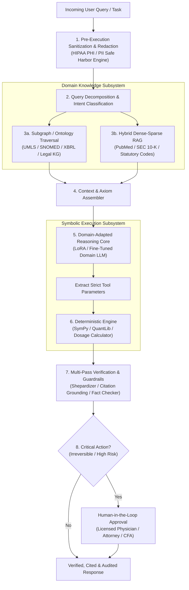
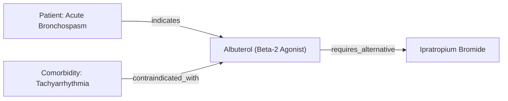
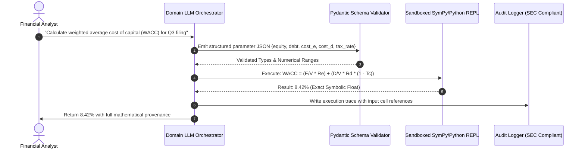

# Building Domain-Specific Agents

<!-- toc -->

<br/>
<br/>

Generalist Large Language Models (LLMs) excel at open-domain conversation, creative generation, and broad semantic synthesis. However, deploying a generalist agent into high-stakes, highly regulated enterprise verticals—such as **healthcare, legal compliance, quantitative finance, and aerospace engineering**—inevitably leads to catastrophic failure if standard prompt engineering patterns are applied.

In regulated verticals, the operational margin of error is zero. A hallucinated legal precedent can trigger judicial sanctions (*Mata v. Avianca*); an arithmetic hallucination in financial modeling can invalidate SEC disclosures; and an inaccurate medication dosage or uncontrolled PHI exposure violates federal statutes (such as HIPAA) and endangers human life.

Building production-grade **Domain-Specific Agents** requires abandoning the naive assumption that an LLM can act as an unconstrained autonomous decision-maker. Instead, domain agents must be architected as **deterministic orchestration systems** that combine formal ontologies, domain-adapted representations, symbolic calculation engines, and multi-layered regulatory guardrails.

<br/>
<br/>

---

## 1. Architectural Anatomy of Domain-Specific Agents

A domain-specific agent decomposes the reasoning pipeline into isolated, verifiable subsystems. Rather than allowing raw natural language to flow directly to an unconstrained LLM, the architecture enforces strict pre-execution sanitization, formal ontology grounding, deterministic tool invocation, and multi-pass audit guardrails.

<br/>



<br/>

### Parametric vs. Non-Parametric Memory Bifurcation

Production domain agents strictly separate knowledge into two distinct operational tiers:

1. **Non-Parametric Dynamic Knowledge (Retrieval & Ontologies):**
   - Statutory laws, judicial precedents, clinical trial updates, and quarterly balance sheets change continuously.
   - Storing dynamic facts inside static model weights invites stale reasoning. All dynamic knowledge must reside in external, version-controlled Knowledge Graphs ($\mathcal{K}$) and vector indexes.
2. **Parametric Procedural Knowledge (Domain Adapters):**
   - The model's weights are adapted purely to master **domain vocabulary, syntax, structural formatting, and specialized reasoning heuristics** (e.g., parsing complex Latin legal phrasing or understanding medical acronyms in clinical notes).

<br/>
<br/>

---

## 2. Formal Knowledge Representation & Domain Ontologies

Standard vector retrieval (Dense RAG) fails in specialized fields because cosine similarity in dense embedding space lacks logical and taxonomic precision. In medicine, "hypotension" (low blood pressure) and "hypertension" (high blood pressure) have almost identical vector embeddings due to shared contextual tokens, yet prescribing a hypertensive drug to a hypotensive patient is fatal.

Domain agents solve this via **Formal Ontologies and Knowledge Graphs**.

### Mathematical Formulation of a Domain Knowledge Graph

A formal domain ontology is modeled as an edge-labeled directed multigraph $\mathcal{O} = (\mathcal{C}, \mathcal{R}, \mathcal{I}, \mathcal{A})$, where:
- $\mathcal{C}$ is the set of concept classes (e.g., $\text{Disease}, \text{ActiveIngredient}, \text{CourtDecision}$).
- $\mathcal{R}$ is the set of formal relation types (e.g., $\text{contraindicated\_with}, \text{overruled\_by}, \text{subsidiary\_of}$).
- $\mathcal{I}$ is the set of ground entity instances ($e_i \in \mathcal{I}$).
- $\mathcal{A}$ is the set of logical axioms and constraint rules (e.g., $\forall x, y : \text{Overrules}(x, y) \implies \neg\text{ValidPrecedent}(y)$).

<br/>

$$
\mathcal{G}_{\text{domain}} = \left\{ (h, r, t) \;\middle|\; h, t \in \mathcal{I},\; r \in \mathcal{R} \right\} \quad \text{subject to} \quad \mathcal{A} \models \text{True}
$$

<br/>



When an agent processes a domain query, it links natural language entities to standardized ontology nodes (e.g., UMLS Concept Unique Identifiers - `CUI`, or SNOMED-CT codes). This enables deterministic graph traversals that surface hard logical constraints that probabilistic vector search overlooks.

<br/>
<br/>

---

## 3. Domain Adaptation Strategies: PEFT/LoRA vs. Dynamic RAG

Choosing between fine-tuning and retrieval-augmented generation is not an either/or decision; it is a structured trade-off between semantic adaptation and factual mutability.

### Low-Rank Adaptation (LoRA) Formulation

When adapting a base model $W_0 \in \mathbb{R}^{d \times k}$ to a specialized vertical corpus (e.g., SEC financial filings or PubMed abstracts), full parameter fine-tuning is computationally prohibitive and risks catastrophic forgetting. **LoRA** decomposes the weight update matrix $\Delta W$ into low-rank matrices:

$$
W = W_0 + \Delta W = W_0 + \frac{\alpha}{r} (B \cdot A)
$$

Where:
- $W_0 \in \mathbb{R}^{d \times k}$ represents the frozen pretrained weights.
- $B \in \mathbb{R}^{d \times r}$ and $A \in \mathbb{R}^{r \times k}$ are trainable low-rank adapters with rank $r \ll \min(d, k)$.
- $\alpha$ is a scaling hyperparameter controlling adapter influence.

<br/>

### Adaptation Decision Matrix

| Dimension | Standard In-Context RAG | Domain LoRA / PEFT | Hybrid (KG-RAG + Domain LoRA) |
| :--- | :--- | :--- | :--- |
| **Primary Purpose** | Factual grounding & source citation | Jargon, tone, syntax & structural output | Production-grade vertical reasoning |
| **Knowledge Freshness** | Real-time (instant index update) | Static (requires re-training) | Real-time retrieval + specialized syntax |
| **Token Efficiency** | Low (heavy prompt overhead) | High (reasoning baked into weights) | Optimized (concise ontology prompts) |
| **Hallucination Risk** | Moderate (context window distraction) | High (if used as factual store) | Lowest (strict constraint verification) |
| **Compliance Audit** | Explicit (direct source pointers) | Black-box (weights cannot be audited) | Fully auditable via graph provenance |

<br/>
<br/>

---

## 4. Deterministic Execution & Tool Augmentation

LLMs are probabilistic next-token predictors. Entrusting an LLM with arithmetic calculations, portfolio risk metrics, or drug titration equations violates basic safety standards.

> **Core Principle:** An LLM must NEVER perform quantitative calculation or state-mutating transactions internally. The agent functions strictly as an **intent parser, entity extractor, and orchestrator**. All computations must be delegated to deterministic, sandboxed execution runtimes.

<br/>

$$
\text{Output} = f_{\text{deterministic}}\Big(\text{LLM}_{\text{extract}}(\text{UserQuery}, \mathcal{S}_{\text{schema}})\Big)
$$

<br/>



<br/>
<br/>

---

## 5. Regulatory Compliance & Strict Guardrails

Vertical agents operate under strict statutory frameworks. Violating these frameworks exposes the operating organization to legal liability, license revocation, and severe regulatory fines.

### 1. Healthcare: HIPAA & HITECH (Safe Harbor De-Identification)
Under the HIPAA Privacy Rule Safe Harbor method (45 CFR § 164.514(b)(2)), 18 explicit categories of Protected Health Information (PHI)—including patient names, MRNs, dates, postal codes, and contact numbers—must be sanitized **before** any data leaves the local boundary or enters model context.

### 2. Financial Services: SEC / FINRA / SOX (Auditability & Grounding)
Financial models must comply with SEC Rule 17a-4 and FINRA regulatory notices. Every financial metric generated by an agent must have an immutable audit trail linking the number to an exact filing source (e.g., *Form 10-K, Item 8, Consolidated Statements of Operations, Page 64, Row 12*).

### 3. Legal Practice: Ethics Rules & Shepardization
Under ABA Model Rules of Professional Conduct (Rule 1.1 Competence, Rule 3.3 Candor Toward the Tribunal), submitting unverified or overruled precedents constitutes legal malpractice. A legal agent must implement a **Shepardizing pipeline**: a directed graph traversal verifying that every cited statute or judicial decision has not been superseded, questioned, or overruled by higher courts.

<br/>
<br/>

---

## 6. Implementation Blueprint: Deterministic Domain Agent

Below is a production-grade implementation pattern demonstrating deterministic PHI sanitization, Pydantic type validation, and audited symbolic computation:

```python
import re
from typing import Literal
from pydantic import BaseModel, Field

class ClinicalDosageRequest(BaseModel):
    patient_synthetic_id: str = Field(..., pattern=r"^SYNTH-[A-Z0-9]{6}$")
    age_years: int = Field(..., ge=0, le=125)
    weight_kg: float = Field(..., gt=0.0, lt=400.0)
    egfr_ml_min: float = Field(..., ge=0.0, description="Estimated Glomerular Filtration Rate")
    drug_code: Literal["DRUG-VANCO-01", "DRUG-AMIK-02"]

class PHISanitizer:
    MRN_REGEX = re.compile(r"\bMRN-?\d{6,8}\b", re.IGNORECASE)
    PHONE_REGEX = re.compile(r"\b(?:\+?1[-. ]?)?\(?([0-9]{3})\)?[-. ]?([0-9]{3})[-. ]?([0-9]{4})\b")

    @classmethod
    def sanitize(cls, text: str) -> str:
        text = cls.MRN_REGEX.sub("[REDACTED_MRN]", text)
        return cls.PHONE_REGEX.sub("[REDACTED_PHONE]", text)

class DeterministicDosageEngine:
    @staticmethod
    def calculate(req: ClinicalDosageRequest) -> dict:
        # Pure deterministic rule engine (No LLM arithmetic)
        if req.egfr_ml_min < 30.0:
            return {"dosage_mg": 500, "interval_hours": 48, "alert": "RENAL_IMPAIRMENT_ADJUSTMENT"}
        elif req.egfr_ml_min < 50.0:
            return {"dosage_mg": 750, "interval_hours": 24, "alert": "MODERATE_ADJUSTMENT"}
        target_mg = min(2000, round(req.weight_kg * 15 / 250) * 250)
        return {"dosage_mg": target_mg, "interval_hours": 12, "alert": "STANDARD_DOSE"}
```

<br/>
<br/>

---

## 7. Interactive Challenge & Production Edge Cases

<br/>

<details>
<summary><strong>Challenge 1: Legal Research Agent — Precedent Invalidation & Shepardizing Pipeline</strong></summary>
<br/>

### Scenario
A legal associate asks the agent: *"Find supporting appellate precedents for an interlocutory appeal under the doctrine of collateral order, and draft the opening argument."* How do you prevent the agent from citing an overturned precedent or hallucinating a citation?

### Architectural Solution
1. **Two-Phase Citation Retrieval:**
   - The query is matched against a verified judicial corpus (e.g., CourtListener / LexisNexis / Westlaw API).
   - Only decisions with verified persistent identifiers (e.g., Official Reporter Volume and Page) are returned.
2. **Deterministic Shepardization Subgraph Traversal:**
   - Before presenting any case to the LLM context, the agent queries the precedent validity graph:
     ```sql
     SELECT status, overruling_citation 
     FROM legal_precedent_graph 
     WHERE target_citation = '337 U.S. 541' AND relation_type = 'OVERRULED_BY';
     ```
   - If an edge exists pointing to a higher court overruling, the citation is flagged as `INVALID_PRECEDENT` and excluded from the context.
3. **Dual-Pass Grounding Verification:**
   - A secondary critic model checks every claim in the generated text against the cited quotation:
     $$\text{CitationGroundingScore} = \frac{\text{Entailed Claims}}{\text{Total Claims Cited}}$$
   - Any assertion with a score $< 1.0$ triggers automated redaction.
</details>

<br/>

<details>
<summary><strong>Challenge 2: Healthcare Clinical Support — Bounded Prescribing & Safe Harbor Pipeline</strong></summary>
<br/>

### Scenario
An integrated health system connects an AI agent to physician workstations to assist with clinical documentation and order entry. What prevents the agent from committing patient data leaks or ordering dangerous off-label prescriptions?

### Architectural Solution
1. **Client-Side Safe Harbor Sanitization:**
   - All free-text clinical notes pass through an on-premise, containerized regex and BioBERT NER pipeline before transmitting to any external LLM provider.
   - All 18 HIPAA identifiers are substituted with deterministic synthetic tokens (`[SYNTH_PATIENT_4819]`).
2. **Clinical Decision Support System (CDSS) Hard Constraints:**
   - The agent's tool execution runtime is decoupled from the LLM. When an order is proposed, the parameters are sent to an FDA-cleared rule base (e.g., First Databank / Wolters Kluwer).
   - If a drug-drug interaction (DDI) severe severity level is triggered, the system executes an automated hard-stop veto.
3. **Mandatory Human-in-the-Loop (HITL) Gate:**
   - The agent's output is classified as an unsigned draft order. Under federal law, software cannot sign medical orders; only a licensed clinician with cryptographic authentication (e.g., SmartCard / Biometric) can review and commit the transaction.
</details>

<br/>

<details>
<summary><strong>Challenge 3: Financial Quantitative Analysis — SEC 10-K Parsing & Symbolic Arithmetic</strong></summary>
<br/>

### Scenario
A hedge fund deploys an agent to extract Free Cash Flow (FCF) metrics from 500 quarterly 10-Q filings and calculate historical CAGR. LLMs frequently misread multi-column financial tables and hallucinate arithmetic products. How is absolute precision achieved?

### Architectural Solution
1. **Layout-Aware XBRL / HTML Parsing:**
   - The agent rejects raw text OCR. It consumes machine-readable SEC EDGAR XBRL filings where numbers are tagged with GAAP taxonomy concepts (`us-gaap:CashProvidedByUsedInOperatingActivitiesDiscontinuedOperations`).
   - Table hierarchy and footnotes are parsed as relational Pandas DataFrames.
2. **Symbolic Code-Generation Protocol:**
   - Instead of answering *"The Free Cash Flow is \$1.42B"*, the agent generates a sandboxed Python script:
     ```python
     def compute_fcf(df_cashflow):
         op_cash = df_cashflow.loc['OperatingCashFlow', '2023']
         capex = df_cashflow.loc['CapitalExpenditures', '2023']
         return op_cash - capex
     ```
3. **SEC Audit Log Injection:**
   - Every computed value returns with a cryptographic metadata header containing: `SEC_ACCESSION_NUMBER`, `ITEM_SECTION`, `TABLE_CELL_COORDINATES`, and `CALCULATION_SCRIPT_HASH`.
</details>

<br/>
<br/>

---

## 8. Key Architectural Insights & Takeaways

> **Key Insight:** In generalist AI, probabilistic creativity is a feature. In domain-specific enterprise agents, **unbounded creativity is a critical bug**. High-performing vertical agents succeed not through larger models or longer prompts, but through rigid structural discipline: formal ontologies for knowledge representation, symbolic tools for exact computation, and uncompromised regulatory guardrails for compliance.
