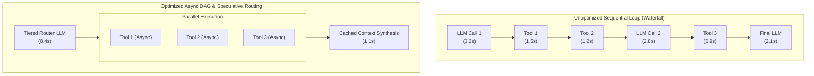
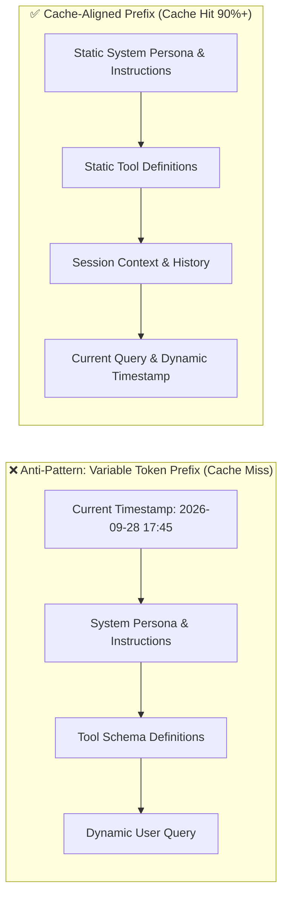
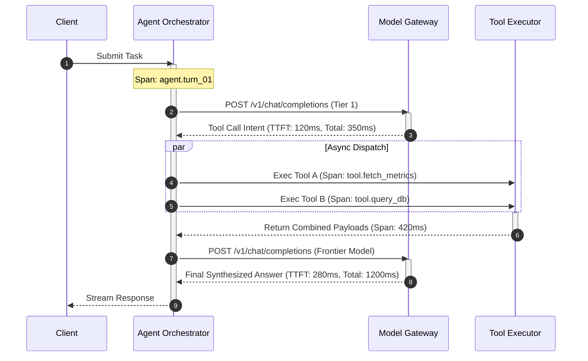
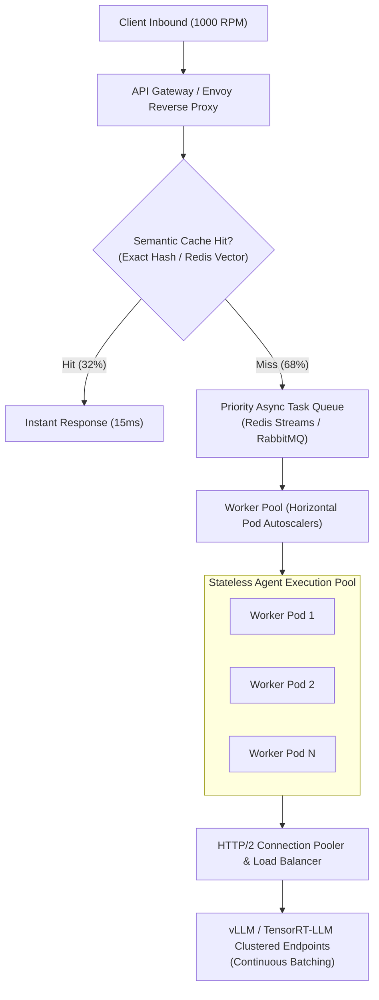

# Agent Performance Optimization

<!-- toc -->

<br/>
<br/>

Deploying an autonomous agent into production shifts the performance profile from a single request-response cycle into an unpredictable, multi-step feedback loop. In a naive implementation, an agent executing four iterative reasoning steps—each incurring a 2.5-second Large Language Model (LLM) inference call and a 1.2-second tool execution—accumulates an end-to-end latency exceeding 15 seconds. In interactive consumer applications and high-throughput enterprise systems, such latency breaks user engagement, saturates connection pools, and drives compute costs exponentially higher.

Optimizing agentic architectures requires moving beyond basic prompt engineering. Production systems require **deterministic latency budgeting, asynchronous Directed Acyclic Graph (DAG) scheduling, KV-cache prefix alignment, speculative model routing, and distributed tracing**.

<br/>
<br/>

---

## 1. Anatomy of Agent Performance & Bottleneck Decomposition

The end-to-end turnaround time of an autonomous agent ($T_{\text{agent}}$) is the cumulative sum of multiple discrete phases spanning network transport, autoregressive neural decoding, external I/O, and internal orchestration overhead.

<br/>

### Mathematical Formulation of Latency Breakdown

For an agent trajectory executing $K$ iterative cycles, total turnaround time is formalized as:

$$
T_{\text{agent}} = \sum_{k=1}^{K} \left( T_{\text{prefill}}^{(k)} + N_{\text{gen}}^{(k)} \cdot T_{\text{decode}}^{(k)} + \sum_{j=1}^{M_k} T_{\text{tool}}^{(k, j)} + T_{\text{overhead}}^{(k)} \right)
$$

Where:
- $T_{\text{prefill}}^{(k)}$ is the **Time-to-First-Token (TTFT)** for step $k$, heavily constrained by prompt length and prompt caching efficiency.
- $N_{\text{gen}}^{(k)}$ is the number of generated tokens in step $k$.
- $T_{\text{decode}}^{(k)}$ is the **Time-Per-Output-Token (TPOT)**, governed primarily by GPU memory bandwidth during auto-regressive sampling.
- $M_k$ is the number of tools triggered at cycle $k$.
- $T_{\text{tool}}^{(k, j)}$ is the wall-clock execution duration of tool $j$.
- $T_{\text{overhead}}^{(k)}$ represents serialization, validation (Pydantic parsing), and guardrail evaluation latency.

<br/>



<br/>

### Core Bottleneck Classes

1. **Quadratic Prefill Penalty:** As agent history expands with repetitive tool outputs, conversation turns, and system prompts, un-cached prompt processing scales quadratically $O(L^2)$ with token length $L$ in un-optimized attention implementations.
2. **Synchronous Tool Serialization:** Executing multiple independent I/O tasks sequentially (e.g., querying three APIs one after another) introduces artificial latency barriers.
3. **Over-Parameterized Model Allocation:** Invoking an expensive 70B+ frontier model for basic parsing, intent classification, or schema extraction where an 8B model or regex engine operates 10x faster.
4. **Cold KV-Cache Thrashing:** Randomly re-ordering tools, dynamically changing system prompt headers, or injecting timestamps at the start of prompts invalidates server-side KV-cache blocks.

---

## 2. Latency Optimization: Asynchronous Execution & DAG Scheduling

When an agent decides to invoke multiple tools within a single reasoning step, naive architectures execute them in a serial loop. Production architectures model tool calls as a **Directed Acyclic Graph (DAG)** of dependencies.

<br/>

### Dependency-Driven Concurrency

Tools with independent input parameters are executed concurrently via non-blocking asynchronous event loops. Only tools that consume the output of prior executions wait on dependency resolution.

```python
import asyncio
from typing import Any, Callable, Coroutine

class AsyncToolDispatcher:
    """Non-blocking tool dispatcher with concurrency bounding."""
    def __init__(self, max_concurrency: int = 5):
        self.semaphore = asyncio.Semaphore(max_concurrency)

    async def execute_tool(self, name: str, func: Callable[..., Coroutine[Any, Any, Any]], *args) -> Any:
        async with self.semaphore:
            try:
                return await asyncio.wait_for(func(*args), timeout=3.5)
            except asyncio.TimeoutError:
                return {"error": f"Tool '{name}' timed out after 3.5s SLA limit."}

    async def dispatch_parallel(self, calls: list[tuple[str, Callable, tuple]]) -> list[Any]:
        tasks = [self.execute_tool(name, fn, *args) for name, fn, args in calls]
        return await asyncio.gather(*tasks, return_exceptions=False)
```

<br/>

> **Key Insight:** Concurrency must be strictly bounded with semaphores. Unbounded `asyncio.gather` calls against external rate-limited APIs cause connection drops, HTTP 429 cascades, and thread exhaustion.

---

## 3. KV-Cache Optimization & Prompt Architecture

Modern inference backends (vLLM, TensorRT-LLM, Anthropic/OpenAI prompt caching) leverage **Prefix Caching** to bypass the prefill phase for shared token sequences. If the token prefix is present in GPU memory, prefill computation drops from $O(L)$ to $O(1)$ memory retrieval.

<br/>

### Prefix Alignment Mechanics

The prefill latency function with caching is formulated as:

$$
T_{\text{prefill}} = (1 - h) \cdot \tau_{\text{cold}}(L) + h \cdot \tau_{\text{cached}}
$$

Where $h \in [0, 1]$ is the cache hit ratio, $\tau_{\text{cold}}$ is the compute-bound prefill duration, and $\tau_{\text{cached}}$ is the minimal lookup latency ($\tau_{\text{cached}} \ll \tau_{\text{cold}}$).



<br/>

### Context Pruning & Window Compaction

Unchecked context accumulation degrades both latency and output quality ("Lost in the Middle"). Production agents apply selective pruning policies:
- **Observation Masking:** Retain tool call inputs and structured outputs while stripping verbose HTTP headers, raw HTML tags, and metadata.
- **Sliding Window with Summary Anchor:** Retain the initial goal and the most recent $N$ interaction turns, replacing intermediate trajectory turns with structured state snapshots.

---

## 4. Throughput Engineering: Connection Pooling & Semantic Model Tiering

Scaling an agent system to thousands of concurrent requests requires optimizing both connection transport layers and computational unit allocation.

<br/>

### HTTP/2 Connection Pooling

Repeatedly opening and closing TCP/TLS sockets for LLM inference endpoints incurs high handshake penalties (100–300ms per call). Maintaining persistent HTTP/2 connection pools with keep-alive configurations completely eliminates transport setup overhead.

<br/>

### Semantic Model Tiering (Speculative Routing)

Not all agent decisions require reasoning-class LLMs. High-throughput architectures deploy a tiered routing pipeline:

1. **Tier 1 (Fast Classifier / Edge Model - 8B):** Schema validation, intent classification, query decomposition, and cache hit checks ($< 150\text{ ms}$).
2. **Tier 2 (Core Reasoning Model - 70B+):** Synthesis of ambiguous multi-source tool responses and final architectural deductions ($1.5 - 3.5\text{ s}$).

```python
from pydantic import BaseModel

class RouteDecision(BaseModel):
    is_complex: bool
    target_tier: str

async def route_query(query: str, fast_client, frontier_client) -> str:
    """Routes query based on semantic complexity to minimize inference cost and latency."""
    # Fast path: low-complexity queries handled by small model
    classification = await fast_client.classify(query)
    if not classification.is_complex:
        return await fast_client.generate(query)
    
    # Heavy path: delegated to frontier model
    return await frontier_client.generate(query)
```

---

## 5. Profiling, Tracing & Production Observability

Optimizing an agent is impossible without granular, distributed span instrumentation. Standard application performance monitoring (APM) tools fail because they aggregate LLM calls into monolithic HTTP spans.

<br/>



<br/>

### Critical Agent Telemetry Metrics

| Metric | Target SLA | Diagnostic Indication |
| :--- | :--- | :--- |
| **TTFT (Time-to-First-Token)** | $< 400\text{ ms}$ | Prompt caching health and prefill efficiency. |
| **TPOT (Time-Per-Output-Token)** | $< 25\text{ ms/tok}$ | Model inference engine saturation and memory bandwidth. |
| **Tool Execution Ratio ($R_{\text{tool}}$)** | $< 35\%$ | Time spent in external I/O vs. cognitive deliberation. |
| **Turns-to-Completion ($K$)** | $\le 3\text{ turns}$ | Loop stability and lack of hallucination oscillation. |
| **Cache Hit Rate ($h$)** | $\ge 85\%$ | Prompt prefix determinism and KV-cache utilization. |

---

## 6. Official Challenges & Architectural Solutions

<br/>

<details>
  <summary><strong>Scenario 1: Profiling and Remediating a 10-Second Agent Response Time</strong></summary>
  <br/>

**Problem Statement:** An agent pipeline in production exhibits an average response latency of 10.2 seconds per user query, leading to customer churn. You are tasked with profiling the system to locate the bottleneck and reducing latency below 3.0 seconds.

**Architectural Investigation & Solution:**

1. **Distributed Span Breakdown:**
   Instrument the pipeline with OpenTelemetry spans tracking `prefill`, `generation`, `tool_io`, and `serialization`.
   ```
   Total Turnaround: 10,200ms
   ├── LLM Call 1 (Intent & Tool Planning): 2,400ms (TTFT: 1,800ms | Gen: 600ms)  <-- Bottleneck A
   ├── Sequential Tool Execution:           4,600ms                                 <-- Bottleneck B
   │   ├── Tool A (REST API): 2,100ms
   │   └── Tool B (SQL DB):   2,500ms
   └── LLM Call 2 (Result Synthesis):       3,200ms (TTFT: 2,200ms | Gen: 1,000ms)  <-- Bottleneck C
   ```

2. **Remediation Actions:**
   - **Fix for Bottleneck A (Cold Prefill):** Move dynamic variables (timestamps, user IDs) from the beginning of the prompt to the end. Align the static system prompt and OpenAPI tool schemas to achieve an 85%+ KV-cache hit rate. TTFT drops from 1,800ms to 250ms.
   - **Fix for Bottleneck B (Serial Tool Wait):** Convert Tool A and Tool B invocations to run concurrently via `asyncio.gather()`. Since both tools operate on independent parameters, wall-clock execution drops from $2,100\text{ms} + 2,500\text{ms} = 4,600\text{ms}$ to $\max(2,100, 2,500) = 2,500\text{ms}$. Adding connection pooling to Tool A drops it further to 600ms, and an index on Tool B's SQL query drops it to 300ms.
   - **Fix for Bottleneck C (Over-generation):** The synthesis model generated 450 tokens of conversational filler. Enforce strict JSON output schemas with max token constraints (`max_tokens=150`). Synthesis generation drops from 1,000ms to 320ms.

**Resulting SLA:** End-to-end latency reduced from **10,200ms to 1,920ms** (an 81.2% improvement).
</details>

<br/>

<details>
  <summary><strong>Scenario 2: Architecting an Agent Cluster for 1000 Requests Per Minute (RPM)</strong></summary>
  <br/>

**Problem Statement:** An enterprise customer support agent needs to scale from a single prototype to handling 1,000 RPM (approx. 16.7 requests per second) sustained workload without dropping requests or breaching provider rate limits.

**Architectural Implementation:**



1. **Multi-Tier Caching Layer:**
   Deploy a two-stage cache: an exact SHA-256 query cache followed by a high-threshold ($\cos \theta \ge 0.96$) semantic vector cache in Redis. In enterprise customer support, repetitive FAQs satisfy 30–35% of incoming queries instantly ($< 25\text{ ms}$), shielding downstream inference backends.
2. **Asynchronous Decoupling via Message Queues:**
   Buffer inbound traffic through Redis Streams or RabbitMQ. Workers pull tasks based on consumer capacity rather than accepting raw push requests, protecting downstream LLM provider rate limits from spike-induced HTTP 429 failures.
3. **Continuous Batching Backends:**
   Direct uncached requests to dedicated vLLM / TensorRT-LLM instances running **vLLM continuous iteration-level scheduling (PagedAttention)**. Continuous batching dynamically inserts new incoming requests into ongoing GPU decoding cycles, increasing cluster throughput by $4\times - 8\times$ compared to static request batching.
</details>

<br/>

<details>
  <summary><strong>Scenario 3: Latency vs. Cost Trade-Off Pareto Frontier</strong></summary>
  <br/>

**Problem Statement:** You are designing a financial research agent. Management demands both sub-second latency and minimal operating costs. How do you analyze and balance the fundamental trade-offs between latency and cost in agentic systems?

**Engineering Trade-Off Analysis:**

| Architectural Choice | Latency Impact | Cost Impact | Trade-Off Decision Matrix |
| :--- | :--- | :--- | :--- |
| **Speculative Decoding / Dual Models** | **Reduces latency by 40–60%** (small draft model proposes tokens, large model verifies in parallel). | **Increases token compute cost by 15–25%** due to rejected draft tokens and dual-model hosting. | Adopt for customer-facing interactive chat where latency directly affects revenue. |
| **Prompt Caching (KV Caching)** | **Reduces TTFT by 70–90%** on cache hits. | **Reduces input token billing by 50–80%** on platforms supporting cached prompt discounts. | **Dominant strategy:** Always implement prefix alignment. Delivers win-win on latency and cost. |
| **Model Quantization (FP8 / AWQ 4-bit)** | **Reduces TPOT by 2x** due to halved memory bandwidth pressure during decoding. | **Halves GPU memory requirements**, cutting infrastructure hosting costs by 50%. | Adopt whenever downstream benchmarks show $< 1\%$ drop in task accuracy. |
| **Parallel Multi-Agent Deliberation** | **Reduces wall-clock time** via concurrent analysis. | **Scales token billing linearly $O(M)$** with the number of agents. | Restrict to high-stakes batch auditing tasks (e.g., fraud detection), avoid on high-RPM routine endpoints. |

**Synthesis Rule:** Optimize prompt cache hit rates first ($> 80\%$), enforce continuous batching on self-hosted inference, and apply semantic model tiering before considering cost-prohibitive brute-force hardware scaling.
</details>
