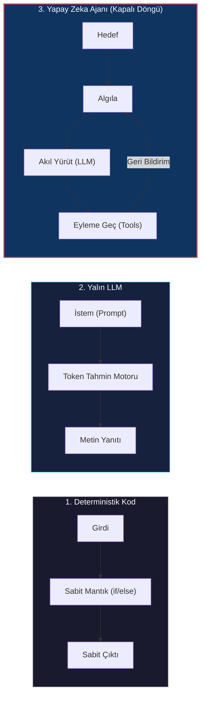
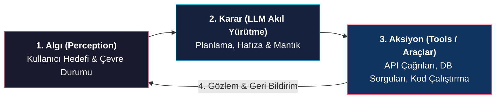

# AI Ajanlarına ve Otonom Sistemlere Giriş

<!-- toc -->

<br/>
<br/>

Bir **Yapay Zeka Ajanı (AI Agent)**; çevresini algılamak, bir akıl yürütme motoru (Büyük Dil Modeli / LLM) ile kararlar almak, dış araçları (tools) kullanarak eylemler gerçekleştirmek ve geri bildirimlerden öğrenerek belirli bir hedefe ulaşmak üzere tasarlanmış otonom bir yazılım sistemidir.

Ajanları kavramanın en doğrudan yolu; onları geleneksel deterministik yazılımlardan ve standart tek adımlı yapay zeka modellerinden ayıran sınırları incelemek, temel geri bildirim döngülerini anlamak ve klasik ajan taksonomisini öğrenmektir.

<br/>
<br/>

---

## 1. Yapay Zeka Ajanı Nedir? (Üç Temel Paradigma)

Modern yazılım dünyasını üç evrimsel kategoriye ayırabiliriz:

<br/>



<br/>

### 1.1 Deterministik Yazılım (Geleneksel Kod)
- Önceden yazılmış sabit kuralları (`if/else`, döngüler, SQL sorguları) harfiyen işletir.
- **Gündelik Benzetim:** Bir hesap makinesi. $2 + 2$ girdiğinde her zaman $4$ sonucunu verir. Geliştiricinin önceden kodlamadığı hiçbir durumu veya belirsizliği çözemez.

<br/>

### 1.2 Yalın LLM (Tek Adımlı İstatiksel Tamamlama)
- Girdi olarak verilen metne dayanarak bir sonraki en olası kelimeyi tahmin eden istatistiksel bir modeldir (örneğin standart ChatGPT promptu).
- **Gündelik Benzetim:** Çok bilgili fakat kolları-bacakları olmayan, canlı veritabanlarına erişemeyen ve konuşma bittiğinde her şeyi unutan bir danışman.
- **Kısıt:** Durumsuz (stateless) çalışır, gerçek dünyada doğrudan aksiyon alamaz ve dış doğrulama yapamadığı için halüsinasyon üretebilir.

<br/>

### 1.3 Yapay Zeka Ajanı (Otonom Kapalı Döngü Sistem)
- Bir LLM'in **hafıza (memory)**, **araçlar (tools)** ve sürekli bir **geri bildirim döngüsü (feedback loop)** ile donatılmış halidir.
- **Gündelik Benzetim:** Bir hata raporu (bug ticket) alan, repodaki dosyaları tarayan, kodu düzenleyen, testleri çalıştıran, hata çıktığında kodu düzelten ve işlem tamamlandığında Pull Request açan **otonom bir yazılım mühendisi**.
- **Süper Gücü:** **Kendi Kendini Düzeltme (Self-Correction)**. Bir işlem başarısız olduğunda hatayı bir gözlem olarak algılar ve farklı bir yöntem dener.

<br/>

### 1.4 Kapsamlı Karşılaştırma Tablosu

| Özellik | Deterministik Kod | Yalın LLM | Yapay Zeka Ajanı (AI Agent) |
| :--- | :--- | :--- | :--- |
| **Yürütme Modeli** | Sabit kod kuralları ve dallanmalar | Tek adımlı istatistiksel metin üretimi | Çok adımlı hedef odaklı otonom akış |
| **Çevre Etkileşimi** | Sabit API çağrıları | Yok (yalnızca metin çıktısı) | Dinamik araç seçimi ve çalıştırma |
| **Hafıza / Durum** | Veritabanı tabloları / değişkenler | Yalnızca anlık bağlam (tokens) | Kısa ve uzun vadeli bellek sistemleri |
| **Hata Yönetimi** | Çökme veya sabit `try/catch` | Halüsinasyon riski | Kendi kendine düşünme ve düzeltme |

<br/>
<br/>

---

## 2. Ajanın Algı-Karar-Aksiyon Geri Bildirim Döngüsü

Her yapay zeka ajanı kesintisiz bir kapalı döngü üzerinde çalışır: **Algı $\rightarrow$ Karar $\rightarrow$ Aksiyon $\rightarrow$ Gözlem**.

<br/>



<br/>

### 2.1 Pratik Örnek Senaryo: Otomatik Hata Çözücü Ajan (Bug Fixer Agent)

Bu döngünün pratikte nasıl çalıştığını somutlaştırmak için CI test hatasını çözen bir ajanı ele alalım:

1. **Algı (Observe):** Ajan CI/CD pipeline günlüğünü okur: `Test failed: IndexError in auth_service.py: line 42`.
2. **Düşün (Think):** LLM hata yığınını analiz eder: *"Dizinin sınır aşımı yapma nedenini anlamak için `auth_service.py` dosyasının 42. satır civarını okumam gerekiyor."*
3. **Eyleme Geç (Act):** `read_file(path="auth_service.py", start_line=35, end_line=50)` aracını çağırır.
4. **Gözlem (Feedback):** Araç kaynak kodu döner. LLM boş bir dizi için uzunluk kontrolü (`len == 0`) eksik olduğunu tespit eder.
5. **Döngü & Düzeltme:** Ajan planını günceller, `edit_file` ile yamayı uygular ve düzeltmeyi doğrulamak için `run_tests()` aracını çalıştırır.

> **Kritik Çıkarım:** Bir ajanı akıllı kılan şey modelin büyüklüğü değil, **geri bildirim döngüsüdür**. Yapılan eylemin sonucunu görüp rotayı düzeltebilme yeteneği otonom zekanın temelidir.

<br/>
<br/>

---

## 3. Russell & Norvig Taksonomisi: 5 Temel Ajan Türü

Klasik yapay zekada (Russell & Norvig), ajanlar karar verme mekanizmalarının gelişmişliğine göre 5 kategoriye ayrılır:

<br/>

### 3.1 Basit Refleks Ajanı (Simple Reflex Agent)
Yalnızca o anki girdiye bakar ve `EĞER-İSE` (IF-THEN) kurallarını uygular. Geçmiş hafızası yoktur.
- **Formül:** $a_t = f(o_t)$
- **Gerçek Dünya Örneği:** Sıcaklık $20^\circ\text{C}$ altına düştüğünde kombiyi çalıştıran akıllı termostat.

<br/>

### 3.2 Model Tabanlı Ajan (Model-Based Agent)
Dünyanın nasıl işlediğine ve daha önce nelerin gerçekleştiğine dair bir iç durum (dünya modeli / hafıza) tutar.
- **Formül:** $s_t = \mathcal{U}(s_{t-1}, a_{t-1}, o_t)$
- **Gerçek Dünya Örneği:** Evin neresini süpürdüğünü ve nerede engeller olduğunu hatırlayan haritalamalı robot süpürge.

<br/>

### 3.3 Hedef Odaklı Ajan (Goal-Based Agent)
Yalnızca mevcut duruma göre değil, ulaşılması gereken nihai bir hedef durumuna göre çoklu yolları değerlendirip plan yapar.
- **Formül:** $a_t = \arg\max_{a} \mathcal{P}(\text{Hedefe Ulaş} \mid s_t, a)$
- **Gerçek Dünya Örneği:** Belirlenen adrese en uygun rotayı hesaplayan GPS navigasyon cihazı.

<br/>

### 3.4 Fayda Odaklı Ajan (Utility-Based Agent)
Hedefe giden birden fazla yol olduğunda maliyet, hız ve kalite arasındaki ödünleşimleri (trade-offs) sayısal bir fayda fonksiyonu ($U$) ile dengeler.
- **Formül:** $U(a) = \mathbb{E} \left[ \alpha \cdot \text{Kalite}(a) - \beta \cdot \text{Maliyet}(a) - \gamma \cdot \text{Gecikme}(a) \right]$
- **Gerçek Dünya Örneği:** Düşük fiyat, kısa aktarma süresi ve yüksek havayolu puanını optimize ederek bilet seçen uçak rezervasyon ajanı.

<br/>

### 3.5 Öğrenen Ajan (Learning Agent)
Kendi operasyonel performansını izler, geri bildirim toplar ve geçmiş deneyimlerden ders çıkararak gelecekteki stratejilerini geliştirir.
- **Gerçek Dünya Örneği:** Geliştiricinin yaptığı düzeltmeleri analiz ederek aynı kodlama hatasını bir daha tekrarlamayan yapay zeka asistanı.

<br/>
<br/>

---

## 4. Kod Mimarisi: Deterministik Script vs. Otonom Ajan

Aşağıda hata durumlarında geleneksel bir script ile kendi kendini düzelten kapalı döngü bir ajanın Python üzerindeki farkı gösterilmektedir:

<br/>

```python
# ==========================================
# 1. Deterministik Script (Kırılgan)
# ==========================================
def deterministic_fetch(url: str):
    response = make_http_request(url)
    if response.status_code != 200:
        raise Exception("İstek başarısız oldu")  # Beklenmeyen durumda doğrudan çöker
    return response.json()


# ==========================================
# 2. Otonom Ajan Döngüsü (Kendi Kendini Düzelten)
# ==========================================
class SimpleAutonomousAgent:
    def __init__(self, llm_client, tools: dict, max_retries: int = 3):
        self.llm = llm_client
        self.tools = tools
        self.max_retries = max_retries
        self.history = []

    def solve_task(self, goal: str) -> str:
        self.history.append({"role": "user", "content": goal})

        for attempt in range(self.max_retries):
            # 1. DÜŞÜN: Bir sonraki adımı seç
            decision = self.llm.decide_action(self.history)
            if decision.is_final_answer:
                return decision.text_answer

            # 2. EYLEME GEÇ: Aracı çalıştır
            tool_name = decision.tool_name
            tool_args = decision.tool_args
            try:
                result = self.tools[tool_name](**tool_args)
            except Exception as error:
                result = f"Araç çalıştırma hatası: {str(error)}"

            # 3. GÖZLEMLE: Hatayı veya sonucu bir sonraki adım için hafızaya ekle
            self.history.append({
                "role": "observation",
                "action": tool_name,
                "result": result
            })

        return "Başarısız: İzin verilen maksimum deneme sayısı aşıldı."
```

<br/>
<br/>

---

## 5. Üretim Ortamı Güvenlik Bariyerleri (Safe Guardrails)

Otonom ajanları canlı sistemlere entegre ederken deterministik olmayan riskleri sınırlandırmak gerekir:

<br/>

```
┌────────────────────────────────────────────────────────────────────────┐
│                        AJAN GÜVENLİK BARİYERLERİ                       │
├────────────────────────┬───────────────────────┬───────────────────────┤
│    En Az Yetki (PoLP)  │    İzole Çalıştırma   │    İnsan Döngüde      │
│  Yalnızca görev için   │  Terminal komutlarını │  Para harcama/silmede │
│  gerekli API anahtarı  │  sandbox'ta çalıştır  │  insan onayı iste     │
└────────────────────────┴───────────────────────┴───────────────────────┘
```

<br/>

1. **En Az Yetki Prensibi (Least Privilege):** Ajanlara asla ana `.env` veya sınırsız yetkili root veritabanı şifresi verilmez; yalnızca ilgili iş için ayrılmış kısa ömürlü anahtarlar atanır.
2. **Patlama Alanı İzolasyonu (Blast Radius & Sandboxing):** Araçlar **Güvenli** (`dosya_oku`, `web_ara`) ve **Değiştirici** (`tablo_sil`, `prod_deploy`) olarak ayrılır. Değiştirici işlemler izole container sandboxing (Docker/gVisor) içinde yürütülür.
3. **İnsan Döngüde (Human-in-the-Loop - HITL):** Geri dönüşü olmayan kritik eylemlerde (ödeme yapma, e-posta gönderme, veri tabanı silme) ajan insan onayı almadan ilerleyemez.
4. **Devre Kesiciler (Circuit Breakers):** Ajanın sonsuz döngüye girip kontrolsüz token harcamasını önlemek için adım sınırı ($\text{maks\\_adım} = 10$) ve zaman aşımı uygulanır.

<br/>
<br/>

---

## 6. Özet ve Temel Çıkarımlar

1. **Kod vs LLM vs Ajan:** Kod kuralları uygular, LLM metin tahmin eder, Ajan ise hafıza ve araçlarla hedefe ulaşmak için kapalı bir döngü işletir.
2. **Temel Döngü:** $\text{Algı} \rightarrow \text{Karar} \rightarrow \text{Aksiyon} \rightarrow \text{Gözlem}$.
3. **Kendi Kendini Düzeltme:** Hatalar birer engel değil, bir sonraki eylemi yönlendiren geri bildirimlerdir.
4. **Önce Güvenlik:** Limitler, en az yetki ve insan onayı olmadan hiçbir otonom ajan canlıya alınmamalıdır.
