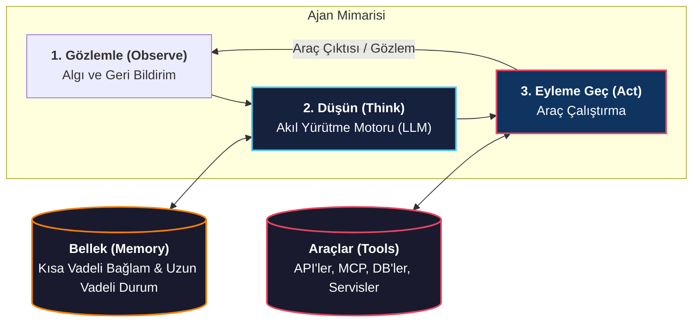
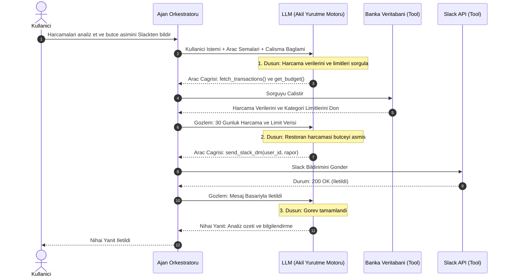

# Ajan Zihniyeti: LLM'ler, Araçlar ve Bellek

<!-- toc -->

<br/>
<br/>

Bir Yapay Zeka Ajanı (AI Agent), yalnızca metin üreten bir Büyük Dil Modelinden (LLM) ibaret değildir. Ajan; bir **Akıl Yürütme Motoru (LLM / Beyin)**, dış dünya ile etkileşimi sağlayan **Araçlar (Tools / Kollar & Bacaklar)** ve durumu koruyan **Bellek (Memory)** bileşenlerini kesintisiz bir **Observe $\rightarrow$ Think $\rightarrow$ Act** döngüsü içinde birleştiren otonom bir sistemdir.

Bu derste bu üç temel bileşenin nasıl çalıştığını, canlı bir finans ve Slack asistanı senaryosu üzerinden adım adım nasıl işlediğini, Python kod mimarisini ve üretim seviyesi güvenlik risklerini ele alıyoruz.

<br/>
<br/>

---

## 1. Bir Yapay Zeka Ajanının Üç Temel Sütunu

Otonom bir ajan mimarisi üç ana parçadan oluşur:

<br/>



<br/>

### 1.1 Büyük Dil Modelinin Rolü (Beyin / Akıl Yürütme Motoru)
- LLM sistemin karar vericisi ve orkestratörüdür.
- Kullanıcının niyetini anlar, karmaşık hedefleri alt görevlere böler (task decomposition), hangi aracın ne zaman çağrılacağına karar verir ve dönen gözlemleri sentezler.

<br/>

### 1.2 Araçlar ve Dış Dünya Yetenekleri (Kollar & Bacaklar)
- LLM'ler salt metin üretir ve eğitim verisi kesim tarihiyle sınırlıdır. **Araçlar (Tools)** ise onlara gerçek dünyada işlem yapabilme yeteneği (kolları ve bacakları) kazandırır.
- Araçlar ajanı API'lere, veritabanlarına, MCP (Model Context Protocol) sunucularına veya kod çalıştırma ortamlarına bağlar.
- LLM yapılandırılmış fonksiyon çağrıları (JSON Function Call) üretir, çalışma ortamı (runtime) bu çağrıyı gerçek serviste yürütür.

<br/>
<br/>

### 1.3 Bellek ve Durum Yönetimi (Memory & State)
- **Kısa Vadeli Bellek (Çalışma Bağlamı):** O anki konuşma geçmişi, adım adım ara düşünceler ve araç yanıtlarının LLM'in bağlam penceresinde (context window) tutulmasıdır.
- **Uzun Vadeli Bellek (Kalıcı Durum):** Oturumlar arasında saklanan kullanıcı tercihleri, kurallar ve vektör veritabanları (RAG) veya Key-Value depolarında tutulan geçmiş deneyimlerdir.

<br/>
<br/>

---

## 2. Pratik Örnek Olay: Kişisel Finans ve Slack Ajanı

Observe-Think-Act döngüsünü somutlaştırmak için ele aldığımız gerçek dünya senaryosu:

> **Kullanıcı İstemi:** *"Son 1 aydaki harcamalarımı analiz et. Eğer bütçemi aşan bir kalem varsa bunu bana Slack'ten bir özet ve tasarruf planıyla bildir."*

<br/>

### 2.1 Adım Adım Yürütme Akışı (Sequence Diagram)



<br/>

### 2.2 Kritik Ayrım: Araç (Tool) vs. Bellek (Memory)

| Boyut | Araç (`fetch_transactions`, `send_slack_dm`) | Bellek (Kısa / Uzun Vadeli) |
| :--- | :--- | :--- |
| **Görevi** | Dış sistemlerle canlı etkileşim kurmak ve eylem gerçekleştirmek | Durumu, tercihleri ve bağlamı adımlar boyunca korumak |
| **Senaryodaki Yeri** | Canlı banka verisini çekmek; Slack DM göndermek | Kullanıcının harcama toleransını ve iletişim tercihlerini hatırlamak |
| **Kalıcılık** | Çağrı bazlı anlık yürütme | Döngü içinde (Kısa Vadeli) veya oturumlar arası (Uzun Vadeli) saklama |

<br/>
<br/>

---

## 3. Çekirdek Ajan Döngüsü: Python Uygulaması

Bir ajan platformu arka planda temel olarak adım sınırları, hata yakalama mekanizmaları ve mesaj geçmişi yönetimi içeren şu yürütme döngüsünü çalıştırır:

<br/>

```python
import json
from typing import Any, Callable, Dict, List

class ProductionAgent:
    """Observe-Think-Act döngüsünü işleten minimal ve üretime hazır Ajan Orkestratörü."""
    
    def __init__(self, llm_client, tools: Dict[str, Callable], max_iterations: int = 5):
        self.llm = llm_client
        self.tools = tools
        self.max_iterations = max_iterations
        self.messages: List[Dict[str, Any]] = []  # Kısa Vadeli Bellek (Bağlam)

    def run(self, user_goal: str) -> str:
        # 1. OBSERVE (Gözlemle): Kullanıcı hedefini çalışma bağlamına ekle
        self.messages.append({"role": "user", "content": user_goal})
        
        for iteration in range(self.max_iterations):
            # 2. THINK (Düşün): LLM'den akıl yürütüp bir sonraki adımı seçmesini iste
            response = self.llm.generate_step(
                messages=self.messages, 
                tools=self.get_tool_schemas()
            )
            
            # Eğer model yeni bir araç çağırmak istemiyorsa nihai cevaba ulaşılmıştır
            if not response.tool_calls:
                return response.content

            # 3. ACT (Eyleme Geç): Talep edilen araçları güvenlik sınırları içinde çalıştır
            for tool_call in response.tool_calls:
                tool_name = tool_call.name
                tool_args = tool_call.arguments
                
                # Yetkilendirme ve araç varlık kontrolü
                if tool_name not in self.tools:
                    tool_result = f"Hata: '{tool_name}' aracı yetkisiz veya bulunamadı."
                else:
                    try:
                        # Korumalı alanda çalıştırma
                        tool_result = self.tools[tool_name](**tool_args)
                    except Exception as e:
                        tool_result = f"Araç Çalıştırma Hatası: {str(e)}"

                # 4. OBSERVE (Gözlemle): Araç sonucunu çalışma belleğine geri ekle
                self.messages.append({
                    "role": "tool",
                    "tool_call_id": tool_call.id,
                    "content": json.dumps(tool_result) if not isinstance(tool_result, str) else tool_result
                })

        return "Hata: Maksimum adım sayısına (max_iterations) ulaşıldı (Devre Kesici tetiklendi)."
```

<br/>
<br/>

---

## 4. Üretim Seviyesi Güvenlik Riskleri ve Savunma Stratejileri

Otonom bir ajana araç ve hassas veri erişimi verildiğinde aşağıdaki kritik güvenlik riskleri ortaya çıkar:

<br/>

### 4.1 Veri Sızıntısı ve Yetki Sınırları (PII & Kanal İhlali)
- **Risk:** Ajanın kişisel harcama veya bütçe verilerini Slack'te yanlış bir kanala (örneğin özel mesaj yerine `#genel` kanalına) veya yanlış bir kişiye iletmesi.
- **Savunma:** Araç katmanında **Alıcı Beyaz Listesi (Recipient Whitelisting)** ve sıkı RBAC uygulanmalıdır. Araç, LLM talimatı ne olursa olsun yetkisiz hedef kanalları reddetmelidir.

<br/>

### 4.2 Bağlam Şişmesi (Context Window Bloat)
- **Risk:** Binlerce satırlık ham harcama verisinin doğrudan bağlama eklenmesi token maliyetini fırlatır ve modelin dikkatini dağıtır ("lost in the middle").
- **Savunma:** Araç yanıtları bağlama eklenmeden önce veritabanı seviyesinde filtrelenmeli veya özetleme/toplama (aggregation) katmanından geçirilmelidir.

<br/>

### 4.3 Geri Alınamaz Eylemler ve İnsan Onayı (HITL)
- **Risk:** Para transferi, kayıt silme veya müşterilere e-posta atma gibi yan etkili (side-effect) eylemlerin model hatasıyla yanlış yapılması durumunda geri dönüşü yoktur.
- **Savunma:** Yüksek etkili araçlar öncesinde yürütmeyi durduran zorunlu bir **İnsan Onayı Kapısı (Human-in-the-Loop - HITL)** entegre edilmelidir.

<br/>
<br/>

---

## 5. Özet ve Kritik Çıkarımlar

1. **Akıl Yürütme Motoru Olarak LLM:** LLM salt metin tamamlayıcısı değildir; planlama, araç orkestrasyonu ve hata telafisini yönetir.
2. **Araçlar vs. Bellek:** Araçlar dış dünyayla canlı veri alışverişi ve aksiyon sağlar; Bellek durum ve kullanıcı tercihlerini korur.
3. **Ajan Döngüsü:** Ajanlar hedefe ulaşana veya devre kesici devreye girene kadar **Observe $\rightarrow$ Think $\rightarrow$ Act $\rightarrow$ Observe** döngüsünü işletir.
4. **Savunmacı Mimari:** Alıcı doğrulaması, bağlam sıkıştırma, adım limitleri ve insan onayı kapıları güvenli bir üretim ortamı için zorunludur.
