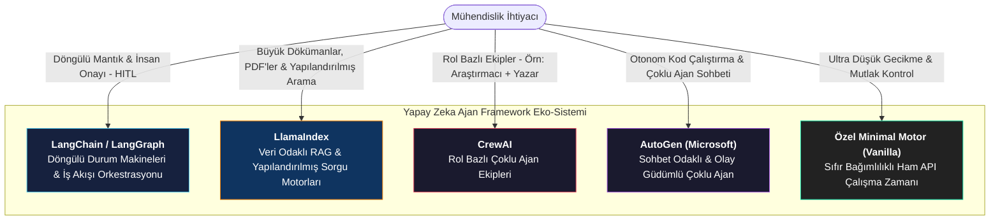
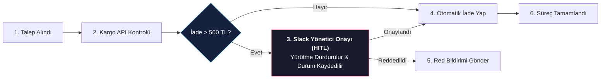

# Popüler Yapay Zeka Ajan Framework'leri

<!-- toc -->

<br/>
<br/>

Temel Observe $\rightarrow$ Think $\rightarrow$ Act döngüsü sıfırdan yazılabilse de, modern yazılım geliştirmede prototiplemeyi hızlandırmak ve karmaşık iş akışlarını yönetmek için özelleşmiş framework'ler kullanılır. Ancak her framework farklı bir mimari felsefe ve ödünleşim (trade-off) üzerine kurulmuştur.

Bu derste önde gelen ajan framework'lerini (**LangChain / LangGraph, LlamaIndex, CrewAI, AutoGen**), somut örnek olaylar üzerinden inceleyecek, kod kalıplarını karşılaştıracak ve kurumsal mimariler için bir framework seçim karar ağacı oluşturacağız.

<br/>
<br/>

---

## 1. Framework Eko-Sistemi

Ajan framework'leri; prompt şablonlama, araç şeması üretimi, bellek yönetimi ve çoklu ajan koordinasyonu gibi tekrarlayan yapı taşlarını standartlaştırmak için geliştirilmiştir.

<br/>



<br/>
<br/>

---

## 2. Framework Karşılaştırma Matrisi

| Framework | Birincil Gücü (Superpower) | Temel Kısıtı | İdeal Kullanım Senaryosu |
| :--- | :--- | :--- | :--- |
| **LangGraph / LangChain** | Döngülü durum çizgeleri (cyclic graphs), time-travel debugging, dahili İnsan Onayı (HITL) | Fazla soyutlama katmanı (bloat), dik öğrenme eğrisi | Kurumsal durum makineleri, karmaşık karar ağaçları ve çok adımlı iş akışları |
| **LlamaIndex** | Hiyerarşik döküman ayrıştırma, hibrit arama (BM25 + Vektör), kesin sayfa atıfları | Veri dışı karmaşık iş akışı orkestrasyonunda sınırlılık | Döküman arama, hukuk sözleşmesi analizi ve kurumsal RAG sistemleri |
| **CrewAI** | Rol bazlı sezgisel görev dağılımı (Yönetici $\rightarrow$ Çalışan hiyerarşisi) | LangChain'e sıkı bağımlılık; deterministik kontrol zorluğu | İş birlikçi araştırma, içerik üretimi ve çok rollü ekip simülasyonları |
| **AutoGen** | Dinamik ajandan ajana sohbet, kod üretme ve sandbox ortamında çalıştırma | Durum yönetimi ve canlı ortam (production) hata ayıklama zorluğu | Otonom yazılım mühendisliği, otomatik veri bilimi analiz hatları |
| **Özel Minimal Motor** | Sıfır bağımlılık, tam şeffaflık, minimum gecikme, anında hata ayıklama | Bellek, retry ve araç şemalarını manuel yazma eforu | Yüksek hacimli backend mikroservisleri ve kritik API sistemleri |

<br/>
<br/>

---

## 3. İki Temel Mimari Paradigmanın Karşılaştırması

<br/>

### 3.1 Veri Odaklı Ajanlar: LlamaIndex (Örnek Olay: Hukuk Sözleşmesi Analizi)

> **Senaryo:** Bir hukuk bürosu; 100.000 sayfalık sözleşme havuzunu tarayan, çelişkili maddeleri tespit eden ve sıfır halüsinasyonla kesin sayfa/madde referansları veren bir yapay zeka asistanına ihtiyaç duyuyor.

**Neden LlamaIndex doğru seçimdir?**
1. **Hiyerarşik İndeksleme:** Devasa PDF havuzunu zengin metadatalarla (sözleşme tarihi, taraf, madde türü) yapılandırılmış düğümlere (nodes) böler.
2. **Hibrit Arama ve Yeniden Sıralama (Reranking):** Anlamsal vektör aramasını anahtar kelime (BM25) araması ve reranker modelleriyle birleştirerek kesin madde eşleşmesini garantiler.
3. **Sayfa Atıfları (Citations):** Denetlenebilirlik için her cümlenin hangi kaynak düğümden ve sayfadan geldiğini açıkça belirtir.

```python
from llama_index.core import VectorStoreIndex, SimpleDirectoryReader
from llama_index.core.tools import QueryEngineTool

# 1. Döküman havuzunu oku ve hiyerarşik olarak indeksle
documents = SimpleDirectoryReader("contracts/").load_data()
index = VectorStoreIndex.from_documents(documents)
query_engine = index.as_query_engine(similarity_top_k=5)

# 2. Sorgu Motorunu bir Ajan Aracı (Tool) olarak paketle
legal_search_tool = QueryEngineTool.from_defaults(
    query_engine=query_engine,
    name="legal_contract_search",
    description="100.000 sayfalık sözleşme havuzunda arama yapar ve doğrulanmış maddeleri sayfa atıflarıyla döner."
)
```

<br/>

### 3.2 Süreç ve Durum Odaklı Ajanlar: LangGraph (Örnek Olay: E-Ticaret İade Akışı)

> **Senaryo:** Bir e-ticaret platformu; kullanıcı iade talebini alan, kargo teslimat API'sini kontrol eden, iade tutarını değerlendiren ve 500 TL üzeri iadelerde Slack üzerinden insan yöneticisinden onay isteyen bir iade ajanı gerektiriyor.

**Neden LangGraph doğru seçimdir?**
1. **Durum Makinesi Çizgesi (State Graph):** Net düğümler (`CheckCourier`, `EvaluateAmount`, `ProcessRefund`) ve koşullu kenarlar (conditional edges) ile çalışır.
2. **İnsan Onayı (HITL) Checkpointing:** Yönetici onayı gerektiğinde ajanın yürütmesini durdurup durumunu veritabanına kaydeder, webhook çağrısı geldiğinde kaldığı yerden devam eder.

<br/>



<br/>
<br/>

---

## 4. Mimari Karar Ağacı: Hangi Projede Hangi Framework?

Yeni bir ajan mimarisi tasarlarken aşağıdaki karar ağacı takip edilmelidir:

<br/>

```
                                [Yeni Bir Ajan Projesi]
                                           │
              ┌────────────────────────────┴────────────────────────────┐
      [Veri / Döküman Ağırlıklı mı?]                            [Süreç / İş Akışı Ağırlıklı mı?]
              │                                                         │
      ┌───────┴───────┐                                         ┌───────┴───────┐
  [Basit Arama]  [Karmaşık RAG/PDF]                         [Döngülü & HITL]  [Çoklu Rol / Simülasyon]
      │               │                                         │                     │
  (LangChain)   (LlamaIndex)                               (LangGraph)         (CrewAI / AutoGen)
```

<br/>
<br/>

---

## 5. Üretim Seviyesi Ödünleşimler & Staff Engineer Çıkarımları

1. **Soyutlama Tuzağı (The Abstraction Trap):** Tek satırlık yardımcı fonksiyonlar (`agent.run()`) token tüketimini ve prompt yapısını gizler. Üretim ortamlarında sihirli tek satırlar yerine açık çizge düğümleri veya saf araç sevk mekanizmaları tercih edilmelidir.
2. **Hibrit Mimari:** Kurumsal sistemlerde genellikle tek bir framework kullanılmaz. En yaygın başarılı model; **LlamaIndex**'in veri getirme/RAG motoru olarak, **LangGraph**'ın ise karar ve durum makinesi orkestratörü olarak birlikte kullanılmasıdır.
3. **Ne Zaman Sıfırdan Kod Yazılmalı?:** Ajan yalnızca 2–3 deterministik API aracı ve temel bellek gerektiriyorsa, Day 02'de geliştirdiğimiz gibi harici bağımlılığı olmayan minimal bir Python sınıfı yazmak sistem kararlılığını artırır ve kütüphane kırılmalarını önler.

<br/>
<br/>

---

## 6. Özet ve Temel Çıkarımlar

1. **Felsefe Ayrımı:** LlamaIndex **Veri ve Erişime**; LangGraph **Durum ve Döngülü İş Akışlarına**; CrewAI/AutoGen ise **Çoklu Ajan İş Birliğine** odaklanır.
2. **Veri Odaklı vs. Durum Odaklı:** Döküman ağırlıklı problemleri RAG motorlarıyla, karar ve onay ağırlıklı süreçleri durum çizgeleriyle çözün.
3. **Gümüş Kurşun Yoktur:** Gerektiğinde hibrit mimarileri kullanın; ultra düşük gecikme ve mutlak şeffaflık gerektiğinde ise doğrudan yalın (custom) çalışma zamanlarına yönelin.
