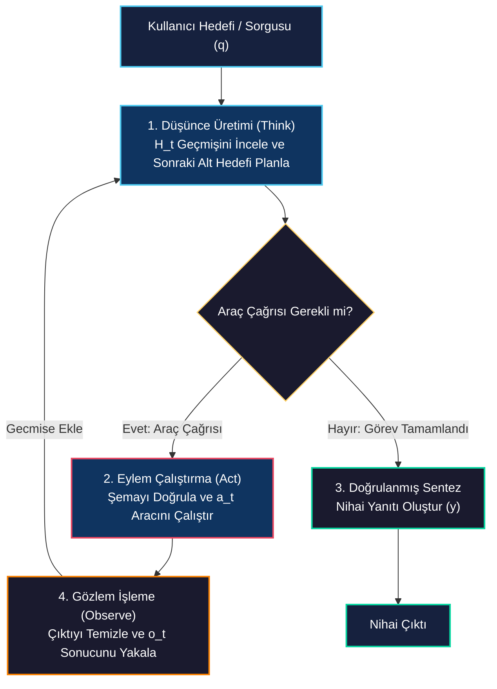
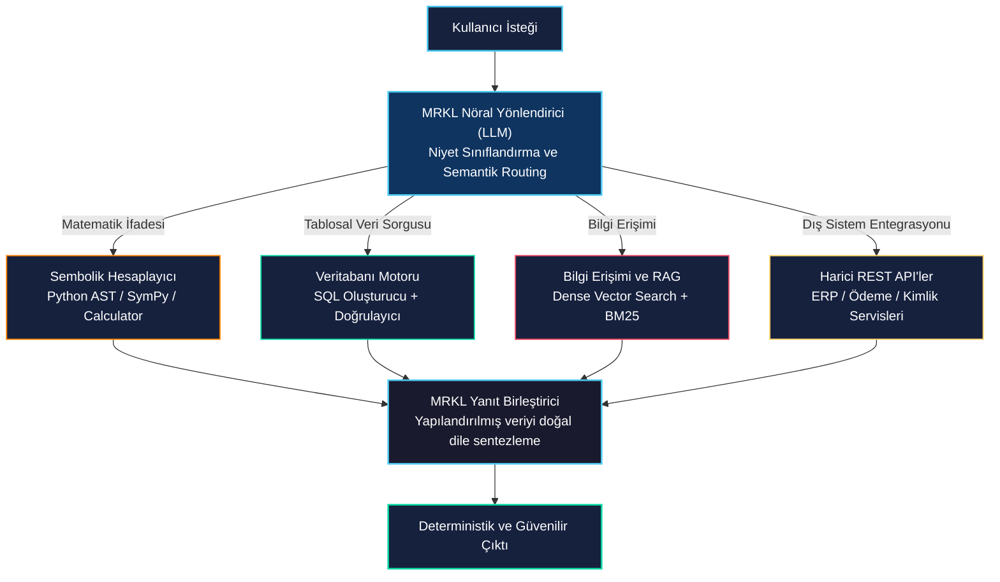
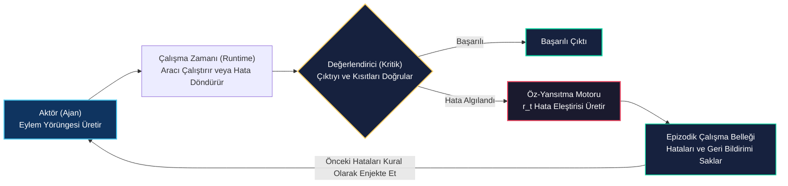

# Ajan Mimarisi: ReAct, MRKL ve Kendi Kendini Düzeltme

<!-- toc -->

<br/>
<br/>

Statik dil modeli çıkarımından otonom sistemlere geçiş sürecinde, ajanın **mimarisi**; problemleri ne kadar etkili ayrıştırdığını, eylemleri nasıl seçtiğini, çevresel geri bildirimleri nasıl yorumladığını ve çalışma zamanı hatalarını nasıl telafi ettiğini belirler. Deterministik olmayan API yanıtları, şema uyumsuzlukları veya çok adımlı mantıksal zincirlerle karşılaşıldığında basit prompting yöntemleri hızla çöker.

Bu bölümde, üretim seviyesindeki (*production-grade*) otonom sistemleri güçlendiren üç temel mimari deseni inceliyoruz: **ReAct** (*Reason + Act*), **MRKL** (*Modular Reasoning, Knowledge, and Language*) ve **Kendi Kendini Düzeltme / Reflexion** geri bildirim döngüleri. Bu desenlerin matematiksel modellerini, yürütme akış şemalarını, hata kurtarma mekanizmalarını ve dinamik şema onarımı içeren temsili ve özlü Python uygulamasını ele alıyoruz.

<br/>
<br/>

---

## 1. Ajan Akıl Yürütmesinin Evrimi

Yapılandırılmış mimariler geliştirilmeden önce, LLM orkestrasyonu iki uç paradigmaya dayanıyordu: yalnızca bilişsel akıl yürütme (*Chain-of-Thought*) veya doğrudan fonksiyonel araç çalıştırma (*Action-only*). Dinamik ortamlarda her iki yaklaşım da yapısal kırılganlıklara sahiptir.

<br/>


<br/>

### 1.1 Chain-of-Thought (CoT) ve Action-Only Kırılganlıkları

1. **Chain-of-Thought (Sadece Akıl Yürütme):** Dış dünya ile etkileşime girmeden içsel düşünce adımları üretir. Kapalı sembolik problemlerde başarılı olsa da, canlı durumları sorgulayamaz ve kısıtları doğrulayamaz; bu da **olgusal halüsinasyona** yol açar.
2. **Action-Only (Doğrudan Eylem):** Açık bir akıl yürütme scratchpad'i (karalama alanı) tutmaksızın doğrudan API çağrıları fırlatır. Durum ayrıştırma ve alt hedef takip yeteneği zayıf olduğu için araç çıktıları belirsiz veya hatalı olduğunda çöker.
3. **ReAct Paradigması:** Dilsel akıl yürütme adımlarını (*"Bir sonraki adımda neyi öğrenmem gerekiyor?"*) somut ortam etkileşimleriyle (*"Search(q) fonksiyonunu çağır"*) ardışık olarak birleştirir; gelen gözlemi bir sonraki adımın bilişsel durumunu güncellemek için kullanır.

<br/>
<br/>

---

## 2. ReAct (Reason + Act) Mimarisi

*Yao ve ark. (2022)* tarafından tanıtılan **ReAct**, dil modelinin akıl yürütme gücünü eylem çalıştırma döngüsüyle birleştirir. Akıl yürütme izleri ajanın eylem planlarını takip etmesini ve güncellemesini sağlarken, eylemler ajanın harici bilgi tabanları ve yazılım ortamlarıyla arayüz kurmasına olanak tanır.

<br/>

### 2.1 Matematiksel Formülasyon

Ajanın görevi ayrık zaman adımları $t \in \lbrace 1, 2, \dots, T \rbrace$ üzerinde tanımlansın. Her $t$ adımında ajan o ana kadarki çalışma geçmişini alır:

$$
H_t = \left( q, t_1, a_1, o_1, t_2, a_2, o_2, \dots, t_{t-1}, a_{t-1}, o_{t-1} \right)
$$

Burada:
* $q$: Kullanıcı hedefi / başlangıç sorgusu.
* $t_i \in \mathcal{T}$: Düşünce uzayından üretilen akıl yürütme veya alt plan izi.
* $a_i \in \mathcal{A}$: Araç eylem uzayından $\mathcal{A} = \mathcal{A}_{\text{tools}} \cup \lbrace \text{finish} \rbrace$ seçilen somut eylem.
* $o_i \in \mathcal{O}$: Eylem $a_i$ çalıştırıldıktan sonra ortamın döndürdüğü gözlem çıktısı.

<br/>

Ajanın politikası $\pi_\theta$, geçmişe $H_t$ koşullu olarak akıl yürütme ve eylem seçimini ardışık yürütür:

$$
t_t \sim \pi_\theta(\cdot \mid H_t)
$$

$$
a_t \sim \pi_\theta(\cdot \mid H_t, t_t)
$$

$$
o_t = \mathcal{E}(a_t)
$$

$$
H_{t+1} = H_t \circ (t_t, a_t, o_t)
$$

Döngü $a_t = \text{finish}(y)$ durumuna ulaştığında sonlanır; burada $y$, tüm gözlem yörüngesine $\mathcal{O}_{1:t}$ dayanan nihai sentezlenmiş cevaptır.

<br/>

### 2.2 ReAct Yürütme Döngüsü Akış Şeması

<br/>



<br/>

> **Kritik İçgörü:** $t_t$ düşünce adımları dış ortamı doğrudan değiştirmez; modelin çalışma belleğidir (*scratchpad*). Bu ara adımlar, sonraki eylemin arama uzayını daraltır ve eylem seçimindeki hatayı minimize eder.

<br/>
<br/>

---

## 3. MRKL (Modular Reasoning, Knowledge, and Language) Mimarisi

*AI21 Labs (Karpas ve ark.)* tarafından önerilen **MRKL**, nöro-sembolik bir mimaridir. Temel varsayımı şudur: Büyük dil modelleri aritmetik hesaplama, SQL sorgusu veya katı kural tabanlı mantık işletimini dahili ağırlıklarıyla yapmamalıdır; bunun yerine LLM, görevleri özelleşmiş sembolik uzman modüllere yönlendiren **merkezi bir bilişsel yönlendirici (router)** olarak çalışmalıdır.

<br/>



<br/>

### 3.1 MRKL vs. ReAct: Mimari Karşılaştırma

| Boyut / Kriter | ReAct Mimarisi | MRKL Mimarisi |
| :--- | :--- | :--- |
| **Temel Felsefe** | Dinamik, açık uçlu akıl yürütme ve yinelemeli keşif | Özelleşmiş deterministik uzman modüllere nöro-sembolik delegasyon |
| **Yönlendirme Deseni** | Otonom döngü: Model her $t$ adımında sonraki aracı dinamik seçer | Hiyerarşik yönlendirici: Router doğrudan hedef uzman modülü seçer |
| **Hata Yönetimi** | Gözlem geri bildirimiyle dinamik yeniden istem (re-prompting) | Modül bazlı kural kontrolleri ve açık şema doğrulama mekanizmaları |
| **En Uygun Senaryo** | Derin araştırma, serbest hata ayıklama, çok adımlı web aramaları | Kurumsal ERP/CRM, SQL analitiği, kesin finansal hesaplamalar |

<br/>
<br/>

---

## 4. Kendi Kendini Düzeltme (Self-Correction) ve Reflexion Mekanizmaları

Üretim ortamındaki otonom ajanlar; runtime istisnaları, JSON parse hataları ve şema ihlalleri ile karşılaşırlar. **Self-Correction (Kendi Kendini Düzeltme)**, ajanın karşılaştığı hatayı çalışma ortamını çökertmeden yakalaması, hata nedenini analiz etmesi ve yeni bir denemeyle hatayı telafi etmesidir.

<br/>

### 4.1 Taxonomy of Agent Runtime Failures (Hata Sınıflandırması)

```
                    ┌──────────────────────────────────────────────┐
                    │            Agent Failure Taxonomy            │
                    └──────────────────────┬───────────────────────┘
                                           │
         ┌─────────────────────────────────┼─────────────────────────────────┐
         ▼                                 ▼                                 ▼
┌───────────────────┐             ┌───────────────────┐             ┌───────────────────┐
│   Syntax & Schema │             │ Environmental &   │             │ Semantic & Logic  │
│   Validation      │             │ System Failures   │             │ Deadlocks         │
├───────────────────┤             ├───────────────────┤             ├───────────────────┤
│ • Invalid JSON    │             │ • Rate limit (429)│             │ • Infinite loop   │
│ • Missing params  │             │ • 500 Server Error│             │ • Hallucinated tool│
│ • Wrong type cast │             │ • Network Timeout │             │ • Contradiction   │
└───────────────────┘             └───────────────────┘             └───────────────────┘
```

<br/>

### 4.2 Reflexion Kapalı Döngü Mimarisi

*Shinn ve ark. (2023)* tarafından tanıtılan **Reflexion**, ajanları dinamik hafıza ve öz-yansıtma yetenekleriyle donatır. Model ağırlıklarını $\theta$ güncellemek yerine, ajan başarısız yörüngesinin dilsel bir eleştirisini $r_t \in \mathcal{R}$ üreterek bunu epizodik belleğe kaydeder.

<br/>



<br/>

### 4.3 Algoritmik Hata Kurtarma Formülasyonu

Bir araç çalıştırması $a_t = (m, p)$ başarısız olduğunda:

1. **İstisna Yakalama (Catch & Guard):** Ajan runtime'ı $e_t$ hatasını yakalar ve çöküşü engeller.
2. **Hata Serileştirme:** Ham hata yığını temizlenip yapılandırılmış bir gözleme dönüştürülür:
   $$
   o_t = \text{HataFormati}(\text{tip}(e_t), \text{mesaj}(e_t), \text{sema}(m))
   $$
3. **Reflexive İstemi:** Gözlem $H_{t+1}$ geçmişine eklenerek modelden hatayı onarması istenir:
   $$
   t_{t+1} \sim \pi_\theta(\cdot \mid H_t, a_t, o_t, \text{ReflexionIstemi})
   $$

<br/>
<br/>

---

## 5. Temsili Uygulama: Kendi Kendini Onaran ReAct Motoru

Aşağıda **ReAct döngüsünü**, **Pydantic şema doğrulamasını** ve **hata yakalama ile kendi kendini düzeltme (self-healing) mekanizmasını** gösteren temiz ve temsili Python kodu yer almaktadır:

<br/>

```python
from typing import Callable, Dict, Any
from pydantic import BaseModel, Field, ValidationError

class Tool(BaseModel):
    name: str
    description: str
    schema_model: type[BaseModel]
    handler: Callable[..., str]

    def execute(self, payload: Dict[str, Any]) -> str:
        # 1. Adım: Katı girdi şema doğrulaması
        validated = self.schema_model(**payload)
        return self.handler(**validated.model_dump())


class ReActRuntime:
    """Devre kesici (circuit breaker) ve hata telafisi içeren yürütme motoru."""
    def __init__(self, tools: Dict[str, Tool], max_iterations: int = 5):
        self.tools = tools
        self.max_iterations = max_iterations

    def run_loop(self, goal: str, llm_step_fn: Callable[[str], str]) -> str:
        scratchpad = f"Goal: {goal}\n"

        for step in range(1, self.max_iterations + 1):
            # 1. LLM'den Düşünce ve Eylem üret
            step_output = llm_step_fn(scratchpad)
            
            if "Final Answer:" in step_output:
                return step_output.split("Final Answer:")[-1].strip()

            # 2. Araç adı ve parametreleri ayrıştır
            tool_name, params = self._parse_action(step_output)

            # 3. Kendi Kendini Düzeltme (Self-Correction) Geri Bildirimiyle Güvenli Çalıştırma
            if tool_name not in self.tools:
                obs = f"Observation: Error: Tool '{tool_name}' bulunamadı. Mevcut: {list(self.tools.keys())}"
            else:
                try:
                    res = self.tools[tool_name].execute(params)
                    obs = f"Observation: {res}"
                except ValidationError as ve:
                    obs = f"Observation: SchemaValidationError: {ve.errors()}"
                except Exception as e:
                    obs = f"Observation: ExecutionError: {type(e).__name__}: {str(e)}"

            # 4. Sonraki adım için karalama defterine (scratchpad) geri bildirim ekle
            scratchpad += f"{step_output}\n{obs}\n"

        raise RuntimeError("CircuitBreaker: Maksimum adım sınırı aşıldı.")

    def _parse_action(self, text: str) -> tuple[str, Dict[str, Any]]:
        # Araç adını ve JSON argümanlarını çıkaran temsili ayrıştırıcı
        ...
```

<br/>
<br/>

---

## 6. Mimari Karşılaştırma ve Üretim Kriterleri

<br/>

| Mimari | Güçlü Yönleri | Zayıflıkları / Limitleri | En Uygun Üretim Senaryosu |
| :--- | :--- | :--- | :--- |
| **ReAct** | Yüksek uyarlanabilirlik; şeffaf düşünce izi; sürekli gerçek dünya verisiyle doğrulama. | Yüksek token tüketimi; devre kesici (circuit breaker) yoksa sonsuz döngü riski. | Canlı araştırma asistanları, hata ayıklama botları, web gezginleri. |
| **MRKL** | Deterministik güvenilirlik; katı şema uyumu; hesaplamayı harici motorlara devretme. | Yeni/öngörülmemiş senaryolara daha az esnek; her uzman araç için ayrı mühendislik gerektirir. | Kurumsal ERP/CRM analitiği, SQL sorgulama sistemleri, finansal hesaplayıcılar. |
| **Plan-and-Solve** | Görevi baştan DAG alt görevlerine böler; paralel araç çalıştırmayı mümkün kılar. | Ara adımlardan biri başarısız olduğunda dinamik yeniden planlama yapılmazsa kırılgandır. | Toplu veri işleme (ETL), statik kod üretim ardışık düzenleri. |
| **Reflexion** | Başarısızlıklardan epizodik hafıza ile ders çıkarır; insan müdahalesi olmadan kendini onarır. | Çıkarım maliyetini ve gecikmeyi artırır; güçlü bir değerlendirici (critic) sinyali gerektirir. | Otomatik test onarımı, kod üretimi, kendi kendini iyileştiren scraper'lar. |

<br/>
<br/>

---

## 7. Özet Çıkarımlar

1. **ReAct bilişsel planlama ile ortam durumunu birleştirir:** $t_t$ (düşünceler) ve $a_t$ (eylemler) arasındaki döngü, hem CoT'un kör halüsinasyonlarını hem de Action-only modellerin kör yürütme hatalarını engeller.
2. **Deterministik görevler sembolik modüllere aittir:** MRKL felsefesi uyarınca dil modelleri aritmetik yapmamalı veya SQL sorgularını akıldan çalıştırmamalı; akıllı bir yönlendirici (router) olarak çalışmalıdır.
3. **Kendi kendini düzeltme yapılandırılmış geri bildirim gerektirir:** İstisnaları yakalayıp şema ipuçlarıyla birlikte modelin gözlem geçmişine eklemek, çalışma zamanı çökmelerini kendi kendini onaran sistemlere dönüştürür.
