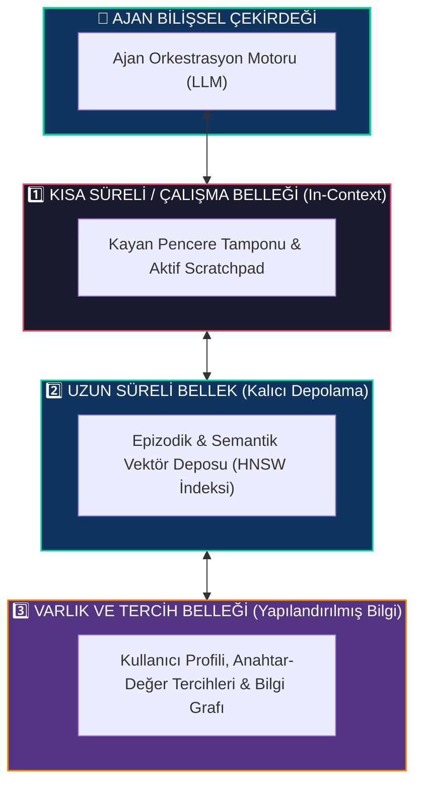
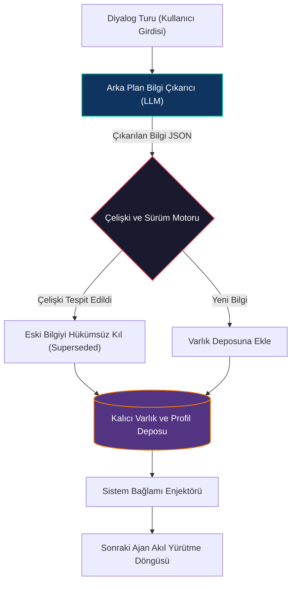

# Ajanlarda Bellek ve Durum Yönetimi

<!-- toc -->

<br/>
<br/>

Büyük dil modelleri (LLM) durumsuz (stateless) matematiksel fonksiyonlar olarak çalışır: her ileri çıkarım adımı, bir girdi token dizisini bir çıktı olasılık dağılımına dönüştürür ve çağrılar arasında dahili bir durum saklamaz. Çok turlu (multi-turn) otonom sistemlerde bir ajanı tamamen durumsuz bir tahminci olarak ele almak yıkıcı bir amneziye yol açar—ajan önceki kısıtları unutur, mükerrer API çağrıları yapar ve uzun vadeli kullanıcı uyumunu kaybeder.

Geçici istem çalıştırmasından kalıcı otonom zekaya geçiş, yapılandırılmış bir **Bellek ve Durum Yönetimi Mimarisi (Memory & State Management)** gerektirir. Bu bölümde bilişsel bellek taksonomisini, kısa süreli bağlam sıkıştırma mekanizmalarını, çok faktörlü vektör getirim matematiğini ve üretim ortamları için dayanıklı durum kalıcılığı modellerini inceliyoruz.

<br/>
<br/>

---

## 1. Bilişsel Bellek Taksonomisi

Modern otonom sistemler, insan beyninin bilişsel bilgi işleme süreçlerine benzer hiyerarşik ve çok katmanlı bir bellek mimarisi uygular.

<br/>



<br/>

### 1.1 Bellek Katmanı Özellikleri

| Bellek Katmanı | Depolama Ortamı | Saklama Ufku | Gecikme | Temel Mimari Amaç |
|---|---|---|---|---|
| **Kısa Süreli (Çalışma)** | LLM Bağlam Penceresi / RAM | Tek oturum / Anlık yörünge | Milisaniye altı | Anlık akıl yürütme not defteri, diyalog turu takibi |
| **Epizodik (Uzun Süreli)** | Salt Ekleme Doküman Deposu / Vektör DB | Günler - Aylar | $10\text{ms} - 50\text{ms}$ | Geçmiş görev icralarını ve hata kurtarma geçmişini hatırlama |
| **Semantik (Uzun Süreli)** | Yoğun Vektör Deposu (HNSW / IVF) | Kalıcı | $5\text{ms} - 30\text{ms}$ | Alan bilgisi getirimi, olgusal bilgi doğrulama |
| **Varlık / Tercih** | İlişkisel DB / Redis / Graf Deposu | Kalıcı | $1\text{ms} - 10\text{ms}$ | Kullanıcı profili, ortam ayarları, açık kısıtlamalar |

<br/>
<br/>

---

## 2. Kısa Süreli Çalışma Belleği ve Bağlam Optimizasyonu

Kısa süreli belleğin temel kısıtı, modelin sonlu bağlam bütçesidir ($N$ token). Sınırsız ham diyalog geçmişi biriktirmek, karesel öz-dikkat (self-attention) işlem maliyetlerine, bağlam taşmasına ve bilişsel dikkat dağınıklığına yol açar.

<br/>

### 2.1 Sıkıştırma Stratejileri: Kayan Pencere vs. Özetleme Tamponu

1. **Sabit Kayan Pencere ($k$-tur FIFO):** Yalnızca en son $k$ etkileşim turunu tutar. Hesaplama açısından sınırlı olsa da, ilk sistem talimatları veya erken kullanıcı kısıtları konusunda tam bir geçmiş amnezisi yaşar.
2. **Token Bütçeli Özetleme Tamponu (Summary Buffer):** Bağlam bütçesini dinamik bir son pencere ve sıkıştırılmış geçmiş özetine ayırır:

$$
\mathcal{C}(t) = \text{SystemPrompt} \cup \text{Summary}(m_{1:t-k}) \cup \{ m_{t-k+1:t} \}
$$

Kümülatif token sayısı belirlenen eşiği aştığında, asenkron bir arka plan görevi taşan mesajları özetleyerek çalışan özet durumunu günceller.

<br/>

### 2.2 Çok Turlu Graflarda Durum Denetim Noktaları (Checkpointing)

Hata toleranslı dağıtık yürütme için ajan durumu her ayrık adım geçişinde serileştirilmelidir:

$$
S(t) = \langle \text{SessionID}, \text{StepIndex}, \text{Messages}, \text{ToolCalls}, \text{Artifacts}, \text{NextNode} \rangle
$$

Kalıcı depolamaya (PostgreSQL veya Redis) denetim noktaları (checkpoint) kaydetmek; çökme sonrası kurtarmayı, zaman yolculuğu hata ayıklamasını ve çok günlük asenkron iş akışlarını mümkün kılar.

<br/>
<br/>

---

## 3. Uzun Süreli Vektör Belleği ve Semantik Getirim

Uzun süreli semantik bellek, geçmiş deneyimlerin, belgelerin ve araç yürütme kayıtlarının yoğun vektör temsillerini saklar.

<br/>

### 3.1 Vektör Benzerliği ve Yaklaşık En Yakın Komşu (ANN)

Metin parçaları $m$, bir embedding modeli $E(m) \in \mathbb{R}^d$ aracılığıyla $d$-boyutlu vektör uzayına dönüştürülür. Bir sorgu $q$ ile saklanan bellek vektörü $v_m$ arasındaki semantik uygunluk kosinüs benzerliği ile hesaplanır:

$$
\text{Sim}(q, m) = \frac{E(q) \cdot E(m)}{\|E(q)\| \cdot \|E(m)\|}
$$

Milyonlarca kayıt üzerinde yüksek verimli arama, **Hierarchical Navigable Small World (HNSW)** graf indekslemesi ile alt-doğrusal $O(\log N)$ arama gecikmesine ulaşır.

<br/>

### 3.2 Çok Faktörlü Bellek Hatırlama Puanı (Multi-Factor Scoring)

Yalnızca semantik benzerlik, gerçekçi insan-ajan işbirliği için yetersizdir. Üretim seviyesi bellek motorları (*Generative Agents paradigması*), **İlgi Düzeyi (Relevance)**, **Tazelik Bozulması (Recency Decay)** ve **Önem Derecesini (Importance)** birleştiren bileşik bir puan hesaplar:

$$
\text{Score}(m) = \alpha \cdot \text{Relevance}(q, m) + \beta \cdot \text{Recency}(m) + \gamma \cdot \text{Importance}(m)
$$

Burada:
* **Tazelik Bozulması (Recency Decay):** Geçen süreye bağlı unutulmayı modelleyen üstel fonksiyon:
  $$
  \text{Recency}(m) = \exp(-\lambda \cdot \Delta t)
  $$
* **Önem Derecesi:** Bellek kaydı oluşturulurken LLM tarafından atanan skaler önem derecesi $\text{Importance}(m) \in [0, 1]$.
* $\alpha, \beta, \gamma \in [0, 1]$ toplamları 1 olacak şekilde normalize edilen hiperparametre ağırlıklarıdır.


<br/>
<br/>

---

## 4. Varlık Belleği, Bilgi Çıkarımı ve Çelişki Çözümü

Uzun vadeli kullanıcı uyumu, oturumlar boyunca yapılandırılmış varlık özniteliklerini (tercih edilen teknoloji yığını, saat dilimi, mimari kısıtlar) takip etmeyi gerektirir.

<br/>



<br/>

### 4.1 Hükümsüz Kılma ve Güncelleme Stratejileri

Kullanıcı daha önce belirttiği bir tercihi güncellediğinde (örneğin *"Backend'imizi Flask'tan FastAPI'ye taşıdım"*), ilkel bir RAG sorgusu her iki çelişkili cümleyi de geri getirecektir. Çelişkileri çözmek için:
1. **Kategorik Yuvalama (Categorical Slots):** Bilgiler yapılandırılmış alanlar altında gruplanır (`domain: backend_framework`).
2. **Zamansal Geçersiz Kılma (Superseding):** Mevcut bir yuvayı hedefleyen yeni bir bilgi çıkarıldığında, önceki kaydın durumu `status = "superseded"` olarak işaretlenir.

<br/>
<br/>

---

## 5. Uçtan Uca Uygulama: Hibrit Bellek ve Hatırlama Motoru

Aşağıda kısa süreli kayan pencere tamponunu bileşik puanlamalı uzun süreli getirim ile birleştiren kısa ve temsilî Python uygulaması yer almaktadır.

<br/>

```python
import math, time
from typing import List, Dict, Optional

class HybridMemoryEngine:
    """Kısa süreli kayan pencere ve çok faktörlü uzun süreli bellek yöneticisi."""
    def __init__(self, window_size: int = 4, decay_lambda: float = 0.01):
        self.window_size = window_size
        self.decay_lambda = decay_lambda
        self.recent_buffer: List[Dict[str, str]] = []
        self.long_term_store: List[Dict] = []

    def add_turn(self, role: str, content: str, importance: float = 0.5) -> None:
        self.recent_buffer.append({"role": role, "content": content})
        self.long_term_store.append({
            "text": f"{role}: {content}",
            "importance": importance,
            "timestamp": time.time()
        })

    def retrieve_relevant_memories(self, query_sims: List[float], top_k: int = 2) -> List[str]:
        now = time.time()
        scored_memories = []
        for item, sim in zip(self.long_term_store, query_sims):
            delta_t = (now - item["timestamp"]) / 3600.0  # Geçen saat
            recency = math.exp(-self.decay_lambda * delta_t)
            score = (0.5 * sim) + (0.3 * recency) + (0.2 * item["importance"])
            scored_memories.append((score, item["text"]))
        
        scored_memories.sort(key=lambda x: x[0], reverse=True)
        return [text for _, text in scored_memories[:top_k]]

    def get_working_context(self) -> List[Dict[str, str]]:
        return self.recent_buffer[-self.window_size:]
```

<br/>
<br/>

---

## 6. Resmi Challenge'lar ve Mimari Çözümler

Aşağıda Bellek ve Durum Yönetimi mimarisine ait resmi challenge soruları ve derinlemesine çözümleri yer almaktadır.

<br/>

<details>
  <summary><strong>Challenge 1: Kavramsal — Ajan Uzun Süreli Belleğinde Vektör Veritabanları</strong></summary>
  <br/>

  ### Problem Tanımı
  *Vektör veri tabanları (Vector Stores) kavramını açıklayın ve geleneksel ilişkisel/NoSQL veritabanlarına kıyasla yapay zeka ajanlarında uzun süreli bellek için neden vazgeçilmez olduğunu analiz edin.*

  ### Mimari Çözüm ve Analiz
  Geleneksel ilişkisel (SQL) ve doküman (NoSQL) veritabanları tam eşleşmeler veya sözcüksel filtreleme (BM25) ile çalışır. Sorgu anlamsal bir bağ taşıdığında ancak tam kelimeler örtüşmediğinde (örneğin *"Veritabanı darboğazını nasıl çözmüştük?"* ile *"Bağlantı havuzu ve sorgu indeksleme uygulandı"*) geleneksel arama başarısız olur.

  Bir **Vektör Veritabanı**, derin öğrenme modelleri tarafından üretilen yoğun gömmeleri ($E(m) \in \mathbb{R}^d$) indeksler. Metinleri sürekli uzaya eşleyerek şunları sağlar:
  1. **Anlamsal Çağrışım:** Terminoloji farklılıklarını aşarak kavramları anlamsal yakınlığa ($\cos(\theta)$) göre getirir.
  2. **Alt-Doğrusal Getirim Hızı:** Yaklaşık En Yakın Komşu (ANN - HNSW, IVF-PQ) algoritmalarıyla milyonlarca anı düğümünü $15\text{ms}$ altında sorgular.
  3. **Çok Modlu Bellek:** Metin, kod farkları, terminal logları ve mimari şemaları tek bir vektör uzayında köprüler.
</details>

<br/>

<details>
  <summary><strong>Challenge 2: Pratik — Token Bütçeli Konuşma Belleği Mimarisi</strong></summary>
  <br/>

  ### Problem Tanımı
  *Ham mesajlar ile periyodik arka plan özetlemesini dengeleyen, token bütçesini koruyan dayanıklı bir konuşma geçmişi ve durum yönetimi modülünü kodlayın.*

  ### Mimari Çözüm ve Kod
  Uygulama, diyalog akışını korumak için en son turları ham tutarken taşan eski mesajları yapılandırılmış bir yönetici özetine sıkıştırır.

  ```python
  from typing import List, Dict

  class ConversationBufferSummaryMemory:
      """Dinamik özetleme eşiğine sahip kayan pencere bellek mekanizması."""
      def __init__(self, max_raw_turns: int = 4):
          self.max_raw_turns = max_raw_turns
          self.history: List[Dict[str, str]] = []
          self.summary: str = ""

      def append(self, role: str, content: str) -> None:
          self.history.append({"role": role, "content": content})
          if len(self.history) > self.max_raw_turns * 2:
              self._evict_and_summarize()

      def _evict_and_summarize(self) -> None:
          to_condense = self.history[:-self.max_raw_turns]
          self.history = self.history[-self.max_raw_turns:]
          condensed_text = " | ".join(f"{m['role']}: {m['content']}" for m in to_condense)
          # Temsilî sıkıştırma (üretimde arka plan LLM zinciri çağrılır)
          self.summary += f" [Geçmiş Özet: {condensed_text[:80]}...]"

      def compile_context(self) -> List[Dict[str, str]]:
          messages = []
          if self.summary:
              messages.append({"role": "system", "content": f"Önceki Konuşmaların Özeti: {self.summary}"})
          messages.extend(self.history)
          return messages
  ```
</details>

<br/>

<details>
  <summary><strong>Challenge 3: Sistem Tasarımı — Uzun Vadeli Kullanıcı Tercih Belleği Sistemi</strong></summary>
  <br/>

  ### Problem Tanımı
  *Bir ajanın kullanıcı tercihlerini aylar boyunca hatırlamasını sağlayan, değişen alışkanlıkları güncelleyen ve çelişkili bilgileri çözen ölçeklenebilir bir bellek sistemi tasarlayın.*

  ### Mimari Çözüm ve Sistem Tasarımı
  Üretim seviyesinde bir kullanıcı tercih motoru yapılandırılmış çok aşamalı bir boru hattı gerektirir:

  ```mermaid
  flowchart TD
      UserMessage["Kullanıcı Diyalog Girdisi"] --> FactExtractor["Asenkron LLM Bilgi Çıkarıcı"]
      FactExtractor -->|Çıkarılan Yuva JSON| Deduplicator{"Varlık Grafı ve Çelişki Çözücü"}
      
      Deduplicator -->|Çelişki Tespit Edildi| Archive["Eski Bilgiyi Hükümsüz Kıl (Superseded)"]
      Deduplicator -->|Yeni Öznitelik| Insert["Profil DB'sine Kaydet (PostgreSQL / Redis)"]
      
      Archive --> VectorSync[("Yoğun Vektör Deposu (HNSW İndeksi)")]
      Insert --> VectorSync
      
      VectorSync --> CompositeSearch["Bileşik Getirim Motoru (Puan = Sim + Decay + Imp)"]
      CompositeSearch --> AgentPrompt["Enjekte Edilen Sistem Bağlamı / Persona"]

      style FactExtractor fill:#0f3460,stroke:#06d6a0,stroke-width:1.5px,color:#fff
      style Deduplicator fill:#1a1a2e,stroke:#e94560,stroke-width:1.5px,color:#fff
      style CompositeSearch fill:#533483,stroke:#f77f00,stroke-width:1.5px,color:#fff
  ```

  #### Mimari Temel Direkler:
  1. **Asenkron Bilgi Çıkarımı:** Ana iş parçacığını engellemeden arka planda yapılandırılmış yuvalar (`{"slot": "editor_preference", "val": "Neovim", "confidence": 0.95}`) çıkarır.
  2. **Deterministik Çelişki Çözümü:** `editor_preference` yuvasında eski değer `VSCode` ise, önceki kaydın statüsü zaman damgası denetimiyle `superseded` yapılır.
  3. **Çok Faktörlü Puanlama ile Hatırlama:** Oturum başlarken yalnızca en ilgili $k$ tercih $\text{Puan} = \alpha \cdot \text{İlgi} + \beta \cdot \text{Tazelik} + \gamma \cdot \text{Önem}$ formülü ile sistem bağlamına enjekte edilir.
</details>
