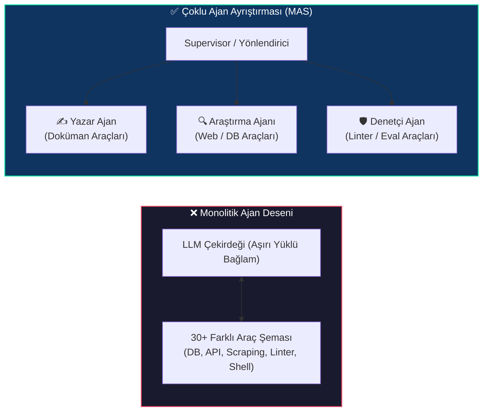
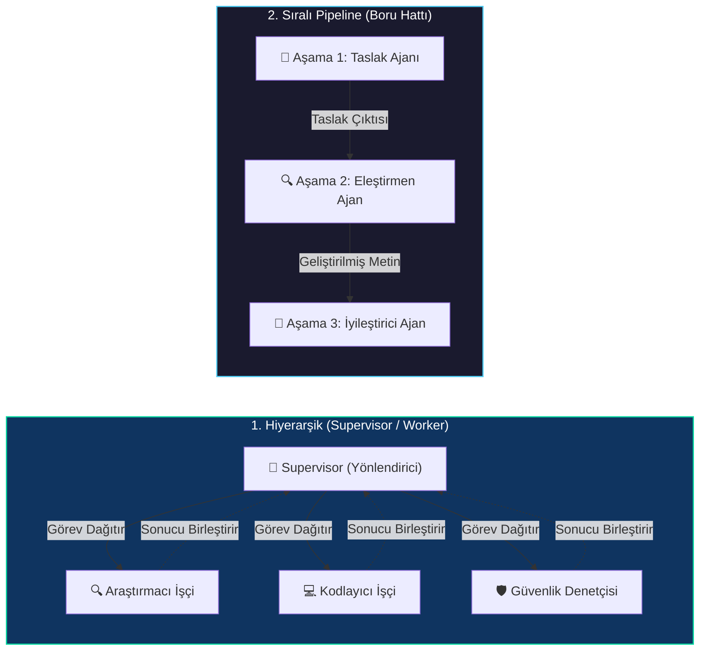
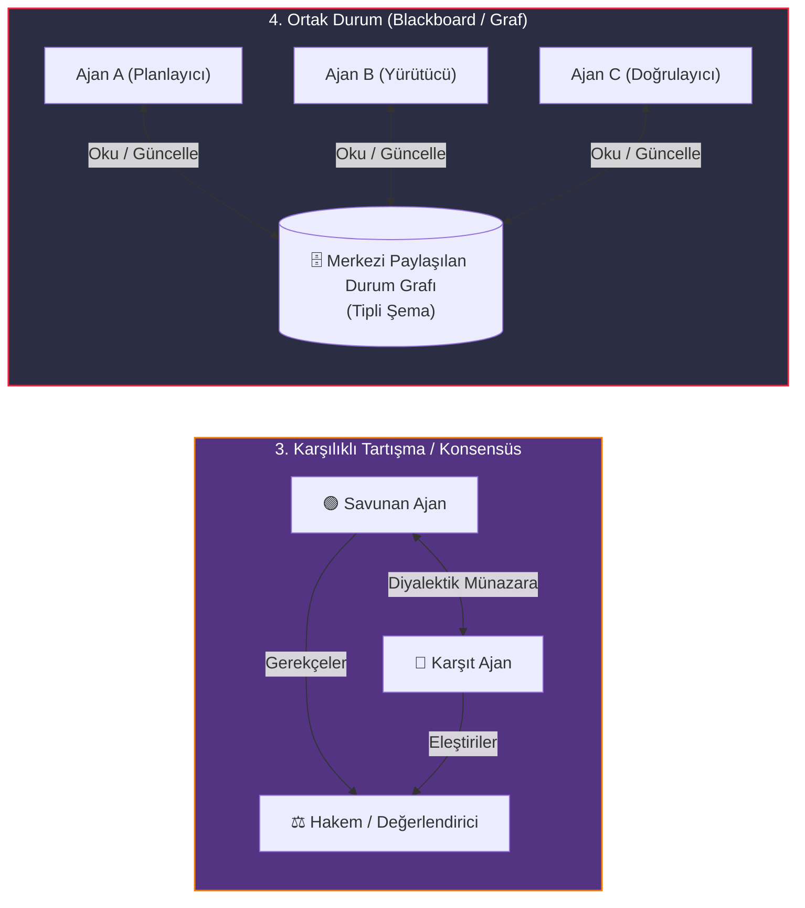

# Çoklu Ajan Sistemleri: İş Birlikli ve Hiyerarşik Mimariler

<!-- toc -->

<br/>
<br/>

Monolitik ajan mimarileri—tek bir büyük dil modelinin düzinelerce farklı API arasındaki araç seçimini, planlamayı, diyalog geçmişini ve hata kurtarma süreçlerini tek bir bağlam penceresi içinde yönetmeye çalıştığı yapılar—kaçınılmaz olarak bilişsel performans kaybına uğrar. Kullanılabilir araç ve talimat sayısı arttıkça, modelin dikkat dağılımı (attention distribution) alakasız token'lara yayılır; bu durum yanlış araç seçimlerine, talimat sapmalarına ve katlanarak artan token maliyetlerine yol açar.

Karmaşık iş akışları için üretim seviyesinde, dayanıklı otonom sistemler geliştirmek adına modern mimari monolitik ajanlardan **Çoklu Ajan Sistemlerine (Multi-Agent Systems - MAS)** geçiş yapmaktadır. Çoklu ajan topolojisinde karmaşık iş süreçleri; yapılandırılmış iletişim protokolleri, izole bellek bağlamları ve deterministik durum geçişleri üzerinden iş birliği yapan özelleşmiş, rol odaklı otonom birimlere bölünür. Bu bölümde çoklu ajan koordinasyon topolojilerini, mesaj iletim matematiğini, üretim framework'lerini ve hata toleranslı durum senkronizasyon modellerini inceliyoruz.

<br/>
<br/>

---

## 1. Monolitik Ajanların Çoklu Ajan Ağlarına Ayrıştırılması

Monolitik bir ajan, tüm çok amaçlı optimizasyon problemini tek başına çözmeye çalışan merkezi bir karar verici gibi davranır:

<br/>

$$
\max_{a \in \mathcal{A}} \mathbb{E} \left[ R(s, a) \right]
$$

<br/>

Burada $|\mathcal{A}|$, sistemdeki tüm kullanılabilir araçlar kümesini temsil eder. Araç sayısı $|\mathcal{A}| \gg 10$ seviyesine ulaştığında, geniş istem şemaları üzerinde dikkatin seyrelmesi nedeniyle suboptimal eylem seçimi olasılığı belirgin şekilde artar.

Buna karşılık Çoklu Ajan Sistemleri, küresel eylem alanını ve görev uzayını $K$ adet uzman alt ajana bölerek **Sorumlulukların Ayrılığı (Separation of Concerns - SoC)** ilkesini uygular:

<br/>

$$
\mathcal{A} = \bigcup_{k=1}^K \mathcal{A}_k, \quad \text{burada } \mathcal{A}_i \cap \mathcal{A}_j \approx \emptyset
$$

<br/>

Her bir $A_k$ ajanı; özelleştirilmiş bir rol istemi $\mathcal{P}_k$, asgari bir araç şeması $\mathcal{T}_k$ ve izole bir yerel çalışma belleği $\mathcal{M}_k$ ile şartlandırılmış özel bir bağlam penceresi $\mathcal{C}_k$ içinde çalışır.

<br/>



<br/>

### 1.1 Çoklu Ajan Uzmanlaşmasının Mimari Avantajları

1. **Bağlam Penceresi İzolasyonu:** Ara adımlar ve ayrıntılı ham araç çıktıları (örneğin 50KB HTTP yanıtları) çalışan ajanın kendi bağlamında tutulur ve ana grafa dönmeden önce özetlenir.
2. **Özelleştirilmiş Model Yönlendirmesi:** Farklı ajanlar farklı temel LLM motorlarında çalıştırılabilir (örneğin veri ayrıştırma için hafif/hızlı modeller, stratejik koordinasyon için gelişmiş akıl yürütme modelleri).
3. **Deterministik Birim Testleri:** Bağımsız ajan düğümleri izole edilebilir, mock'lanabilir ve alana özgü değerlendirme veri setleriyle ayrı ayrı test edilebilir.
4. **Hassas Güvenlik ve En Az Yetki İlkesi:** API kimlik bilgileri ve tehlikeli araç erişimleri (örneğin veritabanı yazma yetkisi, kabuk komutları çalıştırma) yalnızca yetkili alt ajanlarla sınırlandırılır.

<br/>
<br/>

---

## 2. Çoklu Ajan Koordinasyon Topolojileri

Bilginin yönlendirilmesi ve karar yetkisinin dağılımı, sistemin yürütme topolojisini belirler. Üretim seviyesindeki çoklu ajan mimarileri 4 temel iletişim modelini uygular.

<br/>

### 2.1 Merkezi ve Sıralı Topolojiler

<br/>



<br/>
<br/>

### 2.2 İş Birlikli ve Paylaşılan Durum Topolojileri

<br/>



<br/>
<br/>

### 2.3 Topoloji Karşılaştırması ve Mimari Ödünleşimler

| Koordinasyon Topolojisi | Kontrol Mekanizması | Bağlam İzolasyonu | Token Karmaşıklığı | İdeal Üretim Kullanım Alanı |
|---|---|---|---|---|
| **Hiyerarşik (Supervisor)** | Merkezi yönetici ajan görevleri dinamik dağıtır ve sonuçları birleştirir | Yüksek (İşçiler ara karalamalarını diğerleriyle paylaşmaz) | $\mathcal{O}(K \cdot T)$ (İşçi sayısına lineer bağlı) | Heterojen iş akışları, dinamik alt görev ayrıştırma, kapsamlı araştırma |
| **Sıralı Pipeline** | Deterministik yönlendirilmiş döngüsüz graf ($A \to B \to C$) | Orta (Her aşama bir önceki aşamanın çıktısını tüketir) | $\mathcal{O}(K)$ (Boru hattı derinliğiyle orantılı) | İçerik yayınlama, CI/CD kod üretimi, çok aşamalı veri ETL |
| **Tartışma / Konsensüs** | Nihai hakem değerlendirmesiyle çok turlu diyalektik etkileşim | Düşük (Münazara üyeleri ortak transkripti paylaşır) | $\mathcal{O}(N_{\text{tur}} \cdot K^2)$ (Ajan etkileşimiyle karesel artan) | Doğruluk teyidi (fact-checking), kritik finansal analiz, tıbbi tanı incelemesi |
| **Blackboard (Ortak Durum)** | Merkezi tipli duruma olaya dayalı pub/sub okuma ve yazma | Yüksek (Açık şema sözleşmeleri ortak anahtarları yönetir) | $\mathcal{O}(K \cdot \Delta S)$ (Durum güncellemeleriyle orantılı) | LangGraph üretim durum makineleri, simülasyonlar, karmaşık robotik |

<br/>
<br/>

---

## 3. Resmi Matematiksel Model ve Mesaj İletimi

Bir Çoklu Ajan Sistemi matematiksel olarak yönlendirilmiş bir koordinasyon grafı olarak tanımlanır:

<br/>

$$
\mathcal{G} = (\mathcal{V}, \mathcal{E}, \mathcal{S})
$$

<br/>

Burada:
* $\mathcal{V} = \{A_1, A_2, \dots, A_n\}$ otonom ajanlar kümesini temsil eder. Her $A_i$ ajanı $A_i = \langle \mathcal{P}_i, \mathcal{T}_i, \mathcal{M}_i, f_i \rangle$ demetiyle tanımlıdır; burada $\mathcal{P}_i$ rol istemi, $\mathcal{T}_i$ yerel araç seti, $\mathcal{M}_i$ özel bellek ve $f_i$ politika modelidir.
* $\mathcal{E} \subseteq \mathcal{V} \times \mathcal{V}$ ajan düğümleri arasındaki izinli yönlendirilmiş iletişim kanallarını gösterir.
* $\mathcal{S}(t)$ ise $t$ ayrık zaman adımındaki küresel paylaşılan durum vektörüdür.

<br/>

### 3.1 Durum Geçişleri ve Mesaj Yayılımı

$A_i$ ajanı $t$ adımında çalıştığında, hedef $A_j$ ajanına yönelik bir $m_{i \to j}(t)$ mesajı üretir:

<br/>

$$
m_{i \to j}(t) = f_i(\Pi_i(\mathcal{S}(t)), \mathcal{M}_i(t), \mathcal{P}_i)
$$

<br/>

burada $\Pi_i(\mathcal{S}(t))$, küresel durumu yalnızca $A_i$ için yetkilendirilmiş alanlara filtreleyen projeksiyon fonksiyonudur.

Küresel durum, bir indirgeyici (reducer) geçiş fonksiyonu $\Gamma$ uyarınca deterministik olarak güncellenir:

<br/>

$$
\mathcal{S}(t+1) = \Gamma\left(\mathcal{S}(t), \bigcup_{(i,j) \in \mathcal{E}} m_{i \to j}(t)\right)
$$

<br/>

### 3.2 Dinamik Sonlandırma ve Çıkmaz (Deadlock) Önleme

Otonom döngüsel graflarda sonsuz ping-pong döngülerini engellemek için açık bir sonlandırma sınır fonksiyonu tanımlanmalıdır $\tau$:

<br/>

$$
\tau(\mathcal{S}(t)) = 
\begin{cases} 
\text{SONLANDIR} & \text{eğer } \text{KaliteSkoru}(\mathcal{S}(t)) \ge \theta \\\\
\text{ESKALE ET} & \text{eğer } t \ge T_{\max} \quad (\text{Devre Kesici}) \\\\
\text{DEVAM} & \text{diğer durumlarda}
\end{cases}
$$

<br/>

> **Temel Mimari Çıkarım:** Döngü sonlandırması için hiçbir zaman yalnızca otonom ajanların karşılıklı mutabakatına güvenmeyin. Maliyet patlamasını ve sonsuz tartışma kilitlenmelerini önlemek için her zaman kesin bir matematiksel devre kesici ($t \ge T_{\max}$) uygulayın.

<br/>
<br/>

---

## 4. Dayanıklı Uygulama: Supervisor ve Worker StateGraph

Aşağıda, tipli paylaşılan durum ve yapılandırılmış yönlendirme kararları kullanan Hiyerarşik Çoklu Ajan Sisteminin üretim standardında temsili bir uygulaması yer almaktadır.

<br/>

```python
from typing import TypedDict, List, Dict, Optional, Literal
from pydantic import BaseModel, Field

class GlobalAgentState(TypedDict):
    objective: str
    task_breakdown: List[str]
    worker_artifacts: Dict[str, str]
    supervisor_feedback: str
    iteration_count: int
    max_iterations: int
    is_complete: bool

class SupervisorRoutingDecision(BaseModel):
    next_node: Literal["researcher", "coder", "auditor", "FINISH"] = Field(
        description="Hedef uzman ajan düğümü veya hedef tamamlandıysa FINISH."
    )
    directive: str = Field(description="Seçilen alt ajana iletilecek net ve kesin talimat.")
    quality_score: float = Field(ge=0.0, le=10.0, description="Değerlendirilen çıktı kalite skoru.")

def supervisor_router(state: GlobalAgentState, llm) -> Dict[str, any]:
    """Birikimli durumu değerlendirir ve akışı dinamik olarak yönlendirir."""
    if state["iteration_count"] >= state["max_iterations"]:
        return {"is_complete": True, "next_node": "FINISH"}

    structured_evaluator = llm.with_structured_output(SupervisorRoutingDecision)
    decision: SupervisorRoutingDecision = structured_evaluator.invoke(
        f"Hedef: {state['objective']}\nÇıktılar: {state['worker_artifacts']}\n"
        f"Önceki Geri Bildirim: {state['supervisor_feedback']}"
    )

    if decision.quality_score >= 8.5 or decision.next_node == "FINISH":
        return {"is_complete": True, "next_node": "FINISH"}

    return {
        "supervisor_feedback": decision.directive,
        "next_node": decision.next_node,
        "iteration_count": state["iteration_count"] + 1,
    }
```

<br/>
<br/>

---

## 5. Çoklu Ajan Framework Ekosistemi ve Değerlendirme Matrisi

Modern kurumsal yazılım geliştirme süreçlerinde ajan sürülerini yönetmek için özelleşmiş orkestrasyon framework'leri kullanılır.

<br/>

| Framework | Temel Paradigma | Durum Mimarisi | Akış Kontrolü | Temel Güçlü Yönü |
|---|---|---|---|---|
| **LangGraph** | Döngüsel Yönlendirilmiş Graflar | Merkezi TypedDict / Pydantic Durumu | Graf kenarları, koşullu yönlendiriciler, checkpointer'lar | Tam deterministik kontrol, human-in-the-loop, zaman yolculuğu hata ayıklaması |
| **CrewAI** | Rol Oynayan Otonom Ekipler | Görev odaklı bellek ve bağlam aktarımı | Sıralı veya Hiyerarşik yönetici süreçleri | Hızlı prototipleme, sezgisel persona modelleme, yerleşik görev delegasyonu |
| **AutoGen / AG2** | Diyaloğa Dayalı Ajan Ağları | Çok turlu diyalog olay veri yolu | Asenkron konuşma döngüleri | Esnek eşler arası münazara, kod çalıştırma korumalı alanları (sandbox) |
| **OpenAI Swarm** | Hafif Rutin El Değiştirmeleri (Handoffs) | Fonksiyon bağlamlı durumsuz yürütme | İstemci tarafı açık ajan transferleri | Ultra düşük ek yük, minimal soyutlamalar, doğrudan geliştirici kontrolü |

<br/>
<br/>

---

## 6. Resmi Challenge'lar ve Mimari Çözümler

<br/>

<details>
  <summary><strong>Challenge 1: Tasarım — Çoklu Ajanlı Senaryo Stüdyosu (Senarist, Yönetmen, Yapımcı)</strong></summary>
  <br/>

  ### Problem Tanımı
  *Yüksek kaliteli bir film senaryosu yazımı için üç farklı rolü koordine eden iş birlikli bir çoklu ajan mimarisi tasarlayın: Senarist (anlatı/diyalog), Yönetmen (görsel tempo/atmosfer) ve Yapımcı (bütçe kısıtları ve ticari uygulanabilirlik).*

  ### Mimari Çözüm ve Sistem Tasarımı
  Sanatsal ve bütçesel kilitlenmeleri (deadlock) önlemek için sistem, Yapımcının yönetici gözetmen ve bekçi (gatekeeper) rolü üstlendiği bir **Hiyerarşik Geri Bildirim Döngüsü** uygular.

  <br/>

  ```mermaid
  flowchart TD
      Start["Proje Özeti & Logline"] --> ProdInit["Yapımcı Ajan: Bütçe Kısıtları & Aşama Hedefleri"]
      ProdInit --> Screenwriter["Senarist Ajan: Sahne & Diyalog Taslağı"]
      
      Screenwriter --> DirReview["Yönetmen Ajan: Görsel Ton & Dramatik Yapı"]
      Screenwriter --> ProdReview["Yapımcı Ajan: Bütçe & Yapım Fizibilitesi"]
      
      DirReview --> Consolidator["Yapımcı Bekçisi & Skorlama"]
      ProdReview --> Consolidator
      
      Consolidator -->|Revizyon Gerekli| Screenwriter
      Consolidator -->|Onaylandı veya Max Tura Ulaşıldı| Packager["Nihai Senaryo Paketi Yayınlandı"]

      style ProdInit fill:#0f3460,stroke:#06d6a0,stroke-width:1.5px,color:#fff
      style Screenwriter fill:#1a1a2e,stroke:#4cc9f0,stroke-width:1.5px,color:#fff
      style Consolidator fill:#533483,stroke:#f77f00,stroke-width:1.5px,color:#fff
      style Packager fill:#06d6a0,stroke:#0f3460,stroke-width:1.5px,color:#000
  ```

  <br/>

  #### Paylaşılan Durum (Shared State) Şeması:
  ```python
  class ScriptProductionState(TypedDict):
      logline: str
      budget_ceiling_usd: int
      script_draft: str
      director_critique: str
      producer_audit: str
      feasibility_score: float
      artistic_score: float
      is_approved: bool
      revision_count: int
      max_revisions: int
  ```

  #### Kritik Ödünleşimler:
  * **Kilitlenme Önleme:** Yönetmen 50 milyon dolarlık görsel efekt talep ederken Yapımcı düşük bütçeli gerçekçilik istediğinde, Yapımcı Bekçisi sert kısıtları uygulayarak geri bildirimi Senariste filtreleyerek iletir.
  * **Devre Kesici:** Eğer `revision_count >= 3` olursa döngü zorla sonlandırılır ve mevcut en yüksek puanlı taslak insan onayına iletilir.
</details>

<br/>

<details>
  <summary><strong>Challenge 2: Uygulama — Framework Seçim Ödünleşimleri (LangGraph vs. CrewAI vs. AutoGen)</strong></summary>
  <br/>

  ### Problem Tanımı
  *Önde gelen çoklu ajan framework'lerinin uygulama mimarilerini karşılaştırın. Bir Staff Engineer, kritik üretim sistemleri için LangGraph'i ne zaman CrewAI veya AutoGen'e tercih etmelidir?*

  ### Mimari Analiz ve Karar Çerçevesi

  <br/>

  ```mermaid
  flowchart LR
      Req{"Proje Gereksinimleri"}
      Req -->|Deterministik SLA, Kesin Graf Yönlendirmesi, Katı Durum Kontrolü| LG["LangGraph Tercih Et"]
      Req -->|Hızlı Persona Prototipleme, Otonom Görev Delegasyonu| CA["CrewAI Tercih Et"]
      Req -->|Açık Uçlu Diyalog Tartışması, Grup Sohbeti Simülasyonu| AG["AutoGen Tercih Et"]

      style LG fill:#0f3460,stroke:#06d6a0,stroke-width:1.5px,color:#fff
      style CA fill:#1a1a2e,stroke:#4cc9f0,stroke-width:1.5px,color:#fff
      style AG fill:#533483,stroke:#f77f00,stroke-width:1.5px,color:#fff
  ```

  <br/>

  #### Detaylı Framework Matrisi:
  1. **LangGraph (Kurumsal Backend'ler İçin Önerilen):**
     * **Kod Olarak Graf (Graph-as-Code):** Çoklu ajan etkileşimlerini tipli indirgeyicilere (reducers) sahip açık durum grafları olarak modeller.
     * **Üretim Dayanıklılığı:** Yerleşik kalıcılık denetim noktaları (checkpoints), uzun süreli asenkron insan onaylarını ve hata kurtarmayı destekler.
  2. **CrewAI (İçerik ve İş Otomasyonu İçin Önerilen):**
     * **Yüksek Düzey Soyutlama:** `role`, `backstory` ve `goal` ile üst düzey ajanlar tanımlar. Hızlı kurulum için mükemmeldir ancak adım düzeyindeki durum mutasyonları üzerinde daha az kontrol sağlar.
  3. **AutoGen / AG2 (Simülasyon ve Araştırma İçin Önerilen):**
     * **Diyaloğa Dayalı Sürüler:** Ajanlar serbest biçimli çok taraflı sohbet üzerinden iletişim kurar. Yüksek esneklik sunar ancak konuşma sınırları katı kısıtlanmazsa deterministik olmayan döngülere yatkındır.
</details>

<br/>

<details>
  <summary><strong>Challenge 3: Operasyon ve Güvenilirlik — Token Patlamasını ve Sonsuz Döngüleri Önleme</strong></summary>
  <br/>

  ### Problem Tanımı
  *Otonom çoklu ajan sistemlerindeki temel arıza modlarını belirleyin ve sonsuz eleştiri döngülerini, basamaklı halüsinasyonları ve kontrolsüz API faturalandırmasını önlemek için mühendislik güvenlik bariyerleri kurun.*

  ### Mimari İyileştirme Çerçevesi

  #### 1. Ping-Pong Kilitlenmelerini Önleme:
  * **Asimetrik Eleştiri Yetkisi:** İşçi ajanların sonsuz tartışamayacağı net bir hiyerarşi kurun; belirlenmiş bir yönetici tek taraflı sonlandırma kararı verir.
  * **Fark Yakınsama İzleme (Delta Convergence):** Ardışık revizyonlar bir epsilon eşiğinin altında çıktı değişiklik mesafesi üretirse ($\Delta S < \epsilon$), azalan verim nedeniyle döngüyü sonlandırın.

  #### 2. Basamaklı Halüsinasyon Kontrolü:
  * **Ajanlar Arası Şema Doğrulaması:** Alt ajanlar arasında asla yapılandırılmamış doğal dil çıktıları aktarmayın. Durum birleştirmeden önce iddiaları, bağlantıları ve araç çıktılarını doğrulamak için çalışma zamanı doğrulamalı katı Pydantic şemaları kullanın.

  #### 3. Token Kaçağı Koruması:
  * **Kenar Geçişinde Bağlam Sentezi:** Bir ajan kontrolü yöneticiye geri devrettiğinde, ham araç yürütme geçmişi bir yönetici özetine sıkıştırılır ve böylece küresel durum token karmaşıklığı $\mathcal{O}(K \cdot T^2)$ yerine $\mathcal{O}(K)$ seviyesinde sınırlandırılır.
</details>
