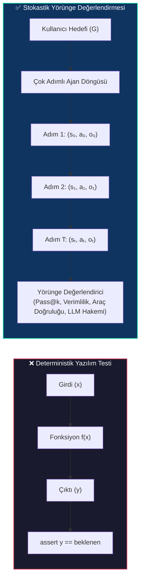
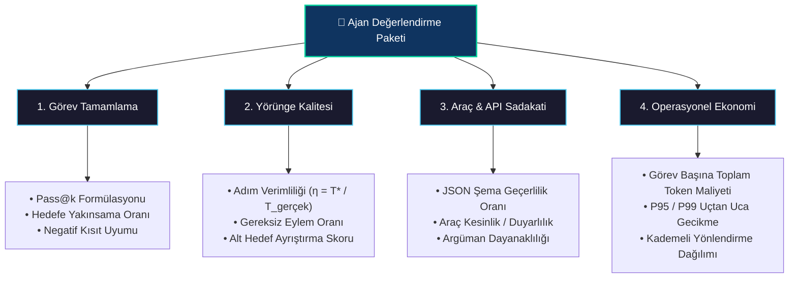
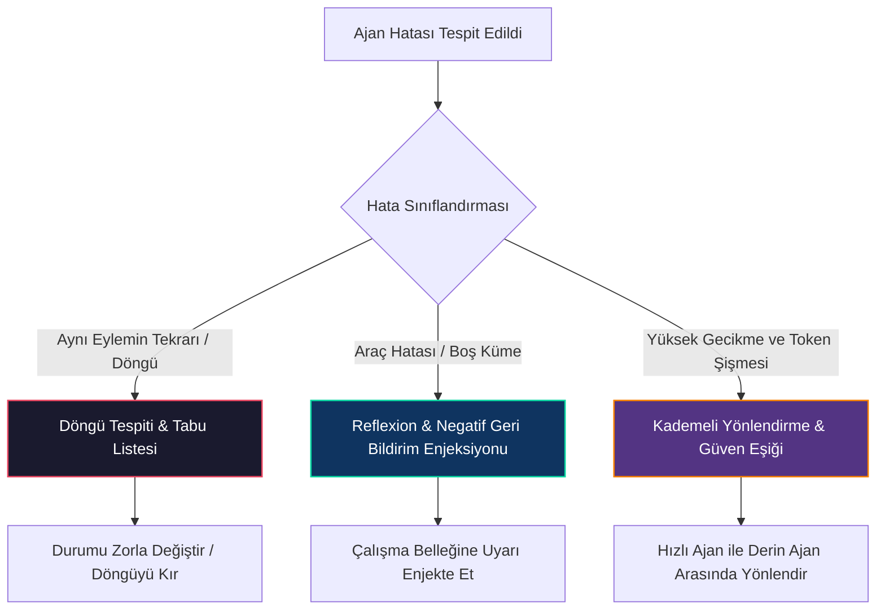
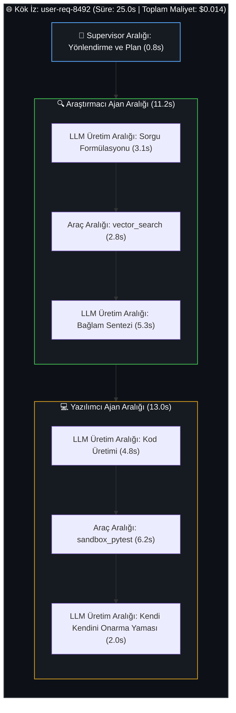
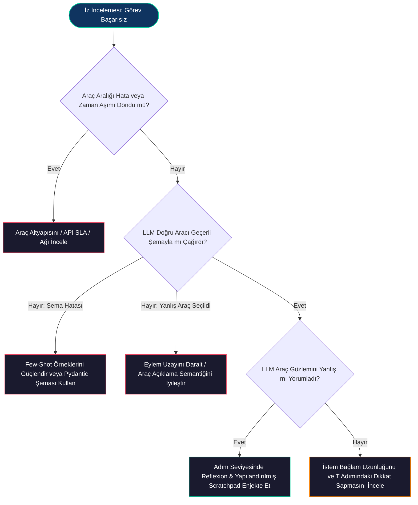

# Ajanları Değerlendirme ve Hata Ayıklama: Gözlemlenebilirlik, Yörünge Değerlendirmesi ve Kendi Kendini Onaran Koruma Katmanları

<!-- toc -->

<br/>
<br/>

Geleneksel yazılım mühendisliği deterministik doğrulama (assertion) testlerine dayanır: sabit bir $x$ girdisi verildiğinde, $f(x)$ fonksiyonunun kesin olarak $y$ çıktısını üretmesi beklenir. Oysa otonom yapay zeka ajan mimarilerinde sistemler **stokastik, çok adımlı dinamik durum makineleri** olarak çalışır. Bir ajan, uzun bir yürütme yörüngesi boyunca araç çağrıları yaparak, yapılandırılmamış metinleri ayrıştırarak ve ortamdan gelen gözlemleri işleyerek deterministik olmayan geniş bir karar ağacında gezinir.

Otonom bir ajan canlı ortamda (production) başarısız olduğunda, bu hata nadiren net bir sözdizimi hatası veya istisna (exception) şeklinde ortaya çıkar. Bunun yerine hatalar çoğunlukla **sessiz yörünge sapmaları (trajectory drift), zincirleme halüsinasyonlar, sonsuz araç kısırdöngüleri veya kontrolsüz gecikme/maliyet artışları** olarak kendini gösterir.

Yüksek trafikli ve kritik iş süreçlerinde otonom ajanları güvenle dağıtıma alabilmek için mühendislerin katı bir değerlendirme ve gözlemlenebilirlik disiplini kurması şarttır. Bu bölümde ajan yörünge matematiğini formüle ediyor, üretim seviyesinde değerlendirme metriklerini ($Pass@k$, yörünge verimliliği, LLM-as-a-judge kalibrasyonu) inceliyor, kendi kendini onaran hata ayıklama desenlerini (Reflexion, Tabu negatif geri bildirim, kademeli yönlendirme) ve dağıtık izleme mimarilerini hayata geçiriyoruz.

<br/>
<br/>

---

## 1. Paradigma Değişimi: Deterministik Doğrulamadan Yörünge Değerlendirmesine

Geleneksel mikroservislerde birim ve entegrasyon testleri statik girdi-çıktı eşleşmeleri üzerinde çalışır. Buna karşılık bir ajan etkileşimi, kısmen gözlemlenebilir bir yürütme yörüngesi $\tau$ olarak modellenir:

<br/>

$$
\tau = \left( s_0, a_0, o_0, s_1, a_1, o_1, \dots, s_T, a_T, o_T \right)
$$

<br/>

Burada $s_t \in \mathcal{S}$ içsel bağlam durumunu (istem geçmişi, çalışma belleği), $a_t \in \mathcal{A}$ seçilen eylemi veya araç çağrısını, $o_t \in \mathcal{O}$ ise dış ortamdan veya API'dan dönen gözlemi temsil eder.

<br/>



<br/>

### 1.1 Katlanarak Artan Hata Problemi (Compounding Error)

Ajan değerlendirmesindeki temel zorluk **katlanarak artan hata olasılığından** kaynaklanır. Her bir akıl yürütme adımının tek adımlı karar doğruluğu $p = P(a_t = a_t^* \mid \tau_{<t})$ ise, $T$ uzunluğundaki çok adımlı bir iş akışının sapma olmadan başarıyla tamamlanma olasılığı şu şekilde sınırlandırılır:

<br/>

$$
P(\text{Success}) = \prod_{t=1}^T P(a_t = a_t^* \mid \tau_{<t}) \approx p^T
$$

<br/>

Tek adımlı araç seçimi doğruluğu $p = 0.95$ olan en gelişmiş bir temel modelde dahi:
* $T = 3$ adımda: $P(\text{Success}) = 0.95^3 \approx 0.857$ ($\%85.7$)
* $T = 10$ adımda: $P(\text{Success}) = 0.95^{10} \approx 0.598$ ($\%59.8$)
* $T = 20$ adımda: $P(\text{Success}) = 0.95^{20} \approx 0.358$ ($\%35.8$)

> **Temel Mimari Çıkarım:** Bir ajanı yalnızca nihai çıktısına göre değerlendirmek, aradaki zincirleme hata dinamiklerini maskeler. Güçlü bir değerlendirme altyapısı, **uçtan uca görev tamamlamayı**, **adım başına yörünge verimliliğini** ve **araç çağırma sadakatini** birbirinden bağımsız olarak ölçmelidir.

<br/>
<br/>

---

## 2. Çekirdek Ajan Değerlendirme Metrikleri ve Matematiksel Formülasyonlar

Üretim seviyesinde ajan değerlendirmesi doğruluk, operasyonel verimlilik, anlamsal kalite ve ekonomik maliyet arasında denge kuran çok boyutlu bir metrik paketi gerektirir.

<br/>



<br/>

### 2.1 Görev Başarı Oranı ($Pass@k$)

Ajanları her bir test senaryosu için $n$ adet bağımsız stokastik üretim üzerinden değerlendirmek, yansız $Pass@k$ metriğini sağlar:

<br/>

$$
\text{Pass}@k = \mathbb{E}_{\text{tasks}} \left[ 1 - \frac{\binom{n - c}{k}}{\binom{n}{k}} \right]
$$

<br/>

Burada $n$ görev başına üretilen toplam değerlendirme çalıştırması sayısı ($n \ge k$), $c$ ise tüm deterministik doğrulama kriterlerini (örneğin birim testlerin geçmesi, veri tabanının hedeflenen duruma ulaşması) başarıyla karşılayan çalıştırma sayısıdır.

<br/>

### 2.2 Yörünge Verimliliği ($\eta$)

Yörünge verimliliği, ajanın izlediği gerçek adım sayısının teorik olarak optimum olan $T^*$ adım sayısına ne kadar yakın olduğunu ölçer:

<br/>

$$
\eta = \frac{T^*}{T_{\text{gerçek}}}, \quad \text{burada } \eta \in (0, 1]
$$

<br/>

Eğer optimum bir araştırma yörüngesi $T^* = 3$ araç çağrısı gerektiriyorsa, ancak ajan arama sorgularındaki gereksiz tekrarlar nedeniyle $T_{\text{gerçek}} = 12$ çağrı yapıyorsa $\eta = 0.25$ olur. Yüksek trafikli sistemlerde düşük yörünge verimliliği; doğrudan doğrusal token maliyeti patlamasına ve P99 gecikme sürelerinin bozulmasına neden olur.

<br/>

### 2.3 Kapsamlı Metrikler Matrisi

| Metrik Boyutu | Matematiksel Tanım | Hedef (Üretim) | Operasyonel Etki ve Değiş-Tokuşlar |
| :--- | :--- | :--- | :--- |
| **Pass@1 (Tek Seferde Başarı)** | $\mathbb{E}[c/n \mid k=1]$ | $\ge \%90$ | Son kullanıcıyla etkileşen ajanlarda kritiktir; yeniden deneme maliyetlerini düşürür. |
| **Pass@5 (Kendi Kendini Düzeltme)** | $\mathbb{E}[1 - \binom{n-c}{5}/\binom{n}{5}]$ | $\ge \%98$ | Yürütme denetleyicileriyle birleştiğinde ajanın kendi kendini onarma gücünü gösterir. |
| **Yörünge Verimliliği ($\eta$)** | $T^* / T_{\text{gerçek}}$ | $\ge 0.75$ | İstem şişmesini önler; uçtan uca yanıt gecikmesini minimize eder. |
| **Araç Çağırma Kesinliği (Precision)** | $\frac{TP_{\text{araç}}}{TP_{\text{araç}} + FP_{\text{araç}}}$ | $\ge \%98$ | Yan etki doğuran hatalı veya yetkisiz API çağrılarını engeller. |
| **Şema Uyumluluk Oranı** | $\frac{N_{\text{geçerli}}}{N_{\text{toplam}}}$ | $\%100$ | Pipeline determinizmi için zorunludur; ayrıştırma (parsing) hatalarını sıfırlar. |
| **LLM Hakemi Uyumu (Alignment)** | İnsan Hakemle Kendall $\tau$ / Cohen $\kappa$ | $\kappa \ge 0.85$ | Niteliksel açık uçlu görevlerde otomatik değerlendirmeyi kalibre eder. |

<br/>
<br/>

---

## 3. Üretim Hata Ayıklama Desenleri ve Kendi Kendini Onarma

Üretim telemetrisi incelendiğinde ajan arızalarının üç ana sınıfta toplandığı görülür: **Sonsuz Döngüler / Titreşimler (Oscillation)**, **Halüsinatif Araç Çağrıları** ve **Boş API Yanıtlarında Takılı Kalma**.

<br/>



<br/>

### 3.1 Döngü Tespiti ve Dinamik Tabu Listesi

Bir ajan belirsiz bir API yanıtı veya hata aldığında, dil modelleri genellikle çekici durumlara (attractor states) kapılarak tamamen aynı parametreleri tekrar tekrar sorgular ($T_1 \to T_1 \to T_1$).

Bunu engellemek için deterministik bir **Eylem Özet Halkası (Tabu Listesi)** ve dinamik bağlam müdahalesi uygulanır.

<br/>

### 3.2 Reflexion Mimarisi (Epizodik Öz-Düzeltme)

Ajanın istem geçmişine ham hata yığınını (stack trace) doğrudan eklemek yerine **Reflexion** deseni, başarısızlık üzerine yapılandırılmış üstbilişsel (metacognitive) bir düşünce adımı çalıştırarak epizodik çalışma belleğini günceller:

<br/>

$$
\mathcal{M}_{k+1} \leftarrow \mathcal{M}_k \cup \operatorname{Reflect}\left(\tau_k, e\right)
$$

<br/>

```python
from dataclasses import dataclass, field
from typing import Dict, List, Any, Optional
import hashlib
import json

@dataclass
class ActionTrace:
    tool: str
    args: Dict[str, Any]
    result: Optional[str] = None
    args_hash: str = field(init=False)

    def __post_init__(self):
        serialized = json.dumps(self.args, sort_keys=True)
        self.args_hash = hashlib.sha256(f"{self.tool}:{serialized}".encode()).hexdigest()

class AgentSelfHealingRuntime:
    """Kısırdöngüleri önleyen ve negatif geri bildirim enjekte eden üretim çalışma katmanı."""
    def __init__(self, max_repeats: int = 2):
        self.max_repeats = max_repeats
        self.history: List[ActionTrace] = []
        self.tabu_hashes: set = set()

    def intercept_and_validate(self, tool_name: str, args: Dict[str, Any]) -> Optional[Dict[str, str]]:
        trace = ActionTrace(tool=tool_name, args=args)
        
        # 1. Çağrı daha önce başarısız olmuş Tabu listesinde mi?
        if trace.args_hash in self.tabu_hashes:
            return {
                "role": "system",
                "content": f"🛑 [ENGEL]: '{tool_name}' aracını {args} parametreleriyle çalıştırma denemesi daha önce başarısız oldu. "
                           f"Mutlaka alternatif bir strateji belirlemeli veya farklı bir araç seçmelisin."
            }

        # 2. Son adımlarda döngüsel tekrarlama var mı?
        recent_matches = [h for h in self.history[-self.max_repeats:] if h.args_hash == trace.args_hash]
        if len(recent_matches) >= self.max_repeats - 1:
            self.tabu_hashes.add(trace.args_hash)
            return {
                "role": "system",
                "content": f"⚠️ [DÖNGÜ TESPİT EDİLDİ]: '{tool_name}' aracı ilerleme kaydedilmeden {self.max_repeats} kez aynı parametrelerle çağrıldı. "
                           f"Bu eylemin neden başarısız olduğunu analiz et (Thought) ve alternatif bir yaklaşıma geç."
            }
        
        self.history.append(trace)
        return None
```

<br/>
<br/>

---

## 4. Dağıtık Gözlemlenebilirlik ve İzleme (Tracing) Mimarisi

Geleneksel uygulama logları (`stdout`, JSON logları) çok adımlı nedensel etkileşimleri birbirinden kopuk satırlara indirger. Otonom çoklu ajan sistemlerinde tam gözlemlenebilirlik **Hiyerarşik Dağıtık İzleme (OpenTelemetry / LangSmith / Arize Phoenix)** altyapısını zorunlu kılar.

<br/>



<br/>

### 4.1 İz Hiyerarşisi ve Aralık (Span) Anatomisi

1. **Kök İz (`Trace ID`):** Kullanıcı isteğinin tüm ajanlar arası el değiştirmelerini kapsayan uçtan uca yaşam döngüsünü temsil eder.
2. **Ajan Aralıkları (`Parent Span`):** Belirli bir ajanın yürütme bloğunu, rol istemini ve anlık durum görüntüsünü kaydeder.
3. **LLM Üretim Aralıkları (`Child Span`):** İstem token sayısını, tamamlama token sayısını, sıcaklık (temperature) değerini, gecikmeyi ve ham model yanıtını içerir.
4. **Araç Yürütme Aralıkları (`Leaf Span`):** Tam JSON argümanlarını, yürütme süresini, HTTP durum kodlarını ve aracın döndürdüğü ham veriyi saklar.

<br/>

### 4.2 Kök Neden Analizi (RCA) Karar Ağacı

Canlı ortamda başarısız olan bir ajan izini incelerken şu sistematik teşhis akışı izlenir:

<br/>



<br/>
<br/>

---

## 5. İnteraktif Challenge ve Derin Mimari Çözümler

Aşağıdaki bölümde günün temel değerlendirme ve hata ayıklama senaryolarına ait derin mimari çözümler yer almaktadır.

<br/>

<details>
  <summary><strong>Challenge 1: Üretim SLA Optimizasyonu — Kademeli Yönlendirme ve Pareto Sınırı</strong></summary>
  <br/>

  ### Problem Tanımı
  *Yüksek doğruluklu ancak yavaş bir derin akıl yürütme ajanı (40s gecikme, \$0.03/sorgu, %96 Pass@1) ile hızlı ve hafif bir ajan (2.5s gecikme, \$0.001/sorgu, %82 Pass@1) arasındaki değiş-tokuşu değerlendirin. Bir Staff Engineer, maliyeti ve P95 gecikmesini düşürürken >%95 sistem başarısını nasıl sağlar?*

  ### Mimari Çözüm: Kademeli Güven Yönlendirmesi (Cascaded Confidence Routing)

  <br/>

  ```mermaid
  flowchart TD
      Query(["Kullanıcı Sorgusu"]) --> FastAgent["Kademe 1: Hızlı ve Hafif Ajan<br/>(2.5s / \$0.001 / Pass@1: %82)"]
      FastAgent --> ConfCheck{"Öz-Güven Skoru<br/>C(τ) ≥ θ (örn. 0.85)?"}
      
      ConfCheck -->|"Yüksek Güven (Trafiğin %80'i)"| Deliver(["Yanıtı Kullanıcıya İlet"])
      ConfCheck -->|"Düşük Güven / Fallback (Trafiğin %20'si)"| DeepAgent["Kademe 2: Derin Akıl Yürüten Ajan<br/>(40s / \$0.030 / Pass@1: %96)"]
      
      DeepAgent --> Deliver

      style FastAgent fill:#1a1a2e,stroke:#4cc9f0,stroke-width:1.5px,color:#fff
      style DeepAgent fill:#0f3460,stroke:#06d6a0,stroke-width:1.5px,color:#fff
  ```

  <br/>

  #### Matematiksel Formülasyon:
  Trafiğin $p_{\text{hızlı}} = 0.80$'lik kısmının 1. Kademede yüksek güvenle çözüldüğünü varsayalım. Sistemin beklenen gecikmesi $E[L]$ ve beklenen sorgu maliyeti $E[C]$:

  <br/>

  $$
  E[L] = p_{\text{hızlı}} \cdot L_{\text{hızlı}} + (1 - p_{\text{hızlı}}) \cdot (L_{\text{hızlı}} + L_{\text{derin}}) = 0.80(2.5\text{s}) + 0.20(2.5\text{s} + 40\text{s}) = 10.5\text{s}
  $$

  <br/>

  $$
  E[C] = p_{\text{hızlı}} \cdot C_{\text{hızlı}} + (1 - p_{\text{hızlı}}) \cdot (C_{\text{hızlı}} + C_{\text{derin}}) = 0.80(0.001) + 0.20(0.031) = 0.007\text{ USD}
  $$

  <br/>

  * **Maliyet Tasarrufu:** Tüm trafiği 2. Kademeye göndermeye kıyasla $\%76.6$ tasarruf.
  * **Gecikme İyileştirmesi:** Medyan (P50) gecikme $40\text{s}$'den $2.5\text{s}$'ye düşer.
  * **Sistem Güvenilirliği:** Birleşik sistem başarı oranı $\%95.2$'nin üzerine çıkar.
</details>

<br/>

<details>
  <summary><strong>Challenge 2: Kısırdöngü Hata Ayıklama — Dinamik Bağlam Tabu Enjeksiyonu ve Reflexion</strong></summary>
  <br/>

  ### Problem Tanımı
  *Bir otonom araştırma ajanı, dahili veri tabanından boş sonuç dönmesine rağmen sürekli aynı arama anahtar kelimeleriyle istek atarak token limitini doldurmakta ve kısırdöngüye girmektedir. Çalışma katmanı (runtime) tüm grafı baştan başlatmadan bu durumu nasıl çözmelidir?*

  ### Mimari Çözüm: Dinamik Tabu Scratchpad Enjeksiyonu

  #### 1. Gerçek Zamanlı Müdahale Mekanizması:
  * Bir araç boş liste `[]` veya HTTP $4xx/5xx$ durum kodu döndürdüğünde, çalışma katmanı kontrolü modele devretmeden önce araya girer.
  * Yürütme motoru, ajanın aktif sistem çalışma belleğine (scratchpad) bir **Negatif Kısıtlama Direktifi** enjekte eder:

  <br/>

  ```markdown
  [SİSTEM UYARISI - DENEME BAŞARISIZ OLDU]:
  'vector_search' aracı query='kubernetes ingress cert-manager' parametresiyle 0 sonuç döndürdü.
  
  NEGATİF KISIT:
  'kubernetes ingress cert-manager' sorgusunu birebir TEKRARLAMA.
  
  GEREKLİ EYLEM:
  1. Sorgunun neden başarısız olduğunu analiz et (Thought) (örn. terimler çok dar, yazım uyumsuzluğu).
  2. Arama terimlerini genişlet veya alternatif 'archive_keyword_search' aracını çağır.
  ```

  #### 2. Dikkat Mekanizması Koşullandırması:
  Negatif kısıtlamanın bir sonraki üretim adımının hemen önüne yerleştirilmesi sayesinde modelin self-attention mekanizması bu kısıt belirteçlerine yüksek ağırlık atar ve kısırdöngüye neden olan matematiksel çekim havzasını (attractor basin) kırar.
</details>

<br/>

<details>
  <summary><strong>Challenge 3: Gözlemlenebilirlik — Dağıtık İzleme ile Nedensel Akıl Yürütme Zincirinin Rekonstrüksiyonu</strong></summary>
  <br/>

  ### Problem Tanımı
  *Çoklu ajan sisteminde (Supervisor → Kod Üretici → Sandbox Linter), son kullanıcı 30 saniye sonra bir 504 Gateway Timeout hatası alır. Dağıtık izleme; hatanın LLM'in mantıksal sapmasından mı, istem doğrulama hatasından mı, yoksa veri tabanı aşırı yüklenmesinden mi kaynaklandığını nasıl tespit eder?*

  ### Mimari Çözüm: Aralık (Span) Seviyesinde Kök Neden Ayrıştırması

  <br/>

  ```mermaid
  flowchart LR
      Trace["İz: Kullanıcı İsteği (504 Timeout)"]
      Trace --> S1["Aralık: Supervisor Yönlendirme (0.8s)"]
      Trace --> S2["Aralık: KodÜretici LLM Çağrısı (3.2s)"]
      Trace --> S3["Aralık: Sandbox PyTest Aracı (26.0s - TIMEOUT)"]
      
      S3 --> RCA["Kök Neden Tespit Edildi:<br/>Pytest Docker Konteyner Havuzu Tükenmesi<br/>(LLM Halüsinasyonu Değil)"]

      style S3 fill:#e94560,stroke:#fff,stroke-width:2px,color:#fff
      style RCA fill:#0f3460,stroke:#06d6a0,stroke-width:1.5px,color:#fff
  ```

  <br/>

  #### Hiyerarşik Aralıkların Tanısal Değeri:
  1. **Gecikme İzolasyonu:** LLM üretiminde harcanan GPU süresi ile harici IO/araç gecikmesini (API, veri tabanı, Docker sandbox) birbirinden ayırır.
  2. **İstem Anlık Görüntüleme:** Hata veren aralığa tam sıcaklık değerini, ham sistem istemlerini ve araç JSON şemalarını doğrudan iliştirerek hatanın yerel ortamda birebir tekrarlanmasını (replay) sağlar.
  3. **Maliyet Denetimi:** Alt aralıklardaki girdi ve çıktı token sayılarını otomatik toplayarak fatura eşiklerini aşan alt ajanları anında belirler.
</details>
