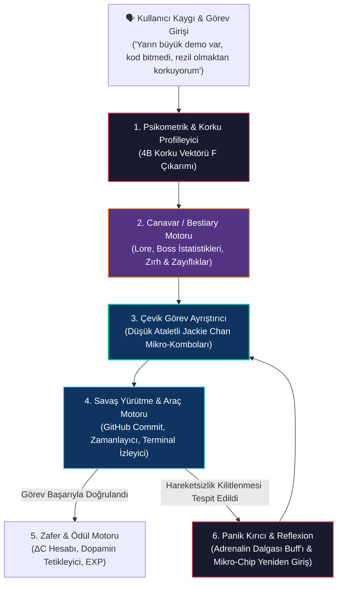
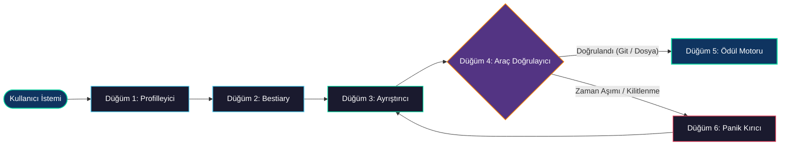
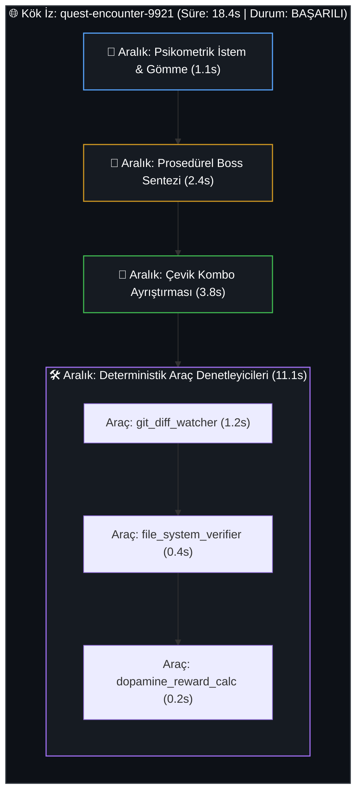

# Capstone Projesi: Kişisel Otonom Yapay Zeka Ajanı İnşası — Cortisol Slayer ve Uyarlanabilir Korku-Boss Motoru

<!-- toc -->

<br/>
<br/>

Day 01'den Day 09'a kadar otonom sistemlerin tüm temel yapı taşlarını inşa ettik: çok adımlı ReAct akıl yürütme döngüleri, tipli araç çağırma şemaları, katmanlı çalışma ve epizodik bellek yapıları, çoklu ajan koordinasyon topolojileri ve kendi kendini onaran koruma katmanlarıyla yörünge gözlemlenebilirliği.

Bu Capstone bölümü, öğrenilen tüm bu mimari bileşenleri üretime hazır, eksiksiz bir kişisel otonom ajanda birleştiriyor: **Cortisol Slayer**.

Cortisol Slayer; yazılımcıların erteleme (procrastination), bilişsel felç ve stres durumlarıyla mücadele etmek için tasarlanmış oyun teorisi tabanlı, kişiselleştirilmiş bir ajan motorudur. Görev yönetimini pasif bir yapılacaklar listesi olarak ele almak yerine sistem; kullanıcının doğal dildeki kaygısını, yaklaşan teslim tarihlerini ve mükemmeliyetçilik krizlerini parametrik can puanlarına ($HP$), taktiksel zayıflıklara, çevik mikro-kombo görevlere ve uyarlanabilir zorluk dengesine sahip **2D RPG Boss Karşılaşmalarına** dönüştürür.

<br/>
<br/>

---

## 1. Sistem Mimarisi: Kişisel Otonom Ajanın Beş Temel Sütunu

Üretim seviyesinde bir kişisel asistan ajanı basit ve durumsuz (stateless) bir sohbet botu gibi çalışamaz. Sistem, matematiksel olarak 6'lı bir demet (tuple) şeklinde modellenen dinamik bir durum makinesi olarak çalışır:

<br/>

$$
\Sigma = \langle \mathcal{S}, \mathcal{A}, \mathcal{T}, \mathcal{M}, \mathcal{G}, \mathcal{R} \rangle
$$

<br/>

Burada $\mathcal{S}$ sürekli kullanıcı ve görev durum uzayı, $\mathcal{A}$ görev ayrıştırma eylem uzayı, $\mathcal{T}$ harici yürütme araçları, $\mathcal{M}$ çok katmanlı bellek, $\mathcal{G}$ bilişsel kilitlenmelere karşı koruma katmanları (guardrails) ve $\mathcal{R}$ geri bildirim ödül sinyalidir (kortizol düşüşü $\Delta C$).

<br/>



<br/>

### 1.1 Beş Çekirdek Alt Sistemin Mimari Ayrıştırması

1. **Psikometrik Durum Çıkarıcı:** Doğal dilde ifade edilen kaygıyı yapılandırılmış matematiksel bir korku vektörüne dönüştürür.
2. **Prosedürel Boss Sentezleyici:** Kişiliğe özel canavarları, matematiksel zırh değerlerini ve zayıf nokta tetikleyicilerini üretir.
3. **Çevik Görev Ayrıştırıcı:** Momentum koruma sezgisellerini kullanarak gözde büyüyen çok saatlik işleri 2 ila 15 dakikalık sürtünmesiz vuruşlara böler.
4. **Araç Doğrulama Katmanı:** Öznel kullanıcı beyanı yerine deterministik doğrulamayı (örneğin Git commit'i veya dosya oluşumunu izleme) kullanır.
5. **Kendi Kendini Onaran Dinamik Zorluk Ayarlayıcı (DDA):** Hareketsizlik kilitlenmelerini yakalar; zamanla artan boss öfkesi (enrage) ile dengeleyici adrenalin buff'larını devreye sokar.

<br/>
<br/>

---

## 2. Matematiksel Modelleme ve Savaş Mekanikleri

Ajan döngüsü içerisinde deterministik davranış sağlamak adına psikolojik ve operasyonel dinamikler matematiksel denklemlerle modellenir.

<br/>

### 2.1 Çok Boyutlu Korku Vektörü ($\vec{F}$)

Kullanıcının duygusal ve bilişsel durumu normalize edilmiş $D$-boyutlu bir uzaya ($D=4$) aktarılır:

<br/>

$$
\vec{F} = \begin{bmatrix} f_{\mathrm{imposter}} \\ f_{\mathrm{deadline}} \\ f_{\mathrm{burnout}} \\ f_{\mathrm{perfectionism}} \end{bmatrix}, \quad f_i \in [0, 1]
$$

<br/>

### 2.2 Boss Can Puanı ($HP$) ve Zamanla Büyüme Dinamiği

Bir boss'un başlangıç canı görev karmaşıklığı ve korku şiddetiyle ölçeklenir. Kullanıcı hareketsiz kaldığında, yaklaşan teslim tarihi baskısını yansıtmak üzere boss zamanla ($\Delta t_{\mathrm{idle}}$) büyür:

<br/>

$$
HP_{\mathrm{boss}}(t) = HP_0 \times \left(1 + \sum_{i=1}^4 w_i f_i\right) \times \log_2\left(1 + T_{\mathrm{est}}\right) \times \left(1 + \lambda \Delta t_{\mathrm{idle}}\right)
$$

<br/>

Burada $HP_0$ taban can puanı (örn. $1000$), $w_i$ arketip ağırlıkları, $T_{\mathrm{est}}$ tahmini tamamlama süresi (saat) ve $\lambda$ erteleme büyüme katsayısıdır.

<br/>

### 2.3 Savaş Hasarı Mekaniği ve Düşük Ataletli Hız Çarpanı

Klasik fizikte statik sürtünme kinetik sürtünmeden büyüktür ($\mu_s > \mu_k$). Bilişsel statik sürtünmeyi kırmak için ajan; mükemmeliyetçi gecikmeler yerine hızlı ve kaba taslakları ("Ugly Draft Vuruşları") ödüllendirir:

<br/>

$$
\text{Hasar} = \text{Taban Hasar} \times \left(1 + \frac{V_{\mathrm{taslak}}}{1 + T_{\mathrm{cilalama}}}\right) \times \text{Çarpan}_{\mathrm{adrenalin}}
$$

<br/>

### 2.4 Kortizol Düşüş Denklemi ($\Delta C$)

Doğrulanmış hamleler yapılıp boss yenildiğinde net bilişsel kortizol düşüşü şu şekilde hesaplanır:

<br/>

$$
\Delta C = \alpha \cdot \left(\frac{\text{Verilen Hasar}}{HP_{\mathrm{boss}}}\right) \times e^{-\beta \cdot t_{\mathrm{erteleme}}}
$$

<br/>

### 2.5 Psikolojik Matris ve Ajan Eşleşmesi

| Psikometrik Arketip | Baskın Korku Özelliği | Oyundaki Boss Temsili | Kritik Zayıflık (Vulnerabilty) | Ajan Taktik Stratejisi |
| :--- | :--- | :--- | :--- | :--- |
| **Mükemmeliyetçilik Felci** | $f_{\mathrm{perfectionism}} \to 1.0$ | **Aura-Zero:** Kusursuz hatlara sahip parıldayan Kristal Monolit | *Kaba Taslak Vuruşu:* Hızlıca yarım yamalak prototip sunmak | 10 dakikalık kaba taslağı zorunlu kıl; format cilalamayı engelle |
| **Teslim Tarihi Paniği** | $f_{\mathrm{deadline}} \to 1.0$ | **Chronos Devourer:** Çok kollu kum saati devi | *Atomik Adım Vuruşu:* 2 dakikalık izole tek bir eylemi tamamlamak | Sadece sıradaki ilk adımı göster; genel yol haritasını gizle |
| **İmposter Sendromu** | $f_{\mathrm{imposter}} \to 1.0$ | **The Phantom Inquisitor:** Şekil değiştiren gölge yargıç | *Doğrulanmış Test Işığı:* Yeşil yanan birim test veya terminal çıktısı | Şüpheyi dağıtmak için ampirik doğrulama şartı koş |
| **Tükenmişlik / Yorgunluk** | $f_{\mathrm{burnout}} \to 1.0$ | **The Silt Golem:** Ağır ve boğucu çamur devi | *Mikro-Sprint Dinlenmesi:* Zorunlu molalarla 5 dakikalık odak patlamaları | Katı Pomodoro sınırları koy; aşırı çalışmayı engelle |

<br/>
<br/>

---

## 3. Üretim Durum Grafı ve Çalışma Katmanı

Ajan çalışma katmanı tipli ve durum odaklı bir iş akışı grafı üzerinden yürütülür. Yürütme motoru her düğüm geçişinde katı şema doğrulaması uygular.

<br/>



<br/>

```python
from dataclasses import dataclass, field
from typing import List, Dict, Any, Optional
import time

@dataclass
class FearMonster:
    name: str
    archetype: str
    max_hp: int
    current_hp: int
    weakness: str
    visual_theme: str

@dataclass
class SlayerState:
    raw_prompt: str
    fear_vector: Dict[str, float] = field(default_factory=dict)
    active_monster: Optional[FearMonster] = None
    combos: List[Dict[str, Any]] = field(default_factory=list)
    idle_minutes: float = 0.0
    adrenaline_active: bool = False
    cortisol_reduced: float = 0.0

class CortisolSlayerRuntime:
    """Psikometri, savaş görevleri ve DDA'yı yöneten çekirdek ajan motoru."""
    
    def process_turn(self, state: SlayerState) -> Dict[str, Any]:
        # 1. Dinamik Zorluk Ayarlamasını Değerlendir (Hareketsizlik Kontrolü)
        if state.idle_minutes >= 20.0 and state.active_monster:
            state.active_monster.current_hp = int(state.active_monster.current_hp * 1.3)
            state.adrenaline_active = True
            return {
                "event": "ADRENALINE_SURGE",
                "message": f"🔥 {state.active_monster.name} erteleme yüzünden güçlendi! "
                           f"⚡ Adrenalin Dalgası Aktif: Sonraki 5 dakika boyunca 3x Hasar Bonusu!",
                "next_micro_task": "Kritik chip-damage kombosunu tetiklemek için sadece 1 cümle veya 1 satır kod yaz."
            }

        # 2. Görevi Jackie Chan Çevik Düşük Ataletli Kombolara Böl
        state.combos = [
            {"step": 1, "title": "Duruş (2 Dk)", "action": "Boş dosya aç ve 3 kaba madde yaz", "dmg": 300},
            {"step": 2, "title": "Çevre Akrobasisi (10 Dk)", "action": "Eski kod şablonunu kopyala ve kaba mantığı yaz", "dmg": 800},
            {"step": 3, "title": "Döner Tekme (5 Dk)", "action": "Başlıkları düzenle, linter çalıştır ve Git commit at", "dmg": 500}
        ]
        return {"event": "BATTLE_ENGAGED", "state": state}
```

<br/>
<br/>

---

## 4. Dağıtık Gözlemlenebilirlik ve Telemetri

Kurumsal güvenilirlik ve gecikme izolasyonu sağlamak adına her savaş etkileşimi OpenTelemetry / LangSmith aralıkları (spans) halinde dağıtık olarak izlenir.

<br/>



<br/>

### 4.1 İzlenen Telemetri Metrikleri

1. **Statikten Kinetiğe Geçiş Gecikmesi ($T_{\mathrm{ignition}}$):** Görevin verilmesi ile kullanıcının ilk araçla doğrulanmış eylemi/commit'i arasındaki süre.
2. **Boss Yakınsama Oranı ($\eta_{\mathrm{combat}}$):** Verilen toplam hasarın boss'un başlangıç canına oranı ($HP_{\mathrm{hasar}} / HP_0$).
3. **Panik Kırıcı Tetiklenme Sıklığı ($R_{\mathrm{panic}}$):** Otomatik adrenalin müdahalesi gerektiren karşılaşmaların yüzdesi.

<br/>
<br/>

---

## 5. İnteraktif Challenge ve Derin Mimari Çözümler

Aşağıdaki bölümde Cortisol Slayer motoru için geliştirilen mimari çözümler ve uç durum analizleri yer almaktadır.

<br/>

<details>
  <summary><strong>Challenge 1: Mükemmeliyetçilik Paradoksu ve Kusursuz Monolit (Aura-Zero)</strong></summary>
  <br/>

  ### Problem Tanımı
  *Otonom bir ajan, Mükemmeliyetçilik Felcini klişe ve çirkin canavarlar yerine nasıl temsil etmelidir? Mükemmeliyetçiliğin matematiksel ve mekanik zayıflığı nedir?*

  ### Mimari Çözüm: Tersine Estetik Modelleme

  <br/>

  ```mermaid
  flowchart LR
      Boss["💎 Aura-Zero (Kusursuzluk Monoliti)<br/>Zırh: %100 Kristal Simetri"]
      
      Attack["💥 Kaba Taslak Vuruşu (Ugly Draft Strike)<br/>(&lt;10 dk içinde kaba ve cilalanmamış taslak sunmak)"]
      
      Boss -->|Zırh Parçalandı| Win["💔 Kritik Yapısal Çöküş!<br/>-1500 HP Hasar + %40 Kortizol Düşüşü"]
      
      Attack --> Win

      style Boss fill:#1a1a2e,stroke:#4cc9f0,stroke-width:2px,color:#fff
      style Attack fill:#e94560,stroke:#fff,stroke-width:1.5px,color:#fff
      style Win fill:#0f3460,stroke:#06d6a0,stroke-width:2px,color:#fff
  ```

  <br/>

  #### 1. Görsel ve Psikolojik Ters Köşe:
  * Mükemmeliyetçilik; kusursuz, soğuk ve hiper-simetrik bir kristal monolit (*Aura-Zero*) ile tasvir edilir. İnsanı korkutan şey çirkinlik değil, ulaşılamaz geometrik kusursuzluktur.

  #### 2. Kaba Taslak Kritik Vuruşu:
  * Boss'un zırhı yavaş ve aşırı cilalanmış saldırılara karşı matematiksel olarak bağışıktır ($T_{\mathrm{cilalama}} > 60\text{ dk} \implies \text{Zırh} \to \infty$).
  * Tek kritik zayıflık yüksek hızlı ve kusursuz olmayan icradır. Kaba bir prototip sunmak savunma matrisini anında delerek kristali çatlatır.
</details>

<br/>

<details>
  <summary><strong>Challenge 2: Düşük Ataletli Görev Ayrıştırması — Jackie Chan Momentum Protokolü</strong></summary>
  <br/>

  ### Problem Tanımı
  *Kullanıcı gözünde büyüyen devasa 3000 HP'lik bir görevle ('Dağıtık veritabanını refactor et ve 15 sayfalık mimari doküman yaz') karşılaştığında ReAct ajanı bilişsel donmayı nasıl önler?*

  ### Mimari Çözüm: Düşük Ataletli Hız Komboları

  <br/>

  ```mermaid
  flowchart TD
      Task["🏔️ Devasa Korkutucu Görev: 3000 HP<br/>(Statik Sürtünme: μ_s = Max)"]
      
      subgraph Jackie["🥋 Jackie Chan 3 Adımlı Çevik Kombo"]
          direction TB
          C1["Adım 1: Sandalye Fırlat (2 Dk | Sıfır Sürtünme)<br/>Boş doküman aç, başlığı ve 3 maddeyi yaz."]
          C2["Adım 2: Çevre Akrobasisi (10 Dk | Kaba Taslak)<br/>Eski şablonu kopyala, kaba mantığı yaz."]
          C3["Adım 3: Döner Tekme (5 Dk | Kapanış)<br/>Başlıkları düzenle, linter çalıştır, commit at."]
          C1 --> C2 --> C3
      end

      Task --> Jackie
      Jackie --> Victory["🏆 Boss Parçalandı! (Kinetik Momentum μ_k Başlatıldı)"]

      style Jackie fill:#0f3460,stroke:#06d6a0,stroke-width:2px,color:#fff
      style Task fill:#1a1a2e,stroke:#e94560,stroke-width:1.5px,color:#fff
      style Victory fill:#533483,stroke:#f77f00,stroke-width:2px,color:#fff
  ```

  <br/>

  #### 1. Çevre Nesneleriyle Doğaçlama:
  * Tıpkı Jackie Chan'in doğrudan yumruklaşmak yerine çevredeki merdiven ve sandalyeleri kullanması gibi; ajan da kullanıcıya hazır şablon ve iskeletleri kullanma talimatı verir.

  #### 2. Bilişsel Sürtünmenin Düşürülmesi:
  * Başlangıç enerji bariyeri $E_{\mathrm{başlangıç}}$, katı zaman sınırlandırması ($\le 2\text{ dakika}$) ile $\%95$ oranında azaltılarak anında odak akışına geçiş sağlanır.
</details>

<br/>

<details>
  <summary><strong>Challenge 3: Hareketsizlik Büyümesi, Adrenalin Dalgası ve Mikro-Chip Yeniden Giriş</strong></summary>
  <br/>

  ### Problem Tanımı
  *Kullanıcı mikro-kombolara rağmen tamamen kilitlenirse (20+ dakika hareketsizlik), ajan yaklaşan teslim tarihi gerçeği ile kullanıcıyı suçluluk altında ezmeme dengesini nasıl kurar?*

  ### Mimari Çözüm: Adrenalin Dalgası ve Mikro-Chip Protokolü

  <br/>

  ```mermaid
  flowchart TD
      Idle["⏳ Hareketsizlik Kilitlenmesi (20+ Dk Boşta)"] --> Enrage["🔥 Boss Büyümesi (+%30 HP & Yaklaşan Teslim Tarihi)"]
      
      Enrage --> Surge["⚡ Ajan Adrenalin Dalgasını Tetikledi!<br/>(5 Dakikalık Öfke Penceresi: 3x Hasar Bonusu)"]
      
      Surge --> Micro["🎯 Mikro-Chip Vuruşu<br/>(Sadece 1 cümle veya 1 satır kod yaz)"]
      
      Micro --> Cascade["🚀 Kritik Vuruş! Dopamin Zinciri Yeniden Başlatıldı<br/>(Momentum Normal Savaş Akışına Döndü)"]

      style Idle fill:#1a1a2e,stroke:#e94560,stroke-width:1.5px,color:#fff
      style Enrage fill:#e94560,stroke:#fff,stroke-width:1.5px,color:#fff
      style Surge fill:#533483,stroke:#f77f00,stroke-width:2px,color:#fff
      style Cascade fill:#0f3460,stroke:#06d6a0,stroke-width:2px,color:#fff
  ```

  <br/>

  #### 1. Gerçek Dünya Baskısı (Boss Büyümesi):
  * Ajan teslim tarihlerinin yok olduğunu iddia etmez; canavarın canı zamanla büyür:
    $$HP_{\mathrm{boss}}(t) = HP_0 \times (1 + \lambda \Delta t_{\mathrm{idle}})$$

  #### 2. Adrenalin Dengeleyici Buff'ı:
  * Kullanıcının çaresizliğe kapılmasını önlemek için ajan 5 dakikalık yüksek güçlü bir geçici güçlendirme ($\text{Hasar} \times 3.0$) vererek acil durumu bir avantaja dönüştürür.

  #### 3. Mikro-Chip Yeniden Giriş:
  * En küçük atomik hamle bile ($\Delta HP > 0$) anında kritik vuruş olarak işlenir, nörolojik dopamin salınımını tetikler ve kilitlenmeyi kırar.
</details>
