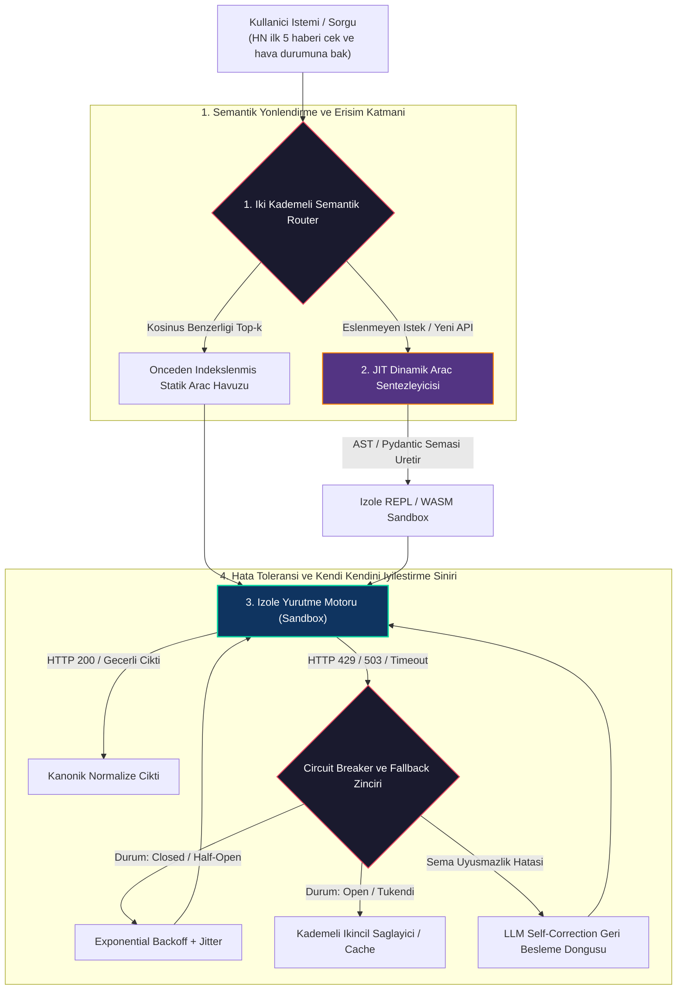
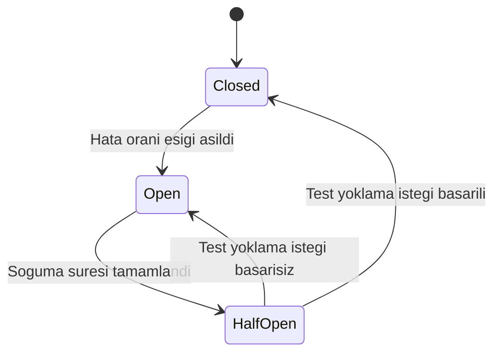

# Day 11: İleri Düzey Araç Kullanımı — Dinamik Araçlar, Araç Yönlendirme ve Hata Yönetimi

<!-- toc -->

<br/>
<br/>

Aşama 1 ve Aşama 2 boyunca (1–10. Günler), statik araç çağırma şemalarını, deterministik fonksiyon çağrımlarını, ReAct döngülerini, durum bilgisi tutan bellek yönetimini ve çoklu ajan koordinasyonunu inceledik.

Otonom sistemler kurumsal prodüksiyon seviyesine geçerken temel bir ölçeklenme darboğazı ile karşılaşılır: **Statik Araç Doygunluğu (Static Tool Saturation)**. Onlarca veya yüzlerce ham OpenAPI fonksiyon şemasını doğrudan istemin bağlam penceresine (context window) yüklemek; ilk token gecikmesini (TTFT) artırır, token bütçesini tüketir ve modelin yanlış araç seçme (misrouting / hallucination) oranını ciddi biçimde yükseltir. Dahası, harici dağıtık servisler doğası gereği kırılgandır (flaky); ağ zaman aşımları (`Timeout`), HTTP `429 Rate Limit` darboğazları ve beklenmeyen şema değişiklikleri sıkça yaşanır.

Bu bölüm; dağıtık zorlu koşullarda %99.99 operasyonel süreklilik sağlamak üzere tasarlanan **Dinamik Araç Sentezi (Dynamic Tool Synthesis)**, **Semantik Araç Yönlendirme (Semantic Tool Routing)** ve **Dayanıklı Hata Yönetim Motorları (Resilient Error-Handling Engines)** mimarisini resmileştirmektedir.

<br/>
<br/>

---

## 1. Mimari Temeller: Araç Yönlendirme ve Dinamik Sentez

Üretim seviyesindeki bir ajan araç katmanı, statik ve sabit kodlanmış fonksiyon sarmalayıcıları olarak değil; aktif, iki aşamalı semantik yönlendirme ve çalışma anı (runtime) derleme sistemi olarak çalışır.

<br/>



<br/>

### 1.1 Üç Çekirdek Alt Sistem

1. **Semantik Araç Router'ı (Dağıtım Katmanı):** Sınırsız bir araç kataloğunu $\mathcal{T} = \lbrace t\_1, t\_2, \dots, t\_N \rbrace$, vektör benzerliği ve hafif niyet sınıflandırmasıyla akıl yürüten LLM'e sunulmadan önce kompakt bir alt kümeye $\mathcal{T}\_{\text{aktif}} \subset \mathcal{T}$ ($|\mathcal{T}\_{\text{aktif}}| \le k$) indirger.
2. **Just-In-Time (JIT) Dinamik Araç Sentezleyicisi:** Daha önce karşılaşılmamış bir veri kaynağı, belgelenmemiş bir uç nokta veya dinamik bir DOM yapısıyla karşılaşıldığında, ajan çalışma anında özel scraping scriptleri veya istemci SDK sarmalayıcıları derler.
3. **Dayanıklı Yürütme Sınırı (Resilient Execution Boundary):** Circuit Breaker (Devre Kesici), Kademeli Sağlayıcı Fallback'leri (Cascading Fallbacks) ve Kapalı Döngü Kendi Kendini Düzeltme (Closed-Loop Self-Correction) gibi savunmacı tasarım kalıplarını işletir.

<br/>
<br/>

---

## 2. Matematiksel Modelleme ve Dayanıklılık Formülasyonları

<br/>

### 2.1 Semantik Araç Yönlendirme ve Skorlama

Bir kullanıcı sorgu embedding'i $\mathbf{e}\_q \in \mathbb{R}^d$ ve araç açıklama embedding'leri havuzu $\mathbf{e}\_{t\_i} \in \mathbb{R}^d$ verildiğinde, anlamsal ilgi skoru normalize edilmiş kosinüs benzerliği ile hesaplanır:

<br/>

$$
\operatorname{Sim}(q, t\_i) = \frac{\mathbf{e}\_q \cdot \mathbf{e}\_{t\_i}}{\Vert \mathbf{e}\_q \Vert \cdot \Vert \mathbf{e}\_{t\_i} \Vert}
$$

<br/>

Bağlam kirliliğini engellemek için, sistem istemine enjekte edilen aktif araç seti $\mathcal{T}\_{\text{aktif}}$, bir $\tau$ kabul eşiğini sağlayan en yüksek $k$ aday ile sınırlandırılır:

<br/>

$$
\mathcal{T}\_{\text{aktif}} = \left\lbrace t\_i \in \mathcal{T} \mid \operatorname{Sim}(q, t\_i) \ge \tau \right\rbrace\_{i=1}^k
$$

<br/>

### 2.2 Rastgele Salınımlı Üstel Gecikme (Exponential Backoff with Jitter)

Geçici ağ hataları veya hız sınırları (`HTTP 429 / 503`) meydana geldiğinde, naif yeniden denemeler *thundering herd* sorununa yol açar. Yeniden deneme gecikmesini tekdüze jitter (stokastik salınım) eklenmiş üstel geri çekilme ile modelleriz:

<br/>

$$
t\_{\text{wait}}(m) = \min\left(t\_{\max}, t\_0 \cdot 2^m + \mathcal{U}(0, J)\right)
$$

<br/>

Burada $m$ sıfır tabanlı deneme sayısı ($m \in [0, M\_{\max}]$), $t\_0$ temel gecikme süresi, $t\_{\max}$ tavan süre ve $\mathcal{U}(0, J)$ çakışmaları önleyen tekdüze stokastik jitter payıdır.

<br/>

### 2.3 Circuit Breaker Üç Durumlu Sonlu Durum Makinesi

Bir harici araç $t$, hata oranı $\lambda\_f$'ye bağlı olarak üç ayrık operasyonel durum $\mathcal{S}\_{\text{CB}} \in \lbrace \text{Closed}, \text{Open}, \text{Half-Open} \rbrace$ arasında geçiş yapar:

<br/>

$$
\lambda\_f = \frac{1}{W} \sum\_{i=1}^W \mathbb{I}(\text{Sonuc}\_i = \text{Hata})
$$

<br/>



<br/>

### 2.4 Kapalı Döngü Şema Kendi Kendini Düzeltme (Self-Correction)

Bir araç çağrımı şema doğrulama hatası fırlattığında (örneğin Pydantic `ValidationError` veya JSON ayrıştırma hatası), hata metni $e\_k$ tek bir adımda LLM'e geri beslenir:

<br/>

$$
\text{Prompt}\_{k+1} = \mathcal{F}\_{\mathrm{correct}}(q, \mathbf{a}\_k, e\_k) \implies \mathbf{a}\_{k+1} = \operatorname{LLM}(\text{Prompt}\_{k+1})
$$

<br/>
<br/>

---

## 3. Temsili Üretim Seviyesi Uygulamalar

<br/>

### 3.1 Circuit Breaker ve Fallback Destekli Dayanıklı Dağıtıcı

Aşağıdaki öz Python uygulaması, kademeli geri çekilme (fallback) yürütmesini ve üstel gecikme mantığını sergilemektedir:

```python
import time, random
from typing import Callable, Any, Dict, Optional

class ResilientToolDispatcher:
    def __init__(self, primary_fn: Callable, fallback_fn: Optional[Callable] = None, max_retries: int = 3):
        self.primary = primary_fn
        self.fallback = fallback_fn
        self.max_retries = max_retries
        self.failure_count = 0
        self.circuit_open_until = 0.0

    def execute(self, params: Dict[str, Any], attempt: int = 0) -> Dict[str, Any]:
        now = time.time()
        # Circuit Breaker: Devre açıksa doğrudan fallback'e yönlendir
        if now < self.circuit_open_until and self.fallback:
            return {"status": "fallback", "data": self.fallback(**params), "circuit": "open"}

        try:
            result = self.primary(**params)
            self.failure_count = 0
            return {"status": "success", "data": result}
        except (ConnectionError, TimeoutError) as err:
            self.failure_count += 1
            if self.failure_count >= 3:
                self.circuit_open_until = now + 60.0  # Devreyi 60 saniye açık tut
            
            if attempt < self.max_retries:
                delay = min(10.0, (1.5 ** attempt) + random.uniform(0.1, 0.4))
                time.sleep(delay)
                return self.execute(params, attempt=attempt + 1)
            
            if self.fallback:
                return {"status": "fallback", "data": self.fallback(**params), "reason": str(err)}
            return {"status": "error", "message": f"Denemeler tükendi: {err}"}
        except ValueError as val_err:
            return {"status": "schema_error", "feedback": str(val_err)}
```

<br/>

### 3.2 İzolasyonlu Kod Üretimi ile Dinamik Araç Sentezi

Ajanın önceden tanımlı aracı olmayan bir web sitesini veya veri kaynağını işlemesi gerektiğinde:

```python
import ast
from typing import Dict, Any, Callable

class DynamicToolFactory:
    @staticmethod
    def synthesize_tool(tool_name: str, python_code: str, required_args: list[str]) -> Callable:
        """Doğrulanmış LLM üretim kodunu çalıştırılabilir bir runtime fonksiyonuna derler."""
        # AST Doğrulaması: Tehlikeli sistem çağrılarını engelle
        tree = ast.parse(python_code)
        for node in ast.walk(tree):
            if isinstance(node, ast.Import) and any(alias.name in ["os", "sys", "subprocess"] for alias in node.names):
                raise PermissionError("Üretilen araç kodunda yasaklı sistem modülü tespit edildi.")

        local_scope: Dict[str, Any] = {}
        exec(compile(tree, filename=f"<dynamic_{tool_name}>", mode="exec"), {}, local_scope)
        
        if tool_name not in local_scope:
            raise KeyError(f"Sentezlenen '{tool_name}' fonksiyonu üretilen kodda bulunamadı.")
            
        return local_scope[tool_name]
```

<br/>
<br/>

---

## 4. Mimari Karşılaştırma: Statik ve Dinamik Araç Yönetimi

<br/>

| Metrik / Boyut | Statik Araç Kaydı | Semantik Araç Router'ı | Dinamik JIT Araç Sentezi |
| :--- | :--- | :--- | :--- |
| **Katalog Kapasitesi** | Maksimum 5 – 15 araç | 1.000+ indeksli araç | Sonsuz (Çalışma anında sentezlenir) |
| **Prompt Token Yükü** | $O(N)$ (Doğrusal büyür) | $O(k)$ (Kesinlikle sınırlı) | $O(1)$ (Yalnızca üretim sonrası eklenir) |
| **Yanlış Araç Seçim Oranı** | Büyük kataloglarda yüksek | Düşük (Vektör filtreli) | Sıfır (İsteğe özel derlenmiş mantık) |
| **Hata / Çökme Toleransı** | Kırılgan (Hata anında durur) | Kademeli Fallback ve Devre Kesici | Adaptif kod yeniden üretimi |
| **Yürütme Güvenliği** | Statik yerel güven | Ön onaylı katalog güveni | Sandbox / AST izolasyonu zorunlu |

<br/>
<br/>

---

## 5. Özet ve Kritik Mühendislik Çıkarımları

<br/>

> **Kritik Mimari Çıkarım:** Dağıtık sistemlerde güvenilir otonom ajan performansı, üçüncü parti API'ların asla çökmeyeceğini umarak elde edilmez. Semantik ön filtreleme, üç durumlu devre kesiciler, şema düzeltme geri beslemesi ve sandbox ortamında dinamik araç sentezi gibi yapısal dayanıklılık mekanizmaları ile elde edilir.

* **Bağlam Verimliliği:** LLM'e asla sınırsız API listesi vermeyin; iki kademeli vektör eşleştirmesi ile dinamik route edin.
* **Kademeli Güvenilirlik:** Kanonik veri adaptörleri ile birincil, ikincil ve bayat önbellek (stale-cache) fallback zincirleri kurun.
* **CodeAct Güvenliği:** Çalışma anında üretilen dinamik araçlar kesinlikle AST doğrulamasından geçmeli ve izole WASM / micro-container sandbox'larında yürütülmelidir.

<br/>
<br/>

---

## 6. Resmi Challenge Soruları ve Mimari Çözümler

<br/>

<details>
  <summary><strong>Challenge 1: Junior Mühendislere Tool Router Kavramının Anlatımı</strong></summary>
  <br/>

  ### Problem Tanımı
  *Bir yapay zeka ajanındaki 'Tool Router' (Araç Yönlendirici) kavramını, karmaşık matematiksel terimlere boğulmadan bir junior geliştiriciye nasıl açıklarsınız?*

  ### Mimari Çözüm: Merkezi Santral (Switchboard) Analojisi

  <br/>

  ```mermaid
  flowchart LR
      Caller["Gelen Musteri Talebi<br/>(Para iadesi nasil alabilirim?)"] --> Switchboard["Merkezi Santral (Tool Router)"]
      Switchboard -->|"Niyeti Siniflandirir"| DeptA["1. Departman: Fatura ve Iade (Arac Seti A)"]
      Switchboard -.->|Gozardi Edilir| DeptB["2. Departman: Kargo ve Lojistik (Arac Seti B)"]
      Switchboard -.->|Gozardi Edilir| DeptC["3. Departman: Guvenlik ve Giris (Arac Seti C)"]

      style Switchboard fill:#e94560,stroke:#fff,stroke-width:2px,color:#fff
      style DeptA fill:#0f3460,stroke:#06d6a0,stroke-width:2px,color:#fff
  ```

  <br/>

  #### 1. Santral Metaforu:
  500 farklı uzman departmanı olan dev bir şirket hayal edin. Eğer santral görevlisi gelen her müşteriyi aynı anda 500 departmana birden bağlasaydı tam bir kaos ve devasa telefon faturaları ortaya çıkardı. **Tool Router**, akıllı bir resepsiyonist gibi davranır: Kullanıcının talebini dinler, niyeti departman açıklamalarıyla hızlıca eşleştirir ve kullanıcıyı yalnızca ilgili 2 veya 3 araç uzmanına yönlendirir.

  #### 2. Sağladığı Avantajlar:
  * **Maliyet ve Hız:** LLM yalnızca gerçekten ihtiyaç duyduğu araçların tariflerini okur; yanıt süresi %80'e varan oranda kısalır.
  * **Keskin Doğruluk:** Seçenek sayısı azaldığında ajanın yanlış aracı arama ihtimali neredeyse sıfırlanır.
</details>

<br/>

<details>
  <summary><strong>Challenge 2: Kırılgan (Flaky) Harici API'lar İçin Çok Kademeli Hata Yönetimi</strong></summary>
  <br/>

  ### Problem Tanımı
  *Sık sık 503 servis kesintisi ve 429 hız sınırı hatası veren bir hava durumu veya borsa API'ı kullanan bir ajan için prodüksiyon kalitesinde bir hata toleransı stratejisi tasarlayın.*

  ### Mimari Çözüm: Kademeli Fallback ve Circuit Breaker Şelalesi

  <br/>

  ```mermaid
  flowchart TD
      Req["API Talebi: GetWeather(Istanbul)"] --> Primary["1. Birincil Saglayici (OpenWeather)"]
      
      Primary -->|Basarili 200| Normalizer["Kanonik Sema Normalizasyonu"]
      Primary -->|503 veya 429 Hatasi| BreakerCheck{"Circuit Breaker Durumu"}
      
      BreakerCheck -->|Kapali / Normal| Retry["Exponential Backoff with Jitter"]
      Retry -->|Basarili| Normalizer
      Retry -->|Tukendi| Secondary["2. Ikincil Saglayici (WeatherAPI)"]
      
      BreakerCheck -->|Acik / Devre Disi| Secondary
      Secondary -->|Basarili 200| Normalizer
      Secondary -->|Basarisiz| Cache["3. Stale-While-Revalidate Cache"]
      Cache --> Out["Uyarili Kismi Yanit"]
      Normalizer --> Out

      style Primary fill:#1a1a2e,stroke:#e94560,stroke-width:2px,color:#fff
      style Secondary fill:#0f3460,stroke:#4cc9f0,stroke-width:2px,color:#fff
      style Cache fill:#533483,stroke:#f77f00,stroke-width:2px,color:#fff
      style Normalizer fill:#0f3460,stroke:#06d6a0,stroke-width:2px,color:#fff
  ```

  <br/>

  #### 1. Circuit Breaker Entegrasyonu:
  Ardışık 503 hataları devre kesiciyi $T\_{\text{cool}} = 60\text{s}$ boyunca `Open` durumuna geçirir. Sonraki istekler birincil sağlayıcının zaman aşımını beklemeden doğrudan ikincil sağlayıcıya akar.

  #### 2. Kanonik Normalizasyon (Schema Normalizer):
  Farklı sağlayıcılar heterojen JSON anahtarları döner (örneğin Kelvin `main.temp` ile Celsius `current.temp_c`). Standart bir adaptör tüm veriyi birleşik Pydantic modeline dönüştürerek ajana aktarır.

  #### 3. Stale-While-Revalidate ile Zarif Gerileme (Graceful Degradation):
  Tüm canlı sağlayıcılar çökse dahi ajan kullanıcıya *"14 dakika önceki önbellek verisine göre hava 22°C"* diyerek kesintisiz yanıt üretir.
</details>

<br/>

<details>
  <summary><strong>Challenge 3: JIT Web Scraping ve Dinamik Araç Sentezi (Browser-Use vs Sandboxed REPL)</strong></summary>
  <br/>

  ### Problem Tanımı
  *Otonom bir ajan, önceden indekslenmemiş bir web sitesinden (örneğin Hacker News ilk 5 haber ve puanı) yapılandırılmış veri çekmek için nasıl dinamik bir araç üretir, doğrular ve çalıştırır?*

  ### Mimari Çözüm: Hibrit Browser-Use ve CodeAct Yürütmesi

  <br/>

  ```mermaid
  flowchart TD
      Query["Kullanici: 'HN en populer 5 haberi puanlariyla cek'"] --> Inspector{"Inceleme Stratejisi"}
      
      Inspector -->|Dinamik SPA veya Oturum Gerektiren| BrowserUse["Browser-Use / CDP Ajani<br/>(DOM'da gezinir, tiklar, gorsel inceler)"]
      Inspector -->|Statik veya Hafif Veri| CodeAct["CodeAct Sentezleyici<br/>(HTML ceker, secicileri bulur, script yazar)"]
      
      CodeAct --> AST["AST Guvenlik Dogrulayici<br/>(os, subprocess, eval engeller)"]
      AST --> Sandbox["Izole Python Sandbox (e2b / WASM)"]
      Sandbox --> Execution["Calistirir: BeautifulSoup4 cikarimi"]
      
      BrowserUse --> Data["Yapilandirilmis JSON Verisi"]
      Execution --> Data
      Data --> AgentOutput["Ajan Formatlanmis Ciktiyi Sunar"]

      style CodeAct fill:#0f3460,stroke:#06d6a0,stroke-width:2px,color:#fff
      style BrowserUse fill:#533483,stroke:#f77f00,stroke-width:2px,color:#fff
      style Sandbox fill:#1a1a2e,stroke:#e94560,stroke-width:2px,color:#fff
  ```

  <br/>

  #### 1. Modern Browser-Use ve CDP Gezinimi:
  Dinamik tek sayfa uygulamaları (SPA) veya etkileşim gerektiren siteler için ajan Chrome DevTools Protocol (CDP) veya görsel tarayıcı ajanlarını (Playwright / Stagehand) kullanarak doğrudan Erişilebilirlik Ağacı (Accessibility Tree) üzerinden veri toplar.

  #### 2. JIT Script Sentezi (CodeAct Paradigması):
  Hafif statik sayfalar için ajan ham HTML'i çeker, dahili kodlayıcı modeli ile CSS seçicilerini (`.titleline > a`, `.score`) belirler ve atomik bir Python çıkarım scripti yazar.

  #### 3. Sandbox Güvenlik Sınırı:
  Üretilen script Python Soyut Sözdizim Ağacı (`ast`) ile taranarak tehlikeli sistem çağrıları (`os`, `sys`, `socket`) engellenir ve yalnızca izole edilmiş güvenli konteyner / WASM çalışma alanında çalıştırılır.
</details>
