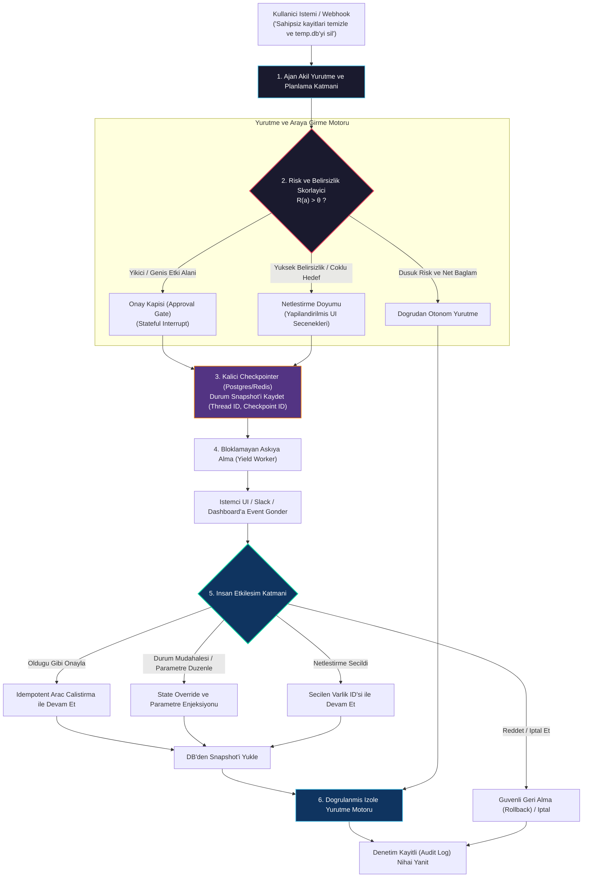
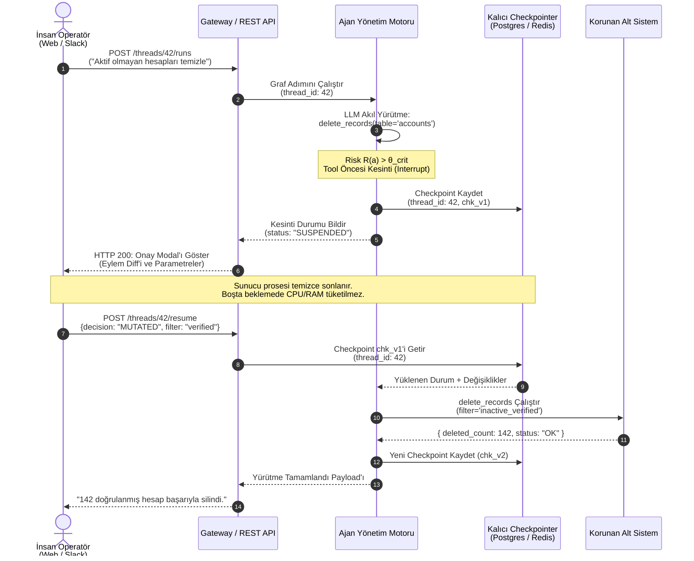
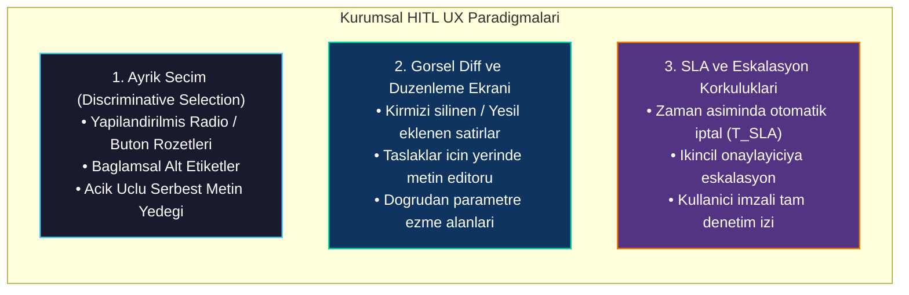

# İnsan Denetiminde Ajan İş Birliği (Human-in-the-Loop - HITL)

<!-- toc -->

<br/>
<br/>

Önceki temel bölümler boyunca çekirdek ajan akıl yürütme kalıplarını, çoklu ajan koordinasyonunu ve dayanıklı dinamik araç çağırma mekanizmalarını inceledik. Otonom sistemler kurumsal prodüksiyon seviyesine adım attığında mutlak bir güvenilirlik sınırına ulaşılır: **Yüksek Etki Alanında Sınırsız Otonomi Riski (Unconstrained Autonomy Under High Blast Radius)**.

Yıkıcı eylemleri (veritabanı kayıtlarının silinmesi, yüksek meblağlı finansal transferler, toplu müşteri e-postaları veya altyapı konfigürasyon değişiklikleri) bütünüyle olasılıksal (probabilistic) çalışan LLM'lere devretmek, kabul edilemez operasyonel ve regülasyon riskleri doğurur.

Bu bölüm; **Durum Bilgisi Tutan Kesintiler (Stateful Interrupts)**, **Deterministik Durum Kaydı (Checkpointing)**, **Ayrık Netleştirme Döngüleri (Discriminative Clarification Loops)** ve **Çalışma Anı Durum Müdahale Motorları (State Override Engines)** üzerinden **İnsan Denetiminde (Human-in-the-Loop - HITL)** ajan iş birliği mimarisini resmileştirmektedir.

<br/>
<br/>

---

## 1. Mimari Temeller: Otonomi Spektrumu ve HITL

İnsan denetimi (HITL), yetersiz modellere yönelik geçici bir yama değil; olasılıksal akıl yürütme ile deterministik sistem yürütmesi arasındaki durum geçişlerini yöneten temel bir mimari tasarım desenidir.

<br/>



<br/>

### 1.1 Otonom Sistemlerde 5 Seviye (Autonomy Tiers)

| Seviye | Otonomi Düzeyi | İnsanın Rolü | Tipik Uygulama Alanları |
|---|---|---|---|
| **L1** | Doğrudan Scripting / Araç Sarmalayıcıları | Her adımı tetikler | Deterministik CLI araçları, standart scriptler. |
| **L2** | AI Co-Pilot / Öneri Temelli | Her öneriyi satır satır inceler | Kod tamamlama, doküman taslağı hazırlama. |
| **L3** | **İnsan Onay Kapısı (Hedef HITL)** | **Kritik/Yıkıcı adımları onaylar/düzenler** | **Veritabanı işlemleri, e-posta gönderimi, bulut dağıtımları.** |
| **L4** | İstisnalarda Otonom | Yalnızca hata/anomali durumunda müdahale eder | Veri çıkarma hatları, otomatik birim test koşumları. |
| **L5** | Tam Otonomi | Yalnızca geriye dönük log denetimi | Düşük riskli indeksleme, izole oyun simülasyonları. |

<br/>

### 1.2 Dört Temel HITL Deseni

1. **Yürütme Öncesi Onay Kapıları (Pre-Execution Approval Gates):** Ajan, geri döndürülemez bir araç çağrısından hemen önce durur; onay için kullanıcıya önizleme diff'i veya parametre özeti sunar.
2. **Netleştirme Döngüleri (Clarification Loops / Disambiguation):** Doğal dilde belirsizlik (örn: aynı isimde 3 çalışan, belirsiz tarihler) olduğunda ajan tahmin yürütmek yerine yapılandırılmış seçenekler sunar.
3. **Durum Müdahalesi ve Plan Düzenleme (State Override & Plan Mutation):** İnsan, ajanın önerdiği argümanları veya bellek değişkenlerini yürütme başlamadan önce doğrudan arayüzden düzeltebilir.
4. **Yürütme Sonrası Geri Besleme (Post-Execution Feedback / Active Learning):** İnsan kullanıcılar hatalı çıktıları etiketler; bu geri bildirimler uzun vadeli epizodik belleğe gömülerek modelin kendini iyileştirmesi sağlanır.

<br/>
<br/>

---

## 2. Matematiksel Modelleme: Risk Eşikleri ve Varlık Belirsizliği

<br/>

### 2.1 Bileşik Eylem Risk Formülasyonu

Ajan, $\mathcal{C}$ bağlamı altında önerilen her $a$ eylemi için bileşik bir risk skoru $R(a)$ hesaplar:

<br/>

$$
R(a) = \Big(1 - \mathbb{P}\big(\text{Confidence}(a) \mid \mathcal{C}\big)\Big) \cdot \operatorname{Impact}(a) + \lambda \cdot \operatorname{Irreversibility}(a)
$$

<br/>

Burada:
- $\mathbb{P}\big(\text{Confidence}(a) \mid \mathcal{C}\big) \in [0, 1]$: Ajanın kalibrasyon güven skoru.
- $\operatorname{Impact}(a) \in [0, 1]$: Eylemin etki yarıçapı (mali maliyet, etkilenecek kayıt sayısı).
- $\operatorname{Irreversibility}(a) \in [0, 1]$: Geri alma işleminin imkansızlığı veya maliyeti.
- $\lambda \in [0, 1]$: Sistemin genel riskten kaçınma katsayısı.

<br/>

### 2.2 Dinamik Karar Sınırı

<br/>

$$
\pi_{\text{exec}}(a) = 
\begin{cases} 
\text{Otonom Yürütme} & \text{eğer } R(a) \le \theta_{\text{auto}} \\\\
\text{Netleştirme Döngüsü (Disambiguate)} & \text{eğer } \theta_{\text{auto}} < R(a) \le \theta_{\text{crit}} \land \mathcal{H}(E \mid q) > \epsilon \\\\
\text{Onay Kapısı (Stateful Interrupt)} & \text{eğer } R(a) > \theta_{\text{crit}} 
\end{cases}
$$

<br/>

### 2.3 Belirsizlik Metriği: Varlık Eşleme Entropisi

Kullanıcı sorgusu $q$, bir varlık aday kümesine $E = \lbrace e\_1, e\_2, \dots, e\_M \rbrace$ işaret ettiğinde belirsizlik Shannon entropisi ile ölçülür:

<br/>

$$
\mathcal{H}(E \mid q) = -\sum\_{i=1}^M p(e\_i \mid q) \log\_2 p(e\_i \mid q)
$$

<br/>

- Eğer $\mathcal{H}(E \mid q) = 0$ ($M=1$) ise, deterministik tek bir eşleşme vardır; ajan kesintisiz yürütmeye devam eder.
- Eğer $\mathcal{H}(E \mid q) > \epsilon$ ise, yüksek entropi nedeniyle tahmin yürütmek yasaklanır; ajan yapılandırılmış seçim butonları üretir.

<br/>
<br/>

---

## 3. Sistem Mimarisi: Checkpointing ve Bloklamayan Durum Makineleri

Acemi HITL uygulamalarında en sık yapılan hata, sunucu thread'lerini `sleep()` veya açık HTTP bağlantılarıyla bekletmektir. İnsanın onay vermesi 4 saat sürerse bellek sızıntıları (memory leak), bağlantı zaman aşımları ve konteyner yeniden başlatmaları ajanın durumunu kalıcı olarak bozar.

<br/>



<br/>

### 3.1 Üretim Seviyesinde HITL İlkeleri

1. **Durumsuz (Stateless) Worker'lar:** Worker süreçleri, durum veritabanına yazıldıktan hemen sonra sonlanmalıdır. Böylece insan incelemesi sırasında sunucu kaynakları sıfıra ölçeklenebilir (scale-to-zero).
2. **Deterministik Durum Yükleme:** Checkpoint şemaları; konuşma dökümünü, bekleyen araç çağrılarını ve soy ağacı sürümünü ($v\_1 \to v\_2$) eksiksiz barındırmalıdır.
3. **Atomik Durum Müdahalesi (Plan Mutation):** Devam ettirme (`resume`) uç noktası, parametre güncellemelerini kabul etmeli ve aracı çalıştırmadan önce şema doğrulaması yapmalıdır.

<br/>
<br/>

---

## 4. Üretim Mimarisi: Duraklat ve Devam Et (Pause-and-Resume) Motoru

HITL'in çekirdek teknik uygulaması **düğüm öncesi araya girme (pre-node interception)** ve **durum kaydından devam etme (checkpoint resumption)** etrafında şekillenir. Üretim sistemleri rastgele yapıştırıcı kodlar yerine açık kesinti sınırları olan durum grafları derler:

<br/>

```python
from typing import TypedDict, Optional, Any
from langgraph.graph import StateGraph, END
from langgraph.checkpoint.memory import MemorySaver

class AgentWorkflowState(TypedDict):
    action: str
    target_resource: str
    is_destructive: bool
    human_approved: Optional[bool]
    human_override_args: Optional[dict[str, Any]]
    result: Optional[str]

def plan_action(state: AgentWorkflowState) -> AgentWorkflowState:
    return {"action": "DROP_TABLE", "target_resource": "users_v1", "is_destructive": True}

def destructive_gate(state: AgentWorkflowState) -> AgentWorkflowState:
    if state["is_destructive"] and not state.get("human_approved"):
        raise PermissionError("Guvenlik politikasi ihlali: Onaysiz yikici yurutme durduruldu.")
    
    target = state.get("human_override_args", {}).get("target_resource", state["target_resource"])
    return {"result": f"{target} uzerinde {state['action']} islemi guvenle calistirildi"}

# Yurutme kesintili graf derlemesi
workflow = StateGraph(AgentWorkflowState)
workflow.add_node("plan", plan_action)
workflow.add_node("execute", destructive_gate)
workflow.set_entry_point("plan")
workflow.add_edge("plan", "execute")
workflow.add_edge("execute", END)

# Yurutmeyi kesin olarak yikici aractan hemen once durdur
app = workflow.compile(checkpointer=MemorySaver(), interrupt_before=["execute"])
```

<br/>
<br/>

---

## 5. Kurumsal UX / UI Tasarım Kalıpları

<br/>



<br/>

### 5.1 Ayrık Seçim vs Açık Uçlu Girişler

- **Problem:** Kullanıcıya açık uçlu soru sormak (*"Hangi Ahmet'i kastettiniz?"*), modeli yeni bir belirsiz doğal dil ayrıştırma döngüsüne sokar.
- **Çözüm:** Kullanıcıya ayırt edici nitelikleri (departman, e-posta, ID) olan butonlar sunulur. Listedeki seçenekler uymuyorsa tek bir serbest metin alanı emniyet supabı olarak tutulur.

### 5.2 Görsel Diff ve Çalışma Anı Parametre Müdahalesi

Oluşturulan çıktılarda (e-posta taslağı, SQL scripti, PR açıklaması), arayüz Git tarzı bir diff sunmalıdır. Kullanıcı doğrudan metin üzerinde düzenleme yapabilmeli; **"Düzenleyerek Onayla"** tıklandığında güncel içerik planlama döngüsünü baştan başlatmadan ajanın durumuna enjekte edilmelidir.

### 5.3 SLA Zaman Aşımları ve Eskalasyon Matrisi

Onay bekleyen işlemler sistem kaynaklarını belirsiz süre rehin almamalıdır:
- **T_SLA (Zaman Aşımı):** Belirlenen süre (örn: 60 dakika) içinde yanıt gelmezse işlem otomatik olarak `TIMEOUT_ABORT` ile sonlandırılır.
- **Eskalasyon:** Kritik alarm durumlarında yanıtlanmayan kesintiler nöbetçi mühendise veya ikincil yönetici kanalına iletilir.

<br/>
<br/>

---

## 6. İnteraktif Challenge Çözümleri

<br/>

<details>
  <summary><strong>Challenge 1: Trade-Off Analizi — Tam Otonomi vs İnsan Denetimi (HITL)</strong></summary>
  <br/>

  ### Problem Tanımı
  *Tam Otonom Ajan (L5) ile İnsan Denetimli Ajan Mimarisi (L3/L4) arasındaki gecikme, operasyonel maliyet, yasal sorumluluk ve kullanıcı güveni trade-off'larını kurumsal sistemler açısından karşılaştırınız.*

  ### Mimari Karşılaştırma Matrisi

  | Boyut | Tam Otonom Ajan (L5) | İnsan Denetimli Sistem (L3/L4) |
  |---|---|---|
  | **Uçtan Uca Gecikme (Latency)** | **Gerçek Zamanlıya Yakın ($< 5\text{s}$)**; yalnızca LLM çıkarımı ve API çağrılarıyla sınırlı. | **Asenkron ($T\_{\text{insan}} \in [10\text{s}, 24\text{saat}]$)**; bloklamayan checkpoint durum depolaması gerektirir. |
  | **Operasyonel Maliyet** | Düşük iş gücü maliyeti; ancak halüsinasyon durumunda yüksek finansal/altyapısal zarar riski. | Düşük insan emeği ek yükü; onay kapıları sayesinde sıfıra yakın felaket maliyeti. |
  | **Hata Etki Alanı (Blast Radius)** | **Sınırsız**; halüsinasyonlu tek bir SQL parametresi canlı veritabanını silebilir. | **Onaylanan Kapsamla Sınırlı**; yıkıcı işlemler kullanıcı imzası olmadan tetiklenemez. |
  | **Kullanıcı Güveni ve Uyum** | Başlangıçta düşük güven; kapalı kutu kararlar kurumsal adaptasyonu zorlaştırır. | **Yüksek Güven**; kullanıcı denetimi elinde tutar ve şeffaf doğrulamayı izler. |
  | **Altyapı Karmaşıklığı** | Basit durumsuz senkron yürütme hatları. | Olay güdümlü (event-driven) durum makineleri, kalıcı checkpointer'lar ve webhook bildirim hatları. |

  #### Staff Engineer Tavsiyesi:
  L5 otonomiyi yalnızca salt-okunur (read-only) analiz, önbellekleme ve izole simülasyonlarda kullanın. Yazma veya değişiklik yetkisi olan tüm araç çağrılarında L3/L4 onay kapılarını zorunlu kılın.
</details>

<br/>

<details>
  <summary><strong>Challenge 2: E-Posta Gönderimi Onay Akışı ve Canlı Metin Düzenleme</strong></summary>
  <br/>

  ### Problem Tanımı
  *CRM verilerine dayanarak müşteri e-postası taslağı oluşturan, onay için duraklayan, insan incelemecinin metni düzenlemesine olanak tanıyan ve nihai e-postayı güvenle gönderen uçtan uca bir ajan akışı tasarlayınız.*

  ### Mimari İş Akışı

  <br/>

  ```mermaid
  flowchart TD
      Inbound["CRM Event: Sozlesme Yenileme Yaklasiyor"] --> Drafter["1. Ajan E-posta Taslagi Uretir<br/>Alici: musteri@sirket.com<br/>Konu: Yenileme Sartlari<br/>Govde: Teklif edilen fiyat ve tarihler"]
      
      Drafter --> CheckpointSave["2. Checkpoint Kaydet (thread_id: 88, status: ONCE_INCELEME)"]
      CheckpointSave --> RenderUI["3. Zengin Metin Editoru ile Inceleme Ekranini Goster"]
      
      RenderUI --> HumanChoice{"Insan Inceleme Karari"}
      
      HumanChoice -->|Dogrudan Onayla| DispatchOriginal["Orijinal Taslagi SendGrid ile Gonder"]
      HumanChoice -->|Metni / Fiyati Duzenle| MutatePayload["State Override: Guncel Govde ve Fiyati Enjekte Et"]
      HumanChoice -->|Reddet / Iptal| CancelState["State Guncelle: IPTAL_EDILDI"]
      
      MutatePayload --> DispatchMutated["Duzenlenmis Taslagi SendGrid ile Gonder"]
      
      DispatchOriginal --> Complete["4. CRM'i Guncelle ve Audit Log Yaz"]
      DispatchMutated --> Complete
      CancelState --> LogCancel["Reddedilme Nedenini Hafizaya Kaydet"]

      style Drafter fill:#1a1a2e,stroke:#4cc9f0,stroke-width:1.5px,color:#fff
      style RenderUI fill:#0f3460,stroke:#06d6a0,stroke-width:2px,color:#fff
      style MutatePayload fill:#533483,stroke:#f77f00,stroke-width:2px,color:#fff
      style Complete fill:#0f3460,stroke:#4cc9f0,stroke-width:1.5px,color:#fff
  ```

  <br/>

  #### Çekirdek Uygulama Protokolü:
  1. **Taslak Üretimi ve Parametre Dondurma:** Ajan, katı bir şema (`alici`, `konu`, `html_govde`, `cc_list`) ile doğrulanan bir e-posta üretir.
  2. **Bloklamayan Kesinti:** Orkestratör durumu checkpointer'a yazar ve yönetim paneline webhook gönderir.
  3. **Durum Müdahalesi ile Gönderim:** İncelemeci arayüzde metni değiştirirse API durum müdahale payload'ı gönderir. Checkpointer ajanın orijinal akıl yürütme izini koruyarak yalnızca `html_govde` alanını ezer ve gönderim düğümünü tetikler.
</details>

<br/>

<details>
  <summary><strong>Challenge 3: Yapılandırılmış Seçeneklerle Belirsizlik Giderme ve Yıkıcı İşlem Kapısı</strong></summary>
  <br/>

  ### Problem Tanımı
  *Kullanıcı ajana 'Ahmet'in log arşivini sil' talimatı verir. Veritabanında Ahmet adında 3 kullanıcı (DevOps, Frontend, QA) vardır. İki aşamalı netleştirme ve onay kapısı mekanizmasını kurgulayınız.*

  ### Mimari Çözüm: İki Kademeli Netleştirme ve Onay Kapısı

  <br/>

  ```mermaid
  flowchart TD
      Query["Kullanici: 'Ahmet'in log arsivini sil'"] --> Search["1. Kullanici Rehberi API Sorgusu: 'Ahmet'"]
      Search --> MatchCount{"Eslesme Sayisi (M)"}
      
      MatchCount -->|M == 1| SingleMatch["Dogrudan Hedef Cozumleme"]
      MatchCount -->|M > 1| AmbiguityDetected["2. Belirsizlik Tespit Edildi (M=3)<br/>Entropi H(E|q) > ε"]
      
      AmbiguityDetected --> GenChoices["Yapilandirilmis Secim Payload'i Uret<br/>• Ahmet Yilmaz (DevOps, ID: 101)<br/>• Ahmet Kaya (Frontend, ID: 102)<br/>• Ahmet Demir (QA, ID: 103)<br/>• Ozel Metin Girisi Fallback"]
      
      GenChoices --> Interrupt1["Grafi Askıya Al: Netlestirme Bekleniyor"]
      Interrupt1 --> UserPicks["Kullanici Secer: Ahmet Yilmaz (ID: 101)"]
      
      UserPicks --> ResumeDisambig["3. Hedef ID (101) ile Grafi Devam Ettir"]
      SingleMatch --> ResumeDisambig
      
      ResumeDisambig --> DestructiveGate{"4. Yikici Eylem Kontrolu<br/>Aksiyon: LOG_ARSIVI_SIL"}
      DestructiveGate --> Interrupt2["Grafi Askıya Al: Onay Kapisi<br/>'Ahmet Yilmaz (101) ait tum arsiv silinecek. Onayliyor musunuz?'"]
      
      Interrupt2 --> HumanConfirm{"Insan Onayi"}
      HumanConfirm -->|Onaylandi| ExecDelete["S3 / Storage Uzerinde Silme Aracini Calistir"]
      HumanConfirm -->|Iptal Edildi| Abort["Islemi Guvenle Iptal Et"]

      style AmbiguityDetected fill:#1a1a2e,stroke:#e94560,stroke-width:2px,color:#fff
      style GenChoices fill:#533483,stroke:#f77f00,stroke-width:1.5px,color:#fff
      style DestructiveGate fill:#1a1a2e,stroke:#e94560,stroke-width:2px,color:#fff
      style ExecDelete fill:#0f3460,stroke:#06d6a0,stroke-width:2px,color:#fff
  ```

  <br/>

  #### Mühendislik İncelikleri:
  1. **Ayrık Seçim Sunumu:** Ajan açık uçlu soru sormaz; ayırt edici kurumsal metaveriler (Departman, Çalışan ID, E-posta) içeren seçim butonları sunar.
  2. **Çift Kademeli Güvenlik:** 1. Aşama (Netleştirme) *hedef kimlik belirsizliğini* çözer; 2. Aşama (Onay Kapısı) *yetkilendirme ve etki alanı teyidini* sağlar.
  3. **Değiştirilemez Denetim Kaydı:** Nihai log, hem onaylayan kullanıcının kimliğini hem de seçilen varlık token'ını regülasyon uyumluluğu için saklar.
</details>
