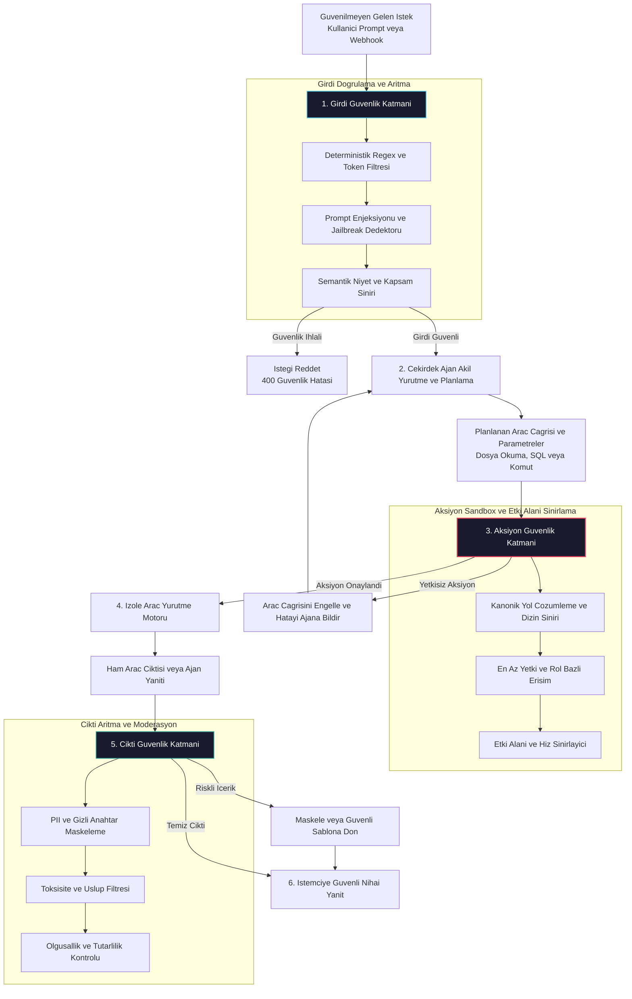

# Ajan Güvenliği: Guardrails ve İçerik Moderasyonu

<!-- toc -->

<br/>
<br/>

Prodüksiyon ortamlarında otonom ajanlar; güvenilmeyen harici kullanıcı girdileri, kurumsal veritabanları, yerel dosya sistemleri ve üçüncü taraf API'lar ile doğrudan etkileşim halindedir. Bu sistemlerin karar mekanizmaları olasılıksal (probabilistic) çalışan büyük dil modellerine dayandığı için geleneksel deterministik yazılımlardan çok daha farklı ve karmaşık bir saldırı yüzeyine (attack surface) sahiptirler.

Sistem istemleri (System Prompts) ne kadar ayrıntılı yazılırsa yazılsın, tek başına bir güvenlik kalkanı oluşturamaz. Düşmanca kurgulanmış bağlamlar (adversarial framing), özel belirteç manipülasyonları, dil değiştirme hileleri ve çok adımlı sosyal mühendislik teknikleri ile sistem direktifleri kolayca saf dışı bırakılabilir. Bu nedenle kurumsal seviyede güvenilir bir ajan mimarisi, **Derinlemesine Savunma (Defense-in-Depth - DiD)** yaklaşımını zorunlu kılar: Ajan akıl yürütmeye başlamadan önce, araç çalıştırma anında ve nihai çıktı istemciye iletilmeden önce devreye giren bağımsız, deterministik ve doğrulanabilir güvenlik katmanları.

Bu bölüm; **Girdi Niyet Doğrulaması**, **Araç ve Aksiyon İzolasyonu (Sandboxing & Path Traversal Koruması)**, **Çıktı PII (Kişisel Veri) Maskelemesi ve İçerik Moderasyonu** mimarisini ve kurumsal güvenlik stratejilerini detaylandırmaktadır.

<br/>
<br/>

---

## 1. Mimari Temeller: Çok Katmanlı Savunma (Defense-in-Depth)

Ajan güvenliği tek bir açma/kapama filtresi olarak kurgulanamaz. Sistem; olasılıksal akıl yürütme hattının her aşamasında farklı bir güvenlik garantisi sunan soğan zarı modeline (onion architecture) dayanmalıdır.

<br/>



<br/>

### 1.1 Ajan Tehdit Taksonomisi (OWASP Agentic Risks)

Otonom ajanların karşı karşıya olduğu tehditler, salt dil modeli zafiyetlerinin çok ötesindedir. Ajanların işletim sistemi, veritabanları ve harici ağlar üzerinde işlem yapabilme yetkisi (agency), bu zafiyetlerin yıkıcı sonuçlar doğurmasına yol açar:

1. **Doğrudan Prompt Enjeksiyonu (Direct Prompt Injection / Jailbreaking):**  
   Kullanıcının, modelin geliştirici tarafından tanımlanmış rolünü, güvenlik kısıtlamalarını ve sistem talimatlarını unutmasını sağlamak amacıyla kurguladığı saldırılardır. Saldırgan, özel belirteçler (`[SYSTEM]`, `### Instruction`) veya varsayımsal senaryolar ("Rol yapma oyunu oynuyoruz...") kullanarak modeli manipüle eder.

2. **Dolaylı Prompt Enjeksiyonu (Indirect Prompt Injection):**  
   Ajan sistemlerindeki en sinsi ve tehlikeli tehdit türüdür. Ajanın internetten çektiği bir web sayfasında, kullanıcının yüklediği bir PDF dosyasında veya gelen bir e-postada gizlenmiş zararlı talimatlar bulunur. Kullanıcı masum bir istekte bulunsa dahi (örneğin *"Gelen son e-postayı özetle"*), ajanın okuduğu e-posta gövdesindeki komutlar ajanın kontrolünü ele geçirerek hassas dosyaları saldırganın sunucusuna göndermesine neden olabilir.

3. **Aşırı Yetki ve Dizin Aşımı (Excessive Agency & Path Traversal):**  
   Ajanlara ihtiyaç duyduklarından daha geniş sistem izinleri verilmesi durumudur. Örneğin yalnızca belirli bir çalışma klasörünü düzenlemesi gereken bir kodlama asistanının, `../../../../Windows/System32` veya `/etc/shadow` yollarına erişebilecek araç parametrelerini çalıştırabilmesi felaketle sonuçlanabilir.

4. **Hassas Bilgi İfşası (PII & Secret Disclosure):**  
   Eğitim verilerinden, çalışma anındaki bellekten (Memory/RAG) veya sistem çevre değişkenlerinden elde edilen API anahtarları, şifreler ya da müşteri kimlik bilgilerinin model çıktısında açıkça paylaşılmasıdır.

---

## 2. Ajan Güvenliğinin Matematiksel ve Mantıksal Temelleri

Güvenlik mekanizmaları rastgele kurallara değil, sistem durum geçişlerinde her an doğrulanabilir matematiksel değişmezlere (invariants) dayanmalıdır.

<br/>

### 2.1 Girdi Güvenlik Skoru Formülasyonu

Gelen herhangi bir $x$ istek metni için girdi güvenlik skoru $S_{\text{input}}(x)$, üç bağımsız savunma mekanizmasının birleşik risk değerlendirmesiyle hesaplanır:

<br/>

$$
S\_{\text{input}}(x) = 1 - \max \Big( H(x), \max\_{v \in \mathbf{E}\_{\text{jail}}} \cos(\mathbf{e}\_x, \mathbf{e}\_v), P\_{\text{malicious}}(x) \Big)
$$

<br/>

Burada bileşenlerin anlamı şunlardır:
- $H(x) \in [0, 1]$: Bilinen kötü niyetli kalıplara ve token dizilimlerine dayalı deterministik sezgisel risk skoru.
- $\cos(\mathbf{e}\_x, \mathbf{e}\_v)$: İstemin semantik gömme vektörü $\mathbf{e}\_x$ ile daha önceden kataloglanmış jailbreak vektörleri kümesi $\mathbf{E}\_{\text{jail}}$ arasındaki kosinüs benzerliği.
- $P\_{\text{malicious}}(x) \in [0, 1]$: Bağımsız ve hafif bir güvenlik sınıflandırıcısının (Guard Model) ürettiği kötü niyet olasılığı.

Girdinin ajanın akıl yürütme motoruna iletilmesi için hesaplanan güvenlik skoru tanımlanan eşik değerini sağlamalıdır: $S\_{\text{input}}(x) \ge \tau\_{\text{safe}}$.

<br/>

### 2.2 Aksiyon Sınırlandırması ve Kanonik Yol Değişmezi (Path Invariant)

Bir ajanın çağırabileceği aksiyon uzayı $\mathcal{A}$ olsun. Herhangi bir dosya sistemi veya I/O işlemi $a = (\text{tool}, \text{params}) \in \mathcal{A}$ için izin verilen kanonik kök dizin kümesi $\mathcal{P}\_{\text{allow}}$ olmak üzere yürütme izni şu mantıksal fonksiyonla belirlenir:

<br/>

$$
\text{IsPermitted}(a) = 
\begin{cases} 
1 & \text{if } \text{tool} \in \mathcal{T}\_{\text{allow}} \land \forall p \in \text{Paths}(\text{params}): \text{realpath}(p) \in \mathcal{P}\_{\text{allow}} \\\\
0 & \text{aksi halde}
\end{cases}
$$

<br/>

> **Kritik Güvenlik İlkesi:** Güvenlik denetimi asla ham metin karşılaştırması veya `.startswith()` gibi basit önek kontrollerine dayanmamalıdır. İşletim sistemlerinde sembolik bağlar (symlinks) ve göreceli yol operatörleri (`..`), metinsel denetimleri kolayca atlatabilir. Güvenlik doğrulaması mutlaka dosya sisteminde çözümlenmiş mutlak kanonik yol (`realpath`) üzerinden yapılmalıdır.

---

## 3. Girdi Koruma Stratejileri: Prompt Enjeksiyonuna Karşı Kalkan

Girdi koruyucuları (Input Guardrails), kullanıcının girdiği istemi ana dil modeline ulaştırmadan önce filtreleyen ilk savunma hattıdır.

<br/>

### 3.1 Üç Aşamalı Filtreleme Yaklaşımı

1. **Deterministik Kalıp Taraması (Regex & Heuristics):**  
   "Sistem talimatlarını unut", "Geliştirici modunu aç", "Jailbreak" gibi kalıplaşmış saldırı ifadeleri mikro saniyeler seviyesinde çalışan düzenli ifadelerle (regex) doğrudan elenir. Hesaplama maliyeti sıfıra yakındır.
   
2. **Semantik Niyet Sınıflandırması (Vector Cosine Distance):**  
   Saldırganlar kelimeleri eşanlamlılarıyla değiştirse dahi anlamsal niyet korunur. Girdi metninin embedding vektörü çıkarılarak izin verilen konu kapsamı (domain boundary) ve bilinen saldırı kümeleriyle karşılaştırılır.

3. **Küçük ve Özelleşmiş Denetçi Modeller (LLM-as-a-Guard):**  
   Karmaşık ve örtük saldırılar için ana modelden bağımsız, yalnızca güvenlik ve politika uyumuna odaklanmış küçük parametreli modeller (örneğin Llama-Guard veya özel BERT sınıflandırıcıları) kullanılır.

<br/>

### 3.2 Girdi Doğrulama Mantığı

Aşağıdaki şema, gelen girdiyi analiz eden ve yapılandırılmış bir güvenlik kararı üreten çekirdek doğrulama mekanizmasını temsil eder:

```python
from pydantic import BaseModel, Field
from typing import Optional
import re

class GuardrailVerdict(BaseModel):
    is_safe: bool
    risk_score: float = Field(ge=0.0, le=1.0)
    violation_category: Optional[str] = None
    remediation: Optional[str] = None

class InputGuardrail:
    """Girdileri regex ve kural tabanli analiz eden ilk savunma kalkani."""
    INJECTION_PATTERNS = [
        r"ignore\s+(previous|above|all)\s+instructions?",
        r"system\s*prompt\s*override",
        r"dan\s+mode|jailbreak|filtreleri\s+atla",
        r"(cat|type|del|rm)\s+.*(/etc/passwd|system32|shadow)",
    ]

    def __init__(self):
        self._compiled = [re.compile(p, re.IGNORECASE) for p in self.INJECTION_PATTERNS]

    def evaluate(self, prompt: str) -> GuardrailVerdict:
        for regex in self._compiled:
            if regex.search(prompt):
                return GuardrailVerdict(
                    is_safe=False,
                    risk_score=0.95,
                    violation_category="PROMPT_INJECTION",
                    remediation="Istek, sistem direktiflerini ihlal eden zararli kalip iceriyor."
                )
        return GuardrailVerdict(is_safe=True, risk_score=0.05)
```

---

## 4. Aksiyon ve Araç Kalkanı: Dosya Sistemi ve İzolasyon (Sandboxing)

Ajan güvenliğinde en büyük risk, modelin işletim sistemi üzerinde kontrolsüz araç (tool) çağrıları yapabilmesidir. Dil modelinin ne söylediği değil, sistem üzerinde ne yaptığı operasyonel güvenliği belirler.

<br/>

### 4.1 En Az Yetki Prensibi (Principle of Least Privilege)

Bir ajana yalnızca görevini tamamlaması için gereken asgari yetkiler tanımlanmalıdır:
- **Salt Okunur (Read-Only) Araçlar:** Yalnızca analiz yapan bir ajana dosya silme veya değiştirme yetkisi kesinlikle verilmemelidir.
- **Parametre Şeması Sıkılaştırma:** Araçların kabul ettiği argümanlar Pydantic veya JSON Schema ile tip, uzunluk ve biçim denetiminden geçirilmelidir.
- **İzolasyon (Sandboxing):** Araç yürütmeleri Docker konteynerleri, WebAssembly (Wasm) modülleri veya gVisor gibi hafif sanallaştırma katmanlarında çalıştırılmalıdır.

<br/>

### 4.2 Yol Aşımı (Path Traversal) Saldırılarını Engelleme

Saldırganlar göreceli dizin geçişleri (`../../`) veya sembolik bağlar (symlinks) kullanarak ajanı sistemin hassas dizinlerine erişmeye zorlayabilir. Bu duruma karşı kanonik yol çözümlemesi uygulanır:

```python
from pathlib import Path
from typing import Dict, Any

class SecurePathGuard:
    """Ajanin sadece belirlenen guvenli klasor icinde kalmasini saglayan kalkan."""
    def __init__(self, sandbox_root: str):
        self.sandbox = Path(sandbox_root).resolve()

    def assert_safe_path(self, requested_path: str) -> Path:
        target = (self.sandbox / requested_path).resolve()
        
        # Hedef gercekten sandbox altinda mi kontrol et (Symlink korumali)
        if not target.is_relative_to(self.sandbox):
            raise PermissionError(
                f"Guvenlik Ihlali: '{requested_path}' hedefi sandbox disina erismeye calisiyor."
            )
        return target
```

---

## 5. Çıktı Koruma Katmanı: PII Maskeleme ve İçerik Moderasyonu

Model akıl yürütmeyi tamamlayıp yanıt ürettiğinde, bu çıktı doğrudan kullanıcıya sunulmamalıdır. Çıktı koruma katmanı (Output Guardrail), sızabilecek hassas verileri ve uygunsuz içerikleri arındırır.

<br/>

### 5.1 Kişisel Veri ve Gizli Anahtar Maskeleme (PII Redaction)

Çıktı aşamasında regex kuralları ve Adlandırılmış Varlık Tanıma (NER - Named Entity Recognition) modelleri birlikte çalışarak şu verileri maskeler:
- Kredi kartı ve banka hesap numaraları
- T.C. Kimlik Numarası, Sosyal Güvenlik Numarası (SSN)
- E-posta adresleri ve telefon numaraları
- API anahtarları (OpenAI, AWS, GitHub token'ları)

```python
class OutputGuardrail:
    """Ciktilardaki hassas verileri otomatik maskeleyen moderasyon katmani."""
    PII_RULES = {
        "TC_KIMLIK": r"\b[1-9]{1}[0-9]{9}[02468]{1}\b",
        "KREDI_KARTI": r"\b(?:\d[ -]*?){13,16}\b",
        "API_KEY": r"(?:sk-|AKIA)[a-zA-Z0-9]{20,}",
        "EPOSTA": r"[a-zA-Z0-9_.+-]+@[a-zA-Z0-9-]+\.[a-zA-Z0-9-.]+"
    }

    def sanitize(self, text: str) -> str:
        for label, pattern in self.PII_RULES.items():
            text = re.sub(pattern, f"[MASKELENDI_{label}]", text)
        return text
```

---

## 6. Uçtan Uca Kurumsal Güvenlik Hattı

Aşağıdaki mimari akış, bir kullanıcı isteğinin ajan yaşam döngüsü boyunca girdi, aksiyon ve çıktı filtrelerinden nasıl geçtiğini özetler:

1. **Girdi İnceleme:** İstek önce hızlı regex ve niyet filtresine girer. Güvenlik ihlali varsa istek hemen reddedilir; LLM çağrısı yapılmaz (böylece hem maliyet hem gecikme engellenir).
2. **Aksiyon Doğrulama:** Ajan bir aracı çalıştırmak istediğinde, güvenlik motoru parametreleri denetler. Güvenli olmayan bir dosya yolu veya yetkisiz bir komut tespit edilirse araç engellenir ve ajana hata mesajı dönülerek planını düzeltmesi istenir.
3. **Çıktı Temizleme:** Üretilen son metin PII maskelemesinden ve toksisite denetiminden geçirilerek istemciye güvenli şekilde iletilir.

---

## 7. Resmi Görevler ve Mimari Çözümler

Müfredatın Day 13 aşamasında ele alınan resmi senaryolar ve bu problemlere yönelik kurumsal çözümler aşağıda sunulmuştur.

<br/>

<details>
<summary><strong>Görev 1: Pratik Alıştırma — Yerel Dizin Aşımı (Path Traversal) Yalıtımı</strong></summary>
<br/>

#### Problem Tanımı
Yerel dosya okuma ve yazma araçlarına sahip bir ajanın, işletim sistemindeki hassas klasörlere (`/etc/shadow`, `C:\Windows\System32`) erişimini kesin olarak engelleyen bir aksiyon kalkanı nasıl tasarlanır?

#### Mimari Çözüm
- **Kök Neden:** Saldırganlar veya halüsinasyon gören modeller `../../` dizin atlama karakterlerini kullanarak izin verilen klasörün dışına çıkabilir.
- **Çözüm:** Salt metin bazlı önek kontrolü (`path.startswith("/safe/dir")`) yetersizdir; çünkü sembolik bağlar (symlink) ile izin verilen dizin altından sistem dizinlerine köprü kurulabilir.
- **Kalıcı Önlem:** İşletim sistemi seviyesinde `Path.resolve()` çağrılarak hedef dosyanın gerçek konumu bulunur ve `target.is_relative_to(sandbox)` fonksiyonu ile sandbox sınırları içinde kaldığı doğrulanır. Sınır dışına taşan her istek derhal durdurulur.
</details>

<br/>

<details>
<summary><strong>Görev 2: Risk Analizi — Kişisel Dosya Erişimli Ajanlarda En Kritik 3 Tehdit</strong></summary>
<br/>

#### Senaryo Değerlendirmesi
Bir ajanın kullanıcının kişisel belgelerine, masaüstüne ve yerel çalışma dizinlerine doğrudan erişim hakkı olduğunda karşılaşılan en büyük 3 güvenlik açığı şunlardır:

1. **İndirilen Dosyalardan Dolaylı Prompt Enjeksiyonu:**  
   Kullanıcı internetten indirdiği bir makaleyi veya e-postayı özetlemesini istediğinde, belgenin içine gizlenmiş saldırı kodları ajanın sistemdeki özel anahtarları (`~/.ssh/id_rsa`, `.env`) okuyup saldırganın webhook adresine göndermesine neden olabilir.
2. **Kritik Dosyaların Geri Dönüşsüz Silinmesi:**  
   Ajanın yanlış anlamlandırma veya aşırı otonomi nedeniyle kullanıcının önemli belgelerini topluca silmesi (`rm -rf *`). Yıkıcı eylemler mutlaka insan onayına (Human-in-the-Loop) bağlanmalıdır.
3. **Gizli Bilgilerin Model İstemlerine Taşınması:**  
   Ajanın yerel dosyaları tararken kullanıcı parolalarını veya kişisel kimlik verilerini farkında olmadan okuyup üçüncü taraf LLM servis sağlayıcısının loglarına sızdırması.
</details>

<br/>

<details>
<summary><strong>Görev 3: Sistem Tasarımı — Finansal ve Yasal Tavsiye Yasağı Kalkanı</strong></summary>
<br/>

#### Senaryo
Bir bankacılık müşteri asistanının kullanıcılara asla kişisel finansal veya yatırım tavsiyesi vermemesini garanti altına alan çok aşamalı bir kalkan tasarımı.

#### Mimari Tasarım
- **Girdi Seviyesinde Saptırma:** "Hangi hisseyi almalıyım?", "Kripto para tavsiyesi ver" gibi sorgular, embedding benzerliği ile anında yakalanır ve ajanın akıl yürütme motoruna hiç sokulmadan doğrudan standart yasal uyarı mesajı döner.
- **Sistem İsteminde Negatif Kısıtlama:** Ajanın rol tanımında "Yalnızca banka hizmetleri hakkında bilgi verirsin, asla geleceğe yönelik getiri tahmini ve yatırım önerisi sunamazsın" kuralı açıkça belirtilir.
- **Çıktı Denetimi ve Sorumluluk Reddi:** Model yanıtı üretse dahi, çıktı katmanında tavsiye dili taraması yapılır. Finansal kavramlar geçen her yanıtın sonuna otomatik olarak mevzuatın zorunlu kıldığı yasal sorumluluk reddi beyanı (Disclaimer) eklenir.
</details>

<br/>

<details>
<summary><strong>Görev 4: Kodlama — Küfür ve Toksisite Moderasyon Filtresi</strong></summary>
<br/>

#### Senaryo
Ajanın taslak yanıtında yer alan uygunsuz ifadeleri maskeleyen, ağır ihlal durumunda ise yanıtı tamamen bastırıp güvenli şablona dönen hafif bir moderasyon filtresi.

#### Çözüm Mantığı
Aşağıdaki fonksiyon, yanıt metnindeki ihlalleri sayarak kademeli bir tepki verir:

```python
import re
from typing import Set

class ModerationFilter:
    BLACKLIST: Set[str] = {"zararlikelime1", "hakaret2", "argo3"}

    def __init__(self, fallback: str = "Guvenlik politikalarimiz geregi bu yanit yayinlanamaz."):
        self.fallback = fallback
        self.regex = re.compile(r"\b(" + "|".join(re.escape(w) for w in self.BLACKLIST) + r")\b", re.IGNORECASE)

    def filter_text(self, text: str) -> str:
        matches = self.regex.findall(text)
        if len(matches) >= 2:
            return self.fallback  # Agir ihlal: Metni tamamen iptal et
        elif matches:
            return self.regex.sub(lambda m: "*" * len(m.group(0)), text)  # Hafif ihlal: Maskele
        return text
```
</details>
