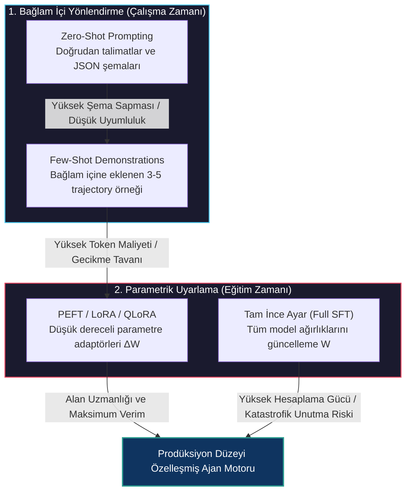
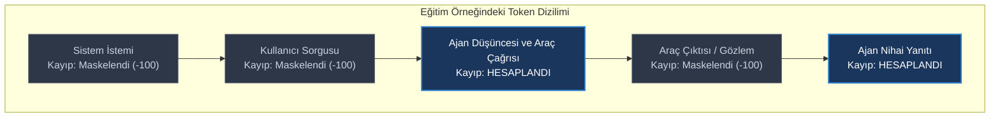
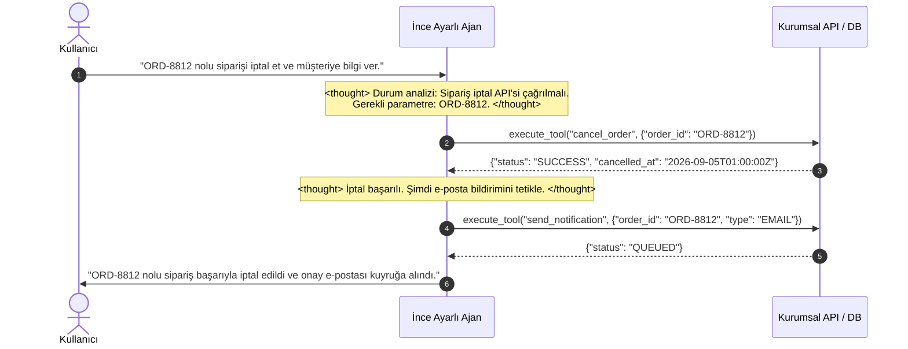
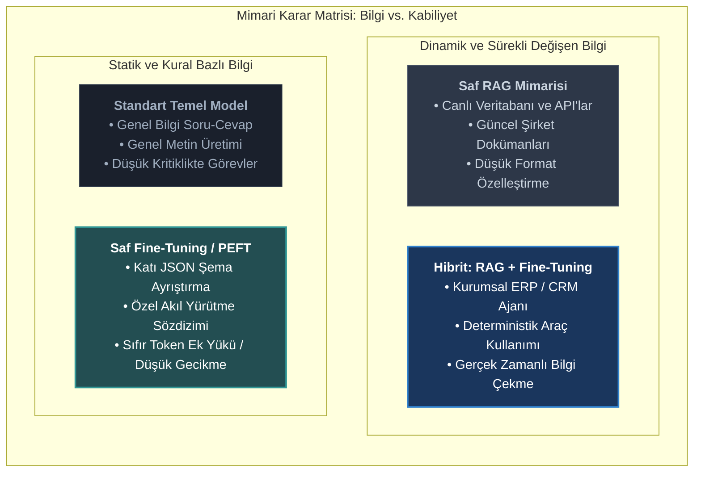

# Ajan Davranışları İçin İnce Ayara Giriş (Fine-Tuning)

<!-- toc -->

<br/>
<br/>

Prodüksiyon ortamlarında otonom ajanların inşası başlangıçta bağlam içi yönlendirmeyle (in-context prompting) yürütülür: sistem istemine (system prompt) doğrudan gömülen sıfır örnekli direktifler (zero-shot), birkaç örnekli gösterimler (few-shot) ve yapılandırılmış çıktı formatlama şemaları. Ancak ajan iş akışları karmaşıklaştıkça—çok adımlı araç çağrıları, dayanıklı hata kurtarma mekanizmaları, katı JSON şeması uyumluluğu ve bir saniyenin altındaki karar gecikmeleri gerektiğinde—prompt mühendisliği temel operasyonel, finansal ve mimari darboğazlara çarpar.

Sadece prompt ile yönlendirilen ajanlar, her istekte tekrarlanan araç şemaları ve trajectory örnekleri nedeniyle bağlam penceresini (context window) hızla tüketir. Dahası, karmaşık karar ağaçları altında genel amaçlı temel modeller (foundation models) sıklıkla şema kayması (schema drift), uydurma parametreler (hallucinated parameters) ve kırılgan araç çağırma sözdizimi hataları üretir.

**Ajan davranışları için ince ayar (Fine-Tuning for Agentic Behavior)**, bu operasyonel paradigmayı kökten değiştirir: Ajanın *nasıl* akıl yürüteceğini ve araçları nasıl çağıracağını her istekte bağlam istemleriyle tarif etmek yerine; ajanın akıl yürütme kalıpları, araç çağırma sözdizimi ve yörünge (trajectory) yürütme protokolleri doğrudan modelin ağırlıklarına matematiksel olarak kazınır.

Bu bölüm; **Prompting ve Fine-Tuning Takas Analizleri**, **Yörünge Veri Kümesi Mühendisliği**, **Parametre Verimli Uyarlama (LoRA/QLoRA)**, **Kayıp Maskeleme (Loss Masking) Mekaniği** ve **Fine-Tuning vs. RAG Stratejik Karar Matrisi** mimarisini tüm detaylarıyla ele almaktadır.

<br/>
<br/>

---

## 1. Mimari Temeller: Uyarlama Yelpazesi (The Adaptation Spectrum)

Büyük Dil Modellerini ajan iş akışlarına uyarlamak; çalışma zamanındaki bağlam içi yönlendirmeden (in-context steering) yapısal parametrik modifikasyona uzanan bir spektrumda gerçekleşir.

<br/>



<br/>

### Bağlam İçi Öğrenme vs. Ağırlık Uyarlaması

| Boyut | Zero-Shot / Few-Shot Prompting | Ajan İnce Ayarı (LoRA / SFT) |
| :--- | :--- | :--- |
| **Uyarlama Mekanizması** | KV-önbelleğindeki aktif aktivasyon durumlarını değiştirir. | Ağırlık tensörlerini modifiye eder ($W = W_0 + \Delta W$). |
| **Bağlam (Context) Ek Yükü** | **Yüksek:** Şemalar ve örnekler için istek başına 2.000–8.000 token. | **Sıfır:** Araç şemaları ve formatlar modelin içsel önbilgisidir. |
| **Çıkarım Gecikmesi (TTFT)** | Uzun girdi dizisinin işlenmesi nedeniyle yüksek İlk Token Süresi. | Ultra düşük TTFT; girdiler yalnızca dinamik durum ve sorguyu içerir. |
| **Format ve Şema Uyumluluğu** | Küçük modellerde (7B/8B) %80–%92 güvenilirlik. | **%99.5+ deterministik JSON / Araç çağrısı doğruluğu.** |
| **Hesaplama ve Dağıtım** | Paylaşımlı API uç noktaları (OpenAI, Anthropic). | Özel çıkarım motoru (vLLM) veya dinamik LoRA adaptör yönlendirmesi. |
| **Bilgi Değişebilirliği** | Yüksek: dinamik harici veri her istekte enjekte edilir. | Statik: bilgi, kontrol noktası (checkpoint) anında dondurulmuştur. |

<br/>
<br/>

---

## 2. Neden Ajanlar İçin Fine-Tuning? Temel İtici Güçler

Genel amaçlı amiral gemisi modeller (ör. GPT-4o, Claude 3.5 Sonnet) mükemmel sıfır örnekli akıl yürütme sergilese de, bunları yüksek trafikli kurumsal ajan filolarında çalıştırmak kritik engeller doğurur:

### 1. Deterministik Araç Çağırma ve Şema Uyumu
Açık kaynaklı kompakt modeller (Llama 3, Mistral veya Qwen gibi 7B–8B parametreli modeller), zero-shot ortamında iç içe geçmiş JSON parametrelerini, çok argümanlı fonksiyonları veya katı enum değerlerini çözümlerken sıklıkla sentaks hatası yapar. İnce ayar, modelin üretim olasılıklarını doğrudan hedef API'ların geçerli gramerine sabitleyerek sentaktik ayrıştırma hatalarını ortadan kaldırır.

### 2. Radikal Token Ekonomisi ve Gecikme Optimizasyonu
Çoklu ajan ve çok adımlı diyalog döngülerinde, 15 adım boyunca her istekte 4.000 tokenlik API tanımları ve few-shot örnekleri enjekte etmek, oturum başına 60.000 girdi tokeni harcar. Bu davranışsal protokoller ağırlıklara kazındığında:
- Sistem istemi boyutu **4.500 tokenden 150 tokenin altına** düşer.
- İlk Tokene Ulaşma Süresi (TTFT) **%60–%80 oranında azalır**.
- Token maliyetleri **%90'a varan oranda optimize edilir**.

### 3. Yörünge Düzeyinde Akıl Yürütme (CoT Uyumlaması)
İnce ayar; ajanların her istemde paragraflarca kural yazmaya gerek kalmadan özel düşünce protokollerini (ör. `<thought>` yansıma blokları, aksiyon öncesi güvenlik doğrulamaları veya disiplinli hipotez testleri) takip etmesini sağlar.

### 4. Küçük Modellere Distilasyon (Edge ve VPC Kurulumu)
Bir kurum, 400B+ parametreli devasa bir öğretmen modelin çok adımlı ajan yeteneklerini 8B parametreli uzman bir öğrenci modele damıtabilir (distillation). Bu 8B model daha sonra veri gizliliği standartlarına uygun olarak şirketin kendi güvenli Sanal Özel Bulutunda (VPC) çalıştırılabilir.

<br/>
<br/>

---

## 3. Matematiksel Formülasyonlar: Kayıp Maskeleme ve LoRA

### 1. Hedef Üzerinde Maskelenmiş Cross-Entropy Kaybı (Masked Loss)

Standart nedensel dil modellemede (causal LM), çapraz entropi kaybı dizideki tüm tokenlar üzerinden hesaplanır. Ancak ajan eğitiminde $x$ girdi bağlamı (sistem istemi, kullanıcı sorgusu ve araç sonuçları) harici olarak verilir. Model **yalnızca kendi ürettiği tokenlardaki (düşünce adımları ve araç çağırma aksiyonları $y$) hatalardan cezalandırılmalıdır**.

Girdi bağlamı $x = (x_1, \dots, x_N)$ ve hedef üretim dizisi $y = (y_1, \dots, y_T)$ olmak üzere:

$$
\mathcal{L}\_{\text{Agent}}(\Theta) = - \frac{1}{T} \sum\_{t=1}^T \log P\_\Theta(y\_t \mid x\_1, \dots, x\_N, y\_1, \dots, y\_{t-1})
$$

Sistem direktiflerine, kullanıcı girdilerine ve harici araç çıktılarına karşılık gelen tokenların kayıp etiketleri $-100$ (PyTorch `ignore_index`) olarak ayarlanır; böylece harici metinlerden geriye doğru gradyan akışı engellenir.

<br/>



<br/>

### 2. Parametre Verimli İnce Ayar: LoRA Mekaniği

Geriye yayılım (backpropagation) sırasında $W_0 \in \mathbb{R}^{d \times k}$ yoğun ağırlık matrisinin tamamını güncellemek yerine LoRA, $W_0$ matrisini dondurur ve $\Delta W$ güncellemesini düşük ranklı iki matrisin çarpımına ayrıştırır:

$$\Delta W = \frac{\alpha}{r} (B \cdot A)$$

Burada $A \in \mathbb{R}^{r \times k}$ Gauss dağılımı $\mathcal{N}(0, \sigma^2)$ ile başlatılır, $B \in \mathbb{R}^{d \times r}$ sıfır ile başlatılır, $r \ll \min(d, k)$ adaptör rankını (genellikle $r \in \{8, 16, 32, 64\}$) ve $\alpha$ sabit bir ölçekleme hiperparametresini temsil eder.

İleri yönlü hesaplama (forward pass) şu hale gelir:

$$h = W_0 x + \Delta W x = W_0 x + \frac{\alpha}{r} B(A x)$$

Çıkarım (inference) aşamasında $B \cdot A$ çarpımı doğrudan $W_0$ içine kalıcı olarak eklenebilir (merge), böylece ek hiçbir gecikme maliyeti oluşmaz:

$$
W\_{\text{birlesmis}} = W_0 + \frac{\alpha}{r}(B \cdot A)
$$

<br/>
<br/>

---

## 4. Veri Kümesi Mühendisliği: Yörünge (Trajectory) Kürasyonu

Ajanlar için fine-tuning veri kümesi, klasik soru-cevap çiftlerinden kökten farklıdır. Bu veri setleri **çok turlu yürütme yörüngelerinden (multi-turn execution trajectories)** oluşur.

<br/>



<br/>

### Bir Ajan Veri Setinin 4 Temel Bileşeni

1. **Sentaktik Çeşitlilik:** Aşırı öğrenmeyi (overfitting) önlemek için aynı araç çağırma niyetini ifade eden yüzlerce farklı kullanıcı cümlesi.
2. **Negatif ve Reddetme Örnekleri:**
   - **Eksik Parametre:** Gerekli bir parametre bulunmadığında model uydurma değer girmek yerine kullanıcıya netleştirici soru sormalıdır.
   - **Kapsam Dışı İstekler:** Prompt enjeksiyonları ve yetkisiz aksiyonlar güvenli reddetme yanıtlarını tetiklemelidir.
3. **Hata Yönetimi ve Dayanıklılık Trajectory'leri:**
   - Örneklerin %15–%20'sinde API'ın `404 Not Found`, `429 Rate Limit` veya `500 Internal Error` döndüğü durumlar simüle edilmelidir.
   - Ajan bu hatayı `<thought>` adımında değerlendirip alternatif bir araç çağırmayı veya kullanıcıya durumu şeffafça aktarmayı öğrenmelidir.
4. **Yapılandırılmış Ayrıştırma Etiketleri:** Tüm örneklerde `<thought>...</thought>` ve `<tool_call>...</tool_call>` gibi açık ayrıştırıcı etiketlerin tutarlı kullanımı.

<br/>
<br/>

---

## 5. Stratejik Karar Matrisi: Fine-Tuning vs. RAG

Kurumsal yapay zekada en sık karşılaşılan mimari hata, ince ayarın bir "bilgi depolama" yöntemi olarak kullanılmaya çalışılmasıdır.

<br/>



<br/>

### Mimari Karar Akışı

```
                        Ajanın neye ihtiyacı var?
                                    │
               ┌────────────────────┴────────────────────┐
               ▼                                         ▼
   Dinamik, Sürekli Değişen Bilgi             Yapılandırılmış Davranış / Format
       (Fiyatlar, Dokümanlar, DB)                 (API'lar, Sözdizimi, Akıl Yürütme)
               │                                         │
               ▼                                         ▼
     RAG ve Vektör DB Kullan                   Parametrik Fine-Tuning Kullan
               │                                         │
               └────────────────────┬────────────────────┘
                                    ▼
                     İkisi birden mi gerekiyor?
                                    │
                                    ▼
               Hibrit: RAG Araçlarını Kullanan Fine-Tuned Ajan
```

- **RAG Ne Zaman Kullanılır:** Veri sıkça değiştiğinde (saatlik/günlük), kaynak gösterimi (citation) zorunlu olduğunda ve doküman hacmi model parametre sınırlarını aştığında.
- **Fine-Tuning Ne Zaman Kullanılır:** Deterministik araç şemaları, mikrosaniye seviyesinde gecikme, düşük token tüketimi, özel akıl yürütme formatı veya kompakt model distilasyonu gerektiğinde.
- **Hibrit Çözüm:** Ajanın gerçek zamanlı kurumsal veriyi arayıp sentezlemesi (RAG) için gerekli araç kullanım disiplinine (Fine-Tuning) sahip olması.

<br/>
<br/>

---

## 6. Uygulama Deseni: Trajectory Şeması ve Hedef Kayıp Maskeleme

Aşağıda, yalnızca asistan üretimleri üzerinde kayıp hesaplamayı garanti eden Pydantic veri şeması ve PyTorch hedef maskeleme fonksiyonu yer almaktadır.

<br/>

### Trajectory Doğrulama Şeması (Pydantic)

```python
from typing import List, Optional, Literal
from pydantic import BaseModel, Field

class ToolCall(BaseModel):
    id: str
    type: Literal["function"] = "function"
    name: str
    arguments: str  # JSON formatında serileştirilmiş argümanlar

class TrajectoryMessage(BaseModel):
    role: Literal["system", "user", "assistant", "tool"]
    content: Optional[str] = None
    thought: Optional[str] = Field(None, description="CoT akıl yürütme adımı")
    tool_calls: Optional[List[ToolCall]] = None
    tool_call_id: Optional[str] = None

class AgentTrajectorySample(BaseModel):
    messages: List[TrajectoryMessage]
```

<br/>

### PyTorch Hedef Kayıp Maskeleme Uygulaması

```python
import torch

def compute_masked_agent_loss(
    logits: torch.Tensor,       # Şekil: [batch_size, seq_len, vocab_size]
    labels: torch.Tensor,       # Şekil: [batch_size, seq_len]
    agent_token_mask: torch.Tensor, # Şekil: [batch_size, seq_len] (Asistan için 1, bağlam için 0)
    ignore_index: int = -100
) -> torch.Tensor:
    """Kullanıcı/sistem/araç girdilerini maskeleyerek gradyanı yalnızca asistan tokenlarında hesaplar."""
    target_labels = labels.clone()
    target_labels[agent_token_mask == 0] = ignore_index

    # Nedensel otoregresif tahmin için logits ve etiketleri bir adım kaydır
    shift_logits = logits[..., :-1, :].contiguous()
    shift_labels = target_labels[..., 1:].contiguous()

    loss_fn = torch.nn.CrossEntropyLoss(ignore_index=ignore_index)
    return loss_fn(shift_logits.view(-1, shift_logits.size(-1)), shift_labels.view(-1))
```

<br/>
<br/>

---

## 7. İnteraktif Challenge ve Derin Mimari Çözümler

<details>
<summary><strong>Challenge 1: Kavramsal Temeller — Zero-Shot vs. Few-Shot vs. Fine-Tuning</strong></summary>
<br/>

#### Senaryo
Bir mühendislik ekibi, 15 dahili REST API ile konuşan müşteri destek ajanı için Few-Shot Prompting ile LoRA Fine-Tuning arasında seçim yapmaktadır.

#### Karşılaştırmalı Çözümleme
1. **Zero-Shot Prompting:** Yalnızca OpenAPI şemalarını ve talimatları verir. Parametre uydurmaya ve çok adımlı bağımlılıklarda tökezlemeye meyillidir.
2. **Few-Shot Prompting:** Sistem istemine 3–5 adet eksiksiz trajectory örneği ekler.
   - *Avantajı:* Sıfır eğitim maliyeti, anında prototipleme.
   - *Dezavantajı:* Her çağrıda 3.000–6.000 token tüketir. API faturalarını şişirir ve ilk token gecikmesini (TTFT) ciddi şekilde artırır.
3. **LoRA Fine-Tuning:** API çağırma kalıplarını ve akıl yürütme izlerini model adaptör ağırlıklarına işler.
   - *Avantajı:* %99+ deterministik şema uyumu, sıfır gereksiz token tüketimi, ultra hızlı çıkarım ve 8B boyutundaki hafif modelleri kullanabilme imkanı.
   - *Dezavantajı:* Kaliteli veri kümesi oluşturma ve eğitim hattı yönetimi gerektirir.
</details>

<br/>

<details>
<summary><strong>Challenge 2: Veri Kümesi Mühendisliği — Dahili Mikroservis API'ları İçin Eğitim Dağılımı</strong></summary>
<br/>

#### Senaryo
Dahili Kubernetes kümelerini ve bulut dağıtımlarını yöneten otonom bir DevOps ajanı için fine-tuning veri seti oluşturuyorsunuz. Hangi tip trajectory'ler dahil edilmelidir?

#### Mimari Çözüm
Güvenilir bir ajan veri seti asla sadece başarılı adımlardan oluşamaz. 4 temel bileşen dengelenmelidir:
1. **Olağan Yürütmeler (%60):** Temiz parametre çıkarımı, doğru `<thought>` planlaması ve başarılı araç çağrıları içeren geçerli istekler.
2. **Netleştirme Trajectory'leri (%15):** Belirsiz isteklerde (*"Servisi prod'a al"*) modelin tahmin yürütmek yerine eksik küme adını ve imaj etiketini kullanıcıya sorduğu örnekler.
3. **Hata Yönetimi ve Kurtarma (%15):** Simüle edilmiş API hataları (`404 Pod Not Found`, `403 Forbidden`). Ajanın hatayı düşünüp teşhis komutları çalıştırdığı örnekler.
4. **Güvenlik ve Reddetme (%10):** Prompt enjeksiyonu ve yetkisiz silme girişimlerinde ajanın güvenli şekilde aksiyonu reddettiği durumlar.
</details>

<br/>

<details>
<summary><strong>Challenge 3: Stratejik Mimari Karar — Dinamik Bilgi Aktarımı İçin Fine-Tuning mi RAG mi?</strong></summary>
<br/>

#### Senaryo
Bir finans kuruluşu, güncel kredi faiz oranlarını ve risk yönergelerini bilen bir ajan istemektedir. Bir geliştirici, 8B modeli her hafta şirketin PDF'leriyle fine-tune etmeyi önermektedir.

#### Mimari Eleştiri
- **Temel Hata:** Fine-Tuning üretim biçimini ve mekaniği optimize eder; dinamik olgusal bilgileri depolamak için verimsiz ve yanıltıcıdır. Parametrik bilgi katastrofik unutmaya ve kaynak gösterememe riskine (halüsinasyon) açıktır.
- **Doğru Çözüm:** **RAG-öncelikli mimari** kurulmalıdır. Faizler ve politikalar vektör ve ilişkisel veritabanında saklanır. Ajan **yalnızca arama sorgularını nasıl formüle edeceğini ve arama araçlarını nasıl tetikleyeceğini öğrenmesi için** fine-tune edilir.
</details>

<br/>

<details>
<summary><strong>Challenge 4: Teknik Derinlemesine Bakış — Asistan Aksiyonlarında Kayıp Maskeleme</strong></summary>
<br/>

#### Senaryo
Supervised Fine-Tuning (SFT) sırasında kullanıcı istemi tokenları üzerinden kayıp (loss) hesaplamak ajanın akıl yürütme performansını neden bozar?

#### Matematiksel Analiz
Kayıp tüm tokenlar üzerinden hesaplandığında:
$$
\mathcal{L} = \mathcal{L}\_{\text{istem}} + \mathcal{L}\_{\text{tamamlama}}
$$
Model, parametre gradyanlarını kullanıcının rastgele cümle yapısını ve yazım hatalarını tahmin etmek için harcar. Bu durum **model kapasitesinin israfına**, önceden öğrenilmiş genel dil yeteneklerinin unutulmasına yol açar. Girdi tokenlarının etiketini `-100` yapmak, geriye yayılımın yalnızca ajanın akıl yürütme ve araç çağırma parametrelerini güncellemesini garanti eder.
</details>
