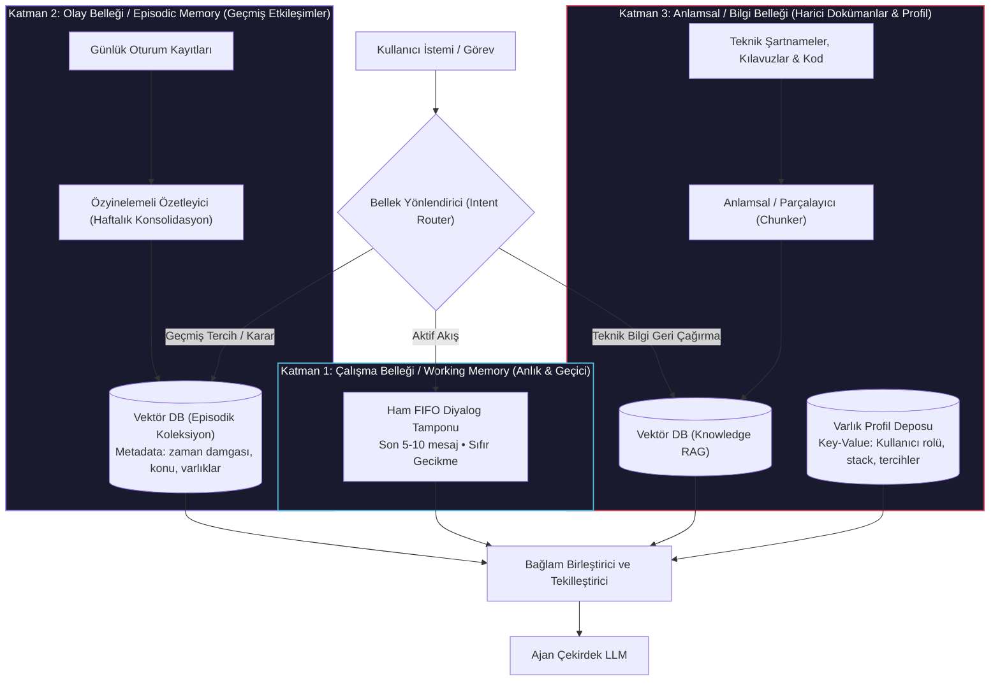
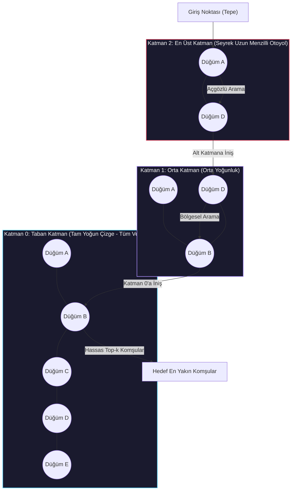
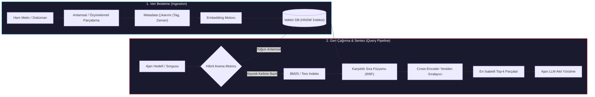

# İleri Düzey Bellek: Vektör Veritabanları ve RAG

<!-- toc -->

<br/>
<br/>

Otonom ajan mimarilerinde temel akıl yürütme modelleri, doğaları gereği bağlam pencerelerinin (context window) geçiciliği ve sınırları ile kısıtlanmıştır. Prompt mühendisliği ve kayan pencereli (sliding window) tampon bellekler, ajanların birkaç diyalog turu boyunca anlık durumu korumasına izin verse de; haftalar, aylar süren veya devasa kurumsal bilgi havuzlarını kapsayan operasyonlarda kaçınılmaz mimari darboğazlar baş gösterir: **bağlam penceresinin tükenmesi (context window exhaustion)**, karesel maliyet artışı, **"lost in the middle" (ortada kaybolma) dikkat kaybı** ve **parametrik bilginin eskimesi (staleness)**.

Üretim seviyesindeki sistemler bu sınırları aşmak için **akıl yürütme** (sinir ağı modelinin parametrik ağırlıkları) ile **bellek** (harici, parametrik olmayan, yüksek boyutlu anlamsal depolama motoru) katmanlarını birbirinden ayırır. Otonom ajanlar; **Vektör Veritabanları (Vector Databases)** ve **Geri Çağrımla Zenginleştirilmiş Üretim (Retrieval-Augmented Generation - RAG)** entegrasyonu sayesinde uzun vadeli, indekslenebilir ve anlamsal olarak sorgulanabilir kalıcı bir belleğe kavuşur.

Bu bölüm, **Ajanik Uzun Vadeli Bellek** mimarisini tüm katmanlarıyla formalize eder: **3 Katmanlı Hiyerarşik Bellek Mimarisi**, **Vektör Gömme (Embeddings) ve Metrik Uzay Matematiği**, **Yaklaşık En Yakın Komşu (ANN) İndeksleme İç Mekanizmaları (HNSW/IVF-PQ)**, **Üretim Tipi Ajanik RAG Hattı (Chunking, Hibrit Arama ve Re-Ranking)** ve **Doğrudan Uygulama Örnekleri**.

<br/>
<br/>

---

## 1. Mimari Temeller: Basit Belleğin Sınırları ve Çok Katmanlı Paradigma

Erken aşama ajan prototiplerindeki en yaygın anti-pattern, yalnızca ham diyalog dizilerine (`messages = [...]`) bel bağlamaktır.

<br/>

### 1.1 Kayan Pencereli Belleğin Üçlü Çıkmazı (The Trilemma)

1. **Bağlam Penceresi Tükenmesi ve $O(N)$ Maliyet:** Diyalog turları biriktikçe, tüm geçmişi her LLM çağrısında prompt'a basmak gecikmeyi (latency) ve token maliyetini katlanarak artırır.
2. **Dikkat Zafiyeti ("Lost in the Middle"):** Transformer modellerinin self-attention mekanizmaları U şeklinde bir geri çağırma eğrisi sergiler: uzun istemlerin tam ortasında kalan bilgiler, baştaki veya sondaki token'lara kıyasla çok daha düşük dikkat ağırlıkları alır ve model tarafından gözden kaçırılır.
3. **Anlamsal Gürültü ve Bağlam Kirliliği:** Yüzlerce eski mesajı ayrıştırmadan bağlama yüklemek; çelişkili direktifler, güncelliğini yitirmiş ara kararlar ve ajanın planlama odağını dağıtan anlamsal parazitler yaratır.

<br/>

### 1.2 3 Katmanlı Hiyerarşik Ajan Bellek Mimarisi

Bu çıkmazı aşmak adına modern otonom ajanlar, belleği erişim gecikmesi, zamansal yerellik ve anlamsal soyutlama seviyelerine göre işlevsel katmanlara ayırır.

<br/>



<br/>

| Bellek Katmanı | Depolama Mekanizması | Tutma Ufku | Temel İşlev |
|---|---|---|---|
| **Katman 1: Çalışma Belleği** | In-Memory RAM / Redis Buffer | Dakikalar (Aktif Oturum) | Çok turlu anlık bağlam tutarlılığı ve araç geri bildirim döngüleri. |
| **Katman 2: Olay Belleği** | Vektör Deposu + Özet Parçaları | Haftalar / Aylar | Geçmiş kararlar, etkileşim kütükleri ve uzun vadeli kullanıcı uyumu. |
| **Katman 3: Anlamsal Bilgi Belleği** | Vektör DB + İlişkisel / Belge Deposu | Süresiz (Kalıcı) | Statik şirket dokümantasyonu, teknik şartnameler ve kullanıcı profil varlıkları. |

<br/>
<br/>

---

## 2. Matematiksel Temeller: Vektör Gömme ve Metrik Uzaylar

Bir **gömme modeli (embedding model)**, ham metin dizilerini sürekli ve yoğun bir $d$-boyutlu vektör uzayına eşleyen doğrusal olmayan bir $f_\theta: \mathcal{T} \to \mathbb{R}^d$ fonksiyonudur (genellikle $d \in \{768, 1024, 1536, 3072\}$).

Eğitim hedefi, anlamsal olarak benzer metinlerin geometrik uzayda birbirine yakın konumlanmasını güvence altına alarak manifold hipotezini karşılamaktır:

$$
\text{AnlamsalBenzerlik}(T_1, T_2) \propto \text{GeometrikYakınlık}(f_\theta(T_1), f_\theta(T_2))
$$

<br/>

### 2.1 Uzaklık ve Benzerlik Metrikleri

İki yoğun vektör $u, v \in \mathbb{R}^d$ verildiğinde:

#### 1. Kosinüs Benzerliği (Ölçekten Bağımsız)
Vektörlerin büyüklüğünden ziyade aralarındaki açının kosinüsünü ölçer; metin uzunluğunun getirdiği büyüklük sapmalarını elimine eder:

$$
S_{\cos}(u, v) = \frac{u \cdot v}{\|u\|_2 \|v\|_2} = \frac{\sum_{i=1}^d u_i v_i}{\sqrt{\sum_{i=1}^d u_i^2} \sqrt{\sum_{i=1}^d v_i^2}}
$$

Kosinüs mesafesi sınırlıdır: $D_{\cos}(u, v) = 1 - S_{\cos}(u, v) \in [0, 2]$. Vektörler $L_2$-normalize edildiğinde ($\|u\|_2 = 1, \|v\|_2 = 1$), kosinüs benzerliği doğrudan iç çarpıma (dot product) eşitlenir:

$$
S_{\cos}(u, v) = u \cdot v = \sum_{i=1}^d u_i v_i
$$

#### 2. Öklid Mesafesi ($L_2$ Normu)
İki nokta arasındaki mutlak geometrik düz çizgi mesafesini hesaplar:

$$
D_{L2}(u, v) = \|u - v\|_2 = \sqrt{\sum_{i=1}^d (u_i - v_i)^2}
$$

#### 3. İç Çarpım (Dot Product)
Hem açısal yönelimi hem de vektör büyüklüğünü dikkate alır. Metin uzunluğu veya frekans ağırlıklarının alaka düzeyini doğrudan etkilediği asimetrik arama modellerinde tercih edilir.

> **Kritik Çıkarım:** Birim normalize edilmiş vektörler için ($\|u\| = \|v\| = 1$), metrikler arasında monoton bir dönüşüm vardır:
> $$
> D_{L2}^2(u, v) = \|u\|^2 + \|v\|^2 - 2(u \cdot v) = 2 - 2 S_{\cos}(u, v)
> $$
> Bu sayede normalize edilmiş vektörleri İç Çarpım (Dot Product) ile indekslemek, Kosinüs Benzerliği ile birebir aynı sıralamayı çok daha yüksek işlemci hızında üretir.

<br/>
<br/>

---

## 3. Vektör Veritabanı Mimarisi ve İndeksleme Mekanizmaları

Geleneksel ilişkisel veritabanları tam eşleşme filtrelemeleri ($B$-Tree, $O(\log N)$) yürütür. Ancak milyonlarca kayıt içeren $\mathbb{R}^{1536}$ gibi yüksek boyutlu bir uzayda en yakın vektörleri kaba kuvvetle (brute-force) aramak sorgu başına $O(N \cdot d)$ kayan nokta işlemi gerektirir; bu da gerçek zamanlı ajan döngüleri için kabul edilemez bir gecikmedir.

Vektör veritabanları (ChromaDB, Qdrant, Milvus, Pinecone, pgvector) bu problemi **Yaklaşık En Yakın Komşu (Approximate Nearest Neighbor - ANN)** indeksleme algoritmalarıyla çözer.

<br/>

### 3.1 HNSW (Hierarchical Navigable Small World) Çizge İndeksi

HNSW, endüstri standardı olan çizge tabanlı bir ANN indeksidir. Yüksek boyutlu vektörleri, Skip List veri yapısına benzer çok katmanlı hiyerarşik bir çizgeye yerleştirir:



* **Arama Karmaşıklığı:** $O(\log N)$ sorgu gezinme süresi.
* **Mekanizma:** Açgözlü arama (greedy search) en seyrek üst katmandan başlar ve uzayda dev sıçramalar yapar. Yerel bir minimuma ulaşıldığında bir alt katmana inilerek yerel arama daraltılır; en tabanda en hassas top-k komşular saptanır.
* **Ödünleşim (Trade-off):** Çok yüksek arama hassasiyeti ($>\%98$) ve milisaniye altı gecikme sunar; ancak çok katmanlı çizge kenarlarını RAM'de tuttuğu için bellek tüketimi yüksektir.

<br/>

### 3.2 Ürün Kuantizasyonu ile Ters Çevrilmiş Dosya İndeksi (IVF-PQ)

Belleğin kısıtlı olduğu devasa veri setlerinde (FAISS gibi motorlarda) kullanılır:
1. **IVF (Kümeleme):** Vektör uzayını $k$-means ile $k$ adet Voronoi hücresine böler. Arama anında sadece sorguya en yakın küme merkezleri taranır.
2. **PQ (Sıkıştırma):** $d$-boyutlu vektörleri $m$ adet alt vektöre böler ve her birini bir kod defteri (codebook) baytına kuantize ederek RAM kullanımını $\%80\text{--}\%95$ oranında sıkıştırır.

<br/>
<br/>

---

## 4. Üretim Seviyesinde Ajanik RAG Hattı

Otonom ajanlarda RAG, yalnızca tek geçişli bir arama işlemi değildir. Halüsinasyonu engelleyen, çok aşamalı aktif bir besleme ve geri çağırma hattıdır.

<br/>



<br/>

### 4.1 Metin Parçalama (Chunking) Stratejileri

Geri çağırma kalitesi doğrudan parçalama hassasiyetine bağlıdır:
* **Sabit Boyutlu Parçalama (Fixed-Size, örn. 500 karakter):** İlkeldir; cümleleri, kod fonksiyonlarını veya mantıksal önermeleri ortadan ikiye bölerek anlamsal bütünlüğü bozar.
* **Özyinelemeli Karakter Parçalama (Recursive Splitting):** Metni doğal sözdizimsel sınırlardan (paragraflar `\n\n`, cümleler `\n`, noktalar, boşluklar) hiyerarşik olarak böler.
* **Üst Doküman Geri Çağırma (Parent-Document Retrieval):** Arama ve vektör eşleştirmesi için küçük parçalar (100 token) üretilir; ancak eşleşme sağlandığında LLM'e o parçanın ait olduğu geniş üst bağlam (1.000 token) iletilir.

<br/>

### 4.2 Hibrit Aramanın (Dense + Sparse) Zorunluluğu

Yoğun vektör araması kavramsal benzerlikleri yakalamakta çok başarılıdır; fakat **birebir anahtar kelime eşleşmelerinde**, SKU numaralarında, kriptografik hash'lerde ve spesifik hata kodlarında (`"ERR_502_BAD_GATEWAY"` veya `"v2.18.4"`) çuvallayabilir.

Üretim standardı ajanlar **Hibrit Arama** kullanır:
1. **Yoğun Arama (Bi-Encoder Vektörleri):** Genel niyeti, eşanlamlıları ve parafrazları yakalar.
2. **Seyrek Arama (BM25 / SPLADE):** Tam token eşleşmelerini, kısaltmaları ve alfasayısal kodları yakalar.
3. **Karşılıklı Sıra Füzyonu (Reciprocal Rank Fusion - RRF):** İki farklı sistemin sonuç sıralamalarını kalibrasyon gerektirmeksizin birleştirir:

$$
RRF(d \in D) = \sum_{m \in M} \frac{1}{k + r_m(d)}
$$

Burada $M$ arama motorlarını, $r_m(d)$ belgenin o motordaki sıra numarasını, $k \approx 60$ ise düzeltme katsayısını temsil eder.

<br/>

### 4.3 Cross-Encoder Yeniden Sıralama (Re-Ranking)

Bi-encoder modelleri sorgu ve doküman vektörlerini birbirinden bağımsız üretir; bu hız kazandırsa da aralarındaki çapraz dikkat (cross-attention) etkileşimini kaçırır.

Bir **Cross-Encoder Re-ranker** (örn. Cohere Rerank, BGE-Reranker), hibrit aramadan dönen ilk 20–50 adayı alır ve $[Sorgu, Dokuman]$ çiftini birlikte okuyarak tam multi-head cross-attention hesaplar:

$$
Score = \text{Softmax}(W \cdot \text{Transformer}([Q; D]))
$$

Bu işlem, yüzeysel olarak benzeyen ancak mantıksal olarak alakasız olan yanlış pozitifleri eler ve bağlamı en yüksek isabetle LLM'e sunar.

<br/>
<br/>

---

## 5. Uygulama: ChromaDB Vektör Bellek Motoru

Aşağıdaki uygulama, metadata filtreleme ve anlamsal sorgulama özelliklerine sahip sade ve temsili bir ChromaDB vektör bellek istemcisini gösterir.

<br/>

```python
import chromadb
from chromadb.utils import embedding_functions

# 1. Kalıcı istemci ve gömme hattının başlatılması
client = chromadb.PersistentClient(path="./agent_memory_db")
embed_fn = embedding_functions.DefaultEmbeddingFunction()

collection = client.get_or_create_collection(
    name="agent_longterm_memory",
    embedding_function=embed_fn,
    metadata={"hnsw:space": "cosine"}
)

# 2. Yapılandırılmış episodik olayların metadata ile kaydedilmesi
collection.add(
    documents=[
        "Mimari Karar: Vektör depolama için pgvector eklentili PostgreSQL 16 seçildi.",
        "Olay Kaydı: Kesinti, saat 03:00 UTC'de bağlantı havuzunun tükenmesiyle tetiklendi.",
        "Kullanıcı Profili: Emre katı TypeScript tiplerini ve öz mimari notları tercih eder."
    ],
    metadatas=[
        {"category": "architecture", "timestamp": 1725580800, "source": "adrs"},
        {"category": "incident", "timestamp": 1725584400, "source": "pagerduty"},
        {"category": "profile", "timestamp": 1725588000, "source": "dialogue"}
    ],
    ids=["mem_001", "mem_002", "mem_003"]
)

# 3. Anlamsal arama ve kesin metadata filtreleme ile sorgulama
query_results = collection.query(
    query_texts=["Vektör veritabanı olarak hangi teknoloji belirlendi?"],
    n_results=1,
    where={"category": "architecture"}
)

retrieved_doc = query_results["documents"][0][0]
retrieved_meta = query_results["metadatas"][0][0]
print(f"[{retrieved_meta['source'].upper()}] Bellekten Çağrılan: {retrieved_doc}")
```

<br/>
<br/>

---

## 6. Resmi Görevler ve Mimari Çözümler

<br/>

<details>
<summary><strong>Görev 1: Kavramsal Analoji — RAG Mimarisi Bir Baş Kütüphaneciye Nasıl Anlatılır?</strong></summary>
<br/>

#### Senaryo
Retrieval-Augmented Generation (RAG) mekanizmasını ve varlık nedenini kapsamlı bir kütüphane metaforu üzerinden açıklayınız.

#### Mimari Çözüm
RAG entegrasyonu olmayan standart bir LLM, gelen tüm soruları yalnızca **kendi ezberine (eğitim ağırlıkları)** dayanarak cevaplayan bir kütüphaneciye benzer:
- Ne kadar dahi olursa olsun, mezuniyet tarihinden sonra basılmış kitapları bilemez (parametrik eskime).
- Karmaşık bir alıntı sorulduğunda, hafızasındaki farklı kitapları birbirine karıştırarak inandırıcı fakat uydurma bir yanıt verebilir (halüsinasyon).

**RAG, bu kütüphaneciye bir araştırma masası, Dewey katalog fişleri ve geniş kütüphane rafları tahsis etmektir:**
1. **Kataloglama (Vektör Embeddings & İndeksleme):** Yeni bir kitap geldiğinde kütüphaneci her kelimeyi ezberlemez; kitabın anlamsal koordinatlarını çıkaran katalog kartları hazırlar (Dewey Onlu Sistemi / yüksek boyutlu vektör uzayı).
2. **Kullanıcı Talebi (Sorgu):** Bir okuyucu gelir ve *"Apollo 13 oksijen tankı patlamasının kök nedeni neydi?"* diye sorar. Kütüphaneci tahmin yürütmez.
3. **Geri Çağırma (Retrieval / ANN Arama):** Kütüphaneci katalog fişlerini tarar, ilgili raflara gider ve soruşturma raporunun bulunduğu en alakalı 3 teknik günlüğü raftan alır.
4. **Zenginleştirilmiş Sentez (Kaynak Göstererek Üretim):** Kütüphaneci kitapları masasına açar, ilgili paragrafları doğrudan okur ve okuyucuya kitap adı ile sayfa numarasını referans göstererek kesin, doğrulanabilir bir özet sunar.
</details>

<br/>

<details>
<summary><strong>Görev 2: Sistem Mimarisi — Aylar Süren Kullanıcı Diyalogları İçin Bellek Motoru</strong></summary>
<br/>

#### Senaryo
Bir otonom ajanın, kullanıcısıyla aylar süren konuşmalarını, teknik kararlarını ve değişen kişisel tercihlerini bağlam penceresini tıkamadan ve anlamsal kafa karışıklığı yaşamadan hatırlamasını sağlayacak bellek mimarisini tasarlayınız.

#### Mimari Çözüm
Her diyalog turunu ayrım yapmadan tek bir vektör tablosuna basmak, zamanla ajanı anlamsal gürültüye ve kronolojik körlüğe sürükler. Doğru yaklaşım **3 Katmanlı Hiyerarşik Bellek Motoru** kurmaktır:

1. **Aktif Çalışma Belleği (FIFO Tamponu):**
   - Son 10 diyalog turunu bellek içi hızlı bir önbellekte (Redis vb.) tutarak anlık akıcılığı sağlar.
2. **Periyodik Episodik Özetleme (Hiyerarşik Roll-Up):**
   - Her oturumun sonunda veya haftalık periyotlarla çalışan bir arka plan servisi, ham konuşmaları özetler.
   - Servis: (a) Alınan Mimari Kararları, (b) Tamamlanan Görevleri ve (c) Çözülemeyen Hataları damıtır.
   - Bu özetler vektörleştirilerek `timestamp` ve konu etiketleriyle **Episodik Vektör Koleksiyonu**na kaydedilir: `{"session_id": "...", "timestamp": 1725580800, "topics": ["kubernetes", "auth"]}`.
3. **Varlık Profil Deposu (Structured Key-Value / Knowledge Graph):**
   - Kullanıcının rolü, kullandığı teknolojiler ve çalışma tarzı yapısal bir profil tablosunda (PostgreSQL JSONB) güncellenir.
4. **Sorgu Anında Bellek Yönlendirme:**
   - Yeni bir soru geldiğinde niyet sınıflandırıcı (intent router); teknik dokümanlar için Bilgi RAG'ini, geçmiş kararlar için Episodik Vektör Deposu'nu (zaman filtresiyle), kullanıcı tercihleri için ise Profil Deposu'nu sorgular ve sonuçları birleştirir.
</details>

<br/>

<details>
<summary><strong>Görev 3: Uygulama — ChromaDB Doküman Besleme ve Filtreli Arama Hattı</strong></summary>
<br/>

#### Senaryo
Bir dokümanın Python ile parçalanması, embedding'lerinin çıkarılması, metadata ile ChromaDB koleksiyonuna eklenmesi ve filtrelenmiş anlamsal benzerlik aramasının yapılması adımlarını kodlayınız.

#### Mimari Çözüm
```python
import chromadb
from chromadb.utils import embedding_functions

# Yerel ChromaDB istemcisi ve gömme fonksiyonunun hazırlanması
chroma_client = chromadb.Client()
embedding_model = embedding_functions.DefaultEmbeddingFunction()

# Kosinüs mesafe metriğiyle koleksiyon oluşturulması
collection = chroma_client.create_collection(
    name="technical_specs",
    embedding_function=embedding_model,
    metadata={"hnsw:space": "cosine"}
)

# Doküman parçalarının kaynak bilgileriyle koleksiyona kaydedilmesi
docs = [
    "Redis, 500ms bağlantı zaman aşımıyla birincil önbellek katmanı olarak kullanılır.",
    "Kubernetes ingress trafiği katı TLS sonlandırması ile Envoy Gateway üzerinden yönetilir.",
    "Veritabanı şema migrasyonları CI/CD sürecinde Alembic betikleriyle otomatik çalıştırılır."
]
metas = [{"component": "cache"}, {"component": "networking"}, {"component": "database"}]
ids = ["chunk_01", "chunk_02", "chunk_03"]

collection.add(documents=docs, metadatas=metas, ids=ids)

# Metadata kısıtı eşliğinde anlamsal geri çağırma
results = collection.query(
    query_texts=["Ağ trafiği sınırda nasıl yönlendirilir ve güvenliği sağlanır?"],
    n_results=1,
    where={"component": "networking"}
)

print("Eşleşen Metin:", results["documents"][0][0])
print("Kosinüs Mesafesi:", results["distances"][0][0])
```
</details>

<br/>

<details>
<summary><strong>Görev 4: Üretim Hata Modları — Kurumsal Ajanlarda Sadece Vektör Aramasının Yetersiz Kaldığı Durumlar</strong></summary>
<br/>

#### Senaryo
Yalnızca yoğun vektör araması (OpenAI embeddings üzerinde kosinüs benzerliği) kullanan bir kurumsal kod inceleme ajanında; mühendisler spesifik derleyici bayrakları (`-O3 -ffast-math`) veya hata kodları (`0x80004005`) aradığında ajanın alakasız dokümanlar getirdiği gözlenmiştir. Bunun temel nedeni nedir ve üretim seviyesinde nasıl çözülür?

#### Mimari Çözüm
- **Kök Neden (Yoğun Vektör Körlüğü):** Bi-encoder gömme modelleri metin dizilerini anlamsal kümelere indirger. Kelime dağarcığı dışı (out-of-vocabulary) semboller, nadir derleyici bayrakları veya alfasayısal hata kodları söz konusu olduğunda; model bu özel kodları genel konu merkezlerine (örn. "C++ derleme" veya "Windows genel hatası") yaklaştırır ve tam alfasayısal eşleşmeyi yüksek boyutlu düzleştirmede kaybeder.
- **Üretim Çözümü (Hibrit Arama + Cross-Encoder):**
  1. **Seyrek Arama (BM25) Entegrasyonu:** Kod tabanını ve dokümanları kesin kelime ve token eşleşmelerini garanti eden ters indeksle (inverted index) indeksleyin.
  2. **Karşılıklı Sıra Füzyonu (RRF):** Vektör sonuçları (anlamsal yakınlık) ile BM25 sonuçlarını (birebir anahtar kelime eşleşmesi) RRF algoritmasıyla harmanlayın.
  3. **Cross-Encoder ile Yeniden Sıralama:** Birleştirilmiş aday havuzundan gelen ilk 25 dokümanı bir Cross-Encoder (örn. Cohere Rerank) modelinden geçirerek sorgu ile metin arasındaki token bazlı çapraz etkileşimleri değerlendirin ve en isabetli parçaları ajana sunun.
</details>
