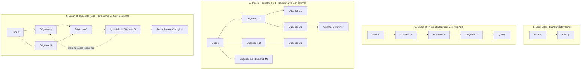
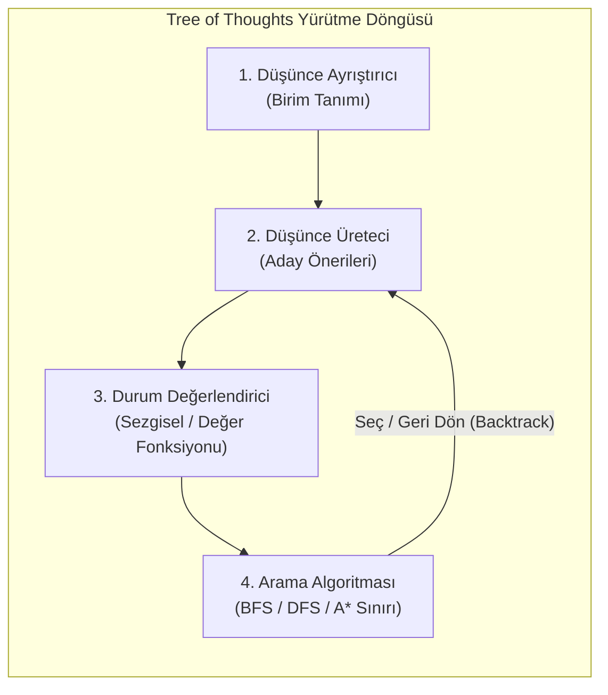
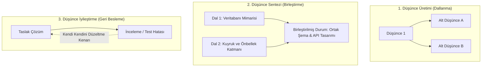

# İleri Düzey Planlama: Tree of Thoughts ile Görev Ayrıştırma

<!-- toc -->

<br/>
<br/>

Otonom ajan sistemlerinde, **ReAct (Reason + Act)** veya doğrusal **Chain-of-Thought (CoT)** gibi temel yürütme paradigmaları açgözlü (greedy), soldan sağa otoregresif bir yörünge üzerinde çalışır. Bu yaklaşımlar basit soru-cevap senaryolarında ve reaktif araç çağrılarında etkili olsa da, çok adımlı sistem yeniden yapılandırması (refactoring), kombinatoryal algoritmik bulmacalar, mimari tasarım ve stratejik çizelgeleme gibi karmaşık mühendislik problemlerinde yapısal bir çöküş yaşar.

Karmaşık ortamlarda çalışan ajanlar; **bileşik hata yayılımı (compounding error propagation)**, **ileriye bakamama (lack of lookahead)** ve çıkmaz bir yola girildiğinde **geri adım atamama (inability to backtrack)** sorunlarıyla karşılaşır. Bir ajan erken aşamada açgözlü bir yaklaşımla alt-optimal bir karara bağlandığında, sonraki her karar bu ilk hatayı katlar ve sistemi çıkmaz sokaklara veya halüsinasyon döngülerine hapseder.

Bu yapısal kısıtlamaları aşmak için modern akıl yürütme mimarileri, planlamayı bir **sezgisel ağaç ve graf araması (heuristic tree and graph search)** problemi olarak yeniden modeller. Problemleri ayrık ve tutarlı "düşüncelere (thoughts)" bölerek birden fazla akıl yürütme yolunu eş zamanlı keşfeden **Tree of Thoughts (ToT)** ve **Graph of Thoughts (GoT)** mimarileri; otonom ajanlara derinlemesine düşünme (deliberation), stratejik öngörü (lookahead), kendi kendini değerlendirme (self-evaluation) ve sistematik geri izleme (backtracking) yetenekleri kazandırır.

Bu bölüm; **doğrusal planlayıcıların darboğazlarını**, **Tree of Thoughts (ToT) biçimsel mimarisini**, **Graph of Thoughts (GoT) ile çizge temelli akıl yürütmeyi**, **matematiksel arama formülasyonlarını**, **üretim ortamı ödünleşimlerini (trade-offs)** ve **üretim sınıfı bir Python planlayıcı implementasyonunu** derinlemesine incelemektedir.

<br/>
<br/>

---

## 1. Doğrusal Planlayıcıların (ReAct & CoT) Mimari Darboğazları

Ağaç ve graf arama paradigmalarına geçmeden önce, birinci nesil ajan kalıplarının öngörü ve deneme-yanılma gerektiren görevlerde neden yetersiz kaldığını analiz etmek kritik önem taşır.

<br/>

### 1.1 Açgözlü Otoregresif Çıkmazı

Doğrusal mimariler (örneğin standart ReAct döngüleri: `Thought -> Action -> Observation -> Thought`) akıl yürütme yörüngesini sıralı olarak inşa eder:

$$
\tau = (t_1, a_1, o_1, t_2, a_2, o_2, \dots, t_N, a_N, o_N)
$$

$i$. adımda ajan, bir sonraki düşüncesi olan $t_i$'yi yalnızca geçmiş belirteçlere (tokens) koşullandırarak üretir. Bu durum üç temel hata modunu doğurur:

1. **Miyop Ufuk Körlüğü (Açgözlü Sömürü):** Ajan, gelecekteki kısıtlamaları simüle etmeksizin en yüksek olasılıklı bir sonraki belirteci veya anlık araç çağrısını seçer. Satrançta veya sistem mimarisinde, küresel olarak en optimal yol genellikle kısa vadede sezgilere aykırı görünen bir adımı gerektirir.
2. **Hata Katlanması ve Geri Dönülemez Bağlanma:** Eğer $t_2$ düşüncesi hatalı bir varsayım veya halüsinasyon içeriyorsa, $a_2$ hatalı bir eylem gerçekleştirecektir. Ortaya çıkan $o_2$ gözlemi doğrudan $t_3$'ü besleyerek ajanı giderek büyüyen bir başarısızlık sarmalına kilitler. Standart otoregresif üretim; *"2. adım hatalıydı; çalışma alanı durumunu 1. adıma geri alıp alternatif bir dalı deneyeyim"* diyebilecek dahili bir mekanizmadan yoksundur.
3. **Küresel Değer Puanlamasının Bulunmaması:** Doğrusal üretim, belirteçleri yalnızca sözlük üzerindeki softmax olasılıklarıyla yerel olarak değerlendirir. Mevcut $S_{current}$ durumunun alternatif varsayımsal durumlara kıyasla nihai hedefe daha yakın olup olmadığını ölçecek harici bir sezgisel veya küresel amaç fonksiyonuna sahip değildir.

<br/>

### 1.2 Akıl Yürütme Paradigmalarının Karşılaştırması

Standart girdi-çıktı istemlerinden çizge temelli akıl yürütmeye geçiş, hesaplama topolojisindeki evrimi temsil eder:

<br/>



<br/>

---

## 2. Tree of Thoughts (ToT): Biçimsel Mimari

Yao ve arkadaşları (Princeton / Google DeepMind, 2023) tarafından önerilen **Tree of Thoughts (ToT)** çerçevesi, büyük dil modellerinin akıl yürütme sürecini "düşünce (thought)" adı verilen ayrık anlamsal birimlerden oluşan bir ağaç üzerinde sezgisel arama olarak formüle eder.

<br/>

### 2.1 ToT Mimarisinin Dört Temel Bileşeni

Bir Tree of Thoughts motoru, problem çözme sürecini dört modüler operatöre ayrıştırır:



<br/>

#### 1. Düşünce Ayrıştırma (Thought Decomposition)
Modelin tek seferde upuzun paragraflar üretmesi yerine problem, yönetilebilir ara adımlara bölünür. Düşüncenin ayrıntı düzeyi (granularity) probleme özgüdür:
- Matematiksel bulmacalarda (örn. Game of 24): Tek bir cebirsel işlem adımı (örn. `8 - 4 = 4`).
- Makale ve rapor planlamasında: Bir bölüm başlığı taslağı veya argüman hipotezi.
- Yazılım refactoring süreçlerinde: Tek bir modül arayüzü sözleşmesi veya sınıf tasarımı.

#### 2. Düşünce Üreteci: $G(p_\theta, s, k)$
Mevcut ağaç durumu $s = [x, z_1, \dots, z_i]$ verildiğinde üreteç, bir sonraki adım için $k$ adet alternatif aday düşünce üretir. İki temel strateji kullanılır:
- **Örnekleme (CoT Sampling):** Sıcaklık $T > 0$ ile bağımsız $k$ adet çıktı üretmek. Düşünce uzayının zengin ve çeşitli olduğu durumlarda etkilidir.
- **Öneri İstemi (Proposal Prompt):** Tüm $k$ adayını yapılandırılmış JSON formatında tek bir istemde üretmek (`["Aday A", "Aday B", "Aday C"]`). Kısıtlı eylem uzaylarında son derece hızlı ve maliyet etkindir.

#### 3. Durum Değerlendirici: $V(p_\theta, S)$
Durum değerlendirici, ara durumları $s$ inceleyerek bu durumun başarılı bir çözüme ulaşma olasılığını temsil eden bir değer veya sezgisel skor atar. İki temel yöntem bulunur:
- **Değer Puanlaması (Value Scoring):** Durumu doğrudan $V(s) \in [0, 1]$ aralığında veya $1-10$ ölçeğinde puanlamak.
- **Sınıflandırma / Oylama (Voting):** Durumları `kesin (sure)`, `olası (likely)` veya `imkansız (impossible)` olarak etiketlemek ya da birden fazla adayı karşılaştırmalı olarak oylatmak.

#### 4. Arama Algoritması (Frontier Management)
Arama motoru keşif sınırını yönetir ve hangi dalların genişletileceğine veya budanacağına karar verir:
- **Genişlik Öncelikli Arama (BFS):** $d$ derinliğindeki tüm dalları paralel olarak inceler. Her seviyede yalnızca en umut verici en iyi $b$ adayı tutar (Beam Search). Ağaç derinliğinin sığ olduğu durumlarda ($d \le 4$) idealdir.
- **Derinlik Öncelikli Arama (DFS):** Maksimum derinliğe veya nihai hedefe ulaşana kadar tek bir patikada ilerler. Değerlendirici `imkansız` sonucunu verirse veya puan belirli bir $\delta$ eşiğinin altına düşerse, motor ebeveyn düğüme **geri adım atar (backtrack)** ve kardeş dalı dener. Bellek kısıtlı olduğunda veya durum uzayı derin olduğunda tercih edilir.

<br/>

### 2.2 Matematiksel Arama Formülasyonu

$x$ problem girdisini, $z_i$ ise $i$. ara düşünceyi temsil etsin. $T$ uzunluğundaki eksiksiz bir çözüm patikası $y = (z_1, z_2, \dots, z_T)$ şeklindedir.

Arama ağacı, her $s \in \mathcal{S}$ durumunun düşünceler dizisi $s = (x, z_1, \dots, z_i)$ olduğu durum uzayı $\mathcal{S}$ ile tanımlanır.

Arama algoritması, optimal yaprak durumu $s^*$'ı bulmayı hedefler:

$$
s^* = \arg\max_{s \in \mathcal{S}_{terminal}} V(s)
$$

Dallanma katsayısı $b$ ve derinliği $D$ olan bir ağaçta budanmamış arama uzayının karmaşıklığı $O(b^D)$'dir. Bir $\tau_{budama}$ değerlendirme eşiği uygulandığında, verimsiz dallar erkenden elenir:

$$
\text{Budama Kriteri: } V(s) < \tau_{budama}
$$

Bu budama, etkin dallanma faktörünü $b_{etkin} \ll b$ seviyesine indirerek önceden imkansız olan arama uzaylarını LLM bağlam limitleri dahilinde çözülebilir kılar.

<br/>

---

## 3. Graph of Thoughts (GoT): Hiyerarşik Ağaçların Ötesi

ToT dallanma ve geri izleme yeteneği getirse de, ağaç yapıları katı bir şekilde hiyerarşiktir: patikalar birbiriyle birleşemez ve bir dalda üretilen düşünceler paralel bir daldaki düşüncelerle doğrudan sentezlenemez.

Besta ve arkadaşları (ETH Zürich, 2023) tarafından geliştirilen **Graph of Thoughts (GoT)**, ajan akıl yürütmesini rastgele bir **Yönlendirilmiş Döngüsüz Çizge (DAG)** (ve yinelemeli senaryolarda geri besleme döngüleri içeren çizgeler) olarak modeller.

<br/>

### 3.1 Temel Çizge Dönüşümleri

GoT, insanların işbirlikli problem çözme mekanizmalarını taklit eden birinci sınıf çizge operasyonları sunar:



<br/>

### 3.2 GoT'taki Biçimsel İşlemler

$G = (V, E)$ düşüncelerin $v \in V$ düğümleriyle, bağımlılık ilişkilerinin ise $(u, v) \in E$ yönlendirilmiş kenarlarıyla temsil edildiği bir akıl yürütme çizgesi olsun. GoT üç temel dönüşümü destekler:

1. **Üretim (Generation):** $v$ düğümünü genişleterek $\{v'_1, v'_2, \dots, v'_k\}$ yeni çocuk düşüncelerini üretmek.
2. **Sentez / Birleştirme ($\mathcal{T}_{agg}$):** Birbirinden bağımsız birden çok düşünce düğümünü $\{v_1, v_2, \dots, v_m\}$ sentezlenmiş tek bir $v_{syn}$ düğümünde birleştirmek:
   $$
   v_{syn} = \mathcal{T}_{agg}(v_1, v_2, \dots, v_m)
   $$
   *Örnek:* Bağımsız üretilen üç mikroservis tasarımını uçtan uca kurumsal bir sistem mimarisinde birleştirmek.
3. **İyileştirme ($\mathcal{T}_{ref}$):** $v$ düğümünü doğrulama veya test geri bildirimine göre güncelleyerek dallanma yaratmaksızın iyileştirilmiş $v'$ düğümünü oluşturmak:
   $$
   v' = \mathcal{T}_{ref}(v, \text{geri bildirim})
   $$

<br/>

---

## 4. Algoritmik Ödünleşim Matrisi

Otonom sistem mimarları, gecikme bütçelerine, API maliyet sınırlarına ve problem zorluğuna göre en uygun planlama topolojisini seçmelidir:

| Boyut | ReAct / CoT | Tree of Thoughts (ToT) | Graph of Thoughts (GoT) |
| :--- | :--- | :--- | :--- |
| **Topoloji** | Doğrusal Dizi ($1 \to 1$) | Hiyerarşik Ağaç ($1 \to N$) | Yönlendirilmiş Çizge / DAG ($N \to M$) |
| **Öngörü (Lookahead)** | Yok (Açgözlü $O(1)$) | Ağaç Sınırı ile Öngörü | Çoklu patika simülasyonu & öngörü |
| **Geri İzleme (Backtracking)** | Mümkün Değil | Desteklenir (DFS / Budama) | Desteklenir (Çizge geneli yeniden yönlendirme) |
| **Dal Birleştirme** | Desteklenmez | Desteklenmez | Yerleşik Doğal Sentezleme ($\mathcal{T}_{agg}$) |
| **Belirteç (Token) Maliyeti**| Düşük ($1\times$) | Orta-Yüksek ($5\times - 20\times$) | Yüksek ($15\times - 50\times$) |
| **Gecikme (Latency)** | Düşük (Tek haneli saniyeler) | Orta (Onlarca saniye) | Yüksek (İteratif çizge turları) |
| **İdeal Kullanım Alanları** | Araç sorguları, sıralı API çağrıları | Bulmacalar, kod hata ayıklama, matematik | Sistem mimarisi, belge sentezi |

<br/>

> **Kritik Mimari Çıkarım:** ToT ve GoT, ReAct'in alternatifi değil; onun üstündeki meta-denetleyicilerdir. Üretim sistemlerinde ToT/GoT planlayıcısı üst düzey stratejik görev ayrıştırmasını yürütürken, yaprak düzeyindeki eylemler hızlı ReAct alt-ajanlarına delege edilir.

<br/>

---

## 5. Üretim İmplementasyonu: Tree of Thoughts Planlayıcı

Aşağıda; DFS arama, durum değerlendirme, budama ve otomatik geri izleme (backtracking) mekanizmalarını içeren temiz ve temsili bir **Tree of Thoughts Planlayıcı** Python implementasyonu yer almaktadır:

```python
from typing import List, Optional, Callable
from pydantic import BaseModel, Field

class ThoughtNode(BaseModel):
    state: str
    depth: int = 0
    score: float = 0.0
    parent: Optional["ThoughtNode"] = None
    children: List["ThoughtNode"] = Field(default_factory=list)

class TreeOfThoughtsPlanner:
    def __init__(
        self,
        generator: Callable[[str], List[str]],
        evaluator: Callable[[str], float],
        max_depth: int = 3,
        prune_threshold: float = 0.4
    ):
        self.generator = generator
        self.evaluator = evaluator
        self.max_depth = max_depth
        self.prune_threshold = prune_threshold

    def solve_dfs(self, root_state: str) -> Optional[ThoughtNode]:
        """Budama ve geri izleme (backtracking) ile düşünce ağacını DFS ile arar."""
        root = ThoughtNode(state=root_state, depth=0, score=1.0)
        stack: List[ThoughtNode] = [root]
        best_leaf: Optional[ThoughtNode] = None

        while stack:
            current = stack.pop()

            # Hedefe ulaşıldı mı veya maksimum derinliğe gelindi mi?
            if current.depth == self.max_depth:
                if best_leaf is None or current.score > best_leaf.score:
                    best_leaf = current
                continue

            # Bir sonraki adım için aday dalları üret
            candidates = self.generator(current.state)
            for cand in candidates:
                cand_score = self.evaluator(cand)
                
                # Kabul edilebilir kalitenin altındaki dalları buda
                if cand_score < self.prune_threshold:
                    continue  # Budandı: otomatik olarak geri adım atar (backtrack)

                child = ThoughtNode(
                    state=cand,
                    depth=current.depth + 1,
                    score=cand_score,
                    parent=current
                )
                current.children.append(child)
                stack.append(child)

        return best_leaf

    def extract_trajectory(self, node: Optional[ThoughtNode]) -> List[str]:
        """Optimal yapraktan köke doğru geri giderek çözüm yolunu çıkarır."""
        path = []
        curr = node
        while curr:
            path.append(f"[Derinlik {curr.depth} | Puan {curr.score:.2f}] {curr.state}")
            curr = curr.parent
        return list(reversed(path))
```

<br/>

---

## 6. Resmi Zorluklar ve Mimari Çözümler

<br/>

<details>
<summary><strong>Senaryo 1: Üretim ToT Sistemlerinde Kombinatoryal Patlama Sorunu</strong></summary>
<br/>

#### Senaryo
Otonom bir yazılım mimarisi ajanı, mikroservis ekosistemi tasarlamak için Tree of Thoughts (BFS) kullanmaktadır. Her adımda model $b = 5$ mimari seçenek üretir. Derinlik $d = 4$'e ulaştığında ağaç $5^4 = 625$ LLM çağrısı gerektirir; bu da API zaman aşımlarına ve devasa faturalara yol açar. Arama kalitesini korurken gecikme ve maliyet nasıl sınırlandırılır?

#### Mimari Çözüm
- **Temel Neden:** Uyarlamalı demet budaması (adaptive beam pruning) olmaksızın yürütülen tekdüze Genişlik Öncelikli Arama (BFS), üssel durum uzayı patlamasına ($O(b^d)$) neden olur.
- **Üretim Düzeltmesi (Erken Sonlandırmalı Uyarlamalı Demet Arama):**
  1. **Dinamik Demet Genişliği ($k$):** Tüm aday dalları genişletmek yerine çocuk düğümleri $V(s)$ puanına göre sıralayın ve yalnızca en iyi $k$ adayı tutun ($k=2$ veya $k=3$).
  2. **Kademeli Değerlendirme (Hafif Model Ön Filtresi):** Açıkça kusurlu fikirleri elemek için hızlı ve ucuz bir SLM (küçük model, örn. Gemini Flash veya 8B model) kullanın; pahalı muhakeme modelini yalnızca dalların en üstteki %20'si için tetikleyin.
  3. **Gömme Tabanlı Çeşitlilik Kümelemesi (Embedding Diversity):** LLM tarafından üretilen birçok düşünce hafif sözcük farklarına sahip anlamsal ikizlerdir. Adayları gömme benzerliği ile kümeleyin ve yalnızca her kümenin merkez düğümünü koruyarak kaynak israfını önleyin.
</details>

<br/>

<details>
<summary><strong>Senaryo 2: Değişebilir (Mutable) Ortamlarda Güvenli Geri İzleme (Backtracking)</strong></summary>
<br/>

#### Senaryo
Bulut altyapısı dağıtımı yapan bir ajan DFS ile geri izleme yapmaktadır. 2. derinlikte bir PostgreSQL veritabanı oluşturmak için `terraform apply` çalıştırır. 3. derinlikte sonraki bir yapılandırma değerlendiriciden geçemez. Ajan alternatif bir veritabanı yapılandırması denemek için geri adım atar (backtrack); ancak AWS üzerinde daha önce ayağa kaldırılan veritabanı çalışmaya devam eder ve kaynak çakışması ile maliyet sızıntısına neden olur. Ajanın çevre arayüzü nasıl tasarlanmalıdır?

#### Mimari Çözüm
- **Temel Neden:** Fiziksel ve değişken ortamlarda dış yan etkiler (side effects), bellekteki bir yığın işaretçisini (stack pointer) geri çekerek sıfırlanamaz.
- **Mimari Çözüm (İki Aşamalı İşleme & İzolasyonlu Çatallanma):**
  1. **Planlama ve Yürütmenin Ayrılması:** ToT planlayıcısı kesinlikle **Simülasyon Modunda** (doğrudan yan etki üretmeyen deklaratif durum farkları veya Terraform planları üreterek) çalışmalıdır.
  2. **Geçici Dal Havuzları (Ephemeral Sandboxing):** Değerlendirme için canlı çalıştırma şartsa (örn. entegrasyon testi koşmak), her dal geçici ve izole bir konteynerde (örn. geçici Kubernetes namespace veya Docker konteyneri) yürütülmelidir.
  3. **Telafi Edici İşlemler (Saga Pattern):** Bir düğüme kaydedilen her eylem bir `rollback()` kancası tanımlamalıdır. DFS motoru elenen düğümden çıkarken kardeş dala geçmeden önce bu ters telafi işlemini tetiklemelidir.
</details>

<br/>

<details>
<summary><strong>Senaryo 3: Tree of Thoughts'tan Graph of Thoughts'a Ne Zaman Geçilmeli?</strong></summary>
<br/>

#### Senaryo
Bir araştırma sentezi ajanı, 10 bağımsız akademik makaleyi özetleyip kapsamlı bir literatür taraması hazırlamakla görevlendirilmiştir. ToT ile uygulandığında ajan her makale için ağaçlar üretir ancak ortak temaları sentezlemekte zorlanır ve birbirinden kopuk özetler çıkarır. ToT burada neden yetersiz kalır ve GoT bunu nasıl çözer?

#### Mimari Çözüm
- **Yapısal Mimari Kısıtlama:** Ağaçlar katı şekilde ıraksaktır ($1 \to N$). A Dalında (örn. "Makale 1 Metodolojisi") üretilen bir düşünce, standart ağaç yapısında B Dalındaki ("Makale 2 Metodolojisi") bir düşünceyle doğrudan birleştirilemez. Bunları karşılaştırmak için her iki alt ağacın tüm içeriğini köke geri taşımak gerekir; bu da bağlam penceresini taşırır ve modülerliği yok eder.
- **GoT Çözümü:**
  1. **Paralel Çıkarım Düğümleri:** Her makaleyi eşzamanlı analiz etmek için $N$ adet bağımsız düğüm konuşlandırın.
  2. **Dallar Arası Sentez ($\mathcal{T}_{agg}$):** Birden fazla makale düğümünün çıktılarını doğrudan yönlendirilmiş kenarlar olarak alan birleştirme düğümü oluşturun.
  3. **Yinelemeli İyileştirme Döngüsü:** Taslak sentez düğümüne geri işaret eden geri bildirim kenarına sahip bir eleştiri düğümü ekleyin; böylece ajan belgeyi tutarlılık eşiklerine ulaşana kadar rafine eder.
</details>

<br/>

<details>
<summary><strong>Senaryo 4: Yanlışsız (Unbiased) Bir Değerlendirici İsteminin Tasarlanması</strong></summary>
<br/>

#### Senaryo
Bir Tree of Thoughts boru hattında durum değerlendirici istemi LLM'e şunu sorar: *"Bu aday düşünce iyi mi? Evet veya Hayır olarak yanıtla."* Ajan yüksek oranda yanlış-pozitif üretir; neredeyse her zaman "Evet" diyerek kusurlu yolları budamakta başarısız olur. Buna ne sebep olur ve kalibre edilmiş bir değerlendirme fonksiyonu nasıl tasarlanır?

#### Mimari Çözüm
- **Hata Analizi (LLM Dalkavukluğu ve Üretkenlik Yanlılığı):** LLM'ler net kriterler verilmediğinde ikili "iyi/kötü" sorularına doğal bir evet deme (affirmative) eğilimi gösterir. Ayrıca çapa kriterleri olmayan skaler puanlama sıcaklık dalgalanmalarına karşı hassastır.
- **Kalibre Edilmiş Değerlendirme Mimarisi:**
  1. **Rubrik Tabanlı Few-Shot Değerlendirme:** Belirli ara düşüncelerin neden çıkmaz sokak olduğunu gösteren negatif örnekler içeren açık bir değerlendirme matrisi (rubrik) sağlayın.
  2. **İkili/Çoklu Karşılaştırma (Turnuva Sıralaması):** Adayları tek başına değerlendirmek yerine değerlendiriciye tüm adayları aynı anda sunarak sıralamasını isteyin: *"Aday A, B ve C'yi karşılaştır. Başarısızlık olasılığı en düşük olan tek adayı seç ve gerekçelendir."*
  3. **Kendi Kendine Tutarlılık Simülasyonu (Rollout Lookahead):** Değerlendiricinin 2 adım ileriye bakmasını sağlayın: *"Eğer Düşünce A'yı seçersek hemen sonrasında karşılaşacağımız hata modları nelerdir?"* Model aşılması imkansız bir engel tespit ederse dal puanı anında 0.0 yapılarak budanır.
</details>
