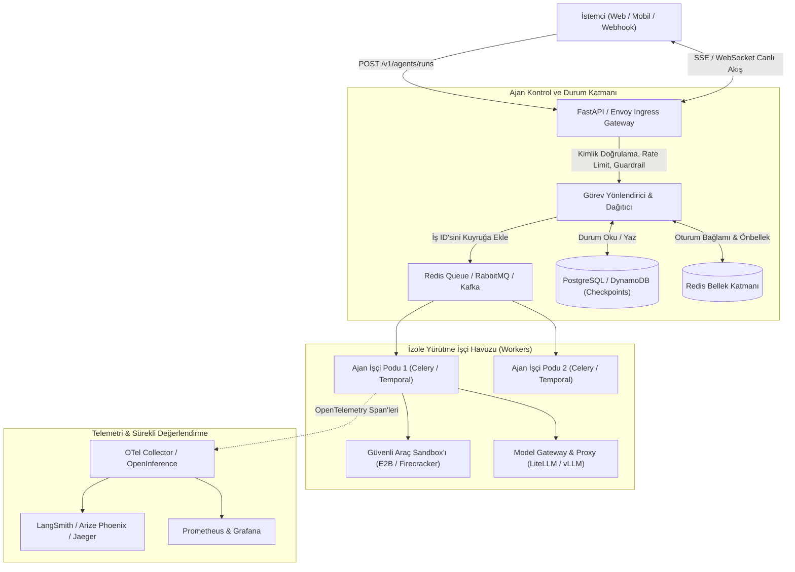
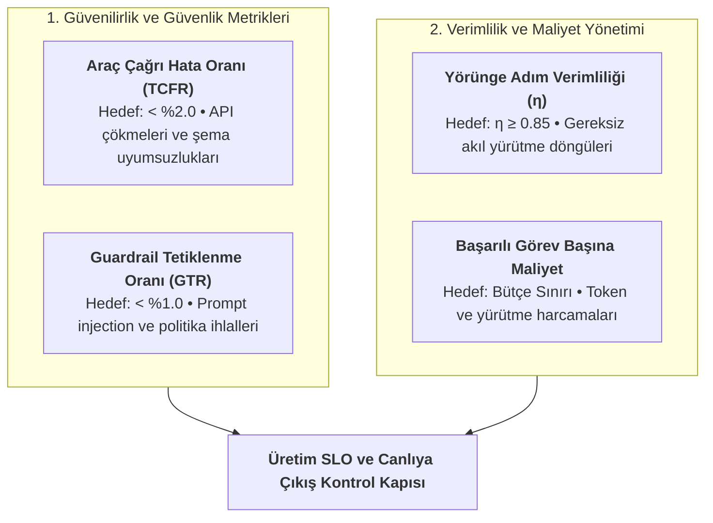
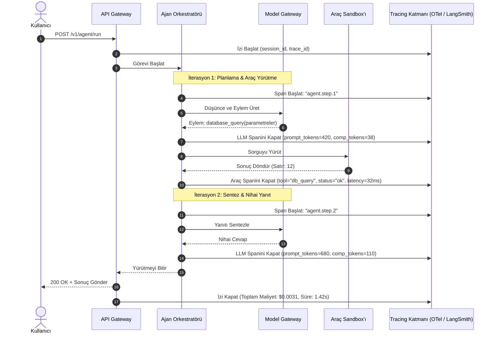
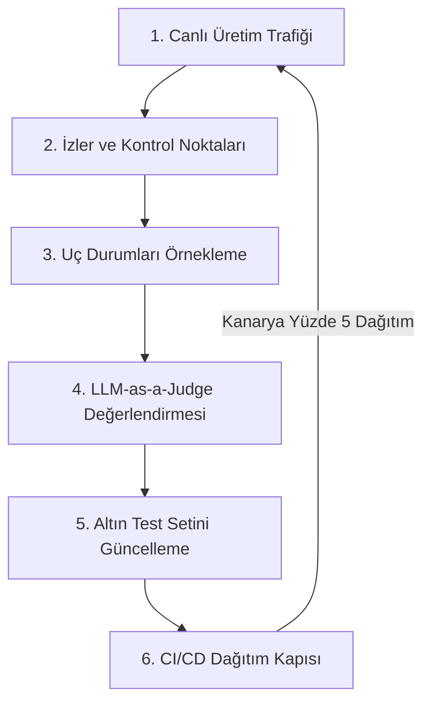
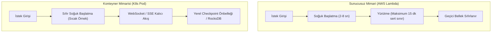
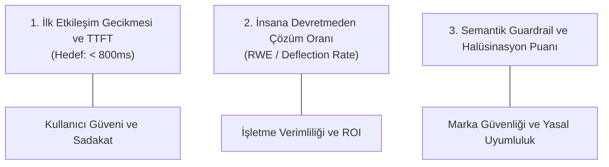
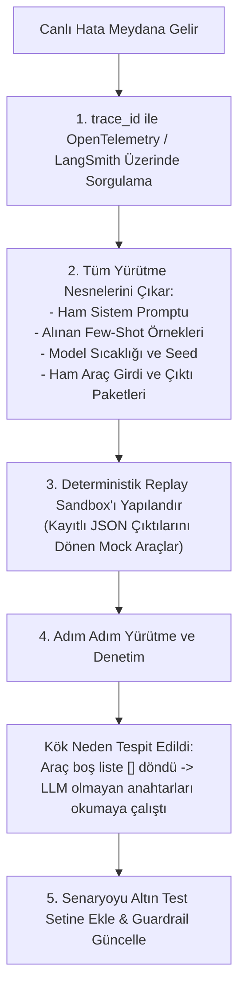

# Yapay Zeka Ajanlarının Dağıtımı ve İzlenmesi

<!-- toc -->

<br/>
<br/>

Otonom bir yapay zeka ajanını yerel bir Jupyter notebook veya geliştirme ortamında çalışan deneysel bir prototipten alıp görev açısından kritik, kurumsal düzeyde bir üretim (production) sistemine dönüştürmek, modern yapay zeka mühendisliğinin en zorlu eşiklerinden biridir. Yerel bir ortamda bir ajanın yanıt üretmek için 45 saniye beklemesi, ara sıra sonsuz döngüye girmesi veya sınırsız OpenAI/Anthropic token'ı harcaması tolere edilebilir bir aksaklıktır. Ancak canlı üretim ortamında sınırsız çalışma süreleri HTTP gateway zaman aşımlarına (timeout) yol açar, deterministik olmayan çıktılar kullanıcı güvenini zedeler, denetlenmeyen API döngüleri binlerce dolarlık fatura patlamaları yaratır ve sessizce çöken harici araçlar downstream servisleri felç eder.

Otonom ajanları dağıtmak ve çalıştırmak, onları standart REST API uç noktaları gibi değil, **durum bilgisi tutan (stateful) ve deterministik olmayan dağıtık sistemler** olarak ele almayı gerektirir. Tek adımlı istek-yanıt (request-response) döngülerini takip eden geleneksel mikroservislerin aksine, ajan tabanlı iş akışları değişken yürütme yolları, çok adımlı LLM akıl yürütme döngüleri, dinamik araç etkileşimleri ve kestirilemeyen gecikme dağılımları sergiler.

Bu bölüm; otonom ajanların canlı ortamlarda konteynerleştirilmesi, sunulması, gerçek zamanlı veri akışı (streaming), dağıtık izleme (tracing) ve operasyonel gözlemlenebilirliği (observability) için uçtan uca bir mühendislik mimarisi sunmaktadır. Ayrık (decoupled) mimari topolojileri inceliyor, Server-Sent Events (SSE) ile gerçek zamanlı akış geliştiriyor, ajanlara özgü Hizmet Seviyesi Hedefleri (SLO) için matematiksel formüller kuruyor, OpenInference ve OpenTelemetry ile dağıtık izleme kurguluyor ve sürekli değerlendirme (continuous evaluation) boru hatları tasarlıyoruz.

<br/>
<br/>

---

## 1. Prototip'ten Production'a: Mimari Dönüşüm

Deneysel bir ajan ile üretim seviyesinde bir servis arasındaki mimari uçurum; durum yönetimi (statefulness), eşzamanlılık (concurrency) ve hata modlarından kaynaklanır. Bir prototip genellikle prompt oluşturmayı, model çalıştırmayı, araç yürütmeyi ve bellek kalıcılığını tek bir senkron iş parçacığında (thread) birleştirir. Canlı ortamda bu sıkı bağlılık (tight coupling) felaketle sonuçlanan darboğazlar doğurur.

<br/>

### 1.1 Prototip Tuzağı (The Prototype Trap)

Geliştiriciler prototip ajan kodlarını doğrudan canlıya aldıklarında sıklıkla dört temel hata moduyla karşılaşırlar:

1. **HTTP Gateway Zaman Aşımları (Timeouts):** Akıl yürütme, web araması, veritabanı sorgulama ve sentez gibi çok adımlı ajan iş akışları; Cloudflare, AWS ALB veya NGINX gibi servislerin standart 30–60 saniyelik gateway zaman aşımlarını kolaylıkla aşar.
2. **Durum Serileştirme Darboğazları:** Ajanın çalışma belleğini (scratchpad, araç yürütme kayıtları, nesne grafları) yerel süreç belleğinde (RAM) tutmak, yük dengeleyiciler (load balancers) arkasında yatay ölçeklenen podlar arasında senkronizasyonu bozar.
3. **Öngörülemeyen Maliyet Patlamaları:** Semantik bir döngüye veya ayrıştırma (parsing) hatasına yakalanan denetimsiz bir ajan, dakikalar içinde onlarca gereksiz LLM çağrısı yaparak API kota sınırlarını tüketir ve yüksek faturalara yol açar.
4. **Sessiz Araç Zehirlenmesi ve Zincirleme Hatalar:** Harici API'lar belgelenmemiş hata kodları döndürdüğünde veya şema değiştirdiğinde, korumasız ajanlar düzeltme eylemlerini halüsinasyon olarak üreterek kalıcı veritabanlarını kirletebilir.

<br/>

### 1.2 Ayrık (Decoupled) Üretim Mimarisi

Bu sorunların üstesinden gelmek için kurumsal ajan sistemleri; istemci girişi (ingress), orkestrasyon planlaması, yürütme işçileri (workers) ve durum kalıcılığını birbirinden bağımsız katmanlara ayırır.



<br/>

Bu ayrık mimari dört kritik operasyonel güvence sağlar:
- **Asenkron Yürütme:** Uzun süren akıl yürütme iş akışları arka plandaki işçi süreçlerinde çalışır; API gateway anında bir iş takip ID'si (`202 Accepted`) döner ve istemciye SSE üzerinden canlı durum akıtır.
- **Dayanıklı Kontrol Noktaları (Durable Checkpointing):** Her ReAct döngüsü (Thought $\to$ Action $\to$ Observation) kalıcı depolamaya atomik bir enstantane kaydeder; bu sayede bir worker çökerse görev baştan başlamak yerine kaldığı adımdan devam eder.
- **Sandbox Yalıtımı:** Araç yürütme işlemleri (örneğin Python kodu veya kabuk komutları), ana sisteme zarar gelmesini önlemek için ağdan yalıtılmış geçici mikro sanal makinelerde (Firecracker, Docker) çalışır.
- **Merkezi Çıkarım Proxy'si:** Tüm LLM çağrıları hız sınırlandırması (rate limiting), yedek model yönlendirmesi (örn. GPT-4 $\to$ Claude 3.5 Sonnet $\to$ yerel vLLM) ve önbellekleme yapan merkezi bir model ağ geçidinden geçer.

<br/>
<br/>

---

## 2. Dağıtım Topolojileri ve Gerçek Zamanlı Veri Akışı

Doğru dağıtım şablonunun seçilmesi; sistem gecikmesini, maliyet verimliliğini ve geliştirici hızını doğrudan belirler. Otonom ajanlar iş karmaşıklığı ve yürütme süresine bağlı olarak üç ana topolojiye ayrılır.

<br/>

### 2.1 Topoloji Sınıflandırması

| Topoloji | Tipik Süre | Altyapı Bileşenleri | En Uygun Senaryolar | Hata Kurtarma Stratejisi |
| :--- | :--- | :--- | :--- | :--- |
| **Senkron Canlı Akış (Streaming)** | 1 sn – 30 sn | FastAPI, Uvicorn, SSE / WebSockets | Sohbet asistanları, anlık arama ve S&C | İstemci tekrar bağlanır; adımı yeniden dener |
| **Asenkron İş Kuyruğu (Job Worker)**| 30 sn – 15 dk | FastAPI + Celery / ARQ + Redis | Derin araştırma, çok dosyalı kod refactoring | Kayıtlı checkpoint ile kuyruk yeniden denemesi |
| **Dayanıklı Orkestrasyon (DAG)** | 15 dk – Saatler | Temporal.io / AWS Step Functions | Çoklu ajan sürüleri (swarms), ETL, release boru hatları | Deterministik adım düzeyinde replay |

<br/>

### 2.2 Server-Sent Events (SSE) Akış Protokolü

Otonom ajanlar düşünme ve harici araçları yürütme aşamalarında önemli süreler harcadığından, kullanıcıya hiçbir geri bildirim vermeden HTTP bağlantısını bekletmek kullanıcı deneyimini bozar. **Server-Sent Events (SSE)**, HTTP/2 üzerinden tek yönlü ve hafif bir akış kanalı sağlayarak sunucunun her ReAct adımında istemciye yapılandırılmış telemetri paketleri göndermesine imkan tanır.

```
event: thought
data: {"step": 1, "thought": "Kullanıcı ciro verilerini istiyor. PostgreSQL veritabanını sorgulamalıyım."}

event: tool_start
data: {"step": 1, "tool": "sql_query_executor", "input": {"query": "SELECT SUM(amount) FROM orders WHERE year=2026"}}

event: tool_result
data: {"step": 1, "status": "success", "duration_ms": 142, "rows": 1}

event: final_answer
data: {"text": "2026 yılı toplam cirosu 14.2M$ olarak gerçekleşti."}
```

<br/>

### 2.3 Üretim Seviyesinde FastAPI Akış Uç Noktası

Aşağıdaki kod; asenkron jeneratörler, tiplendirilmiş olay paketleri ve istemci bağlantı kopma kontrolü içeren modern bir FastAPI SSE uygulamasını göstermektedir:

```python
from fastapi import FastAPI, HTTPException
from fastapi.responses import StreamingResponse
from pydantic import BaseModel
import asyncio
import json

app = FastAPI(title="Ajan Servis Ağ Geçidi", version="1.0.0")

class AgentRequest(BaseModel):
    user_id: str
    session_id: str
    prompt: str

async def agent_event_generator(req: AgentRequest):
    """Ajanın iç düşünce ve araç adımlarını SSE formatında canlı akıtır."""
    try:
        yield f"event: status\ndata: {json.dumps({'status': 'baslatiliyor'})}\n\n"
        await asyncio.sleep(0.05) # Başlangıç simülasyonu
        
        # Adım 1: Ajan Akıl Yürütme
        thought = {"step": 1, "message": "Kullanıcı niyeti çözümleniyor ve uygun araçlar seçiliyor"}
        yield f"event: thought\ndata: {json.dumps(thought)}\n\n"
        
        # Adım 2: Araç Çağrı Olayı
        tool_call = {"step": 1, "tool": "database_lookup", "args": {"query": req.prompt}}
        yield f"event: tool_call\ndata: {json.dumps(tool_call)}\n\n"
        await asyncio.sleep(0.2) # Simüle edilmiş asenkron I/O
        
        # Adım 3: Nihai Sentez Yanıtı
        final = {"status": "tamamlandi", "output": f"İşlenen sorgu: {req.prompt}"}
        yield f"event: final_answer\ndata: {json.dumps(final)}\n\n"
    except asyncio.CancelledError:
        # İstemci bağlantıyı erken keserse kaynakları temizle
        yield f"event: error\ndata: {json.dumps({'error': 'İstemci bağlantıyı kesti'})}\n\n"

@app.post("/v1/agent/stream")
async def stream_agent(request: AgentRequest):
    return StreamingResponse(
        agent_event_generator(request),
        media_type="text/event-stream",
        headers={"Cache-Control": "no-cache", "Connection": "keep-alive", "X-Accel-Buffering": "no"}
    )
```

<br/>

> **Kritik İçgörü:** NGINX veya benzeri ters vekiller (reverse proxy) arkasında akış sağlarken `X-Accel-Buffering: no` başlığını mutlaka ekleyin. Aksi halde vekil sunucu gelen paketleri kendi arabelleği dolana kadar bekletir ve anlık canlılık hissini yok eder.

<br/>
<br/>

---

## 3. Ajana Özgü Telemetri ve Temel Metrikler (SLO/SLA)

Geleneksel mikroservislerin izlenmesi standart **RED Yöntemi**'ne (Rate, Errors, Duration) dayanır. RED gerekli olmakla birlikte otonom ajanlar için tek başına yetersizdir; çünkü bir ajan isteği HTTP 200 OK dönerken hedefine tamamen başarısız olmuş, yanlış araçlar uydurmuş veya gereksiz yere 15.00$ harcamış olabilir.

Üretim seviyesinde ajan gözlemlenebilirliği gecikme dağılımını, finansal maliyeti, yürütme verimliliğini ve görev başarısını izleyen özel bir telemetri çerçevesi gerektirir.

<br/>

### 3.1 Gecikme ve Maliyetin Matematiksel Modellenmesi

$K$ ardışık akıl yürütme adımından oluşan bir ajan yürütmesinin toplam uçtan uca gecikmesi $T\_{\text{ajan}}$ şu şekilde modellenir:

$$
T\_{\text{ajan}} = T\_{\text{TTFT}} + \sum\_{k=1}^{K} \left( T\_{\text{infer}}^{(k)} + \sum\_{m=1}^{M\_k} T\_{\text{tool}}^{(k, m)} \right) + T\_{\text{overhead}}
$$

Burada:
- $T\_{\text{TTFT}}$, ilk gateway isteğinden ilk çıktının üretilmesine kadar geçen süredir (Time-To-First-Token).
- $T\_{\text{infer}}^{(k)}$, $k$. adımdaki LLM çıkarım süresidir.
- $M\_k$, $k$. adımda tetiklenen harici araç sayısıdır.
- $T\_{\text{tool}}^{(k, m)}$, $m$. aracın ağ ve yürütme gecikmesidir.
- $T\_{\text{overhead}}$, serileştirme, guardrail denetimi ve veritabanı durum kaydı süresidir.

<br/>

Benzer şekilde, bir yürütme yolu için toplam finansal maliyet $\mathcal{C}\_{\text{ajan}}$, girdi token'ları, çıktı token'ları ve üçüncü parti araç maliyetlerinin toplamıdır:

$$
\mathcal{C}\_{\text{ajan}} = \sum\_{k=1}^{K} \left( N\_{\text{prompt}}^{(k)} \cdot c\_{\text{in}} + N\_{\text{completion}}^{(k)} \cdot c\_{\text{out}} \right) + \sum\_{j=1}^{J} c\_{\text{tool}}^{(j)}
$$

Burada $c\_{\text{in}}$ ve $c\_{\text{out}}$ girdi ve çıktı token birim fiyatlarını; $c\_{\text{tool}}^{(j)}$ ise harici araç birim maliyetlerini (örn. arama API'ı kredisi, sandbox çalışma süresi) temsil eder.

<br/>

### 3.2 Dört Kritik Ajan SLO Metriği



<br/>

1. **Araç Çağrı Hata Oranı ($\text{TCFR}$ - Tool Call Failure Rate):**
   $$
   \text{TCFR} = \frac{\sum \text{Durumu} \in \\{\text{Hata, Zaman Aşımı, Şema Uyuşmazlığı}\\} \text{ Olan Araçlar}}{\text{Toplam Çağrılan Araç Sayısı}}
   $$
   *Hedef SLO:* $< \%2.0$. Ani yükselişler harici API değişikliklerini veya prompt halüsinasyonlarını işaret eder.

2. **Yörünge Adım Verimliliği ($\eta$ - Step Efficiency):**
   $$
   \eta = \frac{K\_{\text{optimal}}}{K\_{\text{gercek}}} \quad (0 < \eta \le 1)
   $$
   Ajanın problemleri doğrudan mı çözdüğünü yoksa tekrarlayan keşif döngülerine mi takıldığını ölçer. Ortalama adım sayısı 3.2'den 7.8'e yükselirse, promptlarda veya araç açıklamalarında semantik sapma (drift) oluşmuş demektir.

3. **Görev Tamamlama Oranı ($\text{TCR}$ - Task Completion Rate):**
   Ajanın zaman aşımına uğramadan, kritik hata almadan veya kullanıcı tarafından iptal edilmeden hedefi başarıyla tamamlama yüzdesidir.  
   *Hedef SLO:* $> \%94.0$.

4. **Guardrail Tetiklenme Oranı ($\text{GTR}$ - Guardrail Trip Rate):**
   Girdi/çıktı denetim filtrelerinin (prompt injection tespiti, PII maskeleme, SQL AST denetleyicileri) ajan eylemlerini engelleme sıklığıdır. Beklenmeyen sıçramalar saldırı girişimlerini veya aşırı katı eşik değerlerini gösterir.

<br/>
<br/>

---

## 4. Dağıtık Loglama, İzleme (Tracing) ve Gözlemlenebilirlik

Klasik bir web uygulamasında bir istek birkaç mikroservis boyunca doğrusal bir iz (trace) üretir. Otonom ajanlarda ise tek bir kullanıcı isteği, **deterministik olmayan hiyerarşik bir span ağacına** dallanır: model çağrıları, dinamik prompt şablonları, scratchpad token'ları, araç parametreleri, ham yanıtlar ve kendini düzeltme döngüleri.

<br/>

### 4.1 Ajan İzleme (Tracing) Hiyerarşisi



<br/>

### 4.2 OpenTelemetry ve OpenInference ile Standartlaştırma

Tek bir sağlayıcıya kilitlenmekten (vendor lock-in) kaçınmak için **OpenTelemetry (OTel)** üzerine inşa edilmiş açık bir semantik standart olan **OpenInference** tercih edilmelidir. OpenInference; `llm.token_count.prompt`, `tool.name`, `agent.step` ve `llm.model_name` gibi öznitelikleri standartlaştırır.

```python
from opentelemetry import trace
from opentelemetry.trace import Status, StatusCode

tracer = trace.get_tracer("production.agent.tracer")

def execute_agent_tool(tool_name: str, tool_args: dict, step_idx: int):
    """Bir aracı standartlaştırılmış OpenTelemetry span'i içerisinde yürütür."""
    with tracer.start_as_current_span("agent.tool_execution") as span:
        span.set_attribute("agent.step", step_idx)
        span.set_attribute("tool.name", tool_name)
        span.set_attribute("tool.args", str(tool_args))
        
        try:
            # Simüle edilmiş araç yönlendirmesi
            if tool_name == "calculator":
                result = eval(tool_args["expr"]) # Üretimde izole sandbox kullanılır
            else:
                result = {"status": "success", "data": "Sorgu başarıyla çalıştırıldı"}
                
            span.set_attribute("tool.result", str(result))
            span.set_status(Status(StatusCode.OK))
            return result
        except Exception as exc:
            span.record_exception(exc)
            span.set_status(Status(StatusCode.ERROR, str(exc)))
            raise
```

<br/>
<br/>

---

## 5. Sürekli Değerlendirme ve Kapalı Döngü İyileştirme

Bir ajanı canlıya almak tek seferlik bir işlem değildir; sürekli bir operasyonel geri bildirim döngüsü başlatır. Canlı ortamlar test aşamasında hiç görülmemiş veri dağılımları içerdiğinden, sistemler telemetriyi kaydetmeli, performansı ölçmeli ve promptlar ile guardrail'ları sürekli güncellemelidir.

<br/>

### 5.1 Sürekli Değerlendirme Çarkı (Flywheel)



<br/>

### 5.2 LLM-as-a-Judge Üretim Puanlaması

Birim testler deterministik çıktıları doğrulamak için yeterliyken, ajan doğrulaması semantik değerlendirme gerektirir. Üretim sistemleri örneklenen canlı izleri üç temel kritere göre değerlendirmek için yüksek yetenekli yargıç modeller (GPT-4o, Claude 3.5 Sonnet) kullanır:

1. **Doğruluk ve Sadakat (Faithfulness / Groundedness):** Ajanın nihai cevabı doğrudan getirilen araç çıktılarına mı dayanıyor, yoksa model bilgi uydurdu mu (halüsinasyon)?
   $$
   \text{Puan}\_{\text{sadakat}} = \frac{|\text{Araç Çıktıları Tarafından Desteklenen Cümleler}|}{|\text{Nihai Yanıttaki Toplam Cümle Sayısı}|}
   $$

2. **Araç Seçim Doğruluğu:** Ajan ilgili adım için en uygun ve minimal aracı mı seçti, yoksa gereksiz keşif aramaları mı yaptı?

3. **Yörünge Verimliliği:** Ajan döngüye girmeden minimum gerekli adımda çözüme ulaştı mı?

<br/>

### 5.3 CI/CD Sürecinde Otomatik Regresyon Testleri

Canlıya herhangi bir kod veya prompt değişikliği gönderilmeden önce:
- En az 200 küratörlü gerçek dünya senaryosunu içeren **Altın Değerlendirme Seti (Golden Dataset)** aday dal üzerinde çalıştırılır.
- Otomatik kontrol kapıları, **Görev Tamamlama Oranı**'nın $\%1$'den fazla düşmesini veya **Görev Başına Medyan Maliyet**'in $\%5$'ten fazla artmasını engeller.
- Kanarya dağıtımı (canary deployment) ile gerçek kullanıcı trafiğinin $\%5$'i yeni konteynere yönlendirilir; gecikme ve hata oranları temel çizgiyle karşılaştırıldıktan sonra tam dağıtıma geçilir.

<br/>
<br/>

---

## 6. Resmi Zorluklar ve Mimari Çözümler

Müfredat, otonom ajanların canlı ortamlara dağıtılmasında karşılaşılan üç kritik sistem tasarımı zorluğunu öne çıkarır.

<br/>

<details>
<summary><strong>Senaryo 1: Çok Adımlı Otonom Ajanlar İçin Sunucusuz (Serverless) Fonksiyonlar vs. Uzun Ömürlü Konteynerler</strong></summary>
<br/>

### Problem Tanımı
Çok adımlı otonom bir ajanı AWS Lambda / Cloud Functions gibi sunucusuz mimarilerde dağıtmak ile Kubernetes podları / ECS gibi uzun ömürlü konteynerlerde çalıştırmanın mimari artıları ve eksileri nelerdir?

### Mimari Değerlendirme



#### Karşılaştırma Matrisi
| Boyut | Sunucusuz Fonksiyonlar (AWS Lambda / Cloud Run) | Uzun Ömürlü Konteynerler (Kubernetes / ECS) |
| :--- | :--- | :--- |
| **Yürütme Süresi** | Sert zaman aşımı (genellikle en fazla 5–15 dakika). Derin ajan döngülerine uygun değildir. | Sınırsız çalışma süresi; asenkron kuyruk işçileri için idealdir. |
| **Bağlantı Protokolleri**| Yalnızca HTTP İstek/Yanıt. Kalıcı WebSocket ve SSE akışları için kırılgandır. | HTTP/2, gRPC, WebSocket ve uzun ömürlü SSE bağlantılarını doğal olarak destekler. |
| **Soğuk Başlatma (Cold Start)**| Büyük ML/LLM kütüphaneleri (LangChain, PyTorch, OTel) yüklenirken 2–8 saniye gecikme. | Çalışır durumdaki sıcak podlar sayesinde sıfır soğuk başlatma cezası. |
| **Yerel Durum & Önbellek**| Tamamen durumsuz; her adımda uzak veritabanına sorgu atılmasını gerektirir. | Yerel bellek önbellekleri (Redis, SQLite, RocksDB) istekler arasında yaşatılabilir. |
| **Maliyet Ölçeklenmesi**| Boşta kalındığında sıfıra iner (scale-to-zero). Düzensiz trafikler için çok ekonomiktir. | Boşta çalışırken dahi minimum küme altyapı maliyeti gerektirir. |

#### Staff Engineer Tavsiyesi
- **Çok adımlı ajanlar için tekil sunucusuz fonksiyonlardan kaçının.** Soğuk başlatma gecikmeleri, bağlantı kopmaları ve sert zaman sınırları sunucusuz mimariyi karmaşık ajanlar için uygunsuz kılar.
- **Ayrık Kubernetes podları tercih edin:** Bağlantı yönetimi için hafif FastAPI/Envoy ingress servisleri, arka plan yürütmesi için ise Redis destekli ölçeklenebilir işçi havuzları (Celery / Temporal.io) kullanın.
</details>

<br/>

<details>
<summary><strong>Senaryo 2: Müşteri Destek Ajanları İçin En Kritik 3 Telemetri Metriği</strong></summary>
<br/>

### Problem Tanımı
Canlı ortamda müşteri destek operasyonlarını yürüten bir yapay zeka ajanı için izlenmesi gereken en kritik 3 metrik nedir ve geleneksel web metrikleri bu alanı neden ölçemez?

### Derinlemesine Çözüm ve Metrik Analizi

Geleneksel web metrikleri (CPU kullanımı, HTTP 200 başarı oranı) ajan kalitesine karşı kördür; bir ajan 2 saniyede HTTP 200 dönebilir ancak cevabı tamamen uydurma olabilir ve şirkete 2$ gereksiz LLM masrafı çıkarabilir. Müşteri destek bağlamında en kritik 3 metrik şunlardır:



#### 1. İnsana Devretmeden Çözüm Oranı (RWE - Resolution Without Escalation)
- **Tanım:** Kullanıcının insan bir temsilci talep etmeden, konuşmayı öfkeyle terk etmeden veya 24 saat içinde yeni bir bilet açmadan tamamlanan oturumların oranıdır.
- **Önemi:** Destek ajanlarının varlık sebebi insan yükünü azaltmaktır. Bir ajan 10.000 soruya cevap verip bunların 6.000'inde kullanıcıyı canlı temsilciye yönlendiriyorsa negatif iş değeri üretiyor demektir.

#### 2. Time-To-First-Token (TTFT) ve Algılanan Gecikme
- **Tanım:** Kullanıcının "Gönder" tuşuna basmasıyla ajanın ilk kelimesinin ekranda belirmesi arasında geçen süredir ($T_{\text{TTFT}} < 800\,\text{ms}$).
- **Önemi:** Yüksek gecikme kullanıcıların sayfayı kapatmasına, tekrar tekrar mesaj atarak mükerrer çağrılar tetiklemesine ve güven kaybına yol açar. Araç çalışma süresini maskelemek için ara düşünce durumları (*"İade politikası taranıyor..."*) anında akıtılmalıdır.

#### 3. Sadakat ve Güvenlik Puanı (Real-Time LLM-as-a-Judge)
- **Tanım:** Ajan yanıtlarının şirketin resmi bilgi tabanına ne kadar sadık kaldığını ve politika dışına çıkıp çıkmadığını ölçen semantik puanlama.
- **Önemi:** Destek alanında kendine güvenen bir halüsinasyon (örneğin politika 14 gün derken ajanın *"Açılmış ürünlerde 90 güne kadar koşulsuz iade alıyoruz"* demesi) doğrudan yasal yükümlülük ve maddi zarar yaratır.
</details>

<br/>

<details>
<summary><strong>Senaryo 3: Canlıda Tekrarlanamayan (Non-Reproducible) Ajan Hatalarının Dağıtık İzleme ile Çözümü</strong></summary>
<br/>

### Problem Tanımı
Canlı ortamdaki bir ajan, kurumsal bir kullanıcının isteğinde beklenmeyen bir hata vererek erken sonlanıyor. Ancak geliştiriciler aynı girdiyi yerel ortamda test ettiklerinde ajan sorunsuz bir şekilde başarılı oluyor. Dağıtık izleme ve deterministik yeniden oynatma (replay) kullanarak bu kök neden nasıl tespit edilir ve çözülür?

### Teşhis ve Mimari Çözüm Adımları

Otonom ajanlardaki deterministik olmayan hatalar çoğunlukla **dinamik çevresel değişkenlikten** kaynaklanır:
1. Harici araç API'ı canlı çalıştırma anında zaman aşımına uğramış veya boş dizi `[]` dönmüştür.
2. Sıcaklık (temperature) parametresinden kaynaklanan stokastik örnekleme farklı bir akıl yürütme yoluna sapmıştır.
3. Sistem promptunda dinamik zaman damgaları veya anlık veri bağlamları yer almaktadır.
4. Oturum belleğinde yerel testlerde simüle edilmeyen gizli token geçmişi mevcuttur.



#### Adım Adım Çözüm Protokolü:
1. **Tekil İz Tanımlayıcısı ile Arama:** Kullanıcının hata aldığı `trace_id` kullanılarak telemetri sunucusundaki (LangSmith / Phoenix) tüm span ağacı çekilir.
2. **Sapmanın Yaşandığı Span'i Yalıtma:** Hiyerarşik ağaç incelenerek durumun `ERROR`'a döndüğü veya ajanın beklenmedik bir eylem seçtiği adım tespit edilir.
3. **Ham Gözlemi İnceleme:** "Tekrarlanamayan" ajan hatalarının $\%80$'inde harici araç promptun beklemediği bir uç durum yanıtı vermiştir (örneğin HTTP 429 kota aşımı veya boş JSON `[]`).
4. **Deterministik Yerel Yeniden Oynatma:** Kaydedilen gerçek araç çıktıları, canlı ağ çağrıları yerine mock adaptörler aracılığıyla ajana beslenir. Modelin `seed` değeri ve `temperature=0` ayarlanarak promptun bu gözleme nasıl tepki verdiği izole edilir.
5. **Kalıcı Düzeltme:** Ajanın sistem promptu veya araç sarıcısı (wrapper) bu uç durumu yakalayacak şekilde güncellenir ve ilgili senaryo gelecekte tekrarlanmaması için CI/CD **Altın Değerlendirme Setine** bir regresyon testi olarak eklenir.
</details>
