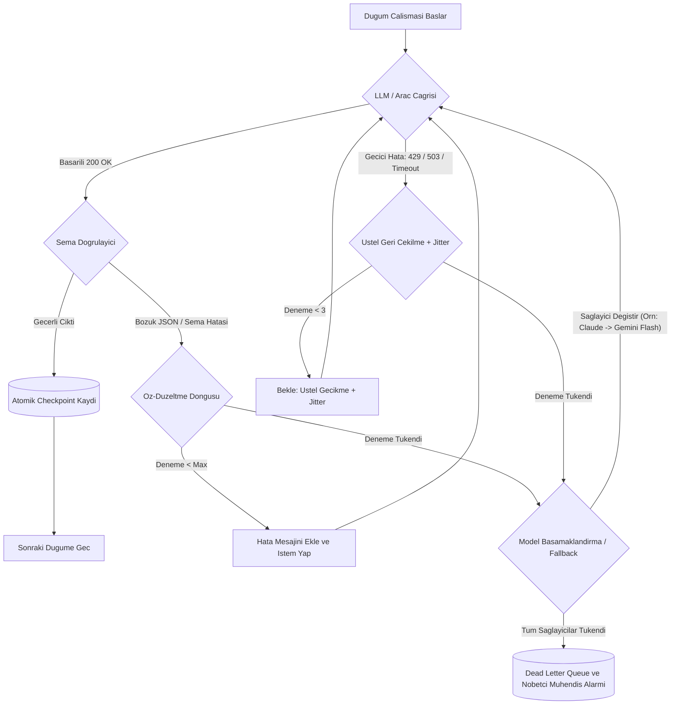
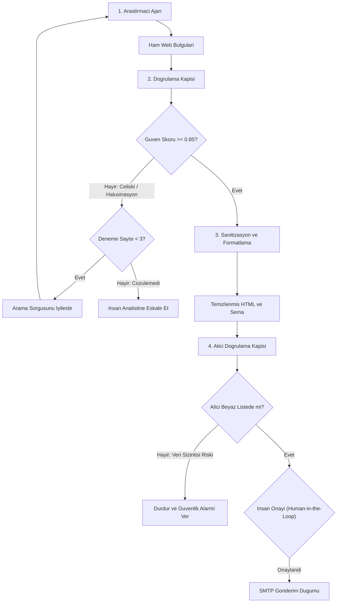

# Ajan Orkestrasyonu ve İş Akışı Yönetimi

<!-- toc -->

<br/>
<br/>

Üretim (production) ortamlarında, karmaşık ve çok aşamalı görevler için tek adımlı otonom ajanlar veya ilkel ReAct döngüleri kullanmak kısa sürede deterministik olmayan bir kaosa dönüşür. Tekil ajan istemleri (prompts); sınırsız bağlam penceresi (context window) şişmesi, ana hedeften sapma, sessizce yayılan halüsinasyonlar ve onuncu adımdaki basit bir ağ hatasının tüm süreci çöp etmesi gibi ölümcül riskler barındırır.

Kurumsal düzeyde güvenilir otonom sistemler inşa edebilmek için, kontrolsüz tekil ajan akıl yürütmesinden **Ajan Orkestrasyonu ve Deterministik İş Akışı Yönetimine (Agent Orchestration and Deterministic Workflow Management)** geçiş yapmak zorunludur.

Orkestrasyon; çoklu ajan operasyonlarını yapılandırılmış hesaplama grafikleri üzerinde modelleme, yürütme, izleme ve kurtarma disiplinidir. Ajan etkileşimlerini durum makineleri (state machines), yönlendirilmiş grafikler (directed graphs) ve dağıtık boru hatları olarak ele alan orkestrasyon; **katı durum sınırları (state boundaries)**, **öngörülebilir hata izolasyonu**, **İnsan Denetimi (Human-in-the-Loop - HITL) emniyet kalkanları** ve **hata toleranslı kalıcılık (persistence)** sağlar.

<br/>
<br/>

---

## 1. Mimari Paradigmalar: İlkel Döngülerden Yönlendirilmiş Hesaplama Grafiklerine

Ajanların birden fazla alt görev arasındaki yürütmesini organize ederken, sistemler genel olarak üç ana mimari kategoriye ayrılır:

| Mimari Paradigma | Durum Topolojisi | Determinizm | Hata Kurtarma | En İyi Kullanım Alanı |
| :--- | :--- | :--- | :--- | :--- |
| **Monolitik ReAct Döngüsü** | Yapılandırılmamış Konuşma Geçmişi | Düşük (Stokastik yörünge) | Yok (Tüm akışı baştan başlatma) | Ucu açık, tek adımlı soru-cevap |
| **Yönlendirilmiş Döngüsüz Grafik (DAG)** | Kesin Sıralı Bağımlılık Ağacı | Yüksek (Deterministik geçişler) | Adım seviyesinde checkpoint ile devam etme | Yapılandırılmış veri boru hatları, ETL, rapor üretimi |
| **Döngüsel Durum Grafiği (StateGraph)** | Durma Eşikli Döngüsel Durum Makinesi | Yüksek-Orta (Kontrollü geri besleme) | Düğüm seviyesinde checkpointing ve replay | Kod refaktörü, test-değerlendirici döngüleri, ajan münazaraları |

```mermaid
flowchart TD
    subgraph Topologies ["Dört Temel Orkestrasyon Topolojisi"]
        direction TB
        
        subgraph Top1 ["1. Sıralı Boru Hattı (Sequential Pipeline)"]
            direction LR
            S1[Veri Alımı] --> S2[Filtreleme] --> S3[Dönüştürme] --> S4[Kalıcı Kayıt]
        end

        subgraph Top2 ["2. Paralel Fan-Out / Fan-In (Map-Reduce)"]
            direction LR
            Dispatch[Dağıtıcı Düğüm] --> W1[Web Araştırmacı] & W2[Dahili Veritabanı] & W3[Vektör RAG]
            W1 & W2 & W3 --> Agg[Sentezleyici / Birleştirici]
        end

        subgraph Top3 ["3. Dinamik Niyet Yönlendirici (Router)"]
            direction LR
            Inp[Kullanıcı Sorgusu] --> Router{Niyet Sınıflandırıcı}
            Router -->|Kod Hatası| AgentCode[AST Onarım Ajanı]
            Router -->|Veri Sorgusu| AgentSQL[Text-to-SQL Ajanı]
            Router -->|Belirsiz/Riskli| AgentClarify[HITL İnsan Eskalasyonu]
        end

        subgraph Top4 ["4. Değerlendirici-Optimize Edici (Evaluator-Optimizer Loop)"]
            direction LR
            Generator[Üretici Ajan] --> Evaluator{Kalite ve Güvenlik Eşiği}
            Evaluator -->|Eşiğin Altında| Refiner[Öz-Düzeltme İstemi]
            Refiner --> Generator
            Evaluator -->|Değişmezleri Sağladı| TerminalNode((Onaylanmış Çıktı))
        end
    end
```

<br/>



<br/>

### 1.1 Sıralı Boru Hatları (Sequential Pipelines)
Sıralı bir boru hattında durum, tek boyutlu bir eksende deterministik olarak ilerler:

$$\mathcal{S}_{t+1} = \mathcal{T}_t(\mathcal{S}_t)$$

Her $\mathcal{T}_t$ düğümü özelleşmiş bir alt görevi icra eder ve durumu monotonik olarak dönüştürür. Hata ayıklaması oldukça kolaydır; ancak bağımsız adımlar gereksiz yere art arda bağlandığında ciddi gecikme (latency) birikir.

### 1.2 Fan-Out / Fan-In (Dağıt-Topla / Map-Reduce)
Alt görevler arasında veri bağımlılığı bulunmadığında, orkestratör bunları eşzamansız coroutine'ler halinde paralel yürütür. Bir senkronizasyon bariyeri (join düğümü), tüm alt dalların sonuçları dönene veya belirlenen zaman aşımı (timeout) dolana kadar bekler:

$$\mathcal{S}\_{\mathrm{agg}} = \operatorname{Reduce}\left( \left\lbrace \mathcal{S}\_i \mid i \in [1, K] \right\rbrace \right)$$

Bu topoloji, toplam sistem gecikmesini $\sum_{i=1}^K \tau_i$ süresinden $\max_{i}(\tau_i) + \tau_{\text{reduce}}$ seviyesine indirir.

### 1.3 Dinamik Yönlendirme ve Koşullu Dallanma (Dynamic Routing)
Yönlendirici düğüm mevcut durum içeriğini analiz eder ve $R(\mathcal{S}) \to \text{DüğümID}$ yönlendirme fonksiyonunu çalıştırır. Bu sayede basit sorgular ucuz ve hızlı modellere yönlendirilirken, kritik mimari kararlar derin akıl yürütme ajanlarına sevk edilir.

### 1.4 Değerlendirici-Optimize Edici (Döngüsel Öz-Düzeltme)
Kod üretimi veya tıbbi teşhis raporlama gibi yüksek hassasiyet gerektiren görevler yakınsama (convergence) garantisi ister. Üretici aday bir $\hat{y}$ çıktısı verir, değerlendirici ise nesnel bir $\mathcal{M}(\hat{y})$ metriğini ölçer. Eğer $\mathcal{M}(\hat{y}) < \theta$ ise, durum açık geri bildirimle ($\delta$) döngüye sokulur ve yakınsama sağlanana veya $K_{\max}$ tavanına ulaşılana kadar tekrarlanır.

<br/>
<br/>

---

## 2. İş Akışları, Dayanıklılık ve Gecikmenin Matematiksel Modeli

Kurumsal ölçekte bir orkestratör inşa etmek, durum geçişlerini, kümülatif hata olasılıklarını ve gecikme optimizasyonunu biçimsel matematiksel temellere oturtmayı gerektirir.

<br/>

### 2.1 Durum Monoidi ve Delta İndirgeyiciler (State Monoid & Reducers)

Dayanıklı bir iş akışı durumu $\mathcal{S}$, deterministik indirgeyiciler (reducers) ile güncellenen değişmez (immutable) bir veri yapısıdır. Mevcut $\mathcal{S} \in \mathfrak{S}$ durumu ve düğüm çıktısı olan $\Delta \mathcal{S} \in \mathfrak{D}$ farkı için geçiş işlemi ikili bir işlemdir:

$$\mathcal{S}_{t+1} = \mathcal{S}_t \oplus \Delta \mathcal{S}$$

Burada $\oplus$ işlemi monoid aksiyomlarını sağlar:
1. **Birleşme Özelliği (Associativity):** $(A \oplus B) \oplus C = A \oplus (B \oplus C)$
2. **Birim Eleman (Identity Element):** Öyle bir $\emptyset$ vardır ki $\mathcal{S} \oplus \emptyset = \mathcal{S}$ eşitliği sağlanır.

Birleşmeli delta indirgeyicileri sayesinde, paralel çalışan alt ajanların çıktıları (fan-in), yarış durumları (race conditions) oluşmadan ve genel anahtarlar ezilmeden güvenle birleştirilir.

<br/>

### 2.2 Kümülatif Hata Olasılığı ve Checkpointing Teorisi

$N$ adımdan oluşan sıralı bir iş akışını ele alalım. $p_i \in [0, 1]$, $i$. adımın bağımsız arıza olasılığı olsun (ağ zaman aşımı, rate limit veya şema doğrulama hatası gibi nedenlerle).

Hata kurtarma ve yeniden deneme mekanizması olmayan bir sistemde toplam arıza olasılığı $P_{\mathrm{fail}}$:

$$P_{\mathrm{fail}} = 1 - \prod_{i=1}^N (1 - p_i)$$

Her adımında görünüşte masum $\%5$'lik ($p_i = 0.05$) bir hata riski olan 10 adımlı bir hatta:

$$P_{\mathrm{fail}} = 1 - (0.95)^{10} = 1 - 0.5987 = 40.13\%$$

Hata toleransı olmayan bu sistemde **her 10 çalıştırmadan 4'ünden fazlası çökmeye mahkumdur**.

Her adım $k$ adet sınırlı üstel tekrar deneme (retry) ile korunduğunda, etkin adım hata olasılığı dramatik biçimde düşer:

$$\tilde{p}_i = p_i^{k+1}$$

$p_i = 0.05$ ve $k = 3$ tekrar deneme için:

$$\tilde{p}_i = (0.05)^4 = 6.25 \times 10^{-6}$$

$$P_{\mathrm{fail},\,\text{retry}} = 1 - (1 - 6.25 \times 10^{-6})^{10} \approx 0.00625\%$$

```mermaid
flowchart LR
    subgraph MaliyetKarsilastirma ["Islem Israfi Karsilastirmasi: Bastan Baslatma vs Checkpoint Replay"]
        direction TB
        subgraph Naive ["Ilkel Boru Hatti (Checkpoint Yok)"]
            N1["Adim 1 (Dusuk Maliyet)"] --> N2["Adim 2 (Orta Maliyet)"] --> N3["Adim 3 (Yuksek Maliyet)"] --> Fail1["Adim 4 COKTU"]
            Fail1 -.->|"Toplam Kayip: Sifirdan Calistirma"| R1["Yeniden Adim 1"]
        end
        subgraph Checkpointed ["Dayanikli Hat (Checkpoint Destekli)"]
            C1["Adim 1 (Dusuk Maliyet)"] --> C2["Adim 2 (Orta Maliyet)"] --> C3["Adim 3 (Yuksek Maliyet)"]
            C3 --> CP[("Checkpoint 3 Kaydedildi")]
            CP --> Fail2["Adim 4 COKTU"]
            Fail2 -.->|"CP3'ten Geri Yukle"| C4["Sadece Adim 4 Tekrari"]
        end
    end
```

<br/>



<br/>

### 2.3 Gecikme Optimizasyonu ve Amdahl Yasası

Tamamen sıralı çalışan bir iş akışının toplam süresi $T_{\mathrm{seq}}$:

$$T_{\mathrm{seq}} = \sum_{i=1}^N \tau_i$$

İş akışının $f \in [0, 1]$ kadarlık bir fraksiyonu $P$ adet paralel alt ajana dağıtılabiliyorsa, hızlandırılmış çalışma süresi $T_{\mathrm{par}}$ ve hızlanma faktörü $\kappa$, Amdahl Yasası ile sınırlanır:

$$T_{\mathrm{par}} = (1 - f) T_{\mathrm{seq}} + \frac{f \cdot T_{\mathrm{seq}}}{P} + \tau_{\mathrm{sync}}$$

$$\kappa = \frac{T_{\mathrm{seq}}}{T_{\mathrm{par}}} = \frac{1}{(1 - f) + \frac{f}{P} + \frac{\tau_{\mathrm{sync}}}{T_{\mathrm{seq}}}}$$

Burada $\tau_{\mathrm{sync}}$, ağ senkronizasyonu ve serileştirme yüküdür. Hızlanmayı maksimize etmek için orkestratör, bağımlılıkları analiz ederek $f$'i artırmalı ve senkronizasyon yükünü $\tau_{\mathrm{sync}}$ minimize etmelidir.

<br/>
<br/>

---

## 3. Durum Yönetimi, Şema Sözleşmeleri ve Çıktı Sanitizasyonu

Modern orkestrasyon motorları, tipi belirsiz serbest sözlükleri (global dictionaries) reddeder. Üretim ortamında bir ajan durum makinesi; tiplendirilmiş şemalar, atomik mutasyonlar ve deterministik doğrulama gerektirir.

<br/>

### 3.1 Değişmez (Immutable) Pydantic Durum Şeması

```python
from typing import List, Optional, Dict, Any
from pydantic import BaseModel, Field
from datetime import datetime

class OrchestratorState(BaseModel):
    workflow_id: str
    correlation_id: str
    query: str
    current_step: str = "INITIALIZED"
    iteration_count: int = 0
    raw_findings: List[str] = Field(default_factory=list)
    fact_check_score: float = 0.0
    sanitized_html: Optional[str] = None
    recipient_email: Optional[str] = None
    is_approved: bool = False
    metadata: Dict[str, Any] = Field(default_factory=dict)
    updated_at: datetime = Field(default_factory=datetime.utcnow)

    def evolve(self, **updates) -> "OrchestratorState":
        """Fonksiyonel değişmezliği koruyarak yeni bir durum kopyası döner."""
        copy_data = self.model_dump()
        copy_data.update(updates)
        copy_data["updated_at"] = datetime.utcnow()
        return OrchestratorState(**copy_data)
```

<br/>

### 3.2 Güvenlik, Sanitizasyon ve Geri Alınamaz Yan Etki Kapıları (Side-Effect Gating)

Bir ajan iş akışı dış dünyada kalıcı değişiklikler ürettiğinde (e-posta gönderme, prod veritabanına yazma, ödeme API'larına istek atma), iki zorunlu mimari emniyet mekanizması uygulanmalıdır:

1. **Deterministik HTML/Markdown Sanitizasyonu:** Web sitelerini tarayan LLM'ler zararlı script'leri (`<script>`, `<iframe src="...">`, sahte kimlik avı linkleri) istemeden içeriğe gömebilir. Çıktı formatlayıcılar, çıktıyı istemciye veya e-postaya iletmeden önce deterministik temizleyicilerden (`bleach`) geçirmelidir.
2. **Human-in-the-Loop (HITL) Yan Etki Bariyeri:** Bir e-posta gönderildiğinde veya bir satır silindiğinde bunun geri dönüşü yoktur. Geri alınamaz yan etkiye sahip herhangi bir düğüm; akışı durdurmalı, durumu kaydetmeli ve açık bir kriptografik token veya insan onayı beklemelidir.

```python
import bleach
from pydantic import field_validator

class EmailDeliveryPayload(BaseModel):
    recipient: str
    subject: str
    raw_body: str
    sanitized_body: str = ""

    @field_validator("recipient")
    def validate_recipient(cls, v: str) -> str:
        if not ("@" in v and "." in v.split("@")[-1]):
            raise ValueError(f"Geçersiz e-posta alıcısı: {v}")
        return v.strip().lower()

    def sanitize(self) -> None:
        """Zararlı HTML taglerini soyar ve biçimlendirmeyi güvenli etiketlerle sınırlar."""
        allowed_tags = ["p", "b", "i", "ul", "ol", "li", "h1", "h2", "table", "tr", "td", "a"]
        allowed_attrs = {"a": ["href", "title"]}
        self.sanitized_body = bleach.clean(self.raw_body, tags=allowed_tags, attributes=allowed_attrs, strip=True)
```

<br/>
<br/>

---

## 4. Hata Toleransı, Checkpointing ve Dağıtık Dayanıklılık

Geçici bulut ağı kesintileri, model rate limitleri ve servis darboğazları karşısında orkestratörün uçtan uca bir dayanıklılık kalkanı uygulaması gerekir.

<br/>



<br/>

### 4.1 Jitter Destekli Üstel Geri Çekilme (Exponential Backoff with Jitter)
Rate limit (HTTP 429) veya ağ kesintilerinde aynı anda anında tekrar denemek sunucuyu boğar. Orkestratörler rastgelelik (jitter) eklenmiş üstel geri çekilme uygular:

$$t_{\mathrm{wait}} = \min\left(t_{\max},\, t_{\mathrm{base}} \cdot 2^{\mathrm{attempt}}\right) + \mathcal{U}(0, \sigma_{\mathrm{jitter}})$$

### 4.2 Model Basamaklandırma (Model Tiering & Graceful Degradation)
Birincil amiral gemisi model (Claude 3.5 Sonnet / GPT-4o) çöktüğünde veya aşırı yoğunlaştığında, sistem görevi durdurmak yerine hızlı ve hafif bir ikincil modele (Gemini 1.5 Flash veya yerel vLLM kümesi) düşürür.

### 4.3 Checkpoint Serileştirme ve Replay (Geri Sarıp Çalıştırma)
Başarıyla tamamlanan her adım durumu, atomik bir kalıcı depoya (PostgreSQL / Redis) yazılır:

```python
import json
from abc import ABC, abstractmethod

class CheckpointStore(ABC):
    @abstractmethod
    async def save(self, workflow_id: str, step_id: str, state: OrchestratorState) -> None:
        pass

    @abstractmethod
    async def load_latest(self, workflow_id: str) -> Optional[OrchestratorState]:
        pass

class InMemoryCheckpointStore(CheckpointStore):
    def __init__(self):
        self._storage: Dict[str, Dict[str, str]] = {}

    async def save(self, workflow_id: str, step_id: str, state: OrchestratorState) -> None:
        if workflow_id not in self._storage:
            self._storage[workflow_id] = {}
        self._storage[workflow_id][step_id] = state.model_dump_json()

    async def load_latest(self, workflow_id: str) -> Optional[OrchestratorState]:
        steps = self._storage.get(workflow_id, {})
        if not steps:
            return None
        latest_step = list(steps.keys())[-1]
        return OrchestratorState.model_validate_json(steps[latest_step])
```

<br/>
<br/>

---

## 5. Uçtan Uca Orkestratör Mimarisi: Araştırma-Analiz-Raporlama Motoru

Aşağıdaki uygulama; durum değişmezliği, doğrulama bariyerleri ve checkpoint mekanizmasını birleştiren asenkron bir iş akışı motoru sunar.

```python
import asyncio
from typing import Dict, Callable, Awaitable

class WorkflowEngine:
    def __init__(self, checkpoint_store: CheckpointStore):
        self.nodes: Dict[str, Callable[[OrchestratorState], Awaitable[OrchestratorState]]] = {}
        self.checkpoints = checkpoint_store

    def add_node(self, name: str, func: Callable[[OrchestratorState], Awaitable[OrchestratorState]]):
        self.nodes[name] = func

    async def run(self, initial_state: OrchestratorState, execution_plan: List[str]) -> OrchestratorState:
        state = initial_state
        for step in execution_plan:
            node_fn = self.nodes.get(step)
            if not node_fn:
                raise ValueError(f"Bilinmeyen adım: {step}")
            
            # Yeniden deneme mekanizmasıyla adımı yürüt
            success = False
            for attempt in range(3):
                try:
                    state = await node_fn(state)
                    state = state.evolve(current_step=step)
                    await self.checkpoints.save(state.workflow_id, step, state)
                    success = True
                    break
                except Exception as ex:
                    await asyncio.sleep(2 ** attempt)
            
            if not success:
                state = state.evolve(current_step=f"FAILED_AT_{step}")
                await self.checkpoints.save(state.workflow_id, f"{step}_FAILED", state)
                raise RuntimeError(f"İş akışı şu adımda durdu: {step}")
                
        return state
```

<br/>
<br/>

---

## 6. Özet: Üretim Seviyesi Orkestratör Tasarım Matrisi

| Sistem İhtiyacı | Orkestrasyonsuz Sistemdeki Çöküş Modu | Orkestrasyon Çözüm Deseni |
| :--- | :--- | :--- |
| **10+ Adımda Yüksek Gecikme (Latency)** | Sıralı model çağrılarının birikmesiyle dakikalarca bekleme | DAG bağımlılık analizi ve Spekülatif Yürütme |
| **Sessiz Halüsinasyon Yayılımı** | 1. adımdaki uydurma verinin 10. adıma kadar denetimsiz akması | Katı eşikli Değerlendirici-Optimize Edici döngüleri |
| **Yarı Yolda Çökme / Kesinti** | Baştan başlatmanın maliyeti $10\times$ token israfına yol açar | Durum dondurma (checkpointing) ve atomik WAL replay |
| **Veri Sızıntısı / Spam Riski** | Yanlış alıcıya otomatik kontrolsüz e-posta gitmesi | HITL onayı, alıcı domain doğrulaması ve HTML temizleme |
| **Sağlayıcı Çökmesi (HTTP 503)** | Tüm uygulamanın kilitlenip hizmet verememesi | Üstel geri çekilme + Çoklu sağlayıcı model basamaklandırması |

<br/>
<br/>

---

## 7. İnteraktif Meydan Okumalar ve Sistem Tasarım Çözümleri

<br/>

<details>
<summary><b>Challenge 1 (Sistem Tasarımı): 4 Aşamalı Otonom Boru Hattı (Araştır ➔ Doğrula ➔ Formatla ➔ E-posta Gönder)</b></summary>
<br/>

#### Problem Tanımı
Şu adımları icra eden bir ajan iş akışı tasarlayacaksınız:
1. Genel web ve harici API'lar üzerinden teknik araştırma yapma.
2. Çıkarılan iddiaları doğrulama (fact-checking).
3. Doğrulanmış bulguları yönetici düzeyinde Markdown/HTML formatına dönüştürme.
4. Çıktıyı belirlenen paydaşlara e-posta ile gönderme.

Bu akıştaki kritik karar noktaları, arıza sınırları ve güvenlik denetimleri neler olmalıdır?

#### Mimari Çözüm
Boru hattı asla körü körüne sıralı bir zincir olarak inşa edilmemelidir. İki kritik yüksek risk (blast radius) sınırı içerir:



1. **Doğrulama Kapısı (Doğruluk Sınırı):** Arama sonuçları çelişkili bilgiler içeriyorsa veya modelin güven skoru $0.85$'in altındaysa, akış ikincil hedef odaklı aramalar yapmak üzere Değerlendirici-Optimize Edici döngüsüne girer. 3 denemede çözülemezse, yanlış bilgi göndermek yerine görev insan operatöre devredilir.
2. **Formatlama ve Sanitizasyon Sınırı:** LLM çıktısı katı Pydantic şemalarına zorlanır. Üretilen HTML, siteler arası betik çalıştırma (XSS), sahte link veya CSS açıklarını önlemek için `bleach.clean()` filtresinden geçirilir.
3. **E-posta Gönderim Kapısı (Geri Alınamaz Yan Etki):** E-posta gönderimi geri alınamaz bir işlemdir. Yanlış kişiye iç rapor gitmesi KVKK/GDPR ihlalidir. Alıcı adresi katı regex ve şirket içi domain beyaz listesiyle denetlenir. Sistem `INSAN_ONAYI_BEKLENIYOR` durumuna geçerek onay token'ı gelene kadar SMTP gönderimini dondurur.

</details>

<br/>

<details>
<summary><b>Challenge 2 (Dayanıklılık Mühendisliği): 5 Adımlı Hatta 3. Adım Çöktüğünde Kurtarma Stratejileri</b></summary>
<br/>

#### Problem Tanımı
5 adımlı bir ajan hattı (*1: Veri Çekme ➔ 2: Filtreleme ➔ 3: LLM Analizi ➔ 4: Raporlama ➔ 5: Bildirim*) **3. Adımda** patlamıştır. Hata nedeni API zaman aşımı veya şema doğrulama hatasıdır. 1. adımdan başlamadan bu akış nasıl kurtarılır?

#### Mimari Çözüm
1. adımdan başlamak gereksiz gecikme yaratır ve 1 ile 2. adımda harcanan pahalı token'ları çöpe atar. Staff Engineer düzeyinde 5 katmanlı bir dayanıklılık mimarisi uygulanır:

1. **Atomik Checkpoint ile Geri Sarma (Replay):** 2. adım çıktısını atomik bir depoya (Redis / PostgreSQL WAL) yazdığı için, orkestratör çalışma göstergesini doğrudan 2. adımın checkpoint'ine ayarlar. 1 ve 2 asla yeniden çalıştırılmaz.
2. **Jitter Destekli Üstel Geri Çekilme:** Geçici ağ kopmaları veya HTTP 429 Rate Limit için orkestratör rastgele gecikmeyle 3. adımı yeniden dener:
   $$t_{\mathrm{wait}} = 2^{\mathrm{attempt}} \times 1.5\text{s} + \mathcal{U}(0, 0.5\text{s})$$
3. **Öz-Düzeltme (Repair Prompting):** Hata bir Pydantic doğrulama hatasıysa (örn: eksik JSON alanı), orkestratör hafif bir onarım döngüsü başlatır. Bozuk çıktı ve hata mesajı modele verilerek sadece formatı düzeltmesi istenir.
4. **Model Basamaklandırma (Fallback Tiering):** Birincil model iki denemede de yanıt vermezse, orkestratör ikincil sağlayıcıya (örneğin harici API'dan yerel yüksek verimli vLLM kümesine veya yedek buluta) geçer.
5. **Dead Letter Queue (DLQ) İzolasyonu:** Tüm bu 5 katman tükenirse, durum DLQ'ya park edilir ve nöbetçi ekibe bildirim düşer. Sistem diğer eşzamanlı iş akışlarını aksatmadan çalışmaya devam eder.

</details>

<br/>

<details>
<summary><b>Challenge 3 (Gecikme Optimizasyonu): Birbirine Bağımlı Görünen 10 Sıralı Adımı Optimize Etme</b></summary>
<br/>

#### Problem Tanımı
Her adımı bir öncekine bağlı gibi görünen ve bu nedenle kabul edilemez derecede yüksek gecikmeye yol açan 10 sıralı adımlı bir ajan iş akışını nasıl optimize edersiniz?

#### Mimari Çözüm
Üretim kodlarında "tamamen sıralı" olarak etiketlenen iş akışları genelde yapay bağımlılıklar taşır. Gecikme 4 sistematik optimizasyonla düşürülür:

1. **DAG Bağımlılık Ayrıştırması:** Veri akış denetimi yapılır. Çoğu zaman 4, 5 ve 6. adımların sadece 2. adımın çıktısına ihtiyaç duyduğu, 3. adıma bağımlı olmadığı görülür. Doğrusal zincir bir DAG'a dönüştürülerek bağımsız dallar `asyncio.gather()` ile paralel (Fan-Out / Fan-In) çalıştırılır; kritik yol süresi kısalır.
2. **Adım Birleştirme (Step Consolidation):** 10 ayrı LLM çağrısı, 10 ayrı ağ el sıkışması ve gecikmesi demektir ($\sim 10 \times 300\text{ms} = 3\text{s}$ sadece ağ gecikmesi). Birbiriyle ilişkili adımlar (örn: "Varlık Çıkarma" ve "Duygu Analizi") tek bir çok alanlı Pydantic şema çağrısında birleştirilerek adım sayısı 10'dan 4'e düşürülür.
3. **Akış (Streaming) ve Spekülatif Yürütme:** Bir sonraki adım, önceki adımın 2000 kelimelik tüm yanıtı bitirmesini beklemez. Token'lar akarken (streaming), ilk yapısal blok üretildiği anda bir spekülatif ayrıştırıcı gerekli verileri kapıp sonraki adımı erkenden tetikler.
4. **Semantik Vektör Önbellekleme:** Çok adımlı akışlar genelde farklı kullanıcılardan gelen mükerrer alt görevleri çalıştırır. İstem girdileri embedding ile vektörleştirilip yüksek hızlı bir Redis semantik önbellekte (Kosinüs benzerliği $\ge 0.98$) taranır; eşleşme varsa ara adımlar $<15\text{ms}$ içinde model çağrısı yapılmadan önbellekten döner.

</details>
