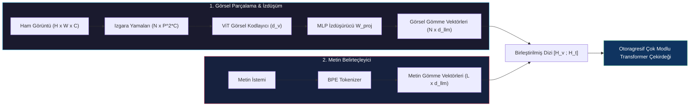
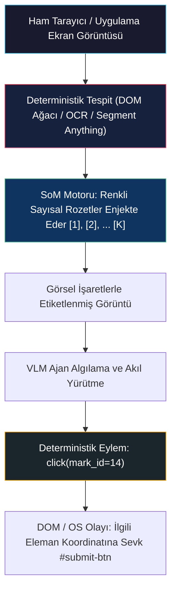
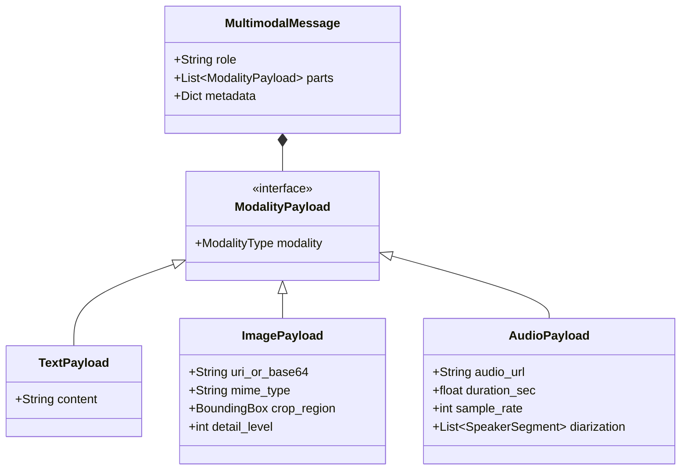
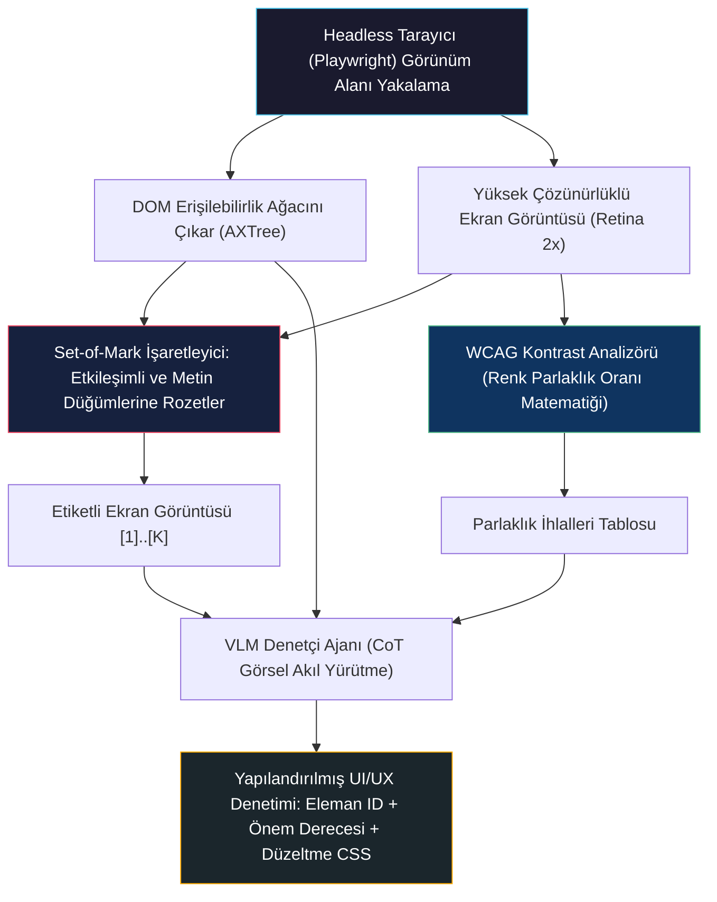
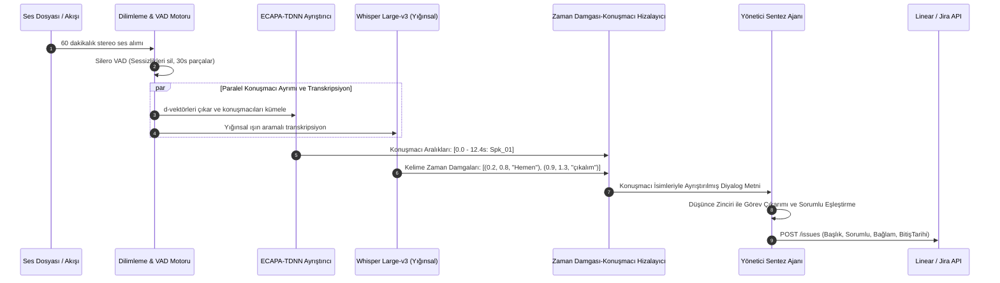

# Çok Modlu Ajanlar: Görüntü ve Ses

<!-- toc -->

<br/>
<br/>

Geleneksel otonom ajan mimarileri neredeyse tamamen ayrık alfanümerik metin token dizileri üzerinde çalışır. Salt metin tabanlı ReAct döngüleri ve grafik tabanlı orkestratörler kod sentezi, sembolik akıl yürütme ve yapılandırılmış API çağrılarında üstün başarı gösterse de, yönlendirmek üzere dağıtıldıkları fiziksel ve dijital ortamlara karşı temelde kör ve sağırdırlar. Gerçek dünyadaki insan iş akışları steril metin istemlerinde akmaz; dinamik grafik kullanıcı arayüzlerinde (GUI), yoğun görsel taslaklarda, mimari şemalarda, sesli toplantı kayıtlarında ve gerçek zamanlı konuşmalarda gerçekleşir.

Otonom sistemlerin kısıtlanmamış kurumsal ortamlarda güvenle görev yapabilmesi için, saf dil modellemesinden **Çok Modlu Ajan Mimarilerine (Multi-Modal Agent Architectures)** geçişi zorunludur.

Çok modlu bir ajan; görme, akustik dalga formları ve yapılandırılmış metin arasındaki heterojen sinyalleri kesintisiz bir biçimde içeri alır, bunlar üzerinde mantık yürütür ve eylemler üretir. **Vision-Language Modelleri (VLM)**, **uzamsal konumlama mekanizmaları (Set-of-Mark prompting)** ve **akışkan ses işleme boru hatlarını (ASR, konuşmacı ayrımı/diarization ve akustik konuşma sırası yönetimi)** bir araya getirerek, üst düzey akıl yürütme ile fiziksel/GUI etkileşimi arasındaki boşluğu kapatır.

<br/>
<br/>

---

## 1. Çok Modlu Paradigma Değişimi: Kodlayıcılar, Belirteçleme ve Hizalama

Otonom sistemlerde çok modluluk, birbirinden kopuk kara kutu API'ların kırılgan JSON yapıştırıcılarıyla birbirine bağlanmasıyla elde edilmez. Modern çok modlu sistemler, duyusal girdileri ortak bir hesaplamalı latent uzayda birleştirir; burada görüntü yamaları ve ses spektrogram çerçeveleri doğrudan dil modelinin transformer katmanlarına izdüşürülür.

<br/>

### 1.1 Görsel Parçalama (Patchification) ve Token İzdüşümü

Herhangi bir 2D görüntü $\mathbf{I} \in \mathbb{R}^{H \times W \times C}$ verildiğinde, standart bir Vision Transformer (ViT) sürekli uzamsal ızgaraları doğrudan işleyemez. Görüntü, $N$ adet örtüşmeyen yamaya $\mathbf{x}\_p \in \mathbb{R}^{N \times (P^2 \cdot C)}$ bölünür; burada $(P, P)$ yama çözünürlüğü (genellikle $14 \times 14$ veya $16 \times 16$) olup toplam yama sayısı şöyledir:

$$N = \frac{H \cdot W}{P^2}$$

Düzleştirilen her bir yama, öğrenilebilir doğrusal bir izdüşüm matrisi $\mathbf{W}\_v \in \mathbb{R}^{(P^2 \cdot C) \times d\_v}$ aracılığıyla $d\_v$-boyutlu görsel gömme uzayına izdüşürülür:

$$\mathbf{z}\_0 = \left[ \mathbf{x}\_p^1 \mathbf{W}\_v; \mathbf{x}\_p^2 \mathbf{W}\_v; \dots; \mathbf{x}\_p^N \mathbf{W}\_v \right] + \mathbf{E}\_{\text{pos}}$$

Burada $\mathbf{E}\_{\text{pos}} \in \mathbb{R}^{N \times d\_v}$ öğrenilebilir veya sinüzoidal 2D uzamsal konum gömmelerini temsil eder.

Bu görsel token'ları gömme boyutu $d\_{\text{llm}}$ olan bir Büyük Dil Modeline (LLM) beslemek için, $f\_{\phi}$ bağdaştırıcı/izdüşüm modülü (örneğin 2-katmanlı bir MLP veya Perceiver Resampler) öznitelik boyutlarını hizalar:

$$\mathbf{H}\_v = f\_{\phi}(\mathbf{z}\_L) = \operatorname{GELU}(\mathbf{z}\_L \mathbf{W}\_1 + \mathbf{b}\_1) \mathbf{W}\_2 + \mathbf{b}\_2 \quad \in \mathbb{R}^{N \times d\_{\text{llm}}}$$



<br/>

### 1.2 Çok Modlu Hizalamanın Matematiksel Modeli

Modlar arası temsil öğrenimi, talimat ince ayarından (instruction tuning) önce metin ve görsel temsiller arasındaki hizalamanın optimize edilmesine dayanır. Karşıtırmalı ön-eğitimde (CLIP / SigLIP), $B$ büyüklüğündeki bir yığındaki normalize edilmiş görsel öznitelik vektörleri $\mathbf{v}\_i = \frac{f\_v(\mathbf{I}\_i)}{\|f\_v(\mathbf{I}\_i)\|}$ ve metinsel öznitelik vektörleri $\mathbf{t}\_i = \frac{f\_t(\mathbf{T}\_i)}{\|f\_t(\mathbf{T}\_i)\|}$, simetrik InfoNCE kaybı ile eğitilir:

$$\mathcal{L}\_{\text{contrastive}} = - \frac{1}{2B} \sum\_{i=1}^B \left( \log \frac{\exp(\langle \mathbf{v}\_i, \mathbf{t}\_i \rangle / \tau)}{\sum\_{j=1}^B \exp(\langle \mathbf{v}\_i, \mathbf{t}\_j \rangle / \tau)} + \log \frac{\exp(\langle \mathbf{t}\_i, \mathbf{v}\_i \rangle / \tau)}{\sum\_{j=1}^B \exp(\langle \mathbf{t}\_i, \mathbf{v}\_j \rangle / \tau)} \right)$$

Burada $\tau$ öğrenilebilir bir sıcaklık hiperparametresi olup $\langle \cdot, \cdot \rangle$ kosinüs benzerliğini belirtir. Üretken ajan yürütümünde dil modelleme kaybı, hem görsel hem de metinsel önekler koşullanarak hesaplanır:

$$\mathcal{L}\_{\text{LM}}(\theta, \phi) = - \sum\_{k=1}^{L} \log P\_{\theta, \phi}(y\_k \mid \mathbf{H}\_v, y\_{\lt k})$$

<br/>
<br/>

---

## 2. Vision-Language Modelleri ve Ajanlarda Uzamsal Konumlama

Standart bir VLM bir görüntüyü doğal dilde rahatlıkla betimleyebilirken ("Bu, üzerinde mavi bir onay butonu bulunan bir giriş sayfasıdır"), otonom bir ajanın **uzamsal görsel konumlama (spatial visual grounding)** yapması gerekir: yani kullanıcının anlamsal hedefini ekrandaki kesin ve eyleme dönüştürülebilir koordinatlara tercüme etmelidir.

<br/>

### 2.1 Doğrudan Koordinat Üretiminin Açmazları (Hallucination Dilemma)

İlk nesil GUI ajanları doğrudan koordinat üretimine dayanıyordu: modelden doğrudan piksel koordinatları $(x, y)$ ya da $[0, 1000]$ aralığında normalize edilmiş sınırlayıcı kutu demetleri $[y\_{\min}, x\_{\min}, y\_{\max}, x\_{\max}]$ üretmesi isteniyordu.

Bu yaklaşım üretim ortamlarında üç temel sebepten ötürü başarısız olur:
1. **Çözünürlük Bozulması ve En-Boy Oranı Ölçeklemesi:** VLM'ler keyfi en-boy oranlarını sabit karelere ($448 \times 448$ veya $336 \times 336$) yeniden boyutlandırır ve bu da doğrusal olmayan uzamsal çarpılmalara yol açar.
2. **Konumsal Dikkat Bulanıklığı (Attention Blur):** Uzamsal yamalar üzerindeki öz-dikkat mekanizması piksel düzeyinde alt-yama çözünürlüğünden yoksundur; tıklanabilir bir nesnenin $x = 512$ mi yoksa $x = 528$ pikselde mi olduğunu kestirmek stokastiktir.
3. **Yüksek Hata Maliyeti:** $\pm 15\text{px}$ sapmış tek bir hatalı tıklama, açılır menünün dışına basabilir, kaydedilmemiş bir modal pencereyi kapatabilir veya geçersiz form gönderebilir.

<br/>

### 2.2 Deterministik Konumlama: Set-of-Mark (SoM) Yöntemi

Koordinat halüsinasyonunu aşmak için modern görsel ajanlar **Set-of-Mark (SoM)** istemleme tekniğini kullanır. Modele ham piksel sayılarını tahmin ettirmek yerine, görüntü VLM'e iletilmeden önce yardımcı deterministik bir görüntü işleme hattı (veya DOM sınırlayıcı kutu çıkarıcısı) tarafından ön işlemden geçirilir:

1. Etkileşimli UI öğeleri (butonlar, giriş alanları, bağlantılar, menüler) anlamsal bölütleme, OCR veya tarayıcı DOM ağacı aracılığıyla tespit edilir.
2. Tespit edilen her öğe, yüksek kontrastlı renkli bir kutu içine belirgin bir alfanümerik etiket (`[1]`, `[2]`, `[14]`) yerleştirilerek işaretlenir.
3. VLM'e bu alfanümerik kimlikleri referans alması talimatı verilir: `"Ödeme formunu göndermek için [14] numaralı işarete tıkla"`.



> **Temel Mimari Çıkarım:** Set-of-Mark yöntemi, hatalı tanımlanmış sürekli bir regresyon problemini (sürekli 2D koordinat tahmini), ayrık bir sınıflandırma ve akıl yürütme görevine ($k \in \{1, \dots, K\}$ etiketi seçimi) dönüştürerek GUI benchmark testlerinde başarı oranını $\%60$'ın altından $\%94$'ün üzerine çıkarır.

<br/>
<br/>

---

## 3. Ses İşleme, Konuşmacı Ayrımı (Diarization) ve Sesli Ajan Döngüleri

Telefon santrallerinde, toplantılarda veya sesli komut döngülerinde çalışan otonom ajanlar güçlü akustik algıya ihtiyaç duyar. Akustik sinyaller hızlı dalgalanmalara sahip sürekli zamansal basınç dalgalarıdır ve özel dönüşüm boru hatları gerektirir.

<br/>

### 3.1 Akustik Algı Hattı

Örnekleme frekansı $f\_s$ (örn. 16 kHz) olan ham sürekli ses $x(t)$, zaman-frekans uzayında ayrık dönüşüme uğrar:

1. **Pencerleme ve STFT:** Kısa Zamanlı Fourier Dönüşümü (STFT), yerel frekans spektrumlarını hesaplamak için örtüşen Hamming pencereleri ($w[n]$, tipik olarak $25\text{ms}$ pencere süresi ve $10\text{ms}$ adım mesafesi) uygular:
   $$X(m, \omega) = \sum\_{n=-\infty}^{\infty} x[n] w[n - m] e^{-j \omega n}$$
2. **Mel Ölçekli Filtre Bankası İzdüşümü:** İnsan işitme sistemi doğrusal olmayan perde hassasiyetine sahiptir. Frekanslar $f$ (Hz), Mel ölçeğine $m = 2595 \log\_{10}(1 + f / 700)$ dönüştürülür. Üçgen filtre bankaları spektral enerjiyi $F$ kanalda (tipik olarak 80 veya 128 Mel kanalı) toplar.
3. **Logaritmik Dinamik Aralık Sıkıştırması:** $\mathbf{S}\_{\text{mel}} = \log(1 + \text{MelFilterBank}(|X|^2))$.


<br/>

### 3.2 Konuşmacı Ayrımı ("Kimin Ne Zaman Konuştuğunun Belirlenmesi")

Toplantı analitiği ve çok konuşmacılı ortamlarda standart sesten metne (ASR) dönüştürme yetersiz kalır. Ajan her ifadeyi belirli bir aktöre atamalıdır. Konuşmacı Ayrımı (Speaker Diarization) dört aşamadan oluşur:

$$\text{Ses Akışı} \xrightarrow{\text{VAD}} \text{Konuşma Parçaları} \xrightarrow{\text{Gömme}} \text{Konuşmacı } d\text{-vektörleri} \xrightarrow{\text{Kümeleme}} \text{Konuşmacı Etiketleri}$$

1. **Ses Aktivitesi Algılama (VAD):** Akustik enerjiye ve sinir ağı sınıflandırmasına (örn. Silero VAD) dayanarak konuşma dışı kareleri ve ortam sessizliğini filtreler.
2. **Konuşmacı Temsili Çıkarımı:** Sürekli konuşma segmentleri alt pencerelere bölünür ($1.5\text{s}$ süre, $0.75\text{s}$ örtüşme). Ön-eğitimli bir sinir ağı (örn. ECAPA-TDNN), her segmenti kompakt bir $d$-boyutlu konuşmacı gömmesine $\mathbf{e}\_s \in \mathbb{R}^{192}$ eşler.
3. **Kümeleme ve Segmentasyon:** Yığınsal Hiyerarşik Kümeleme (AHC) veya Spektral Kümeleme, gömmeleri kosinüs uzaklığı eşiği $\theta\_{\text{diar}}$ kullanarak gruplar:
   $$D(\mathbf{e}\_a, \mathbf{e}\_b) = 1 - \frac{\mathbf{e}\_a \cdot \mathbf{e}\_b}{\|\mathbf{e}\_a\|\_2 \|\mathbf{e}\_b\|\_2}$$
4. **Hizalama ve Birleştirme:** ASR kelime zaman damgaları kümelenmiş zamansal aralıklarla hizalanır ve yapılandırılmış diyalog demetleri elde edilir: `(Başlangıç_Zamanı, Bitiş_Zamanı, Konuşmacı_ID, İfade)`.

<br/>

### 3.3 Gerçek Zamanlı Konuşma Gecikme Bütçesi (Latency Budget)

İnsanlar arası doğal konuşmalarda yanıt verme gecikme eşiği yaklaşık **250–350 ms** seviyesindedir. 500 ms'nin aşılması yapay ve rahatsız edici duraklamalara yol açar. Kademeli bir sesli ajan mimarisinde (ASR $\to$ LLM $\to$ TTS), gecikme kesin limitlere tabidir:

| Boru Hattı Aşaması | Teknoloji | Hedef Gecikme | Optimizasyon Stratejisi |
| :--- | :--- | :--- | :--- |
| **1. Ses Alma & VAD** | Silero VAD / WebRTC VAD | $20 - 40\text{ ms}$ | Çerçeve parçalama ($20\text{ms}$ tamponlar), dairesel tampon akışı |
| **2. ASR (Sesten Metne)** | Akışkan Whisper / Deepgram Nova | $80 - 140\text{ ms}$ | Parçalı CTC / Spekülatif ışın araması |
| **3. LLM İlk Token (TTFT)** | Hızlı Kuantize Edilmiş Model | $100 - 150\text{ ms}$ | KV-cache önekleme, spekülatif kod çözme, prompt önbelleği |
| **4. TTS (Metinden Sese)** | Akışkan FastSpeech2 / ElevenLabs | $60 - 90\text{ ms}$ | WebSocket üzerinden cümle/tümcecik bazlı sentez |
| **Toplam Gidiş-Dönüş** | **Uçtan Uca Kademeli Sistem** | **$260 - 420\text{ ms}$** | **Boru hattı akışı (TTS ilk LLM tümceciğinde başlar)** |

<br/>
<br/>

---

## 4. Çok Modlu Araç Entegrasyonu ve Birleşik Çalışma Zamanı

Gerçek anlamda çok modlu bir ajan, modaliteleri yalnızca ilk kullanıcı istemiyle sınırlandırmaz; çalışma yörüngesi boyunca çok modlu araçları dinamik olarak çağırır.

<br/>

### 4.1 Durum Yönetiminde Modallık Polimorfizmi

Kurumsal bir ajan çerçevesi, durumu şişirmeden çok modlu mesajları temsil edebilmelidir. Mesaj yükü; metin token'larını, görsel kırpmaları, base64 tamponlarını ve ham ses referanslarını destekleyen polimorfik bir ayrık birleşim (discriminated union) olarak modellenir:



<br/>

### 4.2 Çok Modlu Token Patlaması ve Bağlam Sınırı Yönetimi

Otoragresif LLM'ler içinde görsel ve akustik verilerin işlenmesi ciddi hesaplama ve token maliyetleri doğurur:
- **Görüntü Döşeme (Tiling) Maliyetleri:** Yüksek çözünürlüklü ekran görüntüleri ($1920 \times 1080$), aşırı metin bulanıklığı olmadan tek bir $336 \times 336$ yama ızgarasına sığamaz. Modern VLM'ler görüntüyü bir küçük resim ve birden fazla $336 \times 336$ parçaya böler (örneğin ekran görüntüsü başına $6$ parça $\times 256\text{ token} = 1536\text{ token}$).
- **Çok Turlu Bağlam Tüketimi:** 10 turluk bir tarayıcı otomasyonunda, her turda tam çözünürlüklü ekran görüntüsü göndermek yalnızca görseller için $15{,}000+$ prompt token harcar ve bağlam penceresini hızla tüketir.
- **Mimari Çözüm:** Dinamik Görsel Tahliye (Visual Eviction). Ajan tam çözünürlüklü görüntüyü yalnızca mevcut adım ($t$) için tutar; geçmiş adımları ($t-1, t-2, \dots$) ise özet metinsel eylem-gözlem günlüklerine dönüştürür:
  $$\mathcal{H}\_t = \left[ (\mathbf{a}\_1, \mathbf{o}\_1^{\text{metin}}), \dots, (\mathbf{a}\_{t-1}, \mathbf{o}\_{t-1}^{\text{metin}}), (\mathbf{I}\_t, \mathbf{a}\_t) \right]$$

<br/>
<br/>

---

## 5. Temiz ve Temsilî Kod Mimarisi

Aşağıdaki üretime hazır kod blokları; çok modlu algı, Set-of-Mark uzamsal konumlaması ve konuşmacı ayrımlı ses hattı yürütümü için gereken temel soyutlamaları gösterir.

<br/>

### 5.1 Polimorfik Çok Modlu Şema (Pydantic v2)

```python
from typing import List, Literal, Optional, Union
from pydantic import BaseModel, Field

class BoundingBox(BaseModel):
    ymin: int = Field(..., ge=0, le=1000)
    xmin: int = Field(..., ge=0, le=1000)
    ymax: int = Field(..., ge=0, le=1000)
    xmax: int = Field(..., ge=0, le=1000)

class ImagePart(BaseModel):
    type: Literal["image"] = "image"
    data_uri: str
    mark_id: Optional[int] = None
    bbox: Optional[BoundingBox] = None

class AudioPart(BaseModel):
    type: Literal["audio"] = "audio"
    audio_path: str
    sample_rate: int = 16000
    duration_s: float

class TextPart(BaseModel):
    type: Literal["text"] = "text"
    text: str

class MultimodalMessage(BaseModel):
    role: Literal["system", "user", "assistant", "tool"]
    parts: List[Union[TextPart, ImagePart, AudioPart]]
```

<br/>

### 5.2 Set-of-Mark (SoM) Görsel İşaretleme Motoru

```python
import cv2
import numpy as np

class SetOfMarkAnnotator:
    """UI sınırlayıcı kutularına deterministik alfanümerik etiketler çizer."""
    def __init__(self, font_scale: float = 0.5, thickness: int = 2):
        self.font_scale = font_scale
        self.thickness = thickness

    def annotate(self, image: np.ndarray, detections: List[BoundingBox]) -> np.ndarray:
        h, w, _ = image.shape
        marked_img = image.copy()
        for idx, bbox in enumerate(detections, start=1):
            y1, x1 = int(bbox.ymin * h / 1000), int(bbox.xmin * w / 1000)
            y2, x2 = int(bbox.ymax * h / 1000), int(bbox.xmax * w / 1000)
            # Sınır çizgisini ve etiket kutucuğunu çiz
            cv2.rectangle(marked_img, (x1, y1), (x2, y2), (0, 255, 0), 2)
            label = f"[{idx}]"
            cv2.rectangle(marked_img, (x1, y1 - 20), (x1 + 35, y1), (0, 0, 0), -1)
            cv2.putText(marked_img, label, (x1 + 2, y1 - 5), 
                        cv2.FONT_HERSHEY_SIMPLEX, self.font_scale, (0, 255, 255), self.thickness)
        return marked_img
```

<br/>

### 5.3 Akustik Toplantı Analiz Hattı (VAD + Diarization + ASR)

```python
from dataclasses import dataclass
from typing import List

@dataclass
class SpeakerUtterance:
    speaker: str
    start_time: float
    end_time: float
    text: str

class AudioIntelligencePipeline:
    """Toplantı transkriptleri için VAD, Konuşmacı Ayrımı ve ASR'ı koordine eder."""
    def __init__(self, vad_model, diarizer_model, asr_model):
        self.vad = vad_model
        self.diarizer = diarizer_model
        self.asr = asr_model

    async def process_stream(self, audio_chunk: bytes) -> List[SpeakerUtterance]:
        if not self.vad.is_speech(audio_chunk):
            return []
        
        # Konuşmacı kümesini ve transkripti eşzamanlı çıkar
        speaker_id = self.diarizer.identify_speaker(audio_chunk)
        raw_text = await self.asr.transcribe_chunk(audio_chunk)
        
        return [SpeakerUtterance(speaker=speaker_id, start_time=0.0, 
                                 end_time=1.5, text=raw_text)]
```

<br/>

### 5.4 Görsel Bağlam Tahliyeli Çok Modlu Ajan Denetleyicisi

```python
class MultimodalAgentController:
    """Görsel bağlamı temizleyerek çok modlu algı döngülerini yürütür."""
    def __init__(self, vlm_client, annotator: SetOfMarkAnnotator):
        self.vlm = vlm_client
        self.annotator = annotator
        self.history: List[MultimodalMessage] = []

    async def step(self, current_screenshot: np.ndarray, user_goal: str) -> str:
        # Etkileşimli adayları tespit et ve SoM etiketlerini ekle
        boxes = await self._detect_dom_elements()
        annotated = self.annotator.annotate(current_screenshot, boxes)
        
        # Token bütçesini korumak için geçmiş turlardaki ağır görüntüleri tahliye et
        for msg in self.history:
            msg.parts = [p for p in msg.parts if p.type != "image"]
            
        # Güncel görsel durumu ve istemi ekle
        self.history.append(MultimodalMessage(
            role="user",
            parts=[ImagePart(data_uri=self._to_b64(annotated)), TextPart(text=user_goal)]
        ))
        return await self.vlm.generate_decision(self.history)
```

<br/>
<br/>

---

## 6. Resmi Challenge'lar ve Mimari Çözümler

Aşağıdaki senaryolar resmi MasterFabric Academy Day 22 müfredat challenge'larını temsil eder.

<br/>

<details>
<summary><strong>Senaryo 1 (Görsel): Uzamsal Konumlamalı Otomatik Web UI/UX ve Erişilebilirlik Denetçisi</strong></summary>
<br/>

### Problem Tanımı
Bir web uygulamasının ekran görüntülerini inceleyen ve kapsamlı, uygulanabilir UI/UX ile erişilebilirlik (WCAG 2.1) denetim raporları üreten otonom bir ajan tasarlayın. Halüsinasyon içeren geri bildirimleri önlemek için hangi özel araçlar, istem mimarileri ve uzamsal konumlama stratejileri birleştirilmelidir?

### Mimari Çözüm



#### 1. Modalite Bağlantısı ve Konumlama
- Yalnızca ham VLM görme yeteneğine güvenmek belirsiz uzamsal tahminler üretir (örn. boşluğun 8px mi yoksa 16px mi olduğunu tahmin etmeye çalışmak).
- Ajan, **Playwright ekran yakalamasını** tarayıcının **Erişilebilirlik Ağacı (AXTree)** ile eşleştirir. Görünürdeki her öğe, kesin DOM XPath'ine ve hesaplanan CSS sınırlayıcı dikdörtgenine karşılık gelen deterministik bir Set-of-Mark `[k]` rozeti alır.

#### 2. Özel Araç Paketi
- **Deterministik WCAG Parlaklık Hesaplayıcısı:** Metin-arka plan kontrast oranını bağıl parlaklık formülüyle hesaplar:
  $$L = 0.2126 R + 0.7152 G + 0.0722 B$$
  $$\text{Kontrast Oranı} = \frac{L\_1 + 0.05}{L\_2 + 0.05}$$
  Normal metin için oran $< 4.5:1$ ise ihlal raporlar (WCAG AA).
- **Duyarlı Görünüm Alanı (Responsive Viewport) Test Aracı:** Yatay taşma hatalarını ve dokunma hedefi ihlallerini ($< 44 \times 44\text{px}$) yakalamak için farklı görünüm alanlarını ($375\text{px}$ mobil, $768\text{px}$ tablet, $1440\text{px}$ masaüstü) eşzamanlı test eder.

#### 3. Çıktı Şeması Değişmezi (Invariant)
Ajan yapılandırılmış Pydantic nesneleri yayar:
`{ "mark_id": 12, "element_selector": "button.checkout-btn", "violation_type": "WCAG_TOUCH_TARGET", "measured_value": "32x28px", "required_threshold": "44x44px", "remediation_css": "min-height: 44px; padding: 12px;" }`.

</details>

<br/>

<details>
<summary><strong>Senaryo 2 (Ses): Üst Düzey Yönetici Toplantı Zekası ve Aksiyon Maddesi Çıkarımı</strong></summary>
<br/>

### Problem Tanımı
Saatler süren ham toplantı ses kayıtlarını alan, farklı konuşmacıları tanımlayan, yönetici özeti oluşturan ve doğrulanmış aksiyon maddelerini sorumlularıyla birlikte proje takip sistemlerine (Jira / Linear) ileten otonom bir ajan nasıl inşa edilir?

### Mimari Çözüm



#### 1. Transkripsiyon-Konuşmacı Hizalama Matematiği
Başlangıç ve bitiş zaman damgaları $[t\_{s}(w\_i), t\_{e}(w\_i)]$ olan $w\_i$ kelimesi ve $S\_k = [T\_{s}(S\_k), T\_{e}(S\_k)]$ konuşmacı aralığı verildiğinde, kelime zamansal kesişimi maksimize eden konuşmacı $k$'ya atanır:

$$k^* = \arg\max\_k \operatorname{Overlap}(w\_i, S\_k) = \arg\max\_k \max\left(0, \min(t\_{e}(w\_i), T\_{e}(S\_k)) - \max(t\_{s}(w\_i), T\_{s}(S\_k))\right)$$

#### 2. Konuşmacı İsmi Çözümleme Alt Ajanı
Ham ayrıştırma konuşmacıları anonim olarak etiketler (`Speaker_00`, `Speaker_01`). Özel bir alt ajan diyaloğu tarayarak kendini tanıtma ("Ben altyapı ekibinden Ahmet") ve çapraz hitapları ("Mehmet, veritabanı geçişi hakkında ne düşünüyorsun?") inceler. Anonim kümeleri doğrulanmış kurumsal kimliklerle eşleştiren bir ad çözümleme sözlüğü oluşturur.

#### 3. Aksiyon Maddesi Çıkarım Değişmezi
Beyin fırtınası sırasındaki fikirlerden sahte taahhütler çıkarmayı önlemek için ajan katı yüklem ve sorumluluk filtreleri uygular:
- İfadeler açık taahhüt fiilleri içermelidir (*"Ben teslim edeceğim"*, *"Ahmet'in görevi üstlenmesine karar verdik"*).
- Pasif öneriler (*"Buna belki sonra bakabiliriz"*) asla *Aksiyon Maddesi* olarak değil, *Tartışma Notu* olarak sınıflandırılır.

</details>

<br/>

<details>
<summary><strong>Senaryo 3 (Entegrasyon & Sistemler): Çok Modlu Üçlem (Gecikme, Doğruluk ve Bağlam Maliyeti)</strong></summary>
<br/>

### Problem Tanımı
Metin, görüntü ve sesi aynı anda işleyen bir ajan tasarlarken karşılaşılan temel mimari darboğazlar nelerdir? Bağlam penceresi tüketimi, gecikme bütçeleri ve modlar arası hizalama kayması (drift) arasındaki ödünleşimleri analiz edin.

### Mimari Çözüm

#### 1. Bağlam Penceresi Patlaması ve Maliyet Dinamikleri
- **Görüntü Token Yükü:** Tek bir $1080\text{p}$ görüntü döşeme ayrıştırmasına bağlı olarak $1000$ ile $2000$ token tüketir. 20 adımlık bir otonom döngüde görseller işlem başına $>30{,}000$ token harcar.
- **Ses Token Yükü:** Saniyede $12.5\text{ token}$ hızında (Whisper kodlayıcı temsili), 10 dakikalık bir sesli görüşme $7{,}500$ ses token'ı üretir.
- **Optimizasyon Stratejisi:**
  1. **Çift Kademeli Çözünürlük:** Keşif amaçlı ekran görüntülerini düşük çözünürlüğe indirge ($336\times 336$ tek parça, $256$ token). Yalnızca ajan yoğun metin veya küçük simge kümelerine odaklandığında yüksek çözünürlüklü kırpma ($1536$ token) tetikle.
  2. **Geçici Gözlem Budaması:** Bir eylem yürütüldükten sonra ham görüntüyü çalışma belleğinden temizle. Yalnızca 20 kelimelik metinsel algı özetini sakla.

#### 2. Çok Modlu Hizalama Kayması ve Halüsinasyon Güvenlik Rayları
- **"Kör İnanç" Halüsinasyonu:** Bir görüntü kafa karıştırıcı görsel gürültü içerdiğinde, LLM'in dil öncülü görsel gerçekliği bastırabilir (örneğin etrafındaki metin "Kabul Edildi" yazdığı için onay kutusunun işaretli olduğunu iddia etmek).
- **Doğrulama Güvenlik Rayı:** Çapraz Modlu Doğrulama ile Öz-Tutarlılık. Ajan görsel iddiaları alttaki DOM/OS erişilebilirlik ağacıyla çapraz doğrular:
  $$\text{IsChecked}\_{\text{doğrulanmış}} = \text{VLM}(\text{EkranGörüntüsü}) \land \text{DOM}(\text{aria-checked == 'true'})$$
  Modaliteler çelişirse, ajan bir eylem gerçekleştirmek yerine aktif bir yeniden inceleme aracı (yakınlaştırma veya açık DOM sorgusu) tetikler.

#### 3. Sesli Ajanlar İçin Gecikme Mimarisi
- Standart kademeli boru hatları (VAD $\to$ ASR $\to$ LLM $\to$ TTS) ardışık olarak $\approx 800 - 1200\text{ms}$ gecikme üretir.
- İnsan benzeri akıcı etkileşime ($\lt 350\text{ms}$) ulaşmak için sistemler **boru hattı spekülatif akışını** uygulamalıdır:
  - **Erken Cümle Akışı:** LLM, token'ları tümcecik sınır tespitçisine (`.` veya `,`) anında akıtır.
  - **Spekülatif TTS Sentezi:** 4 kelimelik bir tümcecik sentezlendiği anda, LLM düşüncenin geri kalanını üretmeye devam ederken TTS üretimi başlar.
  - **Araya Girme Kapısı (Barge-in / Interruption Gate):** Sürekli VAD kullanıcının ses girişini dinler. Ajanın TTS'i çalarken kullanıcının konuştuğu algılanırsa, anında bir kesme sinyali TTS tampon çalmasını durdurur ve akış soketini temizler.

</details>
