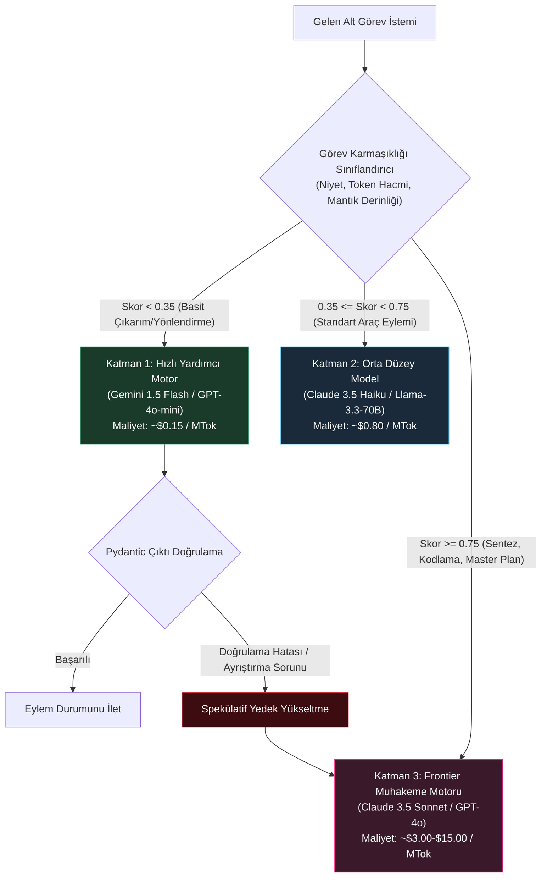
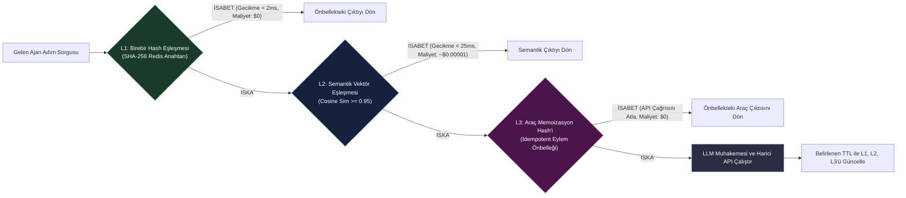
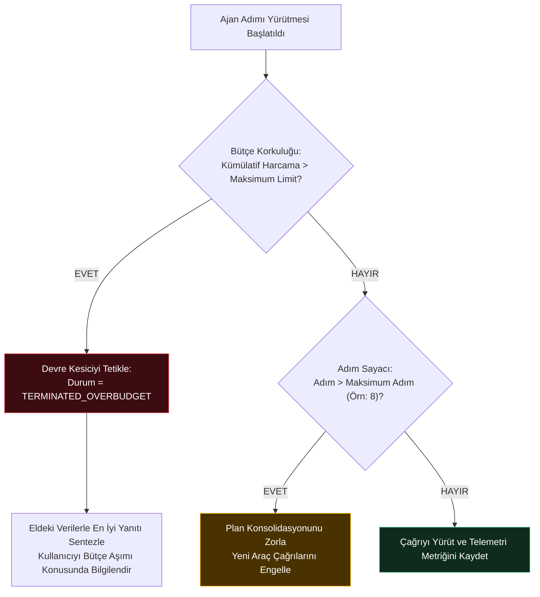
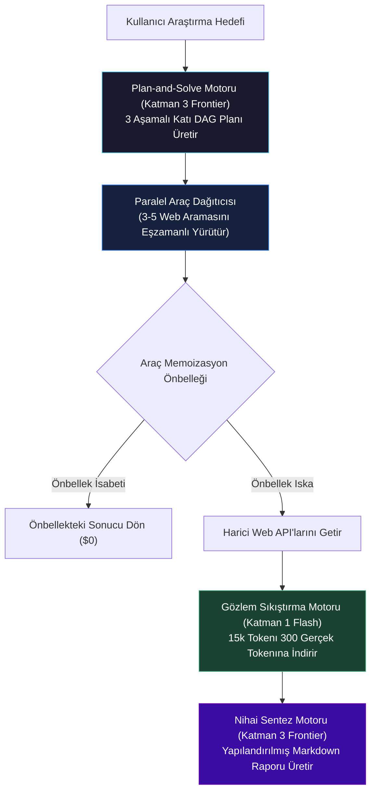
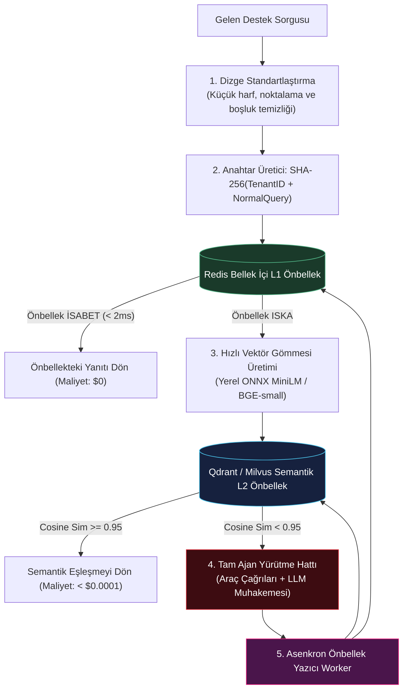

# Yapay Zeka Ajanlarında Maliyet Optimizasyonu

<!-- toc -->

<br/>
<br/>

Otonom yapay zeka ajanları deneysel araştırma laboratuvarlarından kurumsal ve kritik üretim sistemlerine geçiş yaptıkça, operasyonel sürdürülebilirlik artık yalnızca muhakeme ve doğruluk skorlarıyla değil, **katı birim ekonomi (unit economics)** metrikleriyle belirlenir. Geleneksel web servislerinde kullanıcı etkileşimi başına hesaplama maliyeti deterministik olarak $O(1)$ iken; çok adımlı yinelemeli döngüler (ReAct, Plan-and-Solve veya Reflexion) koşturan otonom ajanlar, muhakeme ufku uzadıkça doğası gereği **karesel token birikimi ($O(T^2)$)** sergiler. Kontrol altına alınmadığında, yapılandırılmamış web API'larını sorgulayan ve doğrulama hatalarına düşen başıboş tek bir ajan, oturum başına onlarca dolar tüketebilir.

Üretim standartlarında, maliyet açısından optimize edilmiş ajan mimarileri inşa etmek; yüzeysel sistem istemi kısaltmalarının ötesine geçmeyi zorunlu kılar. Bu durum **derinlemesine savunma (defense-in-depth) prensipli bir maliyet mühendisliği** gerektirir: matematiksel bağlam bütçelemesi, sağlayıcı düzeyinde prompt önbellekleme (prompt caching), anlamsal sorgu memoizasyonu, dinamik çok katmanlı model yönlendirmesi (RouteLLM cascades) ve çalışma zamanı devre kesicileri (circuit breakers).

<br/>
<br/>

---

## 1. Matematiksel Maliyet Modellemesi: Karesel Bağlam Patlaması

Ajanların çalışma zamanı harcamalarını optimize etmek için öncelikle $T$ adet ardışık karar adımından ve $K$ adet harici araç çağrısından oluşan otonom bir görevin toplam maliyet fonksiyonu $C_{\text{total}}$ formüle edilmelidir:

$$
C_{\text{total}} = \sum_{t=1}^{T} \left( P_{\text{in}} \cdot N_{\text{in}}^{(t)} + P_{\text{out}} \cdot N_{\text{out}}^{(t)} + P_{\text{cached}} \cdot N_{\text{cached}}^{(t)} \right) + \sum_{k=1}^{K} C_{\text{tool}}^{(k)}
$$

Burada:
- $P_{\text{in}}, P_{\text{out}}$: Taze girdi promptları ve üretilen çıktı tamamlamaları için token başına birim maliyettir.
- $P_{\text{cached}}$: Önbelleğe alınmış önek tokenları için indirimli tarife oranıdır (genellikle $\%75 \text{ ila } \%90$ daha ucuzdur).
- $C_{\text{tool}}^{(k)}$: Üçüncü taraf bilgi işlem veya ağ API yürütme maliyetleridir (arama motorları, kod yürütme kum havuzları, veri kazıyıcılar).

```mermaid
flowchart TD
    subgraph NaiveLoop ["Naif ReAct Döngüsü: Karesel Token Patlaması"]
        T1["Adım 1: Prompt + Düşünce + Araç Çağrısı + Araç Gözlemi (M Token)"] --> T2["Adım 2: Adım 1 Geçmişi + Yeni Düşünce + Yeni Gözlem (2M Token)"]
        T2 --> T3["Adım 3: Adım 1-2 Geçmişi + Yeni Düşünce + Yeni Gözlem (3M Token)"]
        T3 --> TN["Adım T: Kümülatif Tam Geçmiş ((T * M) Token) -> O(T^2) Maliyet"]
    end

    subgraph OptimizedLoop ["Optimize Edilmiş Hat: Doğrusal Token Sınırlandırma"]
        O1["Adım 1: Statik Önek [ÖNBELLEKTE] + Sıkıştırılmış Gözlem"] --> O2["Adım 2: Kompakt Durum + Araç Memoizasyonu İle İsabet ($0)"]
        O2 --> O3["Adım 3: Ham Yükün Tahliyesi + Küçük Model Sentezi"]
        O3 --> ON["Adım T: Sabit Sınırlı Pencere -> O(T) Maliyet"]
    end

    style NaiveLoop fill:#3d0c11,stroke:#e63946,color:#fff
    style OptimizedLoop fill:#0f2b1d,stroke:#52b788,color:#fff
```

<br/>



<br/>

### 1.1 Karesel Bağlam Birikiminin Matematiksel Çıkarımı
Budama yapılmamış standart bir ReAct mimarisinde, $t$. adımdaki girdi promptu statik talimatları, araç tanımlarını, orijinal kullanıcı istemini ve geçmişteki tüm akıl yürütme adımlarını birleştirir:

$$
N_{\text{in}}^{(t)} = N_{\text{system}} + N_{\text{tools}} + N_{\text{user}} + \sum_{j=1}^{t-1} \left( N_{\text{thought}}^{(j)} + N_{\text{action}}^{(j)} + N_{\text{observation}}^{(j)} \right)
$$

Eğer harici araç gözlemleri adım başına ortalama $M$ tokenlık yük getiriyorsa ve ajanın dahili düşünce/eylem şemaları ortalama $S$ token tutuyorsa, $T$ adım boyunca tüketilen toplam girdi token hacmi karesel olarak ölçeklenir:

$$
\sum_{t=1}^{T} N_{\text{in}}^{(t)} = T \cdot (N_{\text{system}} + N_{\text{tools}} + N_{\text{user}}) + (M + S) \sum_{t=1}^{T} (t - 1)
$$

$$
\sum_{t=1}^{T} N_{\text{in}}^{(t)} = T \cdot N_{\text{base}} + (M + S) \cdot \frac{T(T - 1)}{2} \implies \mathcal{O}\left((M + S) \cdot T^2\right)
$$

Araç gözlemleri ham HTML veya devasa JSON çıktıları içerdiğinde ($M \approx 2000 \text{ ila } 5000 \text{ token}$), 10 adımlık otonom bir ajan tek bir sorgu için $200.000$'den fazla girdi tokenı harcar. Dolayısıyla $M$'i sıkıştırmak ve $T$'yi sınırlamak, maliyeti kontrol altına almanın birincil matematiksel kaldıracıdır.

<br/>
<br/>

---

## 2. Token Azaltımı ve Bağlam Optimizasyonu Mühendisliği

Karesel büyüme terimini baskılamak için üretim mimarileri üç tamamlayıcı bağlam yönetimi katmanı kullanır: gözlem sıkıştırma, yapılandırılmış budama ve sağlayıcı düzeyinde prompt önbellekleme.

<br/>

### 2.1 Gözlem Sıkıştırma ve Başsız Veri Çıkarımı
Harici araç çıktıları asla doğrudan ana akıl yürütme bağlamına eklenmemelidir. Bunun yerine araç çıktıları, çalışma belleğine ulaşmadan önce geçici bir **Sıkıştırma Filtresinden (Compaction Filter)** geçmelidir.

```python
# Yüksek token yoğunluğu sağlayan düşük maliyetli veri çıkarma şeması
from pydantic import BaseModel, Field

class CompactWebObservation(BaseModel):
    source_url: str
    key_facts: list[str] = Field(max_items=5, description="Çıkarılan çekirdek önermeler")
    relevant_numbers: dict[str, float] = Field(default_factory=dict)
    has_target_data: bool
```

Ana ajana $8.000$ tokenlık ham DOM ağacı göndermek yerine, hafif bir yardımcı model (GPT-4o-mini veya Gemini 1.5 Flash) bu yükü $80$ tokenlık yapılandırılmış bir `CompactWebObservation` nesnesine dönüştürür. Bu sayede ana model bir sonraki adıma geçmeden önce **gözlem token kütlesinde ($M$) $\%98.5$ oranında azalma** sağlanır.

<br/>

### 2.2 Sağlayıcı Düzeyinde Prompt Caching Topolojisi
Modern frontier LLM sağlayıcıları (Anthropic, OpenAI, DeepSeek), birebir aynı prompt önekleri için donanım hızlandırmalı KV-cache yeniden kullanımını destekler. Önbellek isabet oranını maksimize etmek için:
1. **Statik Değişmezler En Başa:** Sistem talimatları ve araç tanım şemaları bağlam penceresinin en başında yer almalıdır.
2. **Değiştirilemez Oturum Geçmişi:** Önceki kullanıcı/asistan adımları geriye dönük olarak asla değiştirilmemelidir; tek bir baytlık değişiklik bile sonraki KV-cache bloklarını geçersiz kılar.
3. **Önbellek Kırılma Noktaları (Breakpoints):** Çok adımlı oturumlarda, statik araç tanımlarının hemen ardına ve ana ara kilometre taşlarından sonra açık önbellek kontrol noktaları yerleştirilmelidir.

$$
\text{Maliyet Tasarrufu} = N_{\text{cached}} \times (P_{\text{in}} - P_{\text{cached}}) \approx 0.90 \cdot P_{\text{in}} \cdot N_{\text{prefix}}
$$

<br/>
<br/>

---

## 3. Dinamik Model Kademeleri ve Akıllı Yönlendirme (RouteLLM)

Her ajan kararını en pahalı frontier modele (Claude 3.5 Sonnet, GPT-4o) delege etmek ciddi bir aşırı-mühendislik (over-engineering) hatasıdır. Gerçek dünya iş akışlarında ajan adımlarının $\%70$'inden fazlası deterministik filtreleme, basit sınıflandırma, şema biçimlendirme ve durum doğrulamasından ibarettir.



<br/>

### 3.1 Spekülatif Yürütme ve Kademeli Yükseltme (Speculative Fallback)
Sistemin dayanıklılığını korurken ucuz modellerden faydalanmak için **Spekülatif Yönlendirme** uygulanır:
- Alt görev önce hızlı ve ucuz bir yardımcı motorda (Katman 1) çalıştırılır.
- Üretilen çıktı katı Pydantic modellerine veya JSON şemalarına göre doğrulanır.
- Yalnızca doğrulama başarısız olursa veya araç çağrısı istisna fırlatırsa görev Frontier Motora (Katman 3) devredilir ve başarısız deneme hata mesajıyla birlikte girdi olarak sunulur.

```python
async def execute_with_speculative_fallback(task_prompt: str, schema: type[BaseModel]) -> BaseModel:
    try:
        # Katman 1: Düşük maliyetli yürütme denemesi
        raw_result = await call_utility_model(task_prompt, max_tokens=256)
        return schema.model_validate_json(raw_result)
    except (ValidationError, Exception):
        # Katman 3: Yalnızca doğrulanmış hatada frontier modele yükselt
        frontier_result = await call_frontier_model(
            task_prompt, 
            system_prompt="Biçimlendirmeyi düzelt ve şemayı eksiksiz yerine getir."
        )
        return schema.model_validate_json(frontier_result)
```

<br/>
<br/>

---

## 4. Çok Kademeli Önbellekleme ve Deterministik Araç Memoizasyonu

Tekrarlanan görevlerde hiyerarşik önbellekleme kullanılarak gereksiz LLM üretimleri engellenir; hem çıkarım maliyetleri hem de ajan yanıt gecikmesi sıfıra yakın seviyelere çekilir.



<br/>

### 4.1 L1 Birebir Dizge Normalizasyonu
Hesaplama açısından maliyetli vektör gömmelerine (embeddings) geçmeden önce girdi istemi kanonik bir normalizasyondan geçirilir:
1. Baş ve sondaki boşluklar temizlenir, tüm metin küçük harfe çevrilir.
2. Noktalama işaretleri, kontrol karakterleri ve Unicode varyasyonları standartlaştırılır.
3. 256-bit kriptografik özet üretilir:
   $$K_{\text{exact}} = \operatorname{SHA-256}\left(\text{TenantID} \parallel \text{ModelID} \parallel \operatorname{Normalize}(\text{Query})\right)$$

Doğrudan bir Redis anahtar-değer sorgusu ile 2 milisaniyenin altında ve sıfır marjinal token harcamasıyla anında yanıt sağlanır.

<br/>

### 4.2 L2 Semantik Vektör Önbellekleme
Sorgular anlamsal olarak eşdeğer olup sözdizimsel olarak farklılaştığında birebir hash tutmaz. Semantik önbellekler, girdi sorgusunun yoğun vektör gömmesini ($\vec{u}$) indekslenmiş geçmiş kayıtlarla ($\vec{v}$) karşılaştırır:

$$
S_C(\vec{u}, \vec{v}) = \frac{\vec{u} \cdot \vec{v}}{\|\vec{u}\| \cdot \|\vec{v}\|} \ge \tau
$$

Üretim ortamındaki soru-cevap ve sınıflandırma sistemlerinde benzerlik eşik değeri $\tau$ hassasiyetle ayarlanmalıdır:
- $\tau \ge 0.95$: Yüksek kesinlik. Alana özgü görevlerde yanlış pozitif önbellek isabetlerini engeller.
- $\tau \in [0.90, 0.94]$: Orta kesinlik. Serbest sohbet ve genel diyaloglar için uygundur.
- $\tau < 0.90$: Yüksek halüsinasyon ve bağlamsal olarak geçersiz veri dönme riski taşır.

<br/>

### 4.3 L3 Deterministik Araç Memoizasyonu
Idempotent araç çağrıları (kapanmış piyasa günleri için hisse senedi fiyatları, kullanıcı profil sorguları veya coğrafi koordinat aramaları) asla gereksiz HTTP isteklerini veya SQL sorgularını yeniden tetiklememelidir.

```python
import hashlib, json

def compute_tool_cache_key(tool_name: str, arguments: dict, tenant_id: str) -> str:
    canonical_args = json.dumps(arguments, sort_keys=True, separators=(',', ':'))
    payload = f"{tenant_id}:{tool_name}:{canonical_args}"
    return f"tool_cache:{hashlib.sha256(payload.encode()).hexdigest()}"
```

<br/>
<br/>

---

## 5. Bütçe Korkulukları, Telemetri ve Devre Kesiciler

Kendi kendini çağıran sonsuz döngüler veya kontrolden çıkan otonom araştırma süreçleri gibi felaket senaryolarını önlemek için çalışma zamanı ortamı aktif token ve bütçe korkulukları (guardrails) uygulamalıdır.

<br/>



<br/>

### 5.1 Gerçek Zamanlı Finansal Devre Kesiciler (Circuit Breakers)
Yürütme döngüsü, harici API veya model çağrısı göndermeden önce bütçe değişmezlerini senkronize olarak doğrulamalıdır:

```python
class AgentBudgetExceededException(Exception):
    pass

class CostGuardrail:
    def __init__(self, max_cost_usd: float = 0.10, max_turns: int = 8):
        self.max_cost_usd = max_cost_usd
        self.max_turns = max_turns
        self.accumulated_cost = 0.0
        self.turn_count = 0

    def record_step(self, cost_incurred: float) -> None:
        self.turn_count += 1
        self.accumulated_cost += cost_incurred
        
        if self.accumulated_cost > self.max_cost_usd:
            raise AgentBudgetExceededException(
                f"Oturum maliyeti (${self.accumulated_cost:.4f}) bütçe limitini (${self.max_cost_usd:.4f}) aştı."
            )
        if self.turn_count >= self.max_turns:
            raise AgentBudgetExceededException(
                f"Maksimum yürütme adımı ({self.max_turns}) tükendi."
            )
```

<br/>
<br/>

---

## 6. Resmi Zorluklar ve Mimari Çözümler

<details>
<summary><strong>Senaryo 1 (Sistem Analizi): Ajan Çıkmazını Çözme (İstek Başına 50 API Çağrısı)</strong></summary>
<br/>

### Problem Tanımı
Üretim ortamına alınan bir pazar analizi ajanı, gelen her kullanıcı isteği için ortalama **50 API çağrısı** yapmakta, sorgu başına maliyeti sürdürülemez seviyelere ($1.80) çıkarmakta ve sık sık zaman aşımı hataları almaktadır. Bu çıkmazı tetikleyen kök nedenleri analiz edin ve yürütmeyi **5–8 yüksek verimli adıma** indirecek bir mimari dönüşüm planı tasarlayın.

### Kök Neden Analizi
1. **Sınırsız Arama Döngüsü (Exploration Thrashing):** Ajanın önceden çıkarılmış Yönlendirilmiş Döngüsüz Çizge (DAG) planı yoktur. Geniş bir soru aldığında küçük kelime varyasyonlarıyla peş peşe arama yapar (`search("bulut gelirleri 2025")`, `search("bulut gelirleri 2025 aws")`, `search("bulut pazar payı çeyrek 1")`).
2. **Seri Araç Çağrısı Anti-Deseni:** Ajan araç çağrılarını tek tek gönderir ve her çağrı arasında modelin yeniden düşünmesini bekler.
3. **Bağlam Şişmesi Kaynaklı Bellek Kaybı:** Sıkıştırılmamış ham web sayfaları (adım başına ortalama $3.000$ token) bağlam penceresini hızla doldurur. Bağlam $30.000$ tokenı aştığında model geçmişteki bulgularını unutarak aynı aramaları yineler.

### Mimari Çözüm
Sistem dört zorunlu kural etrafında yeniden yapılandırılır:



1. **Deterministik Plan-and-Solve (DAG):** Serbest ReAct döngüleri yasaklanır; ajan önce sabit bir yürütme planı derler.
2. **Paralel Araç Çağrısı:** 10 ayrı adım yerine model tek bir yanıtta tüm arama hedeflerini aynı anda tanımlar.
3. **Sıkıştırılmış Gözlem Hattı:** Web sayfaları yalnızca sayısal tabloları ve somut iddiaları çıkaran yardımcı modelden geçirilir.
4. **Katı Adım Sınırı:** Toplam yineleme $T_{\text{max}} = 6$ ile sınırlandırılır. 6. adımda araç çağırma yetkisi alınarak model zorunlu sentez moduna geçirilir.

**Sonuç:** Toplam API çağrısı 50'den 4'e düşer (1 planlama, 1 toplu araç çağrısı, 1 sıkıştırma geçişi, 1 sentez çağrısı). Toplam maliyet **$1.80'dan $0.09'a iner (%95 tasarruf)**.

</details>

<br/>

<details>
<summary><strong>Senaryo 2 (Model Seçimi): Dinamik Maliyet-Performans Modelleri ve Yedek Yükseltmeler</strong></summary>
<br/>

### Problem Tanımı
Ajan döngüsü boyunca hafif/ucuz yardımcı modeller (Claude 3.5 Haiku, Gemini 1.5 Flash, GPT-4o-mini) ile frontier muhakeme motorları (Claude 3.5 Sonnet, GPT-4o) arasındaki mimari takasları değerlendirin. Görev karmaşıklığına göre modelleri dinamik olarak atayan ve hatalarda kademeli yükselme sağlayan bir yönlendirici tasarlayın.

### Takas (Trade-off) Matrisi

| Değerlendirme Boyutu | Hafif Yardımcı Motorlar (Katman 1) | Frontier Muhakeme Motorları (Katman 3) |
| :--- | :--- | :--- |
| **Harmanlanmış Maliyet (MTok)** | $0.15 – $0.80 | $3.00 – $15.00 ($10\times \text{ ila } 20\times \text{ daha pahalı}$) |
| **Çıkarım Gecikmesi** | Çok düşük ($200\text{–}600\text{ ms}$ TTFT) | Orta ($1.2\text{–}3.5\text{ s}$ TTFT) |
| **Katı Şema Uyumu** | Standart JSON'da yüksek; iç içe union tiplerde düşer | Karmaşık polimorfik tiplerde istisnai derecede yüksek |
| **Uzun Ufuklu Planlama** | Halüsinasyonlara ve mantıksal sapmalara açıktır | $T > 10$ adımlarda kısıt takibini başarıyla korur |
| **Hata Kurtarma** | Sıklıkla döngüye girer veya hatalı parametreyi yineler | Alternatif hipotezler kurarak kodu kendi kendine düzeltir |

### Mimari Çözüm: Korumalı Yükseltme ile Uyarlanabilir Yönlendirme
Yönlendirici dinamik bir karar kuralı işletir:
1. **Triyaj Sınıflandırması:** Alt görev salt veri dönüşümü, özetleme veya niyet sınıflandırması ise doğrudan Katman 1'e atanır.
2. **Deterministik Sözdizimi Kontrolü:** Katman 1 yanıtı Pydantic şemasından geçmek zorundadır.
3. **Yükseltme Sınırı:** Katman 1 sözdizimi hatası verirse veya araç çağrısı API hatası döndürürse yürütme kesilir.
4. **Bağlamsal Devir:** Başarısız deneme, hata dökümü ve hedef şema doğrudan Katman 3'e aktarılır.

```python
from pydantic import BaseModel, ValidationError

async def dynamic_route_and_execute(prompt: str, schema: type[BaseModel], is_complex: bool) -> BaseModel:
    # Kural 1: Karmaşık görevler doğrudan Katman 3'e gider
    if is_complex:
        return await invoke_model(model="claude-3-5-sonnet", prompt=prompt, schema=schema)
    
    # Kural 2: Düşük maliyetli modelde yürütmeyi dene
    try:
        raw_response = await invoke_model(model="gemini-1-5-flash", prompt=prompt)
        return schema.model_validate_json(raw_response)
    except (ValidationError, Exception) as err:
        # Kural 3: Yalnızca doğrulanmış hatada frontier modele yükselt
        escalated_prompt = f"{prompt}\n\n[Önceki Deneme Hata Verdi: {err}]. Düzelt ve tamamla."
        return await invoke_model(model="claude-3-5-sonnet", prompt=escalated_prompt, schema=schema)
```

Bu sayede başarılı yürütmelerin $\%80$'i Katman 1 maliyetiyle tamamlanırken, kalan $\%20$'lik zorlu uç durumlar Katman 3 güvenilirliğiyle çözülür.

</details>

<br/>

<details>
<summary><strong>Senaryo 3 (Önbellekleme Stratejisi): Yüksek Trafikli SSS Ajanı Önbellek Topolojisi</strong></summary>
<br/>

### Problem Tanımı
Günlük $500.000$ kullanıcı sorgusunu karşılayan otonom bir müşteri destek ajanı için kurumsal önbellek altyapısı tasarlayın. Sistem tekrarlanan sorulara anında yanıt vermeli, değişen şirket politikalarına uyum sağlamalı ve kiracılar arası (cross-tenant) veri sızıntısını sıfıra indirmelidir.

### Mimari Çözüm

#### 1. Çok Aşamalı Veri Alma Hattı



#### 2. Kademeli Geçersiz Kılma ve TTL Matrisi

| Veri Sınıflandırması | Depolama Katmanı | Yaşam Süresi (TTL) | Geçersiz Kılma Tetikleyicisi |
| :--- | :--- | :--- | :--- |
| **Statik Şirket Politikası / Kurallar** | L1 Redis + L2 Vektör | $30 \text{ Gün}$ | CMS / Dokümantasyon güncelleme Webhook'u |
| **Fiyatlandırma ve Kampanyalar** | L1 Redis + L2 Vektör | $24 \text{ Saat}$ | Katalog veritabanı değişikliğinde otomatik senkron |
| **Sipariş Durumu ve Kullanıcı Hesapları** | **ÖNBELLEKLENMEZ** | $0 \text{ Saniye}$ | Yalnızca canlı araç yürütmesi (Sıfır PII önbellekleme) |

#### 3. Güvenlik ve Çok Kiracılı İzolasyon İlkeleri
- **Kriptografik İsim Alanı İzolasyonu:** Her önbellek anahtarı ve vektör yükü HMAC imzalı bir `tenant_id` ile öneklendirilir. Kiracılar arası semantik arama bölme metaveri filtreleriyle fiziksel olarak engellenir:
  ```json
  "filter": {
      "must": [{"key": "tenant_id", "match": {"value": "enterprise_corp_42"}}]
  }
  ```
- **Olay Güdümlü Anında Temizlik:** Destek politikası değiştiğinde CMS asenkron bir Redis komutu tetikler:
  ```bash
  HDEL tenant:enterprise_corp_42:faq *
  ```
  Bu sayede sistem kesintisi olmadan bayatlamış yanıtlar anında temizlenir.

</details>
