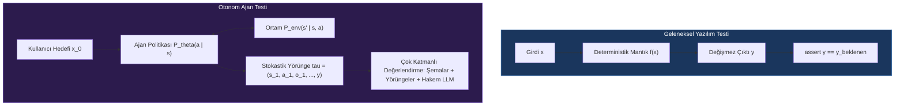
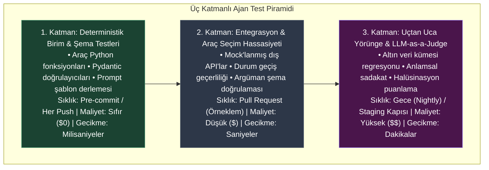
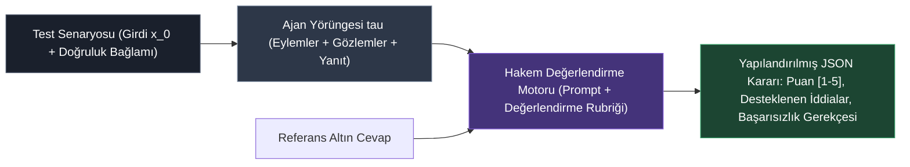
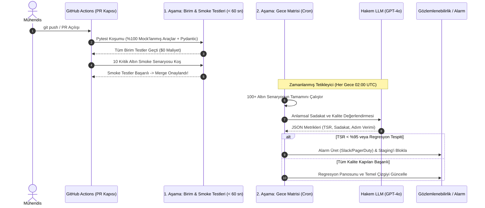

# Ajan Testleri ve Kalite Güvencesi (QA)

<!-- toc -->

<br/>
<br/>

Otonom yapay zeka ajanlarının kurumsal ve kritik üretim sistemlerine (production) dağıtımı, yazılım mühendisliği disiplininin karşılaştığı en temel zorluklardan birini doğurur: **özü gereği stokastik ve deterministik olmayan (non-deterministic) sistemlerin doğruluğu nasıl test edilir, doğrulanır ve garanti altına alınır?** Geleneksel yazılımlarda test yürütme ikilidir (binary)—özdeş bir $x$ girdisi ve $S$ sistem durumu verildiğinde, fonksiyon değişmez bir $y = f(x; S)$ çıktısı üretir. Test paketleri milisaniyeler içinde ve sıfır ek maliyetle katı eşitliği (`assert result == expected`) doğrular.

Otonom ajanlar bu paradigmayı kökten yıkar. Açgözlü örnekleme ($T = 0$) altında dahi, dağıtık GPU kümelerindeki kayan nokta (floating-point) hassasiyet farkları, model yönlendirme katmanları, dinamik ortam gözlemleri ve çok turlu akıl yürütme döngüleri farklı metinsel formülasyonlar üretir. Klasik dize eşitliği assertion'ları anında çökerken; testleri doğrudan canlı LLM API'lerine bağlamak aşırı gecikmeye, kontrolsüz bütçe tüketimine ve dengesiz (flaky) testlere yol açar.

Ajanları kırılgan araştırma prototiplerinden kurumsal düzeyde altyapılara dönüştürmek, **kapsamlı bir ajan test piramidi** gerektirir: araçlar için deterministik mock'lama, akıl yürütme grafikleri için yörünge (trajectory) doğrulaması, referans güdümlü Hakem LLM (LLM-as-a-Judge) değerlendirmesi ve çok kademeli CI/CD otomasyon hatları.

<br/>
<br/>

---

## 1. Stokastik Test Paradigması: Determinizm ve Non-Determinizm

Matematiksel olarak tutarlı bir doğrulama stratejisi oluşturmak için, bir ajanın çalışma sürecini yörünge dizilimleri $\tau$ üzerinde parametrelendirilmiş koşullu bir olasılık dağılımı olarak modelleriz:

$$
P(\tau \mid x_0) = \prod_{t=1}^{T} P_\theta(a_t \mid s_t) \cdot P_{\text{env}}(s_{t+1} \mid s_t, a_t)
$$

Burada:
- $x_0$, kullanıcının başlangıç hedefi veya sorgusudur.
- $s_t = (x_0, a_1, o_1, \dots, a_{t-1}, o_{t-1})$, $t$ adımındaki diyalog geçmişini ve çalışma bağlamını temsil eder.
- $a_t \sim P_\theta(\cdot \mid s_t)$, $\theta$ ağırlıklarına sahip bir LLM tarafından üretilen ajanın eylemidir (içsel akıl yürütme, araç çağrısı veya nihai yanıt).
- $o_t \sim P_{\text{env}}(\cdot \mid s_t, a_t)$, dış ortamdan gelen gözlemdir (veritabanı kayıtları, API yanıtları, terminal çıktıları).

<br/>



<br/>

### 1.1 Ajan Değerlendirmenin Üçlü İkilemi (Trilemma)
Otonom ajanların test mühendisliği birbiriyle yarışan üç temel kısıtı dengelemek zorundadır:

1. **Determinizm ve Tekrarlanabilirlik:** Hata ayıklama sırasında stokastik sapma olmaksızın aynı hata izlerini yeniden oynatabilme kabiliyeti.
2. **Anlamsal Doğruluk (Semantic Fidelity):** Assertion'ların yüzeysel sözdizimi yerine derin anlamsal niyeti, olgusal tutarlılığı ve araç seçim hassasiyetini test etmesi.
3. **Yürütme Gecikmesi ve Maliyet:** Doğrulama döngülerinin geliştirme hızını kesmeyecek ve token bütçelerini tüketmeyecek hızda (PR merge kapılarında) çalışması.

<br/>
<br/>

---

## 2. Ajan Test Piramidi (The Agent Testing Pyramid)

Klasik yazılım kalite güvencesine benzer şekilde, ajan testleri ters çevrilmiş hiyerarşik bir piramit olarak yapılandırılır. Üst katmanlar daha yüksek maliyet ve gecikmeyle daha yüksek anlamsal doğruluk sağlarken; alt katmanlar milisaniyeler mertebesinde ve sıfır maliyetle deterministik garantiler sunar.

<br/>



<br/>

### 2.1 1. Katman: Deterministik Birim ve Şema Testleri (0 Token, 0 Ağ)
1. Katman, üretici zeka gerektirmeyen tüm alt kod tabanını izole eder:
- **Araç Uygulamaları:** Python fonksiyonlarının beklenen argümanlarla doğru çalıştığını ve geçersiz girdilerde öngörülebilir domain istisnaları fırlattığını garanti eder.
- **Pydantic / Yapılandırılmış Çıktı Şemaları:** JSON şemalarının, alan kısıtlamalarının, tip dönüşümlerinin ve regex kurallarının doğru ayrıştırıldığını doğrular.
- **Prompt Derleyicileri ve Bağlam Montajı:** Prompt şablonlarının dinamik yer tutucuları bellek sızıntısı veya eksik anahtar olmaksızın biçimlendirdiğini teyit eder.
- **Mock İzolasyonu:** Tüm üçüncü parti uç noktalar (veritabanları, ödeme ağ geçitleri, arama motorları) `unittest.mock` ile taklit edilir. Sıfır canlı LLM çağrısı yapılır.

### 2.2 2. Katman: Entegrasyon ve Araç Seçim Hassasiyeti
2. Katman, $P_\theta$ ajan politikasının gerçek ortam mutasyonları gerçekleştirmeden durum geçişlerini doğru yönetip yönetmediğini değerlendirir:
- **Araç Seçim Doğruluğu:** Standart bir kullanıcı niyetinde modelin tam olarak beklenen araç imzasını tetikleyip tetiklemediği.
- **Argüman Doğruluğu:** Diyalog geçmişinden çıkarılan argümanların doğru tipler, geçerli kimlikler (ID) ve zorunlu parametrelerle doldurulup doldurulmadığı.
- **Durum Makinesi Geçişleri:** Grafik tabanlı mimarilerde (ör. LangGraph), koşullu kenarların belirli gözlemler karşısında doğru ardıl düğüme yönlendirip yönlendirmediği.
- **Deterministik Yeniden Oynatma (Cached Trajectories):** Gelen LLM yanıtları ve dış API yükleri önceden kaydedilmiş VCR/kaset kurgularından oynatılarak orkestrasyon mantığı model kaymasından (drift) izole edilir.

### 2.3 3. Katman: Uçtan Uca Davranışsal & Hakem LLM (LLM-as-a-Judge) Değerlendirmesi
3. Katman, açık uçlu sorgularda çok adımlı problem çözümünü altın veri kümeleri (golden datasets) ve otomatik LLM değerlendiricileriyle doğrular:
- **Yörünge Doğruluğu:** Ajanın döngüsel kısırdöngülere kapılmadan maksimum izin verilen adım eşiği $T_{\max}$ içinde terminal duruma ulaşıp ulaşmadığı.
- **Anlamsal Sadakat (Faithfulness):** Nihai metinsel yanıtın, uydurma (halüsinasyon) iddialar içermeksizin yalnızca araç gözlemlerinden türetilip türetilmediği.
- **Güvenlik ve Guardrail Uyumu:** Ajanın düşmanca jailbreak ve prompt injection saldırılarına direnip direnmediği.

<br/>
<br/>

---

## 3. Matematiksel Değerlendirme Metrikleri

Ajan testleri, öznel izlenimler yerine nesnel ve niceliksel metrikler üzerinden yürütülmelidir. Modern ajan değerlendirme sistemlerinde kullanılan temel matematiksel metrikler aşağıdadır:

<br/>

| Metrik | Matematiksel Formülasyon | Ölçüm Yöntemi | Hedef Eşik |
| :--- | :--- | :--- | :--- |
| **Görev Başarı Oranı (TSR)** | $\text{TSR} = \frac{1}{N} \sum_{i=1}^N \mathbb{I}(\text{task}\_i = \text{Success})$ | Deterministik Bayrak / Hakem LLM | $\ge 0.95$ (%95) |
| **Araç Seçim Kesinliği (Precision)** | $P\_{\text{tool}} = \frac{\lvert \mathcal{T}\_{\text{called}} \cap \mathcal{T}\_{\text{expected}} \rvert}{\lvert \mathcal{T}\_{\text{called}} \rvert}$ | Birebir Şema Karşılaştırması | $\ge 0.98$ (%98) |
| **Araç Seçim Duyarlılığı (Recall)** | $R\_{\text{tool}} = \frac{\lvert \mathcal{T}\_{\text{called}} \cap \mathcal{T}\_{\text{expected}} \rvert}{\lvert \mathcal{T}\_{\text{expected}} \rvert}$ | Birebir Şema Karşılaştırması | $\ge 0.95$ (%95) |
| **Sadakat Puanı ($S\_{\text{faith}}$)** | $S\_{\text{faith}} = \frac{\lvert \mathcal{C}\_{\text{supported}} \rvert}{\lvert \mathcal{C}\_{\text{total}} \rvert} \in [0, 1]$ | Hakem LLM (Doğal Dil Çıkarımı - NLI) | $\ge 0.98$ |
| **Adım Verimliliği ($\eta\_{\text{steps}}$)** | $\eta\_{\text{steps}} = \frac{T\_{\text{optimal}}}{T\_{\text{actual}}} \le 1.0$ | Yörünge Log Analizi | $\ge 0.85$ |
| **Birim Çözüm Maliyeti** | $C\_{\text{task}} = \sum_{t=1}^T \left( P\_{\text{in}} N\_{\text{in}}^{(t)} + P\_{\text{out}} N\_{\text{out}}^{(t)} \right)$ | Token Muhasebe Katmanı | Minimize et |

<br/>

### 3.1 Anlamsal Sadakatin (Halüsinasyon İndeksi) Formülasyonu
Ajanların kullanıcılara uydurma gözlemler sunmasını engellemek için Sadakat Metriğini Doğal Dil Çıkarımı (NLI) ayrıştırması ile modelleriz:

$R = \{c_1, c_2, \dots, c_m\}$ nihai yanıttan ayrıştırılan atomik önerme iddiaları olsun. $O = \{o_1, o_2, \dots, o_k\}$ ise yörünge boyunca araçlar tarafından döndürülen ham gözlem kümesi olsun.

$$
S_{\text{faith}}(R, O) = \frac{1}{m} \sum_{j=1}^{m} \mathbb{I} \left( O \vdash c_j \right)
$$

Burada $O \vdash c_j$, $O$ bağlamının mantıksal olarak $c_j$ iddiasını desteklediğini (entailment) ifade eder. $S_{\text{faith}} < 1.0$ alan bir ajan, çözüme doğrulanmamış veya halüsinasyon veri karıştırmış demektir.

<br/>
<br/>

---

## 4. Hakem LLM (LLM-as-a-Judge): Tasarım ve Yanlılık Giderme

Ton, açıklama kalitesi ve bağlamsal akıcılık gibi öznel çıktılar değerlendirilirken salt dize karşılaştırmaları yetersiz kalır. Yapılandırılmış değerlendirme rubrikleri (puanlama rehberleri) altında çalışan yüksek kapasiteli modelleri (GPT-4o, Claude 3.5 Sonnet) **otomatik hakemler** olarak konumlandırırız.

<br/>



<br/>

### 4.1 Hakem Yanlılıkları (Biases) ve Önleme Protokolleri
Hakem modeller bilişsel ve konumsal yanlılıklara maruz kalabilir:

1. **Konum Yanlılığı (Position Bias):** Modeller ikili karşılaştırmalarda ilk adayı seçmeye meyillidir.
   - *Çözüm:* **Çift yönlü yer değiştirme (swap order)** uygulanır: $(A, B)$ ve $(B, A)$ test edilir; skorlar uyuşmazsa karar reddedilir.
2. **Uzunluk/Laf Kalabalığı Yanlılığı (Verbosity Bias):** Hakemler olgusal doğruluğa bakılmaksızın daha uzun ve süslü yanıtlara daha yüksek puan verme eğilimindedir.
   - *Çözüm:* Rubriğe açık kural eklenir: *"Gereksiz uzatılmış açıklamaları cezalandır; en yüksek puanı yalnızca yalın, doğrudan ve tam yanıt veren çözüme ver."*
3. **Kendi Ailesini Kayırma Yanlılığı (Self-Enhancement Bias):** LLM'ler kendi model aileleri tarafından üretilen çıktılara sistematik olarak daha yüksek puan verir.
   - *Çözüm:* Hakem model ailesi ajan omurgasından bağımsız seçilir (ör. Claude tabanlı ajan GPT-4o hakemiyle; GPT tabanlı ajan Claude veya Llama hakemiyle denetlenir).

<br/>
<br/>

---

## 5. Otomatik CI/CD Test Mimarisi

Üretim düzeyindeki bir ajan kod tabanı, sürekli entegrasyon (CI/CD) iş akışlarında **İki Kademeli Pipeline Mimarisi** uygular:

<br/>



<br/>

### 5.1 Temsili Pytest Uygulaması: Araç Çağrısı ve Doğrulama
Aşağıdaki yalın test paketi, canlı API maliyeti oluşturmadan bir ajanın deterministik olarak nasıl test edileceğini gösterir:

```python
import pytest
from unittest.mock import MagicMock
from pydantic import BaseModel, Field

class OrderQuery(BaseModel):
    order_id: int = Field(..., gt=0)

def test_agent_order_resolution_deterministic(monkeypatch):
    # 1. Hazırlık (Arrange): Dış veritabanı istemcisini mock'layarak ağ bağımlılığını izole et
    mock_db = MagicMock()
    mock_db.fetch_order.return_value = {"id": 1042, "status": "shipped", "carrier": "DHL"}
    
    # 2. Şema Doğrulamasını Test Et
    query = OrderQuery(order_id=1042)
    assert query.order_id == 1042
    
    # 3. Eylem (Act): Ajan araç yürütme adımını simüle et
    tool_output = mock_db.fetch_order(order_id=query.order_id)
    
    # 4. Doğrulama (Assert): Araç argüman çağrısı ve dönen durum doğrulaması
    mock_db.fetch_order.assert_called_once_with(order_id=1042)
    assert tool_output["status"] == "shipped"
    assert tool_output["carrier"] == "DHL"
```

<br/>
<br/>

---

## 6. Resmi Challenge Senaryoları ve Mimari Çözümleri

<br/>

<details>
<summary><strong>Challenge 1: 100 Sorgu Tipi ve 15 Araç İçin Kapsamlı Test Stratejisi</strong></summary>
<br/>

### Senaryo
100 farklı sorgu kategorisini (ör. para transferi, kredi kartı itirazı, konut kredisi hesaplama) 15 harici mikroservis aracı üzerinden yöneten kurumsal bir bankacılık ajanı bulunmaktadır. Altyapıdaki LLM omurgası yükseltildiğinde (örneğin GPT-4o'dan Claude 3.5 Sonnet'e veya Llama-3.3'e geçerken) sıfır geriye dönük regresyon nasıl garanti edilir?

### Mimari Çözüm
1. **Değişmez Altın Veri Kümesi Kurulumu ($\mathcal{D}_{\text{gold}}$):**
   - Her sorgu kategorisi için 2 ila 3 kanonik örnek içeren $N = 250$ test senaryoluk doğrulanmış bir küme oluşturulur.
   - Her senaryo şunları içerir: `(girdi_promptu, beklenen_araç_sıralaması, beklenen_şema_argümanları, doğruluk_olguları)`.
2. **Araç Yönlendirme Ayrıştırması:**
   - Model, araç tanımlarıyla birlikte çalıştırılır ancak **araçlar fiilen çalışmadan önce yürütme kesilir (intercept)**.
   - Altın test girdilerinde $\text{Araç Seçim Doğruluğu} \ge 0.99$ (%99) ve $\text{Argüman Birebir Eşleşmesi} \ge 0.95$ (%95) şartı aranır.
3. **Sentetik Mock Sunucu:**
   - 15 aracın tamamı bellek içi (in-memory) bir mock sunucuya yönlendirilir; böylece önceden belirlenen şemalar deterministik olarak döner.
4. **Diferansiyel Regresyon Matrisi:**
   - Yeni aday model $M\_{\text{yeni}}$ ile mevcut temel model $M\_{\text{eski}}$, $\mathcal{D}\_{\text{gold}}$ üzerinde paralel koşturulur. Görev Başarı Oranındaki fark hesaplanır:
     $$\Delta \text{TSR} = \text{TSR}(M\_{\text{yeni}}) - \text{TSR}(M\_{\text{eski}})$$
   - Kapı Politikası: Kritik finansal araçlarda $\Delta \text{TSR} < 0$ ise sürüm çıkışı otomatik olarak durdurulur.
</details>

<br/>

<details>
<summary><strong>Challenge 2: Müşteri Destek Ajanı İçin Kurumsal Değerlendirme Metrikleri</strong></summary>
<br/>

### Senaryo
Yüksek hacimli bir e-ticaret platformunda çalışan müşteri destek ajanı için kapsamlı, ölçülebilir ve sessiz başarısızlık modlarını yakalayan bir değerlendirme paketi tanımlayın. Başarı nasıl ölçülür?

### Mimari Çözüm
Doğruluk, güvenlik, verimlilik ve operasyonel sağlığı dengeleyen dört boyutlu bir KPI çerçevesi oluşturulur:

1. **Çözüm Etkinliği:**
   - **İlk Temasta Çözüm (FCR):** İnsan temsilciye devredilmeden veya tekrar açılmadan çözülen kullanıcı hedeflerinin oranı.
   - **Görev Başarı Oranı (TSR):** Kullanıcı onay bayrağı (`problem_solved: true`) veya diyalog kayıtlarını denetleyen bir Hakem LLM ile doğrulanır.
2. **Olgusal Doğruluk ve Güven:**
   - **Sadakat / Halüsinasyon İndeksi ($S_{\text{faith}}$):** Müşteriye sunulan her olgusal iddia araç çıktılarından mantıksal olarak türetilmelidir. Hedef: $\ge 0.99$.
   - **Araç Seçim Kesinliği ($P_{\text{tool}}$):** Ajanın yetkisiz veya yanlış arka uç API'lerini çağırmaması (ör. kargo durumu sormak yerine yanlışlıkla iade tetikleme). Hedef: $\ge 0.98$ (%98).
3. **Kullanıcı Deneyimi ve Gecikme:**
   - **İlk Token Süresi (TTFT):** Sohbet akıcılığını korumak için token akışı (streaming) ile $\le 800\text{ ms}$.
   - **Tur Tamamlama Süresi ($T_{\text{turn}}$):** Çok araçlı akıl yürütme döngüsünün $P_{95} \le 3.5\text{ s}$ sınırında tutulması.
4. **Operasyonel Birim Ekonomisi:**
   - **Çözüm Başına Maliyet ($C_{\text{res}}$):** Bilet başına $\le \$0.04$, semantik önbellekleme ve bağlam bütçelemesi ile korunur.
   - **İnsana Devir Oranı ($\text{HER}$):** İnsan operatörlere aktarılan oturum oranı. Hedef: $0.08 \le \text{HER} \le 0.12$ (%8 – %12; %0 güvensiz aşırı güvene, > %20 ise yetenek gerilemesine işaret eder).
</details>

<br/>

<details>
<summary><strong>Challenge 3: Yüksek Eşzamanlı CI/CD Ajan Test Hattı Tasarımı</strong></summary>
<br/>

### Senaryo
Her pull request açılışında tetiklenen, geliştirme hızını kesmeden ve astronomik faturalar üretmeden ajan davranış bütünlüğünü garanti eden bir GitHub Actions CI/CD hattı tasarlayın.

### Mimari Çözüm
Pipeline, üç bağımsız aşamaya ayrılmış kademeli bir kapı mimarisi (staged gate) kullanır:

1. **1. İş: Hızlı Deterministik Kapı (`pre-merge-fast` - Süre: < 45 sn, Maliyet: $0.00)**
   - Kod formatı, linter ve statik tip kontrolleri (`ruff`, `mypy`).
   - Dış ağ bağımlılıkları %100 mock'lanmış birim test paketinin koşturulması (`pytest -m "unit"`).
   - Tüm Pydantic şemalarının, prompt şablonlarının ve durum grafiği geçişlerinin doğrulanması.
2. **2. İş: Altın Örneklem Smoke Testi (`pre-merge-smoke` - Süre: < 90 sn, Maliyet: < $0.05)**
   - Hızlı ve ekonomik bir model (ör. Claude 3.5 Haiku veya GPT-4o-mini) ile 10 yüksek öncelikli kanonik altın test senaryosu çalıştırılır.
   - Temel yörünge akışı ve araç parametre çıkarma doğruluğu test edilir.
   - `main` branch'ine merge için 1. ve 2. işlerin yeşil yanması zorunludur.
3. **3. İş: Tam Gece Regresyon Matrisi (`nightly-deep-eval` - Zamanlanmış Cron: 03:00 UTC)**
   - 100+ senaryoluk tam altın veri kümesi üretim modelinde koşturulur.
   - Bağımsız bir Hakem LLM sadakat, toksisite ve çözüm derinliğini puanlar.
   - Otomatik düşmanca fuzzing (50 sentetik prompt-injection saldırısı) yürütülür.
   - Raporlar otomatik üretilerek GitHub artifact olarak saklanır ve özet metrikler mühendislik panosuna (Datadog / Grafana) gönderilir.
</details>

<br/>
<br/>

---

## 7. Temel Mimari Çıkarımlar

> **Temel Çıkarım:** Otonom bir ajanı test etmek deterministik bir eşitlik kontrolü değil; **stokastik entropiyi sınırlandırma disiplinidir**. Deterministik araç yürütmesini piramidin tabanında izole ederek ve Hakem LLM değerlendirmesini yalnızca yüksek değerli anlamsal yörüngelere ayırarak; mühendislik ekipleri CI gecikmesini veya bütçeleri patlatmadan kurumsal kalitede güvence sağlar.
