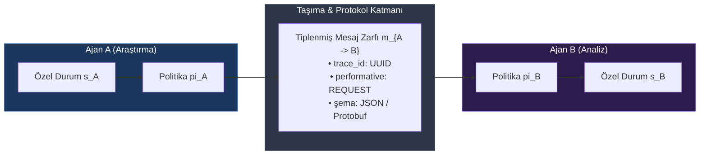
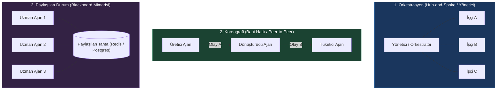
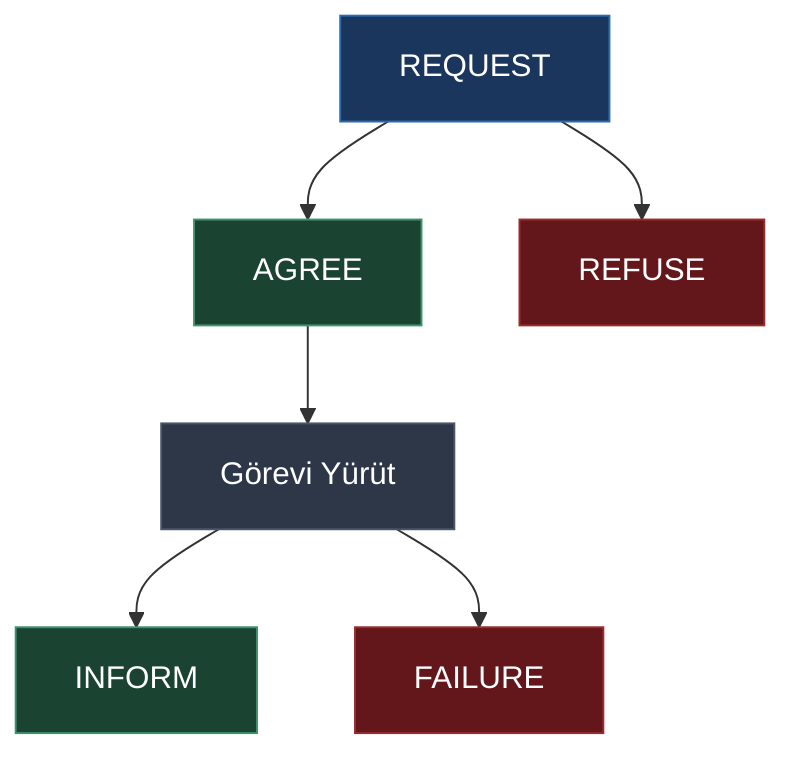
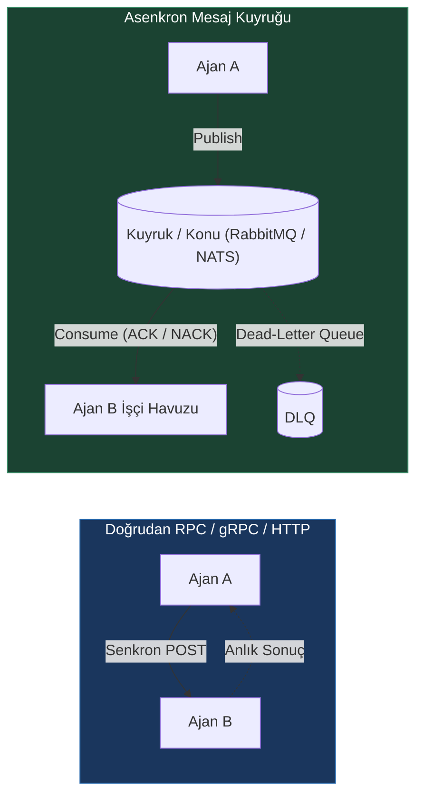
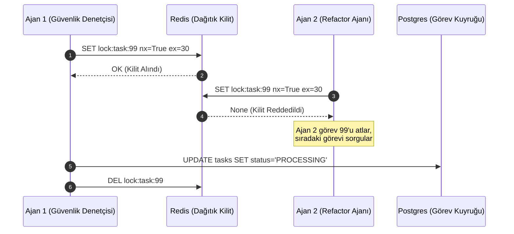
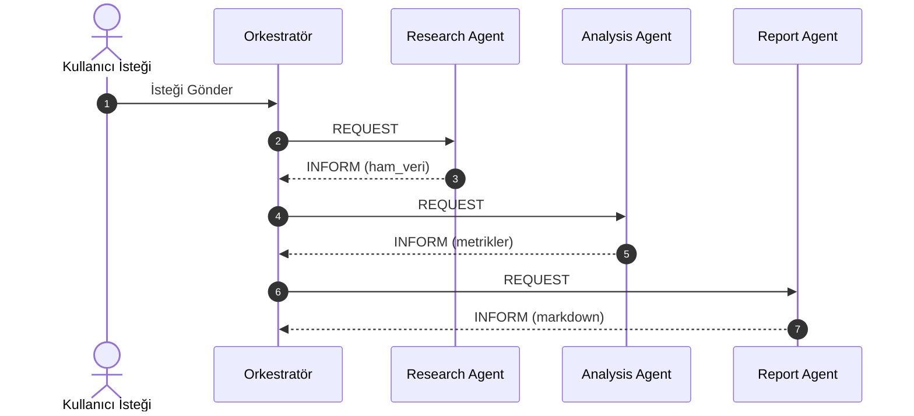

# Ajan İletişim Protokolleri

<!-- toc -->

<br/>
<br/>

Otonom yapay zeka sistemlerinin evrimi, tekil ve monolitik ajanlardan kaçınılmaz olarak **dağıtık çoklu ajan ağlarına (Multi-Agent Systems - MAS)** doğru ilerlemektedir. Tek ajanlı mimarilerde LLM kapalı bir döngüde çalışır: düşünceler üretir, yerel araçları çağırır ve gözlem geri bildirimlerini tek bir büyüyen bağlam penceresine (context window) ekler. Ancak bu merkezi yaklaşım temel mimari sınırlarla karşılaşır: bağlam penceresinin tükenmesi, kuadratik dikkat karmaşıklığı ($O(N^2)$), yıkıcı unutma (catastrophic forgetting) ve operasyonel tek hata noktaları (Single Point of Failure).

Karmaşık bir sistemi uzmanlaşmış, alana göre izole edilmiş ajanlara bölmek bağlam ölçekleme sorununu çözer; ancak beraberinde kritik bir dağıtık sistemler problemini getirir: **Ajanlar Arası İletişim (Inter-Agent Communication)**. Otonom ajanlar bilgiyi nasıl paylaşacak, iş birlikli iş akışlarını nasıl koordine edecek, görev sahipliğini nasıl müzakere edecek ve kilitlenmelere (deadlock), yarış koşullarına (race condition) veya anlamsal kaosa düşmeden kısmi hataları nasıl yönetecektir?

Üretim düzeyindeki çoklu ajan mimarileri katı **iletişim protokolleri** gerektirir: deterministik zarf şemaları (envelope schemas), açık durum makineleri (finite state machines), biçimsel söz eylemleri (performatives) ve dayanıklı aktarım topolojileri.

<br/>
<br/>

---

## 1. Çoklu Ajan İletişim Uzayı

Matematiksel olarak bir çoklu ajan iletişim ağı, yönlendirilmiş bir etkileşim grafiği $\mathcal{G} = (\mathcal{A}, \mathcal{E})$ olarak modellenir:
- $\mathcal{A} = \{A_1, A_2, \dots, A_n\}$ otonom ajanlar kümesini (düğümleri) temsil eder.
- $\mathcal{E} \subseteq \mathcal{A} \times \mathcal{A}$ ajanlar arasındaki geçerli iletişim kanallarını temsil eder.
- Her $A_i$ ajanı kendi özel durumuna $s_i \in \mathcal{S}_i$ ve politikasına $\pi_i$ sahiptir.

$t$ anındaki bir iletişim olayı, $A_i$ ajanından $A_j$ ajanına iletilen bir zarftır: $m_{i \to j}^{(t)} \in \mathcal{M}$. Alıcı $A_j$ ajanının durum geçişi şu fonksiyonla yönetilir:

$$
s_j^{(t+1)} = \delta_j\left(s_j^{(t)}, m_{i \to j}^{(t)}\right)
$$

Burada $\delta_j$, $A_j$ ajanının muhakeme çalışma zamanı tarafından parametrelendirilen durum geçiş fonksiyonudur.

<br/>



<br/>

### 1.1 Yapılandırılmamış Metin vs. Yapılandırılmış Zarflar
Erken aşama prototiplerde ajanlar, ham doğal dil metinlerini doğrudan birbirlerinin sistem istemlerine (prompt) aktararak haberleşirler. Kurumsal üretim ortamlarında **yapılandırılmamış metin değişimi ciddi bir anti-pattern'dir**:
1. **Anlamsal Belirsizlik:** Ham metin; amaç, versiyon, aciliyet veya idempotency anahtarlarını tanımlayan açık meta verilerden yoksundur.
2. **Bağlam Penceresi Kirliliği:** Tüm konuşma geçmişini alt zincirdeki ajanlara iletmek, çok adımlı ajan zincirlerinde token tüketimini katlanarak şişirir.
3. **Ayrıştırma (Parsing) Hataları:** Alt akıştaki ajanlar, yapılandırılmamış konuşma metninden parametreleri ve dönüş durumlarını ayıklamak için boş yere muhakeme token'ları harcamak zorunda kalır.

Üretim düzeyindeki çoklu ajan sistemleri, **taşıma zarfını (meta veri ve protokol)** **yükten (yapılandırılmış anlamsal içerik - payload)** kesin çizgilerle ayırır.

<br/>
<br/>

---

## 2. İletişim Topolojileri ve Koordinasyon Modelleri

Çoklu ajan etkileşiminin tasarımı, temel olarak seçilen mimari topoloji tarafından belirlenir. Ajan koordinasyonunu yöneten üç ana model bulunmaktadır:

<br/>



<br/>

### 2.1 Topoloji Karşılaştırma Matrisi

| Mimari Boyut | Orkestrasyon (Hub-and-Spoke) | Koreografi (Pipeline / Event-Driven) | Blackboard (Paylaşılan Bellek) |
| :--- | :--- | :--- | :--- |
| **Bağımlılık (Coupling)** | Merkezi, katı hiyerarşi | Gevşek, olay güdümlü | Paylaşılan depolama üzerinden ayrık |
| **Gecikme (Latency)** | Orta (Yönetici üzerinden çift sıçrama) | Düşük ($O(1)$ doğrudan geçiş) | Düşük - Orta (DB okuma/yazma) |
| **İzlenebilirlik** | **En Yüksek:** Tüm adımların merkezi denetim kaydı | Orta: Dağıtık izleme (tracing) gerektirir | Yüksek: Durum değişiklikleri DB'de kayıtlı |
| **Hata Etki Alanı (Blast Radius)** | **Yüksek:** Yönetici çökerse tüm sistem durur | **Düşük:** Tek ajanın hatası izole edilip yeniden denenebilir | **Düşük:** Ajanlar bağımsız görevleri sorgular |
| **Hata Kurtarma** | Yönetici tarafından dinamik yeniden planlama | Dead-letter queue ve devre kesiciler (circuit breaker) | Zaman aşımında görevin yeniden kiralanması |
| **Token Maliyeti** | Daha yüksek (Yönetici ara durumları da okur) | Minimum (Yalnızca gereken çıktı aktarılır) | Oldukça verimli (Yalnızca referans/ID aktarılır) |

<br/>
<br/>

---

## 3. Protokol Standartları ve Söz Eylemi (Speech Act) Modeli

Modern ajan iletişimi, teorik temellerini söz eylemi teorisi ve **FIPA-ACL (Foundation for Intelligent Physical Agents - Agent Communication Language)** spesifikasyonundan alır. Her etkileşim, **Performative** adı verilen kasıtlı bir durum tanımlar.

### 3.1 Temel Ajan Eylem Tipleri (Performatives)



- **`REQUEST`**: Gönderen, alıcıdan belirli bir eylemi gerçekleştirmesini talep eder.
- **`AGREE`**: Alıcı, talep edilen görevi yürütmeyi kabul ettiğini teyit eder.
- **`REFUSE`**: Alıcı, yetki, kapasite veya hız sınırı nedeniyle görevi reddeder.
- **`INFORM`**: Gönderen, bir sonucun veya verinin doğruluğunu bildirir (tamamlanan veri yükünü içerir).
- **`FAILURE`**: Alıcı, yürütme sırasında kurtarılamaz bir istisna ile karşılaştığını bildirir.

<br/>

### 3.2 Üretim Düzeyinde Zarf Şeması (Pydantic Uygulaması)

Dağıtık bir kümedeki her ajanlar arası mesaj, doğrulanabilir katı bir kontrata uymalıdır:

```python
from enum import Enum
from typing import Any, Dict, Optional
from pydantic import BaseModel, Field
import uuid, time

class Performative(str, Enum):
    REQUEST = "REQUEST"
    AGREE = "AGREE"
    REFUSE = "REFUSE"
    INFORM = "INFORM"
    FAILURE = "FAILURE"

class AgentMessageEnvelope(BaseModel):
    message_id: str = Field(default_factory=lambda: str(uuid.uuid4()))
    trace_id: str = Field(..., description="OpenTelemetry dağıtık izleme ID'si")
    conversation_id: str = Field(..., description="Mantıksal çok adımlı iş akışı ID'si")
    sender: str = Field(..., description="Kaynak ajan kimliği, örn. 'agent.research.v1'")
    recipient: str = Field(..., description="Hedef ajan kimliği veya yayın için '*'")
    performative: Performative
    protocol: str = Field(default="mf-agent-protocol/1.0")
    timestamp: float = Field(default_factory=time.time)
    reply_to: Optional[str] = Field(None, description="Yanıtlanan mesajın ID'si")
    payload: Dict[str, Any] = Field(default_factory=dict, description="Doğrulanmış veri yükü")
```

<br/>
<br/>

---

## 4. Taşıma Katmanı: Doğrudan RPC vs. Mesaj Kuyrukları

Fiziksel veya mantıksal aktarım mekanizmasının seçimi; bir ajan ağının dayanıklılığını, verimini ve ölçeklenebilirliğini doğrudan belirler.

<br/>



<br/>

### 4.1 Mimari Takas Analizi: API vs. Message Queue

1. **Doğrudan RPC (HTTP / gRPC / WebSocket):**
   - **Artıları:** Milisaniyenin altında bağlantı ek yükü, kolay hata ayıklama, anlık senkron onay.
   - **Eksileri:** Sıkı bağımlılık, dahili tamponlama olmaması (anlık yük patlamalarında HTTP 429/503 hataları), alıcı kapalıysa çağrının anında düşmesi.
2. **Mesaj Kuyruğu (RabbitMQ, Redis Streams, Apache Kafka, NATS):**
   - **Artıları:** Zamansal tam ayrışma, otomatik backpressure yönetimi, en az bir kez teslim garantisi (at-least-once delivery), dinamik işçi havuzu ölçekleme.
   - **Eksileri:** Altyapı yönetimi ek yükü, serileştirme maliyeti, asenkron durum takibi karmaşıklığı.

> **Staff Engineer Kuralı:** Son kullanıcıyla etkileşimde olan ve anlık cevap beklenen akışlarda ($T_{\text{latency}} < 500\text{ ms}$) **Doğrudan gRPC / REST** tercih edilir. Arka planda çalışan, uzun süren, çok turlu ağır ajan iş akışlarında ($T_{\text{execution}} > 3\text{ s}$) **Mesaj Kuyrukları (Redis Streams / RabbitMQ)** zorunludur.

<br/>
<br/>

---

## 5. Eşzamanlılık, Dağıtık Kilitleme ve Çakışma Yönetimi

Birden fazla otonom ajan paylaşılan bir etki alanı üzerinde aynı anda işlem yapmaya çalıştığında (kod tabanını yeniden düzenleme, sipariş güncelleme, kaynak ayırma gibi), **Yarış Koşulları (Race Conditions)** kaçınılmazdır.

<br/>



<br/>

### 5.1 Eşzamanlılık Savunma Stratejileri

#### Strateji 1: Dağıtık Karşılıklı Dışlama (Redis Redlock Modeli)
Belirli bir kaynak anahtarı üzerinde yalnızca tek bir ajanın çalışmasını garanti eder. Bir ajanın çökmesi durumunda sistemin sonsuza kadar kilitli kalmaması için kilide mutlaka bir geçerlilik süresi (Time-To-Live / TTL) atanmalıdır:

```python
import redis

r = redis.Redis(host="localhost", port=6379, db=0)

def acquire_agent_lease(task_id: str, agent_id: str, ttl_seconds: int = 45) -> bool:
    lock_key = f"agent:lock:{task_id}"
    # Atomik SET if Not eXists (NX) ve Expiration (EX)
    return bool(r.set(lock_key, agent_id, nx=True, ex=ttl_seconds))
```

#### Strateji 2: İyimser Eşzamanlılık Kontrolü (Optimistic Concurrency Control - OCC)
İlişkisel veya belge tabanlı veritabanlarında her görev kaydı sürekli artan bir `version` sütunu taşır:

```sql
UPDATE tasks SET status = 'IN_PROGRESS', version = version + 1 WHERE id = 'task-42' AND version = 3;
```

Başka bir ajan bu satırı araya girip güncellediyse `version = 3` koşulu sağlanamaz ve veritabanı 0 güncellenen satır döner. Yarışı kaybeden ajan işlemi güvenle iptal eder veya güncel durumu yeniden okur.

#### Strateji 3: Açık Onaylı Yarışan Tüketiciler (Competing Consumers with ACK)
AMQP (RabbitMQ) veya AWS SQS üzerinde mesajlar havuzdaki yalnızca tek bir işçiye geçici olarak tahsis edilir. İşçi açık bir `ACK` gönderene veya görünürlük zaman aşımı dolana kadar diğer ajanlar o mesajı göremez.

<br/>
<br/>

---

## 6. Gerçek Dünya Mimarisi: 3 Ajanlı İş Birlikli Pipeline

Üretim düzeyindeki protokolleri somutlaştırmak için tiplenmiş mesaj zarfları ve durum doğrulama içeren bir Araştırma-Analiz-Raporlama hattı kuralım:

```python
from typing import Dict, Any

class AgentRouter:
    """Ajanlar arası protokol durum geçişlerini yöneten merkezi yönlendirici."""
    def __init__(self):
        self.mailboxes: Dict[str, list] = {"research": [], "analysis": [], "report": []}

    def dispatch(self, envelope: AgentMessageEnvelope):
        if envelope.recipient not in self.mailboxes and envelope.recipient != "*":
            raise ValueError(f"Bilinmeyen hedef ajan: {envelope.recipient}")
        
        # Protokol kontrolü ve telemetri kaydı
        if envelope.performative == Performative.REQUEST:
            print(f"[TRACE: {envelope.trace_id[:8]}] {envelope.sender} -> {envelope.recipient} : REQUEST")
        elif envelope.performative == Performative.INFORM:
            print(f"[TRACE: {envelope.trace_id[:8]}] {envelope.sender} -> {envelope.recipient} : INFORM (Veri Teslim Edildi)")
            
        self.mailboxes[envelope.recipient].append(envelope)

    def receive(self, agent_name: str) -> Optional[AgentMessageEnvelope]:
        return self.mailboxes[agent_name].pop(0) if self.mailboxes[agent_name] else None
```



<br/>
<br/>

---

## 7. İnteraktif Zorluklar ve Mühendislik Çözümleri

<details>
<summary><strong>Zorluk 1: Araştırma-Analiz-Rapor Üçlüsü İçin İletişim Protokolü Tasarımı</strong></summary>
<br/>

### Senaryo
Üç farklı uzman ajanın bulunduğu bir sistem tasarlayın: Araştırma Ajanı, Analiz Ajanı ve Rapor Yazım Ajanı. Mimari merkezi bir Orkestratör (Hub-and-Spoke) üzerinden mi yoksa otonom bir Koreografi (Bant Hattı) olarak mı akmalıdır? Ara adımlardaki kalite düşüşleri nasıl engellenir?

### Mimari Çözüm
1. **Topoloji Seçimi: Orkestratör (Hub-and-Spoke / Supervisor) Mimarisi:**
   - Bilgi doğruluğunun ve veri bütünlüğünün kritik olduğu kurumsal raporlamalarda **Orkestratör Modeli**, doğrudan ajanlar arası hattan (P2P) tartışmasız daha üstündür.
   - **Kalite Kapısı (Quality Gate):** Eğer Araştırma Ajanı zorunlu olan 3 birincil kaynak yerine yalnızca 1 doğrulanmamış kaynak bulabildiyse, doğrudan P2P hattı bu eksik veriyi Analiz Ajanı'na aktaracak ve ardışık halüsinasyonlara ("Garbage In, Garbage Out") yol açacaktır.
   - Orkestratör burada denetim kapısı işlevi görür: gelen yük şemasını doğrular, kaynak sayısını kontrol eder ve gerekirse Analiz Ajanı'na hiç geçmeden Araştırma Ajanı'na bir `REQUEST (retry)` mesajı döner.
2. **Protokol Durum Makinesi:**
   - **Adım 1:** `Supervisor -> ResearchAgent (REQUEST: search_topics)`
   - **Adım 2:** `ResearchAgent -> Supervisor (INFORM: structured_citations)`
   - **Adım 3:** *Kalite Kapısı Geçildi* $\to$ `Supervisor -> AnalysisAgent (REQUEST: compute_trends)`
   - **Adım 4:** `AnalysisAgent -> Supervisor (INFORM: statistical_aggregates)`
   - **Adım 5:** `Supervisor -> ReportAgent (REQUEST: format_markdown)`
   - **Adım 6:** `ReportAgent -> Supervisor (INFORM: final_artifact)`
3. **İzlenebilirlik:**
   - Tüm zarflar ortak bir `trace_id` taşır. Raporun denetim testinden kalması durumunda hangi adımda veri kalitesinin bozulduğu dağıtık izleme üzerinden anında tespit edilir.
</details>

<br/>

<details>
<summary><strong>Zorluk 2: Message Queue vs. Doğrudan API Çağrıları (Staff Engineer Takas Analizi)</strong></summary>
<br/>

### Senaryo
Ajanlar arası iletişimde dağıtık bir mesaj kuyruğu (RabbitMQ/Kafka/NATS) kullanmak ile doğrudan API çağrıları (REST/gRPC) kullanmanın mimari takasları nelerdir? Hangi durumlarda hangi model tercih edilmelidir?

### Mimari Çözüm
1. **Karar Kriterleri Matrisi:**
   - **Gecikme Bütçesi:** Doğrudan gRPC bağlantıları 10 ms altı gecikmeyle çalışır. Mesaj kuyrukları ise aracı (broker) nedeniyle 15-50 ms ek yük getirir. Kullanıcının ekranda anlık yanıt beklediği sohbet döngülerinde doğrudan çağrılar veya WebSocket zorunludur.
   - **Backpressure ve Yük Patlamaları:** Sisteme aynı anda 500 görev geldiğinde doğrudan API çağrıları alıcı ajan pod'larında bellek tükenmesine (OOM) veya LLM API'larında HTTP 429 Hız Sınırına yol açar. Mesaj kuyrukları bu dalgalanmaları doğal olarak tamponlar; ajanlar kapasitelerine göre (örn. node başına 5 eşzamanlı iş parçacığı) iş çeker.
   - **Dayanıklılık ve Hata Toleransı:** Doğrudan REST çağrısında ajan 45 saniyelik bir çıkarım sırasında çökerse istemciye HTTP 502/504 döner ve hesaplama kaybolur. Mesaj kuyruğunda ise onaylanmamış (`NACK`) mesaj kuyrukta kalır ve ayaktaki başka bir işçi ajan tarafından devralınır.
2. **Hibrit Standart:**
   - Kullanıcı $\leftrightarrow$ Ağ Geçidi (Gateway) Ajanı: **Doğrudan gRPC / SSE (Server-Sent Events)**.
   - Ağ Geçidi $\leftrightarrow$ Arka Plan İşçi Ajanları: **Redis Streams / RabbitMQ AMQP**.
</details>

<br/>

<details>
<summary><strong>Zorluk 3: Paralel Görev Çakışması ve Race Condition Çözümü</strong></summary>
<br/>

### Senaryo
İki bağımsız otonom refactor ajanı, ortak bir Git deposundaki aynı kaynak dosyayı (`src/core/auth.py`) aynı saniyede analiz edip iyileştirmeye kalktığında veri bozulmasını, birleştirme çakışmalarını ve boşa giden LLM maliyetini nasıl engellersiniz?

### Mimari Çözüm
Dağıtık kilitleme ve iyimser versiyonlamayı birleştiren çok katmanlı savunma stratejisi:

1. **Dağıtık Kilit (Katman 1 - Önleme):**
   - Dosyayı indirmeden önce ajan Redis üzerinden dağıtık kilit talep eder:
     `SET lock:file:src/core/auth.py <agent_uuid> NX EX 60`
   - Anahtar zaten varsa ikinci ajan `None` yanıtı alır, bu dosyayı atlar ve iş kuyruğundaki bir sonraki adaya geçer.
2. **İzole Git Dalı (Katman 2 - Yürütme):**
   - Ajanlar asla doğrudan `main` dalına commit atmaz. Her ajan geçici bir dalda çalışır: `agent-refactor/<file_hash>-<agent_uuid>`.
   - Ajan temel commit SHA değerini hafızasında tutar.
3. **Birleştirme Sırasında İyimser Eşzamanlılık Kontrolü (Katman 3 - Doğrulama):**
   - Otomatik PR açılmadan veya merge edilmeden önce CI şu kontrolü yapar:
     ```python
     assert HEAD_base == HEAD_main
     ```
   - Eğer başka bir ajan araya girip `auth.py` dosyasını `main`'e merge ettiyse temel SHA uyuşmazlığı nedeniyle işlem iptal edilir. Bayatlamış çalışma reddedilir ve çakışma oluşması engellenir.
</details>

<br/>
<br/>

---

## 8. Temel Mimari Çıkarımlar

> **Temel Çıkarım:** Çoklu ajan sistemlerinde **iletişim mimarinin ta kendisidir**. Doğal dil her bir modelin kendi içindeki muhakeme yakıtıdır; ancak yüzlerce otonom ajanın çökmeden, deterministik ve güvenli bir şekilde koordine olmasını sağlayan şey yapılandırılmış ve güçlü tiplenmiş protokollerdir (zarflar, söz eylemleri, dağıtık kilitler ve durum makineleri).
