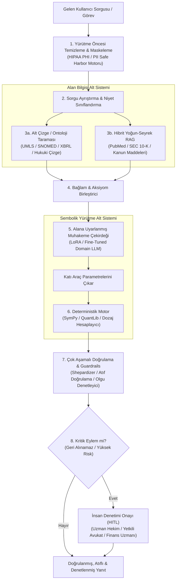
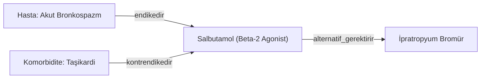
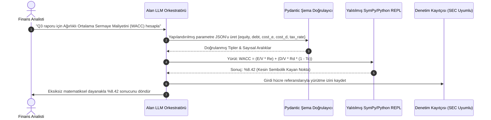

# Alana Özgü Uzman Ajanlar İnşası

<!-- toc -->

<br/>
<br/>

Genel amaçlı Büyük Dil Modelleri (LLM'ler); serbest sohbet, yaratıcı metin üretimi ve geniş kapsamlı anlamsal sentez konularında üstün başarı gösterir. Ancak genel amaçlı bir ajanı **sağlık, hukuk, kantitatif finans ve havacılık mühendisliği** gibi hata toleransı sıfır olan ve sıkı regülasyonlara tabi kurumsal dikey sektörlerde çalıştırmak, standart istem mühendisliği (prompt engineering) yaklaşımlarıyla doğrudan fiyaskoyla sonuçlanır.

Regüle dikey sektörlerde operasyonel hata payı sıfırdır. Uydurulmuş bir mahkeme içtihadı yargı yaptırımlarına ve meslekten men cezalarına yol açabilir (*Mata v. Avianca*); finansal modellemedeki bir aritmetik halüsinasyon SEC bildirimlerini geçersiz kılabilir; yanlış bir ilaç dozu hesabı ya da hasta verisinin (PHI) sızması ise federal yasaları (örneğin HIPAA) ihlal ederek insan hayatını doğrudan tehlikeye atar.

Üretim düzeyinde **Alana Özgü Uzman Ajanlar (Domain-Specific Agents)** inşa etmek; LLM'in tek başına, sınırlandırılmamış bir karar verici olduğu yönündeki yanılgıyı terk etmeyi gerektirir. Uzman ajanlar; biçimsel ontolojileri, alana uyarlanmış gösterimleri, sembolik hesaplama motorlarını ve çok katmanlı regülasyon koruma kalkanlarını (guardrails) birleştiren **deterministik orkestrasyon sistemleri** olarak tasarlanmalıdır.

<br/>
<br/>

---

## 1. Alana Özgü Ajanların Mimari Anatomisi

Alana özgü bir ajan, muhakeme hattını izole edilmiş ve doğrulanabilir alt sistemlere ayırır. Ham doğal dilin denetimsiz bir LLM'e doğrudan akmasına izin vermek yerine; yürütme öncesi temizleme (sanitization), biçimsel ontolojiye bağlama, deterministik araç çağırma ve çok aşamalı denetim guardrail'leri zorunlu tutulur.

<br/>



<br/>

### Parametrik ve Non-Parametrik Hafıza Ayrımı

Prodüksiyon düzeyindeki dikey ajanlar, bilgiyi iki belirgin operasyonel katmana ayırır:

1. **Non-Parametrik Dinamik Bilgi (Geri Getirme & Ontolojiler):**
   - Kanunlar, yargı kararları, klinik araştırma güncellemeleri ve çeyreklik bilançolar sürekli değişir.
   - Değişken dinamik olguları statik model ağırlıklarına gömmek, modelin bayat (stale) bilgiyle akıl yürütmesine neden olur. Tüm dinamik gerçekler dışsal, sürüm kontrollü Bilgi Çizgelerinde ($\mathcal{K}$) ve vektör indekslerinde yaşamalıdır.
2. **Parametrik Yordamsal Bilgi (Domain Adaptörleri):**
   - Model ağırlıkları yalnızca **sektör terminolojisi, sözdizimi, yapısal çıktı şablonları ve özelleşmiş muhakeme sezgisini** öğrenmek için uyarlanır (örneğin klinik notlardaki karmaşık tıbbi kısaltmaları veya hukuki Latince terimleri hatasız anlamak).

<br/>
<br/>

---

## 2. Biçimsel Bilgi Temsili ve Alan Ontolojileri

Standart vektör araması (Dense RAG), yüksek uzmanlık gerektiren alanlarda yetersiz kalır; çünkü gömme uzayındaki kosinüs benzerliği mantıksal ve taksonomik hassasiyetten yoksundur. Tıpta "hipotansiyon" (düşük tansiyon) ve "hipertansiyon" (yüksek tansiyon) kelimeleri paylaştıkları bağlamsal belirteçler nedeniyle neredeyse özdeş vektör temsillerine sahiptir; oysa hipotansiyon hastasına tansiyon düşürücü ilaç vermek ölümcüldür.

Uzman ajanlar bu problemi **Biçimsel Ontolojiler ve Bilgi Çizgeleri (Knowledge Graphs)** ile çözer.

### Bir Alan Bilgi Çizgesinin Matematiksel Formülasyonu

Biçimsel bir alan ontolojisi, kenarları etiketli yönlendirilmiş bir çoklu çizge $\mathcal{O} = (\mathcal{C}, \mathcal{R}, \mathcal{I}, \mathcal{A})$ olarak modellenir:
- $\mathcal{C}$: Kavram sınıfları kümesi (örneğin $\text{Hastalık}, \text{EtkenMadde}, \text{MahkemeKararı}$).
- $\mathcal{R}$: Biçimsel ilişki türleri kümesi (örneğin $\text{kontrendikedir}, \text{hükmü\_bozmuştur}, \text{bağlı\_ortaklığıdır}$).
- $\mathcal{I}$: Temel varlık örnekleri kümesi ($e_i \in \mathcal{I}$).
- $\mathcal{A}$: Mantıksal aksiyomlar ve kural kısıtları kümesi (örneğin $\forall x, y : \text{Bozar}(x, y) \implies \neg\text{Geçerliİçtihat}(y)$).

<br/>

$$
\mathcal{G}_{\text{domain}} = \left\{ (h, r, t) \;\middle|\; h, t \in \mathcal{I},\; r \in \mathcal{R} \right\} \quad \text{koşuluyla:} \quad \mathcal{A} \models \text{Doğru}
$$

<br/>



Ajan bir uzmanlık sorgusunu işlerken, doğal dil varlıklarını standart ontoloji düğümlerine (örneğin UMLS `CUI` kodları veya SNOMED-CT kimlikleri) bağlar. Bu sayede olasılıksal vektör aramasının kaçırdığı katı mantıksal kurallar deterministik çizge algoritmalarıyla doğrudan devreye girer.

<br/>
<br/>

---

## 3. Alan Uyarlama Stratejileri: PEFT/LoRA vs. Dinamik RAG

İnce ayar (fine-tuning) ve geri getirme ile zenginleştirilmiş üretim (RAG) arasında seçim yapmak birbirini dışlayan bir tercih değil; anlamsal uyum ile olgusal değişkenlik arasındaki yapısal bir dengedir.

### Low-Rank Adaptation (LoRA) Formülasyonu

Temel bir modeli ($W_0 \in \mathbb{R}^{d \times k}$) dikey bir sektörel derleme (örneğin SEC finansal bildirimleri veya PubMed makaleleri) için uyarlarken, tüm parametreleri eğitmek hem çok pahalıdır hem de modelin önceki temel yeteneklerini unutmasına (catastrophic forgetting) yol açar. **LoRA**, ağırlık güncelleme matrisi $\Delta W$'yi düşük dereceli iki matrise ayrıştırır:

$$
W = W_0 + \Delta W = W_0 + \frac{\alpha}{r} (B \cdot A)
$$

Burada:
- $W_0 \in \mathbb{R}^{d \times k}$: Dondurulmuş önceden eğitilmiş ağırlıklardır.
- $B \in \mathbb{R}^{d \times r}$ ve $A \in \mathbb{R}^{r \times k}$: Eğitilebilir düşük dereceli adaptör matrisleridir ($r \ll \min(d, k)$).
- $\alpha$: Adaptör etkisini ayarlayan ölçekleme hiperparametresidir.

<br/>

### Uyarlama Karar Matrisi

| Boyut | Standart Bağlam İçi RAG | Alan LoRA / PEFT | Hibrit (KG-RAG + Alan LoRA) |
| :--- | :--- | :--- | :--- |
| **Temel Amaç** | Olgusal dayanak & kaynak atfı | Terminoloji, ton, sözdizimi & çıktı formatı | Üretim düzeyinde dikey muhakeme |
| **Bilgi Güncelliği** | Gerçek zamanlı (anında indeks güncelleme) | Statik (yeniden eğitim gerektirir) | Gerçek zamanlı getirme + özelleşmiş sözdizimi |
| **Token Verimliliği** | Düşük (ağır bağlam maliyeti) | Yüksek (muhakeme ağırlıklarda saklı) | Optimize (kısa ve öz ontoloji bağlamı) |
| **Halüsinasyon Riski** | Orta (bağlam penceresi dikkat dağılması) | Yüksek (olgusal depo olarak kullanılırsa) | En düşük (katı kısıt doğrulaması) |
| **Regülasyon Denetimi** | Açık (doğrudan kaynak bağlantıları) | Kapalı kutu (ağırlıklar denetlenemez) | Tam denetlenebilir (çizge kaynak izi) |

<br/>
<br/>

---

## 4. Deterministik Yürütme ve Sembolik Araç Kullanımı

LLM'ler olasılıksal sonraki belirteç tahmincileridir. Bir LLM'e aritmetik işlemler, portföy risk metrikleri veya ilaç titrasyon formülleri hesaplatmak temel güvenlik kurallarını ihlal eder.

> **Temel İlke:** Bir LLM ASLA dahili olarak niceliksel hesaplama yapmamalı veya sistem durumunu değiştiren işlemleri doğrudan yürütmemelidir. Ajan strictly bir **niyet ayrıştırıcı, varlık çıkarıcı ve orkestratör** olarak çalışır. Tüm hesaplamalar deterministik ve yalıtılmış (sandboxed) çalışma ortamlarına devredilmelidir.

<br/>

$$
\text{Çıktı} = f_{\text{deterministik}}\Big(\text{LLM}_{\text{çıkarım}}(\text{KullanıcıSorgusu}, \mathcal{S}_{\text{şema}})\Big)
$$

<br/>



<br/>
<br/>

---

## 5. Yasal Uyum ve Katı Guardrail Mimarileri

Dikey ajanlar sıkı yasal çerçeveler altında çalışır. Bu çerçevelerin ihlal edilmesi işletmeyi ağır para cezalarına, lisans iptallerine ve hukuki davalara maruz bırakır.

### 1. Sağlık: HIPAA & HITECH (Safe Harbor Anonimleştirme)
HIPAA Gizlilik Kuralı Safe Harbor yöntemine göre (45 CFR § 164.514(b)(2)), 18 açık Korumalı Sağlık Bilgisi (PHI) kategorisi (hasta adları, dosya numaraları, tarihler, posta kodları, iletişim bilgileri vb.) veri yerel sınırların dışına çıkmadan veya model bağlamına girmeden önce **deterministik olarak maskelenmelidir**.

### 2. Finansal Hizmetler: SEC / FINRA / SOX (Denetlenebilirlik ve Dayanak)
Finansal modeller SEC Kuralı 17a-4 ve FINRA düzenlemelerine uymak zorundadır. Ajan tarafından üretilen her finansal metriğin, tam kaynak bildirimine (örneğin *Form 10-K, Madde 8, Konsolide Faaliyet Tabloları, Sayfa 64, Satır 12*) bağlanan değişmez bir denetim izi (audit log) bulunmalıdır.

### 3. Hukuk Pratiği: Meslek İlkeleri ve Shepardizing
Avukatlık meslek etik kurallarına göre mahkemeye doğrulanmamış veya hükmü bozulmuş içtihat sunmak ağır bir mesleki kusurdur. Hukuk ajanları bir **Shepardizing hattı** işletmek zorundadır: atıfta bulunulan her kanun maddesinin veya yargı kararının üst mahkemelerce bozulup bozulmadığını kontrol eden yönlü bir içtihat grafiği taraması.

<br/>
<br/>

---

## 6. Uygulama Mimarisi: Deterministik Alan Ajanı Şablonu

Aşağıda deterministik PHI temizleme, Pydantic tip doğrulaması ve denetimli sembolik hesaplamayı gösteren üretim düzeyinde bir şablon yer almaktadır:

```python
import re
from typing import Literal
from pydantic import BaseModel, Field

class ClinicalDosageRequest(BaseModel):
    patient_synthetic_id: str = Field(..., pattern=r"^SYNTH-[A-Z0-9]{6}$")
    age_years: int = Field(..., ge=0, le=125)
    weight_kg: float = Field(..., gt=0.0, lt=400.0)
    egfr_ml_min: float = Field(..., ge=0.0, description="Tahmini Glomerüler Filtrasyon Değeri")
    drug_code: Literal["DRUG-VANCO-01", "DRUG-AMIK-02"]

class PHISanitizer:
    MRN_REGEX = re.compile(r"\bMRN-?\d{6,8}\b", re.IGNORECASE)
    PHONE_REGEX = re.compile(r"\b(?:\+?1[-. ]?)?\(?([0-9]{3})\)?[-. ]?([0-9]{3})[-. ]?([0-9]{4})\b")

    @classmethod
    def sanitize(cls, text: str) -> str:
        text = cls.MRN_REGEX.sub("[REDACTED_MRN]", text)
        return cls.PHONE_REGEX.sub("[REDACTED_PHONE]", text)

class DeterministicDosageEngine:
    @staticmethod
    def calculate(req: ClinicalDosageRequest) -> dict:
        # Saf deterministik kural motoru (LLM aritmetiği yok)
        if req.egfr_ml_min < 30.0:
            return {"dosage_mg": 500, "interval_hours": 48, "alert": "RENAL_IMPAIRMENT_ADJUSTMENT"}
        elif req.egfr_ml_min < 50.0:
            return {"dosage_mg": 750, "interval_hours": 24, "alert": "MODERATE_ADJUSTMENT"}
        target_mg = min(2000, round(req.weight_kg * 15 / 250) * 250)
        return {"dosage_mg": target_mg, "interval_hours": 12, "alert": "STANDARD_DOSE"}
```

<br/>
<br/>

---

## 7. İnteraktif Challenge & Üretim Düzeyi Uç Durumlar

<br/>

<details>
<summary><strong>Challenge 1: Hukuki Araştırma Ajanı — İçtihat Geçersizliği & Shepardizing Hattı</strong></summary>
<br/>

### Senaryo
Bir avukat ajana şu görevi verir: *"Temyiz aşamasında ara karar temyizi (interlocutory appeal) için emsal Yargıtay kararlarını bul ve açılış savunmasını taslak olarak hazırla."* Ajanın hükmü bozulmuş (overruled) bir içtihadı sunmasını veya uydurma karar numarası üretmesini mimari olarak nasıl engellersiniz?

### Mimari Çözüm
1. **İki Aşamalı İçtihat Doğrulaması:**
   - Sorgu doğrudan doğrulanmış resmi içtihat veritabanına (örneğin Yargıtay/Danıştay veya CourtListener API) gönderilir.
   - Yalnızca resmi kayıt numarası (Esas/Karar/Tarih) eşleşen kararlar geri getirilir.
2. **Deterministik Shepardization Çizge Taraması:**
   - Bulunan karar LLM bağlamına verilmeden önce içtihat geçerlilik grafiğinde sorgulanır:
     ```sql
     SELECT status, overruling_citation 
     FROM legal_precedent_graph 
     WHERE target_citation = '2021/4125' AND relation_type = 'OVERRULED_BY';
     ```
   - Kararın bozulduğunu gösteren bir kenar varsa, karar `GECERSIZ_ICTIHAT` olarak etiketlenir ve bağlamdan derhal çıkarılır.
3. **Çift Aşamalı Dayanak Denetimi (Dual-Pass Grounding):**
   - İkinci bir denetçi model üretilen her hukuki iddianın alıntılanan karardaki varlığını kontrol eder:
     $$\text{CitationGroundingScore} = \frac{\text{Doğrulanan İddialar}}{\text{Toplam Atıflı İddialar}}$$
   - Skoru $1.0$'ın altında kalan her cümle otomatik olarak sansürlenir ve uyarı düşülür.
</details>

<br/>

<details>
<summary><strong>Challenge 2: Sağlık Klinik Karar Desteği — Sınırlı Reçeteleme & Safe Harbor Hattı</strong></summary>
<br/>

### Senaryo
Büyük bir hastane ağı, hekim iş istasyonlarına klinik dokümantasyon ve reçete giriş desteği sağlamak üzere bir yapay zeka ajanı entegre ediyor. Ajanın hasta verilerini dışarı sızdırmasını ve tehlikeli endikasyon dışı (off-label) ilaçlar önermesini nasıl önlersiniz?

### Mimari Çözüm
1. **İstemci Tarafında Safe Harbor Anonimleştirme:**
   - Tüm serbest metin klinik notlar, dış LLM sağlayıcısına iletilmeden önce yerel bir BioBERT NER ve regex hattından geçirilir.
   - 18 HIPAA tanımlayıcısının tümü sentetik belirteçlerle (`[SYNTH_PATIENT_4819]`) değiştirilir.
2. **Klinik Karar Destek Sistemi (CDSS) Katı Kısıtları:**
   - Ajanın araç çalıştırma altyapısı LLM'den tamamen yalıtılır. Ajan bir ilaç önerdiğinde, parametreler FDA/Sağlık Bakanlığı onaylı kural tabanına (örneğin First Databank / RxNorm) iletilir.
   - Şiddetli bir İlaç-İlaç Etkileşimi (Drug-Drug Interaction - DDI) saptanırsa sistem otomatik olarak veto koyar.
3. **Zorunlu İnsan Denetimi (HITL) Kapısı:**
   - Ajanın ürettiği çıktı sistemde yalnızca imzasız bir taslak olarak işaretlenir. Yasa gereği yazılım doğrudan reçete imzalayamaz; yalnızca biyometrik/akıllı kart ile kimliğini doğrulayan hekim reçeteyi onaylayıp sisteme kaydedebilir.
</details>

<br/>

<details>
<summary><strong>Challenge 3: Finansal Kantitatif Analiz — SEC 10-K Ayrıştırma & Sembolik Aritmetik</strong></summary>
<br/>

### Senaryo
Bir serbest yatırım fonu (hedge fund), 500 şirketin çeyreklik 10-Q raporlarından Serbest Nakit Akışı (FCF) metriklerini çekmek ve tarihsel YBBO (CAGR) değerlerini hesaplamak için bir ajan kullanıyor. LLM'ler çok sütunlu tabloları sıklıkla yanlış okur ve aritmetik halüsinasyon üretir. Kesin doğruluk nasıl sağlanır?

### Mimari Çözüm
1. **Yapı Farkındalıklı XBRL / HTML Ayrıştırma:**
   - Ajan düz metin OCR okumayı reddeder; SEC EDGAR sistemindeki makine tarafından okunabilir XBRL bildirimlerini tüketir. Sayılar standart GAAP etiketleriyle (`us-gaap:CashProvidedByUsedInOperatingActivitiesDiscontinuedOperations`) eşleştirilir.
   - Tablo hiyerarşisi ve dipnotlar doğrudan ilişkisel Pandas DataFrame yapılarına dönüştürülür.
2. **Sembolik Kod Üretim Protokolü:**
   - Ajan doğrudan *"Serbest Nakit Akışı 1.42 Milyar Dolardır"* yanıtını üretmek yerine yalıtılmış bir Python betiği yazar:
     ```python
     def compute_fcf(df_cashflow):
         op_cash = df_cashflow.loc['OperatingCashFlow', '2023']
         capex = df_cashflow.loc['CapitalExpenditures', '2023']
         return op_cash - capex
     ```
3. **SEC Denetim İzi Enjeksiyonu:**
   - Hesaplanan her değer şu kriptografik meta veri başlığıyla döndürülür: `SEC_ACCESSION_NUMBER`, `RAPOR_BOLUMU`, `TABLO_HUCRE_KOORDINATLARI` ve `HESAPLAMA_KOD_HASHI`.
</details>

<br/>
<br/>

---

## 8. Temel Mimari Çıkarımlar & Ders Özeti

> **Ana Çıkarım:** Genel amaçlı yapay zekada olasılıksal yaratıcılık arzu edilen bir özelliktir. Ancak alana özgü kurumsal ajanlarda **sınırlandırılmamış yaratıcılık ölümcül bir kusurdur**. Başarılı dikey ajanlar daha büyük modellerle ya da daha uzun istemlerle değil; katı yapısal disiplinle var olur: bilgi temsili için biçimsel ontolojiler, kesin hesaplama için sembolik araçlar ve yasal uyum için ödünsüz regülasyon kalkanları.
