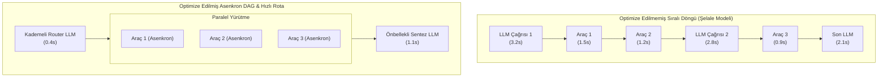
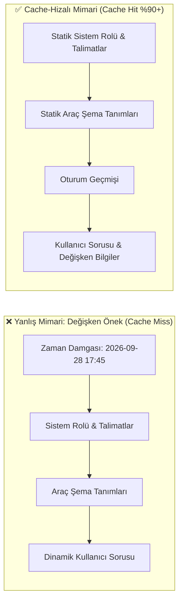
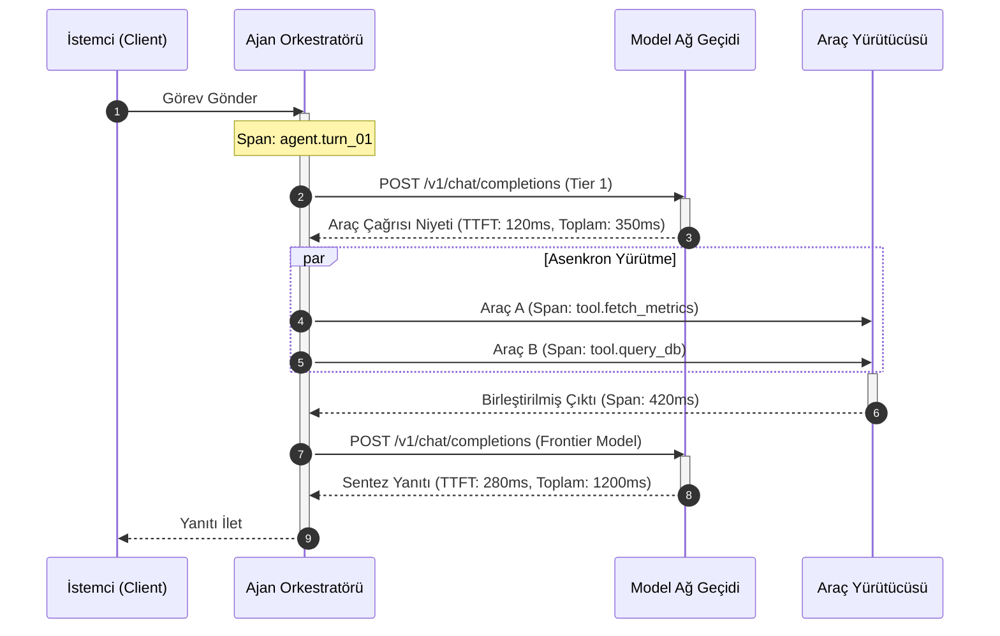
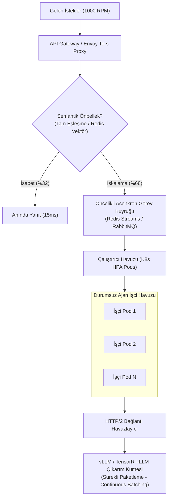

# Ajan Performans Optimizasyonu

<!-- toc -->

<br/>
<br/>

Otonom bir yapay zeka ajanını üretim ortamına (production) taşımak, sistemin performans profilini tekil bir istek-yanıt (request-response) döngüsünden çok adımlı, dinamik ve kestirilemeyen bir geri besleme döngüsüne dönüştürür. Basit ve optimize edilmemiş bir uygulamada; her biri 2.5 saniyelik Büyük Dil Modeli (LLM) çıkarımı ve 1.2 saniyelik araç (tool) çalıştırması içeren 4 adımlı bir akıl yürütme döngüsü, toplamda 15 saniyenin üzerinde uçtan uca gecikmeye (latency) yol açar. Etkileşimli son kullanıcı sistemlerinde ve yüksek işlem hacimli kurumsal servislerde bu seviyedeki bir gecikme; kullanıcı deneyimini zedeler, bağlantı havuzlarını (connection pools) kilitler ve sunucu/token maliyetlerini katlar.

Ajan mimarilerini optimize etmek, basit prompt mühendisliğinin çok ötesinde sistem mühendisliği yaklaşımları gerektirir. Üretim düzeyindeki sistemler; **deterministik gecikme bütçelemesi, asenkron Yönlü Döngüsüz Çizge (DAG) çizelgelemesi, KV-cache önek (prefix) hizalaması, spekülatif model yönlendirmesi ve dağıtık izleme (distributed tracing)** disiplinleriyle inşa edilmelidir.

<br/>
<br/>

---

## 1. Ajan Performansının Anatomisi & Darboğaz Ayrıştırması

Otonom bir ajanın uçtan uca işlem süresi ($T_{\text{ajan}}$); ağ iletimi, ardışık sinirsel kod çözme (autoregressive decoding), harici I/O operasyonları ve orkestrasyon genel giderlerinin toplamından oluşur.

<br/>

### Gecikme Ayrıştırmasının Matematiksel Modeli

$K$ iteratif döngü boyunca çalışan bir ajan rotası için toplam işlem süresi şu şekilde formüle edilir:

$$
T_{\text{ajan}} = \sum_{k=1}^{K} \left( T_{\text{prefill}}^{(k)} + N_{\text{gen}}^{(k)} \cdot T_{\text{decode}}^{(k)} + \sum_{j=1}^{M_k} T_{\text{tool}}^{(k, j)} + T_{\text{overhead}}^{(k)} \right)
$$

Burada:
- $T_{\text{prefill}}^{(k)}$, $k$'ıncı adım için **İlk Belirtece Kadar Geçen Süredir (Time-to-First-Token - TTFT)**. Prompt uzunluğu ve önbellek verimliliği tarafından belirlenir.
- $N_{\text{gen}}^{(k)}$, üretilen belirteç (token) adedidir.
- $T_{\text{decode}}^{(k)}$, **Belirteç Başına Çözümleme Süresidir (Time-Per-Output-Token - TPOT)**. Ağırlıklı olarak GPU bellek bant genişliğine bağlıdır.
- $M_k$, $k$'ıncı döngüde tetiklenen araç sayısıdır.
- $T_{\text{tool}}^{(k, j)}$, $j$ aracının gerçek çalışma süresidir.
- $T_{\text{overhead}}^{(k)}$, serileştirme, Pydantic şema doğrulaması ve güvenlik denetimi gecikmesidir.

<br/>



<br/>

### Temel Performans Darboğazı Sınıfları

1. **Karesel Prefill Cezası:** Ajan geçmişi tekrarlayan araç çıktıları ve kullanıcı konuşmalarıyla büyüdükçe, önbelleğe alınmamış prompt işleme maliyeti standart dikkat mekanizmalarında $O(L^2)$ karesel olarak artar.
2. **Senkron Araç Sıralaması:** Birbirinden bağımsız dış I/O görevlerini art arda çalıştırmak gereksiz kuyruk gecikmeleri yaratır.
3. **Aşırı Parametreli Model İsrafı:** Basit bir JSON çıkarma veya niyet sınıflandırması için 70B+ parametreli ağır modelleri çağırmak, 8B modellerin 10 katı gecikme üretir.
4. **Soğuk KV-Cache Dağılması:** Prompt başlangıcına sürekli değişen dinamik zaman damgaları (timestamp) veya oturum kimlikleri eklemek, sunucu tarafındaki KV önbelleğini tamamen geçersiz kılar.

---

## 2. Gecikme Optimizasyonu: Asenkron Yürütme & DAG Çizelgelemesi

Ajan tek bir düşünme adımında birden fazla araç çağrısına karar verdiğinde, ilkel sistemler bunları tek tek çalıştırır. Üretim sistemlerinde araçlar bir **Yönlü Döngüsüz Çizge (DAG)** olarak modellenir.

<br/>

### Bağımlılık Temelli Eşzamanlılık

Parametreleri birbirinden bağımsız olan araçlar bloklanmayan (non-blocking) asenkron döngülerle aynı anda yürütülür. Sadece bir önceki aracın çıktısına ihtiyaç duyan araçlar bekletilir.

```python
import asyncio
from typing import Any, Callable, Coroutine

class AsyncToolDispatcher:
    """Eşzamanlılık sınırlandırmalı bloklanmayan araç yöneticisi."""
    def __init__(self, max_concurrency: int = 5):
        self.semaphore = asyncio.Semaphore(max_concurrency)

    async def execute_tool(self, name: str, func: Callable[..., Coroutine[Any, Any, Any]], *args) -> Any:
        async with self.semaphore:
            try:
                return await asyncio.wait_for(func(*args), timeout=3.5)
            except asyncio.TimeoutError:
                return {"error": f"'{name}' aracı 3.5s SLA süresini aştı."}

    async def dispatch_parallel(self, calls: list[tuple[str, Callable, tuple]]) -> list[Any]:
        tasks = [self.execute_tool(name, fn, *args) for name, fn, args in calls]
        return await asyncio.gather(*tasks, return_exceptions=False)
```

<br/>

> **Kritik Çıkarım:** Eşzamanlılık mutlaka `Semaphore` ile sınırlandırılmalıdır. Sınırsız `asyncio.gather` çağrıları, harici API'larda HTTP 429 (Too Many Requests) kaskadlarına ve sistem kilitlenmelerine sebep olur.

---

## 3. KV-Cache Optimizasyonu & Prompt Mimarisi

Modern çıkarım sunucuları (vLLM, TensorRT-LLM, Anthropic/OpenAI prompt caching), paylaşılan belirteç dizilerini bellekte tutmak için **Önek Önbellekleme (Prefix Caching)** uygular. Ortak belirteç öneki GPU belleğinde mevcutsa, prefill hesaplaması $O(L)$ karmaşıklığından $O(1)$ bellek erişimine düşer.

<br/>

### Önek Hizalama Dinamikleri

Önbellekli prefill gecikme fonksiyonu şu şekilde modellenir:

$$
T_{\text{prefill}} = (1 - h) \cdot \tau_{\text{cold}}(L) + h \cdot \tau_{\text{cached}}
$$

Burada $h \in [0, 1]$ önbellek isabet oranı (cache hit ratio), $\tau_{\text{cold}}$ hesaplama-bağımlı soğuk başlangıç süresi, $\tau_{\text{cached}}$ ise mikro-saniyelik arama gecikmesidir ($\tau_{\text{cached}} \ll \tau_{\text{cold}}$).



<br/>

### Bağlam Budama & Pencere Sıkıştırma

Gereksiz bağlam birikimi gecikmeyi artırdığı gibi çıkarım kalitesini de zayıflatır. Üretim ajanları şu budama kurallarını uygular:
- **Gözlem Maskeleme (Observation Masking):** Araç çıktılarındaki gereksiz HTTP başlıkları, ham HTML etiketleri ve tekrarlayan üst veriler temizlenir.
- **Özet Çapalı Kayan Pencere:** İlk hedef ve son $N$ etkileşim turu korunurken, aradaki adımlar yapılandırılmış durum özetleriyle değiştirilir.

---

## 4. İşlem Hacmi (Throughput) Mühendisliği & Model Kademelendirme

Sistemi saniyede onlarca, dakikada binlerce isteğe ölçeklemek hem ağ katmanının hem de model atama mantığının optimize edilmesini gerektirir.

<br/>

### HTTP/2 Bağlantı Havuzu (Connection Pooling)

Her LLM çağrısında sıfırdan TCP/TLS el sıkışması yapmak çağrı başına 100–300 ms ek gecikme ekler. Kalıcı HTTP/2 bağlantı havuzları (`keep-alive`) ağ kurulum masrafını tamamen ortadan kaldırır.

<br/>

### Semantik Model Kademelendirme (Spekülatif Yönlendirme)

Her ajan adımı ağır muhakeme modelleri gerektirmez. Yüksek işlem hacimli mimariler iki kademeli yönlendirme kullanır:

1. **Kademe 1 (Hızlı Sınıflandırıcı - 8B Modeller):** Şema doğrulama, niyet belirleme, alt görev ayrıştırma ($< 150\text{ ms}$).
2. **Kademe 2 (Çekirdek Akıl Yürütme Modeli - 70B+):** Karmaşık araç çıktılarının analizi ve stratejik sentez ($1.5 - 3.5\text{ s}$).

```python
from pydantic import BaseModel

class RouteDecision(BaseModel):
    is_complex: bool
    target_tier: str

async def route_query(query: str, fast_client, frontier_client) -> str:
    """Sorguyu karmaşıklığına göre yönlendirerek maliyet ve gecikmeyi düşürür."""
    # Hızlı rota: Düşük karmaşıklıktaki görevler küçük modelle çözülür
    decision = await fast_client.classify(query)
    if not decision.is_complex:
        return await fast_client.generate(query)
    
    # Ağır rota: Yüksek muhakeme gerektiren görevler büyük modele iletilir
    return await frontier_client.generate(query)
```

---

## 5. Profil Çıkarma (Profiling) & Üretim Ortamı İzlenebilirliği

Ajan davranışları ayrıştırılmış dağıtık izleme (distributed tracing) olmadan optimize edilemez. Standart APM araçları LLM adımlarını tek parça HTTP çağrısı gibi gördüğünden yetersiz kalır.

<br/>



<br/>

### Kritik Ajan Telemetri Metrikleri

| Metrik | Hedef SLA | Teşhis Değeri |
| :--- | :--- | :--- |
| **TTFT (İlk Belirteç Süresi)** | $< 400\text{ ms}$ | Prompt önbellekleme sağlığı ve prefill performansı. |
| **TPOT (Belirteç Başına Süre)** | $< 25\text{ ms/tok}$ | GPU bellek bant genişliği ve model motoru doygunluğu. |
| **Araç Süresi Oranı ($R_{\text{tool}}$)** | $< \%35$ | Dış I/O ile zihinsel muhakeme arasındaki süre dengesi. |
| **Döngü Sayısı ($K$)** | $\le 3\text{ döngü}$ | Ajanın hedefe sapmadan ulaşma kararlılığı. |
| **Önbellek İsabet Oranı ($h$)** | $\ge \%85$ | Prompt önek determinizmi ve KV-cache kullanımı. |

---

## 6. Resmi Challenge Senaryoları & Çözümleri

<br/>

<details>
  <summary><strong>Senaryo 1: 10 Saniye Süren Bir Ajan Pipeline'ını Profilleme ve İyileştirme</strong></summary>
  <br/>

**Problem:** Canlı ortamdaki bir müşteri asistanı ajanı ortalama 10.2 saniyede yanıt vererek kullanıcı terk oranını artırmaktadır. Sistemin darboğazını tespit edip süreyi 3 saniyenin altına çekmeniz istenmektedir.

**Mühendislik Analizi ve Çözüm Adımları:**

1. **Dağıtık Span Dökümü (Profiling):**
   OpenTelemetry kullanarak `prefill`, `generation`, `tool_io` ve `serialization` adımlarını ölçün:
   ```
   Toplam İşlem Süresi: 10,200ms
   ├── LLM Çağrısı 1 (Niyet & Planlama): 2,400ms (TTFT: 1,800ms | Gen: 600ms) <-- Darboğaz A
   ├── Sıralı Araç Yürütme:              4,600ms                                <-- Darboğaz B
   │   ├── Araç A (REST API): 2,100ms
   │   └── Araç B (SQL DB):   2,500ms
   └── LLM Çağrısı 2 (Sonuç Sentezi):    3,200ms (TTFT: 2,200ms | Gen: 1,000ms) <-- Darboğaz C
   ```

2. **Uygulanan Optimizasyonlar:**
   - **Darboğaz A Çözümü (Soğuk Prefill):** Prompt başındaki dinamik zaman damgasını prompt sonuna taşıyın. Statik sistem talimatlarını ve araç şemalarını başa alarak %85+ KV-cache isabeti sağlayın. TTFT 1,800 ms'den 250 ms'ye düşer.
   - **Darboğaz B Çözümü (Senkron Araçlar):** Araç A ve Araç B çağrılarını `asyncio.gather()` ile paralel hale getirin. İki bağımsız aracın süresi toplamdan maksimuma iner ($2,100\text{ms} + 2,500\text{ms} \rightarrow 2,500\text{ms}$). Araç A'ya HTTP/2 connection pooling eklenerek 600 ms'ye, Araç B SQL sorgusuna indeks eklenerek 300 ms'ye indirilir.
   - **Darboğaz C Çözümü (Gereksiz Belirteç Üretimi):** Sentez modelinin gevezeliğini önlemek için kesin Pydantic JSON şeması ve `max_tokens=150` sınırlaması getirin. Üretim süresi 1,000 ms'den 320 ms'ye iner.

**Sonuç:** Uçtan uca yanıt süresi **10,200 ms'den 1,920 ms'ye düşürülmüştür** (%81.2 iyileşme).
</details>

<br/>

<details>
  <summary><strong>Senaryo 2: Dakikada 1000 İstek (1000 RPM) İçin Ajan Kümesi Mimarisi</strong></summary>
  <br/>

**Problem:** Şirket içi destek ajanının saniyede ~16.7 istek (1000 RPM) alan yoğun bir yük altında çökmeden ve sağlayıcı rate-limit sınırlarına takılmadan çalışması gerekmektedir.

**Mimari Tasarım:**



1. **İki Aşamalı Önbellek Katmanı:**
   İsteklerin %30-35'ini karşılayan sık tekrarlanan sorular için SHA-256 tam eşleşme ve Redis vektör benzerlik önbelleği ($\cos \theta \ge 0.96$) kurun. Bu sorgular modele gitmeden $< 25\text{ ms}$ içinde yanıtlanır.
2. **Kuyruk Tabanlı Yük Dengeleme:**
   Gelen trafiği doğrudan LLM'e göndermek yerine Redis Streams / RabbitMQ arkasına alın. İşçiler kapasitelerine göre kuyruktan görev çekerek sağlayıcı tarafındaki HTTP 429 patlamalarını engeller.
3. **Sürekli Paketleme (Continuous Batching):**
   Önbellekten dönmeyen istekleri vLLM kümesine yönlendirin. vLLM'in PagedAttention tabanlı iterasyon seviyesinde dinamik paketleme mekanizması, gelen istekleri devam eden GPU döngülerine anında enjekte ederek statik paketlemeye göre $4\times - 8\times$ daha yüksek işlem hacmi sağlar.
</details>

<br/>

<details>
  <summary><strong>Senaryo 3: Gecikme (Latency) vs. Maliyet (Cost) Ödünleşim Analizi</strong></summary>
  <br/>

**Problem:** Finansal araştırma ajanı tasarlıyorsunuz. Yönetim hem saniyenin altında gecikme hem de minimum operasyon maliyeti talep ediyor. Bu iki zıt hedefi mühendislik açısından nasıl dengelersiniz?

**Ödünleşim (Trade-Off) Karar Matrisi:**

| Mimari Tercih | Gecikme Etkisi | Maliyet Etkisi | Karar Kriteri |
| :--- | :--- | :--- | :--- |
| **Spekülatif Kod Çözme (Speculative Decoding)** | **Gecikmeyi %40-60 azaltır** (küçük taslak model belirteç önerir, büyük model onaylar). | **Hesaplama maliyetini %15-25 artırır** (reddedilen belirteçler ve iki model çalıştırma maliyeti). | Kullanıcıyla anlık sohbet eden kritik gelir getirici arayüzlerde tercih edilir. |
| **Prompt Önbellekleme (KV Caching)** | **TTFT süresini %70-90 düşürür.** | **Girdi token maliyetini %50-80 ucuzlatır.** | **Mutlak strateji:** Her durumda uygulanmalıdır. Hem hızda hem maliyette kazanç sağlar. |
| **Model Kuantizasyonu (FP8 / AWQ 4-bit)** | Bellek bant genişliği rahatladığı için **TPOT hızını 2 katına çıkarır**. | **GPU VRAM ihtiyacını yarıya indirir**, altyapı maliyetini %50 azaltır. | Görev doğruluğu kaybı %1'in altında kaldığı sürece tercih edilmelidir. |
| **Paralel Çoklu Ajan Tartışması** | Eşzamanlı analiz sayesinde **duvar saati süresini kısaltır**. | Ajan sayısıyla doğru orantılı olarak **token harcamasını $O(M)$ katlar**. | Yalnızca yüksek riskli denetim görevlerinde (dolandırıcılık tespiti vb.) kullanılmalı, rutin yanıtlarda kaçınılmalıdır. |

**Sentez Kuralı:** Donanım büyütmeye gitmeden önce; prompt öneklerini hizalayarak önbellek isabetini >%80 seviyesine çıkarın, sürekli paketleme (continuous batching) uygulayın ve hafif görevleri küçük modellere yönlendirin.
</details>
